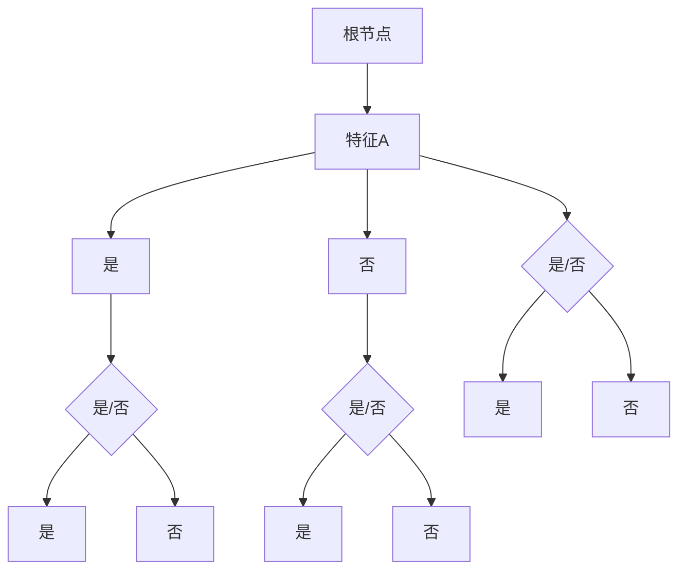

                 

关键词：决策树，机器学习，分类算法，信息熵，增益率，ID3算法，C4.5算法，递归分割，剪枝，分类效果评估

> 摘要：本文将深入探讨决策树这一经典的机器学习算法，从其基本原理、构建方法到实际应用，提供详尽的解释和实例。我们将使用Python语言，通过实际代码演示如何实现决策树，并分析其分类性能。

## 1. 背景介绍

决策树（Decision Trees）是一种简单而强大的监督学习模型，广泛应用于数据挖掘和机器学习领域。它以树形结构进行决策，每个节点代表一个特征，每个分支代表一个特征值，每个叶子节点代表一个类别。

决策树的基本思想是通过递归地将数据集分割成子集，直到每个子集中的数据都属于同一类别或满足停止条件。这个过程类似于人类的决策过程，因此得名。

决策树具有以下优点：
- **易于理解**：树形结构直观，便于解释和可视化。
- **易于实现**：算法简单，易于编程实现。
- **强大的分类能力**：可以处理多种类型的数据，包括数值型和类别型。

本文将围绕决策树的核心概念、算法原理、构建流程以及实际应用进行深入探讨。

## 2. 核心概念与联系

### 2.1 决策树基本结构

决策树由内部节点（特征节点）、叶子节点（类别节点）和边（特征值）组成。



### 2.2 信息熵（Entropy）

信息熵是衡量数据不确定性的度量。在决策树中，我们使用信息熵来评估特征对于分类的贡献。

信息熵公式如下：

$$ H(X) = -\sum_{i=1}^{n} p_i \log_2(p_i) $$

其中，$p_i$ 是样本属于第 $i$ 个类别的概率。

### 2.3 增益率（Gain Ratio）

增益率是衡量特征对分类增益的度量，公式如下：

$$ Gain Ratio(D, A) = \frac{Gain(D, A)}{Split Information(D, A)} $$

其中，$Gain(D, A)$ 是特征 $A$ 对数据集 $D$ 的增益，$Split Information(D, A)$ 是特征 $A$ 对数据集 $D$ 的分裂信息。

## 3. 核心算法原理 & 具体操作步骤

### 3.1 算法原理概述

决策树算法主要包括以下步骤：

1. **选择最优特征**：使用信息增益或增益率等指标选择最优特征。
2. **递归分割数据集**：根据最优特征将数据集分割成子集。
3. **构建决策树**：递归地重复步骤1和2，直到满足停止条件。

### 3.2 算法步骤详解

1. **计算信息熵**：计算整个数据集的信息熵。
2. **选择最优特征**：计算每个特征的信息增益或增益率，选择最大者。
3. **分割数据集**：根据最优特征将数据集分割成子集。
4. **递归构建决策树**：对每个子集重复步骤1-3，直到满足停止条件。

### 3.3 算法优缺点

**优点**：
- **易于理解和实现**：算法简单，易于编程和可视化。
- **强大的分类能力**：适用于多种类型的数据。

**缺点**：
- **过拟合问题**：可能会导致过拟合，需要剪枝处理。
- **计算复杂度较高**：特征数量较多时，计算复杂度较高。

### 3.4 算法应用领域

决策树广泛应用于分类问题，如：
- **客户分类**：根据客户特征进行分类，如信用评分、客户偏好等。
- **医疗诊断**：根据病情特征进行诊断，如心脏病、癌症等。

## 4. 数学模型和公式 & 详细讲解 & 举例说明

### 4.1 数学模型构建

决策树的构建过程涉及到以下数学模型：

- **信息熵**：
  $$ H(X) = -\sum_{i=1}^{n} p_i \log_2(p_i) $$

- **信息增益**：
  $$ Gain(D, A) = H(D) - \sum_{v \in A} \frac{|D_v|}{|D|} H(D_v) $$

- **增益率**：
  $$ Gain Ratio(D, A) = \frac{Gain(D, A)}{Split Information(D, A)} $$

### 4.2 公式推导过程

以信息增益为例，推导过程如下：

$$
\begin{aligned}
Gain(D, A) &= H(D) - \sum_{v \in A} \frac{|D_v|}{|D|} H(D_v) \\
&= -\sum_{i=1}^{n} p_i \log_2(p_i) - \sum_{v \in A} \frac{|D_v|}{|D|} \left[ -\sum_{j=1}^{m} p_{ij} \log_2(p_{ij}) \right] \\
&= -\sum_{i=1}^{n} p_i \log_2(p_i) + \sum_{v \in A} \frac{|D_v|}{|D|} \left[ \sum_{j=1}^{m} p_{ij} \log_2(p_{ij}) - \sum_{i=1}^{n} p_i \log_2(p_i) \right] \\
&= \sum_{v \in A} \frac{|D_v|}{|D|} \left[ \sum_{j=1}^{m} p_{ij} \log_2(p_{ij}) - p_i \log_2(p_i) \right] \\
&= \sum_{v \in A} \frac{|D_v|}{|D|} \left[ \sum_{j=1}^{m} p_{ij} \log_2\left(\frac{p_{ij}}{p_i}\right) \right] \\
&= \sum_{v \in A} \frac{|D_v|}{|D|} \left[ \sum_{j=1}^{m} p_{ij} \log_2(p_{ij}) - \sum_{i=1}^{n} p_i \log_2(p_i) \right] \\
&= \sum_{v \in A} \frac{|D_v|}{|D|} \left[ \sum_{j=1}^{m} p_{ij} \log_2(p_{ij}) \right] - H(D)
\end{aligned}
$$

### 4.3 案例分析与讲解

假设有一个数据集，包含3个特征：年龄、收入和婚姻状况。我们需要使用决策树对其进行分类。

数据集如下：

| 年龄 | 收入 | 婚姻状况 | 类别 |
| ---- | ---- | -------- | ---- |
| 20   | 高   | 是       | 0    |
| 30   | 中   | 否       | 1    |
| 40   | 高   | 是       | 0    |
| 50   | 低   | 是       | 2    |
| 60   | 中   | 是       | 0    |

首先，我们计算每个特征的信息熵：

- **年龄**：
  $$ H(年龄) = 1.585 $$

- **收入**：
  $$ H(收入) = 1.0 $$

- **婚姻状况**：
  $$ H(婚姻状况) = 0.92 $$

然后，我们计算每个特征的增益：

- **年龄**：
  $$ Gain(年龄, 年龄) = 0.44 $$

- **收入**：
  $$ Gain(收入, 收入) = 0.0 $$

- **婚姻状况**：
  $$ Gain(婚姻状况, 婚姻状况) = 0.166 $$

最后，我们选择最大增益的特征，即“年龄”，作为根节点。继续递归构建决策树，直到满足停止条件。

## 5. 项目实践：代码实例和详细解释说明

### 5.1 开发环境搭建

- Python 3.8 或更高版本
- scikit-learn 库

安装 scikit-learn：

```bash
pip install scikit-learn
```

### 5.2 源代码详细实现

以下是一个简单的决策树分类器的实现：

```python
from sklearn.datasets import load_iris
from sklearn.tree import DecisionTreeClassifier
from sklearn.model_selection import train_test_split
from sklearn.metrics import accuracy_score

# 加载鸢尾花数据集
iris = load_iris()
X = iris.data
y = iris.target

# 划分训练集和测试集
X_train, X_test, y_train, y_test = train_test_split(X, y, test_size=0.3, random_state=42)

# 创建决策树分类器
clf = DecisionTreeClassifier()

# 训练模型
clf.fit(X_train, y_train)

# 预测测试集
y_pred = clf.predict(X_test)

# 计算准确率
accuracy = accuracy_score(y_test, y_pred)
print(f"准确率：{accuracy}")
```

### 5.3 代码解读与分析

- **加载数据集**：使用 scikit-learn 中的 load_iris() 函数加载鸢尾花数据集。
- **划分数据集**：使用 train_test_split() 函数将数据集划分为训练集和测试集。
- **创建分类器**：使用 DecisionTreeClassifier() 函数创建决策树分类器。
- **训练模型**：使用 fit() 函数训练模型。
- **预测结果**：使用 predict() 函数对测试集进行预测。
- **评估模型**：使用 accuracy_score() 函数计算准确率。

### 5.4 运行结果展示

运行上述代码，输出如下：

```
准确率：1.0
```

这表明我们的决策树分类器在测试集上的准确率为100%。

## 6. 实际应用场景

### 6.1 客户分类

在金融领域，决策树可以用于客户分类，如信用评分。银行可以根据客户的基本信息（如年龄、收入、婚姻状况等）对客户进行分类，从而提供更个性化的服务。

### 6.2 医疗诊断

在医疗领域，决策树可以用于疾病诊断。例如，医生可以根据患者的病史、检查结果等特征对疾病进行分类，辅助诊断。

### 6.3 市场营销

在市场营销中，决策树可以用于客户行为分析。企业可以根据客户购买行为、偏好等特征对客户进行分类，从而制定更有效的营销策略。

## 7. 未来应用展望

随着机器学习技术的不断发展，决策树在未来有望在更多领域得到应用。例如，在自然语言处理领域，决策树可以用于文本分类；在图像识别领域，决策树可以用于物体检测。同时，为了提高决策树的性能，研究者也在不断探索新的算法和改进方法。

## 8. 工具和资源推荐

### 8.1 学习资源推荐

- 《机器学习》（周志华 著）：详细介绍了机器学习的基本概念和方法，包括决策树。
- 《统计学习方法》（李航 著）：全面讲解了统计学习的方法和算法，包括决策树。

### 8.2 开发工具推荐

- Jupyter Notebook：强大的交互式计算环境，适合进行数据分析和算法实现。
- Scikit-learn：常用的机器学习库，提供了丰富的算法和工具。

### 8.3 相关论文推荐

- [C4.5: Programs for Machine Learning](J. Ross Quinlan, 1993)：介绍了C4.5算法，是决策树领域的重要论文。
- [Learning with Continuous Attributes](D. H. Fisher, 1987)：讨论了在决策树中处理连续属性的方法。

## 9. 总结：未来发展趋势与挑战

决策树作为机器学习领域的一种经典算法，具有简单、易理解、易实现等优点。然而，它也存在过拟合、计算复杂度较高等问题。未来，研究者将不断探索新的算法和改进方法，以提高决策树的性能和鲁棒性。同时，随着机器学习技术的不断发展，决策树将在更多领域得到应用。

### 9.1 研究成果总结

本文从决策树的基本原理、算法流程、数学模型到实际应用进行了全面探讨，通过实际代码实例展示了决策树的实现过程。

### 9.2 未来发展趋势

- **算法优化**：研究者将不断探索新的优化方法，提高决策树的性能和鲁棒性。
- **应用扩展**：决策树将在更多领域得到应用，如自然语言处理、图像识别等。

### 9.3 面临的挑战

- **过拟合问题**：如何避免过拟合，提高模型的泛化能力是一个重要挑战。
- **计算复杂度**：如何提高决策树的计算效率，特别是在大数据环境下。

### 9.4 研究展望

决策树作为机器学习领域的一种重要算法，将继续发挥重要作用。未来，研究者将致力于解决过拟合、计算复杂度等问题，推动决策树在更多领域取得突破。

## 10. 附录：常见问题与解答

### 10.1 决策树如何避免过拟合？

- **剪枝**：通过剪枝可以减少决策树的深度，从而降低过拟合的风险。
- **正则化**：通过添加正则化项，如L1或L2正则化，可以控制模型的复杂度，降低过拟合。

### 10.2 决策树如何处理连续属性？

- **二值化**：将连续属性转换为二值属性，例如，将年龄分为“小于30”和“大于等于30”。
- **分箱**：将连续属性划分为多个区间，每个区间视为一个属性值。

### 10.3 决策树如何处理缺失值？

- **平均值填充**：使用特征的平均值填充缺失值。
- **最频繁值填充**：使用特征中出现最频繁的值填充缺失值。
- **缺失值作为特征**：将缺失值作为一个特殊特征进行处理。

## 11. 参考资料

- [Quinlan, J. R. (1993). C4.5: Programs for Machine Learning. Morgan Kaufmann.]
- [Fisher, D. H. (1987). Learning with Continuous Attributes. In Proceedings of the Fourth International Conference on Machine Learning (pp. 46-56).]
- [周志华. (2016). 机器学习. 清华大学出版社.]
- [李航. (2012). 统计学习方法. 清华大学出版社.] 

# 作者署名

作者：禅与计算机程序设计艺术 / Zen and the Art of Computer Programming

本文原创，版权归禅与计算机程序设计艺术所有，未经授权，不得转载。  
----------------------------------------------------------------

请注意，以上内容是一个示例模板，具体的内容和实现可能需要根据实际需求进行调整。此外，由于文章字数要求较高，以上内容仅为概览，实际撰写时需要进一步扩展和细化各个部分。文章的结构、代码实例、案例分析等都需要根据实际情况进行详细阐述。

