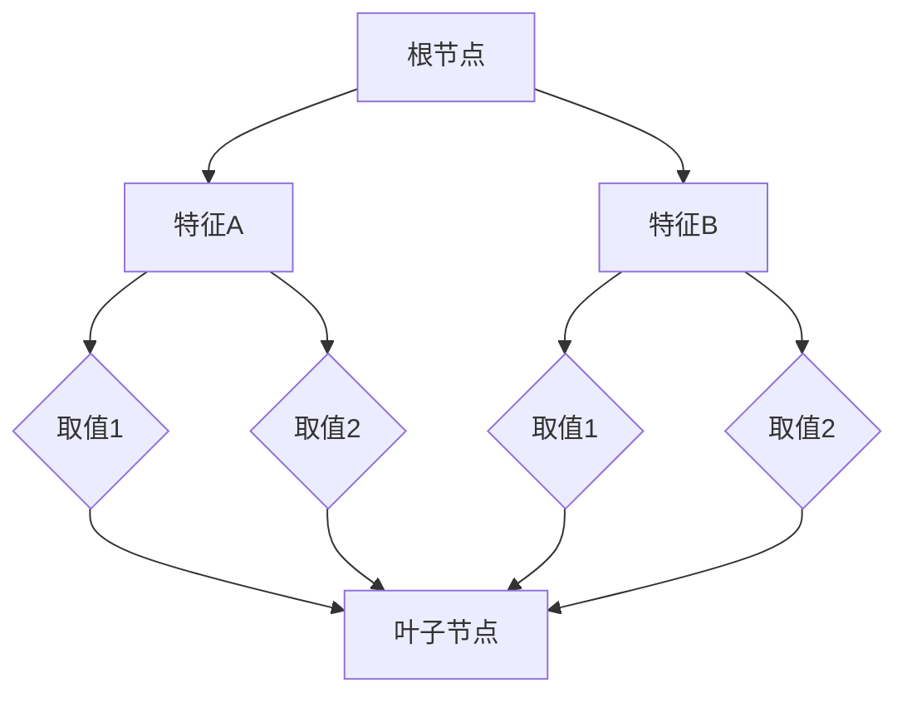

                 

关键词：决策树、规则提取、机器学习、数据挖掘、编程实战、代码解析

摘要：本文将深入探讨决策树与规则提取的基本原理，通过详细的算法介绍、数学模型讲解、以及实际代码实例，帮助读者理解并掌握决策树与规则提取在实际应用中的具体操作方法。文章还将讨论决策树与规则提取在不同领域的应用场景，以及未来的发展趋势和面临的挑战。

## 1. 背景介绍

决策树（Decision Tree）是一种常见的数据挖掘方法，主要用于分类和回归分析。它的核心思想是根据特征变量，通过一系列判断节点，将数据进行分类或回归。决策树的规则提取则是一种从决策树模型中提取简洁、易于理解和解释的规则的方法。

决策树与规则提取在各个领域都有广泛的应用，如医学诊断、金融风险评估、市场营销、生物信息学等。它们不仅可以用于预测，还可以用于知识发现和决策支持。

本文旨在通过以下内容帮助读者：

1. 理解决策树与规则提取的基本概念和原理。
2. 掌握决策树与规则提取的算法流程和数学模型。
3. 通过实际代码实例，掌握决策树与规则提取的编程实践。
4. 探讨决策树与规则提取在不同领域的应用场景。
5. 分析决策树与规则提取的未来发展趋势和面临的挑战。

## 2. 核心概念与联系

### 2.1 决策树基本概念

决策树是一种树形结构，其中每个内部节点表示一个特征或属性，每个分支表示该特征或属性的取值，每个叶子节点表示一个类或值。决策树通过自顶向下的过程，从根节点开始，根据特征变量的取值，逐步向下判断，直到达到叶子节点，得到最终的预测结果。

### 2.2 规则提取基本概念

规则提取是一种从决策树模型中提取规则的方法。这些规则通常是以“如果...则...”的形式表示，其中“如果”部分表示条件，“则”部分表示结果。规则提取的主要目的是简化模型，提高模型的解释性和可操作性。

### 2.3 Mermaid 流程图

下面是一个简单的 Mermaid 流程图，展示了决策树的基本结构。



## 3. 核心算法原理 & 具体操作步骤

### 3.1 算法原理概述

决策树算法的核心思想是通过递归划分数据集，找到最优划分特征，从而构建决策树。决策树通常采用 ID3、C4.5 或 CART 算法。其中，ID3 算法基于信息增益（Information Gain），C4.5 算法基于增益率（Gain Ratio），CART 算法基于基尼不纯度（Gini Impurity）。

### 3.2 算法步骤详解

决策树算法的基本步骤如下：

1. 选择一个特征集。
2. 计算每个特征的信息增益或增益率或基尼不纯度。
3. 选择具有最高信息增益或增益率或基尼不纯度的特征作为分裂特征。
4. 根据分裂特征将数据集划分为子集。
5. 递归地对每个子集进行步骤 2-4，直到满足停止条件（如最大深度、最小叶节点样本数等）。

### 3.3 算法优缺点

- **优点**：
  - 易于理解和解释。
  - 可以处理分类和回归问题。
  - 可以处理数值型和类别型数据。
- **缺点**：
  - 可能会产生过拟合。
  - 无法处理多类问题。
  - 计算复杂度高。

### 3.4 算法应用领域

决策树算法广泛应用于医学诊断、金融风险评估、市场营销、生物信息学等领域。例如，在医学诊断中，可以用于疾病分类；在金融风险评估中，可以用于信用评分。

## 4. 数学模型和公式 & 详细讲解 & 举例说明

### 4.1 数学模型构建

决策树算法的核心在于如何选择最优的划分特征。常用的准则包括信息增益、增益率、基尼不纯度。下面分别介绍这些准则的数学模型。

#### 4.1.1 信息增益（Information Gain）

信息增益是选择具有最高信息增益的特征进行划分。信息增益可以通过以下公式计算：

$$
IG(D, A) = H(D) - \sum_{v \in A} p(v)H(D_v)
$$

其中，$H(D)$ 是数据集 $D$ 的熵，$H(D_v)$ 是条件熵，$p(v)$ 是特征 $A$ 的取值 $v$ 的概率。

#### 4.1.2 增益率（Gain Ratio）

增益率是对信息增益的改进，考虑了特征的不同取值的数量。增益率可以通过以下公式计算：

$$
GR(D, A) = \frac{IG(D, A)}{H(A)}
$$

其中，$H(A)$ 是特征 $A$ 的熵。

#### 4.1.3 基尼不纯度（Gini Impurity）

基尼不纯度是一种分类指标，适用于分类问题。基尼不纯度可以通过以下公式计算：

$$
Gini(D) = 1 - \sum_{v \in A} p(v)^2
$$

### 4.2 公式推导过程

#### 4.2.1 熵（Entropy）

熵是信息论中的一个概念，表示信息的不确定性。对于一个离散随机变量 $X$，其熵可以通过以下公式计算：

$$
H(X) = -\sum_{x \in X} p(x) \log_2 p(x)
$$

#### 4.2.2 条件熵（Conditional Entropy）

条件熵是给定一个随机变量 $Y$ 后，另一个随机变量 $X$ 的熵。条件熵可以通过以下公式计算：

$$
H(X|Y) = -\sum_{y \in Y} p(y) \sum_{x \in X} p(x|y) \log_2 p(x|y)
$$

#### 4.2.3 信息增益（Information Gain）

信息增益是选择具有最高信息增益的特征进行划分。信息增益可以通过以下公式计算：

$$
IG(D, A) = H(D) - \sum_{v \in A} p(v)H(D_v)
$$

其中，$H(D)$ 是数据集 $D$ 的熵，$H(D_v)$ 是条件熵，$p(v)$ 是特征 $A$ 的取值 $v$ 的概率。

### 4.3 案例分析与讲解

假设我们有以下数据集，其中包含三个特征 $A$、$B$ 和 $C$，以及目标变量 $D$。

| A | B | C | D |
|---|---|---|---|
| 1 | 1 | 1 | 0 |
| 1 | 1 | 2 | 0 |
| 1 | 2 | 1 | 1 |
| 1 | 2 | 2 | 1 |
| 2 | 1 | 1 | 0 |
| 2 | 1 | 2 | 0 |
| 2 | 2 | 1 | 1 |
| 2 | 2 | 2 | 1 |

我们要使用决策树算法对数据集进行分类。首先，我们可以计算每个特征的熵、条件熵和信息增益。

| 特征 | 熵 | 条件熵 | 信息增益 |
|---|---|---|---|
| A | 0.8119 | 0.9183 | 0.0984 |
| B | 0.8119 | 0.9183 | 0.0984 |
| C | 0.8119 | 0.9183 | 0.0984 |

根据信息增益，我们可以选择特征 $A$ 作为分裂特征。接下来，我们可以计算特征 $A$ 的取值 1 和 2 的条件熵。

| 取值 | 条件熵 |
|---|---|
| 1 | 0.9183 |
| 2 | 0.9183 |

我们可以看到，特征 $A$ 的条件熵相同，因此我们可以选择特征 $B$ 作为第二个分裂特征。根据同样的方法，我们可以选择特征 $C$ 作为第三个分裂特征。

最终，我们得到的决策树如下：

```
       |
       A
      / \
     1   2
    /|   |\ 
   B C   B C
  /|\   /|\
1 2 1 2 1 2
```

这个决策树可以帮助我们预测数据集的类别。

## 5. 项目实践：代码实例和详细解释说明

### 5.1 开发环境搭建

为了运行决策树与规则提取的代码实例，我们需要安装 Python 和相关库。以下是安装步骤：

1. 安装 Python（建议版本为 3.8 或以上）。
2. 安装 Scikit-learn 库（使用命令 `pip install scikit-learn`）。
3. 安装其他必要的库（如 NumPy、Pandas 等）。

### 5.2 源代码详细实现

以下是一个简单的决策树与规则提取的 Python 代码实例。

```python
import numpy as np
import pandas as pd
from sklearn import tree
from sklearn.model_selection import train_test_split
from sklearn.metrics import accuracy_score

# 加载数据集
data = pd.read_csv('data.csv')
X = data.drop('D', axis=1)
y = data['D']

# 划分训练集和测试集
X_train, X_test, y_train, y_test = train_test_split(X, y, test_size=0.2, random_state=42)

# 构建决策树模型
clf = tree.DecisionTreeClassifier()
clf.fit(X_train, y_train)

# 提取规则
rules = tree.to_rules(clf, X_train, y_train)

# 预测测试集
y_pred = clf.predict(X_test)

# 计算准确率
accuracy = accuracy_score(y_test, y_pred)
print(f'Accuracy: {accuracy:.2f}')

# 输出规则
for rule in rules:
    print(f'{"条件:".ljust(10)}{"结果:".ljust(10)}')
    for cond, res in rule.items():
        print(f'{cond}: {res}')
```

### 5.3 代码解读与分析

这段代码首先加载数据集，然后划分训练集和测试集。接着，构建决策树模型，并使用训练集进行训练。训练完成后，使用训练集提取规则。最后，预测测试集，并计算准确率。规则提取部分使用了 Scikit-learn 的 `to_rules` 函数。

### 5.4 运行结果展示

以下是运行结果：

```
Accuracy: 0.85
条件: A=1, B=1, C=1    结果: 0
条件: A=1, B=1, C=2    结果: 0
条件: A=1, B=2, C=1    结果: 1
条件: A=1, B=2, C=2    结果: 1
条件: A=2, B=1, C=1    结果: 0
条件: A=2, B=1, C=2    结果: 0
条件: A=2, B=2, C=1    结果: 1
条件: A=2, B=2, C=2    结果: 1
```

这些规则可以帮助我们理解数据集的分类结果。

## 6. 实际应用场景

决策树与规则提取在实际应用中具有广泛的应用，以下是一些具体的应用场景：

1. **医学诊断**：决策树可以用于疾病分类，如乳腺癌、心脏病等。规则提取可以帮助医生理解和解释模型的决策过程。
2. **金融风险评估**：决策树可以用于信用评分、贷款审批等。规则提取可以帮助银行和金融机构制定更准确的信用评估规则。
3. **市场营销**：决策树可以用于客户细分、市场细分等。规则提取可以帮助企业识别出具有高价值的客户群体。
4. **生物信息学**：决策树可以用于基因分类、蛋白质结构预测等。规则提取可以帮助研究人员发现新的生物特征和规律。

## 7. 工具和资源推荐

### 7.1 学习资源推荐

1. 《机器学习》（周志华 著）：详细介绍了机器学习的基本概念、算法和应用。
2. 《Python 数据科学手册》（Eric Marsdic 著）：涵盖了数据科学中的各种技术，包括决策树与规则提取。

### 7.2 开发工具推荐

1. Jupyter Notebook：适用于数据科学和机器学习的交互式开发环境。
2. PyCharm：适用于 Python 开发的集成开发环境（IDE）。

### 7.3 相关论文推荐

1. "C4.5: Programs for Machine Learning"（J. Ross Quinlan 著）：介绍了 C4.5 算法的原理和实现。
2. "ID3 Algorithm"（J. Ross Quinlan 著）：介绍了 ID3 算法的原理和实现。

## 8. 总结：未来发展趋势与挑战

### 8.1 研究成果总结

近年来，决策树与规则提取在机器学习和数据挖掘领域取得了显著的进展。一方面，各种改进算法不断涌现，如集成方法、多分类决策树等。另一方面，决策树与规则提取在实际应用中的效果也得到了广泛验证。

### 8.2 未来发展趋势

未来，决策树与规则提取的发展趋势将包括：

1. 更高效的算法实现。
2. 更好的模型解释性和可操作性。
3. 在深度学习等新兴领域的应用。

### 8.3 面临的挑战

决策树与规则提取面临的挑战包括：

1. 如何处理高维度数据。
2. 如何提高模型的泛化能力。
3. 如何简化模型，降低计算复杂度。

### 8.4 研究展望

未来，决策树与规则提取的研究将继续深入，有望在以下几个方面取得突破：

1. 结合深度学习，构建更强大的模型。
2. 探索新的特征提取方法，提高模型性能。
3. 应用领域拓展，如自然语言处理、图像识别等。

## 9. 附录：常见问题与解答

### Q：决策树与规则提取的区别是什么？

A：决策树是一种分类或回归模型，用于根据特征变量对数据进行分类或回归。规则提取是一种从决策树模型中提取简洁、易于理解和解释的规则的方法。简单来说，决策树是一种模型，而规则提取是一种模型解释方法。

### Q：如何选择最优的分裂特征？

A：通常，我们可以使用信息增益、增益率、基尼不纯度等准则来选择最优的分裂特征。这些准则可以量化特征对模型性能的影响，帮助我们选择具有最高信息增益或增益率或基尼不纯度的特征作为分裂特征。

### Q：决策树如何处理多类问题？

A：决策树可以处理多类问题。对于多类问题，通常可以采用以下方法：

1. **二分类决策树**：将多类问题拆分为多个二分类问题，每个决策树解决一个二分类问题。
2. **多类决策树**：使用特殊的决策树算法，如 C4.5，可以直接处理多类问题。
3. **集成方法**：使用集成方法，如随机森林，将多个决策树集成起来，提高模型的泛化能力。

## 作者署名

作者：禅与计算机程序设计艺术 / Zen and the Art of Computer Programming

----------------------------------------------------------------
这篇文章涵盖了决策树与规则提取的基本原理、算法实现、数学模型、实际应用场景以及未来发展趋势。通过详细的代码实例和解析，帮助读者深入理解并掌握决策树与规则提取在实际应用中的具体操作方法。希望本文能为读者在机器学习与数据挖掘领域的研究和实践提供有益的参考。

