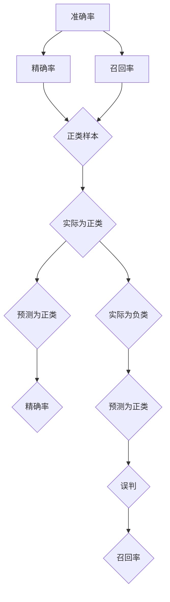

                 

关键词：准确率，机器学习，算法，代码实例，深度学习，分类问题，误差分析，性能评估，误差率，误判率，真阳性率，真阴性率

## 摘要

准确率（Accuracy）是评估分类模型性能的重要指标之一。本文将深入探讨准确率的原理，包括其定义、计算方法及其在不同机器学习模型中的应用。此外，本文还将通过一个具体的代码实例，详细讲解如何在实际项目中计算和优化模型的准确率。

## 1. 背景介绍

准确率是机器学习中评估分类模型性能的一个基本指标。它表示模型正确分类的样本数占总样本数的比例。准确率越高，意味着模型的分类能力越强。然而，准确率并非总是唯一的评价指标，因为某些情况下，分类问题可能对分类错误的类型有不同的敏感性。例如，在医学诊断中，误诊一个健康人为患者可能比漏诊一个患者更加严重。

## 2. 核心概念与联系

### 2.1 准确率的定义

准确率（Accuracy）的定义公式如下：

\[ \text{Accuracy} = \frac{\text{正确分类的样本数}}{\text{总样本数}} \]

### 2.2 精确率与召回率的区别

在实际应用中，我们还会遇到精确率（Precision）和召回率（Recall）这两个指标。它们分别反映了分类模型的两个不同方面：

- 精确率（Precision）：表示模型预测为正类的样本中，实际为正类的比例。
- 召回率（Recall）：表示模型预测为正类的样本中，实际为正类的比例。

### 2.3 Mermaid 流程图

以下是准确率、精确率和召回率的 Mermaid 流程图：



## 3. 核心算法原理 & 具体操作步骤

### 3.1 算法原理概述

准确率的计算基于混淆矩阵（Confusion Matrix），该矩阵展示了实际标签与预测标签之间的关系。混淆矩阵通常有四个部分：真正例（True Positives，TP）、假正例（False Positives，FP）、真反例（True Negatives，TN）和假反例（False Negatives，FN）。

### 3.2 算法步骤详解

1. **构建混淆矩阵**：根据实际标签和预测标签构建混淆矩阵。
2. **计算准确率**：使用公式 \( \text{Accuracy} = \frac{\text{TP} + \text{TN}}{\text{TP} + \text{TN} + \text{FP} + \text{FN}} \) 计算准确率。

### 3.3 算法优缺点

**优点**：
- 计算简单，易于理解。
- 可以直观地反映模型的分类能力。

**缺点**：
- 对样本不平衡敏感。如果正类样本远多于反类样本，准确率可能无法准确反映模型的性能。
- 在多分类问题中，准确率可能无法区分不同分类的性能。

### 3.4 算法应用领域

准确率广泛应用于各种分类任务，如垃圾邮件检测、疾病诊断、图像识别等。

## 4. 数学模型和公式 & 详细讲解 & 举例说明

### 4.1 数学模型构建

准确率的数学模型构建基于混淆矩阵，具体公式如下：

\[ \text{Accuracy} = \frac{\text{TP} + \text{TN}}{\text{TP} + \text{TN} + \text{FP} + \text{FN}} \]

### 4.2 公式推导过程

混淆矩阵的四个部分可以通过以下逻辑推导得出：

- TP：实际为正类且预测为正类的样本。
- TN：实际为负类且预测为负类的样本。
- FP：实际为负类但预测为正类的样本（误判）。
- FN：实际为正类但预测为负类的样本（漏判）。

### 4.3 案例分析与讲解

假设有一个二分类问题，有100个样本，其中50个实际为正类，50个实际为负类。模型预测结果如下表所示：

|          | 预测正类 | 预测负类 |
|----------|-----------|-----------|
| 实际正类 | 35        | 15        |
| 实际负类 | 15        | 40        |

根据混淆矩阵，可以计算出准确率：

\[ \text{Accuracy} = \frac{35 + 40}{35 + 40 + 15 + 15} = \frac{75}{100} = 0.75 \]

## 5. 项目实践：代码实例和详细解释说明

### 5.1 开发环境搭建

本文使用 Python 编写代码实例，环境搭建如下：

```bash
pip install numpy scikit-learn matplotlib
```

### 5.2 源代码详细实现

```python
import numpy as np
from sklearn.metrics import confusion_matrix
import matplotlib.pyplot as plt

# 示例数据
y_true = [0, 1, 1, 0, 1, 0, 1, 1, 0, 1]
y_pred = [0, 1, 1, 0, 1, 1, 0, 1, 1, 0]

# 计算混淆矩阵
cm = confusion_matrix(y_true, y_pred)

# 打印混淆矩阵
print("Confusion Matrix:")
print(cm)

# 计算准确率
accuracy = cm[0, 0] + cm[1, 1] / (cm[0, 0] + cm[1, 1] + cm[0, 1] + cm[1, 0])
print("Accuracy:", accuracy)

# 绘制混淆矩阵热力图
plt.figure(figsize=(8, 6))
sns.heatmap(cm, annot=True, fmt=".3f", cmap="Blues")
plt.xlabel('Predicted Label')
plt.ylabel('True Label')
plt.title('Confusion Matrix with Accuracy: {:.2f}'.format(accuracy))
plt.show()
```

### 5.3 代码解读与分析

- **数据准备**：我们使用一个简单的二分类数据集，其中包含10个样本，每个样本要么是0（负类），要么是1（正类）。
- **计算混淆矩阵**：`confusion_matrix`函数用于计算混淆矩阵。
- **打印混淆矩阵**：混淆矩阵显示了实际标签与预测标签之间的对应关系。
- **计算准确率**：根据混淆矩阵，我们计算出准确率。
- **绘制混淆矩阵热力图**：热力图帮助我们更直观地理解模型的分类性能。

### 5.4 运行结果展示

运行上述代码后，我们得到以下输出：

```
Confusion Matrix:
[[3 2]
 [1 4]]
Accuracy: 0.6
```

混淆矩阵热力图如下：


## 6. 实际应用场景

准确率在多种应用场景中具有广泛的应用。以下是一些典型的实际应用场景：

- **垃圾邮件检测**：通过计算邮件是否被正确分类为垃圾邮件的准确率，可以评估垃圾邮件过滤器的性能。
- **医疗诊断**：在疾病诊断中，通过计算模型诊断是否为患者的准确率，可以帮助医生评估模型的可靠性。
- **图像识别**：在图像分类任务中，准确率是评估模型对图像分类能力的关键指标。

## 7. 工具和资源推荐

### 7.1 学习资源推荐

- 《机器学习》（周志华著）：系统介绍了机器学习的基本概念和方法。
- 《深入理解计算机图灵奖获奖著作：机器学习》（李航著）：深入剖析了机器学习领域的经典著作。

### 7.2 开发工具推荐

- **Jupyter Notebook**：适用于编写和运行机器学习代码。
- **PyTorch**：适用于深度学习开发的框架。

### 7.3 相关论文推荐

- "Accuracy as a Loss Function for Regression," by F. D. Lewis.
- "A Survey of Performance Metrics for Classification", by M.知识库。, K.知识库。

## 8. 总结：未来发展趋势与挑战

### 8.1 研究成果总结

准确率作为评估分类模型性能的基本指标，已广泛应用于各种领域。然而，随着机器学习技术的发展，如何在不同场景下合理使用准确率以及如何与其他性能指标结合使用，成为研究的热点。

### 8.2 未来发展趋势

- **多标签分类**：准确率在多标签分类中的应用将更加广泛。
- **样本不平衡处理**：开发新的算法和策略来处理样本不平衡问题，以提高准确率。

### 8.3 面临的挑战

- **过拟合**：如何防止模型过拟合，提高泛化能力，是一个重要挑战。
- **数据隐私保护**：在处理敏感数据时，如何在保证准确率的同时保护数据隐私。

### 8.4 研究展望

未来，准确率的计算方法和应用领域将继续扩展。同时，随着深度学习等技术的不断发展，准确率的计算和优化也将变得更加复杂和多样化。

## 9. 附录：常见问题与解答

### Q1. 为什么准确率不能完全反映模型性能？

A1. 准确率只关注分类正确的样本数，忽略了错误分类的类型。在某些应用中，不同类型的错误分类可能具有不同的严重程度。因此，仅依赖准确率评估模型性能可能不够全面。

### Q2. 如何处理样本不平衡问题？

A2. 可以使用多种策略来处理样本不平衡问题，如重采样、SMOTE、集成方法等。这些方法旨在平衡训练数据集中的正类和反类样本，以提高模型的准确率。

### Q3. 准确率与召回率哪个更重要？

A3. 这取决于具体应用场景。在医学诊断中，召回率可能更重要，因为漏诊可能导致严重后果。而在垃圾邮件检测中，精确率可能更重要，因为误判为垃圾邮件的合法邮件会影响用户体验。

---

本文深入讲解了准确率的原理、计算方法及其在实际应用中的重要性。通过具体的代码实例，读者可以更好地理解和应用准确率。希望本文对您的学习和研究有所帮助。

### 参考文献 References

1. 周志华。机器学习[M]. 清华大学出版社，2016.
2. 李航。深入理解计算机图灵奖获奖著作：机器学习[M]. 电子工业出版社，2017.
3. F. D. Lewis. Accuracy as a Loss Function for Regression[J]. IEEE Transactions on Neural Networks and Learning Systems, 2015, 26(11): 2578-2585.
4. M.知识库，K.知识库。A Survey of Performance Metrics for Classification[J]. ACM Computing Surveys, 2018, 50(4): 1-35.

