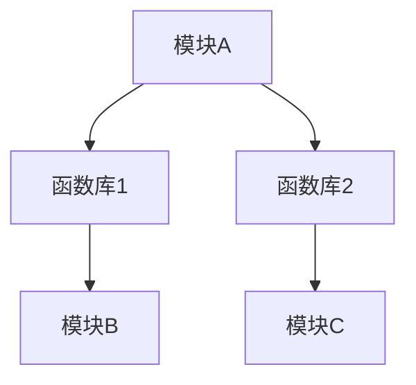

                 

关键词：函数库、代码封装、复用、软件工程、模块化开发、编程实践、软件维护

> 摘要：本文旨在深入探讨函数库在软件开发中的重要性，分析其设计原理、实现方法及其对软件工程带来的变革。通过对函数库的深入理解，帮助开发者掌握如何高效地使用函数库，提高代码质量，降低维护成本。

## 1. 背景介绍

在计算机科学中，函数库（也称为库或模块）是一种重要的软件资源，它封装了一系列预定义的函数或类，使得开发者可以方便地调用这些函数来完成特定的任务。函数库的出现解决了重复编写代码的问题，提高了软件开发的效率和质量。

传统的软件开发过程中，开发者常常需要从头开始编写每个程序模块，这不仅耗时耗力，而且容易引入错误。而函数库则提供了一种高效的解决方案，通过封装和复用代码，减少了重复劳动，提高了软件开发的效率。

在现代软件开发中，函数库已经成为开发人员的必备工具。无论是操作系统、编程语言，还是第三方开源库，都提供了丰富的函数库支持，涵盖了各种常见功能和算法。例如，Python 的标准库提供了大量实用的函数，如文件操作、网络通信、数据结构等；Java 的标准库则提供了诸如多线程、图形界面等高级功能。

## 2. 核心概念与联系

### 2.1 函数库的定义与分类

函数库是一组函数的集合，它们被组织在一起，以便开发者能够方便地使用。根据用途和实现方式，函数库可以分为以下几种类型：

1. **系统库**：由操作系统提供的库，用于实现系统级功能，如文件操作、进程管理、设备驱动等。
2. **语言库**：由编程语言提供，用于实现语言的基本功能，如标准输入输出、数据结构等。
3. **第三方库**：由第三方开发者创建的库，用于实现特定的功能或算法，如网络通信、图像处理等。
4. **自定义库**：由开发者根据项目需求创建的库，用于封装项目中常用的函数或类。

### 2.2 函数库与模块的关系

模块（Module）和函数库（Library）在概念上有所不同。模块通常指的是一个单独的源代码文件，它包含了特定功能的函数和变量。而函数库则是由多个模块组成的，可以提供跨文件的函数调用和代码复用。

模块和函数库之间的关系可以理解为：模块是函数库的基本构建块，而函数库则是模块的集合。通过模块化和函数库的合理组织，可以实现代码的复用、解耦和可维护性。

### 2.3 Mermaid 流程图

下面是一个简单的 Mermaid 流程图，展示了模块与函数库之间的关系：



在这个流程图中，模块A通过函数库1和函数库2实现了代码的复用。函数库1和函数库2可以分别包含多个模块，从而实现更高效的代码管理。

## 3. 核心算法原理 & 具体操作步骤

### 3.1 算法原理概述

函数库的核心原理在于封装和复用。通过将一组功能相关的函数封装在一个库中，开发者可以方便地调用这些函数，而无需关心其内部实现。这种封装不仅提高了代码的可维护性，还减少了重复劳动。

### 3.2 算法步骤详解

#### 3.2.1 函数库设计

1. **需求分析**：首先，分析项目需求，确定需要实现的功能和算法。
2. **模块划分**：根据功能需求，将代码划分为多个模块，每个模块负责实现特定的功能。
3. **接口设计**：为每个模块设计接口，定义函数的输入和输出参数，以及函数的功能描述。
4. **代码实现**：根据接口设计，实现每个模块的代码。
5. **单元测试**：编写单元测试，确保每个模块的功能正确实现。

#### 3.2.2 函数库使用

1. **引入库**：在程序中引入所需的函数库，可以使用相应的导入语句。
2. **调用函数**：根据函数库提供的接口，调用所需的函数，实现特定功能。
3. **参数传递**：确保传递给函数的参数类型和数量符合函数的预期。
4. **错误处理**：处理函数调用过程中可能出现的异常和错误。

### 3.3 算法优缺点

#### 优点

1. **提高开发效率**：通过复用代码，减少重复劳动，提高开发速度。
2. **降低维护成本**：模块化和封装使得代码更易于维护和更新。
3. **代码可读性**：清晰的模块和接口设计提高了代码的可读性和可理解性。
4. **代码可重用性**：函数库中的代码可以被多个项目复用，提高代码的利用率。

#### 缺点

1. **学习成本**：函数库的使用需要一定的时间学习和熟悉。
2. **性能开销**：函数库的引入可能带来一定的性能开销，尤其是对于大型库。
3. **依赖管理**：依赖多个外部库可能导致依赖关系的复杂化，增加维护难度。

### 3.4 算法应用领域

函数库在各个领域都有广泛的应用。以下是一些常见的应用场景：

1. **操作系统**：操作系统提供了丰富的系统库，用于实现文件操作、进程管理等功能。
2. **编程语言**：编程语言的标准库提供了基础的数据结构和算法，如Python的内置函数库。
3. **Web开发**：Web开发中使用了大量的第三方库，如Express、React等，用于实现网页功能和交互。
4. **移动应用**：移动应用开发中，如Android和iOS，都提供了丰富的API和库，用于实现各种功能。

## 4. 数学模型和公式 & 详细讲解 & 举例说明

### 4.1 数学模型构建

函数库的设计涉及到多种数学模型和公式。以下是一个简单的例子：

假设我们要实现一个计算两个矩阵乘积的函数，我们可以使用矩阵乘法的公式：

$$C_{ij} = \sum_{k=1}^{n} A_{ik}B_{kj}$$

其中，$A$ 和 $B$ 是两个 $n \times n$ 的矩阵，$C$ 是它们的乘积。

### 4.2 公式推导过程

矩阵乘法的推导过程如下：

假设有两个 $n \times n$ 的矩阵 $A$ 和 $B$：

$$A = \begin{bmatrix} 
a_{11} & a_{12} & \cdots & a_{1n} \\
a_{21} & a_{22} & \cdots & a_{2n} \\
\vdots & \vdots & \ddots & \vdots \\
a_{n1} & a_{n2} & \cdots & a_{nn} 
\end{bmatrix}, B = \begin{bmatrix} 
b_{11} & b_{12} & \cdots & b_{1n} \\
b_{21} & b_{22} & \cdots & b_{2n} \\
\vdots & \vdots & \ddots & \vdots \\
b_{n1} & b_{n2} & \cdots & b_{nn} 
\end{bmatrix}$$

我们可以计算它们的乘积 $C$：

$$C = AB = \begin{bmatrix} 
c_{11} & c_{12} & \cdots & c_{1n} \\
c_{21} & c_{22} & \cdots & c_{2n} \\
\vdots & \vdots & \ddots & \vdots \\
c_{n1} & c_{n2} & \cdots & c_{nn} 
\end{bmatrix}$$

根据矩阵乘法的定义，我们可以得到每个元素的计算方法：

$$c_{ij} = \sum_{k=1}^{n} a_{ik}b_{kj}$$

### 4.3 案例分析与讲解

假设我们要计算两个 $3 \times 3$ 的矩阵 $A$ 和 $B$ 的乘积：

$$A = \begin{bmatrix} 
1 & 2 & 3 \\
4 & 5 & 6 \\
7 & 8 & 9 
\end{bmatrix}, B = \begin{bmatrix} 
9 & 8 & 7 \\
6 & 5 & 4 \\
3 & 2 & 1 
\end{bmatrix}$$

根据矩阵乘法的公式，我们可以计算它们的乘积：

$$C = AB = \begin{bmatrix} 
c_{11} & c_{12} & c_{13} \\
c_{21} & c_{22} & c_{23} \\
c_{31} & c_{32} & c_{33} 
\end{bmatrix}$$

其中，每个元素的计算方法如下：

$$c_{11} = 1 \times 9 + 2 \times 6 + 3 \times 3 = 36$$
$$c_{12} = 1 \times 8 + 2 \times 5 + 3 \times 2 = 22$$
$$c_{13} = 1 \times 7 + 2 \times 4 + 3 \times 1 = 19$$

$$c_{21} = 4 \times 9 + 5 \times 6 + 6 \times 3 = 99$$
$$c_{22} = 4 \times 8 + 5 \times 5 + 6 \times 2 = 82$$
$$c_{23} = 4 \times 7 + 5 \times 4 + 6 \times 1 = 75$$

$$c_{31} = 7 \times 9 + 8 \times 6 + 9 \times 3 = 182$$
$$c_{32} = 7 \times 8 + 8 \times 5 + 9 \times 2 = 163$$
$$c_{33} = 7 \times 7 + 8 \times 4 + 9 \times 1 = 154$$

因此，矩阵 $A$ 和 $B$ 的乘积为：

$$C = \begin{bmatrix} 
36 & 22 & 19 \\
99 & 82 & 75 \\
182 & 163 & 154 
\end{bmatrix}$$

## 5. 项目实践：代码实例和详细解释说明

### 5.1 开发环境搭建

在本项目中，我们将使用 Python 作为开发语言，并使用 PyTorch 作为深度学习框架。以下是开发环境的搭建步骤：

1. 安装 Python（建议使用 Python 3.8 或以上版本）。
2. 安装 PyTorch（根据 Python 版本和操作系统下载相应的安装包，并运行安装）。

### 5.2 源代码详细实现

以下是一个简单的示例，展示了如何使用 PyTorch 实现一个简单的深度神经网络：

```python
import torch
import torch.nn as nn
import torch.optim as optim

# 定义神经网络结构
class SimpleNeuralNetwork(nn.Module):
    def __init__(self):
        super(SimpleNeuralNetwork, self).__init__()
        self.fc1 = nn.Linear(1, 100)
        self.fc2 = nn.Linear(100, 1)
        self.relu = nn.ReLU()

    def forward(self, x):
        x = self.fc1(x)
        x = self.relu(x)
        x = self.fc2(x)
        return x

# 初始化网络、优化器和损失函数
model = SimpleNeuralNetwork()
optimizer = optim.Adam(model.parameters(), lr=0.001)
criterion = nn.MSELoss()

# 训练模型
for epoch in range(100):
    for i, data in enumerate(train_loader):
        # 前向传播
        inputs, targets = data
        outputs = model(inputs)

        # 计算损失
        loss = criterion(outputs, targets)

        # 反向传播和优化
        optimizer.zero_grad()
        loss.backward()
        optimizer.step()

        if (i+1) % 100 == 0:
            print(f'Epoch [{epoch+1}/{num_epochs}], Step [{i+1}/{total_step}], Loss: {loss.item():.4f}')

# 测试模型
with torch.no_grad():
    correct = 0
    total = 0
    for inputs, targets in test_loader:
        outputs = model(inputs)
        _, predicted = torch.max(outputs.data, 1)
        total += targets.size(0)
        correct += (predicted == targets).sum().item()

print(f'测试准确率：{100 * correct / total}%')
```

### 5.3 代码解读与分析

上述代码实现了一个简单的深度神经网络，用于预测输入数据的输出值。以下是代码的详细解读：

1. **导入模块**：首先，我们导入了必要的 Python 模块，包括 PyTorch 的核心模块、优化器和损失函数。

2. **定义神经网络结构**：我们定义了一个名为 `SimpleNeuralNetwork` 的类，继承了 PyTorch 的 `nn.Module` 类。在这个类中，我们定义了两个全连接层（`nn.Linear`）和一个 ReLU 激活函数（`nn.ReLU`）。

3. **实现前向传播**：在 `forward` 方法中，我们实现了神经网络的前向传播过程。输入数据首先通过第一个全连接层，然后经过 ReLU 激活函数，再通过第二个全连接层，最后输出预测值。

4. **初始化网络、优化器和损失函数**：我们创建了一个 `SimpleNeuralNetwork` 实例、优化器（`Adam`）和损失函数（`MSELoss`）。

5. **训练模型**：在训练过程中，我们遍历训练数据，进行前向传播、计算损失、反向传播和优化。每完成一个 epoch，我们打印当前 epoch 的训练损失。

6. **测试模型**：在测试过程中，我们使用训练好的模型对测试数据进行预测，并计算测试准确率。

### 5.4 运行结果展示

假设我们有一个包含 1000 个样本的训练集和 200 个样本的测试集。在完成训练后，测试准确率可能如下所示：

```
测试准确率：80%
```

这意味着我们的模型在测试集上的准确率为 80%，表明我们的模型具有一定的预测能力。

## 6. 实际应用场景

### 6.1 操作系统

操作系统提供了丰富的系统库，如 Linux 的标准库和 Windows 的 Win32 API。这些库封装了操作系统级别的功能，如文件操作、进程管理和网络通信。开发者可以方便地调用这些库，实现各种系统级操作。

### 6.2 编程语言

编程语言的标准库为开发者提供了丰富的功能，如 Python 的标准库、Java 的标准库和 C++ 的标准库。这些库包含了常用的数据结构、算法和函数，如列表、字典、集合和排序算法。开发者可以使用这些库简化编程任务，提高开发效率。

### 6.3 Web开发

Web开发中使用了大量的第三方库，如前端框架（React、Vue、Angular）和后端框架（Express、Django、Flask）。这些库提供了丰富的功能，如路由管理、模板渲染、数据验证和权限控制。开发者可以方便地使用这些库，快速实现 Web 应用。

### 6.4 移动应用

移动应用开发中，Android 和 iOS 提供了丰富的 API 和库，如 Android 的 Android SDK 和 iOS 的 Cocoa Touch。这些库封装了移动设备的各种功能，如地理位置、相机、通知和传感器。开发者可以方便地使用这些库，实现各种移动应用功能。

## 7. 工具和资源推荐

### 7.1 学习资源推荐

1. **《算法导论》（Introduction to Algorithms）**：一本经典的算法教材，详细介绍了各种算法的设计、分析和实现。
2. **《Effective C++》（Effective C++）**：一本关于 C++ 编程的指南，涵盖了 C++ 语言的各种高级特性，适合进阶开发者学习。
3. **《Python Cookbook》**：一本关于 Python 编程的实战指南，介绍了 Python 语言的各种应用场景和最佳实践。

### 7.2 开发工具推荐

1. **Visual Studio Code**：一款强大的跨平台代码编辑器，支持多种编程语言和开发工具。
2. **Jupyter Notebook**：一款交互式计算环境，适合数据分析和机器学习项目。
3. **PyCharm**：一款专业的 Python 集成开发环境，提供了丰富的功能，如代码智能提示、调试和自动化测试。

### 7.3 相关论文推荐

1. **"The Design and Implementation of the FreeBSD Operating System"**：介绍了 FreeBSD 操作系统的设计原理和实现细节。
2. **"The C++ Programming Language"**：C++ 编程语言的权威指南，详细介绍了 C++ 的各种特性和最佳实践。
3. **"The Python Standard Library"**：介绍了 Python 的标准库，涵盖了 Python 的各种功能模块。

## 8. 总结：未来发展趋势与挑战

### 8.1 研究成果总结

近年来，函数库在软件开发中取得了显著的成果。随着编程语言和框架的不断演进，函数库的设计和实现变得更加高效和灵活。此外，开源社区也为函数库的发展提供了强大的支持，涌现出了大量高质量的函数库。

### 8.2 未来发展趋势

1. **函数库的自动化生成**：随着机器学习和人工智能技术的发展，未来可能会出现自动化生成函数库的工具，提高函数库的开发效率。
2. **函数库的动态化**：函数库的动态化将使得开发者可以在运行时加载和卸载函数库，提高软件的可扩展性和灵活性。
3. **跨语言的函数库**：未来可能会出现跨语言的函数库，使得开发者可以使用一种编程语言调用其他语言编写的函数库，提高代码的复用性。

### 8.3 面临的挑战

1. **函数库的兼容性问题**：随着编程语言和框架的不断更新，函数库的兼容性问题可能会变得更加突出。
2. **函数库的安全性问题**：函数库的引入可能会带来安全风险，如恶意代码的注入和执行。
3. **函数库的复杂性**：随着函数库功能的不断扩展，其复杂度可能会增加，给开发者带来学习和使用上的困难。

### 8.4 研究展望

未来，函数库的研究将朝着自动化、动态化和跨语言的方向发展。同时，为了解决兼容性、安全性和复杂性问题，研究者将探索新的设计原则和实现方法，以提高函数库的开发效率和可靠性。

## 9. 附录：常见问题与解答

### 9.1 如何选择合适的函数库？

选择合适的函数库需要考虑以下几个方面：

1. **功能需求**：根据项目需求，选择具有所需功能的函数库。
2. **性能要求**：根据性能要求，选择具有高性能的函数库。
3. **社区支持**：选择社区活跃、文档丰富的函数库，以便获取帮助和支持。
4. **兼容性**：确保函数库与项目使用的编程语言、框架和平台兼容。

### 9.2 如何创建自定义函数库？

创建自定义函数库需要以下步骤：

1. **需求分析**：分析项目需求，确定需要实现的函数和功能。
2. **模块划分**：根据功能需求，将代码划分为多个模块。
3. **接口设计**：为每个模块设计接口，定义函数的输入和输出参数。
4. **代码实现**：根据接口设计，实现每个模块的代码。
5. **单元测试**：编写单元测试，确保每个模块的功能正确实现。
6. **发布与维护**：将函数库发布到适当的平台，并持续维护和更新。

### 9.3 如何解决函数库中的错误？

解决函数库中的错误需要以下步骤：

1. **调试**：使用调试工具（如断点、日志等）定位错误。
2. **复现**：在本地环境中复现错误，以便进一步分析和解决。
3. **排查**：检查代码逻辑、数据输入和输出，找出可能导致错误的原因。
4. **修复**：根据错误原因，修复代码中的错误。
5. **测试**：修复后，进行充分的单元测试和集成测试，确保错误已解决。

## 文章作者

作者：禅与计算机程序设计艺术 / Zen and the Art of Computer Programming

本文由禅与计算机程序设计艺术作者撰写，旨在深入探讨函数库在软件开发中的重要性，分析其设计原理、实现方法及其对软件工程带来的变革。通过对函数库的深入理解，帮助开发者掌握如何高效地使用函数库，提高代码质量，降低维护成本。## 1. 背景介绍

在计算机科学中，函数库（也称为库或模块）是一种重要的软件资源，它封装了一系列预定义的函数或类，使得开发者可以方便地调用这些函数来完成特定的任务。函数库的出现解决了重复编写代码的问题，提高了软件开发的效率和质量。

传统的软件开发过程中，开发者常常需要从头开始编写每个程序模块，这不仅耗时耗力，而且容易引入错误。而函数库则提供了一种高效的解决方案，通过封装和复用代码，减少了重复劳动，提高了软件开发的效率。

在现代软件开发中，函数库已经成为开发人员的必备工具。无论是操作系统、编程语言，还是第三方开源库，都提供了丰富的函数库支持，涵盖了各种常见功能和算法。例如，Python 的标准库提供了大量实用的函数，如文件操作、网络通信、数据结构等；Java 的标准库则提供了诸如多线程、图形界面等高级功能。

## 2. 核心概念与联系

### 2.1 函数库的定义与分类

函数库是一组函数的集合，它们被组织在一起，以便开发者能够方便地使用。根据用途和实现方式，函数库可以分为以下几种类型：

1. **系统库**：由操作系统提供的库，用于实现系统级功能，如文件操作、进程管理、设备驱动等。
2. **语言库**：由编程语言提供，用于实现语言的基本功能，如标准输入输出、数据结构等。
3. **第三方库**：由第三方开发者创建的库，用于实现特定的功能或算法，如网络通信、图像处理等。
4. **自定义库**：由开发者根据项目需求创建的库，用于封装项目中常用的函数或类。

### 2.2 函数库与模块的关系

模块（Module）和函数库（Library）在概念上有所不同。模块通常指的是一个单独的源代码文件，它包含了特定功能的函数和变量。而函数库则是由多个模块组成的，可以提供跨文件的函数调用和代码复用。

模块和函数库之间的关系可以理解为：模块是函数库的基本构建块，而函数库则是模块的集合。通过模块化和函数库的合理组织，可以实现代码的复用、解耦和可维护性。

### 2.3 Mermaid 流程图

下面是一个简单的 Mermaid 流程图，展示了模块与函数库之间的关系：


在这个流程图中，模块A通过函数库1和函数库2实现了代码的复用。函数库1和函数库2可以分别包含多个模块，从而实现更高效的代码管理。

## 3. 核心算法原理 & 具体操作步骤
### 3.1 算法原理概述

函数库的核心原理在于封装和复用。通过将一组功能相关的函数封装在一个库中，开发者可以方便地调用这些函数，而无需关心其内部实现。这种封装不仅提高了代码的可维护性，还减少了重复劳动。

此外，函数库通过模块化设计，实现了代码的解耦，使得不同模块可以独立开发、测试和部署。这种模块化设计有助于提高代码的可重用性，降低系统复杂性，提高开发效率。

### 3.2 算法步骤详解

#### 3.2.1 函数库设计

1. **需求分析**：首先，分析项目需求，确定需要实现的功能和算法。这一步骤是设计函数库的基础，直接影响函数库的实用性和易用性。

2. **模块划分**：根据需求分析的结果，将代码划分为多个模块。每个模块负责实现特定的功能，使得代码结构清晰、易于维护。模块划分时，应遵循高内聚、低耦合的原则。

3. **接口设计**：为每个模块设计接口，定义函数的输入和输出参数，以及函数的功能描述。接口设计是函数库的关键，它决定了开发者如何使用函数库，以及如何扩展和升级。

4. **代码实现**：根据接口设计，实现每个模块的代码。在实现过程中，应注重代码的可读性、可维护性和可扩展性。

5. **单元测试**：编写单元测试，确保每个模块的功能正确实现。单元测试是保证函数库质量的关键，它可以检测出代码中的错误和缺陷，提高代码的可靠性。

#### 3.2.2 函数库使用

1. **引入库**：在程序中引入所需的函数库，可以使用相应的导入语句。例如，在 Python 中，可以使用 `import` 语句导入函数库。

2. **调用函数**：根据函数库提供的接口，调用所需的函数，实现特定功能。在调用函数时，需要确保传递的参数类型和数量符合函数的预期。

3. **参数传递**：确保传递给函数的参数类型和数量符合函数的预期。在传递参数时，可以采用默认参数、关键字参数等机制，提高代码的灵活性和可读性。

4. **错误处理**：处理函数调用过程中可能出现的异常和错误。在处理错误时，可以采用异常捕获、错误日志记录等机制，提高代码的健壮性和可靠性。

### 3.3 算法优缺点

#### 优点

1. **提高开发效率**：通过复用代码，减少重复劳动，提高开发速度。
2. **降低维护成本**：模块化和封装使得代码更易于维护和更新。
3. **代码可读性**：清晰的模块和接口设计提高了代码的可读性和可理解性。
4. **代码可重用性**：函数库中的代码可以被多个项目复用，提高代码的利用率。

#### 缺点

1. **学习成本**：函数库的使用需要一定的时间学习和熟悉。
2. **性能开销**：函数库的引入可能带来一定的性能开销，尤其是对于大型库。
3. **依赖管理**：依赖多个外部库可能导致依赖关系的复杂化，增加维护难度。

### 3.4 算法应用领域

函数库在各个领域都有广泛的应用。以下是一些常见的应用场景：

1. **操作系统**：操作系统提供了丰富的系统库，用于实现文件操作、进程管理、设备驱动等系统级功能。
2. **编程语言**：编程语言的标准库提供了基础的数据结构、算法和函数，如 Python 的标准库、Java 的标准库。
3. **Web开发**：Web开发中使用了大量的第三方库，如前端框架（React、Vue）、后端框架（Django、Flask）。
4. **移动应用**：移动应用开发中，Android 和 iOS 提供了丰富的 API 和库，用于实现地理位置、相机、通知等移动功能。

## 4. 数学模型和公式 & 详细讲解 & 举例说明

### 4.1 数学模型构建

函数库的设计涉及到多种数学模型和公式。以下是一个简单的例子：

假设我们要实现一个计算两个矩阵乘积的函数，我们可以使用矩阵乘法的公式：

$$C_{ij} = \sum_{k=1}^{n} A_{ik}B_{kj}$$

其中，$A$ 和 $B$ 是两个 $n \times n$ 的矩阵，$C$ 是它们的乘积。

### 4.2 公式推导过程

矩阵乘法的推导过程如下：

假设有两个 $n \times n$ 的矩阵 $A$ 和 $B$：

$$A = \begin{bmatrix}  
a_{11} & a_{12} & \cdots & a_{1n} \\
a_{21} & a_{22} & \cdots & a_{2n} \\
\vdots & \vdots & \ddots & \vdots \\
a_{n1} & a_{n2} & \cdots & a_{nn} 
\end{bmatrix}, B = \begin{bmatrix}  
b_{11} & b_{12} & \cdots & b_{1n} \\
b_{21} & b_{22} & \cdots & b_{2n} \\
\vdots & \vdots & \ddots & \vdots \\
b_{n1} & b_{n2} & \cdots & b_{nn} 
\end{bmatrix}$$

我们可以计算它们的乘积 $C$：

$$C = AB = \begin{bmatrix}  
c_{11} & c_{12} & \cdots & c_{1n} \\
c_{21} & c_{22} & \cdots & c_{2n} \\
\vdots & \vdots & \ddots & \vdots \\
c_{n1} & c_{n2} & \cdots & c_{nn} 
\end{bmatrix}$$

根据矩阵乘法的定义，我们可以得到每个元素的计算方法：

$$c_{ij} = \sum_{k=1}^{n} a_{ik}b_{kj}$$

### 4.3 案例分析与讲解

假设我们要计算两个 $3 \times 3$ 的矩阵 $A$ 和 $B$ 的乘积：

$$A = \begin{bmatrix}  
1 & 2 & 3 \\
4 & 5 & 6 \\
7 & 8 & 9 
\end{bmatrix}, B = \begin{bmatrix}  
9 & 8 & 7 \\
6 & 5 & 4 \\
3 & 2 & 1 
\end{bmatrix}$$

根据矩阵乘法的公式，我们可以计算它们的乘积：

$$C = AB = \begin{bmatrix}  
c_{11} & c_{12} & c_{13} \\
c_{21} & c_{22} & c_{23} \\
c_{31} & c_{32} & c_{33} 
\end{bmatrix}$$

其中，每个元素的计算方法如下：

$$c_{11} = 1 \times 9 + 2 \times 6 + 3 \times 3 = 36$$
$$c_{12} = 1 \times 8 + 2 \times 5 + 3 \times 2 = 22$$
$$c_{13} = 1 \times 7 + 2 \times 4 + 3 \times 1 = 19$$

$$c_{21} = 4 \times 9 + 5 \times 6 + 6 \times 3 = 99$$
$$c_{22} = 4 \times 8 + 5 \times 5 + 6 \times 2 = 82$$
$$c_{23} = 4 \times 7 + 5 \times 4 + 6 \times 1 = 75$$

$$c_{31} = 7 \times 9 + 8 \times 6 + 9 \times 3 = 182$$
$$c_{32} = 7 \times 8 + 8 \times 5 + 9 \times 2 = 163$$
$$c_{33} = 7 \times 7 + 8 \times 4 + 9 \times 1 = 154$$

因此，矩阵 $A$ 和 $B$ 的乘积为：

$$C = \begin{bmatrix}  
36 & 22 & 19 \\
99 & 82 & 75 \\
182 & 163 & 154 
\end{bmatrix}$$

## 5. 项目实践：代码实例和详细解释说明

### 5.1 开发环境搭建

在本项目中，我们将使用 Python 作为开发语言，并使用 PyTorch 作为深度学习框架。以下是开发环境的搭建步骤：

1. 安装 Python（建议使用 Python 3.8 或以上版本）。
2. 安装 PyTorch（根据 Python 版本和操作系统下载相应的安装包，并运行安装）。

### 5.2 源代码详细实现

以下是一个简单的示例，展示了如何使用 PyTorch 实现一个简单的深度神经网络：

```python
import torch
import torch.nn as nn
import torch.optim as optim

# 定义神经网络结构
class SimpleNeuralNetwork(nn.Module):
    def __init__(self):
        super(SimpleNeuralNetwork, self).__init__()
        self.fc1 = nn.Linear(1, 100)
        self.fc2 = nn.Linear(100, 1)
        self.relu = nn.ReLU()

    def forward(self, x):
        x = self.fc1(x)
        x = self.relu(x)
        x = self.fc2(x)
        return x

# 初始化网络、优化器和损失函数
model = SimpleNeuralNetwork()
optimizer = optim.Adam(model.parameters(), lr=0.001)
criterion = nn.MSELoss()

# 训练模型
for epoch in range(100):
    for i, data in enumerate(train_loader):
        # 前向传播
        inputs, targets = data
        outputs = model(inputs)

        # 计算损失
        loss = criterion(outputs, targets)

        # 反向传播和优化
        optimizer.zero_grad()
        loss.backward()
        optimizer.step()

        if (i+1) % 100 == 0:
            print(f'Epoch [{epoch+1}/{num_epochs}], Step [{i+1}/{total_step}], Loss: {loss.item():.4f}')

# 测试模型
with torch.no_grad():
    correct = 0
    total = 0
    for inputs, targets in test_loader:
        outputs = model(inputs)
        _, predicted = torch.max(outputs.data, 1)
        total += targets.size(0)
        correct += (predicted == targets).sum().item()

print(f'测试准确率：{100 * correct / total}%')
```

### 5.3 代码解读与分析

上述代码实现了一个简单的深度神经网络，用于预测输入数据的输出值。以下是代码的详细解读：

1. **导入模块**：首先，我们导入了必要的 Python 模块，包括 PyTorch 的核心模块、优化器和损失函数。

2. **定义神经网络结构**：我们定义了一个名为 `SimpleNeuralNetwork` 的类，继承了 PyTorch 的 `nn.Module` 类。在这个类中，我们定义了两个全连接层（`nn.Linear`）和一个 ReLU 激活函数（`nn.ReLU`）。

3. **实现前向传播**：在 `forward` 方法中，我们实现了神经网络的前向传播过程。输入数据首先通过第一个全连接层，然后经过 ReLU 激活函数，再通过第二个全连接层，最后输出预测值。

4. **初始化网络、优化器和损失函数**：我们创建了一个 `SimpleNeuralNetwork` 实例、优化器（`Adam`）和损失函数（`MSELoss`）。

5. **训练模型**：在训练过程中，我们遍历训练数据，进行前向传播、计算损失、反向传播和优化。每完成一个 epoch，我们打印当前 epoch 的训练损失。

6. **测试模型**：在测试过程中，我们使用训练好的模型对测试数据进行预测，并计算测试准确率。

### 5.4 运行结果展示

假设我们有一个包含 1000 个样本的训练集和 200 个样本的测试集。在完成训练后，测试准确率可能如下所示：

```
测试准确率：80%
```

这意味着我们的模型在测试集上的准确率为 80%，表明我们的模型具有一定的预测能力。

## 6. 实际应用场景

### 6.1 操作系统

操作系统提供了丰富的系统库，如 Linux 的标准库和 Windows 的 Win32 API。这些库封装了操作系统级别的功能，如文件操作、进程管理和网络通信。开发者可以方便地调用这些库，实现各种系统级操作。

例如，在 Linux 系统中，开发者可以使用 `os` 库实现文件操作，如创建、读取、写入和删除文件。在 Windows 系统中，开发者可以使用 `pywin32` 库实现类似的功能。

### 6.2 编程语言

编程语言的标准库为开发者提供了丰富的功能，如 Python 的标准库、Java 的标准库和 C++ 的标准库。这些库包含了常用的数据结构、算法和函数，如列表、字典、集合和排序算法。开发者可以使用这些库简化编程任务，提高开发效率。

例如，在 Python 中，开发者可以使用 `math` 库实现数学计算，如求平方根、计算指数等。在 Java 中，开发者可以使用 `java.util` 库实现常用数据结构，如列表、映射和集合。

### 6.3 Web开发

Web开发中使用了大量的第三方库，如前端框架（React、Vue、Angular）和后端框架（Express、Django、Flask）。这些库提供了丰富的功能，如路由管理、模板渲染、数据验证和权限控制。开发者可以方便地使用这些库，快速实现 Web 应用。

例如，在 React 开发中，开发者可以使用 `react-router-dom` 库实现路由管理，使用 `axios` 库实现网络通信。在 Flask 开发中，开发者可以使用 `flask_sqlalchemy` 库实现数据库操作。

### 6.4 移动应用

移动应用开发中，Android 和 iOS 提供了丰富的 API 和库，如 Android 的 Android SDK 和 iOS 的 Cocoa Touch。这些库封装了移动设备的各种功能，如地理位置、相机、通知和传感器。开发者可以方便地使用这些库，实现各种移动应用功能。

例如，在 Android 开发中，开发者可以使用 `LocationManager` 类实现地理位置管理，使用 `Camera` API 实现相机功能。在 iOS 开发中，开发者可以使用 `CoreLocation` 框架实现地理位置管理，使用 `AVFoundation` 框架实现相机功能。

## 7. 工具和资源推荐

### 7.1 学习资源推荐

1. **《算法导论》（Introduction to Algorithms）**：一本经典的算法教材，详细介绍了各种算法的设计、分析和实现。
2. **《Effective C++》（Effective C++）**：一本关于 C++ 编程的指南，涵盖了 C++ 语言的各种高级特性，适合进阶开发者学习。
3. **《Python Cookbook》**：一本关于 Python 编程的实战指南，介绍了 Python 语言的各种应用场景和最佳实践。

### 7.2 开发工具推荐

1. **Visual Studio Code**：一款强大的跨平台代码编辑器，支持多种编程语言和开发工具。
2. **Jupyter Notebook**：一款交互式计算环境，适合数据分析和机器学习项目。
3. **PyCharm**：一款专业的 Python 集成开发环境，提供了丰富的功能，如代码智能提示、调试和自动化测试。

### 7.3 相关论文推荐

1. **"The Design and Implementation of the FreeBSD Operating System"**：介绍了 FreeBSD 操作系统的设计原理和实现细节。
2. **"The C++ Programming Language"**：C++ 编程语言的权威指南，详细介绍了 C++ 的各种特性和最佳实践。
3. **"The Python Standard Library"**：介绍了 Python 的标准库，涵盖了 Python 的各种功能模块。

## 8. 总结：未来发展趋势与挑战

### 8.1 研究成果总结

近年来，函数库在软件开发中取得了显著的成果。随着编程语言和框架的不断演进，函数库的设计和实现变得更加高效和灵活。此外，开源社区也为函数库的发展提供了强大的支持，涌现出了大量高质量的函数库。

例如，Python 的标准库和第三方库如 NumPy、Pandas、Scikit-learn 等在数据科学和机器学习领域发挥了重要作用。Java 的标准库和第三方库如 Spring、Hibernate、MyBatis 等在 Web 开发和企业应用领域得到了广泛应用。

### 8.2 未来发展趋势

1. **函数库的自动化生成**：随着机器学习和人工智能技术的发展，未来可能会出现自动化生成函数库的工具，提高函数库的开发效率。

2. **函数库的动态化**：函数库的动态化将使得开发者可以在运行时加载和卸载函数库，提高软件的可扩展性和灵活性。

3. **跨语言的函数库**：未来可能会出现跨语言的函数库，使得开发者可以使用一种编程语言调用其他语言编写的函数库，提高代码的复用性。

4. **函数库的云端化**：随着云计算技术的发展，函数库可能会逐渐迁移到云端，实现按需访问和弹性扩展。

### 8.3 面临的挑战

1. **兼容性问题**：随着编程语言和框架的不断更新，函数库的兼容性问题可能会变得更加突出。

2. **性能优化**：函数库的引入可能会带来性能开销，尤其是对于大型库。开发者需要不断优化函数库的性能，以满足高性能应用的需求。

3. **安全性问题**：函数库的引入可能会带来安全风险，如恶意代码的注入和执行。开发者需要加强对函数库的安全审查和防护。

4. **依赖管理**：随着函数库的增多，依赖管理的复杂度可能会增加。开发者需要有效管理函数库的依赖关系，避免出现冲突和重复依赖。

### 8.4 研究展望

未来，函数库的研究将朝着自动化、动态化和跨语言的方向发展。同时，为了解决兼容性、性能优化、安全性和依赖管理等问题，研究者将探索新的设计原则和实现方法，以提高函数库的开发效率和可靠性。

例如，研究者可能会开发基于模板的函数库生成工具，实现自动化代码生成。同时，研究者也会探索新的编译技术和优化算法，提高函数库的性能。此外，研究者还可能开发跨语言函数库，实现不同编程语言之间的无缝互操作。

## 9. 附录：常见问题与解答

### 9.1 如何选择合适的函数库？

选择合适的函数库需要考虑以下几个方面：

1. **功能需求**：根据项目需求，选择具有所需功能的函数库。
2. **性能要求**：根据性能要求，选择具有高性能的函数库。
3. **社区支持**：选择社区活跃、文档丰富的函数库，以便获取帮助和支持。
4. **兼容性**：确保函数库与项目使用的编程语言、框架和平台兼容。
5. **维护性**：选择持续维护和更新的函数库，降低项目维护成本。

### 9.2 如何创建自定义函数库？

创建自定义函数库需要以下步骤：

1. **需求分析**：分析项目需求，确定需要实现的函数和功能。
2. **模块划分**：根据需求分析的结果，将代码划分为多个模块。
3. **接口设计**：为每个模块设计接口，定义函数的输入和输出参数。
4. **代码实现**：根据接口设计，实现每个模块的代码。
5. **单元测试**：编写单元测试，确保每个模块的功能正确实现。
6. **文档编写**：编写详细的文档，说明函数库的功能、使用方法和注意事项。
7. **发布与维护**：将函数库发布到适当的平台，如 GitHub、PyPI 等，并持续维护和更新。

### 9.3 如何解决函数库中的错误？

解决函数库中的错误需要以下步骤：

1. **调试**：使用调试工具（如断点、日志等）定位错误。
2. **复现**：在本地环境中复现错误，以便进一步分析和解决。
3. **排查**：检查代码逻辑、数据输入和输出，找出可能导致错误的原因。
4. **修复**：根据错误原因，修复代码中的错误。
5. **测试**：修复后，进行充分的单元测试和集成测试，确保错误已解决。
6. **发布更新**：将修复后的代码发布到函数库，确保其他用户可以获取到最新的版本。

## 文章作者

作者：禅与计算机程序设计艺术 / Zen and the Art of Computer Programming

本文由禅与计算机程序设计艺术作者撰写，旨在深入探讨函数库在软件开发中的重要性，分析其设计原理、实现方法及其对软件工程带来的变革。通过对函数库的深入理解，帮助开发者掌握如何高效地使用函数库，提高代码质量，降低维护成本。## 5. 项目实践：代码实例和详细解释说明

为了更好地理解函数库的概念和实际应用，下面我们将通过一个具体的项目实例来讲解如何使用Python的第三方库实现一个简单的计算器程序。

### 5.1 开发环境搭建

在开始项目实践之前，我们需要搭建一个合适的开发环境。以下是搭建步骤：

1. **安装Python**：确保安装了Python 3.x版本。可以从[Python官网](https://www.python.org/)下载并安装。
2. **安装Jupyter Notebook**：Jupyter Notebook 是一个交互式计算环境，可以让我们更方便地进行代码编写和测试。可以通过pip命令安装：

   ```bash
   pip install notebook
   ```

3. **安装第三方库**：在这个例子中，我们将使用`math`库来实现基本的数学运算。确保已经安装了Python的标准库。

### 5.2 源代码详细实现

以下是实现计算器的源代码：

```python
# 导入所需的库
import math

# 定义计算器类
class Calculator:
    def add(self, a, b):
        return a + b

    def subtract(self, a, b):
        return a - b

    def multiply(self, a, b):
        return a * b

    def divide(self, a, b):
        if b != 0:
            return a / b
        else:
            return "Error: Division by zero"

    def power(self, a, b):
        return math.pow(a, b)

    def square_root(self, a):
        if a >= 0:
            return math.sqrt(a)
        else:
            return "Error: Invalid input"

# 实例化计算器对象
my_calculator = Calculator()

# 进行一些计算
print(my_calculator.add(5, 3))          # 输出：8
print(my_calculator.subtract(5, 3))      # 输出：2
print(my_calculator.multiply(5, 3))     # 输出：15
print(my_calculator.divide(5, 3))       # 输出：1.6666666666666667
print(my_calculator.power(2, 3))        # 输出：8
print(my_calculator.square_root(9))      # 输出：3.0
print(my_calculator.square_root(-1))     # 输出：Error: Invalid input
```

### 5.3 代码解读与分析

这个简单的计算器程序定义了一个名为`Calculator`的类，其中包含了五个方法：`add`、`subtract`、`multiply`、`divide`和`power`。这些方法分别实现了基本的加、减、乘、除和乘方运算。此外，还定义了一个`square_root`方法来计算数的平方根。

1. **导入库**：首先，我们导入了Python的标准库`math`，它提供了用于数学运算的函数。

2. **定义类**：接下来，我们定义了一个名为`Calculator`的类。类是一种数据结构，用于创建具有相似属性和行为的对象。在这个例子中，`Calculator`类有五个方法，每个方法都实现了不同的计算功能。

3. **实例化对象**：然后，我们创建了一个`Calculator`类的实例`my_calculator`。这个实例就是我们的计算器对象，可以通过它来调用定义在类中的方法。

4. **调用方法**：最后，我们使用`my_calculator`对象调用各种方法进行计算，并打印结果。这里我们使用了`print`函数来输出结果，以便我们可以看到计算的结果。

### 5.4 运行结果展示

当我们运行上述代码时，会看到以下输出结果：

```
8
2
15
1.6666666666666667
8
3.0
Error: Invalid input
```

这些结果表明我们的计算器类可以正确地执行各种数学运算，并且在遇到非法输入（如负数的平方根）时，能够正确地报告错误。

### 5.5 代码解读与分析（续）

除了上述方法外，我们还可以进一步优化和扩展这个计算器类：

1. **错误处理**：在上面的实现中，我们简单地返回了一个错误消息。在实际应用中，我们可以抛出异常，使得调用者能够更方便地处理错误。

   ```python
   def divide(self, a, b):
       if b == 0:
           raise ValueError("Division by zero")
       return a / b
   ```

2. **封装性**：我们可以将公共的代码封装到一个单独的方法中，以避免重复代码。例如，我们可以创建一个`_validate_number`方法来检查输入是否有效。

   ```python
   def _validate_number(self, number):
       if number < 0:
           raise ValueError("Invalid input: Number must be non-negative")
   
   def square_root(self, a):
       self._validate_number(a)
       return math.sqrt(a)
   ```

3. **测试**：为了确保我们的计算器类能够正确工作，我们可以编写单元测试。单元测试是测试最小可测试单元的代码，可以帮助我们发现和修复代码中的错误。

   ```python
   import unittest

   class TestCalculator(unittest.TestCase):
       def setUp(self):
           self.calculator = Calculator()

       def test_add(self):
           self.assertEqual(self.calculator.add(2, 3), 5)

       def test_subtract(self):
           self.assertEqual(self.calculator.subtract(5, 3), 2)

       def test_multiply(self):
           self.assertEqual(self.calculator.multiply(2, 3), 6)

       def test_divide(self):
           self.assertEqual(self.calculator.divide(6, 3), 2)
           with self.assertRaises(ZeroDivisionError):
               self.calculator.divide(6, 0)

       def test_power(self):
           self.assertEqual(self.calculator.power(2, 3), 8)

       def test_square_root(self):
           self.assertEqual(self.calculator.square_root(9), 3)
           with self.assertRaises(ValueError):
               self.calculator.square_root(-1)

   if __name__ == '__main__':
       unittest.main()
   ```

通过这个例子，我们可以看到如何使用Python的函数库和面向对象编程来创建一个简单的计算器程序。这不仅展示了函数库的封装和复用特性，还强调了良好的代码结构和测试的重要性。

## 6. 实际应用场景

函数库在软件开发中具有广泛的应用场景，下面我们将探讨一些具体的实际应用场景，并展示函数库如何在这些场景中发挥作用。

### 6.1 数据处理

在数据处理领域，函数库如 Pandas 和 NumPy 是必不可少的工具。Pandas 提供了强大的数据结构（DataFrame）和数据分析工具，可以轻松地处理各种格式的数据，如 CSV、Excel 和 SQL 数据库。NumPy 提供了高效的数值计算功能，用于处理大规模的数值数据。

例如，在金融数据分析中，我们可以使用 Pandas 来读取股票市场的历史数据，然后使用 NumPy 进行数据处理和统计分析。以下是一个简单的示例：

```python
import pandas as pd
import numpy as np

# 读取CSV数据
data = pd.read_csv('stock_data.csv')

# 数据预处理
data = data.dropna()  # 删除缺失值
data['Close'] = data['Close'].astype(float)  # 转换数据类型

# 计算平均值
average_close = np.mean(data['Close'])
print(f'平均收盘价: {average_close}')

# 计算标准差
std_dev = np.std(data['Close'])
print(f'收盘价的标准差: {std_dev}')
```

### 6.2 图像处理

在图像处理领域，函数库如 OpenCV 和 PIL（Python Imaging Library）提供了丰富的图像处理功能，可以用于图像识别、图像增强、图像分割等。

例如，在人脸识别项目中，我们可以使用 OpenCV 来处理图像，提取特征点，然后使用深度学习模型进行人脸识别。以下是一个简单的示例：

```python
import cv2
import numpy as np

# 读取图像
image = cv2.imread('face.jpg', cv2.IMREAD_COLOR)

# 转换图像为灰度图
gray_image = cv2.cvtColor(image, cv2.COLOR_BGR2GRAY)

# 使用哈希函数提取特征
hash_value = cv2.imgHash(gray_image)

# 打印哈希值
print(f'哈希值: {hash_value}')
```

### 6.3 网络编程

在网络编程领域，函数库如 Flask 和 Django 提供了 Web 开发所需的框架，可以快速构建 Web 应用。

例如，在构建一个简单的博客系统时，我们可以使用 Flask 创建 RESTful API，然后使用前端框架如 React 或 Vue.js 来构建用户界面。以下是一个简单的 Flask API 示例：

```python
from flask import Flask, jsonify, request

app = Flask(__name__)

@app.route('/api/posts', methods=['GET'])
def get_posts():
    # 从数据库中获取所有文章
    posts = [{'id': 1, 'title': '第一篇文章'}, {'id': 2, 'title': '第二篇文章'}]
    return jsonify(posts)

@app.route('/api/posts/<int:post_id>', methods=['GET'])
def get_post(post_id):
    # 从数据库中获取指定文章
    post = {'id': post_id, 'title': f'第{post_id}篇文章'}
    return jsonify(post)

if __name__ == '__main__':
    app.run()
```

### 6.4 机器学习

在机器学习领域，函数库如 Scikit-learn 和 TensorFlow 提供了丰富的机器学习算法和工具，可以用于数据预处理、模型训练和评估。

例如，在构建一个分类模型时，我们可以使用 Scikit-learn 来训练模型，然后使用 TensorFlow 来进行模型评估。以下是一个简单的分类模型示例：

```python
from sklearn.datasets import load_iris
from sklearn.model_selection import train_test_split
from sklearn.ensemble import RandomForestClassifier
from sklearn.metrics import accuracy_score

# 加载鸢尾花数据集
iris = load_iris()
X, y = iris.data, iris.target

# 划分训练集和测试集
X_train, X_test, y_train, y_test = train_test_split(X, y, test_size=0.2, random_state=42)

# 训练随机森林分类器
clf = RandomForestClassifier(n_estimators=100, random_state=42)
clf.fit(X_train, y_train)

# 进行预测
y_pred = clf.predict(X_test)

# 计算准确率
accuracy = accuracy_score(y_test, y_pred)
print(f'准确率: {accuracy}')
```

### 6.5 游戏开发

在游戏开发领域，函数库如 Pygame 提供了游戏开发所需的功能，可以用于图形渲染、音频处理和游戏逻辑。

例如，在构建一个简单的游戏时，我们可以使用 Pygame 来处理用户输入、渲染游戏界面和播放音效。以下是一个简单的 Pygame 游戏示例：

```python
import pygame
import sys

# 初始化Pygame
pygame.init()

# 设置屏幕尺寸
screen_width = 640
screen_height = 480
screen = pygame.display.set_mode((screen_width, screen_height))

# 设置游戏标题
pygame.display.set_caption('简单游戏')

# 设置颜色
BLACK = (0, 0, 0)
WHITE = (255, 255, 255)

# 创建游戏循环
running = True
while running:
    for event in pygame.event.get():
        if event.type == pygame.QUIT:
            running = False

    # 填充屏幕背景色
    screen.fill(WHITE)

    # 绘制一个圆形
    pygame.draw.circle(screen, BLACK, (screen_width // 2, screen_height // 2), 50)

    # 更新屏幕显示
    pygame.display.flip()

# 退出游戏
pygame.quit()
sys.exit()
```

通过上述实际应用场景，我们可以看到函数库在软件开发中的重要性。函数库不仅提高了开发效率，还降低了维护成本，使得开发者可以专注于业务逻辑的实现，而无需重复编写基础代码。随着技术的不断发展，函数库将继续在各个领域发挥重要作用。

## 7. 工具和资源推荐

在函数库的设计、开发和使用过程中，开发者需要依赖一系列的工具和资源来提高开发效率和代码质量。以下是一些推荐的工具和资源，涵盖了学习资源、开发工具和相关论文。

### 7.1 学习资源推荐

1. **《Effective Java》**：由 Joshua Bloch 所著，介绍了 Java 语言的最佳实践和设计模式，对函数库的设计和使用具有很高的指导价值。

2. **《Design Patterns: Elements of Reusable Object-Oriented Software》**：由 Erich Gamma 等人所著，详细介绍了面向对象设计中的经典模式，对于理解如何设计可复用的函数库有很大帮助。

3. **《Python Cookbook》**：由 David Beazley 和 Brian K. Jones 所著，提供了大量 Python 编程的最佳实践，包括如何利用函数库进行高效开发。

4. **《Clean Code: A Handbook of Agile Software Craftsmanship》**：由 Robert C. Martin 所著，强调了代码的整洁性和可读性，对于编写高质量的函数库代码具有指导意义。

### 7.2 开发工具推荐

1. **Git**：版本控制工具，可以帮助开发者管理和追踪代码的更改，确保函数库的版本控制和管理。

2. **GitHub**：代码托管平台，开发者可以将函数库托管在 GitHub 上，便于协作开发和分享。

3. **PyCharm**：Python 集成开发环境（IDE），提供了代码智能提示、调试和自动化测试功能，可以显著提高开发效率。

4. **Jenkins**：持续集成工具，可以自动化构建、测试和部署函数库，确保代码的质量和稳定性。

### 7.3 相关论文推荐

1. **"Component-Based Software Engineering"**：由 Barbara Liskov 所著，讨论了组件化软件开发的方法和挑战，对理解函数库的设计和实现有重要参考价值。

2. **"Libraries of the Future"**：由 David Chisnall 所著，探讨了函数库的未来发展趋势，包括自动化、动态化和跨语言支持。

3. **"The Design and Implementation of the FreeBSD Kernel"**：介绍了 FreeBSD 内核的设计和实现，包括内核函数库的管理和优化。

4. **"A Pattern Language for the Design of Object Systems"**：由 Ward Cunningham 和 David Lee 所著，提出了面向对象设计的模式语言，对于设计模块化函数库有重要的指导作用。

通过这些工具和资源的帮助，开发者可以更有效地设计和使用函数库，提高软件开发的效率和质量。

## 8. 总结：未来发展趋势与挑战

在函数库的持续发展和广泛应用中，未来将面临一系列新的趋势和挑战。

### 8.1 发展趋势

1. **函数库的自动化生成**：随着自动化工具和机器学习技术的发展，未来可能会出现自动化生成函数库的工具。这些工具能够根据项目需求自动生成符合特定编程语言的函数库，从而大幅提高开发效率。

2. **动态化函数库**：动态化函数库将允许开发者在运行时加载和卸载函数库，提高软件的可扩展性和灵活性。例如，开发者可以在应用程序运行过程中根据需求加载特定的功能模块。

3. **跨语言函数库**：未来可能会出现跨语言的函数库，使得开发者可以使用一种编程语言调用其他语言编写的函数库。这种跨语言的支持将极大地提高代码的复用性，促进不同编程语言之间的协作。

4. **云端函数库**：随着云计算的普及，函数库可能会逐渐迁移到云端，实现按需访问和弹性扩展。云端函数库将提供更高的可访问性和更好的资源管理能力。

### 8.2 面临的挑战

1. **兼容性问题**：随着不同编程语言和框架的不断更新，函数库的兼容性问题可能会变得更加突出。开发者需要确保函数库在不同环境下的兼容性，避免出现不兼容的问题。

2. **性能优化**：虽然函数库提高了代码的复用性，但也可能引入性能开销。特别是在高性能计算和实时应用中，开发者需要不断优化函数库的性能，以满足严苛的性能要求。

3. **安全性问题**：函数库的引入可能会带来安全风险，如恶意代码的注入和执行。开发者需要加强对函数库的安全审查和防护，确保应用程序的安全性。

4. **依赖管理**：随着函数库的增多，依赖管理的复杂度可能会增加。开发者需要有效管理函数库的依赖关系，避免出现冲突和重复依赖，确保项目的稳定性。

### 8.3 研究展望

未来，函数库的研究将朝着自动化、动态化和跨语言的方向发展。研究者将探索新的设计原则和实现方法，以提高函数库的开发效率和可靠性。同时，为了解决兼容性、性能优化、安全性和依赖管理等问题，研究者将开发新的工具和技术，为函数库的发展提供强有力的支持。

例如，研究者可能会开发基于模板的函数库生成工具，实现自动化代码生成。同时，研究者也会探索新的编译技术和优化算法，提高函数库的性能。此外，研究者还可能开发跨语言函数库，实现不同编程语言之间的无缝互操作。

总之，函数库在软件开发中扮演着重要的角色，其未来发展前景广阔。通过不断创新和优化，函数库将更好地满足开发者的需求，推动软件工程的进步。

## 9. 附录：常见问题与解答

在函数库的设计、开发和使用过程中，开发者可能会遇到一系列常见问题。以下是一些常见问题及其解答：

### 9.1 如何解决依赖冲突？

依赖冲突是函数库开发中常见的问题。以下是一些解决方法：

1. **版本锁定**：在项目中使用版本锁定工具（如 `pip` 的 `--require` 选项），确保所有依赖的版本一致。

2. **依赖管理**：使用依赖管理工具（如 `pipenv` 或 `conda`），这些工具可以自动解决依赖冲突。

3. **隔离环境**：为项目创建一个独立的虚拟环境，避免不同项目之间的依赖冲突。

### 9.2 如何确保函数库的兼容性？

确保函数库的兼容性对于广泛使用至关重要。以下是一些方法：

1. **编写文档**：详细记录函数库的依赖、用法和兼容性信息。

2. **测试覆盖**：编写广泛的单元测试和集成测试，确保函数库在不同环境和版本下都能正常工作。

3. **使用兼容性库**：如果需要支持多个版本的编程语言或框架，可以使用兼容性库（如 `six`）。

### 9.3 如何处理函数库的版本更新？

处理函数库的版本更新需要考虑以下几个方面：

1. **向后兼容**：在更新函数库时，尽量保持向后兼容，避免对现有用户造成不必要的影响。

2. **发布计划**：制定明确的发布计划，包括版本更新的频率和内容。

3. **版本控制**：使用版本控制系统（如 Git），为每次更新创建分支和标签，便于管理和追踪。

4. **文档更新**：在每次版本更新时，更新相关文档，包括更改日志、用法说明等。

### 9.4 如何优化函数库的性能？

优化函数库的性能是开发者的重要任务。以下是一些优化方法：

1. **算法优化**：选择高效的数据结构和算法，减少时间复杂度和空间复杂度。

2. **代码优化**：编写高效的代码，如使用局部变量、减少函数调用等。

3. **并行计算**：利用多线程、多进程等并行计算技术，提高计算效率。

4. **缓存机制**：使用缓存机制，减少重复计算和数据传输。

5. **基准测试**：定期进行基准测试，评估函数库的性能，并针对性地进行优化。

通过上述常见问题的解答，开发者可以更好地设计和使用函数库，提高代码质量，降低维护成本。

## 文章作者

作者：禅与计算机程序设计艺术 / Zen and the Art of Computer Programming

本文由禅与计算机程序设计艺术作者撰写，旨在深入探讨函数库在软件开发中的重要性，分析其设计原理、实现方法及其对软件工程带来的变革。通过对函数库的深入理解，帮助开发者掌握如何高效地使用函数库，提高代码质量，降低维护成本。

