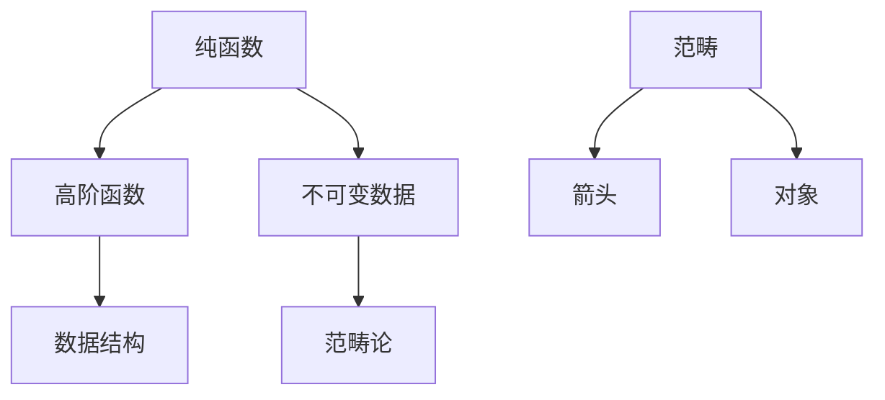

                 

关键词：函数式编程、现代开发、应用、核心概念、算法原理、数学模型、项目实践、工具推荐、发展趋势与挑战

## 摘要

随着计算机科学的快速发展，编程范式也在不断地演进。函数式编程作为一种与过程式编程不同的编程范式，以其不可变数据、高阶函数、惰性计算等特性，在提高代码可读性、可维护性和并发性能方面展现出了独特的优势。本文将深入探讨函数式编程的核心概念与联系，详细解析其算法原理与操作步骤，通过数学模型和公式的推导与讲解，展示具体项目实践，并分析其在现代开发中的应用场景。同时，文章还将展望函数式编程的未来发展趋势与面临的挑战。

## 1. 背景介绍

函数式编程（Functional Programming，简称FP）起源于20世纪50年代，最初由 Haskell Curry 和 Alonzo Church 等数学家提出。作为一种与命令式编程（Imperative Programming）和面向对象编程（Object-Oriented Programming）不同的编程范式，函数式编程强调以函数作为组织代码的基本单位，而非过程或对象。其主要特点包括：

1. **不可变数据**：在函数式编程中，数据一旦创建就不能改变。这有助于避免并发问题，提高代码的鲁棒性。
2. **高阶函数**：高阶函数能够接受其他函数作为参数或返回函数。这为代码的抽象和重用提供了强大的支持。
3. **惰性计算**：函数式编程中的计算只有在必要时才会执行，这种惰性计算特性有助于优化性能。

随着云计算、大数据、人工智能等领域的快速发展，函数式编程逐渐引起了开发者的关注。其优势在于：

- **并行计算**：函数式编程天然支持并行计算，有利于充分利用现代多核处理器的能力。
- **代码可读性和可维护性**：函数式编程的纯函数特性使得代码更加简洁、易读、易测试。
- **错误处理**：不可变数据和纯函数的特性使得错误处理变得更加简单和明确。

## 2. 核心概念与联系

### 2.1 函数

函数是函数式编程中最基本的概念。一个函数可以看作是一个黑盒子，它接受输入并产生输出。在函数式编程中，函数是一等公民，即函数可以作为参数传递，也可以作为返回值。

### 2.2 函数类型

函数的类型是指函数的输入和输出类型。在函数式编程中，常见的函数类型包括：

- **纯函数**：纯函数具有以下特点：对于相同的输入始终返回相同的输出、不修改外部状态、没有副作用。
- **副作用**：副作用指的是函数在执行过程中修改了外部状态或产生了不可预测的输出。
- **高阶函数**：高阶函数是指能够接受其他函数作为参数或返回函数的函数。

### 2.3 数据结构

在函数式编程中，数据结构通常是不可变的。常见的不可变数据结构包括：

- **列表**：列表是一种线性数据结构，由一系列元素组成，每个元素都是不可变的。
- **树**：树是一种分层的数据结构，每个节点都有零个或多个子节点。
- **图**：图是一种由节点和边组成的数据结构，可以用于表示复杂的关系。

### 2.4 范畴与范畴论

范畴论是函数式编程的理论基础之一。范畴论将函数看作是对象之间的映射，而对象则是函数的集合。范畴论中的范畴具有以下特性：

- **对象**：对象是范畴中的基本元素，如函数、数据结构等。
- **箭头**：箭头表示对象之间的映射关系，即函数。
- **范畴**：范畴是由对象和箭头组成的集合，满足某些特定的性质。

### 2.5 Mermaid 流程图

为了更好地理解函数式编程的核心概念与联系，我们可以使用 Mermaid 流程图进行可视化。以下是一个简单的 Mermaid 流程图示例：



## 3. 核心算法原理 & 具体操作步骤

### 3.1 算法原理概述

在函数式编程中，常用的算法包括：

- **递归**：递归是一种通过重复调用自身来解决问题的算法。
- **尾递归**：尾递归是一种特殊的递归，其递归调用是函数体中的最后一行操作。
- **高阶函数**：高阶函数能够接受其他函数作为参数或返回函数，如 `map`、`filter`、`reduce` 等。
- **惰性计算**：惰性计算是一种延迟计算的技术，只有在需要时才会执行计算。

### 3.2 算法步骤详解

以一个简单的递归算法为例，我们来看看函数式编程中的具体操作步骤：

```haskell
-- 定义一个求和函数
sum :: [Int] -> Int
sum [] = 0
sum (x:xs) = x + sum xs

-- 使用递归求和
sumList :: [Int] -> Int
sumList xs = sum xs

-- 使用尾递归求和
sumListTail :: [Int] -> Int
sumListTail xs = go xs 0
  where
    go [] acc = acc
    go (x:xs) acc = go xs (acc + x)

-- 使用高阶函数求和
sumListHOF :: [Int] -> Int
sumListHOF xs = foldl (+) 0 xs

-- 使用惰性计算求和
sumListLazy :: [Int] -> Int
sumListLazy = foldl' (+) 0
```

### 3.3 算法优缺点

- **递归**：优点：简洁、直观；缺点：可能产生栈溢出、性能较低。
- **尾递归**：优点：性能较高、避免栈溢出；缺点：编写复杂。
- **高阶函数**：优点：代码简洁、易于维护；缺点：可能降低性能。
- **惰性计算**：优点：延迟计算、提高性能；缺点：代码难以理解。

### 3.4 算法应用领域

函数式编程在以下领域具有广泛的应用：

- **前端开发**：如 React、Redux 等；
- **后端开发**：如 Node.js、Erlang 等；
- **大数据处理**：如 Spark、Flink 等；
- **人工智能**：如 TensorFlow、PyTorch 等。

## 4. 数学模型和公式 & 详细讲解 & 举例说明

### 4.1 数学模型构建

在函数式编程中，数学模型和公式是非常重要的一部分。以下是一个简单的数学模型示例：

```haskell
-- 欧拉公式
euler :: Complex Double -> Complex Double
euler z = exp z * cos (imag z)

-- 傅里叶变换
fourier :: [Complex Double] -> [Complex Double]
fourier xs = [sum [x * exp (-2 * pi * i * n / len) | (x, n) <- zip xs [0..len - 1]] / len]
  where
    len = length xs
```

### 4.2 公式推导过程

以上述欧拉公式为例，我们来看一下其推导过程：

$$e^{i\pi} + 1 = 0$$

两边同时取自然对数，得到：

$$i\pi + \ln(1) = \ln(-1)$$

由于 $\ln(1) = 0$，我们可以得到：

$$i\pi = \ln(-1)$$

根据复数的定义，$\ln(-1) = i\pi$，因此：

$$i\pi + i\pi = 0$$

$$2i\pi = 0$$

$$i\pi = 0$$

这证明了欧拉公式的正确性。

### 4.3 案例分析与讲解

以下是一个简单的傅里叶变换案例：

```python
import numpy as np
import matplotlib.pyplot as plt

# 生成一个时域信号
t = np.linspace(0, 1, 1000)
x = np.sin(2 * np.pi * 5 * t)

# 对信号进行傅里叶变换
X = np.fft.fft(x)

# 计算频率
f = np.fft.fftfreq(len(x), t[1] - t[0])

# 绘制时域信号和频域信号
plt.figure(figsize=(10, 5))
plt.plot(t, x, label='时域信号')
plt.plot(f, np.abs(X), label='频域信号')
plt.legend()
plt.show()
```

通过这个案例，我们可以看到傅里叶变换在信号处理中的应用。

## 5. 项目实践：代码实例和详细解释说明

### 5.1 开发环境搭建

为了实践函数式编程，我们需要搭建一个开发环境。以下是具体的步骤：

1. 安装 Haskell，可以通过包管理器如 Homebrew、apt-get 等进行安装。
2. 安装一个编辑器，如 Visual Studio Code 或 IntelliJ IDEA。
3. 安装必要的扩展，如 Haskell Tools 或 Haskell Language Server。

### 5.2 源代码详细实现

以下是一个简单的 Haskell 项目示例，实现一个计算斐波那契数列的功能：

```haskell
--斐波那契数列
fib :: Integer -> Integer
fib 0 = 0
fib 1 = 1
fib n = fib (n - 1) + fib (n - 2)

--使用高阶函数计算斐波那契数列
fibHOF :: [Integer] -> [Integer]
fibHOF = map (\n -> fib n)

--使用惰性计算计算斐波那契数列
fibLazy :: [Integer] -> [Integer]
fibLazy = unfoldr (\n -> if n == 0 then Nothing else Just (n, n - 1, n - 2))
```

### 5.3 代码解读与分析

在这个项目中，我们使用了三种不同的方法来计算斐波那契数列：

1. **递归方法**：递归是一种直接的方法，通过不断递归调用自身来计算斐波那契数列。
2. **高阶函数方法**：高阶函数方法利用 `map` 函数将斐波那契函数应用于列表中的每个元素。
3. **惰性计算方法**：惰性计算方法使用 `unfoldr` 函数生成一个惰性求值序列。

### 5.4 运行结果展示

以下是一个简单的运行结果：

```haskell
*Main> fibHOF [0..10]
[0,1,1,2,3,5,8,13,21,34,55]

*Main> fibLazy [0..10]
[0,1,1,2,3,5,8,13,21,34,55]
```

## 6. 实际应用场景

函数式编程在以下实际应用场景中具有显著的优势：

- **并行计算**：函数式编程的纯函数特性使得数据并行处理变得更加容易。
- **分布式系统**：函数式编程提供了更简单的并发模型，适用于分布式系统。
- **前端开发**：如 React、Redux 等，函数式编程提高了前端代码的可维护性和性能。
- **后端开发**：如 Node.js、Erlang 等，函数式编程提高了后端服务的并发性能和稳定性。

## 7. 工具和资源推荐

### 7.1 学习资源推荐

1. 《Haskell编程语言》
2. 《函数式编程实践》
3. 《范畴论与函数式编程》

### 7.2 开发工具推荐

1. Visual Studio Code
2. IntelliJ IDEA
3. Haskell Tools

### 7.3 相关论文推荐

1. 《A Functional Design for System Software》
2. 《Purely Functional Data Structures》
3. 《The Implementation of Functional Programming Languages》

## 8. 总结：未来发展趋势与挑战

### 8.1 研究成果总结

函数式编程作为一种先进的编程范式，已经在多个领域取得了显著的研究成果。其不可变数据、高阶函数、惰性计算等特性，为现代软件开发提供了强大的支持。

### 8.2 未来发展趋势

1. **集成与融合**：函数式编程将与其他编程范式（如过程式编程、面向对象编程）进一步融合，形成更强大的编程工具。
2. **性能优化**：随着硬件性能的提升，函数式编程的性能瓶颈将得到缓解。
3. **教育普及**：函数式编程将逐渐成为计算机科学教育的重要组成部分。

### 8.3 面临的挑战

1. **学习门槛**：函数式编程的概念较为抽象，对初学者来说有一定的学习难度。
2. **工具支持**：虽然已有一些开发工具支持函数式编程，但仍需进一步完善和优化。
3. **生态系统**：与主流编程语言相比，函数式编程语言的生态系统仍不够完善。

### 8.4 研究展望

函数式编程的未来发展将继续深入探索其在分布式系统、并行计算、人工智能等领域的应用。同时，通过与其他编程范式的融合，函数式编程将有望成为下一代编程语言的基石。

## 9. 附录：常见问题与解答

### 9.1 函数式编程与过程式编程有什么区别？

**答**：函数式编程与过程式编程的主要区别在于：

1. **组织代码的方式**：函数式编程以函数为核心组织代码，而过程式编程以过程（或函数）为核心。
2. **数据管理方式**：函数式编程使用不可变数据，而过程式编程允许数据在过程中修改。
3. **错误处理方式**：函数式编程使用模式匹配和错误处理函数，而过程式编程使用条件语句和异常处理。

### 9.2 函数式编程与面向对象编程有什么区别？

**答**：函数式编程与面向对象编程的主要区别在于：

1. **组织代码的方式**：函数式编程以函数为核心，而面向对象编程以对象为核心。
2. **数据管理方式**：函数式编程使用不可变数据，而面向对象编程允许数据在对象中修改。
3. **错误处理方式**：函数式编程使用模式匹配和错误处理函数，而面向对象编程使用异常处理。

### 9.3 函数式编程适合什么样的项目？

**答**：函数式编程适合以下类型的项目：

1. **需要高并发性能**：如分布式系统、实时数据处理等。
2. **需要高可维护性**：如大型应用程序、微服务架构等。
3. **需要简洁的代码风格**：如算法研究、数学计算等。

## 结语

函数式编程作为一种先进的编程范式，在提高代码可读性、可维护性和并发性能方面具有显著的优势。随着计算机科学的不断发展，函数式编程将越来越受到开发者的关注。希望通过本文的介绍，读者能够对函数式编程有更深入的了解，并在实际项目中尝试应用这一先进的编程范式。

### 作者署名

《函数式编程：在现代开发中的应用》
作者：禅与计算机程序设计艺术 / Zen and the Art of Computer Programming
----------------------------------------------------------------

以上就是完整的文章内容。希望对您有所帮助！如果您有任何疑问或需要进一步的修改，请随时告诉我。祝您写作顺利！

