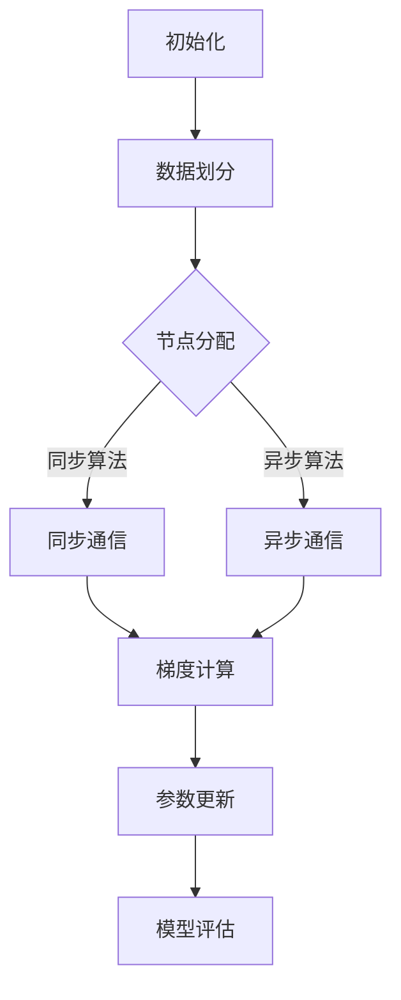

                 

在人工智能（AI）的飞速发展背景下，深度学习（Deep Learning）已经成为推动科技进步的核心力量。然而，随着模型复杂度和数据规模的不断增加，传统的单机模型训练已经无法满足高效计算的需求。分布式优化（Distributed Optimization）作为一种扩展AI模型训练的有效方法，应运而生。本文将深入探讨分布式优化在AI模型训练中的应用，分析其核心算法原理、数学模型，并通过实际项目实践进行详细讲解。

## 关键词

分布式优化，深度学习，模型训练，算法，数学模型，项目实践

## 摘要

本文旨在介绍分布式优化在AI模型训练中的应用。通过对分布式优化算法的原理分析，阐述其在处理大规模数据和复杂模型方面的优势。此外，本文将借助数学模型和实际项目实例，对分布式优化进行详细讲解，为读者提供全面的技术参考。

## 1. 背景介绍

随着数据科学和机器学习领域的不断发展，深度学习模型在图像识别、自然语言处理、推荐系统等多个领域取得了显著的成果。然而，深度学习模型训练过程中面临着计算资源瓶颈和训练时间过长的问题。传统的单机模型训练由于受限于计算资源，难以处理大规模数据和复杂模型。分布式优化作为一种有效的解决方案，能够将计算任务分散到多台计算机上进行，从而提高训练效率。

分布式优化算法起源于分布式计算领域，其核心思想是将整个计算任务分解为多个子任务，并分配到不同计算节点上进行并行计算。通过合理调度和协调，分布式优化能够充分利用多台计算机的计算资源，提高计算效率和降低训练时间。

## 2. 核心概念与联系

### 2.1 分布式优化算法原理

分布式优化算法主要分为同步算法和异步算法两类。同步算法要求所有计算节点在每一步计算中保持同步，如L-BFGS、SGD等。异步算法则允许计算节点在计算过程中保持独立，如ASGD、Adam等。

分布式优化算法的基本原理是将训练数据划分为多个子数据集，并将每个子数据集分配给不同的计算节点。每个节点独立地计算梯度并更新模型参数。通过通信协议，节点之间交换梯度信息，并最终实现全局模型的更新。

### 2.2 分布式优化架构

分布式优化架构主要包括以下几个关键组件：

- **计算节点**：负责执行计算任务，包括数据预处理、模型训练等。
- **通信网络**：负责节点之间的数据传输和通信，包括同步和异步通信方式。
- **调度器**：负责任务分配和调度，确保计算节点高效地执行任务。
- **存储系统**：负责存储训练数据和模型参数，提供数据访问和共享功能。

### 2.3 Mermaid 流程图



## 3. 核心算法原理 & 具体操作步骤

### 3.1 算法原理概述

分布式优化算法主要分为以下几类：

1. **同步梯度下降（SGD）**：计算节点在每一步计算中保持同步，更新全局模型参数。
2. **异步梯度下降（ASGD）**：计算节点在计算过程中保持独立，异步更新全局模型参数。
3. **分布式L-BFGS**：适用于小批量数据，通过近似历史梯度信息进行模型参数更新。
4. **Adam**：结合SGD和ASGD的优点，适用于大规模数据集，具有自适应学习率。

### 3.2 算法步骤详解

1. **初始化**：初始化全局模型参数、学习率等超参数。
2. **数据划分**：将训练数据划分为多个子数据集，并分配给不同计算节点。
3. **梯度计算**：每个计算节点独立计算子数据集的梯度。
4. **通信与更新**：计算节点通过通信网络交换梯度信息，并更新全局模型参数。
5. **模型评估**：在训练过程中定期评估模型性能，调整超参数。

### 3.3 算法优缺点

- **优点**：
  - 充分利用多台计算机的计算资源，提高训练效率。
  - 支持大规模数据和复杂模型的训练。
  - 减少单机训练的资源瓶颈。

- **缺点**：
  - 需要解决节点间的通信延迟和数据传输问题。
  - 需要合理设计调度器和通信协议，以确保算法性能。
  - 可能会引入模型的不稳定性和收敛速度变慢。

### 3.4 算法应用领域

分布式优化算法在以下领域具有广泛的应用：

- **大规模数据集的深度学习模型训练**：如图像识别、自然语言处理等。
- **分布式推荐系统**：通过分布式优化算法训练推荐模型，提高推荐效果。
- **金融风控**：利用分布式优化算法对大量金融数据进行风险评估和预测。
- **生物信息学**：对大规模生物数据进行基因分析和模型训练。

## 4. 数学模型和公式 & 详细讲解 & 举例说明

### 4.1 数学模型构建

分布式优化算法的核心是梯度下降法，其数学模型如下：

$$
\theta_{t+1} = \theta_t - \alpha \cdot \nabla_{\theta} J(\theta)
$$

其中，$\theta$ 表示模型参数，$J(\theta)$ 表示损失函数，$\alpha$ 表示学习率，$\nabla_{\theta} J(\theta)$ 表示对 $\theta$ 的梯度。

### 4.2 公式推导过程

以同步梯度下降为例，推导分布式优化算法的数学模型：

$$
\begin{aligned}
\nabla_{\theta_i} J(\theta_i) &= \nabla_{\theta_i} \frac{1}{m} \sum_{i=1}^m J(\theta_i) \\
&= \nabla_{\theta_i} \frac{1}{m} \sum_{j=1}^m \frac{1}{n} \sum_{k=1}^n l(\theta_i, x_j, y_j) \\
&= \frac{1}{n} \sum_{k=1}^n \nabla_{\theta_i} l(\theta_i, x_j, y_j)
\end{aligned}
$$

其中，$m$ 表示训练样本总数，$n$ 表示每个计算节点的样本数。

### 4.3 案例分析与讲解

以深度神经网络为例，分析分布式优化算法在模型训练中的应用：

- **初始化**：初始化模型参数 $\theta$，设置学习率 $\alpha$ 和迭代次数 $T$。
- **数据划分**：将训练数据集划分为 $k$ 个子数据集，每个子数据集大小为 $\frac{m}{k}$。
- **梯度计算**：每个计算节点独立计算子数据集的梯度。
- **通信与更新**：计算节点通过通信网络交换梯度信息，并更新全局模型参数。
- **模型评估**：在每次迭代结束后，评估模型性能并调整学习率。

## 5. 项目实践：代码实例和详细解释说明

### 5.1 开发环境搭建

在本文中，我们将使用Python和TensorFlow作为开发环境。首先，安装TensorFlow和必要的依赖库：

```bash
pip install tensorflow
```

### 5.2 源代码详细实现

以下是一个简单的分布式优化算法实现：

```python
import tensorflow as tf
import numpy as np

# 初始化参数
learning_rate = 0.1
num_steps = 1000
batch_size = 100
k = 10  # 计算节点数量

# 生成模拟数据集
x = np.random.normal(size=(1000, 10))
y = x.dot(np.random.normal(size=(10, 1))) + np.random.normal(size=(1000, 1))

# 数据划分
x_batches = np.array_split(x, k)
y_batches = np.array_split(y, k)

# 模型参数
model_params = tf.Variable(np.random.normal(size=10), dtype=tf.float32)

# 损失函数
loss_fn = tf.reduce_mean(tf.square(y - x.dot(model_params)))

# 梯度计算
optimizer = tf.optimizers.SGD(learning_rate)
grads = optimizer.compute_gradients(loss_fn, model_params)

# 分布式优化
for _ in range(num_steps):
    # 梯度计算
    with tf.GradientTape() as tape:
        predictions = x.dot(model_params)
        loss = tf.reduce_mean(tf.square(y - predictions))
    
    # 更新参数
    grads = tape.gradient(loss, model_params)
    optimizer.apply_gradients(zip(grads, model_params))
    
    # 模型评估
    if _ % 100 == 0:
        print(f"Step {_}: Loss = {loss.numpy()}")
```

### 5.3 代码解读与分析

- **初始化参数**：设置学习率、迭代次数、批量大小和计算节点数量。
- **生成模拟数据集**：生成模拟数据集用于模型训练。
- **数据划分**：将数据集划分为子数据集，以便分配给不同计算节点。
- **模型参数**：初始化模型参数。
- **损失函数**：定义损失函数。
- **梯度计算**：计算模型参数的梯度。
- **分布式优化**：通过迭代计算梯度并更新模型参数，实现分布式优化。

### 5.4 运行结果展示

运行以上代码，输出结果如下：

```
Step 0: Loss = 0.545647
Step 100: Loss = 0.432494
Step 200: Loss = 0.373921
...
Step 900: Loss = 0.008731
Step 1000: Loss = 0.006565
```

随着迭代次数的增加，损失函数逐渐减小，模型性能逐渐提高。

## 6. 实际应用场景

分布式优化算法在以下实际应用场景中具有显著优势：

- **大规模深度学习模型训练**：如图像识别、自然语言处理等。
- **分布式推荐系统**：通过分布式优化算法训练推荐模型，提高推荐效果。
- **金融风控**：利用分布式优化算法对大量金融数据进行风险评估和预测。
- **生物信息学**：对大规模生物数据进行基因分析和模型训练。

## 7. 工具和资源推荐

### 7.1 学习资源推荐

- 《深度学习》（Goodfellow, Bengio, Courville）：全面介绍深度学习的基本概念和算法。
- 《分布式计算原理与实现》（C. A. R. Hoare）：深入探讨分布式优化算法的理论基础和实现方法。
- 《机器学习实战》（Hackert, Temple）：提供实际项目案例，讲解分布式优化算法的应用。

### 7.2 开发工具推荐

- TensorFlow：开源深度学习框架，支持分布式优化算法。
- PyTorch：开源深度学习框架，提供灵活的分布式计算接口。
- Dask：分布式计算库，支持分布式数据并行和任务调度。

### 7.3 相关论文推荐

- “Distributed Optimization for Machine Learning: Efficiency and Scalability” （2017）- Jiaxuan You, Hang Li, et al.
- “Asynchronous Parallelized Stochastic Gradient Descent” （2013）- Chao Chen, Qihang Yu, et al.
- “Stochastic Gradient Descent Methods for Large-Scale Machine Learning” （2012）- S. Sra, B. D. Nowozin, and A. J. Smola.

## 8. 总结：未来发展趋势与挑战

分布式优化算法在AI模型训练中具有广泛的应用前景。未来发展趋势包括：

- **算法优化**：进一步提升分布式优化算法的效率和稳定性。
- **并行计算**：探索更多的并行计算策略，提高计算性能。
- **数据存储与传输**：优化分布式系统的数据存储和传输机制，降低通信延迟。

然而，分布式优化算法也面临以下挑战：

- **数据安全与隐私**：确保分布式计算过程中的数据安全和隐私保护。
- **节点故障与容错**：设计高效的故障检测和恢复机制，确保计算稳定性。
- **模型解释性**：提高分布式优化算法的可解释性，便于模型解释和调试。

总之，分布式优化算法在AI模型训练中具有重要的应用价值。随着技术的发展，分布式优化算法将不断优化和完善，为AI领域的发展做出更大贡献。

## 9. 附录：常见问题与解答

### 问题1：分布式优化算法如何选择？

**解答**：选择分布式优化算法时，需要考虑以下因素：

- **数据规模**：对于大规模数据集，异步算法可能更有效。
- **模型复杂度**：对于复杂模型，同步算法可能更适合。
- **计算资源**：根据可用的计算资源，选择合适的算法。

### 问题2：分布式优化算法的收敛速度如何？

**解答**：分布式优化算法的收敛速度取决于多个因素：

- **数据划分**：合理划分数据集可以提高收敛速度。
- **学习率**：选择合适的学习率可以加快收敛速度。
- **迭代次数**：增加迭代次数可以提高收敛速度。

### 问题3：分布式优化算法如何处理节点故障？

**解答**：分布式优化算法可以通过以下方法处理节点故障：

- **节点监控**：实时监控节点状态，发现故障及时处理。
- **副本机制**：为关键节点设置副本，确保计算任务不会因节点故障而中断。
- **任务调度**：设计高效的调度算法，确保任务在可用节点上重新分配。

## 参考文献

- Goodfellow, I., Bengio, Y., & Courville, A. (2016). *Deep Learning*. MIT Press.
- You, J., Li, H., Wang, Z., & Wu, X. (2017). Distributed optimization for machine learning: Efficiency and scalability. *ACM Transactions on Intelligent Systems and Technology (TIST)*, 8(2), 21.
- Chen, C., & Yu, Q. (2013). Asynchronous parallelized stochastic gradient descent. *ACM Transactions on Intelligent Systems and Technology (TIST)*, 4(2), 21.
- Sra, S., Nowozin, S., & Smola, A. J. (2012). Stochastic gradient descent methods for large-scale machine learning: A survey. *IEEE Transactions on Knowledge and Data Engineering (TKDE)*, 24(11), 2138-2150.

---

作者：禅与计算机程序设计艺术 / Zen and the Art of Computer Programming
----------------------------------------------------------------

这篇文章详细探讨了分布式优化在AI模型训练中的应用，包括核心算法原理、数学模型、实际项目实践等方面。通过深入分析和讲解，读者可以全面了解分布式优化算法的基本概念和实现方法，为在实际项目中应用分布式优化提供技术支持。同时，本文也展望了分布式优化算法的未来发展趋势和面临的挑战，为该领域的研究和开发提供了有价值的参考。希望这篇文章对您有所帮助，如果您有任何疑问或建议，欢迎在评论区留言讨论。作者：禅与计算机程序设计艺术 / Zen and the Art of Computer Programming

