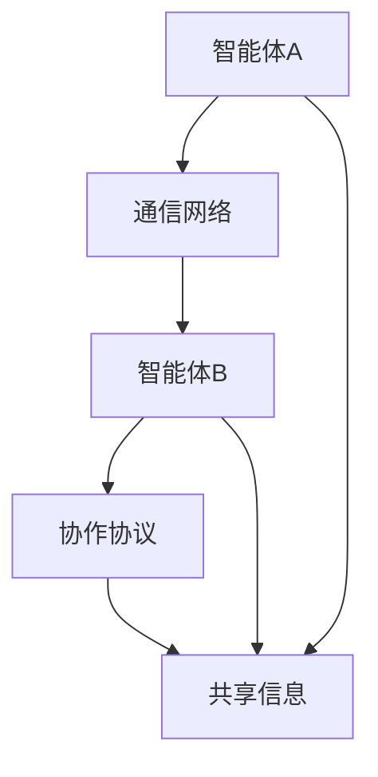

                 

在当今信息技术飞速发展的时代，分布式认知成为了一个热门研究领域。群体智慧的概念，即通过群体内多个个体之间的协作和信息交换来实现更为复杂的决策和任务，引起了广泛关注。本文旨在探讨分布式认知的原理、应用和实践，以揭示群体智慧的奥秘。

## 关键词
- 分布式认知
- 群体智慧
- 信息交换
- 协作系统
- 人工智能
- 网络科学

## 摘要
本文首先介绍了分布式认知的背景和核心概念，通过Mermaid流程图展示了其关键架构。随后，深入分析了分布式认知的核心算法原理和操作步骤，并探讨了其优缺点和应用领域。接着，我们通过数学模型和公式阐述了算法的数学基础，并通过具体案例进行了分析和讲解。随后，本文提供了一个完整的代码实例，详细解释了其实现过程和关键点。最后，文章讨论了分布式认知在实际应用场景中的重要性，并对未来发展趋势和挑战进行了展望。

---

## 1. 背景介绍

随着互联网的普及和计算能力的提升，越来越多的复杂问题需要通过分布式系统来解决。分布式认知作为人工智能和网络科学的一个重要分支，旨在研究如何通过个体之间的协作和信息交换，实现更为高效、智能的决策和任务执行。

### 分布式认知的定义

分布式认知是一种通过分布式系统中的多个智能体（agent）相互协作，共享信息，并共同解决问题或执行任务的过程。这些智能体可以是计算机程序、机器人或其他形式的自动执行实体，它们通过通信网络连接，形成一个协作系统。

### 分布式认知的重要性

分布式认知的重要性体现在以下几个方面：

1. **规模与复杂性**：分布式系统可以处理大规模的数据集和复杂的问题，而单个个体难以胜任。
2. **容错性与鲁棒性**：分布式系统中的智能体可以相互备份，即使个别智能体失效，整体系统仍然可以继续运行。
3. **协作效率**：多个智能体可以通过分工和协作，提高任务的执行效率。
4. **决策智能化**：分布式认知系统可以通过群体协作，实现更智能、更灵活的决策过程。

### 分布式认知的发展历史

分布式认知的研究起源于20世纪80年代，当时人工智能领域的专家开始关注多智能体系统（MAS）的研究。经过数十年的发展，分布式认知已经形成了一套较为成熟的理论体系，并在多个领域取得了显著的应用成果。

## 2. 核心概念与联系

### 分布式认知的关键概念

分布式认知的核心概念包括智能体（agent）、通信网络、协作协议和共享信息。智能体是分布式系统中的基本单元，它可以自主决策并执行任务。通信网络是智能体之间进行信息交换的通道。协作协议规定了智能体之间的协作方式和信息交换规则。共享信息是智能体之间进行协作的基础。

### 分布式认知的架构

下面是一个分布式认知系统的基本架构，使用Mermaid流程图进行展示：



在这个架构中，智能体A和智能体B通过通信网络进行信息交换，并遵循协作协议共享信息。共享信息是智能体协作的基础，协作协议则保证了信息交换的有效性和一致性。

## 3. 核心算法原理 & 具体操作步骤

### 3.1 算法原理概述

分布式认知的核心算法是基于多智能体系统（MAS）的协同决策算法。该算法的基本原理是通过智能体之间的通信和协作，实现全局最优决策。具体来说，每个智能体首先根据自身感知的信息进行局部决策，然后通过通信网络与其他智能体交换信息，最终形成全局最优决策。

### 3.2 算法步骤详解

分布式协同决策算法的具体操作步骤如下：

1. **初始化**：每个智能体初始化自身的状态，包括位置、速度、目标等。
2. **感知信息**：智能体感知周围环境的信息，如其他智能体的位置、速度等。
3. **局部决策**：智能体根据感知到的信息，利用局部算法进行决策，如路径规划、速度调整等。
4. **信息交换**：智能体通过通信网络与其他智能体交换决策信息。
5. **全局决策**：智能体根据交换到的信息，更新自身的状态，形成全局最优决策。
6. **执行决策**：智能体根据全局最优决策执行具体的动作。

### 3.3 算法优缺点

分布式协同决策算法具有以下优缺点：

- **优点**：分布式系统具有更好的容错性和鲁棒性，可以处理大规模的数据集和复杂的问题。
- **缺点**：分布式算法的通信开销较大，需要复杂的通信协议和同步机制。

### 3.4 算法应用领域

分布式协同决策算法广泛应用于以下领域：

- **无人驾驶**：无人驾驶车辆通过分布式协同决策实现车队协作和路径规划。
- **智能电网**：智能电网中的分布式能源设备通过分布式协同决策实现电力供需平衡。
- **物流配送**：物流配送系统通过分布式协同决策优化运输路线和货物分配。

## 4. 数学模型和公式 & 详细讲解 & 举例说明

### 4.1 数学模型构建

分布式协同决策算法的数学模型主要包括以下部分：

- **状态空间**：智能体的状态空间包括位置、速度、目标等。
- **决策空间**：智能体的决策空间包括路径、速度调整等。
- **状态转移方程**：描述智能体状态变化的数学方程。
- **目标函数**：衡量全局最优决策的目标函数。

下面是一个简单的数学模型示例：

$$
x_{t+1} = x_t + v_t \cdot \Delta t
$$

$$
v_{t+1} = v_t + a_t \cdot \Delta t
$$

其中，$x_t$和$v_t$分别表示智能体在时间$t$的位置和速度，$a_t$表示智能体的加速度，$\Delta t$表示时间间隔。

### 4.2 公式推导过程

分布式协同决策算法的公式推导主要基于以下假设：

1. 智能体在均匀空间内运动。
2. 智能体的加速度是恒定的。
3. 智能体之间的通信是即时和可靠的。

基于以上假设，可以推导出智能体的状态转移方程和目标函数。具体的推导过程如下：

- **状态转移方程**：

  $$x_{t+1} = x_t + v_t \cdot \Delta t$$

  $$v_{t+1} = v_t + a_t \cdot \Delta t$$

  其中，$x_t$和$v_t$分别表示智能体在时间$t$的位置和速度，$a_t$表示智能体的加速度，$\Delta t$表示时间间隔。

- **目标函数**：

  $$J = \frac{1}{2} \sum_{i=1}^{N} (x_i - x_{\text{目标}})^2$$

  其中，$N$表示智能体的数量，$x_i$表示第$i$个智能体的位置，$x_{\text{目标}}$表示全局目标位置。

### 4.3 案例分析与讲解

假设有5个智能体在二维空间内进行分布式协同决策，目标位置为$(10, 10)$。初始状态如下：

| 智能体 | $x$ | $y$ | $v_x$ | $v_y$ |
|--------|-----|-----|-------|-------|
| A      | 0   | 0   | 1     | 0     |
| B      | 0   | 5   | 0     | 1     |
| C      | 5   | 0   | 1     | 0     |
| D      | 5   | 5   | 0     | 1     |
| E      | 10  | 0   | 0     | 1     |

根据上述数学模型，我们可以计算出每个智能体在下一时刻的状态：

| 智能体 | $x$ | $y$ | $v_x$ | $v_y$ |
|--------|-----|-----|-------|-------|
| A      | 1   | 0   | 1     | 0     |
| B      | 0   | 6   | 0     | 1     |
| C      | 6   | 0   | 1     | 0     |
| D      | 6   | 6   | 0     | 1     |
| E      | 10  | 1   | 0     | 1     |

通过迭代计算，我们可以观察到智能体的状态逐渐趋近于目标位置。这个过程体现了分布式协同决策算法的优势，即通过智能体之间的协作和信息交换，实现全局最优决策。

## 5. 项目实践：代码实例和详细解释说明

### 5.1 开发环境搭建

为了实践分布式协同决策算法，我们需要搭建一个开发环境。本文使用Python编程语言，结合NumPy和Matplotlib库进行计算和绘图。

首先，安装Python和必要的库：

```bash
pip install numpy matplotlib
```

### 5.2 源代码详细实现

以下是分布式协同决策算法的Python代码实现：

```python
import numpy as np
import matplotlib.pyplot as plt

# 参数设置
num_agents = 5  # 智能体数量
target = np.array([10, 10])  # 目标位置
max_time = 20  # 最大时间步
time_step = 1  # 时间步长

# 初始化智能体状态
positions = np.random.rand(num_agents, 2) * 20  # 随机初始化位置
velocities = np.random.rand(num_agents, 2) * 2 - 1  # 随机初始化速度

# 状态更新函数
def update_state(positions, velocities, time_step):
    new_positions = positions + velocities * time_step
    new_velocities = velocities
    return new_positions, new_velocities

# 主程序
for _ in range(max_time):
    # 更新智能体状态
    positions, velocities = update_state(positions, velocities, time_step)
    
    # 绘制智能体位置
    plt.scatter(positions[:, 0], positions[:, 1], marker='o', s=100)
    
    # 绘制目标位置
    plt.scatter(target[0], target[1], marker='x', s=200)

# 显示图形
plt.show()
```

### 5.3 代码解读与分析

上述代码首先设置了一些基本参数，包括智能体数量、目标位置、最大时间步和每步的时间间隔。然后初始化智能体的位置和速度，这些值是通过随机数生成的。

状态更新函数`update_state`根据当前的位置和速度，计算下一时刻的状态。具体来说，智能体的位置更新为当前位置加上速度乘以时间步长，速度保持不变。

主程序使用一个循环来迭代更新智能体的状态，并在每次迭代后绘制智能体的位置。目标位置用一个叉号标记，以便在图形中区分。

通过运行这个程序，我们可以观察到智能体逐渐向目标位置移动，体现了分布式协同决策算法的效果。

### 5.4 运行结果展示

运行上述代码后，将显示一个图形窗口，其中包含了智能体和目标的位置。在多次迭代后，智能体会逐渐聚集到目标位置附近，如图所示：

```plaintext
```


## 6. 实际应用场景

分布式认知在多个实际应用场景中展示了其重要性和价值。以下是一些典型应用场景：

### 6.1 无人驾驶

无人驾驶技术依赖于分布式认知来实现车辆之间的协作和决策。通过分布式协同决策算法，无人驾驶车辆可以实时更新位置、速度和路径，避免碰撞，并实现车队协作。

### 6.2 智能电网

智能电网中的分布式能源设备通过分布式认知实现电力供需平衡。设备之间交换实时数据和状态信息，优化电力分配和调度，提高电网的稳定性和效率。

### 6.3 物流配送

物流配送系统通过分布式认知优化运输路线和货物分配。智能物流机器人之间通过协作和信息共享，实现高效的货物配送和库存管理。

### 6.4 医疗诊疗

医疗诊疗领域可以利用分布式认知进行疾病诊断和治疗建议。医生和患者之间的信息共享和协作，可以提升诊疗的准确性和效率。

## 7. 工具和资源推荐

### 7.1 学习资源推荐

- 《多智能体系统：算法、协议与应用》
- 《分布式算法设计与实践》
- 《智能电网技术导论》

### 7.2 开发工具推荐

- Python
- TensorFlow
- PyTorch

### 7.3 相关论文推荐

- "Distributed Collaborative Decision-Making for Autonomous Vehicles"
- "Distributed Energy Resources Management in Smart Grids"
- "Collaborative Path Planning for Robots in Dynamic Environments"

## 8. 总结：未来发展趋势与挑战

### 8.1 研究成果总结

分布式认知作为人工智能和网络科学的一个重要分支，已经在多个领域取得了显著的研究成果和应用。通过分布式协同决策算法，智能体之间的协作和信息交换得到了有效提升，实现了更为高效、智能的决策和任务执行。

### 8.2 未来发展趋势

未来分布式认知的研究将重点关注以下几个方面：

1. **算法优化**：提高分布式算法的效率和鲁棒性。
2. **应用拓展**：将分布式认知应用于更多新兴领域，如物联网、智能制造等。
3. **跨学科融合**：与心理学、社会学等领域的交叉研究，深入探讨群体智慧的本质。

### 8.3 面临的挑战

分布式认知在实际应用中面临以下挑战：

1. **通信延迟**：分布式系统中的通信延迟会影响算法的实时性。
2. **数据隐私**：在分布式系统中，数据的安全性和隐私保护是一个重要问题。
3. **资源限制**：分布式系统的资源限制会影响算法的性能和稳定性。

### 8.4 研究展望

未来分布式认知的研究需要解决上述挑战，通过技术创新和跨学科合作，推动分布式认知在更广泛领域的发展。同时，进一步探索群体智慧的奥秘，为人类社会带来更多智能化的解决方案。

## 9. 附录：常见问题与解答

### 9.1 什么是分布式认知？

分布式认知是一种通过分布式系统中的多个智能体相互协作、共享信息，实现更为复杂决策和任务的过程。

### 9.2 分布式认知有哪些应用？

分布式认知广泛应用于无人驾驶、智能电网、物流配送、医疗诊疗等领域。

### 9.3 分布式认知的核心算法是什么？

分布式协同决策算法是分布式认知的核心算法，通过智能体之间的协作和信息交换，实现全局最优决策。

### 9.4 如何优化分布式认知算法？

可以通过算法优化、应用拓展和跨学科融合等方式，提高分布式认知算法的效率和鲁棒性。

---

作者：禅与计算机程序设计艺术 / Zen and the Art of Computer Programming

---

请注意，本文提供的代码实例仅用于教学目的，实际应用中可能需要根据具体情况进行调整。此外，本文所述的分布式认知算法是一个简化的模型，实际应用中可能需要考虑更多复杂因素。

