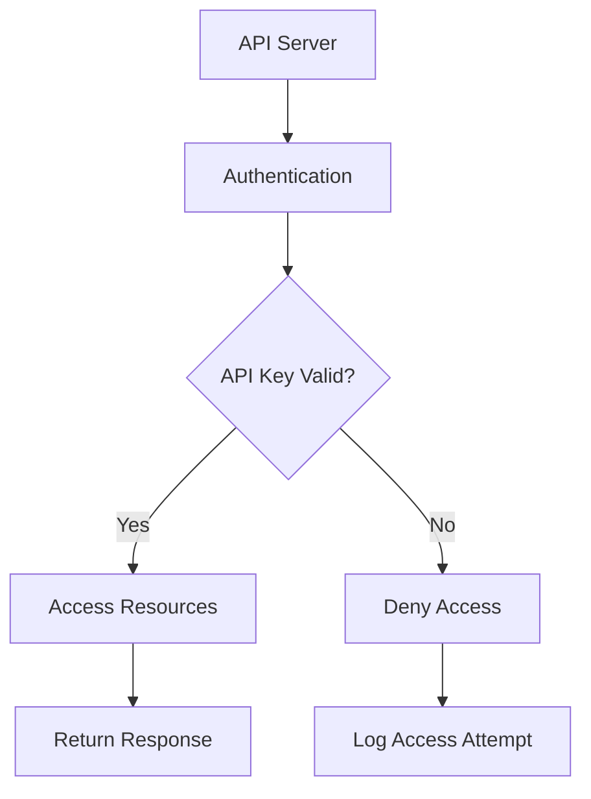

                 

在当今数字化时代，API（应用程序编程接口）已成为企业和服务提供商与开发人员之间进行交互的桥梁。API 允许开发者利用第三方服务构建自己的应用程序，从而缩短开发周期并提高生产力。然而，随着 API 的普及和使用的增加，如何有效地管理访问权限和资源分配成为一个关键问题。本文将深入探讨分级 API Key 的概念、实现方法及其在实际应用中的重要价值。

## 关键词 Keywords
- API Key
- 分级权限
- 访问控制
- 资源管理
- 安全性
- 开发者体验

## 摘要 Abstract
本文将介绍分级 API Key 的概念，详细阐述其在 API 管理中的重要性。我们将探讨如何通过分级权限来控制 API 访问，以及如何实现这一机制。此外，本文还将提供实际应用场景，展示分级 API Key 如何帮助企业和开发者提高 API 的安全性和可管理性。

## 1. 背景介绍

### API 的普及

API 是一种用于不同软件系统之间相互通信的接口。随着云计算、移动应用和物联网的兴起，API 已经成为现代软件开发中不可或缺的一部分。许多企业和服务提供商都提供 API 接口，以允许第三方开发者利用其服务来创建创新的应用程序。

### API 访问管理的重要性

API 的开放性带来了便利，但也带来了安全和管理方面的挑战。未经授权的访问可能导致数据泄露、服务过载以及资源滥用。因此，有效的 API 访问管理变得至关重要。这包括授权、身份验证、访问控制和资源分配。

### 分级 API Key 的兴起

为了应对这些挑战，分级 API Key 应运而生。这种机制允许企业和服务提供商根据用户的角色和权限分配不同的 API Key，从而实现精细化的访问控制和资源管理。分级 API Key 不仅提高了系统的安全性，还增强了用户体验和开发效率。

## 2. 核心概念与联系

在深入探讨分级 API Key 的实现之前，我们需要明确几个核心概念和它们之间的关系。

### 2.1 API Key

API Key 是一个唯一的标识符，用于验证 API 请求的合法性。每个开发者或应用程序都分配有一个 API Key，以便在使用 API 时进行身份验证。

### 2.2 分级权限

分级权限是一种基于角色的访问控制机制，它将用户分为不同的等级，每个等级拥有不同的权限和资源访问权限。这种机制有助于确保只有授权用户能够访问特定的 API 功能。

### 2.3 访问控制

访问控制是指对用户访问系统资源进行限制和保护的一系列策略和措施。在分级 API Key 模型中，访问控制是通过 API Key 的权限等级来实现的。

### 2.4 资源管理

资源管理涉及对系统资源的监控、分配和优化。在分级 API Key 模型中，资源管理可以通过限制不同等级用户的 API 请求频率和请求量来实现。

下面是一个使用 Mermaid 绘制的流程图，展示了分级 API Key 的基本架构：



## 3. 核心算法原理 & 具体操作步骤

### 3.1 算法原理概述

分级 API Key 的核心算法原理基于以下几个步骤：

1. **身份验证**：每次请求时，API Server 首先验证 API Key 的有效性。
2. **权限检查**：根据 API Key 的权限等级，确定用户是否有权限访问请求的资源。
3. **资源访问**：如果权限检查通过，API Server 允许用户访问请求的资源。
4. **日志记录**：无论请求是否成功，都会记录访问日志，以便进行监控和审计。

### 3.2 算法步骤详解

下面详细描述每个步骤的具体操作：

#### 3.2.1 身份验证

1. **接收请求**：API Server 接收到用户的 API 请求。
2. **提取 API Key**：从请求头中提取 API Key。
3. **查询数据库**：在权限数据库中查询该 API Key 的详细信息。

#### 3.2.2 权限检查

1. **读取权限等级**：根据 API Key 的信息，读取其权限等级。
2. **与请求资源对比**：检查请求的资源是否在权限范围内。
3. **决策**：如果权限匹配，则继续下一步；否则，拒绝请求。

#### 3.2.3 资源访问

1. **执行请求**：如果权限检查通过，API Server 执行相应的操作，如数据查询、更新或删除。
2. **返回响应**：将操作结果返回给用户。

#### 3.2.4 日志记录

1. **记录访问信息**：无论请求是否成功，都记录 API Key、请求时间、请求类型、请求结果等信息。
2. **存储日志**：将日志存储在数据库或日志文件中，以便后续分析。

### 3.3 算法优缺点

#### 优点

- **精细控制**：分级 API Key 允许根据用户的权限等级进行精细控制，确保只有授权用户可以访问特定的资源。
- **安全性高**：通过严格的身份验证和权限检查，可以防止未经授权的访问和数据泄露。
- **管理方便**：权限等级的划分使得权限管理变得更加直观和方便。

#### 缺点

- **维护成本**：随着用户和资源的增多，权限数据库的维护成本可能会增加。
- **性能影响**：频繁的权限检查可能会对系统的性能产生影响。

### 3.4 算法应用领域

分级 API Key 适用于需要严格访问控制和资源管理的场景，如：

- **企业内部服务**：企业内部的 API 接口可以通过分级 API Key 来控制不同部门或员工的访问权限。
- **第三方服务**：第三方服务提供商可以通过分级 API Key 来管理不同级别客户的访问权限。
- **云服务平台**：云服务平台可以通过分级 API Key 来控制用户对不同资源的访问权限。

## 4. 数学模型和公式 & 详细讲解 & 举例说明

### 4.1 数学模型构建

在分级 API Key 的背景下，我们可以构建一个简单的数学模型来描述权限等级与资源访问之间的关系。假设有 n 个权限等级，每个权限等级 i（1 ≤ i ≤ n）对应一个访问权限集合 Ai。

我们可以使用集合论来描述这个模型：

- **权限集合**：Ai = {x | x 是用户可以访问的资源}
- **权限等级**：L = {1, 2, ..., n}

每个权限集合 Ai 可以表示为一个二进制向量，其中第 j 个元素表示用户是否具有访问资源 j 的权限：

- **向量表示**：Ai = [a1, a2, ..., an]，其中 aj = {0 | 1}，表示用户是否具有访问资源 j 的权限。

### 4.2 公式推导过程

为了实现分级 API Key，我们需要定义几个关键公式：

#### 4.2.1 权限等级计算公式

给定一个 API 请求，我们需要计算其对应的权限等级 L。我们可以使用以下公式：

$$ L = \arg\min_i \sum_{j \in R} (a_{ij} \neq b_{ij}) $$

其中，R 是请求的资源集合，aij 和 bi j 分别表示权限集合 Ai 和请求资源集合 Bj 中的元素。

#### 4.2.2 访问权限验证公式

为了验证用户请求的资源是否在权限集合 Ai 中，我们可以使用以下公式：

$$ V = \sum_{j \in R} a_{ij} = \sum_{j \in R} b_{ij} $$

如果 V 等于 R 的大小，则表示用户请求的资源完全在权限集合 Ai 中。

### 4.3 案例分析与讲解

假设我们有一个 API 服务，其资源分为三个等级：普通用户（1级），高级用户（2级）和超级用户（3级）。每个等级对应不同的权限集合：

- **1级权限集合**：A1 = {1, 2, 3}
- **2级权限集合**：A2 = {1, 2, 3, 4, 5}
- **3级权限集合**：A3 = {1, 2, 3, 4, 5, 6, 7}

假设一个用户请求访问资源集合 R = {4, 5, 6}。我们可以按照以下步骤进行权限验证：

1. **计算权限等级**：使用公式 L = argmin_i Σ_j (aij ≠ bij)，我们得到 L = 2，因为 A2 是最小的满足条件的权限集合。

2. **验证访问权限**：使用公式 V = Σ_j aij = Σ_j bij，我们得到 V = 3，因为用户请求的资源完全在 A2 中。

因此，用户成功通过了权限验证，可以访问请求的资源。

## 5. 项目实践：代码实例和详细解释说明

### 5.1 开发环境搭建

为了演示分级 API Key 的实现，我们将使用 Python 作为编程语言，并结合 Flask 框架来搭建一个简单的 API 服务。以下是搭建开发环境所需的步骤：

1. 安装 Python 3.8 或更高版本。
2. 安装 Flask 框架：`pip install Flask`
3. 安装 Redis：`pip install redis`

### 5.2 源代码详细实现

以下是实现分级 API Key 的 Python 代码实例：

```python
from flask import Flask, request, jsonify
from redis import Redis

app = Flask(__name__)
redis_client = Redis(host='localhost', port=6379)

# 权限数据库
权限数据库 = {
    'user1': {'权限等级': 1, '权限集合': [1, 2, 3]},
    'user2': {'权限等级': 2, '权限集合': [1, 2, 3, 4, 5]},
    'user3': {'权限等级': 3, '权限集合': [1, 2, 3, 4, 5, 6, 7]}
}

# 身份验证函数
def verify_api_key(api_key):
    user_info = redis_client.hget('users', api_key)
    if user_info:
        return True
    return False

# 权限检查函数
def check_permissions(api_key, resource):
    user_info = redis_client.hget('users', api_key)
    if user_info:
        user_permissions = eval(user_info)
        return resource in user_permissions['权限集合']
    return False

# API 路由
@app.route('/api/resource/<int:resource_id>', methods=['GET'])
def get_resource(resource_id):
    api_key = request.headers.get('API-Key')
    if verify_api_key(api_key) and check_permissions(api_key, resource_id):
        # 返回资源信息
        return jsonify({'status': 'success', 'resource': resource_id})
    else:
        # 拒绝访问
        return jsonify({'status': 'denied', 'message': '权限不足或 API-Key 错误'})

if __name__ == '__main__':
    app.run()
```

### 5.3 代码解读与分析

上述代码实现了一个简单的 Flask API 服务，其核心功能是验证 API Key 并检查用户权限。下面是对代码的详细解读：

1. **安装依赖**：首先安装 Flask 和 Redis。
2. **定义 Flask 应用**：创建 Flask 应用对象。
3. **连接 Redis**：连接 Redis 数据库，用于存储用户信息和权限。
4. **权限数据库**：定义一个权限数据库，存储不同用户的权限等级和权限集合。
5. **身份验证函数**：定义一个函数 verify_api_key，用于验证 API Key 是否存在于 Redis 数据库中。
6. **权限检查函数**：定义一个函数 check_permissions，用于检查用户是否有权限访问特定的资源。
7. **API 路由**：定义一个 API 路由 /api/resource/<int:resource_id>，用于处理 GET 请求。在处理请求时，首先验证 API Key，然后检查用户权限。

### 5.4 运行结果展示

运行上述代码后，我们可以通过以下命令启动 Flask 应用：

```bash
$ flask run
```

然后，我们可以使用 curl 或 Postman 工具模拟 API 请求。例如，对于用户 user1，请求访问资源 3：

```bash
$ curl -H "API-Key: user1" http://localhost:5000/api/resource/3
```

这将返回以下响应：

```json
{
  "status": "success",
  "resource": 3
}
```

如果请求的资源不在用户权限集合中，将返回 "denied" 响应。

## 6. 实际应用场景

### 6.1 企业内部 API 管理

在企业内部，分级 API Key 可以用于管理不同部门或员工的访问权限。例如，一个企业可以定义以下权限等级：

- **1级**：仅能访问公共资源和部分内部资源。
- **2级**：可以访问全部内部资源。
- **3级**：拥有最高权限，可以执行敏感操作，如数据删除和修改。

### 6.2 第三方服务提供商

第三方服务提供商可以使用分级 API Key 来管理不同级别客户的访问权限。例如，一个社交媒体平台可以定义以下权限等级：

- **1级**：普通用户，仅能读取公共数据。
- **2级**：高级用户，可以读取和修改个人数据。
- **3级**：开发者，可以访问 API 进行数据操作。

### 6.3 云服务平台

云服务平台可以使用分级 API Key 来控制用户对不同资源的访问权限。例如，一个云服务提供商可以定义以下权限等级：

- **1级**：普通用户，仅能访问基本资源，如文件存储和计算资源。
- **2级**：高级用户，可以访问更高级的资源，如数据库和大数据处理。
- **3级**：超级用户，拥有最高权限，可以管理整个云平台。

## 7. 工具和资源推荐

### 7.1 学习资源推荐

- **《API 设计最佳实践》**：这本书提供了关于如何设计高效、安全的 API 的详细指导。
- **《RESTful API 设计指南》**：这是一本关于如何设计符合 REST 规范的 API 的经典指南。

### 7.2 开发工具推荐

- **Postman**：一个流行的 API 开发和测试工具。
- **Swagger**：一个用于生成、描述和测试 RESTful API 的开源框架。

### 7.3 相关论文推荐

- **"Access Control in Service-Oriented Architectures"**：一篇关于服务导向架构中访问控制的论文。
- **"A Survey of Access Control Models for Web Services"**：一篇关于 Web 服务访问控制模型的综述论文。

## 8. 总结：未来发展趋势与挑战

### 8.1 研究成果总结

分级 API Key 作为一种访问控制机制，已经在多个领域得到了广泛应用。它通过精细的权限管理和资源分配，提高了系统的安全性、可管理性和用户体验。然而，随着 API 使用场景的不断扩展和复杂化，分级 API Key 也面临着新的挑战。

### 8.2 未来发展趋势

未来，分级 API Key 的主要发展趋势包括：

- **更细粒度的权限管理**：随着微服务架构的普及，权限管理需要更加细粒度，以适应更复杂的系统结构。
- **集成多因素认证**：为了提高安全性，分级 API Key 可能会与多因素认证（MFA）等安全机制相结合。
- **自动化权限管理**：借助人工智能和机器学习技术，自动识别和分配适当的权限等级。

### 8.3 面临的挑战

分级 API Key 在实际应用中面临以下挑战：

- **性能优化**：随着权限等级和资源的增多，权限检查的性能可能受到影响，需要优化算法和架构。
- **安全性**：虽然分级 API Key 提高了安全性，但依然可能遭受攻击，需要持续更新和改进安全措施。
- **用户体验**：权限管理需要平衡安全性、灵活性和用户体验，设计合理的权限机制是一项挑战。

### 8.4 研究展望

未来，研究重点可能包括：

- **细粒度权限分配**：开发更细粒度的权限分配机制，以适应复杂的微服务架构。
- **自动化权限调整**：利用人工智能和机器学习技术，自动调整和优化权限分配。
- **跨域访问控制**：研究跨多个 API 和服务的统一访问控制机制。

## 9. 附录：常见问题与解答

### 9.1 什么是 API Key？

API Key 是一个唯一的标识符，用于验证 API 请求的合法性。每次请求时，API Server 会检查 API Key 的有效性，以确保请求来自授权用户。

### 9.2 分级 API Key 有什么作用？

分级 API Key 通过根据用户的角色和权限分配不同的 API Key，实现了精细化的访问控制和资源管理。它有助于提高系统的安全性、可管理性和用户体验。

### 9.3 如何实现分级 API Key？

实现分级 API Key 通常包括以下几个步骤：

1. **身份验证**：验证 API Key 的有效性。
2. **权限检查**：根据 API Key 的权限等级，确定用户是否有权限访问请求的资源。
3. **资源访问**：如果权限检查通过，允许用户访问请求的资源。
4. **日志记录**：记录访问日志，用于监控和审计。

### 9.4 分级 API Key 有哪些优缺点？

**优点**：

- 精细控制：可以根据用户的权限等级进行精细控制，确保只有授权用户可以访问特定的资源。
- 安全性高：通过严格的身份验证和权限检查，可以防止未经授权的访问和数据泄露。
- 管理方便：权限等级的划分使得权限管理变得更加直观和方便。

**缺点**：

- 维护成本：随着用户和资源的增多，权限数据库的维护成本可能会增加。
- 性能影响：频繁的权限检查可能会对系统的性能产生影响。

### 9.5 分级 API Key 在哪些场景下适用？

分级 API Key 适用于需要严格访问控制和资源管理的场景，如企业内部服务、第三方服务提供商的 API 管理和云服务平台等。

## 作者署名

作者：禅与计算机程序设计艺术 / Zen and the Art of Computer Programming
```

