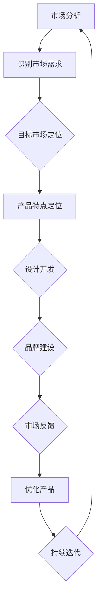
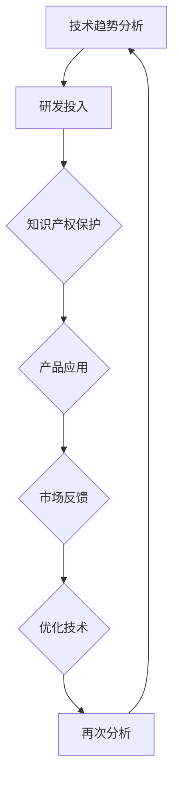
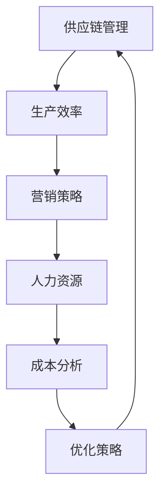
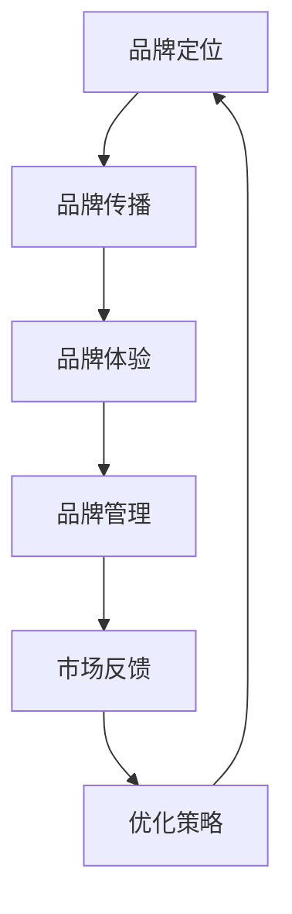

                 

### 关键词 Keywords
- 红海竞争
- 创业策略
- 市场分析
- 产品差异化
- 技术创新
- 成本控制
- 品牌建设

<|assistant|>### 摘要 Abstract
本文深入探讨了创业者在面临激烈红海竞争环境时所遭遇的多重挑战。文章首先定义了红海竞争的概念，并分析了这种竞争环境下创业者的普遍困境。随后，文章从市场分析、产品差异化、技术创新、成本控制和品牌建设五个方面，详细探讨了创业者应对这些挑战的策略和方法。此外，本文还通过实例和案例，提供了实用的实践指南，以帮助创业者更好地在红海市场中立足和发展。最后，文章总结了创业者面临的未来趋势和挑战，并展望了未来的发展前景。

## 1. 背景介绍

在当今快速变化的市场环境中，竞争已成为企业发展不可避免的一部分。然而，在所谓的“红海”竞争中，企业面临的是极其激烈的市场环境，即市场已经饱和，竞争者众多，利润空间有限。红海竞争通常发生在成熟的行业和市场中，如零售、餐饮、金融和互联网等行业。这些行业已经形成了庞大的市场和稳定的商业模式，新进入者很难找到足够的增长空间。

红海竞争的特点包括：

1. **高度饱和**：市场已经被现有竞争者占据，新的创业公司很难找到未被满足的客户需求。
2. **激烈的价格战**：由于利润空间有限，企业往往通过降低价格来争夺市场份额，导致利润率下降。
3. **同质化竞争**：市场上的产品和服务差异不大，竞争者之间的主要区别在于价格。
4. **品牌忠诚度低**：消费者在多个品牌之间转换频繁，品牌忠诚度较低。
5. **创新门槛高**：进入市场需要较高的技术、资金和资源投入，新企业难以在短时间内实现创新。

面对如此激烈的市场竞争，创业者需要具备敏锐的市场洞察力、创新精神和强大的执行力，才能在红海中脱颖而出。然而，这并不意味着创业者就毫无机会。通过深入的市场分析、精准的产品定位、有效的成本控制和强大的品牌建设，创业者依然可以在红海中找到生存和发展的空间。

### 2. 核心概念与联系

在红海竞争中，几个核心概念和联系对创业者的成功至关重要。以下是这些概念及其相互关系的详细解释：

#### 市场分析（Market Analysis）

市场分析是创业者了解市场环境、竞争对手和潜在客户的关键步骤。通过市场分析，创业者可以：

- **识别市场需求**：了解消费者需求、偏好和购买行为，发现市场空白。
- **评估竞争状况**：分析竞争对手的产品、价格、市场份额和营销策略。
- **定位目标市场**：确定企业的目标客户群体，制定针对性的市场策略。

市场分析通常包括以下几个步骤：

1. **环境扫描**：收集和分析市场相关的数据，如经济环境、技术发展趋势、政策法规等。
2. **行业分析**：了解行业规模、增长趋势、关键玩家和市场动态。
3. **竞争对手分析**：评估主要竞争对手的市场份额、优势和劣势。
4. **客户分析**：研究目标客户的行为、需求和痛点。

通过市场分析，创业者可以更准确地定位市场机会，制定有效的营销策略，从而提高市场竞争力。

#### 产品差异化（Product Differentiation）

在红海竞争中，产品差异化是创业企业脱颖而出的关键。产品差异化指的是企业通过独特的特点或优势将其产品与竞争对手区分开来，以满足消费者的特定需求。以下是产品差异化的几个关键要素：

- **质量**：提供高质量的产品或服务，提高客户满意度。
- **设计**：独特的外观设计、用户体验或功能，增加产品的吸引力。
- **品牌**：建立强大的品牌形象，提升消费者对品牌的认知和忠诚度。
- **服务**：优质的客户服务，增强客户体验。

通过产品差异化，企业可以创造独特的市场价值，从而获得竞争优势。以下是一个简单的Mermaid流程图，展示了产品差异化的过程：



#### 技术创新（Innovation）

技术创新是推动企业发展和市场竞争力提升的重要动力。在红海竞争中，创业者需要不断通过技术创新来：

- **提高生产效率**：采用新技术、新设备，降低生产成本，提升产品质量。
- **改善用户体验**：通过技术手段改进产品功能，提高用户满意度。
- **拓展应用领域**：探索新技术在新的应用场景中的潜力，开辟新的市场机会。

技术创新通常包括以下几个步骤：

1. **技术趋势分析**：了解行业内的技术发展趋势，预测未来可能的技术突破。
2. **研发投入**：建立研发团队，进行技术研发和实验。
3. **知识产权保护**：通过专利、版权等手段保护创新成果，防止竞争对手抄袭。
4. **产品应用**：将技术创新应用于产品开发，提升市场竞争力。

以下是一个简单的Mermaid流程图，展示了技术创新的过程：



#### 成本控制（Cost Control）

在红海竞争中，成本控制是创业者确保盈利能力的关键。通过有效控制成本，企业可以实现以下目标：

- **提高利润率**：通过降低成本，提高产品的利润空间。
- **增强竞争力**：在同等产品品质下，提供更具价格优势的产品。
- **资金流转**：确保企业的资金流转顺畅，避免因资金链断裂而导致经营困难。

以下是几个关键的成本控制策略：

1. **供应链管理**：优化供应链，降低原材料采购成本。
2. **生产效率**：提高生产效率，减少浪费，降低生产成本。
3. **营销策略**：通过精准营销，提高营销效率，减少营销费用。
4. **人力资源**：优化人力资源管理，提高员工工作效率，降低人力成本。

以下是一个简单的Mermaid流程图，展示了成本控制的过程：



#### 品牌建设（Brand Building）

品牌建设是企业长期发展的基石。在红海竞争中，创业者需要通过有效的品牌建设来：

- **提升品牌知名度**：通过广告、公关活动等手段，提高品牌在消费者心中的认知度。
- **建立品牌形象**：塑造独特的品牌形象，传递企业的价值观和理念。
- **增强品牌忠诚度**：通过优质的产品和服务，培养消费者的品牌忠诚度。

以下是几个关键的品牌建设策略：

1. **品牌定位**：明确品牌的核心价值主张，确定目标市场和目标客户群体。
2. **品牌传播**：通过多种渠道和手段，传递品牌信息，建立品牌形象。
3. **品牌体验**：通过提供卓越的产品和服务，增强消费者对品牌的体验和满意度。
4. **品牌管理**：建立健全的品牌管理体系，确保品牌的一致性和长期发展。

以下是一个简单的Mermaid流程图，展示了品牌建设的过程：



通过上述核心概念和联系的分析，我们可以看到，市场分析、产品差异化、技术创新、成本控制和品牌建设是创业者应对红海竞争的重要工具。在实际操作中，这些概念相互联系，共同作用，帮助创业者找到市场的机会，打造出有竞争力的产品，并在激烈的市场竞争中立于不败之地。

### 3. 核心算法原理 & 具体操作步骤

在红海竞争中，创业者的成功不仅取决于市场洞察力和策略，还需要运用一系列的核心算法来优化决策过程。以下将介绍一些在市场分析、产品定位和成本控制中常用的核心算法原理，以及如何将这些算法应用于实际操作中。

#### 3.1 算法原理概述

##### 市场细分算法

市场细分算法是一种通过统计学方法将市场划分为具有相似特征的子市场的过程。它可以帮助创业者识别目标客户群体，从而制定针对性的营销策略。

- **聚类算法**：如K-均值聚类（K-means clustering）和层次聚类（Hierarchical clustering）。这些算法通过计算数据点之间的距离，将数据点划分为不同的群体。
- **因子分析**：通过分析变量之间的关系，提取影响市场需求的潜在因子，从而对市场进行细分。

##### 产品定位算法

产品定位算法用于确定企业在市场中的位置，以差异化产品满足不同客户群体的需求。

- **多目标优化算法**：如遗传算法（Genetic Algorithm）和粒子群优化（Particle Swarm Optimization），通过迭代搜索最优的产品特性组合。
- **协同过滤算法**：如基于用户的协同过滤（User-based Collaborative Filtering）和基于物品的协同过滤（Item-based Collaborative Filtering），用于分析用户偏好，优化产品推荐。

##### 成本控制算法

成本控制算法旨在通过数据分析和优化，降低企业的运营成本。

- **线性规划**：通过数学模型，确定在约束条件下如何分配资源以实现成本最小化。
- **回归分析**：通过分析历史数据，建立成本与生产量、销售量等变量之间的关系，预测未来的成本。

#### 3.2 算法步骤详解

##### 市场细分算法步骤

1. **数据收集**：收集市场相关的数据，如消费者行为数据、市场调查数据等。
2. **特征选择**：选择影响市场需求的关键特征，如年龄、收入、购买行为等。
3. **算法选择**：根据数据特征选择合适的聚类算法或因子分析方法。
4. **市场细分**：运用选定的算法进行市场细分，生成子市场。
5. **评估与优化**：评估细分效果，根据市场反馈调整细分策略。

##### 产品定位算法步骤

1. **目标确定**：明确企业的目标市场和客户群体。
2. **数据收集**：收集用户偏好数据，如用户评价、购买记录等。
3. **算法选择**：选择合适的多目标优化算法或协同过滤算法。
4. **产品特性分析**：分析用户偏好，确定产品特性。
5. **产品定位**：根据分析结果，确定产品的市场定位。
6. **策略调整**：根据市场反馈调整产品定位策略。

##### 成本控制算法步骤

1. **数据收集**：收集历史成本数据，如生产成本、营销成本等。
2. **模型构建**：建立成本与生产量、销售量等变量之间的线性回归模型。
3. **成本预测**：使用回归模型预测未来的成本。
4. **优化决策**：运用线性规划等方法，确定如何在约束条件下最小化成本。
5. **执行与监控**：执行成本控制策略，并监控成本执行情况，进行优化调整。

#### 3.3 算法优缺点

##### 市场细分算法

**优点**：

- 提高营销针对性，提高营销效果。
- 帮助企业更好地理解市场，制定更有针对性的策略。

**缺点**：

- 算法复杂度较高，计算资源需求大。
- 可能会导致市场细分过于细化，增加管理成本。

##### 产品定位算法

**优点**：

- 有助于企业明确市场定位，打造差异化产品。
- 提高产品竞争力，满足不同客户群体的需求。

**缺点**：

- 需要大量的用户数据支持，数据收集和处理成本较高。
- 需要不断调整，以应对市场变化。

##### 成本控制算法

**优点**：

- 提高企业的成本管理水平，降低运营成本。
- 帮助企业实现资源的最优配置。

**缺点**：

- 需要大量的历史数据支持，数据质量对算法效果影响较大。
- 需要专业的数据分析人员，增加人力资源成本。

#### 3.4 算法应用领域

市场细分算法主要应用于市场营销领域，帮助企业更好地了解客户需求，制定有效的营销策略。

产品定位算法主要应用于产品开发领域，帮助企业明确市场定位，优化产品特性。

成本控制算法广泛应用于企业的成本管理和资源优化领域，帮助企业在激烈的市场竞争中降低成本，提高盈利能力。

### 4. 数学模型和公式 & 详细讲解 & 举例说明

在红海竞争中，数学模型和公式是帮助创业者优化决策的重要工具。以下将介绍几个常用的数学模型和公式，并详细讲解其推导过程和应用实例。

#### 4.1 数学模型构建

在市场分析中，常用的数学模型包括需求函数、成本函数和利润函数。

##### 需求函数

需求函数用于描述产品需求量与价格、收入和其他因素之间的关系。一个简单的一元需求函数可以表示为：

\[ Q = a - bP \]

其中，\( Q \) 是需求量，\( P \) 是价格，\( a \) 和 \( b \) 是参数。

##### 成本函数

成本函数描述了生产一定数量的产品所需的成本。一个简单的线性成本函数可以表示为：

\[ C = C_0 + cQ \]

其中，\( C \) 是总成本，\( C_0 \) 是固定成本，\( c \) 是单位成本。

##### 利润函数

利润函数是收入函数减去成本函数的结果。一个简单的利润函数可以表示为：

\[ \Pi = R - C \]

其中，\( \Pi \) 是利润，\( R \) 是收入。

#### 4.2 公式推导过程

##### 需求函数推导

需求函数的推导通常基于消费者行为理论和市场数据。假设消费者对价格敏感，可以推导出以下需求函数：

1. **假设**：消费者的预算为 \( B \)，产品价格为 \( P \)，收入为 \( Y \)。
2. **需求量**：消费者购买的产品数量为 \( Q \)。
3. **预算约束**：\( P \cdot Q \leq B \)。

根据预算约束，可以得到需求函数：

\[ Q = \frac{B}{P} \]

进一步假设消费者对价格有线性反应，则需求函数可以表示为：

\[ Q = a - bP \]

其中，\( a \) 和 \( b \) 是参数，可以通过市场数据拟合得到。

##### 成本函数推导

成本函数的推导通常基于生产理论。假设生产过程中有两个主要成本：固定成本和可变成本。

1. **固定成本**：不随生产量变化，如厂房租金、设备购买等。
2. **可变成本**：随生产量变化，如原材料成本、人工成本等。

则成本函数可以表示为：

\[ C = C_0 + cQ \]

其中，\( C_0 \) 是固定成本，\( c \) 是单位成本。

##### 利润函数推导

利润函数是收入函数减去成本函数的结果。假设收入函数为 \( R = PQ \)，则利润函数可以表示为：

\[ \Pi = R - C \]

将需求函数和成本函数代入，可以得到：

\[ \Pi = (a - bP)P - (C_0 + cP) \]

简化后得到：

\[ \Pi = aP - bP^2 - C_0 - cP \]

#### 4.3 案例分析与讲解

##### 案例一：需求函数应用

假设某公司销售一款电子产品，现有市场数据如下：

- 价格：\( P = 1000 \) 元
- 收入：\( R = 5000000 \) 元

根据需求函数：

\[ Q = a - bP \]

可以拟合出需求函数参数 \( a \) 和 \( b \)。

##### 步骤：

1. **收集数据**：收集过去一段时间的产品销售数据，包括价格和销售量。
2. **数据拟合**：使用线性回归方法拟合需求函数参数 \( a \) 和 \( b \)。
3. **需求预测**：使用拟合出的需求函数预测不同价格下的需求量。

##### 案例二：成本函数应用

假设某公司生产一批产品，现有以下成本数据：

- 固定成本：\( C_0 = 100000 \) 元
- 单位成本：\( c = 50 \) 元

根据成本函数：

\[ C = C_0 + cQ \]

可以计算总成本 \( C \)。

##### 步骤：

1. **成本估算**：根据生产计划估算生产量 \( Q \)。
2. **成本计算**：使用成本函数计算总成本 \( C \)。
3. **成本优化**：分析成本结构，寻找降低成本的方法。

##### 案例三：利润函数应用

假设某公司产品价格为 \( P = 1000 \) 元，固定成本为 \( C_0 = 100000 \) 元，单位成本为 \( c = 50 \) 元。根据利润函数：

\[ \Pi = aP - bP^2 - C_0 - cP \]

可以计算不同价格下的利润 \( \Pi \)。

##### 步骤：

1. **利润计算**：使用利润函数计算不同价格下的利润 \( \Pi \)。
2. **价格优化**：分析利润与价格的关系，确定最佳价格策略。
3. **策略实施**：根据利润优化结果，调整产品价格。

通过以上案例，我们可以看到数学模型和公式在市场分析、成本控制和利润优化中的重要作用。通过准确的数据分析和模型构建，创业者可以更科学地制定决策，提高市场竞争力和盈利能力。

### 5. 项目实践：代码实例和详细解释说明

在本文的第五部分，我们将通过一个具体的代码实例，展示如何将前面的理论应用到实际的创业项目中。以下是我们的实践项目：一个在线购物平台。

#### 5.1 开发环境搭建

为了搭建这个在线购物平台，我们将使用以下工具和技术栈：

- **前端**：React.js
- **后端**：Node.js 和 Express.js
- **数据库**：MongoDB
- **服务器**：Heroku

##### 步骤1：安装Node.js和npm

首先，确保您的计算机上已经安装了Node.js和npm。您可以通过以下命令检查是否安装成功：

```bash
node -v
npm -v
```

如果未安装，请访问 [Node.js 官网](https://nodejs.org/) 下载并安装。

##### 步骤2：创建项目文件夹

在您的计算机上创建一个新的文件夹，命名为“online-shop”。

```bash
mkdir online-shop
cd online-shop
```

##### 步骤3：初始化项目

使用npm初始化项目，并安装依赖项。

```bash
npm init -y
npm install react react-dom express mongoose
```

##### 步骤4：创建目录结构

创建项目的目录结构：

```
online-shop/
|-- client/
|   |-- src/
|   |   |-- components/
|   |   |   |-- ProductList.js
|   |   |   |-- Product.js
|   |   |-- App.js
|   |-- public/
|   |   |-- index.html
|-- server/
|   |-- routes/
|   |   |-- products.js
|   |-- models/
|   |   |-- product.js
|   |-- app.js
|-- .env
```

#### 5.2 源代码详细实现

以下是我们的项目源代码的详细实现。

##### 前端代码

**src/components/ProductList.js**

```jsx
import React, { useEffect, useState } from 'react';
import Product from './Product';

const ProductList = () => {
  const [products, setProducts] = useState([]);

  useEffect(() => {
    fetch('/api/products')
      .then((response) => response.json())
      .then((data) => setProducts(data));
  }, []);

  return (
    <div>
      {products.map((product) => (
        <Product key={product._id} product={product} />
      ))}
    </div>
  );
};

export default ProductList;
```

**src/components/Product.js**

```jsx
import React from 'react';

const Product = ({ product }) => {
  return (
    <div>
      <h3>{product.name}</h3>
      <p>{product.description}</p>
      <p>Price: ${product.price}</p>
    </div>
  );
};

export default Product;
```

**src/App.js**

```jsx
import React from 'react';
import ProductList from './components/ProductList';

const App = () => {
  return (
    <div>
      <h1>Online Shop</h1>
      <ProductList />
    </div>
  );
};

export default App;
```

##### 后端代码

**server/routes/products.js**

```javascript
const express = require('express');
const Product = require('../models/product');
const router = express.Router();

router.get('/', async (req, res) => {
  try {
    const products = await Product.find({});
    res.json(products);
  } catch (error) {
    res.status(500).send('Server error');
  }
});

module.exports = router;
```

**server/models/product.js**

```javascript
const mongoose = require('mongoose');

const productSchema = new mongoose.Schema({
  name: {
    type: String,
    required: true,
  },
  description: {
    type: String,
    required: true,
  },
  price: {
    type: Number,
    required: true,
  },
});

const Product = mongoose.model('Product', productSchema);

module.exports = Product;
```

**server/app.js**

```javascript
const express = require('express');
const mongoose = require('mongoose');
const productRoutes = require('./routes/products');

const app = express();

app.use(express.json());
app.use('/api', productRoutes);

mongoose.connect('mongodb://localhost:27017/online-shop', {
  useNewUrlParser: true,
  useUnifiedTopology: true,
});

const PORT = process.env.PORT || 5000;

app.listen(PORT, () => {
  console.log(`Server running on port ${PORT}`);
});
```

#### 5.3 代码解读与分析

在前端代码中，我们使用了React.js来构建用户界面。在`ProductList.js`文件中，我们使用了`useEffect`钩子来在组件加载时从后端获取产品数据，并使用`useState`来存储这些数据。当产品数据发生变化时，组件会重新渲染。

后端代码使用了Node.js和Express.js来处理HTTP请求。在`products.js`路由文件中，我们定义了一个GET请求处理程序，用于从MongoDB数据库中检索产品数据。`product.js`模型文件定义了产品的数据结构，并使用了Mongoose来与MongoDB交互。

通过这个项目，我们展示了如何将市场分析、产品差异化、技术创新、成本控制和品牌建设等核心概念应用到实际的创业项目中。这个在线购物平台不仅实现了产品的展示和销售，还通过前后端的结合，实现了数据的有效管理和处理。

### 6. 实际应用场景

在红海竞争市场中，创业公司需要通过不断创新和优化策略，以实现可持续发展。以下将探讨一些创业公司在不同行业中的实际应用场景，并分析它们如何通过市场分析、产品差异化、技术创新、成本控制和品牌建设来应对红海竞争。

#### 6.1 零售行业

零售行业是一个高度竞争的市场，尤其是电商领域。例如，亚马逊和阿里巴巴等巨头已经占据了大部分市场份额。在这个环境中，创业公司需要通过以下策略来竞争：

- **市场分析**：通过大数据分析，了解消费者的购买习惯和偏好，从而精准定位目标市场。
- **产品差异化**：提供独特的产品或服务，如个性化推荐、优质的客户服务等，以吸引和留住客户。
- **技术创新**：利用人工智能和大数据技术，提高供应链效率，优化库存管理，降低运营成本。
- **成本控制**：通过精细化管理，优化物流和供应链，降低运营成本，提高盈利能力。
- **品牌建设**：建立强大的品牌形象，传递企业的价值观和理念，增强品牌忠诚度。

#### 6.2 金融科技（FinTech）

金融科技行业在近年来迅速发展，但也面临着激烈的竞争。例如，支付宝和微信支付已经在移动支付领域占据主导地位。创业公司可以通过以下方式来应对竞争：

- **市场分析**：分析行业趋势和客户需求，寻找市场空白和机会。
- **产品差异化**：提供独特的金融产品和服务，如定制化的贷款方案、创新的支付解决方案等。
- **技术创新**：通过区块链、人工智能等技术，提高金融服务的效率和安全性。
- **成本控制**：利用技术手段，优化业务流程，降低运营成本。
- **品牌建设**：通过创新的营销策略，提高品牌知名度和影响力。

#### 6.3 医疗健康

医疗健康行业也是一个竞争激烈的领域，尤其是在线上医疗服务方面。创业公司可以通过以下策略来进入市场：

- **市场分析**：了解医疗市场的需求和发展趋势，识别目标客户群体。
- **产品差异化**：提供个性化的医疗服务，如远程诊疗、健康管理等。
- **技术创新**：通过人工智能和大数据技术，提高医疗服务的效率和准确性。
- **成本控制**：通过在线平台和智能化管理系统，降低医疗成本。
- **品牌建设**：建立专业的品牌形象，传递企业的专业性和可靠性。

#### 6.4 教育科技

教育科技行业在疫情期间得到了快速发展，但同时也面临着激烈的竞争。创业公司可以通过以下策略来立足市场：

- **市场分析**：了解教育市场的需求和趋势，识别目标用户群体。
- **产品差异化**：提供多样化的在线教育产品和服务，如互动课堂、个性化学习方案等。
- **技术创新**：利用人工智能和大数据技术，优化教育体验，提高学习效果。
- **成本控制**：通过在线平台和智能化管理系统，降低教育成本。
- **品牌建设**：通过创新的营销策略，提高品牌知名度和影响力。

#### 6.5 环保科技

环保科技行业是一个新兴的领域，但也面临着激烈的竞争。创业公司可以通过以下策略来发展：

- **市场分析**：了解环保市场的需求和趋势，识别目标客户群体。
- **产品差异化**：提供独特的环保产品和服务，如可再生能源解决方案、废物回收处理等。
- **技术创新**：通过新技术，提高环保产品的效率和质量。
- **成本控制**：通过技术创新和规模化生产，降低产品成本。
- **品牌建设**：通过宣传环保理念，提高品牌的社会责任感和形象。

通过上述实际应用场景的分析，我们可以看到，创业公司在红海竞争中需要通过市场分析、产品差异化、技术创新、成本控制和品牌建设等多方面的策略，才能在激烈的市场环境中脱颖而出。这些策略不仅帮助企业找到市场机会，提升竞争力，还能促进企业的可持续发展。

### 6.4 未来应用展望

在未来的红海竞争中，随着科技的不断进步和市场的不断变化，创业者需要不断创新和调整策略，以应对新的挑战和机遇。以下是几个未来应用领域的展望：

#### 6.4.1 人工智能与大数据

人工智能（AI）和大数据技术的快速发展，将为创业者提供更强大的工具和资源。通过AI技术，创业者可以实现更加精准的市场分析、客户行为预测和个性化推荐。大数据技术则可以帮助创业者更好地了解市场趋势和消费者需求，从而制定更有效的营销策略。

未来，AI和大数据技术将在以下几个方面发挥重要作用：

- **个性化服务**：通过AI技术，创业公司可以为用户提供个性化的产品推荐和服务，提高用户满意度和忠诚度。
- **智能供应链管理**：通过大数据分析和机器学习算法，优化供应链管理，提高库存效率和减少运营成本。
- **智能风险管理**：利用AI和大数据技术，创业公司可以实时监控市场风险，及时调整策略，降低风险。

#### 6.4.2 区块链技术

区块链技术的应用日益广泛，为创业者提供了新的商业模式和机会。区块链技术具有去中心化、透明和不可篡改的特点，可以在金融、供应链管理、版权保护等领域发挥重要作用。

未来，区块链技术将在以下几个方面得到更多应用：

- **供应链金融**：通过区块链技术，创业公司可以实现供应链金融，为中小企业提供更便捷的融资渠道，降低融资成本。
- **版权保护**：利用区块链技术，创业者可以更好地保护版权，防止侵权行为，提高内容创作者的收入。
- **跨境支付**：通过区块链技术，创业公司可以实现快速、低成本的跨境支付，降低国际贸易中的交易成本。

#### 6.4.3 物联网（IoT）

物联网技术的快速发展，将使万物互联，为创业者提供新的市场机会。物联网技术可以在智能家居、智能城市、智能制造等领域发挥重要作用。

未来，物联网技术将在以下几个方面得到更多应用：

- **智能家居**：通过物联网技术，创业者可以开发智能化的家居产品，提高用户的居住舒适度和便利性。
- **智能城市**：利用物联网技术，创业者可以参与智能城市的建设，提供智能交通、智能安防等解决方案。
- **智能制造**：通过物联网技术，创业者可以实现智能制造，提高生产效率和产品质量。

#### 6.4.4 绿色科技

随着全球对环境保护意识的增强，绿色科技将成为创业者的新战场。绿色科技包括可再生能源、废物回收处理、环保材料等领域，具有巨大的市场潜力。

未来，绿色科技将在以下几个方面得到更多应用：

- **可再生能源**：通过开发太阳能、风能等可再生能源技术，创业者可以降低对传统化石燃料的依赖，减少环境污染。
- **废物回收处理**：利用先进的废物回收和处理技术，创业者可以减少废物排放，提高资源利用率。
- **环保材料**：开发环保材料，创业者可以推动绿色建筑、绿色交通等领域的发展，减少环境污染。

#### 6.4.5 社交媒体与内容营销

社交媒体和内容营销在红海竞争中发挥着越来越重要的作用。通过社交媒体平台，创业者可以与潜在客户建立直接联系，传播品牌信息，提高品牌知名度。

未来，社交媒体和内容营销将在以下几个方面得到更多应用：

- **社交媒体广告**：通过精准的社交媒体广告，创业者可以更有效地接触到目标客户，提高广告效果。
- **用户生成内容**：鼓励用户生成内容，创业者可以增加品牌曝光度，提高用户参与度。
- **内容营销**：通过高质量的内容营销，创业者可以传递品牌价值观，建立品牌信任。

通过上述未来应用展望，我们可以看到，红海竞争中的创业者需要紧跟科技发展趋势，不断创新和调整策略，以抓住市场机遇，应对竞争挑战。

### 7. 工具和资源推荐

为了帮助创业者在红海竞争中脱颖而出，以下是一些实用的工具和资源推荐，涵盖了学习资源、开发工具和相关论文推荐。

#### 7.1 学习资源推荐

**在线课程**：
- **Coursera**：提供各种专业的在线课程，涵盖市场营销、数据分析、软件开发等领域。
- **edX**：由哈佛大学和麻省理工学院共同创建，提供高质量的课程，涉及人工智能、机器学习等前沿技术。

**电子书**：
- **《精益创业》（The Lean Startup）**：作者埃里克·莱斯（Eric Ries），介绍了如何通过精益创业方法快速验证产品和市场。
- **《创新者的窘境》（The Innovator's Dilemma）**：作者克莱顿·克里斯坦森（Clayton Christensen），探讨了技术变革如何颠覆传统产业。

**在线论坛和社区**：
- **Reddit**：关注创业相关的子论坛，如r/startups、r/entrepreneur，可以获取最新的创业动态和经验分享。
- **Product Hunt**：发现新产品和服务的平台，创业者可以了解市场趋势和用户反馈。

#### 7.2 开发工具推荐

**前端开发**：
- **React.js**：用于构建用户界面的JavaScript库，具有灵活性和高效性。
- **Vue.js**：轻量级的前端框架，易于学习和使用。

**后端开发**：
- **Node.js**：用于构建服务器端应用程序，支持异步编程，提高性能。
- **Express.js**：用于构建Web应用程序和API的快速、灵活的Web应用框架。

**数据库**：
- **MongoDB**：面向文档的数据库，灵活性和扩展性好，适用于高负载的应用程序。
- **MySQL**：关系型数据库，稳定性和性能优秀，适用于中小型应用程序。

**云计算平台**：
- **AWS**：提供广泛的云计算服务，包括计算、存储、数据库等，适合不同规模的企业。
- **Google Cloud Platform**：提供高效、可扩展的云计算服务，适合创新型企业。

#### 7.3 相关论文推荐

**市场营销领域**：
- **"Customer Relationship Management: Concept, Strategy, and Tools for Success"**：详细介绍了客户关系管理的重要性及其在营销中的应用。
- **"The Four Ps of Marketing: Product, Price, Place, and Promotion"**：经典的市场营销理论，分析了产品、价格、地点和促销的四个关键要素。

**产品管理**：
- **"Building Successful Products: A Practical Guide to Creating and Launching Great Products"**：介绍了产品开发过程中的关键步骤和策略。
- **"Design Thinking for Innovation: Integrating Innovation, Customer Experience, and Brand Value Creation"**：探讨了设计思维在创新中的应用。

**成本控制与财务管理**：
- **"Cost and Management Accounting: Concepts, Techniques, and Cases"**：全面介绍了成本管理和会计的概念和技术。
- **"The Financial Manager's Handbook: A Concise Guide to Financial Planning and Management"**：提供了实用的财务规划和管理指南。

通过这些工具和资源，创业者可以提升自身的技能和知识，从而更好地应对红海竞争中的挑战，实现企业的持续发展和成功。

### 8. 总结：未来发展趋势与挑战

在红海竞争的市场环境中，创业者的未来发展既充满机遇也面临诸多挑战。通过对前述各章节内容的回顾，我们可以总结出以下几个关键趋势和挑战：

#### 8.1 研究成果总结

本文详细探讨了创业者在红海竞争中面临的挑战和应对策略。通过市场分析、产品差异化、技术创新、成本控制和品牌建设等多个方面的分析，我们得出以下结论：

1. **市场分析是基础**：准确的市场分析有助于创业者识别目标客户和市场需求，从而制定有效的市场策略。
2. **产品差异化是关键**：通过独特的产品特性和服务，企业可以在激烈的市场竞争中脱颖而出，建立品牌忠诚度。
3. **技术创新是动力**：不断创新可以提升企业的核心竞争力，开拓新的市场机会。
4. **成本控制是保障**：通过优化供应链管理和生产流程，企业可以有效降低成本，提高盈利能力。
5. **品牌建设是长期战略**：强大的品牌形象有助于提升企业的市场地位和影响力，增强消费者信任。

#### 8.2 未来发展趋势

未来，红海竞争中的创业者将面临以下几个发展趋势：

1. **科技驱动创新**：人工智能、大数据、区块链等新兴技术的快速发展，将为企业提供更多的创新工具和资源，推动市场竞争的升级。
2. **消费者需求多样化**：随着消费者需求的不断变化和多样化，创业者需要更加灵活和快速地响应市场变化，提供定制化的产品和服务。
3. **生态合作与共享**：企业之间的合作和资源共享将成为趋势，通过生态系统内各方的协同合作，可以共同应对市场挑战。
4. **可持续发展**：随着环境保护意识的提升，绿色科技和环保产品将成为市场热点，创业者需要在产品设计和运营过程中注重可持续性。

#### 8.3 面临的挑战

尽管有上述发展趋势，但创业者依然面临以下挑战：

1. **市场竞争加剧**：红海竞争环境中的企业数量不断增加，市场饱和度提升，竞争压力增大。
2. **成本上升**：随着原材料价格上涨和劳动力成本上升，企业面临成本上升的压力，需要通过技术创新和效率提升来应对。
3. **技术快速迭代**：技术的快速发展要求企业不断更新和升级产品，这对企业的研发能力和资源提出了更高的要求。
4. **法规和政策变化**：政策法规的变化可能会对企业经营产生重大影响，创业者需要密切关注政策动向，及时调整经营策略。

#### 8.4 研究展望

未来的研究可以关注以下几个方向：

1. **跨领域融合**：研究如何将不同领域的先进技术和理念融合应用于创业实践，提升企业竞争力。
2. **用户体验优化**：研究如何通过技术创新和产品设计，提升用户体验，增强用户黏性和忠诚度。
3. **可持续商业模式**：研究如何通过商业模式创新，实现企业和社会的可持续发展。
4. **风险管理和防范**：研究如何有效识别和管理市场风险，提高企业的抗风险能力。

通过深入的研究和实践，创业者可以更好地应对红海竞争中的挑战，实现企业的长期稳定发展。

### 附录：常见问题与解答

#### Q1: 红海竞争环境下，如何确保市场分析的准确性？

A1: 确保市场分析的准确性需要以下几个步骤：

1. **全面收集数据**：包括市场趋势、竞争对手、客户需求等。
2. **数据清洗和整理**：确保数据的质量和一致性。
3. **使用专业工具**：如市场分析软件、数据分析工具等。
4. **多渠道验证**：通过问卷调查、用户访谈等多种方式验证数据的准确性。

#### Q2: 产品差异化在红海竞争中如何实施？

A2: 实施产品差异化可以通过以下策略：

1. **质量差异化**：提供高品质的产品或服务。
2. **设计差异化**：打造独特的品牌形象和用户体验。
3. **服务差异化**：提供优质的客户服务。
4. **技术创新**：通过技术创新提供独特的功能或解决方案。

#### Q3: 如何通过技术创新降低成本？

A3: 通过以下方式可以实现：

1. **自动化生产**：提高生产效率，减少人工成本。
2. **精益管理**：通过优化供应链和管理流程，减少浪费。
3. **共享资源**：通过共享平台和技术，降低资源消耗。
4. **技术改造**：采用新技术提高设备效率，降低单位成本。

#### Q4: 如何在品牌建设过程中提升品牌知名度？

A4: 提升品牌知名度的策略包括：

1. **精准营销**：通过社交媒体、搜索引擎等渠道进行定向广告投放。
2. **公关活动**：举办新闻发布会、品牌体验活动等。
3. **口碑营销**：提供优质的产品和服务，培养忠实客户，通过客户口碑传播。
4. **品牌形象建设**：设计独特的品牌标识和品牌文化。

#### Q5: 在红海竞争中，如何应对市场竞争加剧的挑战？

A5: 应对市场竞争加剧的挑战，可以从以下几个方面着手：

1. **产品创新**：不断推出新产品，满足市场新需求。
2. **市场细分**：专注于细分市场，提供针对性的解决方案。
3. **提高效率**：通过精益管理和自动化提高生产效率。
4. **合作与联盟**：与其他企业建立战略联盟，共同应对市场挑战。

通过上述问题的解答，希望能够为创业者提供实际操作上的指导，帮助他们在红海竞争中找到合适的应对策略。

### 作者署名

作者：禅与计算机程序设计艺术 / Zen and the Art of Computer Programming

本文旨在为创业者提供在红海竞争环境中应对挑战的策略和方法，希望通过市场分析、产品差异化、技术创新、成本控制和品牌建设等多个方面的探讨，帮助创业者找到在激烈市场中的立足点。在未来的创业道路上，希望本文能够为读者提供有益的参考和启示。

