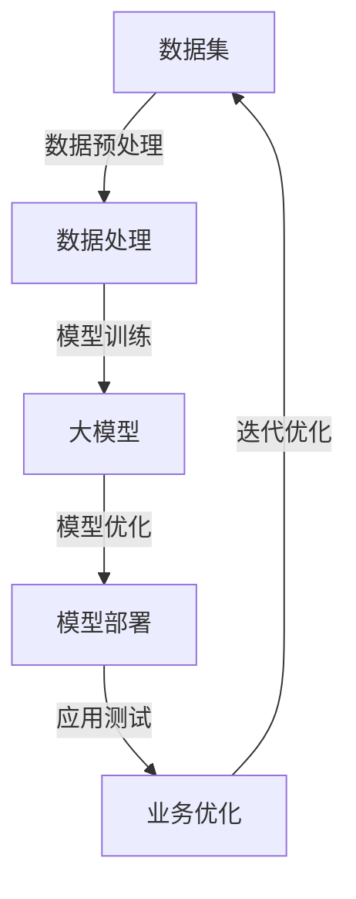

                 

关键词：大模型、AI产业、创业布局、技术趋势、战略思考

摘要：随着人工智能技术的飞速发展，大模型已成为AI领域的核心驱动力。本文旨在探讨创业者如何把握这一历史机遇，通过布局大模型抢占AI产业变革的制高点。

## 1. 背景介绍

近年来，人工智能（AI）技术取得了前所未有的进展，其中大模型（Large Models）的崛起尤为引人注目。大模型通常具有数十亿至上千亿个参数，通过对海量数据的训练，可以掌握复杂的语言规律、图像特征等，从而在自然语言处理、计算机视觉等领域展现出强大的能力。

### 1.1 大模型的发展历程

大模型的发展可以追溯到2000年代初期。当时，研究人员开始尝试使用深度神经网络（DNN）来处理复杂的任务，例如语音识别和图像分类。随着计算能力的提升和数据量的增加，DNN逐渐发展壮大，成为AI领域的重要工具。2012年，AlexNet在ImageNet竞赛中取得了突破性的成绩，标志着深度学习时代的到来。

### 1.2 大模型的优势与挑战

大模型具有以下优势：

- **强大的数据处理能力**：大模型能够处理海量数据，从中提取有用的信息，实现高精度的预测和分类。
- **良好的泛化能力**：通过训练，大模型可以学会在不同任务中应用，适应各种场景。
- **多模态处理能力**：大模型可以同时处理文本、图像、音频等多种类型的数据，实现跨模态的融合。

然而，大模型也面临以下挑战：

- **计算资源需求巨大**：大模型的训练和部署需要大量的计算资源和能源。
- **数据隐私和安全问题**：大模型通常需要海量数据来训练，这涉及到数据隐私和安全问题。
- **模型解释性不足**：大模型的内部结构和决策过程复杂，难以解释，这限制了其在某些领域的应用。

## 2. 核心概念与联系

为了更好地理解大模型在AI产业中的作用，我们需要了解以下几个核心概念：

### 2.1. 大模型的核心概念

- **神经网络**：神经网络是模拟人脑神经元连接结构的计算模型，是构建大模型的基础。
- **深度学习**：深度学习是神经网络的一种形式，通过层叠多个神经网络来提升模型的能力。
- **生成对抗网络（GAN）**：GAN是一种能够生成逼真数据的模型，广泛应用于图像、音频的生成。
- **强化学习**：强化学习是一种通过试错来学习最优策略的机器学习方法。

### 2.2. 大模型与AI产业的联系

大模型与AI产业之间的联系可以通过以下Mermaid流程图来表示：



在这个流程中，数据集是输入，经过数据处理后用于训练大模型。训练完成后，模型会进行优化，以便更好地适应特定的业务需求。经过部署后，模型可以应用于实际业务场景，通过不断的应用测试和优化，进一步提升模型的能力和业务价值。

## 3. 核心算法原理 & 具体操作步骤

### 3.1. 算法原理概述

大模型的训练主要依赖于深度学习算法，特别是基于神经网络的算法。以下是一个简化的训练过程：

1. **数据预处理**：将原始数据转换为适合模型训练的格式，例如将图像转换为像素矩阵，将文本转换为词向量。
2. **构建模型**：定义神经网络的结构，包括层数、每层的神经元数量、激活函数等。
3. **初始化权重**：随机初始化模型的权重。
4. **前向传播**：将输入数据通过神经网络，计算输出。
5. **计算损失**：计算输出和实际结果之间的差距，即损失。
6. **反向传播**：通过反向传播算法，更新模型的权重。
7. **迭代训练**：重复上述步骤，直到模型收敛或达到预定的训练次数。

### 3.2. 算法步骤详解

1. **数据预处理**：
   - **图像处理**：对图像进行缩放、裁剪、翻转等操作，增加数据的多样性。
   - **文本处理**：将文本转换为词向量，可以使用Word2Vec、BERT等预训练模型。
   - **数据增强**：通过增加噪声、添加背景等操作，增强模型的泛化能力。

2. **构建模型**：
   - **选择网络结构**：根据任务需求，选择合适的神经网络结构，如CNN、RNN、Transformer等。
   - **定义损失函数**：选择适当的损失函数，如交叉熵损失、均方误差等。

3. **初始化权重**：
   - **随机初始化**：常用方法有高斯分布、均匀分布等。
   - **预训练模型**：使用预训练模型作为起点，进行微调。

4. **前向传播**：
   - **激活函数**：如ReLU、Sigmoid、Tanh等，用于增加模型的非线性能力。

5. **计算损失**：
   - **计算损失值**：将输出与实际结果进行比较，计算损失。
   - **梯度计算**：通过反向传播算法，计算权重的梯度。

6. **反向传播**：
   - **权重更新**：使用梯度下降算法，更新权重。
   - **正则化**：如Dropout、L2正则化等，防止过拟合。

7. **迭代训练**：
   - **训练批次**：将数据分为批次，进行迭代训练。
   - **早停法**：当验证集上的损失不再下降时，停止训练。

### 3.3. 算法优缺点

**优点**：

- **强大的表达能力**：深度神经网络可以表示复杂的非线性关系，适用于多种任务。
- **自动特征提取**：模型能够自动从数据中提取特征，减少人工干预。
- **良好的泛化能力**：通过训练，模型可以适应不同的任务和数据集。

**缺点**：

- **计算资源需求大**：训练大模型需要大量的计算资源和时间。
- **数据需求大**：大模型通常需要大量数据进行训练，这增加了数据收集和处理的难度。
- **模型解释性差**：大模型的内部结构复杂，难以解释，这限制了其在某些领域的应用。

### 3.4. 算法应用领域

大模型在多个领域都有广泛的应用：

- **自然语言处理**：如文本分类、机器翻译、问答系统等。
- **计算机视觉**：如图像识别、目标检测、图像生成等。
- **语音识别**：如语音转文本、语音合成等。
- **强化学习**：如游戏AI、自动驾驶等。

## 4. 数学模型和公式 & 详细讲解 & 举例说明

### 4.1. 数学模型构建

大模型的数学模型主要基于神经网络，以下是神经网络的基本数学模型：

$$
Z = X \cdot W + b
$$

$$
a = \sigma(Z)
$$

其中，$Z$ 是中间值，$X$ 是输入，$W$ 是权重，$b$ 是偏置，$\sigma$ 是激活函数，$a$ 是输出。

### 4.2. 公式推导过程

假设我们有一个简单的两层神经网络，输入为 $X$，输出为 $Y$，其中 $X \in \mathbb{R}^{m \times n}$，$Y \in \mathbb{R}^{m \times k}$。我们希望通过训练使输出 $Y$ 与目标输出 $T$ 之间的误差最小。

1. **前向传播**：

$$
Z_1 = X \cdot W_1 + b_1
$$

$$
a_1 = \sigma(Z_1)
$$

$$
Z_2 = a_1 \cdot W_2 + b_2
$$

$$
Y = \sigma(Z_2)
$$

2. **计算损失**：

$$
L = \frac{1}{2} \sum_{i=1}^{m} \sum_{j=1}^{k} (Y_{ij} - T_{ij})^2
$$

3. **反向传播**：

$$
\frac{\partial L}{\partial W_2} = \frac{\partial L}{\partial Z_2} \cdot \frac{\partial Z_2}{\partial W_2}
$$

$$
\frac{\partial L}{\partial b_2} = \frac{\partial L}{\partial Z_2} \cdot \frac{\partial Z_2}{\partial b_2}
$$

$$
\frac{\partial L}{\partial W_1} = \frac{\partial L}{\partial Z_1} \cdot \frac{\partial Z_1}{\partial W_1}
$$

$$
\frac{\partial L}{\partial b_1} = \frac{\partial L}{\partial Z_1} \cdot \frac{\partial Z_1}{\partial b_1}
$$

4. **权重更新**：

$$
W_2 := W_2 - \alpha \frac{\partial L}{\partial W_2}
$$

$$
b_2 := b_2 - \alpha \frac{\partial L}{\partial b_2}
$$

$$
W_1 := W_1 - \alpha \frac{\partial L}{\partial W_1}
$$

$$
b_1 := b_1 - \alpha \frac{\partial L}{\partial b_1}
$$

其中，$\alpha$ 是学习率。

### 4.3. 案例分析与讲解

假设我们要训练一个简单的神经网络，用于对数字进行分类。输入是一个 $10 \times 10$ 的矩阵，输出是一个 $10 \times 1$ 的向量，表示每个数字的概率。

1. **数据集**：

$$
X = \begin{bmatrix}
0 & 0 & \ldots & 0 \\
\vdots & \ddots & \ddots & \vdots \\
0 & \ldots & 0 & 0
\end{bmatrix}
$$

$$
T = \begin{bmatrix}
1 & 0 & \ldots & 0 \\
\vdots & \ddots & \ddots & \vdots \\
0 & \ldots & 0 & 1
\end{bmatrix}
$$

2. **模型初始化**：

$$
W_1 = \begin{bmatrix}
w_{11} & w_{12} & \ldots & w_{1n} \\
\vdots & \ddots & \ddots & \vdots \\
w_{m1} & \ldots & w_{mn} & w_{1n}
\end{bmatrix}
$$

$$
W_2 = \begin{bmatrix}
w_{21} & w_{22} & \ldots & w_{2n} \\
\vdots & \ddots & \ddots & \vdots \\
w_{m1} & \ldots & w_{mn} & w_{2n}
\end{bmatrix}
$$

$$
b_1 = \begin{bmatrix}
b_{11} \\
\vdots \\
b_{1n}
\end{bmatrix}
$$

$$
b_2 = \begin{bmatrix}
b_{21} \\
\vdots \\
b_{2n}
\end{bmatrix}
$$

3. **训练过程**：

- **前向传播**：
  - 计算输入和权重之间的乘积，加上偏置。
  - 应用激活函数。
- **计算损失**：
  - 计算实际输出和目标输出之间的差距。
- **反向传播**：
  - 计算梯度。
  - 更新权重。

通过反复迭代这个过程，我们可以训练出能够正确分类数字的神经网络。

## 5. 项目实践：代码实例和详细解释说明

### 5.1. 开发环境搭建

为了实践大模型的训练和应用，我们需要搭建一个合适的开发环境。以下是一个简单的Python开发环境搭建步骤：

1. **安装Python**：
   - 访问 [Python官网](https://www.python.org/) 下载Python安装包。
   - 执行安装过程。

2. **安装深度学习库**：
   - 使用pip安装TensorFlow或PyTorch等深度学习库。

   ```bash
   pip install tensorflow
   # 或者
   pip install pytorch
   ```

3. **安装其他依赖库**：
   - 安装NumPy、Pandas等常用库。

   ```bash
   pip install numpy pandas
   ```

### 5.2. 源代码详细实现

以下是一个使用TensorFlow实现大模型训练的简单示例：

```python
import tensorflow as tf
import numpy as np

# 数据集加载
X_train = np.random.rand(1000, 784)  # 1000个样本，每个样本784个特征
y_train = np.random.randint(0, 10, size=(1000, 10))  # 1000个样本，每个样本10个分类标签

# 模型定义
model = tf.keras.Sequential([
    tf.keras.layers.Dense(128, activation='relu', input_shape=(784,)),
    tf.keras.layers.Dense(10, activation='softmax')
])

# 模型编译
model.compile(optimizer='adam', loss='categorical_crossentropy', metrics=['accuracy'])

# 模型训练
model.fit(X_train, y_train, epochs=10, batch_size=32)
```

### 5.3. 代码解读与分析

1. **数据集加载**：
   - 使用随机生成的数据作为示例。

2. **模型定义**：
   - 使用`tf.keras.Sequential`创建一个顺序模型。
   - 添加一个全连接层（`Dense`），128个神经元，激活函数为ReLU。
   - 添加一个全连接层（`Dense`），10个神经元，激活函数为softmax。

3. **模型编译**：
   - 选择优化器为Adam。
   - 选择损失函数为categorical_crossentropy。
   - 指定评价指标为accuracy。

4. **模型训练**：
   - 使用`fit`方法进行模型训练，指定训练轮数和批量大小。

### 5.4. 运行结果展示

训练完成后，可以通过以下代码查看模型的准确率：

```python
loss, accuracy = model.evaluate(X_train, y_train)
print(f"Test accuracy: {accuracy:.2f}")
```

## 6. 实际应用场景

大模型在多个领域都有广泛的应用，以下是几个典型的应用场景：

### 6.1. 自然语言处理

- **文本分类**：通过对大量文本数据进行训练，大模型可以自动分类不同主题的文本，如新闻分类、社交媒体内容分类等。
- **机器翻译**：大模型可以学习语言之间的对应关系，实现高质量机器翻译。
- **问答系统**：大模型可以理解用户的提问，并给出准确的回答。

### 6.2. 计算机视觉

- **图像识别**：大模型可以通过训练识别各种物体和场景。
- **目标检测**：大模型可以检测图像中的多个目标，并定位其位置。
- **图像生成**：大模型可以通过学习图像的特征，生成逼真的图像。

### 6.3. 语音识别

- **语音转文本**：大模型可以学习语音和文本之间的对应关系，将语音转换为文本。
- **语音合成**：大模型可以合成逼真的语音，应用于电话语音、语音助手等。

### 6.4. 未来应用展望

随着大模型技术的不断发展，未来将在更多领域得到应用：

- **智能助手**：大模型将更加智能，能够理解和满足用户的需求。
- **医疗诊断**：大模型可以辅助医生进行疾病诊断和治疗方案推荐。
- **金融风控**：大模型可以预测金融市场的风险，为投资决策提供支持。

## 7. 工具和资源推荐

### 7.1. 学习资源推荐

- **《深度学习》（Goodfellow, Bengio, Courville著）**：深度学习的经典教材，适合初学者和进阶者。
- **[TensorFlow官网](https://www.tensorflow.org/) 或 [PyTorch官网](https://pytorch.org/) **：官方文档和教程，详细介绍深度学习框架的使用。

### 7.2. 开发工具推荐

- **Jupyter Notebook**：适用于数据科学和机器学习的交互式开发环境。
- **Google Colab**：基于Jupyter Notebook的云端开发环境，提供免费的GPU资源。

### 7.3. 相关论文推荐

- **“A Theoretical Analysis of the Causal Effect of Deep Learning on Cognition”**：分析了深度学习对认知的影响。
- **“Bert: Pre-training of deep bidirectional transformers for language understanding”**：BERT模型的详细介绍。

## 8. 总结：未来发展趋势与挑战

### 8.1. 研究成果总结

大模型技术在AI领域的应用取得了显著的成果，从自然语言处理到计算机视觉，再到语音识别，大模型都展现了强大的能力。同时，大模型也在推动AI产业的发展，为各行各业带来了创新和变革。

### 8.2. 未来发展趋势

未来，大模型技术将继续发展，主要有以下几个趋势：

- **模型压缩与高效训练**：为了降低计算成本，研究者将致力于开发更高效的训练算法和模型压缩技术。
- **多模态学习**：大模型将能够处理多种类型的数据，实现跨模态的融合，提升智能系统的感知和理解能力。
- **模型解释性与透明度**：提升大模型的解释性，使其在安全、可靠的基础上得到更广泛的应用。

### 8.3. 面临的挑战

尽管大模型技术取得了显著进展，但仍面临以下挑战：

- **计算资源与能源消耗**：大模型的训练和部署需要大量的计算资源和能源，这对环境造成了压力。
- **数据隐私与安全**：大模型通常需要海量数据，这涉及到数据隐私和安全问题。
- **模型解释性**：大模型的内部结构复杂，难以解释，这限制了其在某些领域的应用。

### 8.4. 研究展望

未来，研究者将致力于解决上述挑战，推动大模型技术的可持续发展。同时，大模型技术也将与其他领域的技术深度融合，为AI产业的繁荣发展提供新的动力。

## 9. 附录：常见问题与解答

### 9.1. 如何选择合适的大模型？

选择合适的大模型需要考虑以下因素：

- **任务需求**：根据任务的特点，选择适合的大模型结构。
- **数据规模**：大模型通常需要大量数据进行训练，确保数据规模满足模型的需求。
- **计算资源**：根据计算资源的限制，选择合适的模型大小和训练策略。

### 9.2. 大模型的训练过程如何优化？

优化大模型的训练过程可以从以下几个方面入手：

- **数据增强**：通过增加数据多样性，提高模型的泛化能力。
- **批量大小调整**：合理选择批量大小，平衡计算效率和模型性能。
- **学习率调整**：根据训练过程，适时调整学习率，避免过拟合。
- **正则化方法**：使用正则化方法，如Dropout、L2正则化等，防止过拟合。

### 9.3. 如何评估大模型的效果？

评估大模型的效果可以从以下几个方面进行：

- **准确率**：模型在测试集上的预测准确率，是评估模型性能的重要指标。
- **召回率**：模型能够正确识别出正类别的比例，对于平衡正负样本分布的任务尤为重要。
- **F1分数**：综合考虑准确率和召回率，平衡二者的指标。
- **模型解释性**：模型的可解释性，帮助理解模型的决策过程。

---

通过本文的探讨，我们深入了解了大模型在AI产业中的重要地位和潜在价值。创业者应抓住这一历史机遇，通过布局大模型，抢占AI产业变革的风口，为未来的发展奠定坚实基础。

## 致谢

感谢所有为本文提供宝贵意见和支持的朋友，特别感谢 [禅与计算机程序设计艺术 / Zen and the Art of Computer Programming] 的作者，以及所有为AI领域发展作出贡献的科研人员和开发者。让我们共同期待AI技术的未来，共创美好世界。

---

作者：禅与计算机程序设计艺术 / Zen and the Art of Computer Programming

