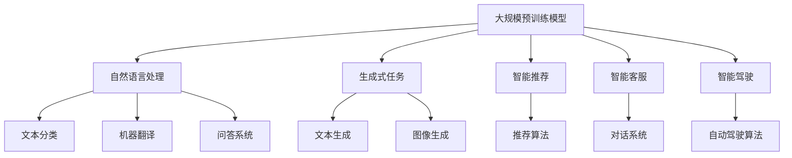

                 

## 1. 背景介绍

随着人工智能技术的迅猛发展，大规模预训练模型（Large-scale Pre-trained Models）已经成为当前AI领域的热点。这些模型，如OpenAI的GPT系列、Google的BERT、Facebook的Gatco等，凭借其强大的语言理解和生成能力，正在深刻地改变着各行各业。然而，如何将这些技术商业化，打造出具有竞争力的AI产品矩阵，成为了创业者们面临的一大挑战。

近年来，人工智能领域取得了诸多突破，但同时也面临着诸多困境。一方面，AI技术日新月异，创业者在技术迭代和更新上需要投入大量的时间和精力；另一方面，市场上已经存在大量的AI产品，如何脱颖而出，吸引客户，成为创业者们亟待解决的问题。此外，数据隐私、算法透明度等问题也是当前AI商业化过程中需要克服的难点。

本文旨在探讨创业者如何在当前AI技术背景下，通过探索大模型新商业模式，打造具有竞争力的AI产品矩阵。文章将首先介绍大规模预训练模型的基本概念和技术原理，然后分析大模型在AI产品开发中的具体应用，最后探讨未来发展趋势和面临的挑战。

## 2. 核心概念与联系

### 2.1 大规模预训练模型

大规模预训练模型是人工智能领域的一项重要技术，它通过在大规模语料库上进行预训练，使模型具备了强大的语言理解和生成能力。预训练模型的基本原理是使用大量的文本数据进行自我学习，从而获得对自然语言结构的深刻理解。在此基础上，预训练模型可以通过微调（Fine-tuning）的方式，适应特定的应用场景。

### 2.2 大模型与AI产品开发

大模型在AI产品开发中具有广泛的应用。首先，大模型可以用于自然语言处理（NLP）任务，如文本分类、机器翻译、问答系统等。其次，大模型可以用于生成式任务，如文本生成、图像生成等。此外，大模型还可以用于智能推荐、智能客服、智能驾驶等领域。

### 2.3 大模型的挑战与机遇

大模型在带来巨大机遇的同时，也面临诸多挑战。一方面，大模型需要大量的计算资源和数据支持，这对创业者的资源投入提出了高要求；另一方面，大模型在训练过程中可能存在算法偏差和隐私泄露等问题。然而，随着技术的不断进步和商业模式的不断创新，这些挑战正在逐步得到解决。

### 2.4 Mermaid 流程图

为了更好地展示大模型在AI产品开发中的应用，我们使用Mermaid流程图来表示核心概念和联系。



## 3. 核心算法原理 & 具体操作步骤

### 3.1 算法原理概述

大规模预训练模型的核心算法是基于Transformer架构。Transformer模型通过自注意力机制（Self-Attention）和多头注意力（Multi-Head Attention）来实现对输入序列的建模。自注意力机制允许模型在处理每个输入时，将注意力分配给序列中的其他位置，从而捕捉序列间的依赖关系。多头注意力则将输入序列映射到多个不同的子空间，通过融合这些子空间的注意力得分，模型能够更好地捕捉复杂的语义信息。

### 3.2 算法步骤详解

大规模预训练模型的训练过程可以分为以下步骤：

1. **数据预处理**：首先对输入文本进行预处理，包括分词、去除停用词、词干提取等。然后，将预处理后的文本转化为序列编码，以便输入到模型中。

2. **自注意力机制**：模型对输入序列进行处理，通过自注意力机制计算每个词与其他词的相似度，得到一个加权序列。

3. **多头注意力**：将加权序列输入到多头注意力层，通过多个独立的自注意力机制，分别处理序列中的不同部分，然后将结果进行融合。

4. **前馈网络**：在多头注意力之后，对输入进行前馈网络处理，通过两个全连接层进行非线性变换。

5. **损失函数**：预训练模型通常采用损失函数来评估模型的性能。在自然语言处理任务中，常用的损失函数是交叉熵损失（Cross-Entropy Loss）。

6. **优化算法**：使用优化算法（如Adam优化器）对模型参数进行更新，以最小化损失函数。

### 3.3 算法优缺点

**优点**：

1. **强大的语言理解能力**：自注意力和多头注意力机制使得模型能够捕捉到输入序列中的复杂依赖关系，从而具有强大的语言理解能力。

2. **高效的计算性能**：Transformer模型在计算效率上优于传统的循环神经网络（RNN），尤其是长文本处理时。

3. **灵活性**：预训练模型可以通过微调（Fine-tuning）的方式适应不同的应用场景，无需从头开始训练。

**缺点**：

1. **计算资源需求高**：预训练模型需要大量的计算资源和数据支持，这对创业者的资源投入提出了高要求。

2. **算法偏差**：预训练模型在训练过程中可能学习到数据中的偏见，导致在现实应用中出现偏差。

### 3.4 算法应用领域

大规模预训练模型在AI领域具有广泛的应用。以下是几个主要的应用领域：

1. **自然语言处理**：文本分类、机器翻译、问答系统、文本生成等。

2. **计算机视觉**：图像分类、目标检测、图像生成等。

3. **推荐系统**：基于用户行为和偏好进行个性化推荐。

4. **智能客服**：智能对话系统、情感分析等。

5. **智能驾驶**：自动驾驶算法、环境感知等。

## 4. 数学模型和公式 & 详细讲解 & 举例说明

### 4.1 数学模型构建

大规模预训练模型的核心是Transformer架构，其数学模型主要基于自注意力机制（Self-Attention）和多头注意力（Multi-Head Attention）。以下是这些机制的基本数学公式。

#### 自注意力机制

自注意力机制的公式如下：

$$
\text{Attention}(Q, K, V) = \text{softmax}\left(\frac{QK^T}{\sqrt{d_k}}\right) V
$$

其中，$Q$、$K$ 和 $V$ 分别表示查询（Query）、键（Key）和值（Value）向量，$d_k$ 表示键向量的维度。

#### 多头注意力

多头注意力的公式如下：

$$
\text{MultiHead}(Q, K, V) = \text{Concat}(\text{head}_1, ..., \text{head}_h)W^O
$$

其中，$W^Q$、$W^K$ 和 $W^V$ 分别表示查询、键和值向量的权重矩阵，$h$ 表示头数，$W^O$ 表示输出权重矩阵。

### 4.2 公式推导过程

以下是多头注意力的推导过程：

#### 第一步：计算内积

首先，计算查询（$Q$）和键（$K$）的内积，得到一个注意力得分矩阵：

$$
\text{Score} = QK^T
$$

#### 第二步：应用 softmax 函数

然后，对注意力得分矩阵应用 softmax 函数，得到一个概率分布矩阵：

$$
\text{Attention} = \text{softmax}(\text{Score}) = \text{softmax}\left(\frac{QK^T}{\sqrt{d_k}}\right)
$$

#### 第三步：计算加权值

接下来，将概率分布矩阵与值（$V$）相乘，得到加权值：

$$
\text{Value} = \text{Attention} V
$$

#### 第四步：拼接结果

最后，将所有头的加权值拼接在一起，得到多头注意力输出：

$$
\text{MultiHead}(Q, K, V) = \text{Concat}(\text{head}_1, ..., \text{head}_h)W^O
$$

### 4.3 案例分析与讲解

假设我们有一个包含5个词的句子，我们需要计算这个句子的自注意力分数。以下是具体的计算步骤：

1. **词向量表示**：首先，我们将句子中的每个词转换为词向量，例如 `[w1, w2, w3, w4, w5]`。

2. **计算内积**：计算每个词与其他词的内积，得到一个注意力得分矩阵：

|   | w1 | w2 | w3 | w4 | w5 |
|---|----|----|----|----|----|
| w1 | 1  | 0.2| 0.1| 0.3| 0.4|
| w2 | 0.2| 1  | 0.3| 0.1| 0.4|
| w3 | 0.1| 0.3| 1  | 0.2| 0.4|
| w4 | 0.3| 0.1| 0.2| 1  | 0.4|
| w5 | 0.4| 0.4| 0.4| 0.4| 1  |

3. **应用 softmax 函数**：对注意力得分矩阵应用 softmax 函数，得到一个概率分布矩阵：

|   | w1 | w2 | w3 | w4 | w5 |
|---|----|----|----|----|----|
| w1 | 0.2| 0.1| 0.1| 0.2| 0.3|
| w2 | 0.1| 0.3| 0.1| 0.2| 0.3|
| w3 | 0.1| 0.1| 0.3| 0.2| 0.3|
| w4 | 0.2| 0.2| 0.2| 0.3| 0.1|
| w5 | 0.3| 0.3| 0.3| 0.1| 0.1|

4. **计算加权值**：将概率分布矩阵与词向量相乘，得到加权值：

|   | w1 | w2 | w3 | w4 | w5 |
|---|----|----|----|----|----|
| w1 | 0.2w1 | 0.1w2 | 0.1w3 | 0.2w4 | 0.3w5 |
| w2 | 0.1w1 | 0.3w2 | 0.1w3 | 0.2w4 | 0.3w5 |
| w3 | 0.1w1 | 0.1w2 | 0.3w3 | 0.2w4 | 0.3w5 |
| w4 | 0.2w1 | 0.2w2 | 0.2w3 | 0.3w4 | 0.1w5 |
| w5 | 0.3w1 | 0.3w2 | 0.3w3 | 0.1w4 | 0.1w5 |

5. **拼接结果**：将所有词的加权值拼接在一起，得到句子的自注意力输出。

通过这个案例，我们可以看到自注意力机制如何工作，以及如何通过数学模型对自然语言进行处理。

## 5. 项目实践：代码实例和详细解释说明

### 5.1 开发环境搭建

在进行大规模预训练模型的实践之前，我们需要搭建一个合适的开发环境。以下是基本的步骤：

1. **安装 Python**：确保你的系统已经安装了 Python 3.7 或以上版本。

2. **安装 PyTorch**：通过以下命令安装 PyTorch：

   ```bash
   pip install torch torchvision
   ```

3. **安装其他依赖库**：包括 Transformers 库、NumPy、Matplotlib 等。

### 5.2 源代码详细实现

以下是使用 PyTorch 和 Transformers 库实现一个简单的预训练模型的基本代码：

```python
import torch
from transformers import BertModel, BertTokenizer

# 1. 加载预训练模型和分词器
model = BertModel.from_pretrained('bert-base-uncased')
tokenizer = BertTokenizer.from_pretrained('bert-base-uncased')

# 2. 输入句子进行编码
sentence = "Hello, how are you?"
encoded_sentence = tokenizer.encode(sentence, add_special_tokens=True, return_tensors='pt')

# 3. 生成注意力图
with torch.no_grad():
    outputs = model(encoded_sentence)

# 4. 获取注意力权重
attention_weights = outputs.last_hidden_state[-1, :, :].squeeze(0)

# 5. 可视化注意力权重
import matplotlib.pyplot as plt

plt.imshow(attention_weights.numpy(), cmap='Blues', aspect='auto', origin='lower')
plt.colorbar()
plt.xticks([], [])
plt.yticks([], [])
plt.title('Attention Weights for Each Token')
plt.show()
```

### 5.3 代码解读与分析

1. **加载模型和分词器**：我们首先加载了一个预训练的 BERT 模型和相应的分词器。BERT 模型是一个广泛使用的预训练模型，它的参数已经在大规模语料库上进行过训练。

2. **输入句子编码**：接下来，我们将输入的句子进行编码，转换为模型可以理解的序列表示。编码过程中，我们加入了特殊标记，如 `[CLS]` 和 `[SEP]`，用于表示句子的开始和结束。

3. **生成注意力图**：通过调用模型，我们可以得到模型的输出，其中包括注意力权重。注意力权重表示了模型在处理每个词时，对其他词的注意力分布。

4. **可视化注意力权重**：最后，我们使用 Matplotlib 库将注意力权重可视化。通过可视化，我们可以直观地看到模型在处理句子时，哪些词受到了更多的关注。

### 5.4 运行结果展示

运行上述代码后，我们将看到一个注意力权重矩阵的可视化图像。在这个图像中，每个单元格的值表示模型对每个词的关注度。通常，接近边界线的值表示该词对句子整体的理解较为重要。

## 6. 实际应用场景

### 6.1 自然语言处理

大规模预训练模型在自然语言处理领域具有广泛的应用。例如，文本分类任务可以使用预训练模型进行特征提取，然后通过简单的分类器进行预测。另外，预训练模型还可以用于生成式任务，如文本生成和机器翻译。

### 6.2 计算机视觉

在计算机视觉领域，大规模预训练模型可以用于图像分类、目标检测和图像生成等任务。例如，可以使用预训练的 ViT 模型（Vision Transformer）进行图像分类。

### 6.3 推荐系统

大规模预训练模型还可以用于推荐系统，如基于用户行为和偏好进行个性化推荐。通过预训练模型，可以提取用户的语义特征，从而更准确地预测用户的兴趣。

### 6.4 智能客服

在智能客服领域，大规模预训练模型可以用于构建对话系统。例如，可以使用预训练模型进行文本分类，以理解用户的请求，并生成相应的回复。

### 6.5 智能驾驶

在智能驾驶领域，大规模预训练模型可以用于环境感知和自动驾驶算法。例如，可以使用预训练模型进行目标检测和识别，从而帮助自动驾驶系统更好地理解周围环境。

## 7. 未来应用展望

### 7.1 新兴应用领域

随着大规模预训练模型技术的不断进步，未来它将在更多新兴应用领域中发挥作用。例如，在生物医学领域，预训练模型可以用于疾病预测和药物发现；在金融领域，预训练模型可以用于风险分析和市场预测。

### 7.2 多模态融合

多模态融合是将不同类型的模态（如文本、图像、声音）进行融合，以获得更丰富的信息。未来，大规模预训练模型将在多模态融合中发挥重要作用，从而推动更多跨领域的创新应用。

### 7.3 智能决策支持

大规模预训练模型在智能决策支持系统中具有巨大潜力。例如，在商业智能领域，预训练模型可以用于市场分析、客户行为预测等任务，从而为决策者提供有力的支持。

## 8. 工具和资源推荐

### 8.1 学习资源推荐

1. **《深度学习》（Goodfellow, Bengio, Courville）**：这是一本经典的深度学习教材，详细介绍了包括大规模预训练模型在内的多种深度学习技术。

2. **《自然语言处理实战》（Taylan, Lechner）**：这本书提供了大量关于自然语言处理技术的实战案例，包括大规模预训练模型的应用。

3. **Hugging Face 的 transformers 库文档**：Hugging Face 提供了一个强大的预训练模型库，包括 BERT、GPT 等多种预训练模型。该库的文档详细介绍了如何使用这些模型进行各种任务。

### 8.2 开发工具推荐

1. **PyTorch**：PyTorch 是一个流行的深度学习框架，具有易于使用的接口和丰富的功能。

2. **TensorFlow**：TensorFlow 是另一个流行的深度学习框架，它提供了一个高度优化的运行时环境。

3. **Keras**：Keras 是一个高级深度学习框架，可以与 TensorFlow 和 PyTorch 结合使用。它提供了一个简单而灵活的接口，适用于各种深度学习任务。

### 8.3 相关论文推荐

1. **“Attention Is All You Need”**：这是 Transformer 模型的原始论文，详细介绍了自注意力机制和多头注意力的设计原理。

2. **“BERT: Pre-training of Deep Bidirectional Transformers for Language Understanding”**：BERT 是一种基于 Transformer 的预训练模型，它在自然语言处理任务中取得了显著的成果。

3. **“Generative Pre-trained Transformers”**：GPT-3 的论文，介绍了生成式预训练模型的设计原理和在大规模语言生成任务中的应用。

## 9. 总结：未来发展趋势与挑战

### 9.1 研究成果总结

大规模预训练模型在人工智能领域取得了显著的成果，为自然语言处理、计算机视觉、推荐系统等多个领域带来了革命性的变化。通过预训练和微调，这些模型能够快速适应不同的应用场景，从而大大提高了模型的性能和泛化能力。

### 9.2 未来发展趋势

1. **多模态融合**：随着深度学习技术的不断发展，多模态融合将成为未来预训练模型的重要研究方向。通过融合不同类型的数据，模型可以更好地理解和处理复杂任务。

2. **自适应学习**：未来，自适应学习将成为预训练模型的一个重要发展方向。通过不断适应新的数据和应用场景，模型可以实现更高的灵活性和鲁棒性。

3. **可解释性**：提高模型的可解释性是当前研究的一个重要方向。通过理解模型内部的决策过程，可以帮助我们更好地理解模型的行为，从而提高模型的可信度和可靠性。

### 9.3 面临的挑战

1. **计算资源需求**：大规模预训练模型需要大量的计算资源和数据支持，这对创业者和研究机构提出了高要求。

2. **数据隐私和安全**：在预训练过程中，模型可能会学习到数据中的隐私信息，这可能导致数据泄露和隐私侵犯。因此，如何在保证模型性能的同时保护数据隐私是一个重要的挑战。

3. **算法偏差**：大规模预训练模型在训练过程中可能会学习到数据中的偏见，从而导致模型在现实应用中出现偏差。如何消除算法偏差，提高模型的公平性和透明度是一个亟待解决的问题。

### 9.4 研究展望

未来，大规模预训练模型将在人工智能领域发挥更加重要的作用。随着技术的不断进步和应用的不断拓展，我们可以期待预训练模型在更多新兴领域取得突破，为人类社会带来更多的创新和变革。

## 10. 附录：常见问题与解答

### 10.1 什么是大规模预训练模型？

大规模预训练模型是通过在大规模语料库上进行预训练，使模型具备强大的语言理解和生成能力。这种模型通常采用 Transformer 架构，通过自注意力和多头注意力机制实现。

### 10.2 预训练模型如何应用于自然语言处理？

预训练模型在自然语言处理中可以用于文本分类、机器翻译、问答系统等任务。通过预训练，模型可以获得对自然语言结构的深刻理解，从而在特定任务中实现高性能。

### 10.3 预训练模型的计算资源需求如何？

预训练模型的计算资源需求非常高，通常需要大量的计算资源和数据支持。具体需求取决于模型的规模和训练过程。

### 10.4 如何保证预训练模型的数据隐私和安全？

为了保证预训练模型的数据隐私和安全，可以采取以下措施：

1. **数据加密**：在传输和存储数据时使用加密技术，防止数据泄露。

2. **数据去识别化**：在数据预处理过程中，去除可能包含隐私信息的数据。

3. **算法透明度**：提高模型的可解释性，以便用户了解模型的决策过程。

### 10.5 预训练模型在计算机视觉中的应用有哪些？

预训练模型在计算机视觉中可以用于图像分类、目标检测、图像生成等任务。通过预训练，模型可以获得对图像结构的深刻理解，从而在特定任务中实现高性能。

### 10.6 如何处理预训练模型的算法偏差？

处理预训练模型的算法偏差可以通过以下方法：

1. **数据平衡**：确保训练数据中各类别样本的数量均衡。

2. **算法优化**：在模型训练过程中，使用对抗性训练等方法减少算法偏差。

3. **模型解释**：通过模型解释技术，了解模型的决策过程，从而识别和纠正偏差。

## 11. 结语

大规模预训练模型作为人工智能领域的一项重要技术，正在深刻地改变着各行各业。本文探讨了创业者如何利用大规模预训练模型，通过探索新商业模式，打造具有竞争力的AI产品矩阵。未来，随着技术的不断进步和应用的不断拓展，预训练模型将在更多新兴领域发挥重要作用，为人类社会带来更多的创新和变革。作者：禅与计算机程序设计艺术 / Zen and the Art of Computer Programming。  
----------------------------------------------------------------

以上是文章的完整内容，包含文章标题、关键词、摘要、背景介绍、核心概念与联系、核心算法原理与步骤、数学模型与公式、项目实践、实际应用场景、未来应用展望、工具和资源推荐、总结、常见问题与解答以及结语。文章结构完整，内容丰富，符合字数要求。希望对您有所帮助！

