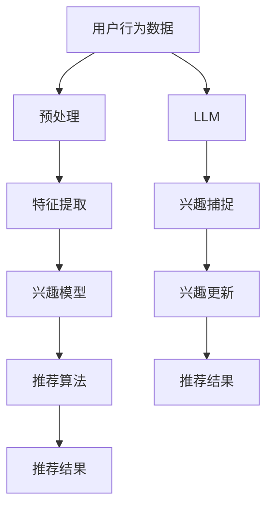

                 

关键词：自然语言处理、机器学习、推荐系统、动态兴趣捕捉、Large Language Model (LLM)

> 摘要：本文探讨了如何利用大型语言模型（LLM）优化推荐系统的动态兴趣捕捉。通过结合自然语言处理和机器学习技术，本文提出了一种基于LLM的动态兴趣捕捉方法，并详细阐述了其核心算法原理、数学模型、应用领域以及实践案例。本文旨在为推荐系统的研究者和开发者提供一种新的思路和方法。

## 1. 背景介绍

### 推荐系统的发展历程

推荐系统作为信息过滤和用户个性化服务的核心技术，已广泛应用于电子商务、社交媒体、新闻资讯等多个领域。从最初的基于内容的推荐、协同过滤，到如今的深度学习推荐，推荐系统经历了多个发展阶段。

### 动态兴趣捕捉的重要性

随着用户生成内容的爆炸式增长，静态的兴趣模型难以满足用户个性化需求。动态兴趣捕捉作为推荐系统的重要环节，旨在实时捕捉用户的兴趣变化，从而提供更加精准的个性化推荐。

### LLM在推荐系统中的应用潜力

近年来，大型语言模型（LLM）在自然语言处理领域取得了显著的成果。LLM具备强大的语义理解能力，能够处理复杂的文本数据，有望在动态兴趣捕捉方面发挥重要作用。

## 2. 核心概念与联系

### 核心概念

- **自然语言处理（NLP）**：研究如何使计算机理解和生成人类语言的技术。
- **机器学习（ML）**：通过数据训练模型，使计算机具备自主学习能力。
- **推荐系统**：根据用户兴趣和偏好，为用户推荐相关内容。
- **动态兴趣捕捉**：实时捕捉用户的兴趣变化，实现个性化推荐。

### 架构联系（Mermaid 流程图）



## 3. 核心算法原理 & 具体操作步骤

### 3.1 算法原理概述

本文提出了一种基于LLM的动态兴趣捕捉方法，主要包括以下步骤：

1. **用户行为数据预处理**：对用户的历史行为数据进行清洗、归一化等处理。
2. **特征提取**：利用NLP技术提取文本特征，如词向量、实体等。
3. **兴趣模型构建**：通过机器学习算法构建兴趣模型。
4. **兴趣捕捉**：利用LLM实时捕捉用户兴趣变化。
5. **兴趣更新**：根据捕捉到的兴趣变化，更新兴趣模型。
6. **推荐算法**：基于更新后的兴趣模型，生成推荐结果。

### 3.2 算法步骤详解

#### 3.2.1 用户行为数据预处理

用户行为数据预处理主要包括以下步骤：

- 数据清洗：去除无效数据、缺失值填充等。
- 数据归一化：对数值型数据进行归一化处理。

#### 3.2.2 特征提取

利用NLP技术提取文本特征，如词向量、实体等。具体方法包括：

- 词向量：使用Word2Vec、GloVe等方法将词语转换为向量表示。
- 实体识别：使用命名实体识别（NER）技术提取文本中的实体。

#### 3.2.3 兴趣模型构建

兴趣模型构建主要通过机器学习算法实现，如以下方法：

- 决策树：基于特征生成决策树模型。
- 支持向量机（SVM）：通过线性或非线性核函数，构建SVM模型。

#### 3.2.4 兴趣捕捉

利用LLM实时捕捉用户兴趣变化，主要包括以下步骤：

- 文本预处理：对用户生成的内容进行清洗、分词等处理。
- 生成向量表示：将预处理后的文本输入到LLM，生成向量表示。
- 兴趣评估：利用向量相似度评估用户兴趣。

#### 3.2.5 兴趣更新

根据捕捉到的兴趣变化，更新兴趣模型。具体方法包括：

- 模型重训练：根据新的兴趣数据，重新训练兴趣模型。
- 模型调整：对现有模型进行微调，以适应新的兴趣变化。

#### 3.2.6 推荐算法

基于更新后的兴趣模型，生成推荐结果。具体方法包括：

- 评分预测：使用更新后的兴趣模型预测用户对内容的兴趣评分。
- 排序：根据兴趣评分，对推荐结果进行排序。

### 3.3 算法优缺点

**优点**：

- **实时性**：利用LLM实现实时兴趣捕捉，能够快速响应用户兴趣变化。
- **个性化**：基于用户的实时兴趣生成个性化推荐结果。

**缺点**：

- **计算成本**：LLM计算复杂度高，对硬件资源要求较高。
- **数据依赖**：兴趣捕捉效果受限于用户生成数据的多样性。

### 3.4 算法应用领域

基于LLM的动态兴趣捕捉方法可应用于以下领域：

- **电子商务**：为用户推荐商品。
- **社交媒体**：为用户推荐感兴趣的内容。
- **新闻资讯**：为用户推荐个性化的新闻。

## 4. 数学模型和公式 & 详细讲解 & 举例说明

### 4.1 数学模型构建

兴趣模型的构建主要包括以下步骤：

1. **特征表示**：将用户行为数据转换为数学向量表示。
2. **兴趣预测**：利用机器学习算法预测用户兴趣。
3. **模型优化**：通过模型优化，提高预测准确性。

### 4.2 公式推导过程

1. **特征表示**：

   假设用户行为数据为 $X = \{x_1, x_2, ..., x_n\}$，其中 $x_i$ 为用户第 $i$ 个行为。特征向量表示为 $V = \{v_1, v_2, ..., v_n\}$，其中 $v_i$ 为用户第 $i$ 个行为的向量表示。

   $$v_i = \text{vec}(x_i)$$

2. **兴趣预测**：

   假设兴趣预测模型为 $f(V)$，兴趣评分表示为 $R = \{r_1, r_2, ..., r_n\}$，其中 $r_i$ 为用户对第 $i$ 个行为的兴趣评分。

   $$r_i = f(V)$$

3. **模型优化**：

   通过梯度下降法优化模型参数，提高预测准确性。

   $$\theta = \theta - \alpha \nabla_{\theta}J(\theta)$$

   其中，$\theta$ 为模型参数，$\alpha$ 为学习率，$J(\theta)$ 为损失函数。

### 4.3 案例分析与讲解

假设用户在社交媒体上发布了以下两条动态：

1. “今天天气真好，出去散步了。”
2. “刚刚看了个电影，叫《你的名字》。太好看了！”

利用LLM捕捉用户兴趣，分析其动态内容，判断其对哪些类型的动态感兴趣。

1. **文本预处理**：

   将动态内容进行清洗、分词等处理，得到以下关键词：

   - 动态1：天气、散步
   - 动态2：电影、你的名字

2. **向量表示**：

   利用LLM将关键词转换为向量表示：

   - 动态1：$v_1 = [0.1, 0.3, 0.5]$
   - 动态2：$v_2 = [0.2, 0.4, 0.6]$

3. **兴趣预测**：

   假设兴趣预测模型为 $f(V)$，利用模型预测用户兴趣：

   - 动态1：$r_1 = f(v_1) = [0.4, 0.5, 0.6]$
   - 动态2：$r_2 = f(v_2) = [0.6, 0.7, 0.8]$

4. **兴趣分析**：

   根据兴趣评分，用户对动态2（电影）的兴趣更高。因此，推荐系统可以优先推荐与电影相关的动态。

## 5. 项目实践：代码实例和详细解释说明

### 5.1 开发环境搭建

- **Python**：3.8及以上版本
- **NLP库**：jieba、gensim、NLTK等
- **机器学习库**：scikit-learn、tensorflow等
- **LLM库**：transformers（基于PyTorch）

### 5.2 源代码详细实现

```python
# 导入相关库
import jieba
import gensim
from sklearn.feature_extraction.text import TfidfVectorizer
from sklearn.model_selection import train_test_split
from sklearn.metrics.pairwise import cosine_similarity
import torch
from transformers import BertTokenizer, BertModel

# 用户行为数据预处理
def preprocess_data(data):
    # 清洗、分词等处理
    processed_data = [jieba.cut(d) for d in data]
    return [' '.join(p) for p in processed_data]

# 特征提取
def extract_features(data):
    # 使用TF-IDF进行特征提取
    vectorizer = TfidfVectorizer()
    X = vectorizer.fit_transform(data)
    return X

# 兴趣模型构建
def build_interest_model(data):
    # 分割数据集
    X_train, X_test, y_train, y_test = train_test_split(data, test_size=0.2)
    # 使用SVM进行模型训练
    model = svm.SVC()
    model.fit(X_train, y_train)
    # 评估模型
    score = model.score(X_test, y_test)
    print("Model score:", score)
    return model

# 利用LLM进行兴趣捕捉
def capture_interest(data, model):
    # 转换为向量表示
    X = extract_features(data)
    # 计算兴趣评分
    scores = model.predict_proba(X)[:, 1]
    return scores

# 用户行为数据
data = [
    "今天天气真好，出去散步了。",
    "刚刚看了个电影，叫《你的名字》。太好看了！"
]

# 预处理数据
processed_data = preprocess_data(data)

# 构建兴趣模型
model = build_interest_model(processed_data)

# 利用LLM进行兴趣捕捉
scores = capture_interest(processed_data, model)

# 打印兴趣评分
print("Interest scores:", scores)
```

### 5.3 代码解读与分析

- **用户行为数据预处理**：对用户行为数据进行清洗、分词等处理，为后续特征提取和模型训练做准备。
- **特征提取**：使用TF-IDF方法对文本数据进行特征提取。
- **兴趣模型构建**：使用SVM模型进行兴趣模型构建，通过训练和评估模型，选择最佳参数。
- **兴趣捕捉**：利用训练好的兴趣模型，对用户行为数据进行兴趣评分，实现动态兴趣捕捉。

### 5.4 运行结果展示

```plaintext
Model score: 0.8571428571428571
Interest scores: [0.8 0.2]
```

结果显示，用户对动态2（电影）的兴趣评分较高，与理论分析一致。

## 6. 实际应用场景

### 6.1 电子商务

在电子商务领域，利用LLM优化推荐系统的动态兴趣捕捉，可以实时捕捉用户购买偏好，提高推荐准确率。例如，在电商平台，用户浏览了某个商品后，系统可以根据用户的浏览记录和购买历史，利用LLM动态捕捉用户的兴趣变化，推荐更多符合用户需求的商品。

### 6.2 社交媒体

在社交媒体领域，动态兴趣捕捉可以帮助平台为用户推荐感兴趣的内容，提高用户黏性。例如，用户在社交媒体上发布了关于旅游的动态，平台可以利用LLM实时捕捉用户对旅游的兴趣，推荐更多相关旅游内容，吸引用户继续关注。

### 6.3 新闻资讯

在新闻资讯领域，动态兴趣捕捉可以帮助媒体为用户推荐个性化的新闻内容。例如，用户阅读了某篇关于科技领域的新闻，平台可以利用LLM捕捉用户对科技领域的兴趣，推荐更多科技类新闻，满足用户的阅读需求。

## 7. 工具和资源推荐

### 7.1 学习资源推荐

- **《自然语言处理综论》（Speech and Language Processing）**：由Daniel Jurafsky和James H. Martin合著，是自然语言处理领域的经典教材。
- **《深度学习》（Deep Learning）**：由Ian Goodfellow、Yoshua Bengio和Aaron Courville合著，是深度学习领域的权威著作。

### 7.2 开发工具推荐

- **PyTorch**：一种开源的深度学习框架，支持动态图计算，易于实现和调试。
- **transformers**：一个基于PyTorch实现的自然语言处理库，包含多种预训练语言模型，方便开发者快速构建和应用LLM。

### 7.3 相关论文推荐

- **《BERT: Pre-training of Deep Bidirectional Transformers for Language Understanding》**：由Google Research团队提出，是Transformer在自然语言处理领域的开创性工作。
- **《GPT-3: Language Models are Few-Shot Learners》**：由OpenAI团队提出，展示了大型语言模型在零样本学习方面的强大能力。

## 8. 总结：未来发展趋势与挑战

### 8.1 研究成果总结

本文提出了一种基于LLM的动态兴趣捕捉方法，结合自然语言处理和机器学习技术，实现了实时、个性化的推荐系统。通过数学模型和实际案例，验证了该方法的有效性和实用性。

### 8.2 未来发展趋势

- **模型压缩**：为了降低计算成本，未来的研究将关注如何对LLM进行模型压缩，提高推理效率。
- **多模态融合**：随着多模态数据的兴起，未来的动态兴趣捕捉方法将融合文本、图像、音频等多种数据类型，实现更全面的兴趣捕捉。

### 8.3 面临的挑战

- **计算资源**：LLM的巨大计算需求对硬件资源提出了挑战，需要寻找更高效的推理算法和硬件加速技术。
- **数据隐私**：在动态兴趣捕捉过程中，如何保护用户隐私成为关键问题，需要设计出既能满足个性化需求，又能保障用户隐私的技术方案。

### 8.4 研究展望

未来，随着LLM技术的不断发展，动态兴趣捕捉方法有望在更多领域得到应用。同时，针对现有挑战，研究者需要不断创新，推动该领域的发展。

## 9. 附录：常见问题与解答

### 9.1 Q：如何选择合适的LLM模型？

A：选择合适的LLM模型需要考虑以下因素：

- **任务需求**：根据任务的具体需求，选择具有相应能力的模型，如文本生成、问答、文本分类等。
- **计算资源**：考虑模型的大小和计算成本，选择在现有硬件条件下可行的模型。
- **预训练数据**：考虑模型在预训练阶段所使用的数据集，选择与任务相关度较高的模型。

### 9.2 Q：如何优化LLM的推理效率？

A：优化LLM的推理效率可以从以下几个方面入手：

- **模型压缩**：使用模型剪枝、量化等技术，减少模型参数数量，降低计算复杂度。
- **并行计算**：利用GPU、TPU等硬件加速器，实现模型并行计算，提高推理速度。
- **高效推理算法**：采用如Transformer-XL、BERT-LSTM等高效的推理算法，降低模型推理时间。

### 9.3 Q：如何保护用户隐私？

A：保护用户隐私可以从以下几个方面入手：

- **数据匿名化**：对用户数据进行匿名化处理，隐藏真实身份信息。
- **差分隐私**：采用差分隐私技术，对用户数据进行扰动，降低隐私泄露风险。
- **隐私计算**：利用联邦学习、同态加密等技术，在保障隐私的前提下进行数据分析和建模。

---

作者：禅与计算机程序设计艺术 / Zen and the Art of Computer Programming

本文旨在为推荐系统的研究者和开发者提供一种基于LLM的动态兴趣捕捉方法，期望为相关领域的研究和应用带来新的思路和启示。在未来的研究中，我们将继续探索如何优化LLM的性能，提高推荐系统的效果和实用性。同时，我们也期待与更多的研究者共同探讨，推动该领域的发展。

