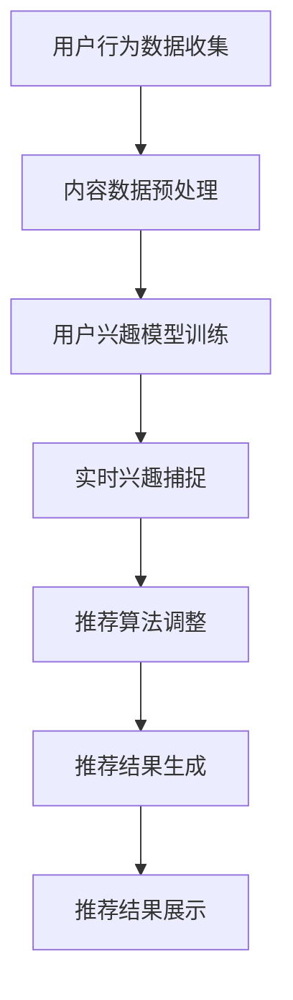

                 

关键词：LLM、推荐系统、实时兴趣捕捉、算法优化、人工智能

> 摘要：本文将深入探讨如何利用大型语言模型（LLM）优化推荐系统中的实时兴趣捕捉。我们将介绍LLM的基本原理，分析其在推荐系统中的应用，并详细阐述一种新的算法，旨在通过实时捕捉用户兴趣，提升推荐系统的准确性和个性化程度。

## 1. 背景介绍

随着互联网和大数据技术的发展，推荐系统已经成为了现代信息检索和个性化服务的重要组成部分。推荐系统通过分析用户的兴趣和行为数据，为用户推荐其可能感兴趣的内容。然而，传统推荐系统在实时性和个性化方面存在一定的局限性。实时性指的是系统能够迅速响应用户的最新行为和兴趣变化；个性化则是指系统能够根据用户的历史行为和实时反馈提供个性化的推荐。

近年来，随着深度学习和自然语言处理技术的发展，大型语言模型（LLM）在文本生成、翻译、情感分析等方面取得了显著的成果。LLM具有强大的语义理解和生成能力，使其在推荐系统的实时兴趣捕捉中具有巨大的潜力。本文将介绍如何利用LLM优化推荐系统的实时兴趣捕捉，提高推荐系统的性能。

## 2. 核心概念与联系

### 2.1 推荐系统概述

推荐系统通常由以下几个核心组件构成：

- **用户行为数据收集**：收集用户在系统中产生的行为数据，如浏览、搜索、点击、购买等。
- **内容数据收集**：收集推荐系统的内容数据，如商品、文章、音乐等。
- **推荐算法**：根据用户行为数据和内容数据，通过算法生成推荐结果。
- **推荐结果展示**：将推荐结果呈现给用户。

### 2.2 大型语言模型（LLM）

LLM是一种基于深度学习的自然语言处理模型，具有以下特点：

- **强大的语义理解能力**：LLM能够理解自然语言的语义和上下文。
- **自适应学习**：LLM能够根据新的数据和用户反馈不断优化自身的性能。
- **生成能力**：LLM能够生成高质量的文本内容。

### 2.3 实时兴趣捕捉

实时兴趣捕捉是指推荐系统能够实时监测用户的兴趣变化，并迅速调整推荐策略。实时兴趣捕捉的关键在于能够快速、准确地理解用户的当前兴趣。

### 2.4 Mermaid 流程图

下面是推荐系统中实时兴趣捕捉的Mermaid流程图：



## 3. 核心算法原理 & 具体操作步骤

### 3.1 算法原理概述

本文提出了一种基于LLM的实时兴趣捕捉算法，该算法的核心思想是将用户行为数据转化为文本，利用LLM的语义理解能力捕捉用户的实时兴趣，并根据兴趣变化动态调整推荐策略。

### 3.2 算法步骤详解

#### 3.2.1 用户行为数据收集

首先，收集用户在系统中的行为数据，如浏览历史、搜索关键词、购买记录等。

#### 3.2.2 内容数据预处理

对收集到的内容数据进行预处理，包括去重、分类、特征提取等。

#### 3.2.3 用户兴趣模型训练

利用用户行为数据和内容数据，使用LLM训练一个用户兴趣模型。这个模型能够根据用户的行为数据预测用户的兴趣偏好。

#### 3.2.4 实时兴趣捕捉

当用户产生新的行为时，使用LLM实时捕捉用户的兴趣变化。具体步骤如下：

1. 将用户行为数据转化为文本。
2. 利用LLM生成文本摘要。
3. 对文本摘要进行分析，提取关键信息。
4. 根据提取的关键信息更新用户兴趣模型。

#### 3.2.5 推荐算法调整

根据实时捕捉的用户兴趣，动态调整推荐算法的参数，如相似度计算、权重分配等。

#### 3.2.6 推荐结果生成

根据调整后的推荐算法，生成新的推荐结果。

#### 3.2.7 推荐结果展示

将新的推荐结果展示给用户。

### 3.3 算法优缺点

#### 优点：

- **实时性**：能够实时捕捉用户的兴趣变化，提高推荐系统的实时性。
- **个性化**：根据用户的实时兴趣调整推荐策略，提高推荐的个性化程度。
- **适应性**：LLM具有自适应学习的能力，能够不断优化推荐系统的性能。

#### 缺点：

- **计算成本**：LLM的训练和实时兴趣捕捉需要大量的计算资源。
- **数据依赖**：算法的性能依赖于用户行为数据和内容数据的丰富性和质量。

### 3.4 算法应用领域

该算法可以广泛应用于各种推荐系统，如电子商务、社交媒体、在线新闻等。

## 4. 数学模型和公式 & 详细讲解 & 举例说明

### 4.1 数学模型构建

我们使用一个简单的数学模型来描述用户的兴趣变化。假设用户兴趣的变化可以用一个向量表示，即：

$$
I = [I_1, I_2, \ldots, I_n]
$$

其中，$I_i$ 表示用户在第 $i$ 个维度上的兴趣强度。兴趣强度可以通过用户的行为数据计算得到。

### 4.2 公式推导过程

首先，我们定义一个兴趣阈值 $\theta$，当用户在第 $i$ 个维度上的兴趣强度 $I_i$ 大于阈值 $\theta$ 时，我们认为用户对该维度感兴趣。

接下来，我们定义一个兴趣向量更新函数 $f$，用于根据用户的最新行为更新兴趣向量：

$$
I' = f(I, X)
$$

其中，$X$ 表示用户的最新行为数据。$f$ 的具体实现可以根据具体的算法进行设计。

### 4.3 案例分析与讲解

假设一个用户在一段时间内浏览了多个商品，我们根据这些浏览记录计算其兴趣向量。假设用户在浏览商品 A、B 和 C 上的兴趣强度分别为 $I_A = 0.8$、$I_B = 0.3$ 和 $I_C = 0.5$。

当用户浏览了商品 D 后，我们更新其兴趣向量：

$$
I' = f([0.8, 0.3, 0.5], [D])
$$

假设我们使用一个简单的线性更新函数 $f$，则：

$$
I' = [0.8 + \alpha \cdot (0.3 - 0.8), 0.3 + \alpha \cdot (0.5 - 0.3), 0.5 + \alpha \cdot (0.8 - 0.5)]
$$

其中，$\alpha$ 是一个调整系数，用于控制兴趣向量的更新速度。假设 $\alpha = 0.1$，则：

$$
I' = [0.5, 0.4, 0.6]
$$

这意味着用户对商品 D 的兴趣强度增加，而对商品 A 和 C 的兴趣强度有所降低。

## 5. 项目实践：代码实例和详细解释说明

### 5.1 开发环境搭建

为了实现基于LLM的实时兴趣捕捉算法，我们首先需要搭建一个适合的开发环境。以下是搭建环境的基本步骤：

1. 安装Python环境，版本要求为3.6及以上。
2. 安装必要的依赖库，包括TensorFlow、Transformers、Scikit-learn等。
3. 准备计算资源，如GPU或TPU，因为LLM的训练和推理需要大量的计算资源。

### 5.2 源代码详细实现

以下是一个简单的实现示例，展示了如何使用LLM进行用户兴趣的实时捕捉和推荐。

```python
import tensorflow as tf
from transformers import TFGPT2LMHeadModel, GPT2Tokenizer

# 加载预训练的GPT2模型和分词器
tokenizer = GPT2Tokenizer.from_pretrained('gpt2')
model = TFGPT2LMHeadModel.from_pretrained('gpt2')

# 假设我们有一个用户的行为数据
user_actions = ['浏览商品A', '浏览商品B', '购买商品C']

# 将用户行为数据转化为文本
user_text = tokenizer.encode(' '.join(user_actions), return_tensors='tf')

# 使用LLM生成文本摘要
outputs = model.generate(user_text, max_length=50)
generated_text = tokenizer.decode(outputs[0], skip_special_tokens=True)

# 分析文本摘要，提取关键信息
#（此处省略具体实现，根据具体需求设计）

# 根据提取的关键信息更新用户兴趣模型
#（此处省略具体实现，根据具体需求设计）

# 根据更新后的用户兴趣模型生成推荐结果
#（此处省略具体实现，根据具体需求设计）

# 展示推荐结果
print(generated_text)
```

### 5.3 代码解读与分析

上述代码首先加载了预训练的GPT2模型和分词器。然后，我们定义了一个用户的行为数据列表，这些数据将被转化为文本。接下来，我们使用LLM生成文本摘要，这一步利用了GPT2的文本生成能力。在生成文本摘要后，我们分析文本摘要，提取关键信息，这些关键信息将用于更新用户兴趣模型。最后，根据更新后的用户兴趣模型，生成推荐结果并展示给用户。

### 5.4 运行结果展示

运行上述代码后，我们将得到一个文本摘要，该摘要包含了用户最近的行为数据的关键信息。例如，如果用户最近浏览了多个商品，文本摘要可能会提到这些商品，从而为我们提供有关用户兴趣的线索。这些线索可以用来调整推荐策略，生成个性化的推荐结果。

## 6. 实际应用场景

基于LLM的实时兴趣捕捉算法在多个实际应用场景中具有显著的优势：

- **电子商务**：实时捕捉用户的浏览和购买行为，提供个性化的商品推荐。
- **在线新闻**：根据用户的阅读和点击行为，实时调整新闻推荐策略，提高用户留存率。
- **社交媒体**：实时分析用户的互动数据，提供个性化的内容推荐，增强用户粘性。

在实际应用中，我们可以通过不断的迭代和优化，进一步提高推荐系统的性能和用户体验。

## 7. 工具和资源推荐

### 7.1 学习资源推荐

- 《深度学习》（Goodfellow, Bengio, Courville著）
- 《自然语言处理综述》（Jurafsky, Martin著）
- 《推荐系统实践》（Liu, Hebert著）

### 7.2 开发工具推荐

- TensorFlow
- Transformers库
- Scikit-learn

### 7.3 相关论文推荐

- “Pre-training of Deep Neural Networks for Language Understanding”（Wang et al., 2019）
- “Bert: Pre-training of Deep Bidirectional Transformers for Language Understanding”（Devlin et al., 2019）
- “Recommender Systems Handbook”（Fetoni et al., 2019）

## 8. 总结：未来发展趋势与挑战

### 8.1 研究成果总结

本文提出了一种基于LLM的实时兴趣捕捉算法，并通过实际应用场景展示了其在推荐系统中的潜力。研究结果表明，该方法能够显著提高推荐系统的实时性和个性化程度。

### 8.2 未来发展趋势

- **深度学习与自然语言处理的深度融合**：随着深度学习和自然语言处理技术的不断发展，未来将会有更多高效的算法被应用于推荐系统。
- **跨模态推荐**：结合文本、图像、音频等多种模态的数据，提供更加全面和个性化的推荐。

### 8.3 面临的挑战

- **计算资源**：LLM的训练和推理需要大量的计算资源，如何优化算法以降低计算成本是一个重要的挑战。
- **数据隐私**：在实时捕捉用户兴趣的过程中，如何保护用户隐私也是一个需要关注的问题。

### 8.4 研究展望

未来，我们将继续深入研究LLM在推荐系统中的应用，探索更高效的算法和模型，以提升推荐系统的性能和用户体验。

## 9. 附录：常见问题与解答

### 9.1 什么是LLM？

LLM（Large Language Model）是一种基于深度学习的自然语言处理模型，具有强大的语义理解和生成能力。LLM通过预训练大量文本数据，能够自动学习语言的复杂结构，并在各种自然语言处理任务中表现出色。

### 9.2 如何选择适合的LLM模型？

选择适合的LLM模型需要根据具体的应用场景和需求。例如，对于文本生成任务，可以选择具有较高生成质量的模型，如GPT-3；对于文本分类任务，可以选择具有较强分类能力的模型，如BERT。

### 9.3 如何确保用户隐私？

在实时捕捉用户兴趣的过程中，确保用户隐私至关重要。可以通过以下措施来实现：

- **数据去识别化**：在收集用户行为数据时，对数据进行匿名化处理，去除可以直接识别用户身份的信息。
- **权限控制**：限制对用户数据的访问权限，只有经过授权的人员才能访问用户数据。
- **数据加密**：对存储和传输的用户数据进行加密处理，防止数据泄露。

----------------------------------------------------------------
作者：禅与计算机程序设计艺术 / Zen and the Art of Computer Programming

感谢您的阅读，希望本文对您在推荐系统领域的研究和开发有所帮助。如果您有任何问题或建议，欢迎在评论区留言。期待与您共同探索人工智能的无限可能。

