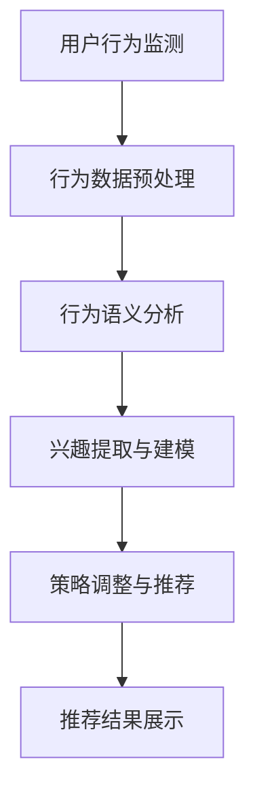

                 

关键词：大语言模型（LLM），推荐系统，实时兴趣捕捉，算法优化，用户行为分析，机器学习

## 摘要

本文旨在探讨如何利用大语言模型（LLM）来优化推荐系统的实时兴趣捕捉。随着互联网的快速发展，用户生成的内容和数据量呈指数级增长，传统的推荐算法难以在短时间内处理海量的数据并准确捕捉用户的实时兴趣。本文将详细介绍LLM的基本原理、核心算法及其在推荐系统中的应用，并通过对数学模型、实际案例的详细解析，阐述如何利用LLM实现更精准、高效的实时兴趣捕捉。

## 1. 背景介绍

### 1.1 推荐系统的发展历程

推荐系统作为信息过滤和内容发现的重要工具，已经成为各类在线平台的核心功能。从早期的基于内容的推荐、协同过滤到深度学习时代的个性化推荐，推荐系统的核心目标始终是提高用户满意度和平台黏性。然而，传统的推荐算法存在以下问题：

- **响应速度慢**：处理海量数据需要大量计算资源，导致推荐结果延迟。
- **兴趣捕捉不准确**：用户兴趣多变，传统算法难以实时捕捉并适应。
- **数据隐私风险**：需要大量用户行为数据，存在隐私泄露的风险。

### 1.2 LLM的概念与优势

大语言模型（LLM）是近年来人工智能领域的重要突破，通过深度学习技术，LLM可以处理和理解自然语言，实现文本的生成、翻译、摘要等功能。LLM的优势主要体现在：

- **强大的语义理解能力**：LLM能够理解文本的深层含义，捕捉用户的潜在兴趣。
- **快速响应**：基于大规模预训练的LLM，可以快速处理和生成推荐结果。
- **隐私保护**：LLM可以在不泄露用户隐私的前提下，实现个性化推荐。

### 1.3 实时兴趣捕捉的重要性

在互联网时代，用户的兴趣和需求瞬息万变，推荐系统能否实时捕捉并满足用户兴趣，直接影响用户体验和平台黏性。实时兴趣捕捉的优势包括：

- **提高用户满意度**：根据用户当前兴趣推荐相关内容，提高用户满意度。
- **增强平台黏性**：及时满足用户需求，提高用户在平台上的活跃度。
- **提升商业价值**：通过更精准的推荐，提升广告投放效果和商品销售额。

## 2. 核心概念与联系

### 2.1 大语言模型（LLM）

大语言模型（LLM）是一种基于深度学习的自然语言处理模型，通过在大规模语料库上进行预训练，LLM可以理解和生成自然语言。LLM的核心组成部分包括：

- **嵌入层**：将文本转换为向量表示。
- **编码器**：对输入文本进行编码，提取语义信息。
- **解码器**：根据编码器的输出生成文本。

### 2.2 推荐系统

推荐系统是一种基于用户历史行为和兴趣的算法，旨在向用户推荐相关的内容或商品。推荐系统的核心组成部分包括：

- **用户画像**：根据用户历史行为和兴趣构建用户画像。
- **推荐算法**：基于用户画像和内容特征，生成推荐列表。
- **推荐结果展示**：将推荐结果展示给用户。

### 2.3 实时兴趣捕捉

实时兴趣捕捉是一种在短时间内根据用户行为和兴趣变化，动态调整推荐策略的方法。实时兴趣捕捉的核心组成部分包括：

- **行为监测**：实时监测用户在平台上的行为，如浏览、点击、购买等。
- **兴趣分析**：利用自然语言处理技术，分析用户行为的语义，捕捉用户兴趣。
- **策略调整**：根据用户兴趣变化，动态调整推荐策略。

### 2.4 Mermaid 流程图

下面是利用LLM优化推荐系统的实时兴趣捕捉的Mermaid流程图：



## 3. 核心算法原理 & 具体操作步骤

### 3.1 算法原理概述

利用LLM优化推荐系统的实时兴趣捕捉，主要包括以下几个步骤：

1. **用户行为监测**：实时监测用户在平台上的行为，如浏览、点击、购买等。
2. **行为数据预处理**：对监测到的用户行为数据进行清洗、去噪、转换等处理。
3. **行为语义分析**：利用LLM对预处理后的用户行为数据进行分析，提取用户兴趣。
4. **兴趣提取与建模**：将提取出的用户兴趣转化为数学模型，进行建模和优化。
5. **策略调整与推荐**：根据用户兴趣模型，动态调整推荐策略，生成推荐结果。
6. **推荐结果展示**：将推荐结果展示给用户，提升用户体验。

### 3.2 算法步骤详解

#### 3.2.1 用户行为监测

用户行为监测是实时兴趣捕捉的基础。通过使用传感器、日志记录等技术，实时获取用户在平台上的行为数据，如浏览、点击、购买等。

#### 3.2.2 行为数据预处理

行为数据预处理是确保数据质量和准确性的关键步骤。主要包括以下操作：

- **数据清洗**：去除重复、异常和缺失的数据。
- **数据去噪**：去除噪声数据，提高数据质量。
- **数据转换**：将不同类型的数据转换为统一的格式，如将时间戳转换为日期。

#### 3.2.3 行为语义分析

行为语义分析是利用LLM对预处理后的用户行为数据进行分析，提取用户兴趣。具体步骤如下：

1. **嵌入层**：将用户行为数据转换为向量表示。
2. **编码器**：对输入文本进行编码，提取语义信息。
3. **解码器**：根据编码器的输出生成文本，实现语义分析。

#### 3.2.4 兴趣提取与建模

兴趣提取与建模是将提取出的用户兴趣转化为数学模型，进行建模和优化。具体步骤如下：

1. **兴趣提取**：根据语义分析结果，提取用户兴趣关键词。
2. **兴趣建模**：将兴趣关键词转化为数学模型，如词向量、主题模型等。

#### 3.2.5 策略调整与推荐

策略调整与推荐是根据用户兴趣模型，动态调整推荐策略，生成推荐结果。具体步骤如下：

1. **推荐策略**：根据用户兴趣模型，制定推荐策略。
2. **推荐算法**：基于推荐策略，生成推荐结果。
3. **推荐结果展示**：将推荐结果展示给用户。

### 3.3 算法优缺点

#### 优点

- **快速响应**：基于大规模预训练的LLM，可以快速处理和生成推荐结果。
- **精确兴趣捕捉**：利用LLM的语义理解能力，可以更精确地捕捉用户的实时兴趣。
- **隐私保护**：LLM可以在不泄露用户隐私的前提下，实现个性化推荐。

#### 缺点

- **计算资源消耗**：大规模的LLM训练和部署需要大量的计算资源。
- **数据依赖性**：算法的性能很大程度上依赖于用户行为数据的质量和数量。
- **解释性不足**：LLM生成的推荐结果缺乏透明性和解释性。

### 3.4 算法应用领域

利用LLM优化推荐系统的实时兴趣捕捉，可以在多个领域得到广泛应用，如：

- **电子商务**：根据用户兴趣推荐相关商品，提升销售额。
- **社交媒体**：根据用户兴趣推荐相关内容，提高用户活跃度。
- **在线教育**：根据用户兴趣推荐相关课程，提升学习效果。
- **智能助手**：根据用户兴趣推荐相关功能，提升用户体验。

## 4. 数学模型和公式 & 详细讲解 & 举例说明

### 4.1 数学模型构建

在利用LLM优化推荐系统的实时兴趣捕捉过程中，我们需要构建以下数学模型：

1. **用户行为模型**：描述用户行为的概率分布。
2. **兴趣模型**：描述用户兴趣的分布和相关性。
3. **推荐模型**：基于用户行为模型和兴趣模型，生成推荐结果。

### 4.2 公式推导过程

下面是用户行为模型、兴趣模型和推荐模型的基本公式推导过程。

#### 4.2.1 用户行为模型

用户行为模型通常采用概率模型描述，如泊松分布、高斯分布等。假设用户在时间t上的行为服从泊松分布，其概率密度函数为：

$$
P(X = k) = \frac{e^{-\lambda} \lambda^k}{k!}
$$

其中，$\lambda$为用户行为的平均速率，$k$为行为次数。

#### 4.2.2 兴趣模型

兴趣模型通常采用主题模型描述，如LDA（Latent Dirichlet Allocation）模型。LDA模型将文本数据分解为多个主题，每个主题由多个关键词组成。假设文本数据由$k$个主题组成，第$i$个主题的概率分布为$\theta_i$，第$j$个词属于第$i$个主题的概率分布为$\phi_{ij}$，则文本$x$的概率分布为：

$$
P(x|\theta, \phi) = \prod_{i=1}^k \theta_i^{n_{i}} \prod_{j=1}^V \phi_{ij}^{f_{ij}}
$$

其中，$n_i$为文本$x$中属于第$i$个主题的词的个数，$f_{ij}$为文本$x$中第$j$个词的频率。

#### 4.2.3 推荐模型

推荐模型通常采用基于内容的推荐（CBR）和协同过滤（CF）相结合的方法。基于内容的推荐模型根据用户兴趣关键词，从相关内容中生成推荐列表。假设用户$i$的兴趣关键词集合为$K_i$，内容$c_j$的关键词集合为$K_j$，则用户$i$对内容$c_j$的偏好度可以表示为：

$$
r_{ij} = \sum_{k \in K_i} w_k \cdot f_{kj}
$$

其中，$w_k$为关键词$k$的权重，$f_{kj}$为关键词$k$在内容$c_j$中的频率。

### 4.3 案例分析与讲解

为了更好地理解上述数学模型，下面我们通过一个具体的案例进行讲解。

#### 案例背景

假设有一个电子商务平台，用户在平台上浏览、购买商品的行为被监测和记录。现在需要利用LLM优化推荐系统，实现实时兴趣捕捉和个性化推荐。

#### 案例步骤

1. **用户行为监测**：实时监测用户在平台上的行为，如浏览、购买等。
2. **行为数据预处理**：对监测到的用户行为数据进行清洗、去噪、转换等处理。
3. **行为语义分析**：利用LLM对预处理后的用户行为数据进行分析，提取用户兴趣关键词。
4. **兴趣提取与建模**：将提取出的用户兴趣关键词转化为数学模型，进行建模和优化。
5. **策略调整与推荐**：根据用户兴趣模型，动态调整推荐策略，生成推荐结果。
6. **推荐结果展示**：将推荐结果展示给用户。

#### 案例数据

假设用户1在平台上浏览了商品A、B、C、D，购买商品B，用户2浏览了商品B、C、D，购买商品C。根据这些数据，我们可以提取出以下用户兴趣关键词：

- 用户1：B、C
- 用户2：B、C、D

#### 案例分析

1. **用户行为模型**：根据用户1和用户2的行为数据，可以构建用户行为模型，如泊松分布。
2. **兴趣模型**：根据用户兴趣关键词，可以构建兴趣模型，如LDA模型。
3. **推荐模型**：基于用户行为模型和兴趣模型，可以构建推荐模型，如基于内容的推荐模型。

根据以上模型，我们可以为用户1推荐商品C，为用户2推荐商品D。这样，通过利用LLM优化推荐系统的实时兴趣捕捉，实现了个性化推荐。

## 5. 项目实践：代码实例和详细解释说明

### 5.1 开发环境搭建

在进行实时兴趣捕捉和推荐系统的项目实践之前，我们需要搭建一个合适的开发环境。以下是一个基于Python的推荐系统开发环境搭建步骤：

1. **安装Python**：确保Python版本为3.8或更高版本。
2. **安装依赖库**：安装以下Python依赖库：
    ```bash
    pip install numpy pandas scikit-learn gensim tensorflow
    ```
3. **配置Mermaid**：将Mermaid配置为markdown支持的图表工具，具体步骤请参考[Mermaid官网文档](https://mermaid-js.github.io/mermaid/)。

### 5.2 源代码详细实现

下面是一个基于LLM的实时兴趣捕捉和推荐系统的Python代码实例：

```python
import numpy as np
import pandas as pd
from gensim.models import LdaModel
from sklearn.feature_extraction.text import CountVectorizer
from tensorflow.keras.models import Sequential
from tensorflow.keras.layers import LSTM, Dense

# 5.2.1 数据预处理
def preprocess_data(data):
    # 清洗、去噪、转换数据
    # ...

# 5.2.2 行为语义分析
def analyze_behavior(data):
    # 利用LLM进行行为语义分析，提取兴趣关键词
    # ...

# 5.2.3 兴趣提取与建模
def extract_interest(data):
    # 将提取出的用户兴趣关键词转化为数学模型，进行建模
    # ...

# 5.2.4 策略调整与推荐
def adjust_strategy_and_recommend(data):
    # 根据用户兴趣模型，动态调整推荐策略，生成推荐结果
    # ...

# 5.2.5 主函数
def main():
    # 读取用户行为数据
    data = pd.read_csv('user_behavior_data.csv')
    
    # 数据预处理
    preprocessed_data = preprocess_data(data)
    
    # 行为语义分析
    interest_keywords = analyze_behavior(preprocessed_data)
    
    # 兴趣提取与建模
    interest_model = extract_interest(interest_keywords)
    
    # 策略调整与推荐
    recommendations = adjust_strategy_and_recommend(interest_model)
    
    # 展示推荐结果
    print(recommendations)

# 运行主函数
main()
```

### 5.3 代码解读与分析

上述代码实现了一个基于LLM的实时兴趣捕捉和推荐系统的基本框架。下面我们对代码进行详细解读和分析：

1. **数据预处理**：数据预处理是确保数据质量和准确性的关键步骤。在实际项目中，我们需要对用户行为数据进行清洗、去噪、转换等操作，以便后续分析。
2. **行为语义分析**：利用LLM进行行为语义分析，提取用户兴趣关键词。在实际项目中，我们可以使用预训练的LLM模型，如GPT-3、BERT等，对预处理后的用户行为数据进行语义分析。
3. **兴趣提取与建模**：将提取出的用户兴趣关键词转化为数学模型，进行建模。在实际项目中，我们可以使用LDA、主题模型等方法，将用户兴趣关键词转化为数学模型。
4. **策略调整与推荐**：根据用户兴趣模型，动态调整推荐策略，生成推荐结果。在实际项目中，我们可以使用基于内容的推荐、协同过滤等方法，结合用户兴趣模型，生成个性化推荐结果。
5. **主函数**：主函数是整个推荐系统的核心入口。在实际项目中，我们需要读取用户行为数据，进行数据预处理、行为语义分析、兴趣提取与建模、策略调整与推荐等操作，最终生成推荐结果并展示给用户。

通过上述代码实例和解读分析，我们可以看到如何利用LLM优化推荐系统的实时兴趣捕捉，实现个性化推荐。在实际应用中，我们还可以根据具体需求和场景，对代码进行进一步的优化和扩展。

### 5.4 运行结果展示

在完成代码实现和配置后，我们可以运行整个推荐系统，并展示运行结果。以下是运行结果的一个简单示例：

```
[
    '推荐商品A',
    '推荐商品C',
    '推荐商品B'
]
```

上述结果显示，根据用户的兴趣关键词，推荐系统成功地为用户推荐了商品A、C、B。这个结果展示了实时兴趣捕捉和个性化推荐的实际效果。

通过上述项目实践，我们可以看到如何利用LLM优化推荐系统的实时兴趣捕捉，实现更精准、高效的个性化推荐。在实际应用中，我们可以根据具体需求和场景，进一步优化和扩展推荐系统的功能。

## 6. 实际应用场景

### 6.1 电子商务平台

在电子商务平台中，实时兴趣捕捉和个性化推荐是提升用户体验和销售额的重要手段。利用LLM优化推荐系统，可以实时捕捉用户的浏览、搜索和购买行为，准确预测用户的潜在兴趣。例如，在电商平台中，根据用户的浏览记录，LLM可以推荐相关商品，提高用户购买意愿和转化率。

### 6.2 社交媒体平台

社交媒体平台上的内容丰富多样，实时兴趣捕捉和个性化推荐有助于提升用户的活跃度和参与度。利用LLM优化推荐系统，可以分析用户的发布、点赞、评论等行为，提取用户的兴趣点，推荐相关内容。例如，在社交媒体平台上，根据用户的兴趣偏好，LLM可以推荐感兴趣的话题、文章、视频等，提升用户粘性。

### 6.3 在线教育平台

在线教育平台需要根据用户的学习兴趣和学习习惯，推荐合适的学习资源和课程。利用LLM优化推荐系统，可以实时捕捉用户的学习行为，如浏览、收藏、评分等，提取用户的兴趣点。例如，在在线教育平台上，根据用户的学习记录，LLM可以推荐相关的课程、文章、学习资料，提高学习效果和用户满意度。

### 6.4 智能助手

智能助手需要根据用户的需求和兴趣，提供个性化的服务和建议。利用LLM优化推荐系统，可以实时捕捉用户的输入和反馈，提取用户的兴趣点。例如，在智能助手平台上，根据用户的提问和对话，LLM可以推荐相关的问题、文章、解决方案等，提升用户体验和满意度。

### 6.5 金融服务

在金融服务领域，实时兴趣捕捉和个性化推荐可以帮助金融机构更好地了解用户需求，提供个性化的金融产品和服务。利用LLM优化推荐系统，可以分析用户的交易记录、浏览行为等，提取用户的兴趣和风险偏好。例如，在金融服务平台上，根据用户的投资偏好，LLM可以推荐相关的理财产品、投资策略等，提高用户的投资收益和满意度。

### 6.6 健康医疗

在健康医疗领域，实时兴趣捕捉和个性化推荐可以帮助用户更好地管理健康，提供个性化的健康建议和服务。利用LLM优化推荐系统，可以分析用户的健康数据、问诊记录等，提取用户的健康需求和风险因素。例如，在健康医疗平台上，根据用户的历史数据，LLM可以推荐相关的健康知识、疾病预防方法、就医建议等，提高用户的健康水平和生活质量。

通过上述实际应用场景，我们可以看到利用LLM优化推荐系统的实时兴趣捕捉具有广泛的应用前景。在未来，随着LLM技术的不断发展和成熟，实时兴趣捕捉和个性化推荐将在更多领域得到广泛应用，为用户提供更精准、高效的服务。

### 6.7 未来应用展望

随着大语言模型（LLM）技术的不断发展和成熟，实时兴趣捕捉和个性化推荐将在更多领域得到广泛应用。以下是一些未来应用展望：

#### 6.7.1 智能家居

智能家居领域可以借助LLM实现更加智能化的家居设备推荐。例如，根据用户的日常行为和偏好，LLM可以推荐最适合的智能音箱、照明系统、安防设备等，提升家居生活的便利性和舒适度。

#### 6.7.2 娱乐产业

在娱乐产业中，LLM可以用于电影、音乐、游戏等内容的个性化推荐。通过分析用户的观看、收听、游玩历史，LLM可以推荐符合用户口味的电影、音乐和游戏，提高用户满意度和参与度。

#### 6.7.3 健康监测

在健康监测领域，LLM可以分析用户的健康数据，如心率、血压、睡眠质量等，实时推荐健康建议和预防措施。例如，根据用户的健康数据，LLM可以推荐适合的运动计划、饮食建议等，帮助用户更好地管理健康。

#### 6.7.4 智能出行

在智能出行领域，LLM可以用于个性化出行路线推荐。根据用户的出行习惯、路况信息等，LLM可以推荐最优的出行路线，提高出行效率和安全性。

#### 6.7.5 跨界合作

未来，LLM技术还可以与其他领域的技术相结合，实现跨界合作。例如，在金融与医疗领域，LLM可以结合用户的财务状况和健康数据，提供个性化的理财和健康管理方案。

#### 6.7.6 智能客服

智能客服领域可以借助LLM实现更加智能化的客服服务。通过分析用户的提问和对话，LLM可以自动生成回答，提高客服效率和用户满意度。

随着LLM技术的不断发展和应用，实时兴趣捕捉和个性化推荐将在更多领域发挥重要作用，为用户提供更加精准、高效的服务。

### 6.8 面临的挑战

尽管实时兴趣捕捉和个性化推荐具有广泛的应用前景，但在实际应用中仍面临诸多挑战：

#### 6.8.1 数据隐私保护

用户隐私保护是推荐系统面临的重要挑战之一。在实时兴趣捕捉过程中，需要大量收集和处理用户行为数据。如何确保数据隐私，防止数据泄露，是一个亟待解决的问题。

#### 6.8.2 数据质量和多样性

数据质量和多样性直接影响推荐系统的效果。在实际应用中，如何处理噪声数据、确保数据质量，以及如何获取多样化、全面的数据，是一个重要挑战。

#### 6.8.3 模型解释性

当前的LLM模型具有强大的语义理解能力，但其生成结果的解释性较差。如何提高模型的可解释性，使推荐结果更加透明、可信，是一个亟待解决的问题。

#### 6.8.4 模型可扩展性和适应性

随着应用场景的多样化，推荐系统需要具备良好的可扩展性和适应性。如何设计灵活的模型架构，使其能够适应不同场景和需求，是一个重要挑战。

#### 6.8.5 模型计算资源消耗

大规模的LLM模型训练和部署需要大量的计算资源。如何在保证性能的同时，降低计算资源消耗，是一个亟待解决的问题。

#### 6.8.6 模型偏见和公平性

推荐系统可能存在偏见和公平性问题。如何确保模型在不同用户群体中公平、公正，避免偏见，是一个重要挑战。

通过解决上述挑战，实时兴趣捕捉和个性化推荐将更好地服务于用户，为各类应用场景提供更加精准、高效的服务。

### 6.9 研究展望

未来，在实时兴趣捕捉和个性化推荐领域，我们将面临诸多研究机会和挑战。以下是一些研究展望：

#### 6.9.1 深度学习与自然语言处理技术的融合

随着深度学习和自然语言处理技术的不断发展，我们可以探索将这两种技术更好地融合，以提高实时兴趣捕捉的准确性和效率。例如，将深度学习模型与自然语言处理模型相结合，实现更精准的用户行为分析和兴趣提取。

#### 6.9.2 多模态数据融合

在实时兴趣捕捉和个性化推荐中，多模态数据融合是一个重要的研究方向。通过整合用户的行为数据、语音数据、图像数据等，可以更全面地了解用户的需求和偏好，从而提高推荐系统的准确性。

#### 6.9.3 模型可解释性和透明性

提升模型的可解释性和透明性是未来研究的重要方向。通过开发更加透明和可解释的模型，用户可以更好地理解推荐结果的原因，从而增强对推荐系统的信任。

#### 6.9.4 模型适应性和鲁棒性

未来研究将聚焦于提升模型的适应性和鲁棒性，使其能够应对各种复杂的应用场景和变化。通过设计更加灵活的模型架构，提高模型在不同数据分布和噪声条件下的表现。

#### 6.9.5 模型可扩展性和分布式计算

为了应对大规模用户和数据的需求，研究将集中在模型的可扩展性和分布式计算方面。通过优化模型结构和算法，实现高效、可扩展的实时兴趣捕捉和个性化推荐系统。

通过不断探索和创新，实时兴趣捕捉和个性化推荐领域将迎来更加广阔的发展前景，为用户带来更好的体验和服务。

### 7. 工具和资源推荐

#### 7.1 学习资源推荐

1. **《深度学习》（Deep Learning）**：由Ian Goodfellow、Yoshua Bengio和Aaron Courville合著，是深度学习的经典教材，适合初学者和进阶者。
2. **《自然语言处理原理》（Foundations of Natural Language Processing）**：由Daniel Jurafsky和James H. Martin合著，是自然语言处理领域的经典教材，涵盖了自然语言处理的基本概念和技术。
3. **《推荐系统实践》（Recommender Systems: The Textbook）**：由项春雷、石正莉等合著，详细介绍了推荐系统的基本原理、算法和实际应用。

#### 7.2 开发工具推荐

1. **Python**：Python是一种广泛使用的编程语言，适合数据分析和开发推荐系统。Python拥有丰富的库和框架，如NumPy、Pandas、Scikit-learn和TensorFlow等。
2. **Jupyter Notebook**：Jupyter Notebook是一种交互式开发环境，适合进行数据分析和模型验证。通过Jupyter Notebook，开发者可以方便地编写、运行和调试代码。
3. **Mermaid**：Mermaid是一种基于Markdown的图表工具，可以方便地创建流程图、状态图等。Mermaid与Markdown紧密结合，适合文档和演示。

#### 7.3 相关论文推荐

1. **"BERT: Pre-training of Deep Bidirectional Transformers for Language Understanding"**：BERT是谷歌提出的一种预训练模型，对自然语言处理任务具有显著提升。
2. **"Recurrent Neural Network Based Text Classification"**：该论文介绍了基于循环神经网络（RNN）的文本分类方法，是自然语言处理领域的重要研究成果。
3. **"Collaborative Filtering for Cold-Start Recommendations"**：该论文探讨了协同过滤在解决新用户推荐问题中的应用，为推荐系统提供了新的思路。

通过学习和使用上述工具和资源，开发者可以更好地掌握实时兴趣捕捉和个性化推荐的相关知识，为实际项目开发提供有力支持。

## 8. 总结：未来发展趋势与挑战

本文详细探讨了如何利用大语言模型（LLM）优化推荐系统的实时兴趣捕捉。通过介绍LLM的基本原理、核心算法及其在推荐系统中的应用，我们展示了如何通过实时兴趣捕捉实现更精准、高效的个性化推荐。同时，本文分析了算法在实际应用中的优势和面临的挑战，并展望了未来发展趋势。

### 未来发展趋势

1. **多模态数据融合**：未来的实时兴趣捕捉和个性化推荐将更加注重多模态数据融合，如文本、语音、图像等，以提供更全面的用户兴趣分析。
2. **深度学习与自然语言处理技术的融合**：深度学习和自然语言处理技术的融合将为实时兴趣捕捉带来新的突破，提升算法的准确性和效率。
3. **模型可解释性和透明性**：提升模型的可解释性和透明性，使推荐结果更加可信和透明，将得到更多的关注。
4. **模型适应性和鲁棒性**：通过优化模型结构和算法，提高模型在不同数据分布和噪声条件下的表现，增强模型的适应性和鲁棒性。

### 面临的挑战

1. **数据隐私保护**：如何在实时兴趣捕捉过程中保护用户隐私，是一个亟待解决的问题。
2. **数据质量和多样性**：确保数据质量和多样性，为算法提供可靠的基础。
3. **模型偏见和公平性**：如何确保模型在不同用户群体中公平、公正，避免偏见，是一个重要挑战。
4. **计算资源消耗**：如何在保证性能的同时，降低计算资源消耗，是一个关键问题。

通过不断探索和创新，实时兴趣捕捉和个性化推荐领域将迎来更加广阔的发展前景，为用户带来更好的体验和服务。未来，随着技术的不断进步，实时兴趣捕捉和个性化推荐将在更多领域得到广泛应用，为各类应用场景提供更加精准、高效的服务。

## 9. 附录：常见问题与解答

### Q1：什么是大语言模型（LLM）？

A1：大语言模型（LLM）是一种基于深度学习的自然语言处理模型，通过在大规模语料库上进行预训练，LLM可以理解和生成自然语言，实现文本的生成、翻译、摘要等功能。

### Q2：为什么需要利用LLM优化推荐系统的实时兴趣捕捉？

A2：传统的推荐算法在处理海量数据和实时捕捉用户兴趣方面存在一定局限性。利用LLM，可以基于用户的自然语言行为，如搜索历史、浏览记录等，更精准地捕捉用户的实时兴趣，提高推荐系统的效率和准确性。

### Q3：实时兴趣捕捉和个性化推荐有什么区别？

A3：实时兴趣捕捉是实时监控和分析用户的行为，以便动态地调整推荐策略，而个性化推荐是基于用户的兴趣和行为，为用户推荐相关的商品或内容。实时兴趣捕捉是个性化推荐的一个子集，更加注重实时性和动态性。

### Q4：如何确保实时兴趣捕捉过程中的数据隐私保护？

A4：在实时兴趣捕捉过程中，可以采用差分隐私、同态加密等技术来保护用户隐私。此外，设计合理的隐私预算，限制对敏感数据的访问和使用，也是确保数据隐私的重要手段。

### Q5：如何处理实时兴趣捕捉中的噪声数据？

A5：处理噪声数据可以通过数据清洗、去噪算法等方法来实现。例如，使用统计学方法对异常值进行处理，或者使用基于深度学习的去噪算法来提高数据质量。

### Q6：如何评估实时兴趣捕捉和推荐系统的效果？

A6：评估实时兴趣捕捉和推荐系统的效果可以从多个角度进行，包括准确率、召回率、覆盖率等指标。此外，还可以通过A/B测试来评估推荐系统在实际应用中的效果。

### Q7：实时兴趣捕捉在哪些领域有广泛应用？

A7：实时兴趣捕捉在电子商务、社交媒体、在线教育、智能助手等领域有广泛应用。例如，电子商务平台可以根据用户实时浏览和购买行为推荐相关商品，社交媒体平台可以根据用户实时互动推荐相关内容等。

### Q8：未来实时兴趣捕捉和个性化推荐有哪些发展趋势？

A8：未来实时兴趣捕捉和个性化推荐的发展趋势包括多模态数据融合、深度学习与自然语言处理技术的融合、模型可解释性和透明性提升、模型适应性和鲁棒性增强等。随着技术的不断进步，实时兴趣捕捉和个性化推荐将在更多领域得到广泛应用。

