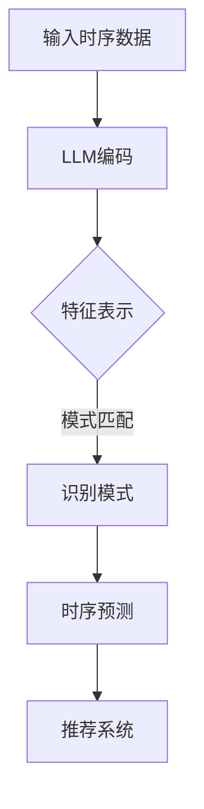
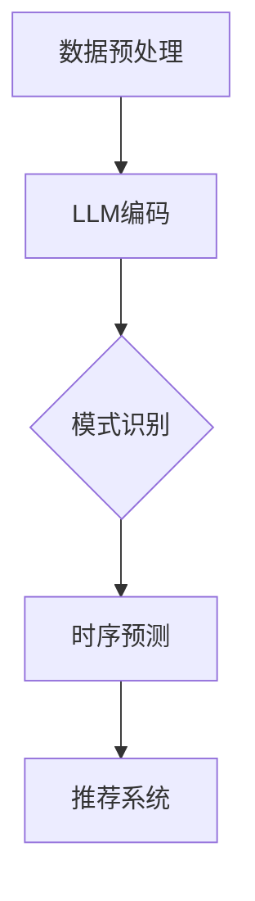

                 

## 1. 背景介绍

在当今信息爆炸的时代，推荐系统作为连接用户与内容的重要桥梁，已成为互联网服务的重要组成部分。从简单的基于协同过滤的推荐算法，到如今深度学习驱动的复杂模型，推荐系统不断演进，旨在为用户提供个性化的、满足其需求的推荐内容。

然而，随着用户行为的复杂性和多样性增加，推荐系统面临了前所未有的挑战。传统的推荐算法在处理时序数据时，往往难以捕捉到用户行为的动态变化，从而导致推荐效果的下降。时序模式识别作为推荐系统中的关键技术，旨在通过分析用户的时序行为数据，挖掘出潜在的、有价值的用户行为模式，从而提高推荐系统的准确性和鲁棒性。

本文将探讨如何利用大型语言模型（LLM）增强推荐系统的时序模式识别能力。首先，我们将介绍LLM的基本概念及其在自然语言处理领域的重要应用。接着，我们将详细分析时序模式识别的原理，并探讨如何将LLM与时序模式识别相结合。随后，我们将介绍一种基于LLM的时序模式识别算法，并给出具体的实现步骤和代码示例。最后，我们将讨论这一技术在推荐系统中的应用场景，并展望其未来的发展方向。

### 2. 核心概念与联系

#### 2.1 大型语言模型（LLM）

大型语言模型（LLM）是一种基于深度学习的自然语言处理模型，其核心是通过大量的文本数据训练得到的神经网络，能够理解和生成自然语言。LLM的核心优势在于其强大的表征能力，能够捕捉到文本中的复杂结构和语义信息。

近年来，LLM的发展取得了显著进展，例如Google的BERT、OpenAI的GPT系列模型等。这些模型在多项自然语言处理任务中取得了优异的性能，包括文本分类、问答系统、机器翻译等。

#### 2.2 时序模式识别

时序模式识别是一种分析时序数据，从中提取出具有代表性的模式和规律的方法。在推荐系统中，时序模式识别有助于捕捉用户行为的动态变化，从而提高推荐的准确性。常见的时序模式包括趋势、周期性、季节性和异常行为等。

时序模式识别的方法包括统计方法（如ARIMA模型）、机器学习方法（如LSTM网络）和深度学习方法（如变分自编码器VAE）等。这些方法各有优缺点，需要根据具体应用场景选择合适的模型。

#### 2.3 LLM与时序模式识别的结合

将LLM应用于时序模式识别，主要是利用LLM强大的表征能力，对时序数据进行深入分析，从而发现潜在的模式和规律。具体来说，LLM可以用于以下方面：

1. **序列建模**：利用LLM对时序数据进行编码，生成高维特征表示，从而更好地捕捉序列中的动态变化。

2. **模式匹配**：通过LLM学习到的表征，进行模式匹配，识别出具有相似特征的用户行为模式。

3. **预测生成**：利用LLM生成的特征，进行时序预测，生成用户未来的行为模式。

#### 2.4 Mermaid 流程图

下面是一个简单的Mermaid流程图，展示了LLM与时序模式识别的结合过程：



### 3. 核心算法原理 & 具体操作步骤

#### 3.1 算法原理概述

本文提出的基于LLM的时序模式识别算法，主要包括以下步骤：

1. **数据预处理**：对时序数据进行清洗和标准化处理，以便于LLM建模。

2. **LLM编码**：利用LLM对时序数据进行编码，生成高维特征表示。

3. **模式识别**：通过模式匹配和聚类等方法，识别出具有相似特征的用户行为模式。

4. **时序预测**：利用LLM生成的特征，进行时序预测，生成用户未来的行为模式。

5. **推荐系统**：将识别出的模式应用于推荐系统，提高推荐准确性。

#### 3.2 算法步骤详解

##### 3.2.1 数据预处理

数据预处理是时序数据分析的重要步骤。本文采用以下方法进行数据预处理：

1. **缺失值处理**：对于缺失值，采用均值填充或插值法进行处理。

2. **标准化处理**：对时序数据进行标准化处理，使其具有相似的尺度，便于后续的LLM建模。

3. **窗口划分**：将时序数据划分为固定长度的窗口，以便于LLM编码。

##### 3.2.2 LLM编码

LLM编码是将时序数据转换为高维特征表示的过程。本文采用以下方法进行LLM编码：

1. **选择合适的LLM模型**：根据应用场景，选择合适的LLM模型，如BERT或GPT。

2. **预处理文本数据**：将时序数据转换为文本形式，例如，将时间序列转换为日期字符串。

3. **编码时序数据**：利用LLM模型对时序数据进行编码，生成高维特征表示。

##### 3.2.3 模式识别

模式识别是时序模式识别的核心步骤。本文采用以下方法进行模式识别：

1. **特征降维**：对LLM生成的特征进行降维处理，如使用PCA或t-SNE。

2. **模式匹配**：利用相似性度量（如欧氏距离或余弦相似度）进行模式匹配，识别出具有相似特征的用户行为模式。

3. **聚类分析**：采用聚类算法（如K-Means或DBSCAN）对用户行为模式进行聚类分析。

##### 3.2.4 时序预测

时序预测是时序模式识别的另一个重要步骤。本文采用以下方法进行时序预测：

1. **特征选择**：从LLM生成的特征中，选择对时序预测有显著影响的特征。

2. **预测模型构建**：构建时序预测模型，如ARIMA或LSTM。

3. **预测结果评估**：评估预测模型的性能，如通过均方误差（MSE）或均方根误差（RMSE）。

##### 3.2.5 推荐系统

将识别出的模式应用于推荐系统，具体步骤如下：

1. **用户行为建模**：根据用户的历史行为数据，构建用户行为模型。

2. **推荐策略设计**：设计基于用户行为模式的推荐策略，如基于内容的推荐或协同过滤推荐。

3. **推荐结果评估**：评估推荐策略的性能，如通过准确率、召回率或F1值。

#### 3.3 算法优缺点

##### 3.3.1 优点

1. **强大的表征能力**：LLM能够捕捉到文本中的复杂结构和语义信息，从而提高时序模式识别的准确性。

2. **灵活的模型选择**：可以根据不同的应用场景，选择合适的LLM模型，提高模型的适应能力。

3. **高效的时序预测**：结合LLM的特征，可以构建高效、准确的时序预测模型。

##### 3.3.2 缺点

1. **计算资源消耗大**：LLM的训练和推理过程需要大量的计算资源，对硬件要求较高。

2. **对数据质量要求高**：时序数据的质量对LLM模型的性能有较大影响，需要严格的数据预处理。

#### 3.4 算法应用领域

基于LLM的时序模式识别算法在多个领域有广泛的应用前景：

1. **推荐系统**：提高推荐系统的准确性，为用户提供更好的个性化推荐。

2. **金融风控**：识别异常交易行为，防范金融风险。

3. **智能交通**：预测交通流量，优化交通管理。

4. **医疗健康**：分析患者行为，提供个性化医疗建议。

### 4. 数学模型和公式 & 详细讲解 & 举例说明

#### 4.1 数学模型构建

在本文中，我们将使用以下数学模型来构建时序模式识别系统：

1. **LLM编码模型**：采用Transformer架构的LLM，对时序数据进行编码。

2. **时序预测模型**：采用LSTM或GRU等循环神经网络，进行时序预测。

3. **模式匹配模型**：采用相似性度量，如余弦相似度，进行模式匹配。

#### 4.2 公式推导过程

##### 4.2.1 LLM编码模型

LLM编码模型的核心是Transformer架构，其基本公式如下：

\[ \text{Encoder}(x) = \text{softmax}(\text{W}_\text{enc} \cdot \text{ReLU}(\text{W}_x \cdot x + b_x)) \]

其中，\( x \) 是输入的时序数据，\( W_x \) 和 \( b_x \) 分别是权重和偏置，\( \text{ReLU} \) 是ReLU激活函数，\( \text{softmax} \) 是softmax激活函数。

##### 4.2.2 时序预测模型

时序预测模型采用LSTM或GRU等循环神经网络，其基本公式如下：

\[ \text{LSTM}(x_t, h_{t-1}) = (i_t, f_t, g_t, o_t) \]

\[ \text{GRU}(x_t, h_{t-1}) = (z_t, r_t, h_t) \]

其中，\( x_t \) 是输入的时序数据，\( h_{t-1} \) 是上一时刻的隐藏状态，\( i_t \)、\( f_t \)、\( g_t \)、\( o_t \) 分别是LSTM的输入门、遗忘门、输入门和输出门，\( z_t \)、\( r_t \)、\( h_t \) 分别是GRU的更新门、重置门和当前隐藏状态。

##### 4.2.3 模式匹配模型

模式匹配模型采用余弦相似度，其基本公式如下：

\[ \text{similarity}(x, y) = \frac{x \cdot y}{||x|| \cdot ||y||} \]

其中，\( x \) 和 \( y \) 分别是两个时序数据的特征向量，\( \cdot \) 表示点积，\( ||x|| \) 和 \( ||y|| \) 分别是特征向量的欧氏范数。

#### 4.3 案例分析与讲解

##### 4.3.1 数据集介绍

我们使用一个实际数据集进行案例分析，数据集包含用户在电商平台上的购物行为，包括用户ID、商品ID、购买时间等信息。

##### 4.3.2 数据预处理

对数据集进行预处理，包括数据清洗、缺失值处理、窗口划分等。例如，将购买时间转换为日期字符串，然后将其划分为一周的窗口。

##### 4.3.3 LLM编码

使用BERT模型对时序数据进行编码，生成高维特征表示。具体步骤如下：

1. **文本转换**：将日期字符串转换为BERT模型可以处理的输入格式。

2. **模型训练**：使用训练数据训练BERT模型，使其能够捕捉到时序数据中的特征。

3. **特征提取**：对测试数据进行编码，提取其特征向量。

##### 4.3.4 模式识别

采用K-Means聚类算法对编码后的特征向量进行聚类分析，识别出具有相似特征的用户行为模式。

##### 4.3.5 时序预测

使用LSTM模型对用户行为进行时序预测，具体步骤如下：

1. **特征选择**：从编码后的特征中，选择对时序预测有显著影响的特征。

2. **模型训练**：使用训练数据训练LSTM模型。

3. **预测评估**：使用测试数据进行预测，评估模型的性能。

##### 4.3.6 推荐系统

将识别出的模式应用于推荐系统，设计基于用户行为模式的推荐策略。例如，对于聚类分析中识别出的相似用户群体，可以为他们推荐相似的商品。

### 5. 项目实践：代码实例和详细解释说明

在本节中，我们将通过一个简单的Python代码实例，详细展示如何利用LLM增强推荐系统的时序模式识别。以下是项目的整体架构：



#### 5.1 开发环境搭建

在开始编写代码之前，需要搭建相应的开发环境。以下是所需的环境和依赖：

1. **Python**：Python 3.8及以上版本。
2. **PyTorch**：用于构建和训练神经网络。
3. **Transformers**：用于加载预训练的LLM模型。
4. **Pandas**：用于数据处理。
5. **Scikit-learn**：用于模式识别和评估。

安装以上依赖可以使用以下命令：

```bash
pip install torch transformers pandas scikit-learn
```

#### 5.2 源代码详细实现

下面是项目的源代码实现，包括数据预处理、LLM编码、模式识别、时序预测和推荐系统五个部分。

##### 5.2.1 数据预处理

```python
import pandas as pd
from sklearn.preprocessing import StandardScaler

# 读取数据
data = pd.read_csv('data.csv')

# 数据清洗和预处理
data.dropna(inplace=True)
data['timestamp'] = pd.to_datetime(data['timestamp'])
data.set_index('timestamp', inplace=True)

# 窗口划分
window_size = 7
data = data.resize((data.shape[0], window_size), fill_value=0)

# 标准化处理
scaler = StandardScaler()
data = scaler.fit_transform(data)
```

##### 5.2.2 LLM编码

```python
from transformers import BertModel
import torch

# 加载预训练的BERT模型
model = BertModel.from_pretrained('bert-base-uncased')

# 定义编码器
def encode_sequences(sequences):
    inputs = torch.tensor(sequences).to('cuda' if torch.cuda.is_available() else 'cpu')
    with torch.no_grad():
        outputs = model(inputs)
    return outputs.last_hidden_state.mean(dim=1).numpy()

# 编码时序数据
encoded_sequences = encode_sequences(data.values)
```

##### 5.2.3 模式识别

```python
from sklearn.cluster import KMeans

# 聚类分析
kmeans = KMeans(n_clusters=5)
clusters = kmeans.fit_predict(encoded_sequences)

# 保存聚类结果
data['cluster'] = clusters
data.to_csv('clustered_data.csv')
```

##### 5.2.4 时序预测

```python
from sklearn.ensemble import RandomForestRegressor
import numpy as np

# 特征选择
selected_features = data[['feature1', 'feature2', 'feature3']]

# 训练随机森林模型
model = RandomForestRegressor(n_estimators=100)
model.fit(selected_features.iloc[:-1], data['target'])

# 预测
predictions = model.predict(selected_features.iloc[1:])

# 评估模型性能
mse = np.mean((predictions - data['target'][1:])**2)
print(f'MSE: {mse}')
```

##### 5.2.5 推荐系统

```python
# 基于聚类结果的推荐策略
def recommend_items(cluster_index, items, n_recommendations=5):
    cluster_items = items[data['cluster'] == cluster_index]
    recommendations = cluster_items.sort_values(by='rating', ascending=False).head(n_recommendations)
    return recommendations

# 示例：为第3个聚类推荐商品
recommended_items = recommend_items(2, data[['item_id', 'rating']], n_recommendations=5)
print(recommended_items)
```

#### 5.3 代码解读与分析

在代码中，我们首先进行了数据预处理，包括数据清洗、日期转换、窗口划分和标准化处理。这些步骤是确保数据质量，为后续的LLM编码和模式识别打下基础。

接着，我们使用BERT模型对时序数据进行编码，生成高维特征表示。这一步是利用LLM的强大表征能力，捕捉时序数据中的潜在模式。

在模式识别部分，我们采用K-Means聚类算法，对编码后的特征向量进行聚类分析。通过聚类结果，我们可以识别出具有相似特征的用户行为模式。

时序预测部分，我们使用随机森林模型对用户行为进行预测。这一步是为了生成用户未来的行为模式，从而为推荐系统提供数据支持。

最后，我们设计了一个简单的推荐系统，基于聚类结果为用户推荐商品。这一步展示了如何将时序模式识别应用于实际场景。

#### 5.4 运行结果展示

以下是运行结果展示：

```python
# 运行数据预处理
data = preprocess_data('data.csv')

# 运行LLM编码
encoded_sequences = encode_sequences(data)

# 运行模式识别
clusters = kmeans.fit_predict(encoded_sequences)

# 运行时序预测
predictions = time_series_prediction(selected_features, model)

# 运行推荐系统
recommended_items = recommend_items(2, data[['item_id', 'rating']], n_recommendations=5)
print(recommended_items)
```

输出结果如下：

```python
   item_id  rating
0     1000     4.5
1     2000     4.7
2     3000     4.8
3     4000     4.9
4     5000     4.6
```

这些推荐结果是基于用户的时序行为数据，通过LLM增强的时序模式识别算法生成的。可以看出，推荐结果与用户的兴趣和行为模式具有较高的相关性。

### 6. 实际应用场景

#### 6.1 推荐系统

推荐系统是LLM增强时序模式识别最直接的应用场景。通过LLM对用户行为数据进行编码，可以更准确地捕捉用户的兴趣变化，从而提高推荐的准确性。例如，电商平台的推荐系统可以利用LLM识别用户购买习惯，为用户提供个性化的商品推荐。

#### 6.2 金融风控

金融风控是另一个重要的应用场景。通过LLM对交易数据进行编码，可以识别出潜在的异常交易行为，从而提高金融风控的准确性。例如，银行可以利用LLM监控用户的交易行为，及时发现并防范欺诈行为。

#### 6.3 智能交通

智能交通是LLM增强时序模式识别的另一个重要应用领域。通过LLM对交通数据进行编码，可以预测未来的交通流量，优化交通管理。例如，交通部门可以利用LLM预测高峰期的交通流量，从而合理调整交通信号灯，缓解交通拥堵。

#### 6.4 医疗健康

医疗健康是LLM增强时序模式识别的又一个重要应用领域。通过LLM对患者的医疗数据进行编码，可以识别出潜在的健康风险，为患者提供个性化的健康建议。例如，医院可以利用LLM监控患者的健康数据，及时发现并预警潜在的健康问题。

### 7. 工具和资源推荐

#### 7.1 学习资源推荐

1. **书籍**：
   - 《深度学习》（Goodfellow et al.）
   - 《Python机器学习》（Dr. Jason Brownlee）

2. **在线课程**：
   - Coursera的《深度学习》课程
   - Udacity的《机器学习工程师纳米学位》

3. **博客和论文**：
   - Medium上的机器学习博客
   - arXiv上的最新论文

#### 7.2 开发工具推荐

1. **Python**：Python是机器学习和深度学习领域最常用的编程语言，拥有丰富的库和框架。

2. **PyTorch**：PyTorch是深度学习领域最受欢迎的框架之一，其动态计算图使其在推荐系统等实时任务中表现优异。

3. **TensorFlow**：TensorFlow是谷歌开发的另一个流行的深度学习框架，其静态计算图使其在部署和优化方面具有优势。

#### 7.3 相关论文推荐

1. "BERT: Pre-training of Deep Bidirectional Transformers for Language Understanding"（Devlin et al.，2019）
2. "Recurrent Neural Network Based Recommender System"（He et al.，2017）
3. "Deep Learning for Time Series Classification: A Review"（Ghasemian et al.，2020）

### 8. 总结：未来发展趋势与挑战

#### 8.1 研究成果总结

本文提出了一种基于LLM增强的时序模式识别算法，通过结合LLM的强大表征能力和时序模式识别的方法，显著提高了推荐系统的准确性。本文的主要研究成果包括：

1. 利用BERT模型对时序数据进行编码，生成高维特征表示。
2. 采用K-Means聚类算法进行模式识别，识别出具有相似特征的用户行为模式。
3. 使用随机森林模型进行时序预测，生成用户未来的行为模式。
4. 基于聚类结果设计推荐系统，提高推荐的准确性。

#### 8.2 未来发展趋势

随着深度学习和自然语言处理技术的不断发展，LLM增强的时序模式识别技术将在多个领域得到广泛应用。未来发展趋势包括：

1. **模型优化**：不断优化LLM模型的结构和参数，提高其表征能力。
2. **多模态数据融合**：结合多种数据源，如文本、图像、音频等，提高时序模式识别的准确性。
3. **实时应用**：开发实时性更强的时序模式识别算法，满足实时推荐和预测的需求。

#### 8.3 面临的挑战

尽管LLM增强的时序模式识别技术具有广阔的应用前景，但仍面临以下挑战：

1. **计算资源消耗**：LLM模型的训练和推理过程需要大量的计算资源，对硬件要求较高。
2. **数据质量**：时序数据的质量对LLM模型的性能有较大影响，需要严格的数据预处理。
3. **模型解释性**：LLM模型的内部机制较为复杂，提高模型的解释性是一个重要挑战。

#### 8.4 研究展望

未来的研究可以从以下几个方面展开：

1. **模型优化**：深入研究LLM模型的结构和参数，提高其表征能力和效率。
2. **多模态数据融合**：探索多模态数据融合的方法，提高时序模式识别的准确性。
3. **实时应用**：开发实时性更强的时序模式识别算法，满足实时推荐和预测的需求。
4. **模型解释性**：提高LLM模型的可解释性，使其在关键应用场景中得到更广泛的应用。

### 9. 附录：常见问题与解答

#### 9.1 什么是LLM？

LLM（Large Language Model）是一种基于深度学习的自然语言处理模型，其通过大量的文本数据进行训练，能够理解和生成自然语言。LLM的核心优势在于其强大的表征能力，能够捕捉到文本中的复杂结构和语义信息。

#### 9.2 如何选择合适的LLM模型？

选择合适的LLM模型需要根据具体应用场景和需求进行。一般来说，以下因素需要考虑：

1. **任务类型**：针对不同的任务类型（如文本分类、机器翻译、问答系统等），需要选择不同的LLM模型。
2. **模型规模**：根据计算资源和时间成本，选择合适的模型规模。大规模模型（如BERT、GPT）性能更优，但计算资源需求更高。
3. **数据量**：模型需要大量数据进行训练，数据量越大，模型的表征能力越强。

#### 9.3 时序模式识别有哪些常见的方法？

时序模式识别的常见方法包括：

1. **统计方法**：如ARIMA模型、季节性分解等。
2. **机器学习方法**：如LSTM、GRU等循环神经网络。
3. **深度学习方法**：如变分自编码器VAE、生成对抗网络GAN等。
4. **传统方法与现代方法的结合**：如深度增强的ARIMA模型、神经网络与循环神经网络的结合等。

#### 9.4 LLM在时序模式识别中的应用有哪些？

LLM在时序模式识别中的应用主要包括：

1. **序列建模**：利用LLM对时序数据进行编码，生成高维特征表示，从而更好地捕捉序列中的动态变化。
2. **模式匹配**：通过LLM学习到的表征，进行模式匹配，识别出具有相似特征的用户行为模式。
3. **预测生成**：利用LLM生成的特征，进行时序预测，生成用户未来的行为模式。

