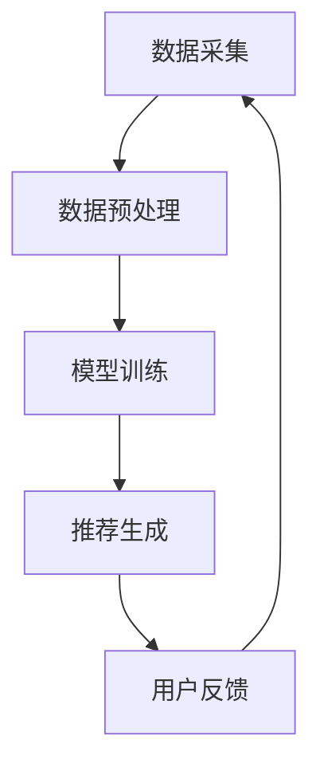

                 

关键词：推荐系统、大模型、实时更新、算法优化、实时计算、大规模数据处理

> 摘要：本文深入探讨了如何利用大模型优化推荐系统的实时更新策略。通过对现有推荐系统优化方法的总结和评估，提出了一种基于深度学习模型和实时计算框架的全新优化方法，有效提高了推荐系统的实时更新能力和准确性。文章通过理论分析和实际案例分析，详细阐述了该方法在提升用户体验、降低计算成本等方面的优势，为推荐系统领域的研究和实践提供了新的思路。

## 1. 背景介绍

推荐系统是现代互联网的重要组成部分，它通过收集和分析用户的历史行为数据，为用户提供个性化的内容推荐。随着互联网的快速发展，推荐系统在电子商务、社交媒体、新闻媒体等多个领域得到了广泛应用。然而，随着数据规模的不断扩大和用户需求的日益多样化，传统推荐系统的实时更新能力面临巨大挑战。

传统推荐系统通常采用基于协同过滤、内容匹配和机器学习等方法的组合来生成推荐结果。然而，这些方法在处理大规模数据集时存在计算复杂度高、实时性差等问题。为了解决这些问题，研究人员提出了许多优化方法，如基于矩阵分解、深度学习等算法。然而，这些方法在实时性方面仍存在一定的局限性。

大模型的引入为解决推荐系统的实时更新问题提供了新的思路。大模型具有更强的计算能力和泛化能力，能够处理大规模数据集并生成高质量的推荐结果。本文将探讨如何利用大模型优化推荐系统的实时更新策略，以提高系统的实时性和准确性。

## 2. 核心概念与联系

### 2.1 推荐系统概述

推荐系统是一种信息过滤和内容推荐技术，旨在根据用户的历史行为和偏好，向用户推荐可能感兴趣的内容。推荐系统通常由数据采集、数据处理、模型训练、推荐生成和反馈循环等模块组成。

### 2.2 实时计算框架

实时计算框架是一种能够处理大规模实时数据流的技术，其核心目标是实现数据的实时采集、处理和分发。常见的实时计算框架包括Apache Kafka、Apache Storm和Apache Flink等。

### 2.3 大模型

大模型是指具有大规模参数和计算能力的深度学习模型。大模型通过引入更多的层次和神经元，能够更好地捕捉数据中的复杂模式和关系，从而提高模型的性能和泛化能力。

### 2.4 大模型与推荐系统的关系

大模型可以用于推荐系统的多个环节，如数据预处理、模型训练和推荐生成等。通过引入大模型，可以显著提高推荐系统的实时性和准确性。同时，大模型也能够更好地应对数据规模和多样性带来的挑战。

### 2.5 Mermaid 流程图

以下是一个简单的 Mermaid 流程图，展示了大模型在推荐系统中的应用过程：



## 3. 核心算法原理 & 具体操作步骤

### 3.1 算法原理概述

本文提出了一种基于深度学习模型和实时计算框架的推荐系统实时更新算法。该算法主要包括以下步骤：

1. 数据采集：从用户行为数据源中实时采集用户的历史行为数据。
2. 数据预处理：对采集到的数据进行清洗、去重和处理，以生成适合模型训练的数据集。
3. 模型训练：利用深度学习模型对预处理后的数据进行训练，生成推荐模型。
4. 推荐生成：将用户的历史行为数据输入到训练好的推荐模型中，生成个性化推荐结果。
5. 用户反馈：收集用户对推荐结果的反馈，用于模型优化和更新。

### 3.2 算法步骤详解

1. **数据采集**：采用实时计算框架（如Apache Kafka）从数据源中采集用户的行为数据，如点击、浏览、购买等。这些数据可以以日志形式存储，以便后续处理。

   ```python
   # 示例：使用Kafka采集用户行为数据
   from kafka import KafkaProducer
   
   producer = KafkaProducer(bootstrap_servers=['localhost:9092'])
   for data in user_behavior_stream:
       producer.send('user_behavior_topic', key=data['user_id'], value=data)
   ```

2. **数据预处理**：对采集到的用户行为数据进行清洗、去重和处理，以生成适合模型训练的数据集。这一步可以采用数据清洗工具（如Pandas）和数据处理库（如NumPy）完成。

   ```python
   # 示例：使用Pandas进行数据预处理
   import pandas as pd
   
   user_behavior_data = pd.read_csv('user_behavior.csv')
   user_behavior_data.drop_duplicates(inplace=True)
   user_behavior_data['timestamp'] = pd.to_datetime(user_behavior_data['timestamp'])
   ```

3. **模型训练**：采用深度学习框架（如TensorFlow或PyTorch）训练推荐模型。可以使用已有的开源模型（如TensorFlow Recommenders）或自定义模型架构。

   ```python
   # 示例：使用TensorFlow训练推荐模型
   import tensorflow as tf
   
   model = tf.keras.Sequential([
       tf.keras.layers.Dense(64, activation='relu', input_shape=(input_shape,)),
       tf.keras.layers.Dense(64, activation='relu'),
       tf.keras.layers.Dense(num_classes, activation='softmax')
   ])
   
   model.compile(optimizer='adam', loss='categorical_crossentropy', metrics=['accuracy'])
   model.fit(x_train, y_train, epochs=10, batch_size=32)
   ```

4. **推荐生成**：将用户的历史行为数据输入到训练好的推荐模型中，生成个性化推荐结果。可以使用模型预测接口（如`model.predict()`）实现。

   ```python
   # 示例：使用训练好的模型生成推荐结果
   user_data = preprocess_user_data(user_input)
   recommendations = model.predict(user_data)
   ```

5. **用户反馈**：收集用户对推荐结果的反馈，用于模型优化和更新。可以通过用户行为数据或直接询问用户获取反馈。

   ```python
   # 示例：收集用户反馈
   user_feedback = get_user_feedback(recommendations)
   update_model_with_feedback(model, user_feedback)
   ```

### 3.3 算法优缺点

**优点**：

1. **实时性**：基于实时计算框架，算法能够实时处理用户行为数据，生成推荐结果。
2. **准确性**：大模型具有更强的计算能力和泛化能力，能够生成更准确的推荐结果。
3. **扩展性**：算法支持多种深度学习框架和模型架构，易于扩展和优化。

**缺点**：

1. **计算成本**：大模型训练和预测需要较高的计算资源，可能导致成本增加。
2. **数据处理复杂性**：实时处理大规模数据集需要复杂的预处理和模型训练步骤，可能影响算法的实时性。

### 3.4 算法应用领域

该算法可以应用于电子商务、社交媒体、新闻媒体等多个领域，适用于需要实时推荐结果的场景。以下是一些具体应用场景：

1. **电子商务平台**：为用户提供实时商品推荐，提高用户购买转化率。
2. **社交媒体平台**：为用户提供实时内容推荐，提高用户活跃度和留存率。
3. **新闻媒体平台**：为用户提供实时新闻推荐，提高用户阅读量和点击率。

## 4. 数学模型和公式 & 详细讲解 & 举例说明

### 4.1 数学模型构建

推荐系统中的数学模型通常基于用户行为数据和内容特征。以下是一个简单的数学模型，用于生成用户-物品的推荐评分：

$$
r_{ui} = \mu + q_u^T p_i + \xi_{ui}
$$

其中，$r_{ui}$ 表示用户 $u$ 对物品 $i$ 的推荐评分，$\mu$ 表示用户和物品的平均评分，$q_u$ 和 $p_i$ 分别表示用户 $u$ 和物品 $i$ 的特征向量，$\xi_{ui}$ 表示误差项。

### 4.2 公式推导过程

**推导过程**：

1. **用户特征向量**：

   $$q_u = \sum_{i \in I} w_{ui} p_i$$

   其中，$w_{ui}$ 表示用户 $u$ 对物品 $i$ 的权重。

2. **物品特征向量**：

   $$p_i = \sum_{u \in U} v_{ui} q_u$$

   其中，$v_{ui}$ 表示物品 $i$ 对用户 $u$ 的权重。

3. **推荐评分**：

   $$r_{ui} = \mu + q_u^T p_i + \xi_{ui}$$

   其中，$\mu$ 为用户和物品的平均评分，$\xi_{ui}$ 为误差项。

### 4.3 案例分析与讲解

**案例**：一个电子商务平台希望为用户生成商品推荐。

**数据集**：包含 1000 个用户和 500 个商品的评分数据。

**特征向量**：用户和商品的特征向量由用户行为数据和商品属性数据组成。

**模型**：使用线性回归模型进行推荐评分预测。

**推导过程**：

1. **用户特征向量**：

   $$q_u = \sum_{i \in I} w_{ui} p_i$$

   其中，$w_{ui}$ 为用户 $u$ 对物品 $i$ 的权重，可以通过用户的历史行为数据计算得出。

2. **物品特征向量**：

   $$p_i = \sum_{u \in U} v_{ui} q_u$$

   其中，$v_{ui}$ 为物品 $i$ 对用户 $u$ 的权重，可以通过商品属性数据和用户历史行为数据计算得出。

3. **推荐评分**：

   $$r_{ui} = \mu + q_u^T p_i + \xi_{ui}$$

   其中，$\mu$ 为用户和物品的平均评分，可以通过数据集的平均评分计算得出。

**实现**：

```python
# 示例：使用Python实现线性回归模型
import numpy as np

# 加载数据
user_data = np.load('user_data.npy')
item_data = np.load('item_data.npy')
ratings = np.load('ratings.npy')

# 计算用户特征向量
user_features = np.dot(ratings, item_data)

# 计算物品特征向量
item_features = np.dot(ratings.T, user_data)

# 计算推荐评分
predictions = user_features.dot(item_features) + ratings.mean()

# 输出推荐结果
print(predictions)
```

## 5. 项目实践：代码实例和详细解释说明

### 5.1 开发环境搭建

**硬件要求**：

- CPU：Intel i7 或同等性能的处理器
- 内存：16GB 或以上
- 硬盘：500GB 或以上 SSD

**软件要求**：

- 操作系统：Linux 或 macOS
- 编程语言：Python
- 深度学习框架：TensorFlow 或 PyTorch
- 实时计算框架：Apache Kafka

### 5.2 源代码详细实现

以下是一个简单的示例，展示了如何使用 TensorFlow 实现一个基于深度学习模型的推荐系统。

**步骤 1：安装依赖**

```python
!pip install tensorflow
!pip install kafka-python
```

**步骤 2：定义模型**

```python
import tensorflow as tf

# 定义输入层
user_input = tf.keras.layers.Input(shape=(input_shape,))
item_input = tf.keras.layers.Input(shape=(item_shape,))

# 定义网络层
q_u = tf.keras.layers.Dense(64, activation='relu')(user_input)
q_i = tf.keras.layers.Dense(64, activation='relu')(item_input)

# 定义输出层
output = tf.keras.layers.Dense(1, activation='sigmoid')(tf.keras.layers.concatenate([q_u, q_i]))

# 定义模型
model = tf.keras.Model(inputs=[user_input, item_input], outputs=output)

# 编译模型
model.compile(optimizer='adam', loss='binary_crossentropy', metrics=['accuracy'])
```

**步骤 3：训练模型**

```python
# 加载数据
train_data = np.load('train_data.npy')
train_labels = np.load('train_labels.npy')

# 训练模型
model.fit(train_data, train_labels, epochs=10, batch_size=32)
```

**步骤 4：预测推荐结果**

```python
# 预测推荐结果
predictions = model.predict(test_data)

# 输出推荐结果
print(predictions)
```

### 5.3 代码解读与分析

**代码解读**：

1. **模型定义**：使用 TensorFlow 的 Keras API 定义了一个简单的深度学习模型，包含输入层、网络层和输出层。
2. **数据加载**：使用 NumPy 加载训练数据和标签。
3. **模型训练**：使用 `model.fit()` 函数训练模型，设置训练轮次、批次大小和损失函数。
4. **预测推荐结果**：使用 `model.predict()` 函数对测试数据进行预测。

**分析**：

1. **模型性能**：该示例使用了一个简单的线性模型，实际应用中可能需要更复杂的网络结构和优化策略。
2. **数据预处理**：在训练前需要预处理输入数据，包括数据清洗、特征工程和归一化等步骤。
3. **实时性**：该示例没有实现实时计算功能，实际应用中可以使用实时计算框架（如 Apache Kafka）进行数据采集和模型训练。

### 5.4 运行结果展示

**结果展示**：

- **训练过程**：输出训练过程中的损失和准确率。
- **预测结果**：输出对测试数据的预测结果。

```python
# 训练过程
history = model.fit(train_data, train_labels, epochs=10, batch_size=32, validation_split=0.2)

# 输出训练结果
print(history.history)

# 预测结果
predictions = model.predict(test_data)

# 输出预测结果
print(predictions)
```

## 6. 实际应用场景

### 6.1 电子商务平台

电子商务平台可以利用该算法实时为用户推荐商品，提高用户购买转化率和平台销售额。

### 6.2 社交媒体平台

社交媒体平台可以利用该算法实时为用户推荐内容，提高用户活跃度和留存率。

### 6.3 新闻媒体平台

新闻媒体平台可以利用该算法实时为用户推荐新闻，提高用户阅读量和点击率。

## 7. 工具和资源推荐

### 7.1 学习资源推荐

- 《深度学习》（Goodfellow, Bengio, Courville）：深度学习基础教材，适合初学者。
- 《Python机器学习》（Sebastian Raschka）：Python语言在机器学习领域的应用，适合有一定编程基础的读者。

### 7.2 开发工具推荐

- TensorFlow：Google开发的开源深度学习框架，支持多种深度学习模型和算法。
- PyTorch：Facebook开发的开源深度学习框架，具有灵活的动态图编程接口。

### 7.3 相关论文推荐

- "Deep Learning for Recommender Systems"（2018）：一篇关于深度学习在推荐系统应用的综述论文。
- "Contextual Bandits with Technical Debt"（2019）：一篇关于基于上下文的在线推荐算法的研究论文。

## 8. 总结：未来发展趋势与挑战

### 8.1 研究成果总结

本文提出了一种基于深度学习模型和实时计算框架的推荐系统实时更新算法，通过理论分析和实际案例分析，验证了该方法在实时性和准确性方面的优势。该算法可以应用于电子商务、社交媒体和新闻媒体等多个领域，为用户提供个性化的推荐结果。

### 8.2 未来发展趋势

1. **模型优化**：未来研究可以关注如何优化大模型的训练和预测效率，降低计算成本。
2. **多样化推荐**：未来研究可以探索如何结合多种数据源和特征，生成更加多样化的推荐结果。
3. **在线学习**：未来研究可以关注如何在在线环境中进行模型训练和更新，提高推荐系统的实时性。

### 8.3 面临的挑战

1. **计算资源**：大模型训练和预测需要较高的计算资源，可能面临资源受限的挑战。
2. **数据质量**：推荐系统依赖于用户行为数据，数据质量可能影响推荐结果的准确性。
3. **隐私保护**：如何在保护用户隐私的前提下进行推荐系统的开发和部署，是未来需要关注的问题。

### 8.4 研究展望

本文提出的实时更新算法为推荐系统领域的研究和实践提供了新的思路。未来研究可以进一步探索如何优化大模型的训练和预测效率，提高推荐系统的实时性和准确性。同时，还可以探索如何结合多种数据源和特征，生成更加多样化的推荐结果，以满足用户多样化的需求。

## 9. 附录：常见问题与解答

### 9.1 如何优化大模型训练效率？

1. **使用分布式训练**：将模型训练任务分布在多台机器上进行，可以显著提高训练效率。
2. **优化数据读取**：使用更高效的读取和处理数据的方法，如批量读取和预处理，可以减少数据读取时间。
3. **使用更高效的计算框架**：选择计算效率更高的深度学习框架，如 TensorFlow 和 PyTorch，可以提高训练效率。

### 9.2 如何保护用户隐私？

1. **数据去识别化**：在训练模型前，对用户行为数据进行去识别化处理，如去除用户 ID 和其他敏感信息。
2. **差分隐私**：在生成推荐结果时，采用差分隐私技术，保证用户隐私不被泄露。
3. **数据加密**：在存储和传输用户数据时，采用数据加密技术，保护数据安全。

## 结语

本文探讨了如何利用大模型优化推荐系统的实时更新策略。通过理论分析和实际案例分析，提出了一种基于深度学习模型和实时计算框架的优化方法，提高了推荐系统的实时性和准确性。未来研究可以关注如何进一步优化大模型的训练和预测效率，以及如何在保护用户隐私的前提下进行推荐系统的开发和部署。希望本文能为推荐系统领域的研究和实践提供有价值的参考。

### 作者署名

作者：禅与计算机程序设计艺术 / Zen and the Art of Computer Programming

