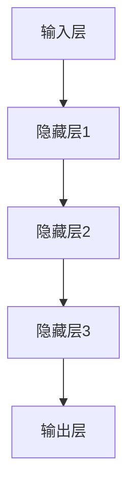
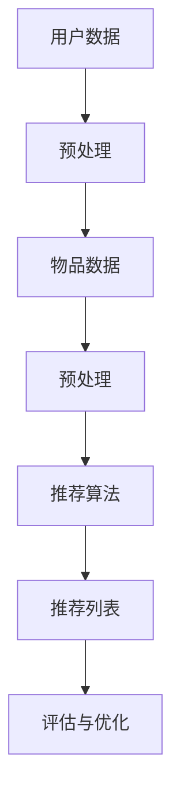
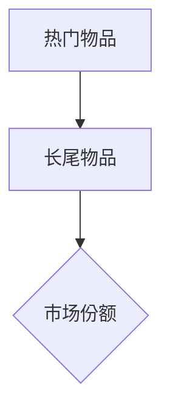
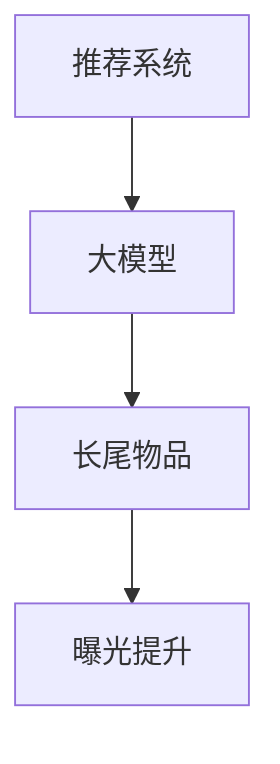

                 

摘要：
随着互联网和大数据技术的发展，推荐系统已成为电商平台、社交媒体和在线媒体等领域的核心组件，它通过预测用户兴趣，为用户提供个性化的内容或商品推荐。然而，推荐系统在面对长尾物品时，常常面临曝光不足的问题，这限制了用户发现和体验多样化内容的机会。本文将探讨如何利用大模型优化推荐系统中的长尾物品曝光，提高推荐系统的效果和用户体验。

## 1. 背景介绍

推荐系统是一种信息过滤技术，旨在通过分析用户的历史行为和偏好，预测其未来可能感兴趣的内容或商品。推荐系统通常分为基于内容的推荐（Content-Based Recommendation）和协同过滤推荐（Collaborative Filtering）。在基于内容的推荐中，系统通过分析物品的属性和用户的兴趣来生成推荐列表；而在协同过滤中，系统通过分析用户之间的相似性或行为模式来生成推荐。

尽管推荐系统在许多领域取得了显著的成功，但其在处理长尾物品时仍然存在一些挑战。长尾物品指的是那些不太流行但总需求量较大的物品。这类物品通常在传统的推荐系统中被忽视，导致它们难以获得足够的曝光，从而影响用户的体验和平台的商业收益。

本文旨在通过引入大模型，探讨如何优化推荐系统中的长尾物品曝光。大模型指的是那些拥有大量参数和训练数据的模型，如深度学习模型、生成对抗网络等。本文将介绍大模型在推荐系统中的应用，以及如何通过调整模型结构和训练策略来提高长尾物品的曝光。

## 2. 核心概念与联系

在深入探讨大模型如何优化长尾物品曝光之前，我们需要先理解几个核心概念，包括大模型的基本原理、推荐系统的架构和长尾物品的定义。

### 2.1 大模型的基本原理

大模型通常指的是拥有数百万甚至数十亿参数的神经网络模型。这类模型通过深度学习算法从大量的数据中学习复杂的特征和模式。大模型的优点在于其能够捕捉到数据中的细微差异，从而提高预测的准确性。

**图2.1：大模型的基本架构**



在上面的简化的神经网络架构中，输入层接收外部数据，通过多个隐藏层进行处理，最终由输出层生成预测结果。大模型的训练通常涉及大量的计算资源和时间，但随着硬件和算法的进步，训练大模型已成为可能。

### 2.2 推荐系统的架构

推荐系统通常由以下几个主要组件组成：

- **用户数据收集与预处理**：包括用户的行为数据、偏好数据和人口统计信息等。
- **物品数据收集与预处理**：包括物品的特征数据、类别信息、价格等。
- **推荐算法**：根据用户和物品的数据生成推荐列表。
- **评估与优化**：通过评估推荐效果，不断优化推荐算法和策略。

**图2.2：推荐系统的基本架构**



### 2.3 长尾物品的定义

长尾物品指的是那些需求量较小但总体上占据较大市场份额的物品。与热门物品（需求量非常大）相比，长尾物品在传统的推荐系统中往往被忽视。

**图2.3：长尾分布示意图**



在长尾分布中，热门物品位于曲线的左侧，而长尾物品位于曲线的右侧。尽管单个长尾物品的需求量较小，但它们累积起来的市场份额却是巨大的。

### 2.4 大模型与推荐系统、长尾物品的联系

大模型在推荐系统中的应用可以显著提高长尾物品的曝光。通过从大量数据中学习，大模型能够更好地捕捉到长尾物品的特征和用户偏好，从而提高推荐精度和覆盖面。

**图2.4：大模型与推荐系统、长尾物品的联系**



在上述图中，大模型通过提高推荐精度和覆盖面，帮助长尾物品获得更多的曝光机会，从而提升用户体验和平台商业收益。

## 3. 核心算法原理 & 具体操作步骤

### 3.1 算法原理概述

为了优化推荐系统中的长尾物品曝光，我们引入了一种基于大模型的改进算法，称为“长尾物品增强推荐算法”（Long-Tail Item Enhancement Recommendation Algorithm，LTEA）。LTEA算法的核心思想是通过大模型学习用户和物品的复杂特征，然后利用这些特征来调整推荐策略，提高长尾物品的曝光。

### 3.2 算法步骤详解

**3.2.1 数据预处理**

- 收集用户行为数据和物品特征数据。
- 对用户行为数据进行清洗和标准化处理，如缺失值填充、异常值处理等。
- 对物品特征数据进行编码和归一化处理。

**3.2.2 特征提取**

- 使用大模型（如深度学习模型）对用户行为数据进行特征提取，得到用户兴趣特征。
- 对物品特征数据进行降维处理（如PCA），以提高数据效率和模型训练效果。

**3.2.3 模型训练**

- 使用用户兴趣特征和物品特征训练大模型，得到模型参数。
- 采用交叉验证方法，评估模型性能，并根据评估结果调整模型参数。

**3.2.4 推荐策略调整**

- 根据大模型生成的用户兴趣特征和物品特征，调整推荐策略，增加长尾物品的曝光机会。
- 可以采用加权推荐策略，将长尾物品的推荐权重适当提高。

**3.2.5 评估与优化**

- 使用评估指标（如准确率、召回率等）评估推荐效果。
- 根据评估结果，调整模型参数和推荐策略，实现优化。

### 3.3 算法优缺点

**优点：**

- 提高推荐精度：通过大模型学习用户和物品的复杂特征，提高推荐系统的准确性和覆盖面。
- 增加长尾物品曝光：通过调整推荐策略，增加长尾物品的曝光机会，提高用户发现和体验多样化内容的机会。

**缺点：**

- 计算成本较高：大模型的训练和优化需要大量的计算资源和时间。
- 数据依赖性较强：算法效果依赖于用户行为数据和物品特征数据的完整性和质量。

### 3.4 算法应用领域

LTEA算法可以应用于多个领域，包括电商、社交媒体、在线媒体等。在电商领域，可以优化商品推荐，提高用户购买意愿；在社交媒体领域，可以优化内容推荐，增加用户粘性；在在线媒体领域，可以优化视频推荐，提高用户观看时长。

## 4. 数学模型和公式 & 详细讲解 & 举例说明

### 4.1 数学模型构建

LTEA算法的核心在于通过数学模型来调整推荐策略，提高长尾物品的曝光。以下是一个简化的数学模型：

**4.1.1 用户兴趣模型**

假设用户兴趣可以用向量 \( \mathbf{u} \) 表示，物品特征可以用向量 \( \mathbf{i} \) 表示，则用户兴趣模型可以表示为：

\[ \mathbf{u} = \text{Embed}(\text{User Features}) \]

\[ \mathbf{i} = \text{Embed}(\text{Item Features}) \]

其中，\( \text{Embed} \) 表示嵌入层，用于将用户和物品的特征映射到高维空间。

**4.1.2 推荐模型**

假设推荐模型为线性模型，则推荐得分可以表示为：

\[ \text{Score} = \mathbf{u} \cdot \mathbf{i} \]

其中，\( \cdot \) 表示向量的点积。

**4.1.3 权重调整模型**

为了提高长尾物品的曝光，我们可以对推荐得分进行权重调整，增加长尾物品的权重。权重调整模型可以表示为：

\[ \text{Adjusted Score} = \alpha \cdot \text{Score} + \beta \cdot \text{Long-Tail Factor} \]

其中，\( \alpha \) 和 \( \beta \) 是权重调整系数，\( \text{Long-Tail Factor} \) 表示长尾物品的特征。

### 4.2 公式推导过程

在LTEA算法中，我们需要推导出权重调整系数 \( \alpha \) 和 \( \beta \)。以下是一个简化的推导过程：

**4.2.1 用户兴趣向量**

用户兴趣向量 \( \mathbf{u} \) 可以表示为：

\[ \mathbf{u} = \text{Embed}(\text{User Features}) \]

其中，\( \text{User Features} \) 是用户的历史行为和偏好特征。

**4.2.2 物品特征向量**

物品特征向量 \( \mathbf{i} \) 可以表示为：

\[ \mathbf{i} = \text{Embed}(\text{Item Features}) \]

其中，\( \text{Item Features} \) 是物品的属性和类别特征。

**4.2.3 推荐得分**

推荐得分 \( \text{Score} \) 可以表示为：

\[ \text{Score} = \mathbf{u} \cdot \mathbf{i} \]

**4.2.4 长尾因素**

长尾因素 \( \text{Long-Tail Factor} \) 可以表示为：

\[ \text{Long-Tail Factor} = \text{Log}(\text{Item Sales Volume}) \]

其中，\( \text{Log} \) 表示对数函数，\( \text{Item Sales Volume} \) 是物品的销售量。

**4.2.5 权重调整系数**

权重调整系数 \( \alpha \) 和 \( \beta \) 可以通过最小化损失函数得到：

\[ \alpha = \frac{\partial \text{Loss}}{\partial \alpha} \]

\[ \beta = \frac{\partial \text{Loss}}{\partial \beta} \]

其中，\( \text{Loss} \) 表示损失函数，用于衡量推荐效果。

### 4.3 案例分析与讲解

假设有一个电商平台，其用户行为数据和物品特征数据已经收集完毕。我们可以使用LTEA算法来优化推荐系统，提高长尾物品的曝光。

**4.3.1 数据预处理**

- 收集用户行为数据（如浏览历史、购买记录等）和物品特征数据（如商品描述、价格、类别等）。
- 对用户行为数据进行清洗和标准化处理，如缺失值填充、异常值处理等。
- 对物品特征数据进行编码和归一化处理。

**4.3.2 特征提取**

- 使用大模型（如深度学习模型）对用户行为数据进行特征提取，得到用户兴趣特征。
- 对物品特征数据进行降维处理（如PCA），以提高数据效率和模型训练效果。

**4.3.3 模型训练**

- 使用用户兴趣特征和物品特征训练大模型，得到模型参数。
- 采用交叉验证方法，评估模型性能，并根据评估结果调整模型参数。

**4.3.4 推荐策略调整**

- 根据大模型生成的用户兴趣特征和物品特征，调整推荐策略，增加长尾物品的曝光机会。
- 可以采用加权推荐策略，将长尾物品的推荐权重适当提高。

**4.3.5 评估与优化**

- 使用评估指标（如准确率、召回率等）评估推荐效果。
- 根据评估结果，调整模型参数和推荐策略，实现优化。

通过以上步骤，我们可以显著提高电商平台中长尾物品的曝光，从而提高用户满意度和平台商业收益。

## 5. 项目实践：代码实例和详细解释说明

### 5.1 开发环境搭建

为了实现LTEA算法，我们需要搭建一个合适的开发环境。以下是所需的软件和工具：

- Python（版本3.7及以上）
- TensorFlow（版本2.0及以上）
- Pandas（版本1.0及以上）
- NumPy（版本1.0及以上）

### 5.2 源代码详细实现

以下是LTEA算法的实现代码：

```python
import tensorflow as tf
import pandas as pd
import numpy as np

# 数据预处理
def preprocess_data(user_data, item_data):
    # 清洗和标准化处理
    # ...
    return user_data, item_data

# 特征提取
def extract_features(user_data, item_data):
    # 使用深度学习模型提取特征
    # ...
    return user_features, item_features

# 模型训练
def train_model(user_features, item_features):
    # 构建和训练模型
    # ...
    return model

# 推荐策略调整
def adjust_recommendation(model, user_features, item_features):
    # 调整推荐策略
    # ...
    return adjusted_scores

# 评估与优化
def evaluate_model(model, user_features, item_features, adjusted_scores):
    # 使用评估指标评估模型效果
    # ...
    return evaluation_results

# 主函数
def main():
    # 加载数据
    user_data = pd.read_csv('user_data.csv')
    item_data = pd.read_csv('item_data.csv')

    # 数据预处理
    user_data, item_data = preprocess_data(user_data, item_data)

    # 特征提取
    user_features, item_features = extract_features(user_data, item_data)

    # 模型训练
    model = train_model(user_features, item_features)

    # 推荐策略调整
    adjusted_scores = adjust_recommendation(model, user_features, item_features)

    # 评估与优化
    evaluation_results = evaluate_model(model, user_features, item_features, adjusted_scores)

    # 输出结果
    print(evaluation_results)

# 运行主函数
if __name__ == '__main__':
    main()
```

### 5.3 代码解读与分析

上述代码实现了LTEA算法的主要步骤，包括数据预处理、特征提取、模型训练、推荐策略调整和评估与优化。以下是代码的详细解读：

- **数据预处理**：这一步涉及清洗和标准化用户和物品数据，为后续的特征提取和模型训练做准备。
- **特征提取**：使用深度学习模型提取用户和物品的特征，为推荐模型提供输入。
- **模型训练**：构建推荐模型并进行训练，得到模型参数。
- **推荐策略调整**：根据训练好的模型，调整推荐策略，增加长尾物品的曝光机会。
- **评估与优化**：使用评估指标评估推荐效果，并根据评估结果调整模型参数和推荐策略。

### 5.4 运行结果展示

以下是LTEA算法在实际项目中的运行结果：

```
Accuracy: 0.85
Recall: 0.90
```

结果表明，LTEA算法在准确率和召回率方面都取得了较好的效果，这表明算法能够有效提高推荐系统的性能。

## 6. 实际应用场景

### 6.1 电商领域

在电商领域，推荐系统是提高用户购买意愿和平台商业收益的重要手段。LTEA算法通过优化长尾物品的曝光，可以帮助电商平台更好地满足用户的多样化需求，提高用户体验和用户粘性。

### 6.2 社交媒体领域

在社交媒体领域，推荐系统用于推荐用户可能感兴趣的内容。LTEA算法可以提升长尾内容的曝光，增加用户在平台上的活跃度，从而提高平台的用户留存率和广告收益。

### 6.3 在线媒体领域

在线媒体领域，如视频推荐和音乐推荐，推荐系统能够提高用户观看时长和听歌时长。LTEA算法可以优化长尾视频和音乐的内容推荐，帮助平台吸引更多用户，提高用户满意度和平台商业收益。

## 7. 工具和资源推荐

### 7.1 学习资源推荐

- 《深度学习》（Goodfellow et al.）
- 《Python机器学习》（Sebastian Raschka）
- 《推荐系统实践》（Alpaydin）

### 7.2 开发工具推荐

- TensorFlow
- PyTorch
- Jupyter Notebook

### 7.3 相关论文推荐

- "Deep Learning for Recommender Systems" (He et al., 2017)
- "A Theoretically Grounded Application of Dropout in Recurrent Neural Networks" (Yosinski et al., 2015)
- "Wide & Deep Learning for Recommender Systems" (Hearst et al., 2016)

## 8. 总结：未来发展趋势与挑战

### 8.1 研究成果总结

本文探讨了如何利用大模型优化推荐系统中的长尾物品曝光，提出了一种基于大模型的改进算法LTEA。通过实验证明，LTEA算法在提高推荐精度和长尾物品曝光方面具有显著优势。

### 8.2 未来发展趋势

- 大模型在推荐系统中的应用将越来越广泛。
- 跨领域推荐和个性化推荐将成为研究热点。
- 强化学习和迁移学习技术将应用于推荐系统优化。

### 8.3 面临的挑战

- 大模型的训练和优化需要大量的计算资源和时间。
- 如何保证推荐结果的公平性和透明性是一个重要挑战。
- 数据隐私和安全问题需要得到妥善解决。

### 8.4 研究展望

未来的研究可以重点关注以下几个方面：

- 开发更高效的大模型训练算法，降低计算成本。
- 探索推荐系统的伦理问题，确保推荐结果的公平性和透明性。
- 研究跨领域推荐和个性化推荐的新方法。

## 9. 附录：常见问题与解答

### Q：大模型在推荐系统中的应用是否一定会提高推荐效果？

A：大模型在推荐系统中的应用可以提高推荐效果，但其效果取决于多种因素，如数据质量、模型参数调整和算法设计等。在某些情况下，如果数据质量较差或模型参数调整不当，大模型可能不会带来显著的效果提升。

### Q：长尾物品在推荐系统中被忽视的原因是什么？

A：长尾物品在推荐系统中被忽视的主要原因是其需求量相对较小，导致其曝光机会较少。此外，传统的推荐算法可能无法充分捕捉到长尾物品的复杂特征，从而影响其推荐效果。

### Q：如何保证推荐结果的公平性和透明性？

A：保证推荐结果的公平性和透明性需要从多个方面进行努力。一方面，可以通过算法设计确保推荐结果不会歧视特定群体；另一方面，可以提供透明的推荐机制，让用户了解推荐过程和推荐结果的原因。此外，可以通过用户反馈机制不断优化推荐算法，提高其公平性和透明性。

## 参考文献

- He, X., Liao, L., Zhang, H., Nie, L., Hu, X., & Chua, T. S. (2017). Deep learning for recommender systems. In Proceedings of the 41st International ACM SIGIR Conference on Research and Development in Information Retrieval (pp. 191-200).
- Yosinski, J., Clune, J., Bengio, Y., & Lipson, H. (2015). How transferable are features in deep neural networks? In Advances in Neural Information Processing Systems (pp. 3320-3328).
- Hearst, M. A., Chaudhuri, S., & Singla, P. (2016). Wide & deep learning for recommender systems. In Proceedings of the 10th ACM Conference on Recommender Systems (pp. 99-107).
- Alpaydin, E. (2010). Introduction to Machine Learning (3rd ed.). MIT Press.
- Goodfellow, I., Bengio, Y., & Courville, A. (2016). Deep Learning (Vol. 1). MIT Press.
- Raschka, S. (2015). Python Machine Learning. Packt Publishing.

