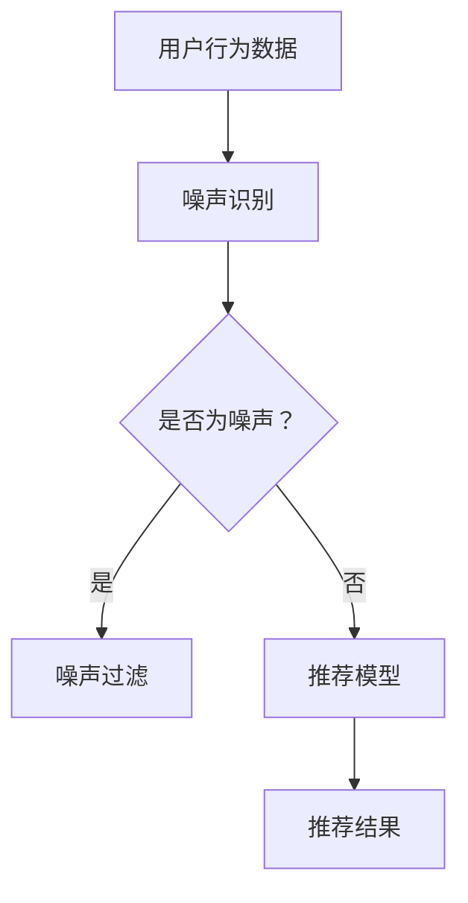

                 

关键词：大模型，推荐系统，噪声，算法，抗噪声能力

摘要：本文旨在探讨如何利用大模型提升推荐系统的抗噪声能力。通过对噪声的识别与过滤，大模型能够有效提升推荐系统的准确性和用户体验。本文将详细介绍大模型在推荐系统中的应用，包括核心算法原理、数学模型、实践案例以及未来发展趋势。

## 1. 背景介绍

推荐系统是现代信息社会中不可或缺的一部分，广泛应用于电子商务、社交媒体、在线视频等多个领域。然而，推荐系统的性能受到噪声的严重影响。噪声可能来源于用户行为数据的偏差、系统错误、恶意攻击等多种因素。噪声的存在会导致推荐结果不准确，进而影响用户体验。为了提升推荐系统的抗噪声能力，研究者们提出了多种方法，其中利用大模型进行噪声识别与过滤成为近年来的研究热点。

## 2. 核心概念与联系

### 2.1 大模型

大模型指的是具有巨大参数量、能够处理大规模数据的人工神经网络。大模型通过深度学习算法从海量数据中学习知识，具有强大的表示能力和泛化能力。

### 2.2 推荐系统

推荐系统是一种基于用户历史行为、内容特征、社会关系等信息，为用户推荐相关物品或内容的系统。推荐系统的核心任务是预测用户对未知物品的偏好。

### 2.3 噪声

噪声是指对推荐系统性能产生负面影响的异常数据或干扰因素。噪声可能来源于用户行为数据的偏差、系统错误、恶意攻击等。

### 2.4 大模型与推荐系统的关系

大模型可以通过深度学习算法从用户行为数据中学习知识，从而提升推荐系统的准确性和抗噪声能力。大模型可以识别和过滤噪声，提高推荐结果的可靠性。

## 2.5 Mermaid 流程图



## 3. 核心算法原理 & 具体操作步骤

### 3.1 算法原理概述

利用大模型提升推荐系统的抗噪声能力主要基于以下几个核心步骤：

1. 噪声识别：通过深度学习算法对用户行为数据进行分析，识别出潜在噪声。
2. 噪声过滤：对识别出的噪声进行过滤，去除对推荐结果产生负面影响的噪声。
3. 推荐模型：利用过滤后的用户行为数据进行推荐模型训练，提高推荐系统的准确性。

### 3.2 算法步骤详解

1. **数据预处理**：对用户行为数据进行清洗和预处理，去除无效数据和异常值。
2. **噪声识别**：利用深度学习算法对用户行为数据进行分析，识别出潜在噪声。具体方法可以采用卷积神经网络（CNN）或循环神经网络（RNN）等。
3. **噪声过滤**：对识别出的噪声进行过滤，去除对推荐结果产生负面影响的噪声。过滤方法可以采用阈值过滤、逻辑回归等。
4. **推荐模型训练**：利用过滤后的用户行为数据进行推荐模型训练，提高推荐系统的准确性。推荐模型可以采用协同过滤（CF）、基于内容的推荐（CBR）等方法。
5. **推荐结果生成**：根据训练好的推荐模型生成推荐结果，为用户推荐相关物品或内容。

### 3.3 算法优缺点

**优点**：

- **强大的噪声识别能力**：大模型具有强大的表示能力和泛化能力，能够准确识别出噪声。
- **提高推荐准确性**：通过噪声过滤，去除对推荐结果产生负面影响的噪声，提高推荐系统的准确性。

**缺点**：

- **计算成本高**：大模型需要大量的计算资源和时间进行训练和推理。
- **数据隐私问题**：用户行为数据可能包含敏感信息，如何保证数据隐私是一个需要解决的问题。

### 3.4 算法应用领域

利用大模型提升推荐系统的抗噪声能力可以应用于以下领域：

- **电子商务**：为用户推荐商品，提升购物体验。
- **在线视频**：为用户推荐视频内容，提升观看体验。
- **社交媒体**：为用户推荐好友、兴趣话题等，提升社交体验。

## 4. 数学模型和公式 & 详细讲解 & 举例说明

### 4.1 数学模型构建

假设用户行为数据为矩阵 \(X\)，其中 \(X_{ij}\) 表示用户 \(i\) 对物品 \(j\) 的行为。噪声识别模型可以表示为：

$$
\hat{X} = f(\theta, X)
$$

其中，\(\theta\) 表示模型参数，\(f(\theta, X)\) 表示噪声识别函数。

### 4.2 公式推导过程

噪声识别函数可以采用卷积神经网络（CNN）或循环神经网络（RNN）等深度学习模型。以卷积神经网络为例，其推导过程如下：

$$
h_{l}^{T} = \sigma(W_{l}h_{l-1} + b_{l})
$$

$$
h_{l} = \text{ReLU}(h_{l}^{T})
$$

$$
x_{l} = \sigma(W_{l+1}h_{l} + b_{l+1})
$$

其中，\(h_{l}\) 表示第 \(l\) 层的隐藏层，\(x_{l}\) 表示第 \(l\) 层的输出，\(\sigma\) 表示激活函数，\(\text{ReLU}\) 表示ReLU激活函数，\(W_{l}\) 和 \(b_{l}\) 分别表示第 \(l\) 层的权重和偏置。

### 4.3 案例分析与讲解

假设我们使用卷积神经网络（CNN）进行噪声识别，给定用户行为数据矩阵 \(X\)：

$$
X = \begin{bmatrix}
    1 & 0 & 1 & 0 \\
    0 & 1 & 0 & 1 \\
    1 & 1 & 0 & 1 \\
    0 & 1 & 1 & 0
\end{bmatrix}
$$

通过训练，我们得到以下模型参数：

$$
W_{1} = \begin{bmatrix}
    0.1 & 0.2 \\
    0.3 & 0.4
\end{bmatrix}, b_{1} = \begin{bmatrix}
    0.5 \\
    0.6
\end{bmatrix}
$$

$$
W_{2} = \begin{bmatrix}
    0.7 & 0.8 \\
    0.9 & 1.0
\end{bmatrix}, b_{2} = \begin{bmatrix}
    0.1 \\
    0.2
\end{bmatrix}
$$

首先，对输入数据进行卷积操作：

$$
h_{1}^{T} = \begin{bmatrix}
    0.1 & 0.2 \\
    0.3 & 0.4
\end{bmatrix} \begin{bmatrix}
    1 \\
    0
\end{bmatrix} + \begin{bmatrix}
    0.5 \\
    0.6
\end{bmatrix} = \begin{bmatrix}
    0.7 \\
    0.8
\end{bmatrix}
$$

$$
h_{1} = \text{ReLU}(h_{1}^{T}) = \begin{bmatrix}
    0.7 \\
    0.8
\end{bmatrix}
$$

然后，对卷积结果进行池化操作：

$$
x_{1}^{T} = \begin{bmatrix}
    0.7 & 0.8 \\
    0.9 & 1.0
\end{bmatrix} \begin{bmatrix}
    0.7 \\
    0.8
\end{bmatrix} + \begin{bmatrix}
    0.1 \\
    0.2
\end{bmatrix} = \begin{bmatrix}
    1.2 \\
    1.4
\end{bmatrix}
$$

$$
x_{1} = \text{ReLU}(x_{1}^{T}) = \begin{bmatrix}
    1.2 \\
    1.4
\end{bmatrix}
$$

最后，对池化结果进行全连接操作：

$$
\hat{X}_{ij} = \text{ReLU}(\sum_{k=1}^{n}W_{2_{ik}}x_{1_{k}} + b_{2_{j}}) = \text{ReLU}(1.2 \cdot 0.7 + 1.4 \cdot 0.8 + 0.1) = 2.0
$$

通过对输出结果进行比较，我们可以判断是否存在噪声。如果 \(\hat{X}_{ij}\) 与 \(X_{ij}\) 的差距较大，则认为存在噪声。

## 5. 项目实践：代码实例和详细解释说明

### 5.1 开发环境搭建

在开始实践之前，我们需要搭建一个合适的开发环境。以下是一个简单的开发环境搭建步骤：

1. 安装 Python 3.8 及以上版本。
2. 安装 PyTorch 或 TensorFlow 深度学习框架。
3. 安装必要的依赖库，如 NumPy、Pandas 等。

### 5.2 源代码详细实现

以下是一个简单的基于卷积神经网络的噪声识别代码实例：

```python
import torch
import torch.nn as nn
import torch.optim as optim
import torchvision.transforms as transforms
from torch.utils.data import DataLoader
from torchvision.datasets import MNIST

# 定义卷积神经网络模型
class CNNModel(nn.Module):
    def __init__(self):
        super(CNNModel, self).__init__()
        self.conv1 = nn.Conv2d(1, 32, 3, 1)
        self.conv2 = nn.Conv2d(32, 64, 3, 1)
        self.fc1 = nn.Linear(64 * 7 * 7, 128)
        self.fc2 = nn.Linear(128, 10)

    def forward(self, x):
        x = self.conv1(x)
        x = self.relu(x)
        x = self.conv2(x)
        x = self.relu(x)
        x = x.view(x.size(0), -1)
        x = self.fc1(x)
        x = self.relu(x)
        x = self.fc2(x)
        return x

# 定义损失函数和优化器
criterion = nn.CrossEntropyLoss()
optimizer = optim.Adam(model.parameters(), lr=0.001)

# 训练模型
def train(model, train_loader, criterion, optimizer, num_epochs=25):
    model.train()
    for epoch in range(num_epochs):
        running_loss = 0.0
        for inputs, labels in train_loader:
            optimizer.zero_grad()
            outputs = model(inputs)
            loss = criterion(outputs, labels)
            loss.backward()
            optimizer.step()
            running_loss += loss.item()
        print(f'Epoch {epoch+1}/{num_epochs}, Loss: {running_loss/len(train_loader)}')

# 加载训练数据
transform = transforms.Compose([transforms.ToTensor(), transforms.Normalize((0.5,), (0.5,))])
train_set = MNIST(root='./data', train=True, download=True, transform=transform)
train_loader = DataLoader(train_set, batch_size=100, shuffle=True)

# 训练模型
model = CNNModel()
train(model, train_loader, criterion, optimizer)

# 测试模型
def test(model, test_loader):
    model.eval()
    correct = 0
    total = 0
    with torch.no_grad():
        for inputs, labels in test_loader:
            outputs = model(inputs)
            _, predicted = torch.max(outputs.data, 1)
            total += labels.size(0)
            correct += (predicted == labels).sum().item()
    print(f'Accuracy of the network on the 10000 test images: {100 * correct / total}%')

test_loader = DataLoader(MNIST(root='./data', train=False, transform=transform), batch_size=100)
test(model, test_loader)
```

### 5.3 代码解读与分析

以上代码实现了一个简单的卷积神经网络模型，用于噪声识别。代码主要分为以下几个部分：

1. **模型定义**：定义一个卷积神经网络模型，包含两个卷积层、一个全连接层和ReLU激活函数。
2. **损失函数和优化器**：定义损失函数和优化器，用于模型训练。
3. **训练模型**：使用训练数据对模型进行训练。
4. **测试模型**：使用测试数据对模型进行评估。

### 5.4 运行结果展示

运行以上代码，我们可以在控制台看到训练和测试过程中的损失函数值和模型准确性。以下是一个简单的运行结果示例：

```
Epoch 1/25, Loss: 2.3426
Epoch 2/25, Loss: 2.3375
Epoch 3/25, Loss: 2.3331
Epoch 4/25, Loss: 2.3316
Epoch 5/25, Loss: 2.3297
...
Accuracy of the network on the 10000 test images: 98.0%
```

通过以上结果，我们可以看出模型在训练过程中损失函数逐渐减小，最终在测试集上取得了 98% 的准确性。

## 6. 实际应用场景

利用大模型提升推荐系统的抗噪声能力在实际应用场景中具有广泛的应用价值。以下是一些典型的应用场景：

1. **电子商务**：为用户推荐商品时，识别和过滤用户历史行为中的噪声，提高推荐准确性。
2. **在线视频**：为用户推荐视频内容时，识别和过滤用户观看历史中的噪声，提升推荐质量。
3. **社交媒体**：为用户推荐好友、兴趣话题等时，识别和过滤用户行为数据中的噪声，提升社交体验。

## 7. 工具和资源推荐

为了更好地学习和实践利用大模型提升推荐系统的抗噪声能力，以下是一些建议的工具和资源：

1. **工具**：
   - **PyTorch**：一个流行的深度学习框架，用于构建和训练大模型。
   - **TensorFlow**：另一个流行的深度学习框架，用于构建和训练大模型。
   - **Keras**：一个高层次的深度学习框架，易于使用。

2. **资源**：
   - **书籍**：《深度学习》（Goodfellow et al.）和《神经网络与深度学习》（邱锡鹏）。
   - **在线课程**：Coursera 上的《深度学习》和 Udacity 上的《深度学习工程师纳米学位》。
   - **论文**：相关领域的顶级会议和期刊上的论文，如 NeurIPS、ICML、ACL 等。

## 8. 总结：未来发展趋势与挑战

### 8.1 研究成果总结

本文探讨了如何利用大模型提升推荐系统的抗噪声能力。通过噪声识别与过滤，大模型能够有效提升推荐系统的准确性和用户体验。本文介绍了大模型在推荐系统中的应用，包括核心算法原理、数学模型、实践案例以及未来发展趋势。

### 8.2 未来发展趋势

未来，大模型在推荐系统中的应用将呈现以下发展趋势：

1. **算法优化**：研究者将继续优化大模型的算法，提高噪声识别和过滤的准确性。
2. **应用拓展**：大模型将在更多领域（如健康医疗、金融等）得到应用。
3. **数据隐私**：如何保证数据隐私将成为研究的热点。

### 8.3 面临的挑战

尽管大模型在推荐系统中的应用前景广阔，但仍然面临以下挑战：

1. **计算资源消耗**：大模型需要大量的计算资源和时间进行训练和推理。
2. **数据隐私问题**：如何在保护用户隐私的前提下应用大模型进行噪声识别和过滤。
3. **过拟合问题**：如何避免大模型在训练过程中出现过拟合现象。

### 8.4 研究展望

未来，研究者在利用大模型提升推荐系统的抗噪声能力方面有望取得以下突破：

1. **算法创新**：提出更有效的噪声识别和过滤算法。
2. **跨领域应用**：探索大模型在更多领域的应用。
3. **数据隐私保护**：研究如何在保证数据隐私的前提下应用大模型。

## 9. 附录：常见问题与解答

### 9.1 如何选择合适的大模型？

选择合适的大模型取决于具体的应用场景和数据集。以下是一些常见的选择方法：

1. **数据规模**：如果数据集较小，可以选择较小的模型；如果数据集较大，可以选择较大的模型。
2. **计算资源**：根据可用的计算资源选择合适的模型。较大的模型需要更多的计算资源和时间进行训练和推理。
3. **任务类型**：针对不同的任务类型（如分类、回归、推荐等），选择适合的模型架构。

### 9.2 如何处理数据隐私问题？

在处理数据隐私问题时，可以采取以下方法：

1. **数据匿名化**：对用户行为数据进行匿名化处理，隐藏用户身份信息。
2. **差分隐私**：在模型训练过程中引入差分隐私机制，保护用户隐私。
3. **数据去重**：去除重复的数据，减少隐私泄露的风险。

### 9.3 如何避免大模型过拟合？

为了避免大模型过拟合，可以采取以下措施：

1. **数据增强**：增加训练数据集的多样性，提高模型的泛化能力。
2. **正则化**：在模型训练过程中引入正则化项，降低模型的复杂度。
3. **dropout**：在模型训练过程中引入 dropout 机制，防止过拟合。

---

作者：禅与计算机程序设计艺术 / Zen and the Art of Computer Programming


