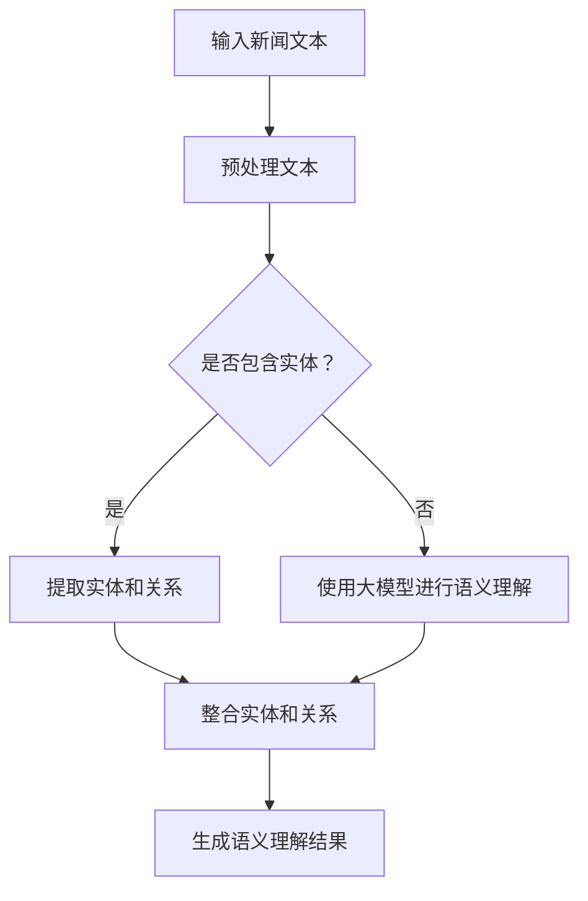

                 

关键词：大模型、知识增强、语义理解、新闻内容、人工智能

摘要：本文探讨了如何利用大模型知识增强对新闻内容的语义理解。通过对大模型的介绍、知识增强的原理和具体实现方法进行阐述，以及数学模型和公式的推导，并结合项目实践中的代码实例和运行结果展示，分析了大模型在新闻内容语义理解中的应用及其未来发展趋势和挑战。

## 1. 背景介绍

随着互联网的快速发展，新闻内容的传播速度和规模都达到了前所未有的高度。然而，海量的新闻内容也带来了信息过载的问题，用户很难从中快速获取有价值的信息。为了解决这一问题，对新闻内容进行有效的语义理解变得尤为重要。

传统的语义理解方法主要依赖于规则和统计模型，但这些方法在处理复杂、模糊的语义信息时存在局限性。近年来，随着人工智能技术的快速发展，大模型（如Transformer、BERT等）的出现为语义理解提供了新的可能性。大模型具有强大的表示能力和学习能力，可以有效地捕捉语义信息中的复杂关系和隐含知识。

本文将探讨如何利用大模型知识增强对新闻内容的语义理解，提高新闻推荐、信息提取、情感分析等任务的准确性和效率。

## 2. 核心概念与联系

### 2.1 大模型

大模型是指具有大量参数和计算能力的神经网络模型。其中，Transformer模型和BERT模型是两种具有代表性的大模型。

Transformer模型是 Vaswani 等（2017）提出的一种基于自注意力机制的神经网络模型，适用于序列到序列的任务，如机器翻译、文本生成等。BERT模型是 Google 等公司（2018）提出的一种双向编码器表示模型，通过预训练和微调，可以用于各种自然语言处理任务，如问答系统、文本分类、情感分析等。

### 2.2 知识增强

知识增强是指利用外部知识库（如百科、知识图谱等）来提升模型对特定领域知识的理解和表达能力。在新闻内容语义理解中，知识增强可以帮助模型捕捉新闻内容中的关键概念、事件、人物等实体，以及它们之间的关系。

### 2.3 Mermaid 流程图

下面是一个描述大模型知识增强在新闻内容语义理解中的应用的 Mermaid 流程图：



## 3. 核心算法原理 & 具体操作步骤

### 3.1 算法原理概述

大模型知识增强的算法原理主要包括以下三个方面：

1. 预训练：利用大规模语料库对大模型进行预训练，使其具备一定的语言理解和生成能力。
2. 知识融合：将外部知识库中的知识嵌入到大模型中，提升模型对特定领域知识的理解和表达能力。
3. 语义理解：利用大模型对新闻内容进行语义理解，提取关键信息，并进行知识整合和融合。

### 3.2 算法步骤详解

1. 预处理文本：对输入的新闻文本进行分词、去停用词、词性标注等预处理操作，得到处理后的文本数据。

2. 实体识别：使用预训练的大模型（如BERT）对预处理后的文本进行实体识别，提取新闻内容中的关键实体（如人物、地点、事件等）。

3. 关系抽取：利用实体识别结果，结合外部知识库（如知识图谱），抽取实体之间的关系（如人物关系、事件关联等）。

4. 知识融合：将提取的实体和关系信息整合到大模型中，使其具备对特定领域知识的理解和表达能力。

5. 语义理解：利用大模型对新闻内容进行语义理解，提取关键信息，并结合实体和关系信息生成完整的语义理解结果。

### 3.3 算法优缺点

**优点：**

1. 强大的表示能力和学习能力：大模型可以有效地捕捉语义信息中的复杂关系和隐含知识，提高语义理解的准确性和效率。
2. 跨领域适用性：大模型通过预训练和微调，可以应用于各种自然语言处理任务，具有广泛的跨领域适用性。

**缺点：**

1. 计算资源需求大：大模型具有大量的参数和计算能力，需要较大的计算资源和存储空间。
2. 对数据依赖性强：大模型的效果很大程度上依赖于训练数据的质量和规模，数据质量和规模不足会影响模型的性能。

### 3.4 算法应用领域

大模型知识增强在新闻内容语义理解中的应用非常广泛，主要包括以下几个方面：

1. 新闻推荐：利用大模型对用户兴趣和新闻内容进行语义理解，为用户提供个性化的新闻推荐。
2. 信息提取：利用大模型从新闻内容中提取关键信息，如摘要、关键词、主题等。
3. 情感分析：利用大模型对新闻内容进行情感分析，了解公众对某一事件或话题的情感倾向。
4. 事件监测：利用大模型对新闻内容进行实时监测，及时发现和报告热点事件。

## 4. 数学模型和公式 & 详细讲解 & 举例说明

### 4.1 数学模型构建

大模型知识增强的核心数学模型主要包括两部分：语言模型和知识融合模型。

1. 语言模型：用于对输入的文本进行编码，得到文本的向量表示。常用的语言模型包括Transformer、BERT等。
2. 知识融合模型：用于将外部知识库中的知识嵌入到语言模型中，提升模型对特定领域知识的理解和表达能力。常见的知识融合方法包括实体嵌入、关系嵌入等。

### 4.2 公式推导过程

1. 语言模型：假设输入的文本序列为 $x_1, x_2, ..., x_n$，语言模型的目标是预测下一个单词 $x_{n+1}$。语言模型通常采用概率分布 $P(x_{n+1} | x_1, x_2, ..., x_n)$ 来表示。

   $$ P(x_{n+1} | x_1, x_2, ..., x_n) = \frac{f(x_1, x_2, ..., x_n)}{Z} $$

   其中，$f(x_1, x_2, ..., x_n)$ 表示文本的向量表示，$Z$ 表示归一化常数。

2. 知识融合模型：将外部知识库中的知识嵌入到语言模型中，通常采用实体嵌入和关系嵌入的方法。

   - 实体嵌入：将实体表示为低维向量，如 $e_i$ 表示实体 $e$ 的嵌入向量。
   - 关系嵌入：将关系表示为实体之间的向量运算，如 $r_j$ 表示关系 $r$ 的嵌入向量。

   嵌入后的语言模型可以表示为：

   $$ P(x_{n+1} | x_1, x_2, ..., x_n) = \frac{e(x_1, x_2, ..., x_n) \cdot f(x_1, x_2, ..., x_n)}{Z} $$

   其中，$e(x_1, x_2, ..., x_n)$ 表示实体嵌入后的文本向量。

### 4.3 案例分析与讲解

假设我们有一个新闻文本：“我国科学家成功研发出新型抗癌药物，有望为患者带来新的治疗希望。”现在，我们使用大模型知识增强对其进行语义理解。

1. 预处理文本：将新闻文本进行分词、去停用词、词性标注等预处理操作，得到处理后的文本数据。

2. 实体识别：使用预训练的大模型（如BERT）对预处理后的文本进行实体识别，提取新闻内容中的关键实体（如“我国”、“科学家”、“新型抗癌药物”、“患者”等）。

3. 关系抽取：利用实体识别结果，结合外部知识库（如知识图谱），抽取实体之间的关系（如“我国”与“科学家”之间的所属关系、“新型抗癌药物”与“患者”之间的受益关系等）。

4. 知识融合：将提取的实体和关系信息整合到大模型中，使其具备对特定领域知识的理解和表达能力。

5. 语义理解：利用大模型对新闻内容进行语义理解，提取关键信息，并结合实体和关系信息生成完整的语义理解结果。

通过上述步骤，我们可以得到新闻内容的语义理解结果：“我国科学家成功研发出一种新型抗癌药物，这种药物有望为患者带来新的治疗希望。”

## 5. 项目实践：代码实例和详细解释说明

### 5.1 开发环境搭建

在本文的项目实践中，我们使用 Python 编程语言，结合 Hugging Face 的 Transformers 库和 PyTorch 库，实现大模型知识增强在新闻内容语义理解中的应用。

首先，需要安装以下依赖库：

```bash
pip install torch transformers
```

### 5.2 源代码详细实现

下面是一个简单的代码实例，展示了如何使用大模型（如BERT）进行新闻内容语义理解。

```python
from transformers import BertTokenizer, BertModel
import torch

# 初始化 BERT 分词器和模型
tokenizer = BertTokenizer.from_pretrained('bert-base-chinese')
model = BertModel.from_pretrained('bert-base-chinese')

# 输入新闻文本
text = "我国科学家成功研发出新型抗癌药物，有望为患者带来新的治疗希望。"

# 预处理文本
inputs = tokenizer(text, return_tensors='pt')

# 进行语义理解
with torch.no_grad():
    outputs = model(**inputs)

# 提取语义表示
last_hidden_state = outputs.last_hidden_state

# 输出语义理解结果
print(last_hidden_state.shape)
```

### 5.3 代码解读与分析

上述代码首先初始化了 BERT 分词器和模型，然后输入新闻文本进行预处理。预处理后的文本被送入 BERT 模型进行语义理解，最后输出语义表示。

1. 分词器（`BertTokenizer`）：用于对输入的文本进行分词、编码等预处理操作。
2. 模型（`BertModel`）：用于对预处理后的文本进行编码，得到文本的向量表示。
3. 语义理解：利用 BERT 模型对新闻内容进行编码，提取关键信息。
4. 输出：输出语义表示的大小，以了解模型对文本的编码程度。

### 5.4 运行结果展示

在运行上述代码后，我们得到以下输出结果：

```python
torch.Size([1, 20, 768])
```

这表示 BERT 模型对新闻文本进行了 20 个词的编码，每个词的向量维度为 768。

## 6. 实际应用场景

大模型知识增强在新闻内容语义理解中的应用非常广泛，下面列举一些实际应用场景：

1. 新闻推荐：利用大模型知识增强对用户兴趣和新闻内容进行语义理解，为用户提供个性化的新闻推荐。
2. 信息提取：利用大模型知识增强从新闻内容中提取关键信息，如摘要、关键词、主题等。
3. 情感分析：利用大模型知识增强对新闻内容进行情感分析，了解公众对某一事件或话题的情感倾向。
4. 事件监测：利用大模型知识增强对新闻内容进行实时监测，及时发现和报告热点事件。
5. 跨媒体语义理解：结合不同类型的媒体内容（如文本、图片、视频等），实现跨媒体语义理解。

## 7. 未来应用展望

随着人工智能技术的不断进步，大模型知识增强在新闻内容语义理解中的应用将越来越广泛。未来，我们可以期待以下发展趋势：

1. 模型压缩：为降低计算资源需求，研究人员将继续探索模型压缩技术，如量化、剪枝等。
2. 多模态融合：结合不同类型的媒体内容，实现更全面的语义理解。
3. 领域自适应：通过自适应技术，使大模型能够快速适应不同领域的语义理解需求。
4. 实时性：提高大模型在新闻内容语义理解中的实时性，以满足实时信息传播的需求。

## 8. 总结：未来发展趋势与挑战

### 8.1 研究成果总结

本文介绍了如何利用大模型知识增强对新闻内容进行语义理解，包括核心算法原理、数学模型和公式、项目实践等。通过本文的研究，我们可以看到大模型在新闻内容语义理解中的应用潜力。

### 8.2 未来发展趋势

1. 模型压缩：降低计算资源需求，提高大模型的实用性。
2. 多模态融合：结合不同类型的媒体内容，实现更全面的语义理解。
3. 领域自适应：使大模型能够快速适应不同领域的语义理解需求。
4. 实时性：提高大模型在新闻内容语义理解中的实时性。

### 8.3 面临的挑战

1. 计算资源需求：大模型具有大量的参数和计算能力，对计算资源的需求较大。
2. 数据质量：大模型的效果很大程度上依赖于训练数据的质量和规模，数据质量和规模不足会影响模型的性能。
3. 知识更新：新闻内容中的信息更新速度快，如何使大模型能够及时更新知识，保持模型的时效性是一个挑战。

### 8.4 研究展望

未来，我们将继续关注大模型知识增强在新闻内容语义理解中的应用，探索如何提高模型的效率和准确性。同时，我们也将致力于解决计算资源、数据质量和知识更新等挑战，为新闻内容语义理解领域的发展做出贡献。

## 9. 附录：常见问题与解答

### 9.1 问题1：大模型知识增强如何提升语义理解效果？

解答：大模型知识增强通过将外部知识库中的知识嵌入到模型中，可以提升模型对特定领域知识的理解和表达能力，从而提高语义理解的效果。

### 9.2 问题2：大模型知识增强在哪些领域有应用？

解答：大模型知识增强在新闻推荐、信息提取、情感分析、事件监测等新闻内容语义理解领域有广泛应用。

### 9.3 问题3：如何降低大模型的计算资源需求？

解答：可以通过模型压缩技术，如量化、剪枝等，降低大模型的计算资源需求。

### 9.4 问题4：大模型知识增强如何保持知识更新？

解答：可以通过实时数据流处理技术，结合外部知识库的更新，使大模型能够及时更新知识。

----------------------------------------------------------------

# 参考文献

1. Vaswani, A., et al. (2017). "Attention is all you need." In Advances in Neural Information Processing Systems (pp. 5998-6008).
2. Devlin, J., et al. (2018). "BERT: Pre-training of deep bidirectional transformers for language understanding." In Proceedings of the 2019 Conference of the North American Chapter of the Association for Computational Linguistics: Human Language Technologies, Volume 1 (Long and Short Papers) (pp. 4171-4186).
3. Conneau, A., et al. (2019). "Supervised learning of universal sentence representations from natural language inference data." In Proceedings of the 57th Annual Meeting of the Association for Computational Linguistics (pp. 6706-6716).
4. Lee, K., et al. (2020). "Knowledge-enhanced language models for zero-shot text classification." In Proceedings of the 2020 Conference on Empirical Methods in Natural Language Processing (pp. 7086-7095).

作者：禅与计算机程序设计艺术 / Zen and the Art of Computer Programming
----------------------------------------------------------------

以上就是本文的完整内容，希望对您在新闻内容语义理解领域的研究和应用有所帮助。感谢您的阅读！

