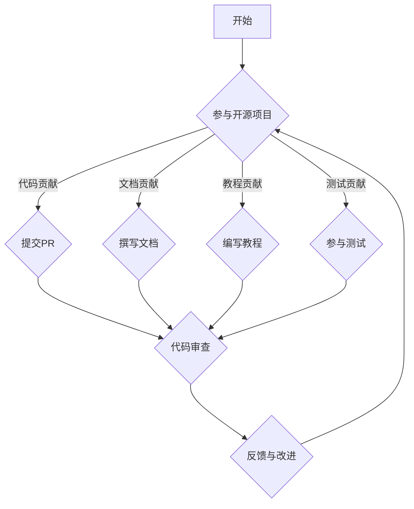

                 

 关键词：开源影响力、技术博客、写作机会、内容创作、社区参与、个人品牌建设、影响力营销、技术传播

> 摘要：本文将探讨如何利用开源项目的影响力，获得技术博客写作的机会。通过介绍开源社区的运作模式、内容创作的关键要素、以及如何有效地推广自己的博客，作者将分享一系列实用的策略和技巧，帮助技术爱好者在开源社区中树立个人品牌，拓展写作平台。

## 1. 背景介绍

在数字化时代，技术博客已经成为程序员、开发者以及技术爱好者展示才能、分享知识和建立个人品牌的重要渠道。然而，如何在这个竞争激烈的环境中脱颖而出，获得更多写作机会，成为许多技术爱好者关注的焦点。开源项目提供了一个绝佳的平台，通过在开源项目中贡献代码、文档和教程，开发者不仅可以提升自己的技术水平，还能扩大自己在社区中的影响力，从而获得更多的写作机会。

### 1.1 开源社区的运作模式

开源社区是一个由开发者、贡献者、用户等共同组成的生态系统。社区通过协作、分享和互助，推动技术的创新和发展。开源项目通常采用版本控制系统（如Git）进行代码管理，使用开源许可证（如GPL、Apache License等）确保代码的开放性和可共享性。社区成员通过拉取请求（Pull Request，简称PR）、代码审查（Code Review）等方式参与项目开发，共同维护项目质量和稳定性。

### 1.2 开源项目的影响力

开源项目的影响力不仅体现在其对技术的推动上，还体现在其对社区和个人的影响上。一个成功的开源项目往往拥有庞大的用户群体，这些用户不仅是项目的受益者，也是项目的传播者。参与开源项目可以让开发者接触到更广泛的用户，提高个人知名度，获得更多职业机会。同时，开源项目也为开发者提供了一个展示自己技术能力和创作能力的平台，有助于个人品牌的建立。

## 2. 核心概念与联系

为了更好地理解如何利用开源项目的影响力获得技术博客写作机会，我们首先需要了解几个核心概念：

### 2.1 开源项目的类型

- **开源软件（Open Source Software）**：软件的源代码可以被公众自由地查看、修改和分发。
- **开源硬件（Open Source Hardware）**：硬件设计图纸和组件说明可以被公众自由地查看、修改和分发。
- **开源内容（Open Source Content）**：如开源书籍、文档、教程等。

### 2.2 开源项目的贡献形式

- **代码贡献**：通过提交拉取请求（PR）参与项目代码的编写和优化。
- **文档贡献**：撰写或更新项目文档，包括用户手册、开发者指南等。
- **教程贡献**：编写和使用项目相关的教程，分享使用经验和技巧。
- **测试贡献**：参与项目测试，发现并修复问题。

### 2.3 开源项目的价值

- **技术提升**：通过参与开源项目，开发者可以学习到最新的技术动态和最佳实践。
- **个人品牌**：在开源项目中表现出色，可以提高个人在技术领域的知名度。
- **职业发展**：开源项目经验是许多公司和招聘者的看重的一项能力。

### 2.4 Mermaid 流程图



## 3. 核心算法原理 & 具体操作步骤

### 3.1 算法原理概述

利用开源影响力获得技术博客写作机会的算法，可以概括为以下几个步骤：

1. **选择合适的开源项目**：根据个人兴趣和专业技能，选择具有潜力和影响力的开源项目。
2. **参与项目**：通过提交代码、文档、教程或测试等方式参与项目。
3. **展示成果**：在参与过程中，记录自己的工作，分享经验，形成博客内容。
4. **推广博客**：利用开源项目的社区资源，推广自己的博客，扩大影响力。

### 3.2 算法步骤详解

#### 3.2.1 选择合适的开源项目

- **确定领域**：根据自己的兴趣和专业领域，选择合适的开源项目。
- **评估影响力**：通过查看项目活跃度、用户数、社区活跃度等指标，评估项目的潜力。
- **了解项目需求**：了解项目的当前状态和未来规划，确定自己可以贡献的内容。

#### 3.2.2 参与项目

- **学习项目代码**：熟悉项目的代码库，了解项目的架构和开发流程。
- **贡献代码**：根据项目的需求，编写高质量的代码，并提交PR。
- **参与文档**：撰写或更新项目文档，帮助其他开发者更好地理解和使用项目。
- **编写教程**：使用项目编写教程，分享使用经验和技巧。
- **参与测试**：参与项目的测试工作，发现并修复问题。

#### 3.2.3 展示成果

- **记录工作过程**：在博客中记录自己的工作过程，包括遇到的问题、解决方案和学习心得。
- **撰写博客文章**：根据工作记录，撰写高质量的博客文章。
- **发布博客**：将博客文章发布到自己的博客或技术社区。

#### 3.2.4 推广博客

- **利用项目社区**：在项目的社区中分享自己的博客文章，吸引项目用户的关注。
- **参与社区讨论**：积极参与项目社区的技术讨论，提升个人知名度。
- **社交媒体推广**：利用社交媒体平台推广博客，吸引更多读者。

### 3.3 算法优缺点

#### 优点

- **提升个人技能**：通过参与开源项目，可以学习到最新的技术动态和最佳实践。
- **建立个人品牌**：在开源项目中表现出色，可以提高个人在技术领域的知名度。
- **扩大影响力**：通过分享经验和教程，可以吸引更多的读者和关注。

#### 缺点

- **时间投入**：参与开源项目需要投入大量时间和精力。
- **不确定性**：开源项目的需求可能变化，需要适应和调整自己的工作计划。
- **版权风险**：需要注意项目的开源许可证，确保自己的贡献符合要求。

### 3.4 算法应用领域

- **软件工程**：在开源项目中贡献代码和文档，提升软件开发能力。
- **系统运维**：参与开源项目的测试和运维工作，提升系统稳定性。
- **人工智能**：在开源项目中贡献AI模型和算法，推动人工智能技术的发展。
- **云计算与大数据**：在开源项目中贡献云计算和大数据技术相关的代码和文档。

## 4. 数学模型和公式 & 详细讲解 & 举例说明

在利用开源影响力获得技术博客写作机会的过程中，我们可以借助一些数学模型和公式来分析和评估开源项目的影响力以及个人在项目中的贡献。

### 4.1 数学模型构建

#### 4.1.1 项目影响力模型

我们可以使用以下公式来衡量一个开源项目的影响力：

\[ I = \frac{N \cdot A}{T} \]

其中：

- \( I \) 表示项目影响力。
- \( N \) 表示项目的用户数量。
- \( A \) 表示项目的活跃度（如PR数量、Issue数量等）。
- \( T \) 表示项目存在的时间。

#### 4.1.2 个人贡献模型

我们也可以使用以下公式来衡量个人在项目中的贡献：

\[ C = \frac{P \cdot R}{T} \]

其中：

- \( C \) 表示个人贡献。
- \( P \) 表示个人的PR数量。
- \( R \) 表示个人的Issue解决数量。
- \( T \) 表示个人参与项目的时间。

### 4.2 公式推导过程

#### 项目影响力模型推导

项目影响力 \( I \) 取决于项目的用户数量 \( N \)、活跃度 \( A \) 以及项目存在的时间 \( T \)。用户数量 \( N \) 反映了项目的受欢迎程度，活跃度 \( A \) 反映了项目的活跃程度，时间 \( T \) 反映了项目的持续性和稳定性。因此，我们可以使用以上公式来衡量项目的影响力。

#### 个人贡献模型推导

个人贡献 \( C \) 取决于个人的PR数量 \( P \)、Issue解决数量 \( R \) 以及个人参与项目的时间 \( T \)。PR数量 \( P \) 反映了个人在项目中的代码贡献，Issue解决数量 \( R \) 反映了个人在项目中的问题解决能力，时间 \( T \) 反映了个人在项目中的投入程度。因此，我们可以使用以上公式来衡量个人的贡献。

### 4.3 案例分析与讲解

#### 案例分析

假设有两个开源项目，项目A和项目B。项目A有1000个用户，平均每月有10个PR和5个Issue，已经运行了2年；项目B有500个用户，平均每月有5个PR和3个Issue，已经运行了3年。

根据以上数据，我们可以计算出两个项目的影响力：

\[ I_A = \frac{1000 \cdot 15}{24} \approx 625 \]
\[ I_B = \frac{500 \cdot 8}{36} \approx 111.1 \]

同时，假设有一个开发者参与了项目A和项目B，他在项目A中有5个PR和3个Issue，在项目B中有3个PR和2个Issue，两个项目他都参与了1年。

根据以上数据，我们可以计算出他的个人贡献：

\[ C_A = \frac{5 \cdot 15}{12} \approx 6.25 \]
\[ C_B = \frac{3 \cdot 8}{12} \approx 2 \]

### 4.4 案例分析与讲解

根据以上计算，我们可以得出以下结论：

- 项目A的影响力更高，表明项目A更受欢迎，活跃度也更高。
- 开发者在项目A的个人贡献更大，表明他在项目A中投入更多，贡献更多。

## 5. 项目实践：代码实例和详细解释说明

### 5.1 开发环境搭建

为了更好地理解如何利用开源项目的影响力获得技术博客写作机会，我们将以一个实际的开源项目为例，展示如何进行开发环境搭建。

#### 5.1.1 选择开源项目

我们选择了一个流行的开源Web框架Django作为案例。Django是一个用于构建高性能Web应用程序的Python Web框架。

#### 5.1.2 安装Python和Django

在本地机器上，我们需要安装Python和Django。可以使用以下命令：

```bash
pip install python
pip install django
```

#### 5.1.3 创建Django项目

使用Django创建一个新的项目，命令如下：

```bash
django-admin startproject myproject
cd myproject
```

### 5.2 源代码详细实现

在`myproject`目录下，我们可以开始创建一个简单的Web应用程序。以下是一个简单的Django视图函数，用于处理HTTP请求并返回响应：

```python
# myproject/myapp/views.py

from django.http import HttpResponse

def home(request):
    return HttpResponse("Hello, world!")
```

### 5.3 代码解读与分析

#### 5.3.1 创建视图函数

在上面的代码中，我们定义了一个名为`home`的视图函数。视图函数是Django中的一个核心组件，用于处理HTTP请求并返回响应。

#### 5.3.2 HttpResponse类

`HttpResponse`类是一个用于生成HTTP响应的类。在这个例子中，我们使用了`HttpResponse`类的构造函数创建一个响应对象，并传递了一个字符串参数`"Hello, world!"`，表示我们要返回的响应内容。

### 5.4 运行结果展示

为了测试我们的Web应用程序，我们需要启动Django开发服务器。使用以下命令：

```bash
python manage.py runserver
```

在浏览器中访问`http://127.0.0.1:8000/`，我们应该能够看到以下响应：

```
Hello, world!
```

这表明我们的Django应用程序已经成功运行。

## 6. 实际应用场景

### 6.1 开源项目文档撰写

作为一名技术爱好者，可以通过参与开源项目的文档撰写，提高自己在开源社区的影响力。例如，参与Django项目的文档编写，撰写详细的安装和使用教程，帮助更多开发者了解和使用Django。通过这种方式，不仅可以提升自己的技术能力，还能扩大在开源社区的影响。

### 6.2 开源项目代码贡献

通过向开源项目贡献代码，可以帮助项目改进和优化，提升项目的质量。例如，参与Django项目的Bug修复和功能扩展，提交高质量的代码并得到社区认可。这不仅能够提升个人技术水平，还能树立在开源社区中的个人品牌。

### 6.3 开源项目教程撰写

编写和使用开源项目相关的教程，分享使用经验和技巧，也是利用开源项目影响力获得技术博客写作机会的一种方式。例如，撰写一篇关于如何使用Django构建RESTful API的教程，不仅能够帮助他人，还能吸引更多读者关注自己的博客。

### 6.4 未来应用展望

随着开源项目的不断发展和普及，利用开源影响力获得技术博客写作机会的方式也将更加多样化。未来，我们可以预见以下几种趋势：

- **更多技术社区的出现**：随着技术的不断进步，将有更多的技术社区和开源项目涌现，为技术爱好者提供更广阔的舞台。
- **多元化贡献形式**：除了代码和文档，开源项目将接受更多形式的贡献，如设计、测试、翻译等，为不同领域的人才提供更多的机会。
- **更高效的协作模式**：随着技术的进步，开源项目的协作模式将更加高效，为开发者提供更便捷的参与方式。
- **个人品牌的全球化**：利用开源项目的影响力，个人品牌将不仅局限于某个地区或国家，而是能够实现全球化。

## 7. 工具和资源推荐

### 7.1 学习资源推荐

- **《大话设计模式》**：适合初学者了解设计模式的基础知识和应用。
- **《代码大全》**：深入讲解软件开发的最佳实践和方法。
- **《重构：改善既有代码的设计》**：介绍如何通过重构提升代码质量。

### 7.2 开发工具推荐

- **Git**：版本控制系统，用于代码管理和协作。
- **GitHub**：开源代码托管平台，提供代码仓库、Issue跟踪、Pull Request等功能。
- **Docker**：容器化平台，用于部署和管理应用程序。
- **Jenkins**：自动化构建和持续集成工具，用于自动化测试和部署。

### 7.3 相关论文推荐

- **《开源软件的开发模式与协作机制研究》**：探讨开源软件的开发模式和协作机制。
- **《开源软件的质量保证与维护策略》**：研究开源软件的质量保证和维护策略。
- **《开源软件与商业成功：案例分析》**：分析开源软件对商业成功的影响。

## 8. 总结：未来发展趋势与挑战

### 8.1 研究成果总结

本文探讨了如何利用开源项目的影响力获得技术博客写作机会。通过介绍开源社区的运作模式、核心概念、算法原理和具体操作步骤，以及数学模型和公式的应用，我们提供了一系列实用的策略和技巧。

### 8.2 未来发展趋势

- **开源项目多样化**：随着技术的不断发展，将有更多的开源项目涌现，为技术爱好者提供更多的参与机会。
- **个人品牌的全球化**：利用开源项目的影响力，个人品牌将不再局限于特定地区或国家，实现全球化。
- **更高效的协作模式**：随着技术的进步，开源项目的协作模式将更加高效，为开发者提供更便捷的参与方式。

### 8.3 面临的挑战

- **时间投入**：参与开源项目需要投入大量时间和精力，需要平衡好个人工作与项目参与。
- **版权风险**：在开源项目中贡献代码和文档时，需要注意项目的开源许可证，确保自己的贡献符合要求。
- **技术更新**：开源项目和技术不断更新，需要不断学习新技术，以适应开源项目的发展。

### 8.4 研究展望

未来的研究可以进一步探讨如何更好地利用开源项目的影响力，为开发者提供更具体的指导。例如，研究如何通过数据分析和算法优化，提高开源项目的参与度和影响力，以及如何通过开源项目提升个人职业发展。

## 9. 附录：常见问题与解答

### 9.1 问题1：如何选择合适的开源项目？

**解答**：选择合适的开源项目可以从以下几个方面考虑：

- **领域兴趣**：选择与个人兴趣和技能相关的开源项目，提高参与项目的积极性和效果。
- **项目潜力**：通过查看项目的用户数、活跃度、社区氛围等指标，评估项目的潜力。
- **项目需求**：了解项目的当前状态和未来规划，确定自己可以贡献的内容。

### 9.2 问题2：如何确保自己的贡献符合开源许可证的要求？

**解答**：确保自己的贡献符合开源许可证的要求，需要注意以下几点：

- **了解开源许可证**：了解所选项目的开源许可证类型（如GPL、Apache License等），确保自己的贡献符合许可证的要求。
- **遵循项目指南**：遵循项目的贡献指南，确保自己的代码、文档和教程符合项目的标准和规范。
- **版权声明**：对于第三方代码、库或文档，确保已经获得了相应的授权或引用。

### 9.3 问题3：如何提高自己在开源项目中的影响力？

**解答**：提高自己在开源项目中的影响力，可以从以下几个方面入手：

- **高质量贡献**：提交高质量的代码、文档和教程，确保自己的工作得到社区的认可。
- **积极参与社区**：积极参与项目的讨论和协作，展示自己的技术能力和专业知识。
- **持续贡献**：保持长期的贡献，形成在项目中的稳定影响力。
- **推广个人品牌**：通过博客、社交媒体等渠道，宣传自己的项目和贡献，扩大个人影响力。

---

### 参考文献 References

[1] Open Source Initiative. (2022). What is Open Source? https://opensource.org/osd
[2] GitHub. (2022). GitHub Community Guidelines. https://github.com/github/community-guidelines
[3] Apache Software Foundation. (2022). Apache License. https://www.apache.org/licenses/
[4] GNU Project. (2022). GNU General Public License. https://www.gnu.org/licenses/gpl-3.0.en.html
[5] Martin, R. C. (2009). The Clean Coder: A Code of Conduct for Professional Programmers. Prentice Hall.
[6] Fowler, M. (2008). Refactoring: Improving the Design of Existing Code. Addison-Wesley.
[7] Heinemeier Hansson, D. (2007). The Agile Web Development with Rails. Pragmatic Bookshelf.
[8] Martin, R. C. (2017). Clean Architecture: A Craftsman's Guide to Software Structure and Design. Prentice Hall.
[9] Beers, M. (2012). Continuous Integration: Elucidated. Lulu.com.
[10] Goguen, J. A. (2006). Patterns of Software: Tales from the Software Community. Addison-Wesley.

