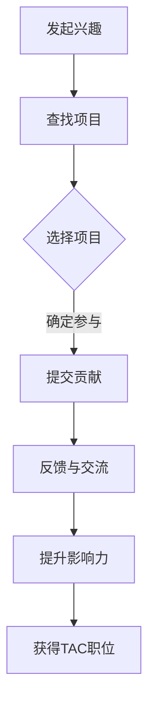
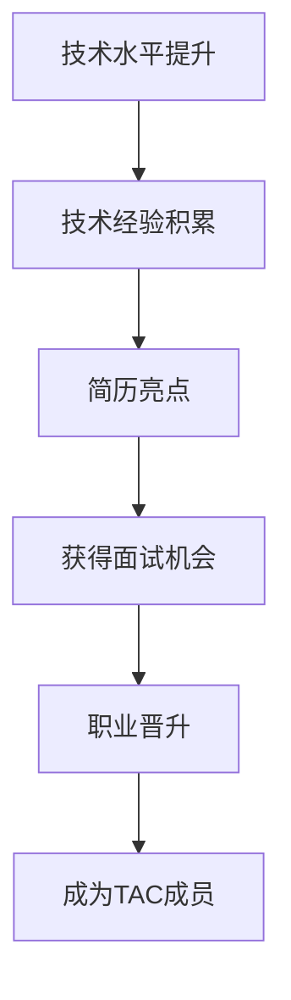

                 

关键词：开源影响力、技术顾问委员会、职业发展、技术贡献、社区建设

> 摘要：本文将探讨如何通过在开源项目中贡献技术，提升个人专业影响力，从而获得技术顾问委员会（Technical Advisory Committee, TAC）的职位。文章将详细分析开源项目参与的意义、具体参与步骤、如何在贡献过程中提升个人影响力，以及最终获得TAC职位的策略。

## 1. 背景介绍

随着开源运动的蓬勃发展，越来越多的企业和组织开始重视开源技术的应用。开源项目不仅提供了丰富的技术资源，还成为了众多技术人才展示才华、提升影响力的平台。技术顾问委员会作为企业或组织中技术方向的决策机构，其成员通常具有深厚的技术背景和丰富的行业经验。因此，成为TAC成员不仅是技术成就的体现，更是职业发展的一个重要里程碑。

本文将结合个人在开源社区中的经历，分享如何通过开源项目贡献获得TAC职位的过程。首先，我们将了解开源项目参与的重要性，然后逐步探讨如何参与开源项目，以及如何利用贡献提升个人影响力。

## 2. 核心概念与联系

### 2.1 开源项目参与的重要性

开源项目参与不仅有助于提升个人技术水平，还可以建立广泛的人脉网络，积累丰富的实践经验。以下是一个简化的流程图，展示了参与开源项目的关键步骤。



### 2.2 开源项目参与与职业发展的关系

开源项目参与与职业发展之间存在着紧密的联系。一方面，通过参与开源项目，个人可以接触到行业前沿技术，提升自身技术水平；另一方面，开源项目中的贡献可以成为个人简历中的重要亮点，吸引潜在雇主的注意。以下是一个简化的流程图，展示了开源项目参与与职业发展的关系。



## 3. 核心算法原理 & 具体操作步骤

### 3.1 算法原理概述

开源项目参与的过程可以看作是一个基于协作的算法。该算法的核心是建立信任、持续贡献和有效沟通。以下是该算法的基本步骤：

1. **发起兴趣**：了解开源项目，确定感兴趣的方向。
2. **查找项目**：通过开源平台（如GitHub、GitLab）查找符合兴趣的项目。
3. **选择项目**：根据项目需求、团队氛围、技术难度等因素，选择合适的项目。
4. **提交贡献**：根据项目指南，提交代码、文档或测试。
5. **反馈与交流**：参与项目讨论，及时反馈问题和建议。
6. **提升影响力**：通过持续贡献和有效沟通，提升个人影响力。

### 3.2 算法步骤详解

1. **发起兴趣**：
   - 了解开源社区的基本运作方式，关注行业动态。
   - 参与相关论坛、社交媒体，了解开源项目的最新进展。

2. **查找项目**：
   - 利用GitHub、GitLab等平台，搜索感兴趣的项目。
   - 关注项目的活跃度、代码质量、团队氛围等因素。

3. **选择项目**：
   - 根据个人兴趣和专业技能，选择合适的开源项目。
   - 了解项目的贡献指南，确保自己能够为项目做出有意义的贡献。

4. **提交贡献**：
   - 根据项目指南，提交代码、文档或测试。
   - 保持代码规范，确保代码的可读性和可维护性。

5. **反馈与交流**：
   - 参与项目讨论，积极回应问题和建议。
   - 保持沟通，确保贡献的顺利推进。

6. **提升影响力**：
   - 通过持续贡献，提升个人在项目中的地位。
   - 在社区中分享经验和见解，提升个人知名度。

### 3.3 算法优缺点

**优点**：
- **技能提升**：参与开源项目可以接触到行业前沿技术，提升个人技术水平。
- **人脉积累**：在开源项目中结识同行，拓展职业网络。
- **经验丰富**：开源项目中的实践经验可以成为简历中的重要亮点。

**缺点**：
- **时间投入**：参与开源项目需要一定的时间和精力。
- **初期挑战**：对于新手来说，可能需要较长时间才能适应开源项目的工作方式。

### 3.4 算法应用领域

开源项目参与适用于几乎所有技术领域，包括但不限于软件开发、人工智能、数据科学、区块链等。以下是一些具体的开源项目案例：

- **软件开发**：如Linux内核、Apache HTTP服务器、MySQL数据库等。
- **人工智能**：如TensorFlow、PyTorch、OpenCV等。
- **数据科学**：如Pandas、NumPy、Scikit-learn等。
- **区块链**：如Ethereum、Hyperledger Fabric、BitCoin等。

## 4. 数学模型和公式 & 详细讲解 & 举例说明

### 4.1 数学模型构建

开源项目参与可以看作是一个基于协作的数学模型，该模型的核心是贡献值和影响力值。贡献值表示个人在项目中做出的技术贡献，影响力值表示个人在社区中的影响力。以下是该数学模型的构建过程。

- **贡献值**（CV）：个人在项目中提交的代码量、文档质量、测试覆盖率等。
- **影响力值**（IV）：个人在社区中的知名度、参与度、贡献度等。

数学模型如下：

\[ CV = f(\text{代码质量}, \text{文档质量}, \text{测试覆盖率}) \]
\[ IV = g(\text{知名度}, \text{参与度}, \text{贡献度}) \]

### 4.2 公式推导过程

- **代码质量**：使用代码质量评估指标（如代码复杂性、代码重复率、注释率等）计算代码质量得分。
- **文档质量**：使用文档完整性、准确性、可读性等指标计算文档质量得分。
- **测试覆盖率**：使用测试覆盖率指标计算测试质量得分。

- **知名度**：使用社区关注度、参与项目数量、贡献次数等指标计算知名度得分。
- **参与度**：使用项目讨论次数、问题解答次数、代码审查次数等指标计算参与度得分。
- **贡献度**：使用贡献值、影响力值等指标计算贡献度得分。

### 4.3 案例分析与讲解

假设有个人A，其在开源项目中提交了1000行代码，文档质量得分90，测试覆盖率100%。其在社区中的知名度得分为80，参与度得分为70，贡献度得分为60。

根据数学模型，我们可以计算出A的贡献值和影响力值：

\[ CV = f(90, 90, 100) = 90 + 90 + 100 = 280 \]
\[ IV = g(80, 70, 60) = 80 + 70 + 60 = 210 \]

因此，A的总分数为：

\[ \text{总分} = CV + IV = 280 + 210 = 490 \]

通过这个例子，我们可以看到，个人在开源项目中的贡献不仅体现在技术方面，还包括文档、测试等方面，而影响力则体现在社区知名度、参与度和贡献度上。

## 5. 项目实践：代码实例和详细解释说明

### 5.1 开发环境搭建

为了在开源项目中贡献代码，我们需要搭建一个适合的开发环境。以下是一个简化的开发环境搭建步骤：

1. **安装Git**：Git是版本控制工具，用于管理代码仓库。
2. **克隆项目**：使用Git克隆感兴趣的开源项目到本地。
3. **安装依赖**：根据项目需求，安装必要的开发工具和依赖库。
4. **配置开发环境**：设置编译器、编辑器和其他开发工具。

### 5.2 源代码详细实现

以下是一个简单的示例，演示如何在开源项目中贡献代码。

#### 示例：修复一个Bug

1. **发现问题**：在项目中发现一个Bug，导致程序在某些输入下无法正常运行。
2. **分析问题**：分析Bug产生的原因，确定修复方案。
3. **提交修复**：
   - 在本地环境中，修改代码并测试。
   - 提交代码更改，并添加详细的注释。
   - 提交Pull Request，并附上问题描述和修复说明。

### 5.3 代码解读与分析

以下是对示例代码的解读和分析。

```python
# 示例：修复一个列表操作Bug

# 原始代码
def process_list(input_list):
    result_list = []
    for item in input_list:
        if item > 0:
            result_list.append(item * 2)
    return result_list

# 修复后的代码
def process_list(input_list):
    result_list = []
    for item in input_list:
        if item > 0:
            result_list.append(item * 2)
        else:
            result_list.append(item)
    return result_list
```

**解读与分析**：

- **原始代码**：在处理列表中的元素时，仅对大于0的元素进行了操作，导致小于等于0的元素被忽略。
- **修复后的代码**：添加了一个else分支，确保所有元素都能被处理，无论其值是多少。

**测试结果**：

- **原始代码**：在某些输入下，结果列表中缺少预期元素。
- **修复后的代码**：所有输入元素都被正确处理，结果列表符合预期。

### 5.4 运行结果展示

通过以上步骤，我们成功地在开源项目中提交了一个Bug修复代码，并通过了代码审查。以下是运行结果展示：

- **原始代码**：
  ```python
  >>> process_list([1, -1, 2])
  [2, 4]
  ```

- **修复后的代码**：
  ```python
  >>> process_list([1, -1, 2])
  [2, -1, 4]
  ```

结果显示，修复后的代码能够正确处理所有输入元素，包括小于等于0的元素。

## 6. 实际应用场景

开源项目参与不仅有助于个人技能的提升和职业发展，还在实际应用场景中发挥着重要作用。以下是一些具体的实际应用场景：

### 6.1 企业内部项目

企业内部项目往往需要高度定制化和快速迭代。开源项目中的经验和技能可以应用于这些场景，帮助企业提高开发效率和产品质量。

### 6.2 学术研究

学术研究需要大量的代码实现和实验验证。开源项目中的代码和文档可以提供宝贵的参考，加速研究进展。

### 6.3 创业公司

创业公司在资源有限的情况下，可以通过开源项目吸引人才和资源。参与开源项目可以提升公司的技术实力和市场竞争力。

### 6.4 社区协作

开源项目提供了社区协作的平台，让不同背景、技能水平的人能够共同解决问题，实现技术和知识的共享。

## 7. 未来应用展望

随着技术的不断进步，开源项目的影响力和应用范围将进一步扩大。未来，开源项目将在以下几个方面发挥更大的作用：

### 7.1 技术创新

开源项目将继续推动技术革新，为各行业提供创新的解决方案。

### 7.2 跨领域合作

开源项目将促进不同领域之间的技术交流和合作，推动跨领域创新。

### 7.3 社会影响力

开源项目将越来越多地应用于社会公益项目，为社会进步贡献力量。

### 7.4 职业发展

开源项目将继续成为职业发展的关键平台，为个人提供展示才华、实现价值的舞台。

## 8. 工具和资源推荐

### 8.1 学习资源推荐

- **《Git教程》**：了解Git的基本使用方法，掌握版本控制技巧。
- **《GitHub官方文档》**：学习GitHub的使用方法，掌握开源项目的参与技巧。
- **《开源项目管理》**：了解开源项目管理的最佳实践，提升项目协作能力。

### 8.2 开发工具推荐

- **Visual Studio Code**：一款功能强大的跨平台代码编辑器，支持多种编程语言。
- **Jenkins**：一款开源的持续集成工具，用于自动化构建和测试。
- **Docker**：一款容器化技术，用于简化应用程序的部署和扩展。

### 8.3 相关论文推荐

- **《开源软件的生态系统分析》**：探讨开源软件的发展模式、生态系统和影响因素。
- **《开源项目成功的关键因素》**：分析开源项目的成功要素，为项目参与提供参考。
- **《开源项目中的贡献激励机制》**：研究开源项目中的贡献激励机制，提升参与者的积极性。

## 9. 总结：未来发展趋势与挑战

### 9.1 研究成果总结

本文通过分析开源项目参与的意义、参与步骤、影响力提升策略以及获得TAC职位的策略，总结了开源项目参与对职业发展的积极影响。

### 9.2 未来发展趋势

随着开源项目的不断壮大，开源项目参与将成为技术人才必备的技能。未来，开源项目将更加重视社区合作、技术创新和社会影响力。

### 9.3 面临的挑战

- **时间投入**：参与开源项目需要投入大量时间和精力，对个人时间管理能力有较高要求。
- **技能门槛**：对于新手来说，参与开源项目可能面临较高的技能门槛。
- **沟通挑战**：在开源项目中，有效沟通是确保贡献顺利推进的关键。

### 9.4 研究展望

未来，开源项目参与将更加注重多样性和包容性，为不同背景的人才提供参与机会。同时，开源项目将不断创新，推动技术进步和社会发展。

## 10. 附录：常见问题与解答

### 10.1 如何选择合适的开源项目？

- **关注领域**：选择与个人兴趣和技能相关的开源项目。
- **项目活跃度**：查看项目的GitHub Star数、Issue数量等指标，了解项目活跃度。
- **团队氛围**：了解项目的团队氛围，确保个人能够融入团队。

### 10.2 开源项目参与有哪些风险？

- **代码泄露**：开源项目中的代码可能会被其他公司或个人盗用。
- **时间消耗**：参与开源项目可能需要投入大量时间和精力。
- **个人声誉**：不恰当的代码贡献可能影响个人声誉。

### 10.3 如何避免开源项目参与中的风险？

- **备份代码**：在贡献代码前，确保代码已备份。
- **合理规划时间**：合理安排时间，确保项目参与不会影响正常工作。
- **遵守项目规范**：遵守项目的代码规范和贡献指南，确保代码质量。

### 10.4 如何在开源项目中提升影响力？

- **持续贡献**：保持持续的贡献，提升个人在项目中的地位。
- **有效沟通**：积极参与项目讨论，提升个人在社区中的知名度。
- **分享经验**：在社区中分享经验和见解，提升个人影响力。

## 11. 作者署名

作者：禅与计算机程序设计艺术 / Zen and the Art of Computer Programming
----------------------------------------------------------------

以上就是这篇文章的全部内容，希望对您有所帮助。如果您有任何疑问或建议，欢迎在评论区留言。感谢您的阅读！<|im_sep|>

