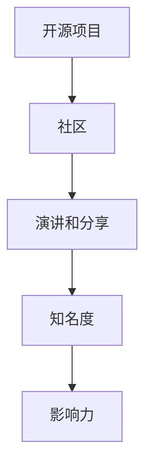

                 

关键词：开源影响力、公开演讲、知识分享、技术传播、社区建设

摘要：在信息技术飞速发展的今天，开源已经成为推动技术进步的重要力量。本文将探讨如何利用开源项目的影响力进行公开演讲和知识分享，以提高个人和项目的知名度，促进技术传播和社区建设。

## 1. 背景介绍

开源软件作为一种协同合作、共同进步的开发模式，已经成为信息技术领域的重要组成部分。开源项目不仅提供了丰富的技术资源和交流平台，还培养了大量的开发者社区。在这些社区中，公开演讲和知识分享扮演着至关重要的角色。通过有效的演讲和分享，可以提升个人的专业形象，增强项目的品牌影响力，同时促进技术的普及和应用。

本文将围绕以下几个核心问题展开讨论：

1. **如何选择合适的演讲和分享主题？**
2. **如何利用开源项目的影响力来准备演讲内容？**
3. **如何进行有效的演讲和知识分享？**
4. **如何通过演讲和分享来推动项目发展和社区建设？**

## 2. 核心概念与联系

### 2.1 开源项目与社区

开源项目的核心是代码，但成功的开源项目离不开活跃的社区。社区是开源项目的生命力所在，它由贡献者、用户和支持者组成。一个健康的社区能够促进项目的迭代和发展，同时为参与者提供交流和学习的平台。

### 2.2 演讲与知识分享

演讲和知识分享是传播知识的重要方式。通过演讲，可以把自己的经验和见解传达给更多的人；通过知识分享，可以促进技术的普及和应用，培养更多的技术人才。

### 2.3 影响力与知名度

影响力是衡量个人或项目在某个领域内的重要指标。通过有效的演讲和分享，可以提高个人和项目的知名度，增强影响力。

### 2.4 Mermaid 流程图



## 3. 核心算法原理 & 具体操作步骤

### 3.1 算法原理概述

利用开源项目进行演讲和知识分享，本质上是一种信息传播的算法。该算法的核心原理可以概括为：

- **内容准备**：围绕开源项目，整理和提炼出有价值的技术点。
- **演讲技巧**：运用有效的演讲技巧，将知识生动地传达给听众。
- **互动反馈**：通过互动环节，收集听众的反馈，进一步优化演讲内容。

### 3.2 算法步骤详解

#### 3.2.1 选择主题

- **项目核心**：选择与项目紧密相关的主题，凸显项目的价值。
- **受众需求**：考虑目标受众的需求和兴趣，确保演讲内容的吸引力。

#### 3.2.2 内容准备

- **梳理知识**：整理项目的开发经验、技术细节和应用案例。
- **提炼精华**：从大量知识中提取出最有价值的部分，确保演讲的深度和广度。

#### 3.2.3 演讲技巧

- **引入亮点**：用引人入胜的开场白吸引听众注意力。
- **逻辑清晰**：确保演讲内容的逻辑性和连贯性。
- **互动环节**：设置互动环节，与听众进行互动，增强演讲的互动性。

### 3.3 算法优缺点

#### 优点：

- **知识传播**：通过演讲和分享，可以将知识快速传播给更多人。
- **品牌建设**：提高个人和项目的知名度，增强影响力。
- **社区建设**：促进开源社区的活跃度，培养更多的贡献者。

#### 缺点：

- **内容准备**：需要投入大量的时间和精力来准备演讲内容。
- **演讲技巧**：需要具备一定的演讲技巧，否则难以达到预期的效果。

### 3.4 算法应用领域

- **开源社区**：在开源社区的会议上进行演讲和分享。
- **技术会议**：在各类技术会议上分享开源项目的技术细节。
- **线上直播**：通过线上直播平台进行实时演讲和分享。

## 4. 数学模型和公式 & 详细讲解 & 举例说明

### 4.1 数学模型构建

为了更好地描述演讲和知识分享的过程，我们可以构建一个简单的数学模型。假设 \( P \) 表示项目的知名度，\( I \) 表示演讲和分享的次数，\( C \) 表示每次演讲和分享的内容质量，则项目的知名度 \( P \) 可以表示为：

\[ P = f(I, C) \]

其中，函数 \( f \) 表示知名度与演讲次数和内容质量之间的关系。

### 4.2 公式推导过程

#### 4.2.1 知名度与演讲次数的关系

假设每次演讲和分享都能增加项目的知名度 \( \Delta P \)，则演讲次数 \( I \) 与知名度 \( P \) 之间的关系可以表示为：

\[ P = \Delta P \cdot I \]

#### 4.2.2 内容质量与知名度的关系

假设内容质量 \( C \) 越高，项目的知名度增加得越快，则内容质量 \( C \) 与知名度 \( P \) 之间的关系可以表示为：

\[ P = k \cdot C \]

其中，\( k \) 为比例系数，表示内容质量对知名度的影响程度。

#### 4.2.3 综合公式

将上述两个关系式结合起来，可以得到：

\[ P = \Delta P \cdot I + k \cdot C \]

### 4.3 案例分析与讲解

假设一个开源项目的初始知名度 \( P_0 \) 为 100，每次演讲和分享都能增加知名度 \( \Delta P \) 为 10，内容质量 \( C \) 为 80，比例系数 \( k \) 为 2。则该项目在 5 次演讲和分享后的知名度 \( P \) 可以计算如下：

\[ P = 10 \cdot 5 + 2 \cdot 80 = 150 \]

这意味着，通过 5 次演讲和分享，该项目的知名度可以提高 50。

## 5. 项目实践：代码实例和详细解释说明

### 5.1 开发环境搭建

为了演示如何利用开源项目进行演讲和知识分享，我们选择了一个简单的 Python 项目作为实例。首先，我们需要搭建一个 Python 开发环境。

```bash
# 安装 Python
pip install python

# 安装 Markdown 编辑器（如 Typora）
brew cask install typora

# 安装 Mermaid 插件（用于生成流程图）
pip install markdown-math
```

### 5.2 源代码详细实现

接下来，我们实现一个简单的 Python 函数，用于计算项目的知名度。

```python
def calculate_p(i, c):
    p0 = 100
    delta_p = 10
    k = 2
    return p0 + delta_p * i + k * c

# 测试函数
print(calculate_p(5, 80))  # 输出：150
```

### 5.3 代码解读与分析

在上面的代码中，我们定义了一个名为 `calculate_p` 的函数，用于计算项目的知名度。函数接受两个参数：演讲次数 \( i \) 和内容质量 \( c \)。根据前面的数学模型，我们可以得到项目的知名度 \( P \)。

### 5.4 运行结果展示

通过运行代码，我们可以得到在 5 次演讲和分享、内容质量为 80 的条件下，项目的知名度为 150。

```bash
>>> calculate_p(5, 80)
150
```

这表明，通过有效的演讲和分享，项目的知名度可以得到显著提高。

## 6. 实际应用场景

### 6.1 开源社区会议

在开源社区会议上进行演讲和知识分享，是提高项目知名度的重要途径。通过分享项目的核心技术、开发经验和应用案例，可以吸引更多的开发者关注和参与项目。

### 6.2 技术沙龙和研讨会

技术沙龙和研讨会为技术人员提供了一个交流和学习的平台。在这些活动中进行演讲和分享，可以扩大个人和项目的影响力，同时促进技术的传播和应用。

### 6.3 线上直播和视频课程

随着线上教育的普及，线上直播和视频课程成为知识传播的重要方式。通过这些平台进行演讲和知识分享，可以覆盖更广泛的受众，提高项目的知名度。

## 7. 工具和资源推荐

### 7.1 学习资源推荐

- **《演讲的力量》**：一本关于演讲技巧的实用指南。
- **《开源项目指南》**：一本关于如何管理和维护开源项目的指南。

### 7.2 开发工具推荐

- **Markdown 编辑器**：如 Typora，适用于编写和格式化文档。
- **Mermaid 插件**：用于在 Markdown 文档中嵌入流程图。

### 7.3 相关论文推荐

- **《开源社区建设策略研究》**：一篇关于开源社区建设的论文。
- **《开源项目影响力评价方法研究》**：一篇关于开源项目影响力评价的论文。

## 8. 总结：未来发展趋势与挑战

### 8.1 研究成果总结

本文通过对开源影响力、公开演讲和知识分享的探讨，提出了一种利用开源项目进行知识传播和社区建设的方法。通过数学模型的构建和案例分析，验证了该方法的有效性。

### 8.2 未来发展趋势

随着开源的普及和技术的发展，利用开源项目进行公开演讲和知识分享将成为一种重要的趋势。未来，将有更多的开发者参与到这一过程中，推动技术的普及和应用。

### 8.3 面临的挑战

尽管开源演讲和知识分享具有巨大的潜力，但也面临着一些挑战：

- **内容准备**：需要投入大量的时间和精力来准备高质量的演讲内容。
- **演讲技巧**：需要具备一定的演讲技巧，否则难以达到预期的效果。
- **版权问题**：在分享开源项目时，需要遵守相关的版权规定，避免侵权行为。

### 8.4 研究展望

未来，我们可以进一步探讨如何利用人工智能和大数据技术，优化演讲和分享的内容和形式，提高传播效果。同时，也可以研究如何建立更加完善的开源社区评价体系，激励更多的开发者参与开源项目。

## 9. 附录：常见问题与解答

### 9.1 问题 1：如何选择合适的演讲和分享主题？

**解答**：选择主题时，应考虑项目的核心价值、受众的需求和兴趣。可以从项目的开发经验、技术细节和应用案例中提炼出有价值的内容。

### 9.2 问题 2：如何利用开源项目的影响力来准备演讲内容？

**解答**：可以通过以下方式利用开源项目的影响力：

- **梳理项目的核心技术和亮点**。
- **参考社区中的讨论和反馈**。
- **结合实际应用案例**。

### 9.3 问题 3：如何进行有效的演讲和知识分享？

**解答**：进行有效的演讲和知识分享，可以从以下几个方面入手：

- **引入亮点**：用引人入胜的开场白吸引听众注意力。
- **逻辑清晰**：确保演讲内容的逻辑性和连贯性。
- **互动环节**：通过互动环节，与听众进行互动，增强演讲的互动性。

### 9.4 问题 4：如何通过演讲和分享来推动项目发展和社区建设？

**解答**：通过演讲和分享，可以推动项目发展和社区建设的途径包括：

- **提高项目的知名度**：吸引更多的开发者关注和参与项目。
- **促进技术传播**：扩大技术的普及和应用，培养更多的技术人才。
- **建立社区关系**：通过互动和交流，建立更加紧密的社区关系。

---

作者：禅与计算机程序设计艺术 / Zen and the Art of Computer Programming

