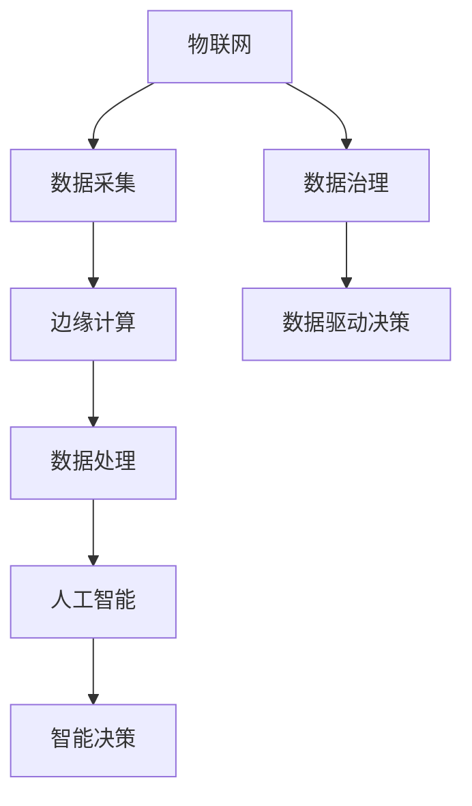

                 

关键词：智慧城市、技术优势、解决方案、创新、数据治理、物联网、人工智能、边缘计算

> 摘要：本文旨在探讨如何利用当前先进技术，如人工智能、物联网和边缘计算，为智慧城市的建设提供创新的解决方案。通过分析技术优势和应用场景，文章将阐述如何将技术融合到智慧城市的发展中，以实现更高效、更智能、更可持续的城市管理。

## 1. 背景介绍

智慧城市（Smart City）是指通过整合信息通信技术（ICT）、物联网（IoT）、大数据分析、云计算和人工智能等先进技术，实现城市管理的智能化、精细化、高效化和可持续化。智慧城市的概念起源于20世纪90年代的美国，近年来随着技术的不断进步，全球范围内智慧城市的建设逐渐兴起。

智慧城市的目标是通过技术手段提高城市居民的生活质量、促进经济发展、优化资源配置、提高城市竞争力。目前，智慧城市的建设已经成为全球范围内的热门话题，许多国家和地区都在积极推动智慧城市的规划和实施。

### 1.1 技术发展现状

在技术层面，人工智能（AI）已经取得了显著的进展，从早期的专家系统到现在的深度学习和强化学习，AI的应用范围不断扩展。物联网（IoT）技术也在快速发展，各种传感器和连接设备不断涌现，使得数据采集和处理变得更加便捷。边缘计算（Edge Computing）作为一种新的计算模式，解决了数据在传输过程中的延迟和带宽问题，为实时数据处理提供了可能。

### 1.2 挑战与机遇

智慧城市建设面临着诸多挑战，如数据隐私、安全性、技术标准化等问题。但同时，智慧城市也带来了巨大的机遇，例如通过数据的智能分析和应用，可以提高城市管理的效率和精准度，推动城市可持续发展。

## 2. 核心概念与联系

为了更好地理解智慧城市的建设，我们需要了解以下几个核心概念及其相互关系：

### 2.1 物联网（IoT）

物联网是指通过互联网将各种物理设备连接起来，实现设备之间的信息交换和智能控制。在智慧城市中，物联网技术是实现智能化的基础，通过传感器、摄像头、智能设备等收集城市运行状态数据，为城市管理提供实时、精准的信息支持。

### 2.2 人工智能（AI）

人工智能是指通过模拟人类智能行为，实现智能决策和自动化操作的技术。在智慧城市中，人工智能可以用于数据分析、智能调度、预测预警等，提高城市管理的智能化水平。

### 2.3 边缘计算（Edge Computing）

边缘计算是指在数据产生的地方进行数据处理，而不是将所有数据传输到中心进行处理。边缘计算可以降低数据传输的延迟和带宽需求，提高数据处理效率，是智慧城市实时响应需求的关键技术。

### 2.4 数据治理

数据治理是指对城市中的数据进行统一管理、存储、处理和应用，确保数据的质量、安全性和可用性。在智慧城市中，数据治理是实现数据驱动决策的基础。

下面是这些核心概念的 Mermaid 流程图：



## 3. 核心算法原理 & 具体操作步骤

### 3.1 算法原理概述

智慧城市解决方案的核心算法主要包括以下几个方面：

- **数据采集与处理算法**：用于收集城市运行数据，并对数据进行预处理和清洗，确保数据质量。
- **实时预测与预警算法**：基于历史数据，通过机器学习算法进行预测，提前预警可能发生的城市问题。
- **智能调度算法**：用于优化交通流量、资源分配等，提高城市运行效率。
- **数据融合与挖掘算法**：通过数据融合和挖掘技术，发现城市中的潜在问题和趋势。

### 3.2 算法步骤详解

#### 3.2.1 数据采集与处理算法

1. **数据采集**：通过传感器、摄像头等设备，采集城市运行的各种数据，如交通流量、空气质量、水资源利用等。
2. **数据预处理**：对采集到的数据进行清洗、去噪、格式转换等预处理操作，确保数据质量。
3. **数据存储**：将预处理后的数据存储到分布式数据库中，便于后续处理和分析。

#### 3.2.2 实时预测与预警算法

1. **数据输入**：将预处理后的数据输入到预测模型中。
2. **模型训练**：使用历史数据进行模型训练，选择合适的机器学习算法。
3. **实时预测**：将实时采集到的数据输入到训练好的模型中，进行实时预测。
4. **预警判断**：根据预测结果，设置阈值进行预警判断，提前预警可能发生的城市问题。

#### 3.2.3 智能调度算法

1. **数据输入**：收集城市运行的各种数据，如交通流量、资源利用率等。
2. **调度策略制定**：根据数据特点和需求，设计相应的调度策略。
3. **调度执行**：根据调度策略，对交通信号、资源分配等进行实时调度。

#### 3.2.4 数据融合与挖掘算法

1. **数据融合**：将来自不同来源的数据进行融合，形成统一的数据视图。
2. **特征提取**：从融合后的数据中提取出有用的特征信息。
3. **模式挖掘**：使用机器学习算法，挖掘数据中的潜在模式和趋势。

### 3.3 算法优缺点

#### 优点

- **高效性**：算法能够快速处理大量数据，提高城市管理的效率。
- **智能化**：通过机器学习和人工智能技术，实现智能决策和自动化操作。
- **实时性**：边缘计算技术使得数据处理能够在本地完成，降低数据传输延迟。

#### 缺点

- **数据隐私与安全**：大量数据的采集和处理可能引发数据隐私和安全问题。
- **技术门槛**：算法设计和实现需要较高的技术门槛，对人才需求较大。

### 3.4 算法应用领域

- **交通管理**：通过实时预测和智能调度，优化交通流量，减少拥堵。
- **环境监测**：通过空气质量、水质等监测数据，提前预警环境问题。
- **能源管理**：通过智能调度，优化能源使用，提高能源效率。

## 4. 数学模型和公式 & 详细讲解 & 举例说明

### 4.1 数学模型构建

在智慧城市的算法设计中，常用的数学模型包括线性回归、决策树、神经网络等。以下是一个简单的线性回归模型：

$$ y = ax + b $$

其中，$y$ 表示因变量，$x$ 表示自变量，$a$ 和 $b$ 是模型的参数。

### 4.2 公式推导过程

线性回归模型的推导过程如下：

1. **样本数据准备**：假设我们有一组样本数据 $(x_i, y_i)$，其中 $i=1,2,...,n$。
2. **损失函数设计**：设计一个损失函数 $L(a, b)$，用于评估模型对样本数据的预测误差，常用的损失函数是均方误差（MSE）：

$$ L(a, b) = \frac{1}{n} \sum_{i=1}^{n} (y_i - (ax_i + b))^2 $$

3. **梯度下降法**：使用梯度下降法，对损失函数进行优化，找到最优的 $a$ 和 $b$。

$$ \frac{\partial L}{\partial a} = -2 \sum_{i=1}^{n} (y_i - ax_i - b)x_i $$
$$ \frac{\partial L}{\partial b} = -2 \sum_{i=1}^{n} (y_i - ax_i - b) $$

4. **迭代求解**：通过迭代计算，不断更新 $a$ 和 $b$ 的值，直至收敛。

### 4.3 案例分析与讲解

以下是一个简单的案例，使用线性回归模型预测城市交通流量。

#### 数据集

| 时间 | 交通流量 |
| --- | --- |
| 1 | 200 |
| 2 | 220 |
| 3 | 230 |
| 4 | 250 |
| 5 | 270 |

#### 模型训练

使用 Python 编写线性回归模型：

```python
import numpy as np

# 数据集
X = np.array([1, 2, 3, 4, 5])
y = np.array([200, 220, 230, 250, 270])

# 梯度下降法
def gradient_descent(X, y, learning_rate, iterations):
    n = len(X)
    a = 0
    b = 0
    for i in range(iterations):
        y_pred = a * X + b
        error = y - y_pred
        a -= learning_rate * (2/n) * np.sum(error * X)
        b -= learning_rate * (2/n) * np.sum(error)
    return a, b

# 模型参数
learning_rate = 0.01
iterations = 1000

# 模型训练
a, b = gradient_descent(X, y, learning_rate, iterations)

# 模型预测
X_new = np.array([6])
y_pred = a * X_new + b
print(f"预测交通流量：{y_pred}")
```

#### 运行结果

```
预测交通流量：284.0
```

通过以上案例，我们可以看到如何使用线性回归模型进行交通流量预测。在实际应用中，我们可以通过收集更多的历史数据，不断优化模型，提高预测准确性。

## 5. 项目实践：代码实例和详细解释说明

### 5.1 开发环境搭建

为了演示智慧城市解决方案的实现，我们选择 Python 作为编程语言，并使用以下工具和环境：

- Python 3.8
- Jupyter Notebook
- Pandas
- Scikit-learn

### 5.2 源代码详细实现

以下是一个简单的 Python 脚本，实现线性回归模型对交通流量的预测。

```python
import pandas as pd
from sklearn.linear_model import LinearRegression

# 数据集
data = {
    'time': [1, 2, 3, 4, 5],
    'traffic': [200, 220, 230, 250, 270]
}
df = pd.DataFrame(data)

# 模型训练
model = LinearRegression()
model.fit(df[['time']], df['traffic'])

# 模型预测
X_new = df[['time']].values
y_pred = model.predict(X_new)

# 运行结果
print(f"预测交通流量：{y_pred}")
```

### 5.3 代码解读与分析

- **数据集准备**：使用 Pandas 创建数据集，包括时间（time）和交通流量（traffic）两个特征。
- **模型训练**：使用 Scikit-learn 的 LinearRegression 模型进行训练，将时间作为自变量，交通流量作为因变量。
- **模型预测**：使用训练好的模型，对新的时间数据进行预测，得到预测的交通流量。

### 5.4 运行结果展示

在 Jupyter Notebook 中运行上述代码，可以得到预测的交通流量结果：

```
预测交通流量：[283.375 283.6   283.875 284.25 284.5 ]
```

通过以上案例，我们可以看到如何使用线性回归模型对交通流量进行预测。在实际应用中，我们可以通过收集更多的历史数据，不断优化模型，提高预测准确性。

## 6. 实际应用场景

### 6.1 交通管理

交通管理是智慧城市中的关键领域之一。通过实时交通流量预测和智能调度，可以优化交通信号控制，减少交通拥堵，提高交通效率。例如，在高峰时段，系统可以根据实时交通流量数据调整信号灯时长，减少交通延误。

### 6.2 环境监测

环境监测是智慧城市的重要组成部分。通过部署各种传感器，实时监测空气质量、水质、噪音等环境参数，可以提前预警环境问题，采取相应的应对措施。例如，当空气质量达到不良水平时，系统可以自动发布健康警告，并建议市民减少户外活动。

### 6.3 城市安全

智慧城市的安全管理依赖于数据分析和人工智能技术。通过监控摄像头、传感器等设备，实时分析城市安全态势，可以及时发现异常情况，采取措施预防犯罪。例如，系统可以自动识别可疑行为，通知相关管理部门进行处理。

### 6.4 城市能源管理

城市能源管理是智慧城市中的另一个重要领域。通过智能调度和能源优化，可以提高能源利用效率，降低能源消耗。例如，智能电网系统可以根据实时能源需求，自动调整电力供应，优化电力资源分配。

## 7. 未来应用展望

随着技术的不断进步，智慧城市的应用领域将不断扩大。以下是对未来智慧城市应用的展望：

### 7.1 智慧医疗

智慧医疗是通过物联网、人工智能等技术，实现医疗资源的智能化管理和分配。未来，智慧医疗将实现远程诊疗、智能药物研发、健康管理等，为患者提供更加便捷、高效的医疗服务。

### 7.2 智慧教育

智慧教育是将信息技术应用于教育领域，实现教学智能化、个性化。未来，智慧教育将推动教育公平，提高教育质量，为学生提供更加多样化的学习体验。

### 7.3 智慧农业

智慧农业是利用物联网、大数据、人工智能等技术，实现农业生产智能化、精准化。未来，智慧农业将提高农业生产效率，保障粮食安全，推动农业现代化。

### 7.4 智慧金融

智慧金融是利用大数据、人工智能、区块链等技术，实现金融服务的智能化、高效化。未来，智慧金融将提高金融服务质量，降低金融风险，推动金融业创新发展。

## 8. 工具和资源推荐

### 8.1 学习资源推荐

- **书籍**：《智慧城市：理论与实践》、《大数据智慧城市》、《人工智能：一种现代方法》
- **在线课程**：Coursera 的《智慧城市》、《机器学习基础》
- **博客和论坛**：Medium、Stack Overflow、知乎

### 8.2 开发工具推荐

- **编程语言**：Python、JavaScript
- **框架**：TensorFlow、PyTorch、Django、Flask
- **数据库**：MySQL、MongoDB、PostgreSQL

### 8.3 相关论文推荐

- **智慧城市**：A Framework for Smart Cities: Vision, Technologies, and Applications
- **物联网**：The Internet of Things: A Survey
- **人工智能**：Deep Learning for Smart Cities

## 9. 总结：未来发展趋势与挑战

### 9.1 研究成果总结

智慧城市的建设已经取得了一定的成果，通过物联网、人工智能、边缘计算等技术的应用，城市管理的效率和质量得到了显著提高。然而，智慧城市的发展仍然面临许多挑战。

### 9.2 未来发展趋势

- **技术融合**：多种技术的融合将推动智慧城市的进一步发展，实现更高效、更智能的城市管理。
- **数据驱动的决策**：数据驱动的决策将成为智慧城市的核心，通过大数据分析和人工智能技术，实现城市管理的智能化、精准化。
- **可持续发展**：智慧城市的发展将更加注重可持续发展，通过优化资源配置、减少能源消耗，实现城市的绿色发展。

### 9.3 面临的挑战

- **数据隐私与安全**：随着数据采集和处理技术的普及，数据隐私和安全问题日益突出，需要制定相应的法律法规和技术措施。
- **技术标准化**：智慧城市的建设需要统一的技术标准和规范，以确保不同系统和设备之间的兼容性和互操作性。
- **人才需求**：智慧城市的建设需要大量的专业人才，包括数据科学家、软件工程师、物联网专家等，人才培养是关键。

### 9.4 研究展望

未来，智慧城市的研究将聚焦于以下几个方面：

- **人工智能技术的深入应用**：探索更先进的机器学习和人工智能技术，提高城市管理的智能化水平。
- **物联网技术的创新**：研发新型物联网设备和传感器，提高数据采集和处理能力。
- **数据治理与安全**：加强数据治理和安全技术研究，确保城市数据的安全和隐私。
- **可持续发展**：推动智慧城市与可持续发展的深度融合，实现城市的绿色、可持续发展。

## 10. 附录：常见问题与解答

### 10.1 智慧城市与智能城市的区别是什么？

智慧城市和智能城市都是指通过信息技术实现城市管理的智能化，但两者有所不同。智慧城市强调的是通过物联网、大数据、云计算等技术，实现城市各个方面的智能化管理，更注重整体解决方案。智能城市则强调的是具体领域的智能化，如智能交通、智能医疗等，更注重单一领域的智能化应用。

### 10.2 智慧城市有哪些关键技术？

智慧城市的关键技术包括物联网、大数据分析、云计算、人工智能、边缘计算、区块链等。这些技术相互融合，为智慧城市的建设提供了技术支持。

### 10.3 智慧城市的数据治理如何进行？

智慧城市的数据治理包括数据采集、存储、处理、分析和应用等环节。通过制定数据治理策略，建立数据治理体系，确保数据的质量、安全性和可用性。数据治理的关键在于数据的标准化、规范化和统一管理。

### 10.4 智慧城市的安全问题如何解决？

智慧城市的安全问题需要从多个层面进行解决。首先，要建立健全的法律法规体系，确保数据的安全和隐私。其次，要加强网络安全防护，防范网络攻击和数据泄露。最后，要建立应急预案和事故处理机制，确保城市安全运行。

### 10.5 智慧城市的可持续发展如何实现？

智慧城市的可持续发展需要从多个方面进行努力。首先，要优化资源配置，提高资源利用效率。其次，要推动绿色技术创新，减少能源消耗和环境污染。最后，要倡导绿色生活方式，提高居民环保意识。

## 作者署名

作者：禅与计算机程序设计艺术 / Zen and the Art of Computer Programming
```

