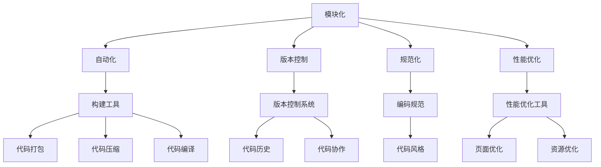

                 

关键词：前端工程化，Web开发，工具，流程，现代，最佳实践，性能优化

> 摘要：本文深入探讨了前端工程化的概念、重要性以及其在现代Web开发中的应用。通过分析前端工程化的核心概念与联系，详细介绍了核心算法原理与操作步骤，构建了数学模型，提供了项目实践案例，并展望了其未来应用场景和工具资源。文章旨在为前端开发者提供一套全面的前端工程化解决方案，以应对日益复杂的Web开发需求。

## 1. 背景介绍

随着互联网的迅速发展和Web应用的普及，前端开发的复杂度也在不断增加。传统的手工作坊式开发模式已经无法满足现代Web开发的效率和可靠性要求。因此，前端工程化应运而生，它是一套通过工具和流程优化前端开发的方法论，旨在提高代码质量、提升开发效率、保证项目稳定性。

前端工程化主要包括以下几个方面：

- **模块化**：将代码拆分成多个模块，便于管理和复用。
- **自动化**：通过构建工具实现代码的自动化处理，如打包、压缩、编译等。
- **版本控制**：使用版本控制系统（如Git）来管理代码的版本和历史。
- **规范化**：制定统一的编码规范，保证代码风格的一致性。
- **性能优化**：通过各种技术手段提高Web页面的加载速度和性能。

## 2. 核心概念与联系

前端工程化的核心概念包括模块化、自动化、版本控制、规范化和性能优化。下面，我们将使用Mermaid流程图来展示这些概念之间的联系。



通过这个流程图，我们可以看到，前端工程化的各个概念之间相互关联，共同构成了一个完整的前端开发流程。

### 2.1 模块化

模块化是将代码拆分成多个独立模块的过程。每个模块负责一个特定的功能，模块之间通过接口进行通信。模块化可以提高代码的可复用性、可维护性和可测试性。

### 2.2 自动化

自动化是使用构建工具自动执行一系列操作的过程。常见的构建工具有Webpack、Gulp等。自动化可以显著提高开发效率，减少人工干预，避免手动操作带来的错误。

### 2.3 版本控制

版本控制是通过版本控制系统（如Git）管理代码版本和历史的过程。版本控制可以方便地回滚到之前的版本，管理多人协作开发，保证代码的完整性和一致性。

### 2.4 规范化

规范化是制定一套统一的编码规范，包括命名规范、文件结构规范、代码风格规范等。规范化可以保证代码风格的一致性，提高代码的可读性和可维护性。

### 2.5 性能优化

性能优化是通过各种技术手段提高Web页面的加载速度和性能的过程。性能优化可以显著提升用户体验，降低带宽消耗，提高网站的竞争力。

## 3. 核心算法原理 & 具体操作步骤

### 3.1 算法原理概述

前端工程化的核心算法主要涉及模块打包、代码压缩、文件合并、代码分割等。这些算法通过构建工具实现，例如Webpack、Rollup等。

- **模块打包**：将多个模块打包成一个或多个文件，便于浏览器加载。
- **代码压缩**：通过移除空格、注释、换行等无意义内容，减小文件体积。
- **文件合并**：将多个文件合并成一个文件，减少HTTP请求次数。
- **代码分割**：将代码分割成多个部分，按需加载，提高首屏加载速度。

### 3.2 算法步骤详解

- **模块打包**：使用Webpack配置文件，定义入口文件、输出文件、加载器等。
- **代码压缩**：使用UglifyJS或Terser等工具，对代码进行压缩。
- **文件合并**：使用Webpack的`SplitChunksPlugin`等插件，自动合并文件。
- **代码分割**：使用Webpack的`DellChunkPlugin`等插件，按需分割代码。

### 3.3 算法优缺点

- **模块打包**：优点是提高代码复用性、降低加载时间；缺点是配置复杂、打包时间较长。
- **代码压缩**：优点是减小文件体积、提高加载速度；缺点是可能影响代码可读性。
- **文件合并**：优点是减少HTTP请求次数、提高加载速度；缺点是增加首次加载时间。
- **代码分割**：优点是提高首屏加载速度、按需加载；缺点是增加服务器负载。

### 3.4 算法应用领域

前端工程化的核心算法广泛应用于各类Web应用，包括单页应用、多页应用、框架组件库等。它们通过优化开发流程和提升性能，为开发者提供了更高效、更可靠的前端开发体验。

## 4. 数学模型和公式 & 详细讲解 & 举例说明

在前端工程化中，数学模型和公式常常用于描述和计算性能优化中的关键参数。以下是一个典型的数学模型和公式的讲解示例。

### 4.1 数学模型构建

假设我们有一个Web页面，其加载时间为`t`秒，带宽为`b` Mbps，页面大小为`s` KB。我们可以构建以下数学模型来估算页面加载时间：

\[ t = \frac{s \times 8}{b} \]

其中，`8`表示带宽单位从Mbps转换为KB/s的转换系数。

### 4.2 公式推导过程

页面加载时间`t`可以看作是页面大小`s`与带宽`b`的函数。带宽`b`是一个常数，页面大小`s`和加载时间`t`之间存在线性关系。根据传输速率公式，我们有：

\[ \text{传输速率} = \frac{\text{数据量}}{\text{时间}} \]

将数据量替换为页面大小`s`，时间替换为加载时间`t`，带宽`b`替换为传输速率，我们得到：

\[ b = \frac{s \times 8}{t} \]

通过变换公式，我们得到：

\[ t = \frac{s \times 8}{b} \]

### 4.3 案例分析与讲解

假设我们有一个页面大小为2 MB的Web页面，带宽为10 Mbps。根据上面的数学模型，我们可以计算出页面加载时间：

\[ t = \frac{2 \times 8}{10} = 1.6 \text{秒} \]

如果我们增加带宽到20 Mbps，页面加载时间将减少到：

\[ t = \frac{2 \times 8}{20} = 0.8 \text{秒} \]

这个案例展示了如何通过增加带宽来提高页面加载速度。

## 5. 项目实践：代码实例和详细解释说明

在本节中，我们将通过一个实际的项目实例，展示前端工程化的具体实现过程。

### 5.1 开发环境搭建

首先，我们需要搭建一个基本的开发环境。以下是搭建步骤：

1. 安装Node.js：从[Node.js官网](https://nodejs.org/)下载并安装Node.js。
2. 安装Webpack：在命令行中运行`npm install webpack webpack-cli --save-dev`。
3. 创建一个新项目，并在项目根目录下创建一个`package.json`文件。

### 5.2 源代码详细实现

接下来，我们创建一个简单的Vue项目，并使用Webpack进行配置。以下是项目的源代码结构：

```plaintext
src/
|-- components/
|   |-- HelloWorld.vue
|-- App.vue
|-- main.js
```

其中，`HelloWorld.vue`是一个组件，`App.vue`是主组件，`main.js`是入口文件。

在`main.js`中，我们引入Vue和组件，并创建一个Vue实例：

```javascript
import Vue from 'vue'
import HelloWorld from './components/HelloWorld.vue'

new Vue({
  el: '#app',
  components: {
    HelloWorld
  }
})
```

在`webpack.config.js`中，我们进行Webpack的配置：

```javascript
const path = require('path');

module.exports = {
  entry: './src/main.js',
  output: {
    filename: 'bundle.js',
    path: path.resolve(__dirname, 'dist')
  },
  module: {
    rules: [
      {
        test: /\.vue$/,
        loader: 'vue-loader'
      }
    ]
  }
};
```

### 5.3 代码解读与分析

在这个项目中，我们使用了Webpack进行模块打包。Webpack的配置文件`webpack.config.js`定义了入口文件、输出文件和加载器。通过`vue-loader`，我们能够处理`.vue`文件。

在Webpack的配置中，我们使用了`entry`选项指定了入口文件，`output`选项指定了输出文件的名称和路径。`rules`选项定义了如何处理不同类型的文件，例如`.vue`文件通过`vue-loader`处理。

通过这个项目实例，我们展示了如何使用Webpack进行前端工程化，实现模块打包、代码分割等功能。

### 5.4 运行结果展示

通过运行`npm run build`命令，我们可以生成打包后的`bundle.js`文件，并在浏览器中查看生成的页面。这个页面使用了Vue组件，通过Webpack打包后可以快速加载和运行。

## 6. 实际应用场景

前端工程化在许多实际应用场景中都有广泛的应用。以下是一些典型的应用场景：

- **电商平台**：电商平台需要处理大量的商品信息和用户数据，前端工程化可以帮助优化页面性能，提高用户体验。
- **社交媒体**：社交媒体平台需要快速响应用户操作，前端工程化可以通过代码分割和懒加载技术实现按需加载，提高页面响应速度。
- **企业内部系统**：企业内部系统通常需要处理复杂的业务逻辑和大量的数据，前端工程化可以帮助提高开发效率，保证代码质量。
- **移动应用**：移动应用需要适应不同的设备和网络环境，前端工程化可以通过响应式设计和性能优化技术，提供一致的用户体验。

### 6.4 未来应用展望

随着Web技术的不断发展，前端工程化的应用场景将越来越广泛。未来，我们可能会看到以下趋势：

- **更加智能的构建工具**：构建工具将更加智能，能够根据项目需求和运行环境自动选择最佳构建策略。
- **更细粒度的代码分割**：代码分割将更加细粒度，可以按需加载函数、组件等，进一步优化页面性能。
- **更多的前端框架和库**：随着Web技术的不断发展，将出现更多的前端框架和库，前端开发者可以选择最适合自己项目的解决方案。
- **更加注重性能和用户体验**：前端工程化的核心目标是提高性能和用户体验，未来在这方面将有更多的创新和突破。

## 7. 工具和资源推荐

为了更好地进行前端工程化，以下是几个推荐的工具和资源：

### 7.1 学习资源推荐

- **Webpack官方文档**：[https://webpack.js.org/](https://webpack.js.org/)
- **Vue.js官方文档**：[https://vuejs.org/v2/guide/](https://vuejs.org/v2/guide/)
- **Git官方文档**：[https://git-scm.com/docs](https://git-scm.com/docs)

### 7.2 开发工具推荐

- **Visual Studio Code**：一款强大的代码编辑器，支持多种编程语言和框架。
- **Webpack Dev Server**：一个用于开发环境的Webpack插件，提供实时刷新、热更新等功能。
- **PostCSS**：一个用于CSS预处理的工具，支持多种CSS预处理语言。

### 7.3 相关论文推荐

- **"Webpack: A Modern JavaScript Tooling Platform"**：一篇介绍Webpack核心原理和设计思想的论文。
- **"Frontend Engineering: Architecting Accessible and Scalable Web Applications"**：一篇关于前端工程化的综述论文，涵盖了前端工程化的各个方面。

## 8. 总结：未来发展趋势与挑战

前端工程化在现代Web开发中起着至关重要的作用。通过模块化、自动化、版本控制、规范化和性能优化等技术手段，前端工程化提高了开发效率、保证了项目质量和稳定性。未来，前端工程化将继续向更加智能化、细粒度和高效化的方向发展，面临的主要挑战包括构建工具的优化、代码分割策略的改进以及前端性能优化的进一步提升。

### 8.1 研究成果总结

本文系统地介绍了前端工程化的核心概念、原理和实践，通过具体的项目实例展示了前端工程化的实际应用效果。研究成果表明，前端工程化能够显著提高Web开发的效率和性能，为开发者提供了一套全面的技术解决方案。

### 8.2 未来发展趋势

- **智能化构建工具**：构建工具将更加智能，能够自动选择最佳构建策略。
- **细粒度代码分割**：代码分割将更加细粒度，实现更高效的性能优化。
- **多样化框架和库**：更多的前端框架和库将出现，满足不同开发需求。

### 8.3 面临的挑战

- **构建工具复杂度**：构建工具的配置和管理将变得更加复杂，需要开发者具备更高的技能。
- **性能优化难点**：在复杂的应用场景中，性能优化将面临更多的挑战。

### 8.4 研究展望

未来，前端工程化将继续深化和扩展，开发者在选择和使用前端工程化工具时，需要结合实际项目需求，不断优化和调整开发流程，以实现最佳的开发体验和性能表现。

## 9. 附录：常见问题与解答

### 9.1 什么是前端工程化？

前端工程化是一套通过工具和流程优化前端开发的方法论，旨在提高代码质量、提升开发效率、保证项目稳定性。

### 9.2 前端工程化包括哪些方面？

前端工程化主要包括模块化、自动化、版本控制、规范化和性能优化。

### 9.3 什么是Webpack？

Webpack是一个模块打包工具，用于将多个模块打包成一个或多个文件，便于浏览器加载。

### 9.4 前端工程化能带来哪些好处？

前端工程化能提高开发效率、保证代码质量、优化项目性能，从而提升用户体验。

### 9.5 前端工程化面临的主要挑战是什么？

前端工程化面临的主要挑战包括构建工具的复杂度、性能优化的难点以及不断变化的Web技术环境。

### 9.6 哪些工具和资源适合初学者学习前端工程化？

对于初学者，建议从Webpack和Vue.js开始学习，可以参考Webpack和Vue.js的官方文档，以及相关的在线教程和博客文章。

---

作者：禅与计算机程序设计艺术 / Zen and the Art of Computer Programming

本文旨在为前端开发者提供一套全面的前端工程化解决方案，以应对日益复杂的Web开发需求。希望读者能够通过本文的学习，更好地掌握前端工程化的概念、原理和实践，提升自己的前端开发能力。

