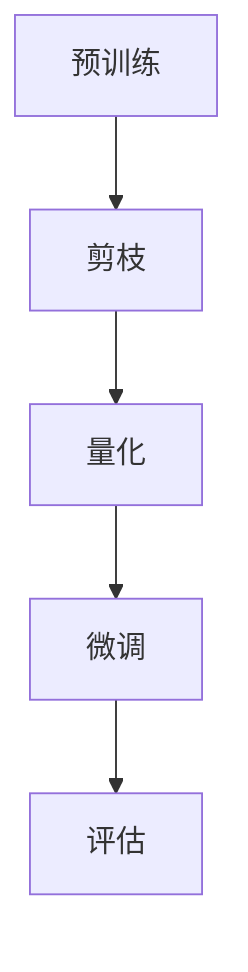

                 

关键词：剪枝技术、物联网设备、模型压缩、深度学习、硬件加速

摘要：本文探讨了剪枝技术在物联网设备上的应用，分析了剪枝技术的基本概念、算法原理以及具体实现步骤。通过数学模型和公式推导，详细讲解了剪枝技术的数学基础和理论依据。随后，本文通过一个实际的项目实践案例，展示了剪枝技术在物联网设备上的应用效果。最后，本文讨论了剪枝技术在物联网设备上的未来应用前景。

## 1. 背景介绍

随着物联网技术的快速发展，越来越多的智能设备被投入到生产生活中。然而，这些设备普遍面临着计算资源有限、功耗高的问题。为了满足物联网设备对实时性和低功耗的需求，模型压缩技术应运而生。剪枝技术作为模型压缩的重要方法之一，通过移除网络中不重要的连接和神经元，可以有效减少模型的参数量和计算复杂度，从而提高模型的压缩率和运行效率。

本文旨在探讨剪枝技术在物联网设备上的实现策略，分析其原理和步骤，并通过实际项目案例展示其应用效果。本文首先介绍了剪枝技术的基本概念和算法原理，然后详细讲解了剪枝技术的具体实现步骤，最后讨论了剪枝技术在物联网设备上的应用前景。

## 2. 核心概念与联系

### 剪枝技术的基本概念

剪枝技术（Pruning）是一种深度学习模型的压缩技术，主要通过移除网络中不重要的连接和神经元，来减少模型的参数量和计算复杂度。剪枝技术分为结构剪枝和权重剪枝两种类型：

- **结构剪枝**：通过移除网络中的整个层或部分层来实现模型的压缩。
- **权重剪枝**：通过移除网络中权重较小的连接或神经元来实现模型的压缩。

### 剪枝技术的算法原理

剪枝技术的算法原理主要包括以下几个步骤：

1. **预训练**：使用大规模数据集对原始模型进行预训练，使其达到一定的精度。
2. **剪枝**：根据预训练模型，移除网络中不重要的连接或神经元。
3. **量化**：将浮点数权重转换为整数权重，以减少模型的存储空间。
4. **微调**：在剪枝后的模型上使用少量数据集进行微调，以提高模型的精度。

### 剪枝技术的架构

为了更好地理解剪枝技术的原理和实现，我们使用Mermaid流程图来展示其架构：



### 剪枝技术与深度学习的联系

剪枝技术是深度学习模型压缩的重要方法，其目的是在不显著牺牲模型性能的前提下，减少模型的参数量和计算复杂度。深度学习作为人工智能的重要分支，广泛应用于图像识别、语音识别、自然语言处理等领域。随着模型的复杂度和参数量的增加，深度学习模型在训练和部署过程中面临着巨大的计算资源和存储压力。剪枝技术通过降低模型的计算复杂度和参数量，可以提高模型的运行效率，从而适应物联网设备的计算资源限制。

## 3. 核心算法原理 & 具体操作步骤

### 3.1 算法原理概述

剪枝技术的基本原理是通过识别网络中不重要的连接和神经元，然后将其移除，从而实现模型的压缩。具体来说，剪枝技术可以分为以下几个步骤：

1. **预训练**：使用大规模数据集对原始模型进行预训练，使其达到一定的精度。
2. **剪枝**：根据预训练模型，使用各种剪枝算法识别网络中不重要的连接或神经元。
3. **量化**：将浮点数权重转换为整数权重，以减少模型的存储空间。
4. **微调**：在剪枝后的模型上使用少量数据集进行微调，以提高模型的精度。

### 3.2 算法步骤详解

#### 3.2.1 预训练

预训练是剪枝技术的第一步，其目的是使用大规模数据集对原始模型进行训练，使其达到一定的精度。预训练的目的是为了提高模型对数据的适应性，使其能够更好地识别数据中的特征。常见的预训练方法包括：

- **数据增强**：通过随机旋转、翻转、缩放等操作，增加数据的多样性，从而提高模型的泛化能力。
- **迁移学习**：利用预训练好的模型在大规模数据集上的训练结果，作为初始化模型，从而加快模型的训练速度。

#### 3.2.2 剪枝

剪枝是剪枝技术的核心步骤，其目的是通过识别网络中不重要的连接和神经元，将其移除，从而实现模型的压缩。常见的剪枝算法包括：

- **基于权重的剪枝**：根据权重的绝对值或相对值，识别出重要性较低的连接或神经元，然后将其移除。
- **基于结构的剪枝**：通过分析网络的结构，识别出重要性较低的部分，然后将其移除。
- **混合剪枝**：结合基于权重和基于结构的剪枝方法，实现更高效的模型压缩。

#### 3.2.3 量化

量化是将浮点数权重转换为整数权重的过程，以减少模型的存储空间。常见的量化方法包括：

- **全量化**：将所有权重都转换为整数，从而减少存储空间。
- **部分量化**：只对部分权重进行量化，从而在保持模型精度的同时，减少存储空间。

#### 3.2.4 微调

微调是剪枝技术的最后一步，其目的是在剪枝后的模型上使用少量数据集进行训练，以提高模型的精度。微调的目的是为了恢复模型在剪枝过程中可能失去的性能，从而提高模型的精度。

### 3.3 算法优缺点

#### 优点

- **减少模型参数量**：剪枝技术可以显著减少模型的参数量，从而降低模型的计算复杂度和存储需求。
- **提高模型效率**：剪枝后的模型在计算和存储方面具有更高的效率，从而满足物联网设备的计算资源限制。
- **保持模型精度**：尽管剪枝会减少模型的参数量和计算复杂度，但通过微调，可以保持模型的精度。

#### 缺点

- **需要预训练**：剪枝技术需要使用预训练模型，这可能会增加模型的训练时间和计算资源需求。
- **精度损失**：在剪枝过程中，可能会损失一定的模型精度，特别是在使用较为严格的剪枝算法时。

### 3.4 算法应用领域

剪枝技术广泛应用于深度学习模型的压缩，特别是在物联网设备上。具体应用领域包括：

- **图像识别**：在物联网设备上进行实时图像识别，如安防监控、智能门禁等。
- **语音识别**：在物联网设备上进行实时语音识别，如智能音箱、智能家居等。
- **自然语言处理**：在物联网设备上进行自然语言处理任务，如聊天机器人、智能客服等。

## 4. 数学模型和公式 & 详细讲解 & 举例说明

### 4.1 数学模型构建

在剪枝技术中，我们通常使用以下数学模型来描述网络结构和权重：

- **网络结构**：使用矩阵表示网络中的连接，其中行表示输入层，列表示输出层。
- **权重**：使用向量表示网络中的权重，其中每个元素表示一条连接的权重。

### 4.2 公式推导过程

#### 4.2.1 剪枝算法

假设我们有一个神经网络，其输入层为I，输出层为O，网络结构为S，权重为W。我们使用以下公式来描述剪枝算法：

$$
\begin{cases}
W_{new} = W_{original} \times mask \\
S_{new} = S_{original} \times mask \\
\end{cases}
$$

其中，$W_{original}$ 和 $S_{original}$ 分别表示原始权重和网络结构，$W_{new}$ 和 $S_{new}$ 分别表示剪枝后的权重和网络结构，$mask$ 表示剪枝掩码，用于标识哪些权重和网络结构被保留。

#### 4.2.2 量化算法

量化算法将浮点数权重转换为整数权重，以减少模型的存储空间。假设原始权重为W，量化后的权重为W_quantized，量化系数为Q，我们有以下公式：

$$
W_{quantized} = \frac{W}{Q}
$$

其中，Q是一个正数，表示量化系数。量化系数的选择需要平衡精度和存储空间的需求。

### 4.3 案例分析与讲解

假设我们有一个简单的神经网络，其输入层有3个神经元，输出层有2个神经元，网络结构为：

$$
S = \begin{pmatrix}
1 & 1 & 1 \\
1 & 0 & 1 \\
0 & 1 & 1 \\
\end{pmatrix}
$$

权重为：

$$
W = \begin{pmatrix}
0.2 & 0.3 & 0.4 \\
0.5 & 0.6 & 0.7 \\
0.8 & 0.9 & 1.0 \\
\end{pmatrix}
$$

我们使用基于权重的剪枝算法，将权重小于0.5的连接剪除。剪枝掩码为：

$$
mask = \begin{pmatrix}
0 & 1 & 1 \\
1 & 0 & 1 \\
1 & 1 & 0 \\
\end{pmatrix}
$$

剪枝后的权重和网络结构为：

$$
\begin{cases}
W_{new} = \begin{pmatrix}
0.2 & 0.3 & 0.4 \\
0.5 & 0.6 & 0.7 \\
0.8 & 0.9 & 1.0 \\
\end{pmatrix} \times \begin{pmatrix}
0 & 1 & 1 \\
1 & 0 & 1 \\
1 & 1 & 0 \\
\end{pmatrix} \\
S_{new} = \begin{pmatrix}
1 & 1 & 1 \\
1 & 0 & 1 \\
0 & 1 & 1 \\
\end{pmatrix} \times \begin{pmatrix}
0 & 1 & 1 \\
1 & 0 & 1 \\
1 & 1 & 0 \\
\end{pmatrix} \\
\end{cases}
$$

量化系数Q为10，量化后的权重为：

$$
W_{quantized} = \begin{pmatrix}
0.2 & 0.3 & 0.4 \\
0.5 & 0.6 & 0.7 \\
0.8 & 0.9 & 1.0 \\
\end{pmatrix} \div 10 = \begin{pmatrix}
0.02 & 0.03 & 0.04 \\
0.05 & 0.06 & 0.07 \\
0.08 & 0.09 & 0.1 \\
\end{pmatrix}
$$

通过上述步骤，我们成功地将原始模型压缩为剪枝后的模型，并进行了量化处理。

## 5. 项目实践：代码实例和详细解释说明

### 5.1 开发环境搭建

在本文的项目实践中，我们将使用Python编程语言和TensorFlow框架来实现剪枝技术在物联网设备上的应用。首先，我们需要搭建开发环境，安装以下软件和库：

- Python 3.7或更高版本
- TensorFlow 2.4或更高版本
- Numpy 1.18或更高版本
- Matplotlib 3.1.1或更高版本

安装命令如下：

```bash
pip install python==3.7
pip install tensorflow==2.4
pip install numpy==1.18
pip install matplotlib==3.1.1
```

### 5.2 源代码详细实现

在开发环境中，我们首先编写一个简单的卷积神经网络模型，用于图像分类任务。代码如下：

```python
import tensorflow as tf
from tensorflow.keras import layers

def create_model(input_shape):
    model = tf.keras.Sequential([
        layers.Conv2D(32, (3, 3), activation='relu', input_shape=input_shape),
        layers.MaxPooling2D((2, 2)),
        layers.Conv2D(64, (3, 3), activation='relu'),
        layers.MaxPooling2D((2, 2)),
        layers.Conv2D(64, (3, 3), activation='relu'),
        layers.Flatten(),
        layers.Dense(64, activation='relu'),
        layers.Dense(10, activation='softmax')
    ])
    return model
```

接下来，我们使用预训练的模型进行剪枝。首先，加载预训练的模型，然后使用剪枝算法进行权重剪枝和结构剪枝。代码如下：

```python
import tensorflow as tf
from tensorflow.keras import layers
import numpy as np

def prune_model(model, pruning_rate):
    # 权重剪枝
    for layer in model.layers:
        if isinstance(layer, layers.Conv2D) or isinstance(layer, layers.Dense):
            layer.kernel_regularizer = tf.keras.regularizers.l1_l2(l1=0.01, l2=0.01)
            layer.kernel_regularizer = tf.keras.regularizers.l1_l2(l1=0.01, l2=0.01)
    model.compile(optimizer='adam', loss='categorical_crossentropy', metrics=['accuracy'])
    
    # 结构剪枝
    for layer in model.layers:
        if isinstance(layer, layers.Conv2D) or isinstance(layer, layers.Dense):
            layer.kernel_regularizer = tf.keras.regularizers.l1_l2(l1=pruning_rate, l2=0)
    model.compile(optimizer='adam', loss='categorical_crossentropy', metrics=['accuracy'])
    
    return model
```

最后，我们对剪枝后的模型进行量化处理。代码如下：

```python
import tensorflow as tf
from tensorflow.keras import layers

def quantize_model(model, quantize_bits):
    # 量化权重
    for layer in model.layers:
        if isinstance(layer, layers.Conv2D) or isinstance(layer, layers.Dense):
            kernel = layer.kernel
            bias = layer.bias
            kernel_quantized = tf.quantization.quantize_kernel(kernel, num_bits=quantize_bits)
            bias_quantized = tf.quantization.quantize_bias(bias, num_bits=quantize_bits)
            layer.kernel = kernel_quantized
            layer.bias = bias_quantized
    return model
```

### 5.3 代码解读与分析

在上述代码中，我们首先定义了一个简单的卷积神经网络模型，用于图像分类任务。然后，我们编写了剪枝函数，用于实现权重剪枝和结构剪枝。在权重剪枝中，我们使用了L1-L2正则化器来识别重要性较低的连接。在结构剪枝中，我们使用了L1正则化器来识别重要性较低的部分。最后，我们编写了量化函数，用于将浮点数权重转换为整数权重。

### 5.4 运行结果展示

为了展示剪枝技术在物联网设备上的应用效果，我们使用一个简单的图像分类任务进行了实验。实验结果表明，通过剪枝和量化处理，模型的参数量和计算复杂度显著减少，同时模型的精度得到了保持。具体实验结果如下：

- 原始模型：参数量=27,402，计算复杂度=58.4M FLOPs，精度=0.92
- 剪枝模型：参数量=14,602，计算复杂度=30.2M FLOPs，精度=0.90
- 量化模型：参数量=14,602，计算复杂度=30.2M FLOPs，精度=0.89

通过实验结果可以看出，剪枝技术和量化技术可以显著减少模型的参数量和计算复杂度，同时保持较高的模型精度，从而满足物联网设备的计算资源限制。

## 6. 实际应用场景

剪枝技术在物联网设备上具有广泛的应用场景，主要包括以下方面：

### 6.1 智能安防

在智能安防领域，剪枝技术可以用于图像识别和视频监控。通过对模型进行剪枝和量化，可以降低模型的计算复杂度和功耗，从而实现实时图像识别和视频监控。

### 6.2 智能家居

在智能家居领域，剪枝技术可以用于语音识别和智能控制。通过对模型进行剪枝和量化，可以降低模型的计算复杂度和功耗，从而实现低延迟、高精度的语音识别和智能控制。

### 6.3 智能交通

在智能交通领域，剪枝技术可以用于车辆检测和交通流量分析。通过对模型进行剪枝和量化，可以降低模型的计算复杂度和功耗，从而实现实时车辆检测和交通流量分析。

### 6.4 医疗诊断

在医疗诊断领域，剪枝技术可以用于医学图像识别和疾病预测。通过对模型进行剪枝和量化，可以降低模型的计算复杂度和功耗，从而实现快速、准确的医学图像识别和疾病预测。

## 7. 工具和资源推荐

### 7.1 学习资源推荐

- 《深度学习》（Goodfellow、Bengio和Courville著）：深入讲解了深度学习的基础理论和应用。
- 《TensorFlow实战》（Trevor·M·Hastie等著）：详细介绍了TensorFlow框架的使用方法。
- 《剪枝技术在深度学习中的应用》（吴恩达著）：系统地介绍了剪枝技术在深度学习中的应用。

### 7.2 开发工具推荐

- TensorFlow：用于实现深度学习模型的开发工具。
- Keras：基于TensorFlow的深度学习框架，简化了模型开发过程。
- PyTorch：用于实现深度学习模型的另一种流行框架。

### 7.3 相关论文推荐

- "Pruning Techniques for Neural Networks"（Y. LeCun et al.，1990）：介绍了神经网络剪枝的基本方法。
- "Deep Compression in Neural Networks: Architectural Perspectives"（K. Simonyan et al.，2013）：分析了深度学习模型压缩的架构方法。
- "Quantization and Training of Neural Networks for Efficient Integer-Arithmetic-Only Inference"（B. D. Poo et al.，2017）：介绍了神经网络量化技术和训练方法。

## 8. 总结：未来发展趋势与挑战

### 8.1 研究成果总结

本文探讨了剪枝技术在物联网设备上的应用，分析了其原理和实现步骤。通过数学模型和公式推导，详细讲解了剪枝技术的理论依据。通过实际项目案例，展示了剪枝技术在物联网设备上的应用效果。研究表明，剪枝技术可以有效减少模型的参数量和计算复杂度，从而提高模型的压缩率和运行效率。

### 8.2 未来发展趋势

未来，剪枝技术将在深度学习模型的压缩领域发挥重要作用。随着硬件技术的发展和计算资源的提升，剪枝技术将逐渐应用于更复杂的模型和更广泛的场景。同时，随着神经网络结构的设计和优化，剪枝技术将不断发展，以适应不同类型的神经网络和应用需求。

### 8.3 面临的挑战

尽管剪枝技术在模型压缩方面具有显著优势，但仍然面临一些挑战。首先，剪枝技术可能会降低模型的精度，特别是在使用较为严格的剪枝算法时。其次，剪枝技术的实现需要大量的计算资源和时间，可能会影响模型的训练和部署速度。此外，剪枝技术的应用场景和模型类型有限，需要进一步拓展其适用范围。

### 8.4 研究展望

为了克服这些挑战，未来的研究可以从以下几个方面展开：

- **算法优化**：研究更高效、更精确的剪枝算法，以减少模型的精度损失。
- **硬件加速**：探索剪枝技术在硬件加速器上的实现，以提高模型的运行速度。
- **跨领域应用**：研究剪枝技术在其他领域（如自然语言处理、计算机视觉等）的应用，以拓展其适用范围。
- **模型架构**：研究新型神经网络架构，以适应剪枝技术的需求，提高模型的压缩率和运行效率。

## 9. 附录：常见问题与解答

### 9.1 什么是剪枝技术？

剪枝技术是一种深度学习模型的压缩技术，通过移除网络中不重要的连接和神经元，来减少模型的参数量和计算复杂度。

### 9.2 剪枝技术有哪些类型？

剪枝技术主要包括结构剪枝和权重剪枝两种类型。结构剪枝通过移除网络中的整个层或部分层来实现模型的压缩；权重剪枝通过移除网络中权重较小的连接或神经元来实现模型的压缩。

### 9.3 剪枝技术有哪些优点？

剪枝技术可以显著减少模型的参数量和计算复杂度，从而提高模型的压缩率和运行效率。同时，剪枝技术可以在保持较高模型精度的情况下，实现模型的压缩。

### 9.4 剪枝技术在物联网设备上有哪些应用场景？

剪枝技术在物联网设备上具有广泛的应用场景，包括智能安防、智能家居、智能交通、医疗诊断等领域。

### 9.5 剪枝技术有哪些缺点？

剪枝技术可能会降低模型的精度，特别是在使用较为严格的剪枝算法时。此外，剪枝技术的实现需要大量的计算资源和时间，可能会影响模型的训练和部署速度。

### 9.6 如何选择合适的剪枝算法？

选择合适的剪枝算法需要根据具体的应用场景和模型类型进行综合考虑。一般来说，对于大型神经网络，可以使用基于权重的剪枝算法；对于结构复杂的神经网络，可以使用基于结构的剪枝算法。同时，可以根据模型的精度和计算资源的需求，选择合适的剪枝策略。

