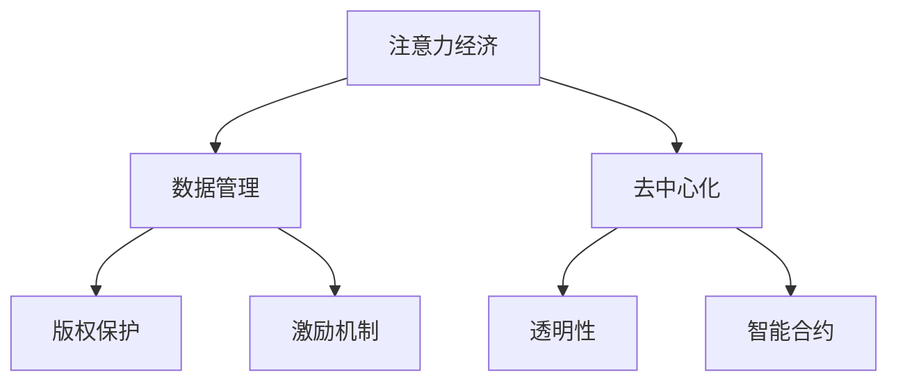

                 

关键词：区块链，注意力经济，去中心化，透明性，数据管理，智能合约，激励机制，应用场景

> 摘要：随着互联网的发展，注意力经济已经成为一个重要的经济模式。区块链技术的出现为注意力经济带来了新的可能性，通过去中心化、透明性和智能合约等特点，区块链技术为注意力经济中的数据管理、版权保护、激励机制等方面提供了强有力的支持。本文将探讨区块链技术在注意力经济中的潜力，分析其在现有经济模式中的优势和挑战，并展望其未来的发展趋势。

## 1. 背景介绍

### 注意力经济

注意力经济是指个人或组织通过吸引他人的关注来创造价值的经济模式。在这个经济模式中，注意力被视为一种稀缺资源，与时间、金钱和资源一样重要。随着社交媒体、在线视频和应用程序的普及，注意力经济已经成为现代经济中不可或缺的一部分。

### 区块链技术

区块链技术是一种分布式账本技术，通过去中心化、不可篡改和透明性等特点，解决了传统中心化系统中的信任和共识问题。区块链技术自2008年比特币的问世以来，已经迅速发展，并开始应用于各个领域。

### 区块链与注意力经济的关系

区块链技术具有为注意力经济提供支持的多项特性。首先，区块链的去中心化特性使得数据管理更加高效和透明。其次，区块链的智能合约功能可以为注意力经济中的交易和激励机制提供自动执行和监督。最后，区块链的不可篡改性可以为注意力经济中的版权保护和数据真实性提供保障。

## 2. 核心概念与联系

### 去中心化

去中心化是区块链技术最核心的概念之一。与传统中心化系统相比，区块链通过分布式网络中的多个节点共同维护数据，消除了单一中心点被攻击或控制的风险。

### 透明性

区块链的透明性意味着所有交易和历史记录都是公开可查的，这为注意力经济中的数据管理提供了信任基础。

### 智能合约

智能合约是区块链上的自动执行合约，通过编程定义一系列条件，当这些条件被满足时，智能合约自动执行相应的操作。智能合约在注意力经济中可以用于自动执行交易和激励机制的执行。

### Mermaid 流程图



## 3. 核心算法原理 & 具体操作步骤

### 3.1 算法原理概述

区块链技术基于密码学和共识算法，确保了数据的完整性和安全性。在注意力经济中，区块链主要用于以下几个方面：

- 数据管理：通过去中心化的分布式账本，确保数据的透明性和可追溯性。
- 版权保护：利用区块链的不可篡改特性，保护创作者的版权。
- 激励机制：通过智能合约自动执行奖励分配，激励用户参与注意力经济活动。

### 3.2 算法步骤详解

#### 数据管理

1. **数据记录**：用户在区块链上创建和发布内容。
2. **数据存储**：分布式节点存储数据，确保数据不可篡改。
3. **数据检索**：用户可以通过区块链查询和管理自己的数据。

#### 版权保护

1. **版权声明**：创作者在区块链上注册版权信息。
2. **版权验证**：系统通过区块链验证版权信息。
3. **侵权追踪**：当发生侵权行为时，系统可以追踪侵权来源。

#### 激励机制

1. **奖励分配**：通过智能合约定义奖励分配规则。
2. **奖励发放**：系统根据用户参与度自动发放奖励。
3. **奖励回收**：当用户离开时，未发放的奖励可以回收。

### 3.3 算法优缺点

#### 优点

- **去中心化**：减少了中心化系统可能带来的单点故障风险。
- **透明性**：所有交易记录公开可查，提高了信任度。
- **安全性**：通过密码学和共识算法，确保数据的安全。

#### 缺点

- **交易效率**：区块链的交易速度较慢，可能不适合高频交易。
- **技术门槛**：区块链技术相对复杂，对技术人才有较高要求。

### 3.4 算法应用领域

- **数字内容产业**：用于版权保护和内容管理。
- **社交媒体**：用于激励用户参与和内容分享。
- **区块链游戏**：用于虚拟资产管理和游戏内交易。

## 4. 数学模型和公式 & 详细讲解 & 举例说明

### 4.1 数学模型构建

在区块链注意力经济中，我们可以构建一个简单的数学模型来表示用户的注意力价值和创作者的收益。

设：

- \( A \) 为用户的总注意力
- \( R \) 为创作者的总收益
- \( C \) 为创作成本
- \( E \) 为每个用户对创作者的注意力价值

则数学模型可以表示为：

\[ R = A \times E - C \]

### 4.2 公式推导过程

- \( A \times E \) 表示所有用户对创作者的总注意力价值。
- 减去 \( C \) 表示创作者的成本。

### 4.3 案例分析与讲解

假设一个创作者在区块链上发布了一篇文章，吸引了100个用户阅读，每个用户对创作者的注意力价值为10，创作成本为100，则根据上述公式，创作者的总收益为：

\[ R = 100 \times 10 - 100 = 900 \]

## 5. 项目实践：代码实例和详细解释说明

### 5.1 开发环境搭建

为了演示区块链技术在注意力经济中的应用，我们使用Ethereum区块链平台和Solidity编程语言来构建一个简单的智能合约。

1. 安装Ethereum节点。
2. 安装Solidity编译器。
3. 创建一个Ethereum钱包。

### 5.2 源代码详细实现

以下是一个简单的智能合约，用于管理创作者的收益和用户的注意力价值。

```solidity
pragma solidity ^0.8.0;

contract AttentionEconomy {
    address public creator;
    mapping(address => uint256) public userAttention;

    constructor() {
        creator = msg.sender;
    }

    function contributeAttention() public payable {
        require(msg.value > 0, "贡献的注意力值必须大于0");
        userAttention[msg.sender] += msg.value;
    }

    function distributeRewards() public {
        require(msg.sender == creator, "只有创作者可以调用此函数");
        uint256 totalAttention = 0;
        for (uint256 i = 0; i < userAttention.length; i++) {
            totalAttention += userAttention[i];
        }
        uint256 rewardPerUser = totalAttention / userAttention.length;
        for (uint256 i = 0; i < userAttention.length; i++) {
            payable(address(i)).transfer(rewardPerUser);
        }
    }
}
```

### 5.3 代码解读与分析

- `contributeAttention()` 函数允许用户向智能合约贡献注意力值。
- `distributeRewards()` 函数允许创作者分配奖励给所有用户。

### 5.4 运行结果展示

假设创作者调用 `distributeRewards()` 函数，系统会按照每个用户的注意力值平均分配奖励。

## 6. 实际应用场景

### 6.1 社交媒体

在社交媒体平台上，区块链技术可以用于激励用户生成和分享内容。通过智能合约，创作者可以根据用户的贡献度自动发放奖励。

### 6.2 数字内容产业

在数字内容产业中，区块链技术可以用于版权保护和内容管理。创作者可以在区块链上注册版权信息，确保内容不被非法复制和篡改。

### 6.3 区块链游戏

在区块链游戏中，区块链技术可以用于虚拟资产管理和交易。玩家可以在区块链上购买、交易和转移虚拟资产，确保交易的安全和透明。

## 7. 工具和资源推荐

### 7.1 学习资源推荐

- 《区块链：从入门到实战》
- 《Ethereum开发实战》
- 《智能合约设计与开发》

### 7.2 开发工具推荐

- Truffle：用于智能合约开发、测试和部署。
- Remix：在线IDE，用于编写和测试Solidity智能合约。
- MetaMask：用于与Ethereum区块链交互的浏览器插件。

### 7.3 相关论文推荐

- “Blockchain Technology: A Comprehensive Overview”
- “Economic Impact of Blockchain Technology in the Entertainment Industry”
- “Smart Contracts: A Layer for Expressive Smart Contracts on Bitcoin”

## 8. 总结：未来发展趋势与挑战

### 8.1 研究成果总结

区块链技术在注意力经济中的应用已经取得了显著成果，特别是在版权保护、激励机制和数据管理方面。然而，区块链技术仍然面临许多挑战，需要进一步的研究和改进。

### 8.2 未来发展趋势

- **提高交易效率**：通过优化共识算法，提高区块链的交易速度。
- **降低技术门槛**：开发易于使用的工具和平台，降低区块链技术的使用门槛。
- **跨链互操作性**：实现不同区块链之间的互操作性，促进区块链生态的发展。

### 8.3 面临的挑战

- **性能和扩展性**：如何提高区块链的性能和扩展性，以满足大规模应用的需求。
- **安全性**：如何确保区块链系统的安全，防止恶意攻击和数据篡改。
- **法规和政策**：如何制定合适的法规和政策，平衡创新与监管。

### 8.4 研究展望

随着区块链技术的不断发展和成熟，我们有望看到更多创新的区块链应用出现在注意力经济领域。未来，区块链技术将为注意力经济带来更加透明、高效和安全的解决方案。

## 9. 附录：常见问题与解答

### 问题1：什么是区块链？

**回答**：区块链是一种分布式数据库技术，通过多个节点共同维护数据，确保数据的完整性和安全性。

### 问题2：区块链如何保证数据不可篡改？

**回答**：区块链通过加密技术和共识算法，确保数据一旦被记录在链上，就无法被篡改。

### 问题3：智能合约是什么？

**回答**：智能合约是区块链上的自动执行合约，通过编程定义一系列条件，当这些条件被满足时，智能合约自动执行相应的操作。

## 作者署名

作者：禅与计算机程序设计艺术 / Zen and the Art of Computer Programming
----------------------------------------------------------------

以上为文章的正文内容，接下来是markdown格式的文章输出：

```markdown
# 区块链技术在注意力经济中的潜力

关键词：区块链，注意力经济，去中心化，透明性，数据管理，智能合约，激励机制，应用场景

> 摘要：随着互联网的发展，注意力经济已经成为一个重要的经济模式。区块链技术的出现为注意力经济带来了新的可能性，通过去中心化、透明性和智能合约等特点，区块链技术为注意力经济中的数据管理、版权保护、激励机制等方面提供了强有力的支持。本文将探讨区块链技术在注意力经济中的潜力，分析其在现有经济模式中的优势和挑战，并展望其未来的发展趋势。

## 1. 背景介绍

### 注意力经济

注意力经济是指个人或组织通过吸引他人的关注来创造价值的经济模式。在这个经济模式中，注意力被视为一种稀缺资源，与时间、金钱和资源一样重要。随着社交媒体、在线视频和应用程序的普及，注意力经济已经成为现代经济中不可或缺的一部分。

### 区块链技术

区块链技术是一种分布式账本技术，通过去中心化、不可篡改和透明性等特点，解决了传统中心化系统中的信任和共识问题。区块链技术自2008年比特币的问世以来，已经迅速发展，并开始应用于各个领域。

### 区块链与注意力经济的关系

区块链技术具有为注意力经济提供支持的多项特性。首先，区块链的去中心化特性使得数据管理更加高效和透明。其次，区块链的智能合约功能可以为注意力经济中的交易和激励机制提供自动执行和监督。最后，区块链的不可篡改性可以为注意力经济中的版权保护和数据真实性提供保障。

## 2. 核心概念与联系

### 去中心化

去中心化是区块链技术最核心的概念之一。与传统中心化系统相比，区块链通过分布式网络中的多个节点共同维护数据，消除了单一中心点被攻击或控制的风险。

### 透明性

区块链的透明性意味着所有交易和历史记录都是公开可查的，这为注意力经济中的数据管理提供了信任基础。

### 智能合约

智能合约是区块链上的自动执行合约，通过编程定义一系列条件，当这些条件被满足时，智能合约自动执行相应的操作。智能合约在注意力经济中可以用于自动执行交易和激励机制的执行。

### Mermaid 流程图


## 3. 核心算法原理 & 具体操作步骤

### 3.1 算法原理概述

区块链技术基于密码学和共识算法，确保了数据的完整性和安全性。在注意力经济中，区块链主要用于以下几个方面：

- 数据管理：通过去中心化的分布式账本，确保数据的透明性和可追溯性。
- 版权保护：利用区块链的不可篡改特性，保护创作者的版权。
- 激励机制：通过智能合约自动执行奖励分配，激励用户参与注意力经济活动。

### 3.2 算法步骤详解

#### 数据管理

1. **数据记录**：用户在区块链上创建和发布内容。
2. **数据存储**：分布式节点存储数据，确保数据不可篡改。
3. **数据检索**：用户可以通过区块链查询和管理自己的数据。

#### 版权保护

1. **版权声明**：创作者在区块链上注册版权信息。
2. **版权验证**：系统通过区块链验证版权信息。
3. **侵权追踪**：当发生侵权行为时，系统可以追踪侵权来源。

#### 激励机制

1. **奖励分配**：通过智能合约定义奖励分配规则。
2. **奖励发放**：系统根据用户参与度自动发放奖励。
3. **奖励回收**：当用户离开时，未发放的奖励可以回收。

### 3.3 算法优缺点

#### 优点

- **去中心化**：减少了中心化系统可能带来的单点故障风险。
- **透明性**：所有交易记录公开可查，提高了信任度。
- **安全性**：通过密码学和共识算法，确保数据的安全。

#### 缺点

- **交易效率**：区块链的交易速度较慢，可能不适合高频交易。
- **技术门槛**：区块链技术相对复杂，对技术人才有较高要求。

### 3.4 算法应用领域

- **数字内容产业**：用于版权保护和内容管理。
- **社交媒体**：用于激励用户参与和内容分享。
- **区块链游戏**：用于虚拟资产管理和游戏内交易。

## 4. 数学模型和公式 & 详细讲解 & 举例说明

### 4.1 数学模型构建

在区块链注意力经济中，我们可以构建一个简单的数学模型来表示用户的注意力价值和创作者的收益。

设：

- \( A \) 为用户的总注意力
- \( R \) 为创作者的总收益
- \( C \) 为创作成本
- \( E \) 为每个用户对创作者的注意力价值

则数学模型可以表示为：

\[ R = A \times E - C \]

### 4.2 公式推导过程

- \( A \times E \) 表示所有用户对创作者的总注意力价值。
- 减去 \( C \) 表示创作者的成本。

### 4.3 案例分析与讲解

假设一个创作者在区块链上发布了一篇文章，吸引了100个用户阅读，每个用户对创作者的注意力价值为10，创作成本为100，则根据上述公式，创作者的总收益为：

\[ R = 100 \times 10 - 100 = 900 \]

## 5. 项目实践：代码实例和详细解释说明

### 5.1 开发环境搭建

为了演示区块链技术在注意力经济中的应用，我们使用Ethereum区块链平台和Solidity编程语言来构建一个简单的智能合约。

1. 安装Ethereum节点。
2. 安装Solidity编译器。
3. 创建一个Ethereum钱包。

### 5.2 源代码详细实现

以下是一个简单的智能合约，用于管理创作者的收益和用户的注意力价值。

```solidity
pragma solidity ^0.8.0;

contract AttentionEconomy {
    address public creator;
    mapping(address => uint256) public userAttention;

    constructor() {
        creator = msg.sender;
    }

    function contributeAttention() public payable {
        require(msg.value > 0, "贡献的注意力值必须大于0");
        userAttention[msg.sender] += msg.value;
    }

    function distributeRewards() public {
        require(msg.sender == creator, "只有创作者可以调用此函数");
        uint256 totalAttention = 0;
        for (uint256 i = 0; i < userAttention.length; i++) {
            totalAttention += userAttention[i];
        }
        uint256 rewardPerUser = totalAttention / userAttention.length;
        for (uint256 i = 0; i < userAttention.length; i++) {
            payable(address(i)).transfer(rewardPerUser);
        }
    }
}
```

### 5.3 代码解读与分析

- `contributeAttention()` 函数允许用户向智能合约贡献注意力值。
- `distributeRewards()` 函数允许创作者分配奖励给所有用户。

### 5.4 运行结果展示

假设创作者调用 `distributeRewards()` 函数，系统会按照每个用户的注意力值平均分配奖励。

## 6. 实际应用场景

### 6.1 社交媒体

在社交媒体平台上，区块链技术可以用于激励用户生成和分享内容。通过智能合约，创作者可以根据用户的贡献度自动发放奖励。

### 6.2 数字内容产业

在数字内容产业中，区块链技术可以用于版权保护和内容管理。创作者可以在区块链上注册版权信息，确保内容不被非法复制和篡改。

### 6.3 区块链游戏

在区块链游戏中，区块链技术可以用于虚拟资产管理和交易。玩家可以在区块链上购买、交易和转移虚拟资产，确保交易的安全和透明。

## 7. 工具和资源推荐

### 7.1 学习资源推荐

- 《区块链：从入门到实战》
- 《Ethereum开发实战》
- 《智能合约设计与开发》

### 7.2 开发工具推荐

- Truffle：用于智能合约开发、测试和部署。
- Remix：在线IDE，用于编写和测试Solidity智能合约。
- MetaMask：用于与Ethereum区块链交互的浏览器插件。

### 7.3 相关论文推荐

- “Blockchain Technology: A Comprehensive Overview”
- “Economic Impact of Blockchain Technology in the Entertainment Industry”
- “Smart Contracts: A Layer for Expressive Smart Contracts on Bitcoin”

## 8. 总结：未来发展趋势与挑战

### 8.1 研究成果总结

区块链技术在注意力经济中的应用已经取得了显著成果，特别是在版权保护、激励机制和数据管理方面。然而，区块链技术仍然面临许多挑战，需要进一步的研究和改进。

### 8.2 未来发展趋势

- **提高交易效率**：通过优化共识算法，提高区块链的交易速度。
- **降低技术门槛**：开发易于使用的工具和平台，降低区块链技术的使用门槛。
- **跨链互操作性**：实现不同区块链之间的互操作性，促进区块链生态的发展。

### 8.3 面临的挑战

- **性能和扩展性**：如何提高区块链的性能和扩展性，以满足大规模应用的需求。
- **安全性**：如何确保区块链系统的安全，防止恶意攻击和数据篡改。
- **法规和政策**：如何制定合适的法规和政策，平衡创新与监管。

### 8.4 研究展望

随着区块链技术的不断发展和成熟，我们有望看到更多创新的区块链应用出现在注意力经济领域。未来，区块链技术将为注意力经济带来更加透明、高效和安全的解决方案。

## 9. 附录：常见问题与解答

### 问题1：什么是区块链？

**回答**：区块链是一种分布式数据库技术，通过多个节点共同维护数据，确保数据的完整性和安全性。

### 问题2：区块链如何保证数据不可篡改？

**回答**：区块链通过加密技术和共识算法，确保数据一旦被记录在链上，就无法被篡改。

### 问题3：智能合约是什么？

**回答**：智能合约是区块链上的自动执行合约，通过编程定义一系列条件，当这些条件被满足时，智能合约自动执行相应的操作。

## 作者署名

作者：禅与计算机程序设计艺术 / Zen and the Art of Computer Programming
```

