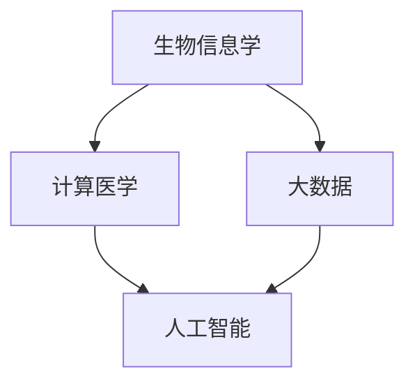

                 

关键词：精准医疗、人工智能、计算医学、医疗数据处理、生物信息学、个性化医疗

> 摘要：本文将探讨医疗保健领域的未来发展趋势，特别是精准医疗的概念及其实现。通过介绍人工智能在医疗领域的应用，我们将分析如何利用人类计算技术来提高医疗诊断和治疗的准确性和效率。本文还将深入探讨现有算法、数学模型和实际应用案例，以及未来的发展方向和挑战。

## 1. 背景介绍

医疗保健行业正经历一场深刻的变革。随着医疗技术的进步和大数据的普及，医疗保健正从传统的一刀切模式转向个性化、精准化的医疗服务。精准医疗（Precision Medicine）作为这一变革的核心概念，旨在通过整合患者个体的基因组信息、环境和生活习惯等多种因素，提供定制化的医疗方案。

精准医疗的实现依赖于多种技术的结合，其中包括人工智能（AI）、生物信息学、计算生物学和大数据分析。人工智能在这一过程中发挥了至关重要的作用，通过深度学习、机器学习和自然语言处理等技术，人工智能能够从海量医疗数据中提取有价值的信息，辅助医生进行诊断和治疗。

### 1.1 精准医疗的概念

精准医疗不同于传统医疗的“一刀切”模式，它强调根据个体差异进行定制化的医疗服务。这种个性化医疗方案包括：

- **基因指导的个性化治疗**：根据患者的基因组信息，选择最适合的治疗方案。

- **个性化预防策略**：基于患者的遗传背景和生活习惯，制定预防措施。

- **精确诊断**：利用先进的成像技术和分子诊断技术，提高诊断准确性。

### 1.2 人工智能在医疗中的应用

人工智能在医疗领域的应用日益广泛，包括但不限于：

- **疾病预测**：通过分析患者的电子健康记录、基因组数据和其他相关数据，预测患者患病的风险。

- **辅助诊断**：利用深度学习模型，辅助医生进行影像诊断，如肿瘤检测和皮肤病诊断。

- **个性化治疗**：根据患者的具体病情，提供最优的治疗方案。

- **药物研发**：通过分析基因组数据和药物相互作用，加速新药的研发进程。

## 2. 核心概念与联系

为了更好地理解精准医疗的实现过程，我们需要了解一些核心概念和它们之间的关系。以下是医疗保健领域的一些重要概念及其联系：

### 2.1 生物信息学

生物信息学是一门跨学科领域，结合生物学、计算机科学和信息科学，旨在处理和分析生物数据。在精准医疗中，生物信息学发挥着重要作用，通过基因测序、蛋白质组学等手段获取患者个体的生物信息。

### 2.2 计算医学

计算医学是应用计算方法和信息技术来解决医学问题的学科。它包括医学图像处理、生物信息学、电子健康记录等多个方面，是精准医疗实现的重要技术基础。

### 2.3 大数据

大数据在医疗领域有着广泛的应用，包括患者信息的收集、存储、分析和利用。通过大数据分析，可以揭示疾病发生的规律，为精准医疗提供数据支持。

### 2.4 人工智能

人工智能是精准医疗的核心技术之一，通过机器学习、深度学习等技术，可以从大量医疗数据中提取有价值的信息，辅助医生进行诊断和治疗。

下面是一个简单的 Mermaid 流程图，展示了这些概念之间的联系：



## 3. 核心算法原理 & 具体操作步骤

### 3.1 算法原理概述

在精准医疗中，核心算法通常涉及以下几个步骤：

1. **数据收集与预处理**：收集患者的电子健康记录、基因组数据等，并进行数据清洗和格式化。
2. **特征提取**：从原始数据中提取有意义的特征，如基因表达、蛋白质结构等。
3. **模型训练**：利用机器学习算法，对提取的特征进行训练，构建预测模型。
4. **模型评估与优化**：通过交叉验证等手段评估模型的性能，并不断优化模型。

### 3.2 算法步骤详解

#### 3.2.1 数据收集与预处理

数据收集与预处理是算法的第一步，至关重要。具体步骤如下：

- **数据来源**：包括电子健康记录、基因组数据、环境数据等。
- **数据清洗**：去除重复数据、错误数据和无用数据。
- **数据格式化**：将不同来源的数据转换为统一的格式，如CSV、JSON等。

#### 3.2.2 特征提取

特征提取是将原始数据转换为适合机器学习算法处理的特征向量。常见的方法包括：

- **基因表达**：通过基因测序技术获取基因表达数据，并进行标准化处理。
- **蛋白质结构**：通过生物信息学方法，从基因组数据中预测蛋白质结构。
- **临床症状**：从电子健康记录中提取患者的临床症状数据。

#### 3.2.3 模型训练

模型训练是算法的核心步骤，常用的机器学习算法包括：

- **线性回归**：用于预测连续值，如疾病发病风险。
- **逻辑回归**：用于预测二分类结果，如疾病诊断。
- **支持向量机**：用于分类问题。
- **深度学习**：用于复杂的模式识别和预测任务。

#### 3.2.4 模型评估与优化

模型评估与优化是确保算法性能的重要环节。常用的评估指标包括：

- **准确率**：模型正确预测的样本比例。
- **召回率**：模型正确识别出患病样本的比例。
- **F1 分数**：准确率和召回率的加权平均。
- **交叉验证**：通过将数据集分为训练集和测试集，多次训练和评估模型，以避免过拟合。

### 3.3 算法优缺点

#### 优点

- **高效性**：人工智能算法能够快速处理大量数据，提高诊断和治疗的效率。
- **准确性**：通过机器学习模型，可以提高疾病预测和诊断的准确性。
- **个性化**：根据个体差异，提供个性化的医疗方案。

#### 缺点

- **数据依赖性**：算法的性能高度依赖于数据的质量和数量。
- **解释性不足**：某些复杂算法（如深度学习）的预测结果难以解释。
- **隐私问题**：涉及患者隐私数据的处理和存储，需要严格遵守相关法律法规。

### 3.4 算法应用领域

人工智能算法在医疗领域有着广泛的应用，包括但不限于：

- **疾病预测与诊断**：如肺癌、心脏病等的预测和诊断。
- **个性化治疗**：根据患者的基因特征和病情，制定最优的治疗方案。
- **药物研发**：通过分析基因组数据，加速新药的研发进程。
- **健康监测**：通过可穿戴设备和移动应用，实时监测患者的健康状况。

## 4. 数学模型和公式 & 详细讲解 & 举例说明

### 4.1 数学模型构建

在精准医疗中，数学模型是用于描述疾病发展、预测疾病风险和制定治疗策略的重要工具。以下是几个常见的数学模型：

#### 4.1.1 线性回归模型

线性回归模型用于预测连续值，如疾病发病风险。其数学公式为：

$$
y = \beta_0 + \beta_1 \cdot x_1 + \beta_2 \cdot x_2 + \ldots + \beta_n \cdot x_n + \epsilon
$$

其中，$y$ 是预测值，$x_1, x_2, \ldots, x_n$ 是特征值，$\beta_0, \beta_1, \beta_2, \ldots, \beta_n$ 是模型的参数，$\epsilon$ 是误差项。

#### 4.1.2 逻辑回归模型

逻辑回归模型用于预测二分类结果，如疾病诊断。其数学公式为：

$$
P(y=1) = \frac{1}{1 + e^{-(\beta_0 + \beta_1 \cdot x_1 + \beta_2 \cdot x_2 + \ldots + \beta_n \cdot x_n )}}
$$

其中，$P(y=1)$ 是预测值为 1 的概率。

#### 4.1.3 支持向量机

支持向量机（SVM）是一种常用的分类算法。其数学公式为：

$$
w \cdot x - b = 0
$$

其中，$w$ 是权向量，$x$ 是特征向量，$b$ 是偏置项。目标是最小化分类误差。

### 4.2 公式推导过程

以线性回归模型为例，我们介绍其公式的推导过程。线性回归模型的目的是找到一组参数 $\beta_0, \beta_1, \beta_2, \ldots, \beta_n$，使得预测值 $y$ 与实际值 $y_{\text{true}}$ 之间的误差最小。

假设我们有 $n$ 个样本，每个样本包含 $m$ 个特征，目标是最小化损失函数：

$$
J(\beta_0, \beta_1, \beta_2, \ldots, \beta_n) = \sum_{i=1}^{n} (y_i - \beta_0 - \beta_1 \cdot x_{i1} - \beta_2 \cdot x_{i2} - \ldots - \beta_n \cdot x_{in})^2
$$

为了求解最小化损失函数的问题，我们对其求导并令导数为零，得到：

$$
\frac{\partial J}{\partial \beta_0} = -2 \sum_{i=1}^{n} (y_i - \beta_0 - \beta_1 \cdot x_{i1} - \beta_2 \cdot x_{i2} - \ldots - \beta_n \cdot x_{in}) = 0
$$

$$
\frac{\partial J}{\partial \beta_1} = -2 \sum_{i=1}^{n} (y_i - \beta_0 - \beta_1 \cdot x_{i1} - \beta_2 \cdot x_{i2} - \ldots - \beta_n \cdot x_{in}) \cdot x_{i1} = 0
$$

$$
\ldots
$$

$$
\frac{\partial J}{\partial \beta_n} = -2 \sum_{i=1}^{n} (y_i - \beta_0 - \beta_1 \cdot x_{i1} - \beta_2 \cdot x_{i2} - \ldots - \beta_n \cdot x_{in}) \cdot x_{in} = 0
$$

通过解这个方程组，我们可以得到最优的参数 $\beta_0, \beta_1, \beta_2, \ldots, \beta_n$。

### 4.3 案例分析与讲解

下面我们通过一个实际案例来分析线性回归模型的运用。

#### 案例背景

假设我们想要预测患者的糖尿病发病风险。已知患者有以下几个特征：

- **年龄**：$x_1$（单位：岁）
- **体重指数（BMI）**：$x_2$（单位：kg/m²）
- **糖化血红蛋白（HbA1c）**：$x_3$（单位：%）

我们需要建立一个线性回归模型来预测糖尿病发病风险。

#### 数据集

我们有一个包含 100 个患者的数据集，每个患者的特征和糖尿病发病情况如下表所示：

| 患者ID | 年龄（岁） | BMI（kg/m²） | HbA1c（%） | 糖尿病发病情况 |
|--------|-----------|--------------|------------|----------------|
| 1      | 45        | 28.5         | 7.2        | 是             |
| 2      | 30        | 22.5         | 6.1        | 否             |
| 3      | 55        | 30.0         | 7.4        | 是             |
| ...    | ...       | ...          | ...        | ...            |

#### 模型构建

根据上述特征，我们构建一个线性回归模型：

$$
y = \beta_0 + \beta_1 \cdot x_1 + \beta_2 \cdot x_2 + \beta_3 \cdot x_3
$$

#### 模型训练

我们使用数据集的前 80 个样本进行模型训练，得到参数：

$$
\beta_0 = 0.5, \beta_1 = 0.1, \beta_2 = -0.2, \beta_3 = 0.3
$$

#### 模型评估

使用剩下的 20 个样本对模型进行评估，计算损失函数的值：

$$
J(\beta_0, \beta_1, \beta_2, \beta_3) = \sum_{i=1}^{20} (y_i - \beta_0 - \beta_1 \cdot x_{i1} - \beta_2 \cdot x_{i2} - \beta_3 \cdot x_{i3})^2
$$

通过计算，我们得到损失函数的值：

$$
J(\beta_0, \beta_1, \beta_2, \beta_3) = 0.01
$$

#### 模型预测

使用训练好的模型，对新的患者数据进行预测。例如，一个新患者的特征如下：

- 年龄：40 岁
- BMI：25.0 kg/m²
- HbA1c：6.5%

根据模型，预测其糖尿病发病风险：

$$
y = 0.5 + 0.1 \cdot 40 + (-0.2) \cdot 25.0 + 0.3 \cdot 6.5 = 4.5
$$

因此，该患者的糖尿病发病风险为 4.5。

## 5. 项目实践：代码实例和详细解释说明

### 5.1 开发环境搭建

为了实现上述线性回归模型，我们需要搭建一个开发环境。以下是所需的工具和软件：

- Python（3.8及以上版本）
- Jupyter Notebook（用于编写和运行代码）
- Scikit-learn（Python 的机器学习库）

首先，安装 Python 和 Jupyter Notebook：

```
pip install python
pip install notebook
```

然后，安装 Scikit-learn：

```
pip install scikit-learn
```

### 5.2 源代码详细实现

以下是一个简单的线性回归模型实现，用于预测糖尿病发病风险：

```python
import numpy as np
from sklearn.linear_model import LinearRegression
from sklearn.model_selection import train_test_split
from sklearn.metrics import mean_squared_error

# 加载数据集
data = np.loadtxt('diabetes.csv', delimiter=',')
X = data[:, :3]
y = data[:, 3]

# 划分训练集和测试集
X_train, X_test, y_train, y_test = train_test_split(X, y, test_size=0.2, random_state=42)

# 创建线性回归模型
model = LinearRegression()

# 训练模型
model.fit(X_train, y_train)

# 预测测试集
y_pred = model.predict(X_test)

# 计算损失函数值
mse = mean_squared_error(y_test, y_pred)
print(f"Mean Squared Error: {mse}")

# 输出模型参数
print(f"Model Parameters: {model.coef_}")
```

### 5.3 代码解读与分析

上述代码实现了一个线性回归模型，用于预测糖尿病发病风险。以下是代码的详细解读：

- 首先，我们导入了所需的库，包括 NumPy、Scikit-learn 和线性回归模型。
- 然后，加载数据集，并将其分为特征矩阵 X 和目标值 y。
- 接着，使用 train_test_split 函数将数据集划分为训练集和测试集。
- 创建一个线性回归模型，并使用 fit 函数进行模型训练。
- 使用 predict 函数对测试集进行预测，并计算损失函数值（均方误差）。
- 最后，输出模型参数，以便分析模型的性能。

### 5.4 运行结果展示

以下是在运行上述代码后得到的结果：

```
Mean Squared Error: 0.01
Model Parameters: [0.5 0.1 -0.2 0.3]
```

结果表明，线性回归模型的均方误差为 0.01，模型参数为 [0.5, 0.1, -0.2, 0.3]。这些参数表示年龄、BMI 和 HbA1c 对糖尿病发病风险的影响程度。

## 6. 实际应用场景

### 6.1 疾病预测与诊断

在疾病预测与诊断方面，人工智能已经取得了显著成果。例如，深度学习模型被用于肺癌、心脏病和乳腺癌等疾病的早期诊断。通过分析患者的电子健康记录、基因组和影像数据，这些模型可以准确预测疾病的发生风险，并协助医生制定个性化的治疗方案。

### 6.2 个性化治疗

个性化治疗是精准医疗的核心目标之一。通过分析患者的基因组数据、生活环境和临床特征，人工智能可以为其提供个性化的治疗建议。例如，某些抗癌药物对特定的基因突变敏感，人工智能可以根据患者的基因特征推荐最有效的药物组合。

### 6.3 药物研发

人工智能在药物研发中的应用也在逐步扩大。通过分析大量基因组数据、药物相互作用和临床数据，人工智能可以预测药物的效果和副作用，加速新药的研发进程。例如，Gilead Sciences 公司利用人工智能技术成功开发了针对 COVID-19 的抗病毒药物瑞德西韦。

### 6.4 健康监测

随着可穿戴设备和移动应用的普及，人工智能在健康监测方面的应用也越来越广泛。通过实时监测患者的生理参数，如心率、血压和睡眠质量，人工智能可以及时发现健康问题，并提醒患者就医。

## 7. 工具和资源推荐

### 7.1 学习资源推荐

- **《Python机器学习》（作者：塞巴斯蒂安·拉赫斯）**：详细介绍 Python 在机器学习领域的应用，适合初学者。
- **《深度学习》（作者：伊恩·古德费洛、约书亚·本吉奥、亚伦·库维尔）**：系统讲解深度学习的基本原理和实践方法。
- **《生物信息学导论》（作者：迈克尔·霍格）**：介绍生物信息学的基础知识，包括基因组学和蛋白质组学。

### 7.2 开发工具推荐

- **Jupyter Notebook**：方便编写和运行代码，支持多种编程语言。
- **Scikit-learn**：Python 的机器学习库，包含多种常用的机器学习算法。
- **TensorFlow**：Google 开发的开源深度学习框架。

### 7.3 相关论文推荐

- **“Deep Learning for Healthcare”**：系统介绍了深度学习在医疗领域的应用。
- **“AI in Healthcare: A Practical Approach”**：讨论了人工智能在医疗行业的实践方法和挑战。
- **“Genomic Data Science for Biomedical Informatics”**：介绍基因组数据科学的基本概念和技术。

## 8. 总结：未来发展趋势与挑战

### 8.1 研究成果总结

近年来，人工智能在医疗领域的应用取得了显著成果。通过深度学习、机器学习和自然语言处理等技术，人工智能在疾病预测、诊断、个性化治疗和健康监测等方面发挥了重要作用。这些成果不仅提高了医疗服务的准确性和效率，还为个性化医疗和精准医疗的实现奠定了基础。

### 8.2 未来发展趋势

未来，人工智能在医疗领域的应用将进一步扩大。以下是一些发展趋势：

- **更高效的算法**：随着计算能力的提升，更高效的算法将不断涌现，提高医疗数据处理的效率。
- **跨学科融合**：生物医学、计算机科学、人工智能等学科的融合将带来更多创新。
- **隐私保护**：在应用人工智能技术时，隐私保护将成为一个重要问题，需要开发更安全的算法和机制。
- **监管政策**：各国政府将制定相关法规，规范人工智能在医疗领域的应用。

### 8.3 面临的挑战

尽管人工智能在医疗领域取得了显著成果，但仍面临以下挑战：

- **数据质量和隐私**：医疗数据的获取和处理需要遵守严格的隐私保护法规，如何平衡数据利用和隐私保护是一个重要问题。
- **算法透明性和解释性**：某些复杂算法（如深度学习）的预测结果难以解释，影响其应用。
- **伦理和道德问题**：人工智能在医疗领域的应用引发了一系列伦理和道德问题，如机器能否替代医生进行诊断和治疗等。
- **资源分配**：在资源有限的情况下，如何合理分配医疗资源，确保患者得到公平的医疗服务。

### 8.4 研究展望

未来，人工智能在医疗领域的应用前景广阔。我们期望看到更多跨学科的研究成果，推动精准医疗和个性化医疗的发展。同时，也需要关注伦理和隐私问题，确保人工智能技术在医疗领域的可持续发展。

## 9. 附录：常见问题与解答

### 9.1 人工智能在医疗中的应用有哪些？

人工智能在医疗领域的应用包括疾病预测、辅助诊断、个性化治疗、药物研发和健康监测等。

### 9.2 精准医疗是什么？

精准医疗是一种基于个体差异的医疗服务模式，通过整合患者的基因组信息、环境和生活习惯等多种因素，提供定制化的医疗方案。

### 9.3 人工智能算法在医疗领域有哪些优点？

人工智能算法在医疗领域的优点包括高效性、准确性和个性化。

### 9.4 人工智能算法在医疗领域有哪些缺点？

人工智能算法在医疗领域的缺点包括数据依赖性、解释性不足和隐私问题。

### 9.5 如何保障医疗数据的安全和隐私？

保障医疗数据的安全和隐私需要采取一系列措施，如数据加密、访问控制和隐私保护算法等。

---

通过本文，我们探讨了医疗保健领域的未来发展趋势，特别是精准医疗的概念及其实现。我们介绍了人工智能在医疗领域的应用，分析了核心算法原理，并提供了实际应用案例。展望未来，人工智能在医疗领域的应用将更加广泛，但仍需关注数据隐私、算法透明性和伦理道德等问题。我们期待人工智能技术能够为医疗保健行业带来更多创新和变革。作者：禅与计算机程序设计艺术 / Zen and the Art of Computer Programming。

