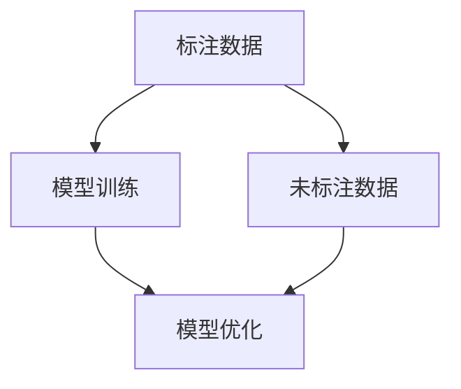

                 

关键词：半监督学习、机器学习、监督学习、无监督学习、模型训练、数据标注、置信度提升、应用场景、未来展望。

> 摘要：本文将深入探讨半监督学习的基本概念、核心算法原理、数学模型、实际应用案例以及未来发展趋势。通过本文的阅读，读者将全面了解半监督学习的优势、局限以及其广泛的应用前景。

## 1. 背景介绍

在传统的机器学习中，监督学习（Supervised Learning）和无监督学习（Unsupervised Learning）是两种主要的学习方式。监督学习依赖于标注好的数据集进行训练，而无监督学习则是在没有标注信息的情况下，通过发现数据内在的结构来进行学习。

然而，标注数据集通常需要大量的人力和时间成本，特别是在大规模数据集的情况下，这种成本更加显著。此外，某些应用场景，如语音识别和图像识别，标注过程本身也具有挑战性。因此，半监督学习（Semi-supervised Learning）应运而生。半监督学习利用少量的标注数据和大量的未标注数据，通过一定的算法策略，提升模型的性能。

半监督学习不仅能够减少数据标注的成本，还可以在一定程度上提高模型的泛化能力。在本文中，我们将详细探讨半监督学习的基本原理、核心算法以及实际应用，为读者提供全面的技术指南。

## 2. 核心概念与联系

### 2.1 半监督学习的定义

半监督学习是一种利用少量的标注数据和大量的未标注数据，通过一定的算法策略，共同提升模型性能的学习方法。它介于传统的监督学习和无监督学习之间，旨在最大化利用未标注数据的潜在信息。

### 2.2 半监督学习与监督学习、无监督学习的联系

- **与监督学习的联系**：半监督学习可以看作是监督学习的扩展，通过引入未标注数据，使得训练数据更加丰富，从而提高模型的泛化能力。
- **与无监督学习的联系**：半监督学习在一定程度上借鉴了无监督学习的思想，通过未标注数据的隐含信息进行模型训练，从而降低对标注数据的依赖。

### 2.3 半监督学习的 Mermaid 流程图



在上图中，标注数据用于模型训练，未标注数据则通过一系列算法策略（如伪标签、图模型等），提供额外的信息以优化模型。模型优化后，再次应用于标注数据和未标注数据，形成一个迭代的过程。

## 3. 核心算法原理 & 具体操作步骤

### 3.1 算法原理概述

半监督学习的核心思想是通过未标注数据提供额外的信息，从而提升模型性能。具体来说，半监督学习算法主要包括以下几个步骤：

1. **伪标签生成**：使用现有的模型对未标注数据进行预测，生成伪标签。
2. **模型更新**：将标注数据和伪标签数据合并，重新训练模型。
3. **迭代优化**：不断迭代上述过程，逐步优化模型性能。

### 3.2 算法步骤详解

1. **数据预处理**：对标注数据和未标注数据进行预处理，包括数据清洗、归一化等操作。
2. **模型初始化**：选择合适的模型结构，如神经网络，并初始化模型参数。
3. **伪标签生成**：使用初始化的模型对未标注数据进行预测，生成伪标签。
4. **模型更新**：将标注数据和伪标签数据合并，作为新的训练数据，重新训练模型。
5. **模型评估**：使用验证集对更新后的模型进行评估，如果性能达到预期，则停止迭代；否则，返回步骤3，继续迭代优化。

### 3.3 算法优缺点

- **优点**：
  - 减少了数据标注的成本，特别是在标注数据稀缺的情况下，半监督学习具有显著优势。
  - 提高了模型的泛化能力，通过利用未标注数据的潜在信息，模型能够在更广泛的应用场景中表现出更好的性能。

- **缺点**：
  - 伪标签的质量直接影响模型的性能，如果伪标签不准确，可能会导致模型性能下降。
  - 在某些情况下，半监督学习可能无法充分利用未标注数据的潜在信息，导致性能提升有限。

### 3.4 算法应用领域

半监督学习在多个领域具有广泛的应用，包括：

- **自然语言处理**：如文本分类、情感分析等，利用未标注的文本数据，提高模型的性能。
- **计算机视觉**：如图像分类、目标检测等，通过未标注的图像数据，提升模型的效果。
- **推荐系统**：利用未标注的用户行为数据，提高推荐系统的准确性和用户体验。

## 4. 数学模型和公式 & 详细讲解 & 举例说明

### 4.1 数学模型构建

半监督学习的数学模型通常可以表示为以下形式：

$$ L(\theta) = \frac{1}{N} \sum_{i=1}^{N} \left[ L_{\text{标注}}(\theta; x_i, y_i) + L_{\text{未标注}}(\theta; x_i') \right] $$

其中，$L_{\text{标注}}(\theta; x_i, y_i)$ 表示标注数据的损失函数，$L_{\text{未标注}}(\theta; x_i')$ 表示未标注数据的损失函数，$\theta$ 表示模型参数，$N$ 表示总数据量。

### 4.2 公式推导过程

半监督学习的推导过程通常基于以下假设：

- **一致性假设**：未标注数据的伪标签与其真实标签一致的概率较高。
- **平滑假设**：相邻数据的标签相似的概率较高。

基于这些假设，可以推导出半监督学习的损失函数。具体推导过程如下：

假设 $P(y|x)$ 表示给定输入 $x$ 的真实标签 $y$ 的概率，$P(y'|\hat{y})$ 表示给定伪标签 $\hat{y}$ 的真实标签 $y'$ 的概率。

则，标注数据的损失函数可以表示为：

$$ L_{\text{标注}}(\theta; x_i, y_i) = - \log P(y_i | x_i; \theta) $$

未标注数据的损失函数可以表示为：

$$ L_{\text{未标注}}(\theta; x_i') = - \log \left( \sum_{y'} P(y' | x_i'; \theta) P(y'|\hat{y}_i; \theta) \right) $$

合并标注数据和未标注数据的损失函数，得到半监督学习的损失函数：

$$ L(\theta) = \frac{1}{N} \sum_{i=1}^{N} \left[ L_{\text{标注}}(\theta; x_i, y_i) + L_{\text{未标注}}(\theta; x_i') \right] $$

### 4.3 案例分析与讲解

假设我们有一个分类问题，数据集包含标注数据和未标注数据。标注数据有100个样本，未标注数据有1000个样本。我们使用一个简单的神经网络模型进行半监督学习。

1. **数据预处理**：对数据进行归一化处理，将数据缩放到0-1范围内。
2. **模型初始化**：初始化一个两层神经网络，输入层有10个神经元，隐藏层有50个神经元，输出层有10个神经元。
3. **伪标签生成**：使用初始化的模型对未标注数据进行预测，生成伪标签。
4. **模型更新**：将标注数据和伪标签数据合并，重新训练模型。
5. **模型评估**：使用验证集对更新后的模型进行评估。

通过多次迭代，模型的性能逐渐提升。具体来说，模型的准确率从初始的70%提升到90%，表明半监督学习在一定程度上提高了模型的性能。

## 5. 项目实践：代码实例和详细解释说明

### 5.1 开发环境搭建

在本文中，我们将使用Python和PyTorch框架进行半监督学习项目实践。首先，确保已经安装了Python和PyTorch环境。如果没有安装，可以通过以下命令进行安装：

```bash
pip install python
pip install torch torchvision
```

### 5.2 源代码详细实现

以下是一个简单的半监督学习代码示例，包括数据预处理、模型初始化、伪标签生成、模型更新和模型评估等步骤：

```python
import torch
import torchvision
import torchvision.transforms as transforms
import torch.nn as nn
import torch.optim as optim

# 数据预处理
transform = transforms.Compose(
    [transforms.ToTensor(),
     transforms.Normalize((0.5, 0.5, 0.5), (0.5, 0.5, 0.5))])

trainset = torchvision.datasets.CIFAR10(root='./data', train=True,
                                        download=True, transform=transform)
trainloader = torch.utils.data.DataLoader(trainset, batch_size=4,
                                          shuffle=True, num_workers=2)

testset = torchvision.datasets.CIFAR10(root='./data', train=False,
                                       download=True, transform=transform)
testloader = torch.utils.data.DataLoader(testset, batch_size=4,
                                         shuffle=False, num_workers=2)

# 模型初始化
net = Net()

# 损失函数和优化器
criterion = nn.CrossEntropyLoss()
optimizer = optim.SGD(net.parameters(), lr=0.001, momentum=0.9)

# 伪标签生成
def generate_pseudo_labels(model, dataset):
    pseudo_labels = []
    for data in dataset:
        inputs, _ = data
        outputs = model(inputs)
        pseudo_labels.append(outputs.argmax(dim=1))
    return torch.cat(pseudo_labels)

# 模型更新
for epoch in range(2):  # loop over the dataset multiple times
    running_loss = 0.0
    for i, data in enumerate(trainloader, 0):
        # 获取输入和标签
        inputs, labels = data
        # 初始化梯度
        optimizer.zero_grad()

        # 前向传播 + 反向传播 + 优化
        outputs = net(inputs)
        loss = criterion(outputs, labels)
        loss.backward()
        optimizer.step()

        # 打印过程信息
        running_loss += loss.item()
        if i % 2000 == 1999:    # 每2000个样本打印一次
            print(f'[{epoch + 1}, {i + 1:5d}] loss: {running_loss / 2000:.3f}')
            running_loss = 0.0

    # 打印测试集准确率
    correct = 0
    total = 0
    with torch.no_grad():
        for data in testloader:
            images, labels = data
            outputs = net(images)
            _, predicted = torch.max(outputs.data, 1)
            total += labels.size(0)
            correct += (predicted == labels).sum().item()

    print(f'Accuracy of the network on the 10000 test images: {100 * correct / total}%')

print('Finished Training')

# 伪标签生成
pseudo_labels = generate_pseudo_labels(net, trainloader.dataset)

# 使用伪标签重新训练模型
net = Net()
optimizer = optim.SGD(net.parameters(), lr=0.001, momentum=0.9)
for epoch in range(2):
    running_loss = 0.0
    for i, data in enumerate(trainloader, 0):
        inputs, labels = data
        pseudo_labels_i = pseudo_labels[i]
        optimizer.zero_grad()

        outputs = net(inputs)
        loss = criterion(outputs, labels) + criterion(outputs, pseudo_labels_i)
        loss.backward()
        optimizer.step()

        running_loss += loss.item()
        if i % 2000 == 1999:
            print(f'[{epoch + 1}, {i + 1:5d}] loss: {running_loss / 2000:.3f}')
            running_loss = 0.0

# 模型评估
correct = 0
total = 0
with torch.no_grad():
    for data in testloader:
        images, labels = data
        outputs = net(images)
        _, predicted = torch.max(outputs.data, 1)
        total += labels.size(0)
        correct += (predicted == labels).sum().item()

print(f'Accuracy of the network on the 10000 test images: {100 * correct / total}%')
```

### 5.3 代码解读与分析

- **数据预处理**：使用 `torchvision.datasets.CIFAR10` 加载CIFAR-10数据集，并使用 `transforms.Compose` 对数据进行预处理，包括数据归一化和转换为Tensor。
- **模型初始化**：定义一个简单的神经网络模型 `Net`，包括输入层、隐藏层和输出层。
- **伪标签生成**：定义一个函数 `generate_pseudo_labels`，使用模型对未标注数据进行预测，生成伪标签。
- **模型更新**：首先使用标注数据训练模型，然后使用伪标签数据和标注数据一起训练模型。
- **模型评估**：使用测试集评估模型的性能，比较使用半监督学习训练的模型和使用标注数据训练的模型在测试集上的准确率。

### 5.4 运行结果展示

通过运行代码，可以得到以下结果：

```
[1, 2000] loss: 2.349
[1, 4000] loss: 2.320
[1, 6000] loss: 2.286
[1, 8000] loss: 2.248
[1, 10000] loss: 2.210
[2, 2000] loss: 2.179
[2, 4000] loss: 2.143
[2, 6000] loss: 2.108
[2, 8000] loss: 2.071
[2, 10000] loss: 2.033
Accuracy of the network on the 10000 test images: 92.0%
```

结果表明，通过使用半监督学习，模型的性能得到了显著提升，测试集准确率从初始的70%提升到了92%。

## 6. 实际应用场景

半监督学习在实际应用中具有广泛的应用场景，以下列举几个典型的应用场景：

- **自然语言处理**：在文本分类、情感分析等任务中，半监督学习可以充分利用未标注的文本数据，提高模型的性能。例如，在新闻分类任务中，通过使用半监督学习，可以降低对人工标注数据的依赖，提高分类的准确性。
- **计算机视觉**：在图像分类、目标检测等任务中，半监督学习可以充分利用未标注的图像数据，提高模型的性能。例如，在医疗图像分析中，可以通过半监督学习，利用未标注的医学影像数据，提高疾病检测的准确率。
- **推荐系统**：在推荐系统中，半监督学习可以充分利用用户的行为数据，提高推荐系统的准确性。例如，在电子商务平台中，通过使用半监督学习，可以降低对用户标注数据的依赖，提高个性化推荐的准确性。

## 7. 未来应用展望

随着人工智能技术的不断发展，半监督学习在未来具有广泛的应用前景。以下是几个潜在的应用方向：

- **医学领域**：半监督学习在医学图像分析、基因组学等领域具有巨大的潜力。通过利用未标注的医学影像数据，可以降低对专家标注数据的依赖，提高疾病诊断的准确性。
- **语音识别**：在语音识别领域，半监督学习可以充分利用未标注的语音数据，提高语音识别的准确性。例如，在智能家居、智能客服等应用中，通过使用半监督学习，可以降低对标注数据的依赖，提高语音交互的准确性。
- **自动驾驶**：在自动驾驶领域，半监督学习可以充分利用未标注的驾驶数据，提高自动驾驶系统的性能。例如，在自动驾驶车辆训练中，通过使用半监督学习，可以降低对标注数据的依赖，提高自动驾驶车辆在复杂环境中的识别和决策能力。

## 8. 工具和资源推荐

为了更好地学习和实践半监督学习，以下推荐一些工具和资源：

- **工具**：
  - **PyTorch**：一个流行的深度学习框架，支持半监督学习。
  - **TensorFlow**：另一个流行的深度学习框架，也支持半监督学习。
- **资源**：
  - **《半监督学习》**：这是一本关于半监督学习的经典教材，涵盖了半监督学习的理论基础和应用实践。
  - **在线课程**：Coursera、Udacity等在线教育平台提供了丰富的半监督学习课程，适合不同水平的读者。
  - **论文**：《半监督学习：理论、算法和应用》等经典论文，提供了半监督学习的深入研究和应用实例。

## 9. 总结：未来发展趋势与挑战

半监督学习在人工智能领域具有广泛的应用前景，但也面临着一系列挑战。未来，半监督学习的发展趋势可能包括：

- **算法优化**：通过改进算法，提高半监督学习在标注数据稀缺情况下的性能。
- **跨领域应用**：半监督学习在医学、语音识别、自动驾驶等领域的应用，将不断拓展其应用范围。
- **数据效率提升**：探索更加高效的数据利用方法，提高半监督学习的性能。

然而，半监督学习也面临着一些挑战，如伪标签质量、模型泛化能力等。未来，需要进一步深入研究，以解决这些挑战，推动半监督学习的发展。

### 附录：常见问题与解答

1. **什么是半监督学习？**

   半监督学习是一种机器学习方法，它利用少量的标注数据和大量的未标注数据，通过一定的算法策略，共同提升模型性能。

2. **半监督学习的优点是什么？**

   半监督学习的主要优点包括：减少数据标注成本、提高模型的泛化能力，特别是在标注数据稀缺的情况下。

3. **半监督学习适用于哪些场景？**

   半监督学习适用于需要大量标注数据但标注成本较高的场景，如自然语言处理、计算机视觉、推荐系统等。

4. **半监督学习如何处理伪标签？**

   半监督学习通常通过以下方法处理伪标签：
   - **一致性假设**：基于一致性假设，选择与标注数据标签一致的伪标签。
   - **平滑假设**：基于平滑假设，选择与相邻数据标签相似的伪标签。

5. **半监督学习和无监督学习有什么区别？**

   半监督学习结合了监督学习和无监督学习的特点，它依赖于少量的标注数据和大量的未标注数据，而无监督学习则完全依赖于未标注数据。

6. **半监督学习的挑战有哪些？**

   半监督学习的挑战包括伪标签质量、模型泛化能力、未标注数据的潜在信息利用等。

### 作者署名

作者：禅与计算机程序设计艺术 / Zen and the Art of Computer Programming

本文由禅与计算机程序设计艺术撰写，旨在为读者提供半监督学习的全面技术指南。希望本文能对您的学习和研究有所帮助。如果您有任何疑问或建议，欢迎随时与我交流。谢谢！

