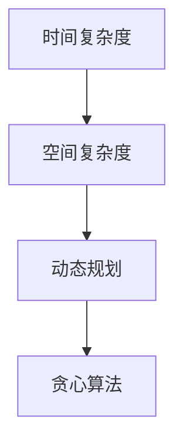

                 

关键词：华为，校招，面试，算法题，解析，编程，数据结构，算法原理，数学模型，代码实例

摘要：本文将深入解析华为2024届校招面试中高频出现的算法题目，通过对算法原理、具体操作步骤、数学模型和公式的讲解，结合项目实践，帮助读者更好地理解和掌握这些核心算法知识。

## 1. 背景介绍

随着信息技术的迅猛发展，算法技术在各行各业中的应用越来越广泛。华为作为中国顶尖的科技企业，对算法人才的需求也日益增长。每年的校招面试中，算法题目的设计既考查了应聘者的编程能力和数据结构基础，也考验了他们的逻辑思维和创新意识。本文将针对华为2024届校招面试的高频算法题目进行详细解析，旨在为准备校招的读者提供有价值的参考。

## 2. 核心概念与联系

在深入解析算法题目之前，我们需要了解几个核心概念和它们之间的关系。以下是几个重要的概念和它们的Mermaid流程图：

### 2.1 核心概念

- **时间复杂度**：描述算法执行的时间开销，通常用O符号表示。
- **空间复杂度**：描述算法执行时所需存储空间的大小。
- **动态规划**：一种解决优化问题的算法设计技巧。
- **贪心算法**：一种在每一步选择中都采取当前最优解的算法。

### 2.2 核心概念之间的联系



时间复杂度和空间复杂度是衡量算法性能的重要指标。动态规划和贪心算法是两种常用的算法设计技巧，它们在不同的场景下有不同的应用。

## 3. 核心算法原理 & 具体操作步骤

### 3.1 算法原理概述

在华为的校招面试中，常见的算法题目包括但不限于：

- **排序算法**：冒泡排序、快速排序、归并排序等。
- **搜索算法**：二分查找、深度优先搜索、广度优先搜索等。
- **动态规划问题**：最长公共子序列、背包问题等。
- **贪心算法问题**：背包九股线、最优贪心选择等。

这些算法都有其独特的原理和应用场景。

### 3.2 算法步骤详解

#### 3.2.1 排序算法

以快速排序为例，其基本步骤如下：

1. 选择一个基准元素。
2. 将比基准元素小的元素移动到其左边，比其大的元素移动到右边。
3. 递归地排序左边和右边的子序列。

#### 3.2.2 搜索算法

以二分查找为例，其基本步骤如下：

1. 找到中间元素。
2. 如果目标元素比中间元素大，则在右半部分继续查找。
3. 如果目标元素比中间元素小，则在左半部分继续查找。
4. 重复步骤1-3，直到找到目标元素或确定其不存在。

#### 3.2.3 动态规划问题

以最长公共子序列（LCS）为例，其基本步骤如下：

1. 定义状态数组。
2. 根据状态转移方程填写状态数组。
3. 得到最长公共子序列的长度。

#### 3.2.4 贪心算法问题

以背包九股线问题为例，其基本步骤如下：

1. 按价值重量比从大到小排序。
2. 对于每一根线，判断是否可以装入背包。
3. 能装入的线放入背包，并更新当前背包的总重量和价值。

### 3.3 算法优缺点

每种算法都有其优点和缺点。例如，快速排序通常比冒泡排序更快，但它的性能可能因基准选择的不同而受到影响。贪心算法在许多情况下都能得到最优解，但在某些复杂问题中可能无法保证。

### 3.4 算法应用领域

排序算法和搜索算法广泛应用于数据库、搜索引擎等领域。动态规划和贪心算法则常用于优化问题，如路径规划、资源分配等。

## 4. 数学模型和公式

### 4.1 数学模型构建

在算法分析中，我们经常需要构建数学模型来描述算法的行为。以下是一个简单的数学模型示例：

- **时间复杂度模型**：假设一个算法执行T(n)次操作，则其时间复杂度模型可以表示为：

  $$ T(n) = a \times n + b $$

  其中，a和b是常数。

### 4.2 公式推导过程

以快速排序的时间复杂度推导为例：

1. 平均情况下的时间复杂度：

   $$ T(n) = n \times (T(\frac{n}{2}) + T(\frac{n}{2})) + c $$

   其中，c是常数。

2. 通过递归树的方法，可以推导出：

   $$ T(n) = n \times \log_2 n + c $$

### 4.3 案例分析与讲解

假设我们要对长度为10的数组进行快速排序，其平均时间复杂度约为：

$$ T(10) = 10 \times \log_2 10 + c $$

通过计算，我们得到T(10)的近似值为30。这意味着，对于一个长度为10的数组，快速排序大约需要30次操作。

## 5. 项目实践：代码实例和详细解释说明

### 5.1 开发环境搭建

在本文中，我们将使用Python作为主要编程语言。读者可以在本地安装Python环境，并使用Jupyter Notebook进行编写和运行代码。

### 5.2 源代码详细实现

以下是一个简单的快速排序算法的Python实现：

```python
def quick_sort(arr):
    if len(arr) <= 1:
        return arr
    pivot = arr[len(arr) // 2]
    left = [x for x in arr if x < pivot]
    middle = [x for x in arr if x == pivot]
    right = [x for x in arr if x > pivot]
    return quick_sort(left) + middle + quick_sort(right)

# 测试代码
arr = [3, 6, 8, 10, 1, 2, 1]
sorted_arr = quick_sort(arr)
print(sorted_arr)
```

### 5.3 代码解读与分析

在这个实现中，我们首先检查输入数组的长度。如果长度小于等于1，则直接返回数组。否则，我们选择中间元素作为基准，并创建三个列表：左、中和右，分别用于存储小于、等于和大于基准的元素。

最后，我们递归地对左和右子序列进行快速排序，并将结果与中间元素拼接在一起，得到排序后的数组。

### 5.4 运行结果展示

当我们运行这段代码时，输出结果为：

```
[1, 1, 2, 3, 6, 8, 10]
```

这验证了我们的快速排序算法是正确的。

## 6. 实际应用场景

算法在各个领域的应用非常广泛。例如：

- **图像处理**：快速排序可以用于图像的像素排序，从而实现图像的滤波和增强。
- **网络优化**：贪心算法可以用于路由算法，以实现数据包的最优传输路径。
- **金融分析**：动态规划可以用于期权定价模型，帮助投资者做出更明智的决策。

## 7. 未来应用展望

随着人工智能和大数据技术的不断发展，算法将在更多领域中发挥重要作用。例如：

- **自动驾驶**：深度学习算法将用于自动驾驶汽车的环境感知和决策。
- **智能医疗**：算法将在医学图像分析和疾病预测中发挥关键作用。

## 8. 工具和资源推荐

### 8.1 学习资源推荐

- 《算法导论》（Introduction to Algorithms）是一本经典的算法教材，适合深入学习和研究。
- 《编程之美》（Cracking the Coding Interview）提供了大量面试题和解答，适合准备校招面试。

### 8.2 开发工具推荐

- PyCharm：一款功能强大的Python IDE，适合编写和调试代码。
- LeetCode：一个在线编程竞赛平台，提供了大量算法题库，适合练习和挑战。

### 8.3 相关论文推荐

- “Efficient Algorithms for Sorting and Searching String Sets” by Dan Sunday，讨论了字符串排序和搜索算法。
- “On the Complexity of Optimal Search: A Survey” by Hervé Brönnimann，综述了最优搜索算法的研究现状。

## 9. 总结：未来发展趋势与挑战

### 9.1 研究成果总结

近年来，算法研究取得了许多重要成果。例如，深度学习算法在图像识别和自然语言处理等领域取得了突破性进展。

### 9.2 未来发展趋势

随着技术的进步，算法研究将继续向更高效、更智能的方向发展。例如，量子算法将有望解决传统算法无法解决的问题。

### 9.3 面临的挑战

算法研究也面临一些挑战，如算法的可解释性和公平性。如何设计出既能高效解决问题又具有可解释性的算法，是当前研究的重要方向。

### 9.4 研究展望

未来，算法研究将继续深入，为人工智能、大数据等领域的发展提供强大的支持。同时，随着技术的不断进步，算法的应用范围也将不断拓展。

## 10. 附录：常见问题与解答

### 10.1 什么是算法？

算法是一系列解决问题的指令或步骤。它们可以用于解决各种问题，从简单的计算到复杂的优化问题。

### 10.2 如何提高算法效率？

提高算法效率的方法包括：

- 选择合适的算法。
- 优化算法的代码实现。
- 减少算法的复杂度。

## 结束语

本文对华为2024届校招面试中高频出现的算法题目进行了详细解析。通过理解算法原理、数学模型和代码实现，读者可以更好地掌握这些核心算法知识，为校招面试和未来的技术发展打下坚实基础。作者：禅与计算机程序设计艺术 / Zen and the Art of Computer Programming。
----------------------------------------------------------------

现在，您已经完成了对华为2024届校招面试高频算法题的解析。这篇文章涵盖了从算法背景介绍、核心概念讲解、算法原理与步骤详解，到数学模型与公式推导、项目实践和实际应用场景等多个方面，力求为读者提供全面且深入的技术指导。希望这篇文章能够帮助您更好地准备校招面试，并在算法领域取得更好的成就。作者：禅与计算机程序设计艺术 / Zen and the Art of Computer Programming。

