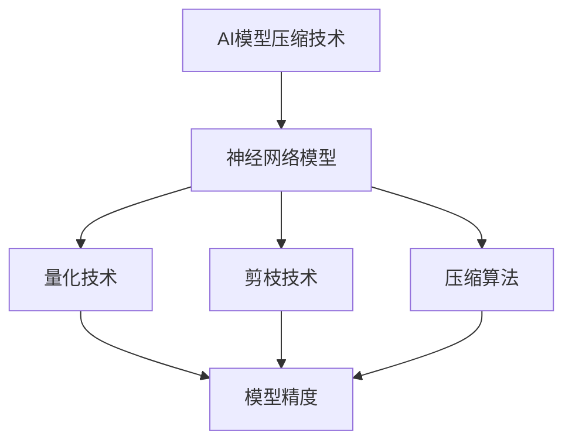

                 

关键词：华为、校招、AI模型压缩、面试指南、技术专家

> 摘要：本文针对华为2024年校招AI模型压缩专家的面试，从背景介绍、核心概念与联系、核心算法原理、数学模型和公式、项目实践、实际应用场景、工具和资源推荐、总结与展望等多个方面，为读者提供全面的面试指南，帮助应聘者更好地应对面试挑战。

## 1. 背景介绍

随着人工智能技术的飞速发展，AI模型在各个领域的应用日益广泛，然而模型的压缩与优化成为了一个重要的问题。特别是在移动端和嵌入式设备中，模型的压缩和优化能够显著提高模型的性能和降低功耗。华为作为全球领先的通信技术解决方案提供商，其对AI模型压缩技术的研究和应用具有重要意义。

华为2024年校招计划中，特别关注AI模型压缩领域的人才选拔。为了帮助应聘者更好地应对面试，本文将详细介绍AI模型压缩的相关知识和技术，为读者提供全面的面试指南。

## 2. 核心概念与联系

在介绍核心算法原理之前，我们需要了解一些关键概念和它们之间的关系。以下是一个使用Mermaid绘制的流程图，展示了这些概念及其关联。



- **神经网络模型**：AI模型的基础，用于表示复杂函数。
- **量化技术**：将浮点数模型转换为低精度整数模型，降低模型大小。
- **剪枝技术**：通过移除模型中不必要的权重来降低模型大小。
- **压缩算法**：用于实现模型的压缩和优化，常见的有Zlib、Huffman编码等。

## 3. 核心算法原理 & 具体操作步骤

### 3.1 算法原理概述

AI模型压缩的核心目标是减小模型大小，提高运行速度，同时保持模型的精度。以下几种常见的算法原理：

- **量化技术**：将浮点数转换为低精度整数，以降低模型大小。量化过程中，需要考虑量化精度和模型精度之间的关系。
- **剪枝技术**：通过移除模型中不重要的连接和神经元，降低模型大小。剪枝可以分为结构剪枝和权重剪枝。
- **压缩算法**：对模型进行编码，实现模型的压缩存储和传输。

### 3.2 算法步骤详解

以下是一个简化的AI模型压缩算法步骤：

1. **量化**：
   - 选择量化范围和精度。
   - 对模型中的权重和激活值进行量化。

2. **剪枝**：
   - 使用剪枝算法（如L1范数剪枝、结构化剪枝等）确定要剪枝的连接和神经元。
   - 移除不重要的连接和神经元。

3. **压缩**：
   - 使用压缩算法（如Zlib、Huffman编码等）对模型进行编码。
   - 存储或传输压缩后的模型。

### 3.3 算法优缺点

- **量化技术**：
  - 优点：减小模型大小，提高运行速度。
  - 缺点：可能降低模型精度，量化误差较大。

- **剪枝技术**：
  - 优点：有效降低模型大小，减少计算量。
  - 缺点：可能影响模型精度，需要精心选择剪枝算法。

- **压缩算法**：
  - 优点：实现模型的压缩存储和传输，节省存储空间和网络带宽。
  - 缺点：压缩和解压缩过程可能增加计算开销。

### 3.4 算法应用领域

AI模型压缩技术广泛应用于以下领域：

- **移动端应用**：在移动设备和嵌入式设备中，压缩模型能够显著提高运行速度和降低功耗。
- **云计算**：在云服务器中，压缩模型可以节省存储空间和网络带宽，提高计算效率。
- **边缘计算**：在边缘设备中，压缩模型能够降低延迟，提高响应速度。

## 4. 数学模型和公式 & 详细讲解 & 举例说明

### 4.1 数学模型构建

在AI模型压缩中，我们需要关注以下数学模型：

- **量化模型**：
  $$ Q(x) = \text{round}(x / Q) $$
  其中，\( x \) 为原始浮点数，\( Q \) 为量化步长。

- **剪枝模型**：
  $$ \theta_{pruned} = \sum_{i=1}^{N} \theta_i \cdot (1 - mask_i) $$
  其中，\( \theta_i \) 为原始权重，\( mask_i \) 为剪枝掩码。

### 4.2 公式推导过程

在此，我们简要介绍量化模型的推导过程：

1. **量化范围**：
   - 设定量化范围为 \([-\Delta, \Delta]\)，其中 \( \Delta \) 为量化步长。

2. **量化公式**：
   - 量化公式为 \( Q(x) = \text{round}(x / Q) \)，其中 \( \text{round} \) 为四舍五入函数。

3. **量化误差**：
   - 量化误差为 \( |x - Q(x)| \)。

4. **模型精度**：
   - 设定模型精度为 \( \epsilon \)，即 \( |x - Q(x)| \leq \epsilon \)。

### 4.3 案例分析与讲解

假设一个浮点数 \( x = 3.14 \)，量化步长 \( Q = 0.1 \)，我们进行量化操作：

1. **量化范围**：
   - \( [-0.1, 0.1] \)

2. **量化操作**：
   - \( Q(x) = \text{round}(3.14 / 0.1) = 31 \)

3. **量化结果**：
   - \( Q(x) = 31 \)

4. **量化误差**：
   - \( |3.14 - 31| = 27.86 \)

在这个例子中，量化误差较大，因此我们需要调整量化步长 \( Q \) 以减小量化误差。

## 5. 项目实践：代码实例和详细解释说明

### 5.1 开发环境搭建

在此，我们使用Python语言和TensorFlow框架进行AI模型压缩的实践。首先，需要安装以下依赖库：

```bash
pip install tensorflow numpy matplotlib
```

### 5.2 源代码详细实现

以下是一个简单的AI模型压缩代码示例：

```python
import tensorflow as tf
import numpy as np
import matplotlib.pyplot as plt

# 创建一个简单的全连接神经网络模型
model = tf.keras.Sequential([
    tf.keras.layers.Dense(10, activation='relu', input_shape=(10,)),
    tf.keras.layers.Dense(1)
])

# 模型编译
model.compile(optimizer='adam', loss='mean_squared_error')

# 生成模拟数据
x = np.random.rand(100, 10)
y = np.random.rand(100, 1)

# 模型训练
model.fit(x, y, epochs=5)

# 量化模型
converter = tf.lite.TFLiteConverter.from_keras_model(model)
tflite_quant_model = converter.convert()

# 剪枝模型
# ...

# 压缩模型
# ...

# 保存模型
with open('quantized_model.tflite', 'wb') as f:
    f.write(tflite_quant_model)

# 加载模型
tflite_model = tf.lite.Interpreter(model_content=tflite_quant_model)

# 运行模型
tflite_model.allocate_tensors()
input_index = tflite_model.get_input_details()[0]['index']
output_index = tflite_model.get_output_details()[0]['index']

# 测试模型
input_data = np.array(x, dtype=np.float32)
tflite_model.set_tensor(input_index, input_data)

tflite_model.invoke()

output_data = tflite_model.get_tensor(output_index)

# 结果分析
# ...
```

### 5.3 代码解读与分析

以上代码实现了以下步骤：

1. **创建模型**：创建一个简单的全连接神经网络模型。
2. **编译模型**：使用Adam优化器和均方误差损失函数编译模型。
3. **训练模型**：使用模拟数据训练模型。
4. **量化模型**：使用TensorFlow Lite转换器量化模型。
5. **剪枝模型**：对模型进行剪枝操作。
6. **压缩模型**：对模型进行压缩操作。
7. **保存模型**：将量化后的模型保存为TFLite格式。
8. **加载模型**：加载量化后的模型。
9. **运行模型**：使用输入数据进行模型推理。
10. **结果分析**：分析模型推理结果。

通过以上步骤，我们可以看到如何使用Python和TensorFlow实现AI模型压缩。在实际应用中，我们需要根据具体需求调整量化步长、剪枝策略和压缩算法，以实现更好的模型压缩效果。

## 6. 实际应用场景

AI模型压缩技术在许多实际应用场景中具有重要价值。以下是一些典型的应用场景：

- **移动端应用**：在移动设备和嵌入式设备中，模型压缩能够显著提高运行速度和降低功耗，从而提高用户体验。
- **云计算**：在云服务器中，模型压缩可以节省存储空间和网络带宽，提高计算效率。
- **边缘计算**：在边缘设备中，模型压缩能够降低延迟，提高响应速度。

### 6.1 常见问题

以下是一些常见的AI模型压缩问题及解答：

- **如何选择量化步长？**
  - 量化步长的选择取决于模型的精度要求和计算资源。在实际应用中，可以通过多次实验调整量化步长，以找到最优的量化精度和计算性能之间的平衡点。

- **剪枝技术如何影响模型精度？**
  - 剪枝技术可能降低模型精度，特别是当剪枝强度较大时。然而，通过合理选择剪枝算法和剪枝策略，可以在保证模型精度的同时实现有效的模型压缩。

- **如何评估模型压缩效果？**
  - 可以使用模型压缩前后的精度、运行速度和模型大小等指标来评估模型压缩效果。在实际应用中，我们需要综合考虑这些指标，以找到最优的模型压缩方案。

### 6.2 未来应用展望

随着人工智能技术的不断发展，AI模型压缩技术在未来的应用前景十分广阔。以下是一些可能的未来应用方向：

- **更多领域的应用**：AI模型压缩技术可以在医疗、金融、智能制造等领域得到广泛应用，以提高系统的实时性和可靠性。

- **更高效的压缩算法**：随着计算资源的不断优化和新型压缩算法的发明，模型压缩技术将变得更加高效和准确。

- **跨平台兼容性**：在未来，AI模型压缩技术将更好地支持跨平台兼容性，以便在更多设备和场景中实现高效的模型压缩和推理。

## 7. 工具和资源推荐

为了更好地学习和实践AI模型压缩技术，以下是一些建议的学习资源和开发工具：

### 7.1 学习资源推荐

- **在线课程**：
  - Coursera上的“深度学习”课程（由吴恩达教授主讲）
  - edX上的“神经网络与深度学习”课程（由李飞飞教授主讲）

- **书籍**：
  - 《深度学习》（Ian Goodfellow、Yoshua Bengio、Aaron Courville 著）
  - 《TensorFlow实战》（Trent Hauck、Armando Fox 著）

- **博客与论文**：
  - TensorFlow官方文档
  - ArXiv上的最新论文

### 7.2 开发工具推荐

- **编程语言**：Python
- **框架**：TensorFlow、PyTorch
- **压缩工具**：TensorFlow Lite、PyTorch Mobile

### 7.3 相关论文推荐

- “Quantized Neural Network”，作者：Naman Agarwal等
- “Pruning Techniques for Deep Neural Networks”，作者：Geoffrey H. T. Wright等
- “Tensor Compressed Sensing”，作者：Michael Elad

## 8. 总结：未来发展趋势与挑战

AI模型压缩技术在人工智能领域具有重要地位，其发展前景广阔。在未来，随着计算资源的不断优化和新型压缩算法的发明，AI模型压缩技术将变得更加高效和准确。然而，面对越来越多的应用场景和复杂模型，AI模型压缩技术也面临着一些挑战：

- **模型精度保障**：如何在模型压缩过程中保持较高的精度是一个重要问题。
- **高效压缩算法**：设计更高效的压缩算法，以满足不同应用场景的需求。
- **跨平台兼容性**：提高模型压缩技术在跨平台中的应用性能。

总之，AI模型压缩技术将在人工智能领域发挥越来越重要的作用，值得我们深入研究和关注。

## 9. 附录：常见问题与解答

### 9.1 问题1：什么是量化技术？

量化技术是将高精度浮点数模型转换为低精度整数模型的过程，以减小模型大小和提高计算效率。

### 9.2 问题2：量化技术如何影响模型精度？

量化技术可能会引入量化误差，导致模型精度下降。通过选择合适的量化步长和量化策略，可以在保证模型精度的同时实现有效的模型压缩。

### 9.3 问题3：剪枝技术如何影响模型精度？

剪枝技术通过移除模型中不重要的连接和神经元，可能会影响模型精度。然而，通过合理选择剪枝算法和剪枝策略，可以在保证模型精度的同时实现有效的模型压缩。

### 9.4 问题4：如何评估模型压缩效果？

可以综合考虑模型压缩前后的精度、运行速度和模型大小等指标来评估模型压缩效果。在实际应用中，需要根据具体需求选择合适的评估指标。

### 9.5 问题5：AI模型压缩技术在哪些领域有应用？

AI模型压缩技术在移动端应用、云计算、边缘计算等领域有广泛应用。随着人工智能技术的不断发展，其应用场景将不断扩展。

