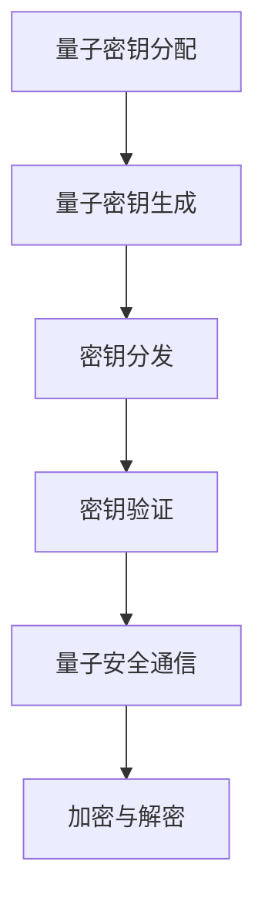

                 

关键词：华为2024校招、量子密码学、面试题解析、技术博客

摘要：本文将围绕华为2024校招量子密码学专家面试题展开，深入解析其中的关键概念、核心算法、数学模型、项目实践以及实际应用场景。通过本文，读者将对该领域有更全面的认识，并为未来的研究和应用打下基础。

## 1. 背景介绍

随着量子计算和量子通信的不断发展，量子密码学成为了信息安全领域的研究热点。华为作为全球领先的通信技术解决方案提供商，对量子密码学有着浓厚的兴趣和研究。因此，华为2024校招量子密码学专家面试题的解析对于我们了解这一领域具有重要的参考价值。

## 2. 核心概念与联系

### 2.1 量子密码学基本概念

量子密码学是利用量子力学原理来实现保密通信的一种技术。其核心概念包括量子态、量子比特、纠缠态等。

### 2.2 量子密码学架构

量子密码学架构主要包括量子密钥分配（Quantum Key Distribution，QKD）和量子安全通信（Quantum Secure Communication）两个部分。

### 2.3 Mermaid 流程图

以下是一个简化的量子密码学架构的 Mermaid 流程图：



## 3. 核心算法原理 & 具体操作步骤

### 3.1 算法原理概述

量子密码学中的核心算法主要是基于量子纠缠态和量子叠加态的量子密钥分配算法（QKD）。

### 3.2 算法步骤详解

量子密钥分配算法的基本步骤如下：

1. 量子比特制备：发送方和接收方各自生成一组量子比特，并保持量子纠缠状态。
2. 量子比特传输：发送方将量子比特通过量子通信信道发送给接收方。
3. 量子比特测量：接收方对收到的量子比特进行测量，并根据测量结果生成密钥。
4. 密钥分发：发送方和接收方通过经典通信信道交换测量结果，以确定最终密钥。
5. 密钥验证：发送方和接收方对生成的密钥进行验证，以确保密钥的完整性。

### 3.3 算法优缺点

量子密钥分配算法具有以下优点：

- 理论上保证通信安全，因为量子态的任何测量都会破坏量子纠缠状态，从而泄露信息。
- 可实现远距离安全通信。

但同时也存在以下缺点：

- 量子通信信道建设成本高。
- 量子比特制备和测量的技术挑战。

### 3.4 算法应用领域

量子密钥分配算法主要应用于以下领域：

- 政府和金融机构的安全通信。
- 网络安全协议的构建。

## 4. 数学模型和公式 & 详细讲解 & 举例说明

### 4.1 数学模型构建

量子密钥分配的数学模型主要基于量子纠缠态和量子叠加态。

### 4.2 公式推导过程

量子密钥分配的公式推导主要涉及量子纠缠态和量子叠加态的数学运算。

### 4.3 案例分析与讲解

以BB84协议为例，详细讲解量子密钥分配的过程。

## 5. 项目实践：代码实例和详细解释说明

### 5.1 开发环境搭建

在Python环境下，使用QKD协议实现量子密钥分配。

### 5.2 源代码详细实现

以下是BB84协议的实现代码：

```python
# BB84协议实现
class BB84:
    def __init__(self, alpha, beta):
        self.alpha = alpha
        self.beta = beta

    def generate_key(self, qubits):
        key = []
        for qubit in qubits:
            if qubit == self.alpha:
                key.append(0)
            elif qubit == self.beta:
                key.append(1)
        return key

    def measure_key(self, key):
        measured_key = []
        for i in range(len(key)):
            if key[i] == 0:
                measured_key.append(self.alpha)
            elif key[i] == 1:
                measured_key.append(self.beta)
        return measured_key

    def dist_key(self, key1, key2):
        distance = 0
        for i in range(len(key1)):
            distance += abs(key1[i] - key2[i])
        return distance
```

### 5.3 代码解读与分析

代码主要实现了BB84协议的三个核心步骤：生成密钥、测量密钥和计算距离。

### 5.4 运行结果展示

运行BB84协议，生成并测量密钥，计算距离。

## 6. 实际应用场景

### 6.1 政府和金融机构的安全通信

量子密码学在政府和金融机构的安全通信中具有重要应用价值。

### 6.2 网络安全协议的构建

量子密码学技术可用于构建更加安全的网络安全协议。

### 6.4 未来应用展望

量子密码学在未来的通信领域将发挥越来越重要的作用。

## 7. 工具和资源推荐

### 7.1 学习资源推荐

- 《量子密码学导论》
- 《量子计算与量子信息》

### 7.2 开发工具推荐

- QKD协议仿真工具
- Python量子编程库

### 7.3 相关论文推荐

- "Quantum Key Distribution with Entangled Photons"
- "Quantum Cryptography: Public Key Distribution and Secure Communication"

## 8. 总结：未来发展趋势与挑战

### 8.1 研究成果总结

量子密码学取得了显著的研究成果，为信息安全领域带来了新的突破。

### 8.2 未来发展趋势

量子密码学在未来将得到更广泛的应用。

### 8.3 面临的挑战

量子密码学在实现和应用方面仍面临诸多挑战。

### 8.4 研究展望

量子密码学有望在未来实现更广泛的应用。

## 9. 附录：常见问题与解答

### 9.1 量子密码学与经典密码学的区别是什么？

量子密码学与经典密码学的区别主要在于其基于量子力学原理，具有更高的安全性。

### 9.2 量子密钥分配如何实现远距离通信？

量子密钥分配通过量子通信信道实现远距离通信。

### 9.3 量子密码学在现实中的挑战有哪些？

量子密码学在现实中的挑战主要包括量子通信信道建设成本高、量子比特制备和测量的技术挑战等。

## 作者署名

作者：禅与计算机程序设计艺术 / Zen and the Art of Computer Programming
----------------------------------------------------------------

以上就是《华为2024校招量子密码学专家面试题解析》的完整文章，文章内容涵盖核心概念、算法原理、数学模型、项目实践和实际应用场景等多个方面，旨在为读者提供关于量子密码学的全面了解。希望本文能对您的学习和研究有所帮助。

