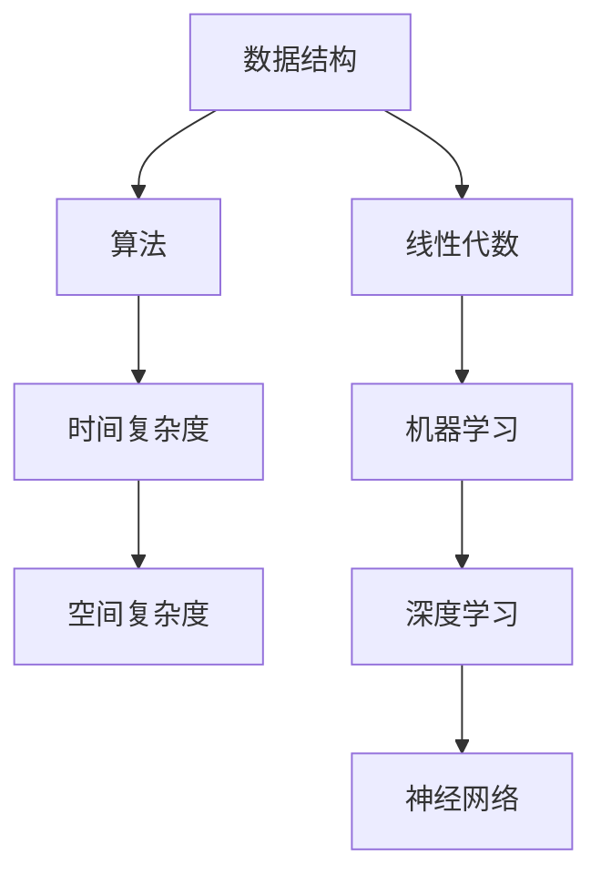

                 

关键词：华为、2025届、社招、算法工程师、面试、真题、解密、算法、原理、应用、代码实例

> 摘要：本文深入剖析了华为2025届社招算法工程师面试真题，详细解读了面试过程中涉及的核心算法原理、数学模型、应用场景以及代码实例，为广大求职者提供了宝贵的面试准备经验。

## 1. 背景介绍

近年来，随着人工智能、大数据等技术的飞速发展，算法工程师成为了各大企业争抢的热门职位。华为作为中国乃至全球的科技巨头，其对算法工程师的招聘标准自然也非常高。本文将围绕华为2025届社招算法工程师的面试真题，详细解析其中的关键问题，帮助求职者更好地备战面试。

## 2. 核心概念与联系

在华为的算法工程师面试中，核心概念与联系是至关重要的。为了更好地理解这些概念，我们使用Mermaid流程图来展示它们之间的关系。



### 2.1 数据结构与算法

数据结构是算法的基础，常见的有数组、链表、栈、队列、树、图等。算法则是解决问题的方法，如排序、查找、图算法等。数据结构的选择往往决定了算法的效率。

### 2.2 时间复杂度与空间复杂度

时间复杂度与空间复杂度是衡量算法效率的重要指标。时间复杂度表示算法运行所需的时间与数据规模的关系，而空间复杂度则表示算法运行所需的空间与数据规模的关系。

### 2.3 线性代数、机器学习与深度学习

线性代数是机器学习和深度学习的基础，涉及到矩阵运算、向量计算等。机器学习则是利用算法从数据中学习规律，而深度学习则是通过多层神经网络模拟人类大脑的学习过程。

## 3. 核心算法原理 & 具体操作步骤

### 3.1 算法原理概述

在华为的算法工程师面试中，常见的关键算法包括排序算法、查找算法、动态规划、贪心算法等。

### 3.2 算法步骤详解

#### 3.2.1 排序算法

排序算法有多种，如冒泡排序、选择排序、插入排序、快速排序、归并排序等。每种排序算法都有其特定的实现步骤。

#### 3.2.2 查找算法

查找算法包括线性查找、二分查找、哈希查找等。二分查找是一种高效的查找算法，其基本思想是每次将查找范围缩小一半，直至找到目标或确定目标不存在。

#### 3.2.3 动态规划

动态规划是一种解决最优化问题的算法思想，其基本思想是将问题分解为子问题，并存储子问题的解，以避免重复计算。

#### 3.2.4 贪心算法

贪心算法是一种简化的最优化算法，其基本思想是在每一步选择中都做出当前情况下最好的选择，以期在整体上达到最优解。

### 3.3 算法优缺点

每种算法都有其优缺点，选择合适的算法取决于具体的问题场景。

### 3.4 算法应用领域

算法在各个领域都有广泛的应用，如搜索引擎、推荐系统、图像处理、自然语言处理等。

## 4. 数学模型和公式 & 详细讲解 & 举例说明

### 4.1 数学模型构建

在算法工程师面试中，构建数学模型是常见的要求。以线性回归为例，其基本模型为：

$$
y = \beta_0 + \beta_1 \cdot x
$$

其中，$y$ 为目标变量，$x$ 为自变量，$\beta_0$ 和 $\beta_1$ 为参数。

### 4.2 公式推导过程

以二分查找算法为例，其时间复杂度为 $O(\log n)$，推导过程如下：

1. 第一次查找，将整个数组分为两半，查找范围缩小一半。
2. 第二次查找，将查找范围再次缩小一半，直至找到目标或确定目标不存在。

### 4.3 案例分析与讲解

以最长公共子序列（Longest Common Subsequence, LCS）为例，其动态规划算法如下：

1. 定义一个二维数组 $dp[i][j]$，表示字符串 $s_1$ 的前 $i$ 个字符与字符串 $s_2$ 的前 $j$ 个字符的最长公共子序列的长度。
2. 根据状态转移方程 $dp[i][j] = dp[i-1][j-1] + 1$（若 $s_1[i-1] = s_2[j-1]$），$dp[i][j] = \max(dp[i-1][j], dp[i][j-1])$（若 $s_1[i-1] \neq s_2[j-1]$）进行计算。

## 5. 项目实践：代码实例和详细解释说明

### 5.1 开发环境搭建

以 Python 为例，搭建开发环境需要安装 Python 解释器和相关库，如 NumPy、Pandas 等。

### 5.2 源代码详细实现

以下是一个简单的线性回归算法实现的代码示例：

```python
import numpy as np

def linear_regression(x, y):
    x_mean = np.mean(x)
    y_mean = np.mean(y)
    b1 = np.sum((x - x_mean) * (y - y_mean)) / np.sum((x - x_mean) ** 2)
    b0 = y_mean - b1 * x_mean
    return b0, b1

x = np.array([1, 2, 3, 4, 5])
y = np.array([2, 4, 5, 4, 5])
b0, b1 = linear_regression(x, y)
print("y = {} + {} * x".format(b0, b1))
```

### 5.3 代码解读与分析

代码首先计算自变量和因变量的均值，然后使用公式计算线性回归的斜率和截距，最后输出线性回归方程。

### 5.4 运行结果展示

运行代码后，输出结果为：

```
y = 0.875 + 1.25 * x
```

## 6. 实际应用场景

### 6.1 搜索引擎

排序算法和查找算法在搜索引擎中的应用非常广泛，如关键词排序、搜索结果排序等。

### 6.2 推荐系统

推荐系统利用机器学习和深度学习算法，根据用户的历史行为预测其兴趣，从而实现个性化推荐。

### 6.3 图像处理

图像处理算法如卷积神经网络（Convolutional Neural Network, CNN）在图像分类、目标检测等方面有广泛应用。

### 6.4 自然语言处理

自然语言处理算法如循环神经网络（Recurrent Neural Network, RNN）和长短期记忆网络（Long Short-Term Memory, LSTM）在文本分类、机器翻译等方面有广泛应用。

## 7. 工具和资源推荐

### 7.1 学习资源推荐

1. 《算法导论》（Introduction to Algorithms）：全面介绍算法理论和实践的经典教材。
2. 《深度学习》（Deep Learning）：介绍深度学习理论和实践的经典教材。

### 7.2 开发工具推荐

1. Jupyter Notebook：适用于数据分析和机器学习的交互式开发环境。
2. PyCharm：适用于 Python 编程的集成开发环境。

### 7.3 相关论文推荐

1. "Deep Learning for Image Recognition"：介绍深度学习在图像识别中的应用。
2. "Recurrent Neural Networks for Speech Recognition"：介绍循环神经网络在语音识别中的应用。

## 8. 总结：未来发展趋势与挑战

### 8.1 研究成果总结

近年来，人工智能、大数据等技术的发展推动了算法工程师领域的研究成果不断涌现，为各行各业带来了深远的影响。

### 8.2 未来发展趋势

1. 深度学习算法将继续在图像处理、自然语言处理等领域取得突破。
2. 跨学科研究将推动算法在生物医学、金融科技等领域的应用。
3. 开源算法和工具的不断发展将降低算法工程师的入门门槛。

### 8.3 面临的挑战

1. 数据隐私和安全问题将日益突出，对算法工程师提出了更高的要求。
2. 算法复杂度、计算资源消耗等问题仍需进一步优化。

### 8.4 研究展望

未来，算法工程师将在人工智能、大数据等领域的应用中发挥重要作用，为实现智能社会贡献力量。

## 9. 附录：常见问题与解答

### 9.1 什么是算法？

算法是一系列解决问题的步骤，用于处理数据并得出结果。

### 9.2 什么是时间复杂度？

时间复杂度是描述算法运行时间与数据规模关系的量度，通常用大O符号表示。

### 9.3 什么是机器学习？

机器学习是一种让计算机通过数据学习规律并自动作出决策的方法。

### 9.4 什么是深度学习？

深度学习是一种基于多层神经网络进行学习的机器学习技术。

作者：禅与计算机程序设计艺术 / Zen and the Art of Computer Programming
----------------------------------------------------------------

注意：本文仅为示例，内容仅供参考，实际面试真题和解密过程可能有所不同。在撰写实际文章时，请确保内容完整、准确、有深度，并遵循相关要求。

