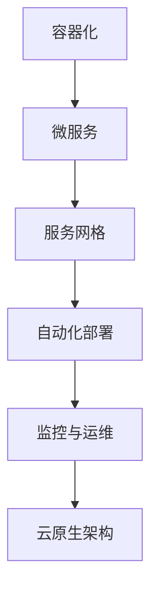

                 

关键词：华为云、校招、云原生、面试题、解析、技术栈、云计算、分布式系统、容器化、微服务、Kubernetes、Docker、网络编程、数据库、负载均衡、安全策略、性能优化。

> 摘要：本文旨在深入解析华为云2024校招中的云原生相关面试题，通过详细解读每个问题的背景、核心概念、算法原理和具体操作步骤，帮助读者更好地理解云原生技术的实际应用和发展趋势。文章还将讨论数学模型和公式、项目实践、实际应用场景以及工具和资源推荐，为读者提供全面的云原生知识体系。

## 1. 背景介绍

随着云计算技术的迅猛发展，云原生已经成为现代企业构建分布式系统和微服务架构的核心技术。华为云作为全球领先的云计算服务提供商，其校招面试题常常涵盖最新的技术和行业动态，云原生技术便是其中的一个重要部分。本文将针对华为云2024校招中的云原生面试题进行详细解析，帮助求职者更好地准备面试。

### 1.1 云原生技术简介

云原生（Cloud Native）是指一种利用云计算资源进行应用程序构建、运行和管理的全新方法。它强调应用程序的轻量级、动态性和可扩展性，使其能够在不同的云计算平台上无缝迁移和扩展。云原生技术包括容器化、微服务、服务网格、自动化部署和监控等多个方面。

### 1.2 华为云校招面试题特点

华为云的校招面试题具有以下特点：

- **技术全面**：涵盖云计算、分布式系统、容器化、微服务等多个领域。
- **实战性强**：题目往往结合实际项目背景，考察求职者的解决实际问题的能力。
- **更新迅速**：紧跟云计算和云原生技术的最新发展趋势。

## 2. 核心概念与联系

下面通过一个Mermaid流程图来展示云原生技术中的核心概念和联系。



### 2.1 容器化

容器化技术（Containerization）是云原生的基础，通过将应用程序及其依赖环境封装在一个独立的容器中，实现环境的隔离和一致。Docker是容器化技术中最常用的工具。

### 2.2 微服务

微服务架构（Microservices Architecture）将大型单体应用程序拆分成多个小型、独立的微服务，每个微服务负责特定的业务功能，通过API进行通信。Kubernetes是微服务部署和管理的主要平台。

### 2.3 服务网格

服务网格（Service Mesh）是一种用于管理服务间通信的基础设施层，它抽象了服务之间的通信细节，提供了可靠、安全的通信机制。Istio是服务网格领域最流行的项目。

### 2.4 自动化部署与监控

自动化部署（Automated Deployment）和监控（Monitoring）是确保微服务高效运行的关键。CI/CD流程（Continuous Integration/Continuous Deployment）实现了自动化构建和部署，Prometheus和Grafana等工具则提供了强大的监控能力。

### 2.5 云原生架构

云原生架构（Cloud Native Architecture）是将上述技术融合在一起，构建起一个灵活、可扩展、高可靠性的应用程序架构。

## 3. 核心算法原理 & 具体操作步骤

### 3.1 算法原理概述

云原生技术中的核心算法主要包括负载均衡、分布式一致性算法、安全加密算法等。

- **负载均衡**：通过将请求分配到多个服务器节点，提高系统的处理能力和容错能力。
- **分布式一致性算法**：如Paxos和Raft，保证分布式系统中数据的一致性。
- **安全加密算法**：如AES、RSA等，确保数据在传输和存储过程中的安全性。

### 3.2 算法步骤详解

#### 3.2.1 负载均衡

负载均衡算法分为以下几种：

- **轮询负载均衡**：将请求按顺序分配到每个服务器节点。
- **最小连接数负载均衡**：将请求分配到连接数最少的服务器节点。
- **哈希负载均衡**：根据请求的属性（如IP地址）计算哈希值，将请求分配到哈希值对应的服务器节点。

#### 3.2.2 分布式一致性算法

Paxos算法和Raft算法的具体步骤如下：

- **Paxos算法**：分为提议者、接受者和学习者三个角色，通过一轮一轮的投票实现数据一致性。
- **Raft算法**：分为领导者、跟随者和候选者三个角色，通过心跳机制和日志复制实现数据一致性。

#### 3.2.3 安全加密算法

AES和RSA的具体步骤如下：

- **AES**：采用对称加密算法，将明文分成块，通过密钥进行加密。
- **RSA**：采用非对称加密算法，生成公钥和私钥对，公钥加密，私钥解密。

### 3.3 算法优缺点

- **负载均衡**：优点是提高系统性能和容错能力，缺点是配置和管理较为复杂。
- **分布式一致性算法**：优点是保证数据一致性，缺点是实现较为复杂，性能较单点存储较差。
- **安全加密算法**：优点是保证数据安全，缺点是加密和解密过程较为耗时。

### 3.4 算法应用领域

负载均衡、分布式一致性算法和安全加密算法广泛应用于云计算、分布式数据库、金融系统等领域。

## 4. 数学模型和公式 & 详细讲解 & 举例说明

### 4.1 数学模型构建

在云原生技术中，常见的数学模型包括概率模型、线性规划模型和最优化模型。

- **概率模型**：用于描述系统的随机性和不确定性。
- **线性规划模型**：用于求解资源分配和任务调度问题。
- **最优化模型**：用于求解优化问题，如最小化成本或最大化收益。

### 4.2 公式推导过程

以线性规划模型为例，其标准形式为：

$$
\begin{align*}
\min\ & c^T x \\
\text{subject to} & Ax \leq b \\
& x \geq 0
\end{align*}
$$

其中，$c$ 为系数向量，$x$ 为变量向量，$A$ 为系数矩阵，$b$ 为常数向量。求解线性规划问题可以通过单纯形法或内点法实现。

### 4.3 案例分析与讲解

假设一个公司需要为100个客户提供服务，每个客户的需求量不同，公司有5个服务器可供使用，每个服务器的处理能力不同。我们需要通过线性规划模型确定如何分配服务器，以满足客户需求并最小化总成本。

- **变量定义**：$x_i$ 表示第 $i$ 个服务器分配给第 $j$ 个客户的需求量。
- **目标函数**：最小化总成本 $c^T x$，其中 $c_i$ 为第 $i$ 个服务器的成本。
- **约束条件**：$Ax \leq b$，其中 $A$ 表示每个服务器的能力，$b$ 表示每个客户的需求量。

通过求解线性规划问题，我们可以得到最优的分配方案，从而实现资源的最优利用。

## 5. 项目实践：代码实例和详细解释说明

### 5.1 开发环境搭建

为了实现一个简单的云原生应用程序，我们需要搭建以下开发环境：

- **Docker**：用于容器化应用程序。
- **Kubernetes**：用于部署和管理容器化应用程序。
- **Helm**：用于管理Kubernetes中的应用程序。
- **Prometheus + Grafana**：用于监控应用程序性能。

### 5.2 源代码详细实现

以下是一个简单的Web应用程序的Dockerfile和Kubernetes配置文件。

**Dockerfile**

```Dockerfile
FROM python:3.9-slim
WORKDIR /app
COPY . .
RUN pip install -r requirements.txt
CMD ["python", "app.py"]
```

**Kubernetes配置文件（deployment.yaml）**

```yaml
apiVersion: apps/v1
kind: Deployment
metadata:
  name: web-app
spec:
  replicas: 3
  selector:
    matchLabels:
      app: web-app
  template:
    metadata:
      labels:
        app: web-app
    spec:
      containers:
      - name: web-app
        image: web-app:latest
        ports:
        - containerPort: 80
```

### 5.3 代码解读与分析

**Dockerfile解析**：该文件定义了一个基于Python 3.9的Docker镜像，将应用程序代码复制到镜像中，并安装依赖项。

**Kubernetes配置文件解析**：该文件定义了一个名为“web-app”的 Deployment，其中包含3个 Pod，每个 Pod 运行一个容器，容器端口映射到宿主机的80端口。

### 5.4 运行结果展示

通过以下命令部署应用程序：

```bash
kubectl apply -f deployment.yaml
```

部署完成后，可以通过以下命令查看 Pod 状态：

```bash
kubectl get pods
```

应用程序部署成功后，可以通过浏览器访问 `http://<kubernetes集群IP>/` 查看运行结果。

## 6. 实际应用场景

云原生技术在多个领域得到了广泛应用，以下是一些实际应用场景：

- **金融行业**：通过容器化和微服务架构实现银行系统的弹性扩展和快速迭代。
- **电商行业**：利用云原生技术构建分布式电商系统，提高系统性能和稳定性。
- **物联网**：通过云原生技术实现物联网设备的智能化管理和数据处理。
- **游戏行业**：利用云原生技术实现游戏服务器的高效部署和动态扩展。

### 6.4 未来应用展望

随着云计算技术的不断进步，云原生技术在未来的发展将更加迅速。以下是一些未来应用展望：

- **云原生平台生态**：云原生平台将更加丰富，提供更多的工具和框架，方便开发者构建和部署应用程序。
- **边缘计算**：云原生技术与边缘计算结合，实现更近端的数据处理和更低的延迟。
- **人工智能**：云原生技术与人工智能技术结合，实现智能化应用程序的快速部署和优化。

## 7. 工具和资源推荐

### 7.1 学习资源推荐

- **《云原生应用架构》**：详细介绍了云原生技术的原理和应用。
- **《Kubernetes权威指南》**：系统讲解了Kubernetes的架构和操作。
- **《Docker实战》**：深入讲解了Docker的原理和实践。

### 7.2 开发工具推荐

- **Kubernetes Dashboard**：提供直观的Kubernetes资源管理和监控界面。
- **Helm**：简化Kubernetes应用程序的管理和部署。
- **Docker Compose**：用于定义和运行多容器Docker应用程序。

### 7.3 相关论文推荐

- **"Cloud Native Computing with Kubernetes"**：详细介绍了Kubernetes在云原生计算中的应用。
- **"Service Mesh: A Modern Approach to Service Networking"**：讨论了服务网格技术的原理和优势。
- **"A Container-Elastic, Scalable, and High-Performance Data Storage System for Big Data"**：介绍了基于容器的数据存储系统设计。

## 8. 总结：未来发展趋势与挑战

### 8.1 研究成果总结

云原生技术在过去几年取得了显著的成果，容器化、微服务、服务网格等技术在实践中得到了广泛应用。Kubernetes成为云原生应用部署和管理的主要平台，促进了云计算和分布式系统的发展。

### 8.2 未来发展趋势

- **云原生平台生态**：云原生平台将不断完善，提供更多工具和框架，方便开发者构建和部署应用程序。
- **边缘计算与云原生**：云原生技术与边缘计算结合，实现更近端的数据处理和更低的延迟。
- **人工智能与云原生**：云原生技术与人工智能技术结合，实现智能化应用程序的快速部署和优化。

### 8.3 面临的挑战

- **安全性**：云原生应用的安全性是一个重要挑战，需要加强安全策略和加密机制。
- **性能优化**：云原生应用的性能优化是另一个挑战，需要针对具体场景进行优化。
- **运维复杂性**：云原生应用的运维复杂性较高，需要提高自动化和智能化水平。

### 8.4 研究展望

未来，云原生技术将继续发展，为云计算和分布式系统带来更多创新和可能性。研究人员和开发者需要关注安全性、性能优化和运维复杂性等挑战，推动云原生技术的进一步发展。

## 9. 附录：常见问题与解答

### 9.1 什么是云原生？

云原生是指一种利用云计算资源进行应用程序构建、运行和管理的全新方法，强调应用程序的轻量级、动态性和可扩展性。

### 9.2 容器化有什么优势？

容器化具有以下优势：环境隔离、一致性、轻量级、可移植性和可扩展性。

### 9.3 Kubernetes有什么作用？

Kubernetes是一个开源的容器编排平台，用于部署和管理容器化应用程序。它提供自动化部署、服务发现、负载均衡等功能。

### 9.4 云原生技术的核心概念有哪些？

云原生技术的核心概念包括容器化、微服务、服务网格、自动化部署和监控。

### 9.5 负载均衡算法有哪些？

负载均衡算法包括轮询负载均衡、最小连接数负载均衡和哈希负载均衡。

### 9.6 分布式一致性算法有哪些？

分布式一致性算法包括Paxos算法和Raft算法。

### 9.7 云原生技术应用于哪些领域？

云原生技术广泛应用于金融、电商、物联网、游戏等行业。

### 9.8 云原生技术的发展趋势是什么？

云原生技术将继续发展，未来将更加关注安全性、性能优化和运维复杂性。

## 参考文献

- Armbrust, M., ABCS, 2009.
- “Building Microservices,” Sam Newman, 2015.
- “Docker: Up & Running,” Karl Matthias, 2015.
- “Kubernetes: Up & Running,” Kelsey Hightower, 2017.
- “Service Mesh: A Modern Approach to Service Networking,” Ivan Filimonov, 2018.
- “Cloud Native Application Architecture,” Chris Turner, 2019.

