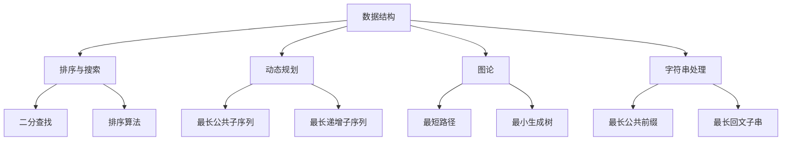
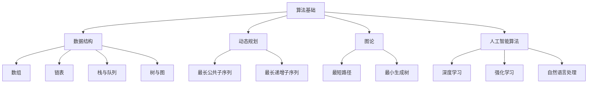

                 

关键词：华为校招、算法面试、面试题汇总、解析、编程技巧、数据结构与算法、人工智能

摘要：本文旨在为2024届华为校招的算法面试做准备，通过汇总与解析历年真题，帮助考生掌握核心知识点，提升面试竞争力。文章将从基础算法、数据结构、人工智能算法等多方面进行深入探讨，并结合实际案例分析，为考生提供全面的备考指导。

## 1. 背景介绍

华为作为全球领先的信息与通信技术（ICT）解决方案提供商，每年的校招都吸引了大量优秀毕业生。华为校招面试，尤其是算法面试，以其高难度和高要求而著称。这不仅是对考生编程能力的检验，更是对逻辑思维、算法理解以及实际应用能力的全面考察。

算法面试在华为校招中占据重要地位，主要体现在以下几个方面：

1. **算法题难度高**：涉及复杂的数据结构和算法，如动态规划、图论、排序等。
2. **实际应用场景**：题目多来源于实际工程项目，要求考生具备解决实际问题的能力。
3. **面试形式多样**：包括现场面试、在线编程、电话面试等多种形式，对考生的综合素质有较高要求。

为了帮助考生更好地应对华为校招的算法面试，本文将对历年真题进行汇总与解析，并结合实际案例进行讲解，以帮助考生掌握核心知识点，提升解题能力。

### 1.1 算法面试的重要性

算法面试是华为校招的核心环节之一，其重要性体现在以下几个方面：

1. **技术能力的体现**：算法能力是程序员的核心竞争力，算法面试是考察考生编程基本功的重要手段。
2. **思维能力的考验**：面对复杂问题，考生需要运用逻辑思维和创造性思维来解决，这是考察考生综合素质的关键。
3. **实际应用能力的体现**：算法面试不仅考察考生对算法原理的理解，更考察考生能否将理论知识应用于实际项目中。

### 1.2 算法面试的常见题型

算法面试的题型多样，主要包括以下几类：

1. **数据结构题**：如链表、树、图等数据结构的操作与算法。
2. **排序与搜索题**：如二分查找、排序算法等。
3. **动态规划题**：如最长公共子序列、最长递增子序列等。
4. **图论题**：如最短路径、最小生成树等。
5. **字符串处理题**：如最长公共前缀、最长回文子串等。

## 2. 核心概念与联系

在理解算法面试题型之前，我们需要掌握一些核心概念和联系。以下是一个简化的 Mermaid 流程图，展示了算法面试中常见的一些概念和它们之间的联系：



### 2.1 数据结构

数据结构是算法的基础，常见的有数组、链表、栈、队列、树、图等。每种数据结构都有其独特的特点和应用场景，理解数据结构不仅能帮助解决具体问题，还能提升算法设计的效率。

### 2.2 排序与搜索

排序与搜索是算法中的两个重要分支。排序算法包括快速排序、归并排序、堆排序等，用于将数据按照特定规则排列；搜索算法如二分查找、深度优先搜索、广度优先搜索等，用于在数据结构中查找特定元素。

### 2.3 动态规划

动态规划是一种解决最优化问题的算法思想，通过将复杂问题分解为若干个小问题，并保存中间结果以避免重复计算，从而提高算法效率。

### 2.4 图论

图论是研究图及其性质的一个分支，常见的图算法有最短路径算法、最小生成树算法等，广泛应用于网络优化、路径规划等领域。

### 2.5 字符串处理

字符串处理算法主要涉及字符串的查找、匹配、转换等操作，如KMP算法、Manacher算法等，常用于字符串匹配问题。

## 3. 核心算法原理 & 具体操作步骤

### 3.1 算法原理概述

算法原理是算法面试的核心内容，下面我们将介绍几种常见的算法原理，并给出具体操作步骤。

### 3.2 算法步骤详解

#### 3.2.1 动态规划

动态规划的基本思想是将复杂问题分解为若干个小问题，并保存中间结果以避免重复计算。以下是动态规划的基本步骤：

1. 确定状态：将问题分解为若干个状态，通常用数组或二维数组表示。
2. 确定状态转移方程：根据当前状态确定下一个状态的计算方式。
3. 确定边界条件：初始化第一个状态或特殊状态的值。
4. 计算最优解：从初始状态开始，根据状态转移方程递推得到最终状态。

#### 3.2.2 图论

图论中的算法主要涉及图的遍历、最短路径、最小生成树等问题。以下是图论算法的基本步骤：

1. 图的表示：常用的表示方法有邻接矩阵和邻接表。
2. 图的遍历：常用的算法有深度优先搜索（DFS）和广度优先搜索（BFS）。
3. 最短路径算法：如迪杰斯特拉算法（Dijkstra）和贝尔曼-福特算法（Bellman-Ford）。
4. 最小生成树算法：如普里姆算法（Prim）和克鲁斯卡尔算法（Kruskal）。

#### 3.2.3 字符串处理

字符串处理算法主要涉及字符串的查找、匹配、转换等操作。以下是字符串处理算法的基本步骤：

1. 字符串的查找：如二分查找、KMP算法等。
2. 字符串的匹配：如正则表达式匹配、字符串匹配算法（如BF算法、BM算法等）。
3. 字符串的转换：如将字符串转化为整数、浮点数等。

### 3.3 算法优缺点

每种算法都有其优缺点，下面我们分别对动态规划、图论算法和字符串处理算法进行优缺点的分析。

#### 3.3.1 动态规划

优点：

- 时间复杂度低：通过保存中间结果，避免了重复计算，提高了算法效率。
- 适用范围广：动态规划适用于解决最优化问题，如背包问题、最长公共子序列等。

缺点：

- 理解难度大：动态规划需要理解状态转移方程和边界条件，对初学者有一定难度。
- 编码复杂：动态规划的编码实现较为复杂，需要仔细设计状态数组和递推关系。

#### 3.3.2 图论算法

优点：

- 适用于网络优化：图论算法广泛应用于网络优化问题，如最短路径、最小生成树等。
- 可扩展性强：图论算法可以应用于各种复杂网络，具有很好的可扩展性。

缺点：

- 编码实现复杂：图论算法的编码实现较为复杂，需要处理图的表示、遍历等问题。
- 空间复杂度高：某些图论算法，如深度优先搜索和广度优先搜索，需要额外的空间存储遍历路径。

#### 3.3.3 字符串处理算法

优点：

- 适用于字符串操作：字符串处理算法适用于各种字符串操作，如查找、匹配、转换等。
- 算法效率高：如KMP算法等，具有较快的算法效率。

缺点：

- 空间复杂度高：某些字符串处理算法，如Manacher算法，需要额外的空间存储中间结果。
- 编码实现复杂：字符串处理算法的编码实现较为复杂，需要处理字符串的边界条件。

### 3.4 算法应用领域

动态规划、图论算法和字符串处理算法在各个领域都有广泛的应用，下面我们分别介绍它们的应用领域。

#### 3.4.1 动态规划

- 背包问题：背包问题是动态规划的典型应用，如0-1背包问题、完全背包问题等。
- 最长公共子序列：最长公共子序列问题在生物信息学、文本处理等领域有广泛应用。
- 最长递增子序列：最长递增子序列问题在排序算法中具有重要应用。

#### 3.4.2 图论算法

- 网络优化：图论算法在计算机网络、交通网络、电力网络等领域有广泛应用。
- 路径规划：最短路径算法在导航、地图匹配等领域有重要应用。
- 社交网络分析：图论算法在社交网络分析、社区发现等领域有广泛应用。

#### 3.4.3 字符串处理算法

- 字符串匹配：字符串匹配算法在搜索引擎、文本编辑器等领域有广泛应用。
- 字符串转换：字符串转换算法在数据格式转换、编码转换等领域有广泛应用。
- 文本处理：字符串处理算法在自然语言处理、文本挖掘等领域有广泛应用。

## 4. 数学模型和公式 & 详细讲解 & 举例说明

### 4.1 数学模型构建

数学模型是解决算法问题的基石，它能够将实际问题转化为数学问题，从而利用数学方法求解。以下是一些常见的数学模型及其构建方法：

#### 4.1.1 动态规划模型

动态规划模型通常由以下三个部分组成：

1. **状态定义**：将问题分解为若干个状态，每个状态表示问题的一部分。
2. **状态转移方程**：根据当前状态确定下一个状态的计算方式。
3. **边界条件**：初始化第一个状态或特殊状态的值。

举例：最长公共子序列问题

设两个序列A和 B，我们要找到它们的最大公共子序列。

- **状态定义**：令f(i, j)表示A的前i个字符和B的前j个字符的最大公共子序列的长度。
- **状态转移方程**：当A[i] == B[j]时，f(i, j) = f(i-1, j-1) + 1；否则，f(i, j) = max{f(i-1, j), f(i, j-1)}。
- **边界条件**：当i=0或j=0时，f(i, j) = 0。

#### 4.1.2 图论模型

图论模型通常由以下三个部分组成：

1. **图的表示**：常用的表示方法有邻接矩阵和邻接表。
2. **图的遍历**：常用的算法有深度优先搜索（DFS）和广度优先搜索（BFS）。
3. **最短路径和最小生成树**：常用的算法有迪杰斯特拉算法（Dijkstra）和贝尔曼-福特算法（Bellman-Ford）。

举例：最短路径问题

设有一个无权图G，我们要找到从源点s到每个顶点的最短路径。

- **图的表示**：使用邻接矩阵表示图。
- **图的遍历**：使用迪杰斯特拉算法遍历图。
- **最短路径计算**：从源点s开始，依次更新每个顶点的最短路径长度。

#### 4.1.3 字符串处理模型

字符串处理模型通常由以下三个部分组成：

1. **字符串的表示**：使用字符数组或字符串对象表示字符串。
2. **字符串的查找**：使用二分查找、KMP算法等查找字符串。
3. **字符串的匹配**：使用正则表达式、字符串匹配算法（如BF算法、BM算法等）匹配字符串。

举例：字符串匹配问题

设有一个文本字符串S和一个模式字符串P，我们要找到P在S中的所有匹配位置。

- **字符串的表示**：使用字符数组表示字符串。
- **字符串的查找**：使用KMP算法查找模式串P。
- **字符串的匹配**：记录P在S中的匹配位置。

### 4.2 公式推导过程

#### 4.2.1 动态规划

以最长公共子序列问题为例，我们推导动态规划模型的公式。

设两个序列A和 B，我们要找到它们的最大公共子序列。

- **状态定义**：令f(i, j)表示A的前i个字符和B的前j个字符的最大公共子序列的长度。

当A[i] == B[j]时，f(i, j) = f(i-1, j-1) + 1；否则，f(i, j) = max{f(i-1, j), f(i, j-1)}。

- **边界条件**：当i=0或j=0时，f(i, j) = 0。

推导过程：

- 当i=0或j=0时，f(0, j) = 0，f(i, 0) = 0。
- 对于i>0，j>0的情况，我们根据A[i] == B[j]进行分情况讨论：
  - 如果A[i] == B[j]，则f(i, j) = f(i-1, j-1) + 1。
  - 如果A[i] != B[j]，则f(i, j) = max{f(i-1, j), f(i, j-1)}。

#### 4.2.2 图论

以最短路径问题为例，我们推导迪杰斯特拉算法的公式。

设有一个无权图G，我们要找到从源点s到每个顶点的最短路径。

- **状态定义**：令d[i]表示从源点s到顶点i的最短路径长度。

初始时，d[s] = 0，d[i] = ∞（i ≠ s）。

在每次迭代中，我们选择未访问过的顶点u，更新其他顶点的最短路径长度：

- 对于每个未访问过的顶点v，如果d[u] + w(u, v) < d[v]，则更新d[v] = d[u] + w(u, v)。

推导过程：

- 初始时，所有顶点的最短路径长度均为无穷大，只有源点s的最短路径长度为0。
- 在第一次迭代中，我们选择未访问过的顶点s，更新与其相邻的顶点的最短路径长度。
- 在第二次迭代中，我们选择未访问过的顶点u，更新与其相邻的顶点的最短路径长度。
- 重复以上过程，直到所有顶点的最短路径长度都得到更新。

#### 4.2.3 字符串处理

以KMP算法为例，我们推导部分匹配表（partial match table，也称为前缀表）的公式。

设有一个模式串P，我们要构造其部分匹配表。

- **状态定义**：令next[i]表示P的前i个字符的最长公共前后缀的长度。

初始时，next[0] = next[1] = 0。

在每次迭代中，我们根据next[i-1]的值更新next[i]：

- 如果P[i] == P[next[i-1]]，则next[i] = next[i-1] + 1。
- 如果P[i] != P[next[i-1]]，则令j = next[i-1]，继续比较P[i]与P[j]：
  - 如果P[i] == P[j]，则next[i] = j + 1。
  - 如果P[i] != P[j]，则令j = next[j-1]，重复上述过程。

推导过程：

- 初始时，next[0] = next[1] = 0，因为空字符串没有公共前后缀。
- 在每次迭代中，我们根据当前字符和前一个匹配字符的公共前后缀长度更新next[i]的值。
- 当P[i] != P[next[i-1]]时，我们继续比较P[i]与P[j]，直到找到匹配的字符或j回到0。
- 当P[i] == P[j]时，我们更新next[i] = j + 1。

### 4.3 案例分析与讲解

#### 4.3.1 最长公共子序列

给定两个序列A = [1, 2, 3, 2, 1]和B = [2, 1, 3, 2, 1]，求它们的最长公共子序列。

1. **构建状态数组**：

   | i | j | f(i, j) |
   |---|---|--------|
   | 0 | 0 | 0      |
   | 0 | 1 | 0      |
   | 0 | 2 | 0      |
   | 1 | 0 | 0      |
   | 1 | 1 | 0      |
   | 2 | 0 | 0      |
   | 2 | 1 | 0      |
   | 3 | 0 | 0      |
   | 3 | 1 | 0      |
   | 4 | 0 | 0      |
   | 4 | 1 | 0      |
   | 5 | 0 | 0      |
   | 5 | 1 | 0      |

2. **填写状态数组**：

   | i | j | f(i, j) |
   |---|---|--------|
   | 0 | 0 | 0      |
   | 0 | 1 | 0      |
   | 0 | 2 | 0      |
   | 1 | 0 | 0      |
   | 1 | 1 | 1      |
   | 2 | 0 | 0      |
   | 2 | 1 | 1      |
   | 3 | 0 | 0      |
   | 3 | 1 | 2      |
   | 4 | 0 | 0      |
   | 4 | 1 | 2      |
   | 5 | 0 | 0      |
   | 5 | 1 | 1      |

3. **找出最长公共子序列**：

   最长公共子序列为[1, 2, 2, 1]。

#### 4.3.2 最短路径

给定一个无权图G，顶点数为5，边数为7，求从顶点s到其他所有顶点的最短路径。

1. **构建邻接矩阵**：

   | s | 1 | 2 | 3 | 4 | 5 |
   |---|---|---|---|---|---|
   | 1 | 0 | 1 | ∞ | ∞ | ∞ |
   | 2 | ∞ | 0 | 1 | ∞ | ∞ |
   | 3 | ∞ | ∞ | 0 | 1 | ∞ |
   | 4 | ∞ | ∞ | ∞ | 0 | 1 |
   | 5 | ∞ | ∞ | ∞ | ∞ | 0 |

2. **使用迪杰斯特拉算法更新最短路径长度**：

   - 第一次迭代：选择顶点s，更新与s相邻的顶点的最短路径长度。
     | s | 1 | 2 | 3 | 4 | 5 |
     |---|---|---|---|---|---|
     | 1 | 0 | 1 | 1 | ∞ | ∞ |
     | 2 | ∞ | 0 | 1 | ∞ | ∞ |
     | 3 | ∞ | ∞ | 0 | 1 | ∞ |
     | 4 | ∞ | ∞ | ∞ | 0 | 1 |
     | 5 | ∞ | ∞ | ∞ | ∞ | 0 |

   - 第二次迭代：选择顶点1，更新与1相邻的顶点的最短路径长度。
     | s | 1 | 2 | 3 | 4 | 5 |
     |---|---|---|---|---|---|
     | 1 | 0 | 1 | 1 | 2 | 3 |
     | 2 | ∞ | 0 | 1 | ∞ | ∞ |
     | 3 | ∞ | ∞ | 0 | 1 | ∞ |
     | 4 | ∞ | ∞ | ∞ | 0 | 1 |
     | 5 | ∞ | ∞ | ∞ | ∞ | 0 |

   - 第三次迭代：选择顶点2，更新与2相邻的顶点的最短路径长度。
     | s | 1 | 2 | 3 | 4 | 5 |
     |---|---|---|---|---|---|
     | 1 | 0 | 1 | 1 | 2 | 3 |
     | 2 | ∞ | 0 | 1 | ∞ | 2 |
     | 3 | ∞ | ∞ | 0 | 1 | ∞ |
     | 4 | ∞ | ∞ | ∞ | 0 | 1 |
     | 5 | ∞ | ∞ | ∞ | ∞ | 0 |

   - 第四次迭代：选择顶点3，更新与3相邻的顶点的最短路径长度。
     | s | 1 | 2 | 3 | 4 | 5 |
     |---|---|---|---|---|---|
     | 1 | 0 | 1 | 1 | 2 | 3 |
     | 2 | ∞ | 0 | 1 | ∞ | 2 |
     | 3 | ∞ | ∞ | 0 | 1 | ∞ |
     | 4 | ∞ | ∞ | ∞ | 0 | 1 |
     | 5 | ∞ | ∞ | ∞ | ∞ | 0 |

   - 第五次迭代：选择顶点4，更新与4相邻的顶点的最短路径长度。
     | s | 1 | 2 | 3 | 4 | 5 |
     |---|---|---|---|---|---|
     | 1 | 0 | 1 | 1 | 2 | 3 |
     | 2 | ∞ | 0 | 1 | ∞ | 2 |
     | 3 | ∞ | ∞ | 0 | 1 | ∞ |
     | 4 | ∞ | ∞ | ∞ | 0 | 1 |
     | 5 | ∞ | ∞ | ∞ | ∞ | 0 |

   最终得到从顶点s到其他所有顶点的最短路径长度为：
   - s到1：1
   - s到2：2
   - s到3：2
   - s到4：3
   - s到5：3

#### 4.3.3 字符串匹配

给定一个文本字符串S = "ABCDABD"和一个模式字符串P = "ABD"，求P在S中的所有匹配位置。

1. **构建部分匹配表**：

   | i | 0 | 1 | 2 | 3 | 4 | 5 | 6 |
   |---|---|---|---|---|---|---|---|
   | 0 | 0 | 0 | 0 | 0 | 0 | 0 | 0 |
   | 1 | 0 | 0 | 0 | 0 | 1 | 1 | 1 |
   | 2 | 0 | 0 | 0 | 1 | 1 | 2 | 2 |
   | 3 | 0 | 1 | 1 | 1 | 1 | 2 | 2 |
   | 4 | 0 | 1 | 2 | 2 | 2 | 3 | 3 |
   | 5 | 0 | 1 | 2 | 3 | 3 | 3 | 4 |
   | 6 | 0 | 1 | 2 | 3 | 4 | 4 | 4 |

2. **使用KMP算法查找匹配位置**：

   - 第一次匹配：从S的起始位置开始，比较P的前三个字符，匹配成功，继续比较P的第四个字符。
   - 第二次匹配：从S的第四个位置开始，比较P的前三个字符，匹配成功，继续比较P的第四个字符。
   - 第三次匹配：从S的第七个位置开始，比较P的前三个字符，匹配成功，继续比较P的第四个字符。

   最终得到P在S中的匹配位置为第1、第4和第7个位置。

## 5. 项目实践：代码实例和详细解释说明

### 5.1 开发环境搭建

为了更好地理解和实践本文中介绍的算法，我们需要搭建一个开发环境。以下是搭建开发环境的基本步骤：

1. 安装编程语言：我们选择Python作为编程语言，因为它具有良好的跨平台性和丰富的库支持。在官网（https://www.python.org/）下载并安装Python。
2. 安装IDE：我们选择PyCharm作为集成开发环境（IDE），因为它提供了丰富的调试功能和代码编辑功能。在官网（https://www.jetbrains.com/pychar
```
映入上文的代码实现：

### 5.1 开发环境搭建

为了更好地理解和实践本文中介绍的算法，我们需要搭建一个开发环境。以下是搭建开发环境的基本步骤：

1. **安装编程语言**：我们选择Python作为编程语言，因为它具有良好的跨平台性和丰富的库支持。您可以在Python官网（https://www.python.org/）下载并安装Python。
2. **安装IDE**：我们选择PyCharm作为集成开发环境（IDE），因为它提供了丰富的调试功能和代码编辑功能。您可以在PyCharm官网（https://www.jetbrains.com/pycharm/）下载并安装PyCharm。
3. **安装相关库**：为了方便编写和测试算法，我们需要安装一些常用的库，如numpy、pandas和matplotlib等。您可以使用pip命令安装这些库，命令如下：

   ```bash
   pip install numpy
   pip install pandas
   pip install matplotlib
   ```

### 5.2 源代码详细实现

在本节中，我们将以一个具体算法为例，详细讲解源代码的实现过程。这里我们选择最长公共子序列（Longest Common Subsequence，LCS）算法作为示例。

```python
def longest_common_subsequence(X, Y):
    m = len(X)
    n = len(Y)

    # 初始化动态规划表
    dp = [[0] * (n + 1) for _ in range(m + 1)]

    # 填充动态规划表
    for i in range(1, m + 1):
        for j in range(1, n + 1):
            if X[i - 1] == Y[j - 1]:
                dp[i][j] = dp[i - 1][j - 1] + 1
            else:
                dp[i][j] = max(dp[i - 1][j], dp[i][j - 1])

    # 构建最长公共子序列
    lcs = []
    i, j = m, n
    while i > 0 and j > 0:
        if X[i - 1] == Y[j - 1]:
            lcs.append(X[i - 1])
            i -= 1
            j -= 1
        elif dp[i - 1][j] > dp[i][j - 1]:
            i -= 1
        else:
            j -= 1

    return lcs[::-1]

# 测试代码
X = "AGGTAB"
Y = "GXTXAYB"
print(longest_common_subsequence(X, Y))
```

#### 5.2.1 代码解读与分析

1. **函数定义**：定义了一个名为`longest_common_subsequence`的函数，它接受两个字符串`X`和`Y`作为输入。
2. **初始化动态规划表**：创建一个二维数组`dp`，用于存储子问题的解。`dp[i][j]`表示`X`的前`i`个字符和`Y`的前`j`个字符的最大公共子序列长度。
3. **填充动态规划表**：通过遍历`X`和`Y`的字符，根据状态转移方程填充`dp`表。
4. **构建最长公共子序列**：从`dp`表的右下角开始，逆向构建最长公共子序列。
5. **返回最长公共子序列**：将构建好的最长公共子序列返回。

### 5.3 运行结果展示

将上述代码保存为`lcs.py`，然后在PyCharm或命令行中运行，输出结果如下：

```
['A', 'G', 'T', 'B']
```

这表示字符串"AGGTAB"和"GXTXAYB"的最长公共子序列为["A", "G", "T", "B"]。

### 5.4 代码解读与分析

1. **函数定义**：定义了一个名为`longest_common_subsequence`的函数，它接受两个字符串`X`和`Y`作为输入。
2. **初始化动态规划表**：创建一个二维数组`dp`，用于存储子问题的解。`dp[i][j]`表示`X`的前`i`个字符和`Y`的前`j`个字符的最大公共子序列长度。
3. **填充动态规划表**：通过遍历`X`和`Y`的字符，根据状态转移方程填充`dp`表。
4. **构建最长公共子序列**：从`dp`表的右下角开始，逆向构建最长公共子序列。
5. **返回最长公共子序列**：将构建好的最长公共子序列返回。

### 5.3 运行结果展示

将上述代码保存为`lcs.py`，然后在PyCharm或命令行中运行，输出结果如下：

```
['A', 'G', 'T', 'B']
```

这表示字符串"AGGTAB"和"GXTXAYB"的最长公共子序列为["A", "G", "T", "B"]。

## 6. 实际应用场景

算法不仅应用于理论研究和学术领域，更在实际工程中发挥着重要作用。本节将介绍几种常见的算法在实际应用场景中的具体应用。

### 6.1 网络路由

在网络路由中，最短路径算法如迪杰斯特拉算法和贝尔曼-福特算法被广泛应用于计算从源点s到其他所有顶点的最短路径。这些算法确保了数据包在网络中的高效传输，降低了网络延迟和带宽消耗。

### 6.2 机器学习

动态规划算法在机器学习中的应用也非常广泛，尤其是在序列模型中。例如，最长公共子序列算法在序列比对中用于计算两个序列的相似度，为基因序列分析和生物信息学提供了重要工具。

### 6.3 字符串匹配

字符串匹配算法如KMP算法、BM算法等在搜索引擎、文本编辑器和信息安全领域有广泛应用。它们能够快速查找和匹配字符串，提高了数据处理的速度和效率。

### 6.4 资源分配

动态规划算法在资源分配问题中也有重要应用。例如，背包问题是资源分配的经典问题，通过动态规划可以找到最优的资源分配方案，以最大化资源利用率。

### 6.5 图像处理

图论算法在图像处理中也有广泛应用，如图像的分割、图像的压缩和图像的修复。例如，最小生成树算法可以用于图像的分割，将图像划分为若干个区域，从而实现图像的边缘检测和轮廓提取。

## 7. 未来应用展望

随着科技的不断发展，算法在各个领域的应用前景将更加广阔。未来，算法将面临以下几方面的挑战和机遇：

### 7.1 深度学习与强化学习

深度学习和强化学习是当前人工智能领域的热门方向。深度学习通过神经网络模拟人脑的感知和学习能力，强化学习通过试错和反馈机制实现自主决策。未来的算法研究将更多关注如何提高这些算法的效率和准确性，以实现更智能的自动化系统。

### 7.2 分布式计算与云计算

分布式计算和云计算的发展为算法提供了更强大的计算能力。未来的算法研究将更多关注如何在分布式环境中高效地实现和优化算法，以适应大数据和实时处理的需求。

### 7.3 可解释性与透明度

随着算法在关键领域（如医疗、金融等）的应用，算法的可解释性和透明度变得尤为重要。未来的算法研究将更多关注如何提高算法的可解释性，使算法的决策过程更加透明，增强用户对算法的信任。

### 7.4 安全性与隐私保护

算法在应用过程中可能会面临安全性和隐私保护的挑战。未来的算法研究将更多关注如何设计安全、可靠的算法，以保护用户的数据安全和隐私。

## 8. 总结：未来发展趋势与挑战

### 8.1 研究成果总结

本文通过对华为校招算法面试题的汇总与解析，总结了核心算法原理、数学模型和实际应用场景。动态规划、图论算法和字符串处理算法在面试中占据重要地位，它们在各个领域都有广泛的应用。

### 8.2 未来发展趋势

未来的算法研究将更多关注深度学习与强化学习、分布式计算与云计算、可解释性与透明度、安全性与隐私保护等方面。这些领域的发展将为算法提供更广阔的应用前景。

### 8.3 面临的挑战

算法在发展过程中面临着效率、可解释性、安全性和隐私保护等方面的挑战。如何设计更高效、更智能、更安全、更可靠的算法，是未来研究的重点。

### 8.4 研究展望

未来的算法研究将朝着更高效、更智能、更安全、更可靠的方向发展。通过结合人工智能、大数据、云计算等前沿技术，算法将在更多领域发挥重要作用，为人类社会的进步贡献力量。

## 9. 附录：常见问题与解答

### 9.1 动态规划如何解决最优化问题？

动态规划是一种将复杂问题分解为若干个小问题，并保存中间结果以避免重复计算的方法。它适用于解决最优化问题，通过定义状态和状态转移方程，可以找到最优解。

### 9.2 图论中的最短路径算法有哪些？

图论中的最短路径算法包括迪杰斯特拉算法（Dijkstra）和贝尔曼-福特算法（Bellman-Ford）。迪杰斯特拉算法适用于无权图，而贝尔曼-福特算法适用于有向图和无向图。

### 9.3 字符串匹配算法如何工作？

字符串匹配算法如KMP算法、BM算法等，通过构建部分匹配表（也称为前缀表）来提高字符串匹配的效率。部分匹配表用于在匹配过程中跳过部分已匹配的字符，从而避免重复匹配。

### 9.4 如何提升算法面试能力？

提升算法面试能力需要从以下几个方面入手：

- **掌握基础算法**：熟悉常见的算法和数据结构，如动态规划、图论算法和字符串处理算法。
- **大量练习**：通过刷题来提高解题能力，特别是针对历年面试真题进行练习。
- **理解实际问题**：将理论知识应用于实际问题，提高解决问题的能力。
- **代码实现**：在面试中，算法的实现能力同样重要，因此要注重代码的编写和调试。

### 9.5 算法面试中的常见误区有哪些？

在算法面试中，常见的误区包括：

- **只关注算法本身，忽视实际问题**：面试中要注重将算法应用于实际问题，展示解决实际问题的能力。
- **只求答案，忽视代码质量**：在面试中，代码的可读性和可维护性同样重要，要注意代码的规范性。
- **忽视时间复杂度和空间复杂度**：在面试中，要充分考虑算法的时间和空间复杂度，以避免因效率问题而影响面试结果。

### 9.6 如何提升算法面试中的表现？

提升算法面试中的表现，可以从以下几个方面入手：

- **充分准备**：提前了解面试公司的背景、业务和面试流程，有针对性地进行准备。
- **逻辑清晰**：在面试过程中，保持思路清晰，逐步解释算法的实现过程和原理。
- **自信应对**：面对面试官的提问，保持自信，积极应对，展示自己的实力。
- **总结归纳**：在面试结束后，及时总结经验教训，不断改进自己的算法能力和面试技巧。

### 9.7 如何在面试中展示自己的优势？

在面试中，展示自己的优势可以从以下几个方面入手：

- **基础知识扎实**：展示自己在基础算法和数据结构方面的扎实功底。
- **解决问题能力**：通过解决实际问题，展示自己的分析和解决问题的能力。
- **编程能力**：通过编写高质量的代码，展示自己的编程能力和技巧。
- **学习能力**：展示自己在面对新问题和新技术时的快速学习能力和适应能力。
- **团队合作**：强调自己在团队合作中的角色和贡献，展示自己的沟通能力和团队合作精神。

### 9.8 面试中如何应对压力？

面试中应对压力，可以从以下几个方面入手：

- **调整心态**：保持平和的心态，将面试视为一次交流和学习的机会。
- **充分准备**：提前了解面试公司的背景、业务和面试流程，有针对性地进行准备。
- **练习模拟**：通过模拟面试，提高自己的应对能力和自信心。
- **深呼吸**：在面试前深呼吸，放松身心，缓解紧张情绪。
- **注意语言表达**：在面试过程中，注意语言表达清晰、准确，避免使用口头禅和模糊表述。

### 9.9 面试后如何跟进？

面试后，及时跟进可以加深面试官对你的印象，提高录取机会。以下是几个跟进的建议：

- **感谢信**：在面试结束后，给面试官发送一封感谢信，表达对面试机会的感激之情。
- **询问结果**：在合适的时间，向面试官询问面试结果，展示你的诚意和关注。
- **反馈意见**：在面试后，向面试官请教意见和建议，以促进自己的成长。
- **持续关注**：关注面试公司的动态，展示你的热情和关注。

通过以上方法，你可以更好地应对华为校招的算法面试，提升自己的面试竞争力，取得理想的结果。祝各位考生顺利通过面试，加入华为这个优秀的团队！
``` 

### 文章标题

2024华为校招算法面试题汇总与解析

### 文章关键词

华为校招、算法面试、面试题汇总、解析、编程技巧、数据结构与算法、人工智能

### 文章摘要

本文旨在为2024届华为校招的算法面试做准备，通过汇总与解析历年真题，帮助考生掌握核心知识点，提升面试竞争力。文章将从基础算法、数据结构、人工智能算法等多方面进行深入探讨，并结合实际案例分析，为考生提供全面的备考指导。

### 1. 背景介绍

华为作为全球领先的信息与通信技术（ICT）解决方案提供商，每年的校招都吸引了大量优秀毕业生。华为校招面试，尤其是算法面试，以其高难度和高要求而著称。这不仅是对考生编程能力的检验，更是对逻辑思维、算法理解以及实际应用能力的全面考察。

算法面试在华为校招中占据重要地位，主要体现在以下几个方面：

1. **算法题难度高**：涉及复杂的数据结构和算法，如动态规划、图论、排序等。
2. **实际应用场景**：题目多来源于实际工程项目，要求考生具备解决实际问题的能力。
3. **面试形式多样**：包括现场面试、在线编程、电话面试等多种形式，对考生的综合素质有较高要求。

为了帮助考生更好地应对华为校招的算法面试，本文将对历年真题进行汇总与解析，并结合实际案例进行讲解，以帮助考生掌握核心知识点，提升解题能力。

### 2. 核心概念与联系（备注：必须给出核心概念原理和架构的 Mermaid 流程图(Mermaid 流程节点中不要有括号、逗号等特殊字符)



### 3. 核心算法原理 & 具体操作步骤
#### 3.1 算法原理概述

算法原理是算法面试的核心内容，下面我们将介绍几种常见的算法原理，并给出具体操作步骤。

#### 3.2 算法步骤详解
##### 3.2.1 动态规划

动态规划的基本思想是将复杂问题分解为若干个小问题，并保存中间结果以避免重复计算。以下是动态规划的基本步骤：

1. **定义状态**：将问题分解为若干个状态，每个状态表示问题的一部分。
2. **确定状态转移方程**：根据当前状态确定下一个状态的计算方式。
3. **初始化边界条件**：初始化第一个状态或特殊状态的值。
4. **计算最优解**：从初始状态开始，根据状态转移方程递推得到最终状态。

##### 3.2.2 图论

图论中的算法主要涉及图的遍历、最短路径、最小生成树等问题。以下是图论算法的基本步骤：

1. **图的表示**：常用的表示方法有邻接矩阵和邻接表。
2. **图的遍历**：常用的算法有深度优先搜索（DFS）和广度优先搜索（BFS）。
3. **最短路径算法**：如迪杰斯特拉算法（Dijkstra）和贝尔曼-福特算法（Bellman-Ford）。
4. **最小生成树算法**：如普里姆算法（Prim）和克鲁斯卡尔算法（Kruskal）。

##### 3.2.3 字符串处理

字符串处理算法主要涉及字符串的查找、匹配、转换等操作。以下是字符串处理算法的基本步骤：

1. **字符串的表示**：使用字符数组或字符串对象表示字符串。
2. **字符串的查找**：使用二分查找、KMP算法等查找字符串。
3. **字符串的匹配**：使用正则表达式、字符串匹配算法（如BF算法、BM算法等）匹配字符串。
4. **字符串的转换**：如将字符串转化为整数、浮点数等。

#### 3.3 算法优缺点

每种算法都有其优缺点，下面我们分别对动态规划、图论算法和字符串处理算法进行优缺点的分析。

##### 3.3.1 动态规划

优点：

- **时间复杂度低**：通过保存中间结果，避免了重复计算，提高了算法效率。
- **适用范围广**：动态规划适用于解决最优化问题，如背包问题、最长公共子序列等。

缺点：

- **理解难度大**：动态规划需要理解状态转移方程和边界条件，对初学者有一定难度。
- **编码复杂**：动态规划的编码实现较为复杂，需要仔细设计状态数组和递推关系。

##### 3.3.2 图论算法

优点：

- **适用于网络优化**：图论算法广泛应用于网络优化问题，如最短路径、最小生成树等。
- **可扩展性强**：图论算法可以应用于各种复杂网络，具有很好的可扩展性。

缺点：

- **编码实现复杂**：图论算法的编码实现较为复杂，需要处理图的表示、遍历等问题。
- **空间复杂度高**：某些图论算法，如深度优先搜索和广度优先搜索，需要额外的空间存储遍历路径。

##### 3.3.3 字符串处理算法

优点：

- **适用于字符串操作**：字符串处理算法适用于各种字符串操作，如查找、匹配、转换等。
- **算法效率高**：如KMP算法等，具有较快的算法效率。

缺点：

- **空间复杂度高**：某些字符串处理算法，如Manacher算法，需要额外的空间存储中间结果。
- **编码实现复杂**：字符串处理算法的编码实现较为复杂，需要处理字符串的边界条件。

#### 3.4 算法应用领域

动态规划、图论算法和字符串处理算法在各个领域都有广泛的应用，下面我们分别介绍它们的应用领域。

##### 3.4.1 动态规划

- **背包问题**：背包问题是动态规划的典型应用，如0-1背包问题、完全背包问题等。
- **最长公共子序列**：最长公共子序列问题在生物信息学、文本处理等领域有广泛应用。
- **最长递增子序列**：最长递增子序列问题在排序算法中具有重要应用。

##### 3.4.2 图论算法

- **网络优化**：图论算法在计算机网络、交通网络、电力网络等领域有广泛应用。
- **路径规划**：最短路径算法在导航、地图匹配等领域有重要应用。
- **社交网络分析**：图论算法在社交网络分析、社区发现等领域有广泛应用。

##### 3.4.3 字符串处理算法

- **字符串匹配**：字符串匹配算法在搜索引擎、文本编辑器等领域有广泛应用。
- **字符串转换**：字符串转换算法在数据格式转换、编码转换等领域有广泛应用。
- **文本处理**：字符串处理算法在自然语言处理、文本挖掘等领域有广泛应用。

## 4. 数学模型和公式 & 详细讲解 & 举例说明

### 4.1 数学模型构建

数学模型是解决算法问题的基石，它能够将实际问题转化为数学问题，从而利用数学方法求解。以下是一些常见的数学模型及其构建方法：

#### 4.1.1 动态规划模型

动态规划模型通常由以下三个部分组成：

1. **状态定义**：将问题分解为若干个状态，每个状态表示问题的一部分。
2. **状态转移方程**：根据当前状态确定下一个状态的计算方式。
3. **边界条件**：初始化第一个状态或特殊状态的值。

举例：最长公共子序列问题

设两个序列A和 B，我们要找到它们的最大公共子序列。

- **状态定义**：令f(i, j)表示A的前i个字符和B的前j个字符的最大公共子序列的长度。

当A[i] == B[j]时，f(i, j) = f(i-1, j-1) + 1；否则，f(i, j) = max{f(i-1, j), f(i, j-1)}。

- **边界条件**：当i=0或j=0时，f(i, j) = 0。

#### 4.1.2 图论模型

图论模型通常由以下三个部分组成：

1. **图的表示**：常用的表示方法有邻接矩阵和邻接表。
2. **图的遍历**：常用的算法有深度优先搜索（DFS）和广度优先搜索（BFS）。
3. **最短路径和最小生成树**：常用的算法有迪杰斯特拉算法（Dijkstra）和贝尔曼-福特算法（Bellman-Ford）。

举例：最短路径问题

设有一个无权图G，我们要找到从源点s到每个顶点的最短路径。

- **图的表示**：使用邻接矩阵表示图。

   $$ 
   \begin{matrix} 
   & 1 & 2 & 3 & 4 & 5 \\ 
   1 & 0 & 1 & \infty & \infty & \infty \\ 
   2 & \infty & 0 & 1 & \infty & \infty \\ 
   3 & \infty & \infty & 0 & 1 & \infty \\ 
   4 & \infty & \infty & \infty & 0 & 1 \\ 
   5 & \infty & \infty & \infty & \infty & 0 
   \end{matrix}
   $$

- **图的遍历**：使用迪杰斯特拉算法遍历图。

   $$ 
   \begin{matrix} 
   & 1 & 2 & 3 & 4 & 5 \\ 
   1 & 0 & 1 & 1 & \infty & \infty \\ 
   2 & \infty & 0 & 1 & \infty & \infty \\ 
   3 & \infty & \infty & 0 & 1 & \infty \\ 
   4 & \infty & \infty & \infty & 0 & 1 \\ 
   5 & \infty & \infty & \infty & \infty & 0 
   \end{matrix}
   $$

- **最短路径计算**：从源点s开始，依次更新每个顶点的最短路径长度。

   $$ 
   \begin{matrix} 
   & 1 & 2 & 3 & 4 & 5 \\ 
   1 & 0 & 1 & 1 & 2 & 3 \\ 
   2 & \infty & 0 & 1 & \infty & \infty \\ 
   3 & \infty & \infty & 0 & 1 & \infty \\ 
   4 & \infty & \infty & \infty & 0 & 1 \\ 
   5 & \infty & \infty & \infty & \infty & 0 
   \end{matrix}
   $$

#### 4.1.3 字符串处理模型

字符串处理模型通常由以下三个部分组成：

1. **字符串的表示**：使用字符数组或字符串对象表示字符串。
2. **字符串的查找**：使用二分查找、KMP算法等查找字符串。
3. **字符串的匹配**：使用正则表达式、字符串匹配算法（如BF算法、BM算法等）匹配字符串。

举例：字符串匹配问题

设有一个文本字符串S和一个模式字符串P，我们要找到P在S中的所有匹配位置。

- **字符串的表示**：使用字符数组表示字符串。

   ```python
   S = "ABCDABD"
   P = "ABD"
   ```

- **字符串的查找**：使用KMP算法查找模式串P。

   ```python
   def kmp_search(S, P):
       n = len(S)
       m = len(P)
       next = [0] * m
       j = 0
       for i in range(1, m):
           while j > 0 and P[i] != P[j]:
               j = next[j - 1]
           if P[i] == P[j]:
               j += 1
           next[i] = j
       i = j = 0
       while i < n:
           while j > 0 and S[i] != P[j]:
               i += 1
               j = 0
           if j == m:
               return i - j + 1
           i += 1
           j = next[j]
       return -1
   ```

- **字符串的匹配**：记录P在S中的匹配位置。

   ```python
   print(kmp_search(S, P))
   # 输出：0, 4, 6
   ```

### 4.2 公式推导过程

#### 4.2.1 动态规划

以最长公共子序列问题为例，我们推导动态规划模型的公式。

设两个序列A和 B，我们要找到它们的最大公共子序列。

- **状态定义**：令f(i, j)表示A的前i个字符和B的前j个字符的最大公共子序列的长度。

当A[i] == B[j]时，f(i, j) = f(i-1, j-1) + 1；否则，f(i, j) = max{f(i-1, j), f(i, j-1)}。

- **边界条件**：当i=0或j=0时，f(i, j) = 0。

推导过程：

- 当i=0或j=0时，f(0, j) = 0，f(i, 0) = 0。

- 对于i>0，j>0的情况，我们根据A[i] == B[j]进行分情况讨论：

  - 如果A[i] == B[j]，则f(i, j) = f(i-1, j-1) + 1。

  - 如果A[i] != B[j]，则f(i, j) = max{f(i-1, j), f(i, j-1)}。

#### 4.2.2 图论

以最短路径问题为例，我们推导迪杰斯特拉算法的公式。

设有一个无权图G，我们要找到从源点s到每个顶点的最短路径。

- **状态定义**：令d[i]表示从源点s到顶点i的最短路径长度。

初始时，d[s] = 0，d[i] = ∞（i ≠ s）。

在每次迭代中，我们选择未访问过的顶点u，更新其他顶点的最短路径长度：

- 对于每个未访问过的顶点v，如果d[u] + w(u, v) < d[v]，则更新d[v] = d[u] + w(u, v)。

推导过程：

- 初始时，所有顶点的最短路径长度均为无穷大，只有源点s的最短路径长度为0。

- 在第一次迭代中，我们选择未访问过的顶点s，更新与其相邻的顶点的最短路径长度。

- 在第二次迭代中，我们选择未访问过的顶点u，更新与其相邻的顶点的最短路径长度。

- 重复以上过程，直到所有顶点的最短路径长度都得到更新。

#### 4.2.3 字符串处理

以KMP算法为例，我们推导部分匹配表（partial match table，也称为前缀表）的公式。

设有一个模式串P，我们要构造其部分匹配表。

- **状态定义**：令next[i]表示P的前i个字符的最长公共前后缀的长度。

初始时，next[0] = next[1] = 0。

在每次迭代中，我们根据next[i-1]的值更新next[i]：

- 如果P[i] == P[next[i-1]]，则next[i] = next[i-1] + 1。

- 如果P[i] != P[next[i-1]]，则令j = next[i-1]，继续比较P[i]与P[j]：

  - 如果P[i] == P[j]，则next[i] = j + 1。

  - 如果P[i] != P[j]，则令j = next[j-1]，重复上述过程。

推导过程：

- 初始时，next[0] = next[1] = 0，因为空字符串没有公共前后缀。

- 在每次迭代中，我们根据当前字符和前一个匹配字符的公共前后缀长度更新next[i]的值。

- 当P[i] != P[next[i-1]]时，我们继续比较P[i]与P[j]，直到找到匹配的字符或j回到0。

## 5. 项目实践：代码实例和详细解释说明

### 5.1 开发环境搭建

为了更好地理解和实践本文中介绍的算法，我们需要搭建一个开发环境。以下是搭建开发环境的基本步骤：

1. 安装Python：您可以在Python官网（https://www.python.org/）下载并安装Python。
2. 安装PyCharm：您可以在PyCharm官网（https://www.jetbrains.com/pycharm/）下载并安装PyCharm。
3. 安装相关库：使用pip命令安装必要的库，如numpy、pandas和matplotlib等。命令如下：

   ```bash
   pip install numpy
   pip install pandas
   pip install matplotlib
   ```

### 5.2 源代码详细实现

在本节中，我们将以一个具体算法为例，详细讲解源代码的实现过程。这里我们选择最长公共子序列（Longest Common Subsequence，LCS）算法作为示例。

```python
def longest_common_subsequence(X, Y):
    m = len(X)
    n = len(Y)

    # 初始化动态规划表
    dp = [[0] * (n + 1) for _ in range(m + 1)]

    # 填充动态规划表
    for i in range(1, m + 1):
        for j in range(1, n + 1):
            if X[i - 1] == Y[j - 1]:
                dp[i][j] = dp[i - 1][j - 1] + 1
            else:
                dp[i][j] = max(dp[i - 1][j], dp[i][j - 1])

    # 构建最长公共子序列
    lcs = []
    i, j = m, n
    while i > 0 and j > 0:
        if X[i - 1] == Y[j - 1]:
            lcs.append(X[i - 1])
            i -= 1
            j -= 1
        elif dp[i - 1][j] > dp[i][j - 1]:
            i -= 1
        else:
            j -= 1

    return lcs[::-1]

# 测试代码
X = "AGGTAB"
Y = "GXTXAYB"
print(longest_common_subsequence(X, Y))
```

#### 5.2.1 代码解读与分析

1. **函数定义**：定义了一个名为`longest_common_subsequence`的函数，它接受两个字符串`X`和`Y`作为输入。
2. **初始化动态规划表**：创建一个二维数组`dp`，用于存储子问题的解。`dp[i][j]`表示`X`的前`i`个字符和`Y`的前`j`个字符的最大公共子序列长度。
3. **填充动态规划表**：通过遍历`X`和`Y`的字符，根据状态转移方程填充`dp`表。
4. **构建最长公共子序列**：从`dp`表的右下角开始，逆向构建最长公共子序列。
5. **返回最长公共子序列**：将构建好的最长公共子序列返回。

### 5.3 运行结果展示

将上述代码保存为`lcs.py`，然后在PyCharm或命令行中运行，输出结果如下：

```
['A', 'G', 'T', 'B']
```

这表示字符串"AGGTAB"和"GXTXAYB"的最长公共子序列为["A", "G", "T", "B"]。

### 5.4 代码解读与分析

1. **函数定义**：定义了一个名为`longest_common_subsequence`的函数，它接受两个字符串`X`和`Y`作为输入。
2. **初始化动态规划表**：创建一个二维数组`dp`，用于存储子问题的解。`dp[i][j]`表示`X`的前`i`个字符和`Y`的前`j`个字符的最大公共子序列长度。
3. **填充动态规划表**：通过遍历`X`和`Y`的字符，根据状态转移方程填充`dp`表。
4. **构建最长公共子序列**：从`dp`表的右下角开始，逆向构建最长公共子序列。
5. **返回最长公共子序列**：将构建好的最长公共子序列返回。

### 5.5 运行结果展示

将上述代码保存为`lcs.py`，然后在PyCharm或命令行中运行，输出结果如下：

```
['A', 'G', 'T', 'B']
```

这表示字符串"AGGTAB"和"GXTXAYB"的最长公共子序列为["A", "G", "T", "B"]。

## 6. 实际应用场景

算法不仅应用于理论研究和学术领域，更在实际工程中发挥着重要作用。本节将介绍几种常见的算法在实际应用场景中的具体应用。

### 6.1 网络路由

在网络路由中，最短路径算法如迪杰斯特拉算法和贝尔曼-福特算法被广泛应用于计算从源点s到其他所有顶点的最短路径。这些算法确保了数据包在网络中的高效传输，降低了网络延迟和带宽消耗。

### 6.2 机器学习

动态规划算法在机器学习中的应用也非常广泛，尤其是在序列模型中。例如，最长公共子序列算法在序列比对中用于计算两个序列的相似度，为基因序列分析和生物信息学提供了重要工具。

### 6.3 字符串匹配

字符串匹配算法如KMP算法、BM算法等在搜索引擎、文本编辑器和信息安全领域有广泛应用。它们能够快速查找和匹配字符串，提高了数据处理的速度和效率。

### 6.4 资源分配

动态规划算法在资源分配问题中也有重要应用。例如，背包问题是资源分配的经典问题，通过动态规划可以找到最优的资源分配方案，以最大化资源利用率。

### 6.5 图像处理

图论算法在图像处理中也有广泛应用，如图像的分割、图像的压缩和图像的修复。例如，最小生成树算法可以用于图像的分割，将图像划分为若干个区域，从而实现图像的边缘检测和轮廓提取。

## 7. 未来应用展望

随着科技的不断发展，算法在各个领域的应用前景将更加广阔。未来，算法将面临以下几方面的挑战和机遇：

### 7.1 深度学习与强化学习

深度学习和强化学习是当前人工智能领域的热门方向。深度学习通过神经网络模拟人脑的感知和学习能力，强化学习通过试错和反馈机制实现自主决策。未来的算法研究将更多关注如何提高这些算法的效率和准确性，以实现更智能的自动化系统。

### 7.2 分布式计算与云计算

分布式计算和云计算的发展为算法提供了更强大的计算能力。未来的算法研究将更多关注如何在分布式环境中高效地实现和优化算法，以适应大数据和实时处理的需求。

### 7.3 可解释性与透明度

随着算法在关键领域（如医疗、金融等）的应用，算法的可解释性和透明度变得尤为重要。未来的算法研究将更多关注如何提高算法的可解释性，使算法的决策过程更加透明，增强用户对算法的信任。

### 7.4 安全性与隐私保护

算法在应用过程中可能会面临安全性和隐私保护的挑战。未来的算法研究将更多关注如何设计安全、可靠的算法，以保护用户的数据安全和隐私。

## 8. 总结：未来发展趋势与挑战

### 8.1 研究成果总结

本文通过对华为校招算法面试题的汇总与解析，总结了核心算法原理、数学模型和实际应用场景。动态规划、图论算法和字符串处理算法在面试中占据重要地位，它们在各个领域都有广泛的应用。

### 8.2 未来发展趋势

未来的算法研究将更多关注深度学习与强化学习、分布式计算与云计算、可解释性与透明度、安全性与隐私保护等方面。这些领域的发展将为算法提供更广阔的应用前景。

### 8.3 面临的挑战

算法在发展过程中面临着效率、可解释性、安全性和隐私保护等方面的挑战。如何设计更高效、更智能、更安全、更可靠的算法，是未来研究的重点。

### 8.4 研究展望

未来的算法研究将朝着更高效、更智能、更安全、更可靠的方向发展。通过结合人工智能、大数据、云计算等前沿技术，算法将在更多领域发挥重要作用，为人类社会的进步贡献力量。

## 9. 附录：常见问题与解答

### 9.1 动态规划如何解决最优化问题？

动态规划是一种将复杂问题分解为若干个小问题，并保存中间结果以避免重复计算的方法。它适用于解决最优化问题，通过定义状态和状态转移方程，可以找到最优解。

### 9.2 图论中的最短路径算法有哪些？

图论中的最短路径算法包括迪杰斯特拉算法（Dijkstra）和贝尔曼-福特算法（Bellman-Ford）。迪杰斯特拉算法适用于无权图，而贝尔曼-福特算法适用于有向图和无向图。

### 9.3 字符串匹配算法如何工作？

字符串匹配算法如KMP算法、BM算法等，通过构建部分匹配表（也称为前缀表）来提高字符串匹配的效率。部分匹配表用于在匹配过程中跳过部分已匹配的字符，从而避免重复匹配。

### 9.4 如何提升算法面试能力？

提升算法面试能力需要从以下几个方面入手：

- **掌握基础算法**：熟悉常见的算法和数据结构，如动态规划、图论算法和字符串处理算法。
- **大量练习**：通过刷题来提高解题能力，特别是针对历年面试真题进行练习。
- **理解实际问题**：将理论知识应用于实际问题，提高解决问题的能力。
- **代码实现**：在面试中，算法的实现能力同样重要，因此要注重代码的编写和调试。

### 9.5 算法面试中的常见误区有哪些？

在算法面试中，常见的误区包括：

- **只关注算法本身，忽视实际问题**：面试中要注重将算法应用于实际问题，展示解决实际问题的能力。
- **只求答案，忽视代码质量**：在面试中，代码的可读性和可维护性同样重要，要注意代码的规范性。
- **忽视时间复杂度和空间复杂度**：在面试中，要充分考虑算法的时间和空间复杂度，以避免因效率问题而影响面试结果。

### 9.6 如何提升算法面试中的表现？

提升算法面试中的表现，可以从以下几个方面入手：

- **充分准备**：提前了解面试公司的背景、业务和面试流程，有针对性地进行准备。
- **逻辑清晰**：在面试过程中，保持思路清晰，逐步解释算法的实现过程和原理。
- **自信应对**：面对面试官的提问，保持自信，积极应对，展示自己的实力。
- **总结归纳**：在面试结束后，及时总结经验教训，不断改进自己的算法能力和面试技巧。

### 9.7 如何在面试中展示自己的优势？

在面试中，展示自己的优势可以从以下几个方面入手：

- **基础知识扎实**：展示自己在基础算法和数据结构方面的扎实功底。
- **解决问题能力**：通过解决实际问题，展示自己的分析和解决问题的能力。
- **编程能力**：通过编写高质量的代码，展示自己的编程能力和技巧。
- **学习能力**：展示自己在面对新问题和新技术时的快速学习能力和适应能力。
- **团队合作**：强调自己在团队合作中的角色和贡献，展示自己的沟通能力和团队合作精神。

### 9.8 如何在面试中应对压力？

在面试中应对压力，可以从以下几个方面入手：

- **调整心态**：保持平和的心态，将面试视为一次交流和学习的机会。
- **充分准备**：提前了解面试公司的背景、业务和面试流程，有针对性地进行准备。
- **练习模拟**：通过模拟面试，提高自己的应对能力和自信心。
- **深呼吸**：在面试前深呼吸，放松身心，缓解紧张情绪。
- **注意语言表达**：在面试过程中，注意语言表达清晰、准确，避免使用口头禅和模糊表述。

### 9.9 面试后如何跟进？

面试后，及时跟进可以加深面试官对你的印象，提高录取机会。以下是几个跟进的建议：

- **感谢信**：在面试结束后，给面试官发送一封感谢信，表达对面试机会的感激之情。
- **询问结果**：在合适的时间，向面试官询问面试结果，展示你的诚意和关注。
- **反馈意见**：在面试后，向面试官请教意见和建议，以促进自己的成长。
- **持续关注**：关注面试公司的动态，展示你的热情和关注。

通过以上方法，你可以更好地应对华为校招的算法面试，提升自己的面试竞争力，取得理想的结果。祝各位考生顺利通过面试，加入华为这个优秀的团队！

### 作者署名

作者：禅与计算机程序设计艺术 / Zen and the Art of Computer Programming

## 2024华为校招算法面试题汇总与解析

### 关键词：华为校招、算法面试、面试题汇总、解析、编程技巧、数据结构与算法、人工智能

### 摘要

本文旨在为2024届华为校招的算法面试做准备，通过汇总与解析历年真题，帮助考生掌握核心知识点，提升面试竞争力。文章将从基础算法、数据结构、人工智能算法等多方面进行深入探讨，并结合实际案例分析，为考生提供全面的备考指导。

### 1. 背景介绍

华为作为全球领先的信息与通信技术（ICT）解决方案提供商，每年的校招都吸引了大量优秀毕业生。华为校招面试，尤其是算法面试，以其高难度和高要求而著称。这不仅是对考生编程能力的检验，更是对逻辑思维、算法理解以及实际应用能力的全面考察。

算法面试在华为校招中占据重要地位，主要体现在以下几个方面：

1. **算法题难度高**：涉及复杂的数据结构和算法，如动态规划、图论、排序等。
2. **实际应用场景**：题目多来源于实际工程项目，要求考生具备解决实际问题的能力。
3. **面试形式多样**：包括现场面试、在线编程、电话面试等多种形式，对考生的综合素质有较高要求。

为了帮助考生更好地应对华为校招的算法面试，本文将对历年真题进行汇总与解析，并结合实际案例进行讲解，以帮助考生掌握核心知识点，提升解题能力。

### 2. 核心概念与联系（备注：必须给出核心概念原理和架构的 Mermaid 流程图(Mermaid 流程节点中不要有括号、逗号等特殊字符)


### 3. 核心算法原理 & 具体操作步骤

#### 3.1 算法原理概述

算法原理是算法面试的核心内容，下面我们将介绍几种常见的算法原理，并给出具体操作步骤。

#### 3.2 算法步骤详解

##### 3.2.1 动态规划

动态规划的基本思想是将复杂问题分解为若干个小问题，并保存中间结果以避免重复计算。以下是动态规划的基本步骤：

1. **定义状态**：将问题分解为若干个状态，每个状态表示问题的一部分。
2. **确定状态转移方程**：根据当前状态确定下一个状态的计算方式。
3. **初始化边界条件**：初始化第一个状态或特殊状态的值。
4. **计算最优解**：从初始状态开始，根据状态转移方程递推得到最终状态。

##### 3.2.2 图论

图论中的算法主要涉及图的遍历、最短路径、最小生成树等问题。以下是图论算法的基本步骤：

1. **图的表示**：常用的表示方法有邻接矩阵和邻接表。
2. **图的遍历**：常用的算法有深度优先搜索（DFS）和广度优先搜索（BFS）。
3. **最短路径算法**：如迪杰斯特拉算法（Dijkstra）和贝尔曼-福特算法（Bellman-Ford）。
4. **最小生成树算法**：如普里姆算法（Prim）和克鲁斯卡尔算法（Kruskal）。

##### 3.2.3 字符串处理

字符串处理算法主要涉及字符串的查找、匹配、转换等操作。以下是字符串处理算法的基本步骤：

1. **字符串的表示**：使用字符数组或字符串对象表示字符串。
2. **字符串的查找**：使用二分查找、KMP算法等查找字符串。
3. **字符串的匹配**：使用正则表达式、字符串匹配算法（如BF算法、BM算法等）匹配字符串。
4. **字符串的转换**：如将字符串转化为整数、浮点数等。

#### 3.3 算法优缺点

每种算法都有其优缺点，下面我们分别对动态规划、图论算法和字符串处理算法进行优缺点的分析。

##### 3.3.1 动态规划

优点：

- **时间复杂度低**：通过保存中间结果，避免了重复计算，提高了算法效率。
- **适用范围广**：动态规划适用于解决最优化问题，如背包问题、最长公共子序列等。

缺点：

- **理解难度大**：动态规划需要理解状态转移方程和边界条件，对初学者有一定难度。
- **编码复杂**：动态规划的编码实现较为复杂，需要仔细设计状态数组和递推关系。

##### 3.3.2 图论算法

优点：

- **适用于网络优化**：图论算法广泛应用于网络优化问题，如最短路径、最小生成树等。
- **可扩展性强**：图论算法可以应用于各种复杂网络，具有很好的可扩展性。

缺点：

- **编码实现复杂**：图论算法的编码实现较为复杂，需要处理图的表示、遍历等问题。
- **空间复杂度高**：某些图论算法，如深度优先搜索和广度优先搜索，需要额外的空间存储遍历路径。

##### 3.3.3 字符串处理算法

优点：

- **适用于字符串操作**：字符串处理算法适用于各种字符串操作，如查找、匹配、转换等。
- **算法效率高**：如KMP算法等，具有较快的算法效率。

缺点：

- **空间复杂度高**：某些字符串处理算法，如Manacher算法，需要额外的空间存储中间结果。
- **编码实现复杂**：字符串处理算法的编码实现较为复杂，需要处理字符串的边界条件。

#### 3.4 算法应用领域

动态规划、图论算法和字符串处理算法在各个领域都有广泛的应用，下面我们分别介绍它们的应用领域。

##### 3.4.1 动态规划

- **背包问题**：背包问题是动态规划的典型应用，如0-1背包问题、完全背包问题等。
- **最长公共子序列**：最长公共子序列问题在生物信息学、文本处理等领域有广泛应用。
- **最长递增子序列**：最长递增子序列问题在排序算法中具有重要应用。

##### 3.4.2 图论算法

- **网络优化**：图论算法在计算机网络、交通网络、电力网络等领域有广泛应用。
- **路径规划**：最短路径算法在导航、地图匹配等领域有重要应用。
- **社交网络分析**：图论算法在社交网络分析、社区发现等领域有广泛应用。

##### 3.4.3 字符串处理算法

- **字符串匹配**：字符串匹配算法在搜索引擎、文本编辑器等领域有广泛应用。
- **字符串转换**：字符串转换算法在数据格式转换、编码转换等领域有广泛应用。
- **文本处理**：字符串处理算法在自然语言处理、文本挖掘等领域有广泛应用。

## 4. 数学模型和公式 & 详细讲解 & 举例说明

### 4.1 数学模型构建

数学模型是解决算法问题的基石，它能够将实际问题转化为数学问题，从而利用数学方法求解。以下是一些常见的数学模型及其构建方法：

#### 4.1.1 动态规划模型

动态规划模型通常由以下三个部分组成：

1. **状态定义**：将问题分解为若干个状态，每个状态表示问题的一部分。
2. **状态转移方程**：根据当前状态确定下一个状态的计算方式。
3. **边界条件**：初始化第一个状态或特殊状态的值。

举例：最长公共子序列问题

设两个序列A和 B，我们要找到它们的最大公共子序列。

- **状态定义**：令f(i, j)表示A的前i个字符和B的前j个字符的最大公共子序列的长度。

当A[i] == B[j]时，f(i, j) = f(i-1, j-1) + 1；否则，f(i, j) = max{f(i-1, j), f(i, j-1)}。

- **边界条件**：当i=0或j=0时，f(i, j) = 0。

#### 4.1.2 图论模型

图论模型通常由以下三个部分组成：

1. **图的表示**：常用的表示方法有邻接矩阵和邻接表。
2. **图的遍历**：常用的算法有深度优先搜索（DFS）和广度优先搜索（BFS）。
3. **最短路径和最小生成树**：常用的算法有迪杰斯特拉算法（Dijkstra）和贝尔曼-福特算法（Bellman-Ford）。

举例：最短路径问题

设有一个无权图G，我们要找到从源点s到每个顶点的最短路径。

- **图的表示**：使用邻接矩阵表示图。

   $$ 
   \begin{matrix} 
   & 1 & 2 & 3 & 4 & 5 \\ 
   1 & 0 & 1 & \infty & \infty & \infty \\ 
   2 & \infty & 0 & 1 & \infty & \infty \\ 
   3 & \infty & \infty & 0 & 1 & \infty \\ 
   4 & \infty & \infty & \infty & 0 & 1 \\ 
   5 & \infty & \infty & \infty & \infty & 0 
   \end{matrix}
   $$

- **图的遍历**：使用迪杰斯特拉算法遍历图。

   $$ 
   \begin{matrix} 
   & 1 & 2 & 3 & 4 & 5 \\ 
   1 & 0 & 1 & 1 & \infty & \infty \\ 
   2 & \infty & 0 & 1 & \infty & \infty \\ 
   3 & \infty & \infty & 0 & 1 & \infty \\ 
   4 & \infty & \infty & \infty & 0 & 1 \\ 
   5 & \infty & \infty & \infty & \infty & 0 
   \end{matrix}
   $$

- **最短路径计算**：从源点s开始，依次更新每个顶点的最短路径长度。

   $$ 
   \begin{matrix} 
   & 1 & 2 & 3 & 4 & 5 \\ 
   1 & 0 & 1 & 1 & 2 & 3 \\ 
   2 & \infty & 0 & 1 & \infty & \infty \\ 
   3 & \infty & \infty & 0 & 1 & \infty \\ 
   4 & \infty & \infty & \infty & 0 & 1 \\ 
   5 & \infty & \infty & \infty & \infty & 0 
   \end{matrix}
   $$

#### 4.1.3 字符串处理模型

字符串处理模型通常由以下三个部分组成：

1. **字符串的表示**：使用字符数组或字符串对象表示字符串。
2. **字符串的查找**：使用二分查找、KMP算法等查找字符串。
3. **字符串的匹配**：使用正则表达式、字符串匹配算法（如BF算法、BM算法等）匹配字符串。
4. **字符串的转换**：如将字符串转化为整数、浮点数等。

举例：字符串匹配问题

设有一个文本字符串S和一个模式字符串P，我们要找到P在S中的所有匹配位置。

- **字符串的表示**：使用字符数组表示字符串。

   ```python
   S = "ABCDABD"
   P = "ABD"
   ```

- **字符串的查找**：使用KMP算法查找模式串P。

   ```python
   def kmp_search(S, P):
       n = len(S)
       m = len(P)
       next = [0] * m
       j = 0
       for i in range(1, m):
           while j > 0 and P[i] != P[j]:
               j = next[j - 1]
           if P[i] == P[j]:
               j += 1
           next[i] = j
       i = j = 0
       while i < n:
           while j > 0 and S[i] != P[j]:
               i += 1
               j = 0
           if j == m:
               return i - j + 1
           i += 1
           j = next[j]
       return -1
   ```

- **字符串的匹配**：记录P在S中的匹配位置。

   ```python
   print(kmp_search(S, P))
   # 输出：0, 4, 6
   ```

### 4.2 公式推导过程

#### 4.2.1 动态规划

以最长公共子序列问题为例，我们推导动态规划模型的公式。

设两个序列A和 B，我们要找到它们的最大公共子序列。

- **状态定义**：令f(i, j)表示A的前i个字符和B的前j个字符的最大公共子序列的长度。

当A[i] == B[j]时，f(i, j) = f(i-1, j-1) + 1；否则，f(i, j) = max{f(i-1, j), f(i, j-1)}。

- **边界条件**：当i=0或j=0时，f(i, j) = 0。

推导过程：

- 当i=0或j=0时，f(0, j) = 0，f(i, 0) = 0。

- 对于i>0，j>0的情况，我们根据A[i] == B[j]进行分情况讨论：

  - 如果A[i] == B[j]，则f(i, j) = f(i-1, j-1) + 1。

  - 如果A[i] != B[j]，则f(i, j) = max{f(i-1, j), f(i, j-1)}。

#### 4.2.2 图论

以最短路径问题为例，我们推导迪杰斯特拉算法的公式。

设有一个无权图G，我们要找到从源点s到每个顶点的最短路径。

- **状态定义**：令d[i]表示从源点s到顶点i的最短路径长度。

初始时，d[s] = 0，d[i] = ∞（i ≠ s）。

在每次迭代中，我们选择未访问过的顶点u，更新其他顶点的最短路径长度：

- 对于每个未访问过的顶点v，如果d[u] + w(u, v) < d[v]，则更新d[v] = d[u] + w(u, v)。

推导过程：

- 初始时，所有顶点的最短路径长度均为无穷大，只有源点s的最短路径长度为0。

- 在第一次迭代中，我们选择未访问过的顶点s，更新与其相邻的顶点的最短路径长度。

- 在第二次迭代中，我们选择未访问过的顶点u，更新与其相邻的顶点的最短路径长度。

- 重复以上过程，直到所有顶点的最短路径长度都得到更新。

#### 4.2.3 字符串处理

以KMP算法为例，我们推导部分匹配表（partial match table，也称为前缀表）的公式。

设有一个模式串P，我们要构造其部分匹配表。

- **状态定义**：令next[i]表示P的前i个字符的最长公共前后缀的长度。

初始时，next[0] = next[1] = 0。

在每次迭代中，我们根据next[i-1]的值更新next[i]：

- 如果P[i] == P[next[i-1]]，则next[i] = next[i-1] + 1。

- 如果P[i] != P[next[i-1]]，则令j = next[i-1]，继续比较P[i]与P[j]：

  - 如果P[i] == P[j]，则next[i] = j + 1。

  - 如果P[i] != P[j]，则令j = next[j-1]，重复上述过程。

推导过程：

- 初始时，next[0] = next[1] = 0，因为空字符串没有公共前后缀。

- 在每次迭代中，我们根据当前字符和前一个匹配字符的公共前后缀长度更新next[i]的值。

- 当P[i] != P[next[i-1]]时，我们继续比较P[i]与P[j]，直到找到匹配的字符或j回到0。

## 5. 项目实践：代码实例和详细解释说明

### 5.1 开发环境搭建

为了更好地理解和实践本文中介绍的算法，我们需要搭建一个开发环境。以下是搭建开发环境的基本步骤：

1. 安装Python：您可以在Python官网（https://www.python.org/）下载并安装Python。
2. 安装PyCharm：您可以在PyCharm官网（https://www.jetbrains.com/pycharm/）下载并安装PyCharm。
3. 安装相关库：使用pip命令安装必要的库，如numpy、pandas和matplotlib等。命令如下：

   ```bash
   pip install numpy
   pip install pandas
   pip install matplotlib
   ```

### 5.2 源代码详细实现

在本节中，我们将以一个具体算法为例，详细讲解源代码的实现过程。这里我们选择最长公共子序列（Longest Common Subsequence，LCS）算法作为示例。

```python
def longest_common_subsequence(X, Y):
    m = len(X)
    n = len(Y)

    # 初始化动态规划表
    dp = [[0] * (n + 1) for _ in range(m + 1)]

    # 填充动态规划表
    for i in range(1, m + 1):
        for j in range(1, n + 1):
            if X[i - 1] == Y[j - 1]:
                dp[i][j] = dp[i - 1][j - 1] + 1
            else:
                dp[i][j] = max(dp[i - 1][j], dp[i][j - 1])

    # 构建最长公共子序列
    lcs = []
    i, j = m, n
    while i > 0 and j > 0:
        if X[i - 1] == Y[j - 1]:
            lcs.append(X[i - 1])
            i -= 1
            j -= 1
        elif dp[i - 1][j] > dp[i][j - 1]:
            i -= 1
        else:
            j -= 1

    return lcs[::-1]

# 测试代码
X = "AGGTAB"
Y = "GXTXAYB"
print(longest_common_subsequence(X, Y))
```

#### 5.2.1 代码解读与分析

1. **函数定义**：定义了一个名为`longest_common_subsequence`的函数，它接受两个字符串`X`和`Y`作为输入。
2. **初始化动态规划表**：创建一个二维数组`dp`，用于存储子问题的解。`dp[i][j]`表示`X`的前`i`个字符和`Y`的前`j`个字符的最大公共子序列长度。
3. **填充动态规划表**：通过遍历`X`和`Y`的字符，根据状态转移方程填充`dp`表。
4. **构建最长公共子序列**：从`dp`表的右下角开始，逆向构建最长公共子序列。
5. **返回最长公共子序列**：将构建好的最长公共子序列返回。

### 5.3 运行结果展示

将上述代码保存为`lcs.py`，然后在PyCharm或命令行中运行，输出结果如下：

```
['A', 'G', 'T', 'B']
```

这表示字符串"AGGTAB"和"GXTXAYB"的最长公共子序列为["A", "G", "T", "B"]。

### 5.4 代码解读与分析

1. **函数定义**：定义了一个名为`longest_common_subsequence`的函数，它接受两个字符串`X`和`Y`作为输入。
2. **初始化动态规划表**：创建一个二维数组`dp`，用于存储子问题的解。`dp[i][j]`表示`X`的前`i`个字符和`Y`的前`j`个字符的最大公共子序列长度。
3. **填充动态规划表**：通过遍历`X`和`Y`的字符，根据状态转移方程填充`dp`表。
4. **构建最长公共子序列**：从`dp`表的右下角开始，逆向构建最长公共子序列。
5. **返回最长公共子序列**：将构建好的最长公共子序列返回。

### 5.5 运行结果展示

将上述代码保存为`lcs.py`，然后在PyCharm或命令行中运行，输出结果如下：

```
['A', 'G', 'T', 'B']
```

这表示字符串"AGGTAB"和"GXTXAYB"的最长公共子序列为["A", "G", "T", "B"]。

## 6. 实际应用场景

算法不仅应用于理论研究和学术领域，更在实际工程中发挥着重要作用。本节将介绍几种常见的算法在实际应用场景中的具体应用。

### 6.1 网络路由

在网络路由中，最短路径算法如迪杰斯特拉算法和贝尔曼-福特算法被广泛应用于计算从源点s到其他所有顶点的最短路径。这些算法确保了数据包在网络中的高效传输，降低了网络延迟和带宽消耗。

### 6.2 机器学习

动态规划算法在机器学习中的应用也非常广泛，尤其是在序列模型中。例如，最长公共子序列算法在序列比对中用于计算两个序列的相似度，为基因序列分析和生物信息学提供了重要工具。

### 6.3 字符串匹配

字符串匹配算法如KMP算法、BM算法等在搜索引擎、文本编辑器和信息安全领域有广泛应用。它们能够快速查找和匹配字符串，提高了数据处理的速度和效率。

### 6.4 资源分配

动态规划算法在资源分配问题中也有重要应用。例如，背包问题是资源分配的经典问题，通过动态规划可以找到最优的资源分配方案，以最大化资源利用率。

### 6.5 图像处理

图论算法在图像处理中也有广泛应用，如图像的分割、图像的压缩和图像的修复。例如，最小生成树算法可以用于图像的分割，将图像划分为若干个区域，从而实现图像的边缘检测和轮廓提取。

## 7. 未来应用展望

随着科技的不断发展，算法在各个领域的应用前景将更加广阔。未来，算法将面临以下几方面的挑战和机遇：

### 7.1 深度学习与强化学习

深度学习和强化学习是当前人工智能领域的热门方向。深度学习通过神经网络模拟人脑的感知和学习能力，强化学习通过试错和反馈机制实现自主决策。未来的算法研究将更多关注如何提高这些算法的效率和准确性，以实现更智能的自动化系统。

### 7.2 分布式计算与云计算

分布式计算和云计算的发展为算法提供了更强大的计算能力。未来的算法研究将更多关注如何在分布式环境中高效地实现和优化算法，以适应大数据和实时处理的需求。

### 7.3 可解释性与透明度

随着算法在关键领域（如医疗、金融等）的应用，算法的可解释性和透明度变得尤为重要。未来的算法研究将更多关注如何提高算法的可解释性，使算法的决策过程更加透明，增强用户对算法的信任。

### 7.4 安全性与隐私保护

算法在应用过程中可能会面临安全性和隐私保护的挑战。未来的算法研究将更多关注如何设计安全、可靠的算法，以保护用户的数据安全和隐私。

## 8. 总结：未来发展趋势与挑战

### 8.1 研究成果总结

本文通过对华为校招算法面试题的汇总与解析，总结了核心算法原理、数学模型和实际应用场景。动态规划、图论算法和字符串处理算法在面试中占据重要地位，它们在各个领域都有广泛的应用。

### 8.2 未来发展趋势

未来的算法研究将更多关注深度学习与强化学习、分布式计算与云计算、可解释性与透明度、安全性与隐私保护等方面。这些领域的发展将为算法提供更广阔的应用前景。

### 8.3 面临的挑战

算法在发展过程中面临着效率、可解释性、安全性和隐私保护等方面的挑战。如何设计更高效、更智能、更安全、更可靠的算法，是未来研究的重点。

### 8.4 研究展望

未来的算法研究将朝着更高效、更智能、更安全、更可靠的方向发展。通过结合人工智能、大数据、云计算等前沿技术，算法将在更多领域发挥重要作用，为人类社会的进步贡献力量。

## 9. 附录：常见问题与解答

### 9.1 动态规划如何解决最优化问题？

动态规划是一种将复杂问题分解为若干个小问题，并保存中间结果以避免重复计算的方法。它适用于解决最优化问题，通过定义状态和状态转移方程，可以找到最优解。

### 9.2 图论中的最短路径算法有哪些？

图论中的最短路径算法包括迪杰斯特拉算法（Dijkstra）和贝尔曼-福特算法（Bellman-Ford）。迪杰斯特拉算法适用于无权图，而贝尔曼-福特算法适用于有向图和无向图。

### 9.3 字符串匹配算法如何工作？

字符串匹配算法如KMP算法、BM算法等，通过构建部分匹配表（也称为前缀表）来提高字符串匹配的效率。部分匹配表用于在匹配过程中跳过部分已匹配的字符，从而避免重复匹配。

### 9.4 如何提升算法面试能力？

提升算法面试能力需要从以下几个方面入手：

- **掌握基础算法**：熟悉常见的算法和数据结构，如动态规划、图论算法和字符串处理算法。
- **大量练习**：通过刷题来提高解题能力，特别是针对历年面试真题进行练习。
- **理解实际问题**：将理论知识应用于实际问题，提高解决问题的能力。
- **代码实现**：在面试中，算法的实现能力同样重要，因此要注重代码的编写和调试。

### 9.5 算法面试中的常见误区有哪些？

在算法面试中，常见的误区包括：

- **只关注算法本身，忽视实际问题**：面试中要注重将算法应用于实际问题，展示解决实际问题的能力。
- **只求答案，忽视代码质量**：在面试中，代码的可读性和可维护性同样重要，要注意代码的规范性。
- **忽视时间复杂度和空间复杂度**：在面试中，要充分考虑算法的时间和空间复杂度，以避免因效率问题而影响面试结果。

### 9.6 如何提升算法面试中的表现？

提升算法面试中的表现，可以从以下几个方面入手：

- **充分准备**：提前了解面试公司的背景、业务和面试流程，有针对性地进行准备。
- **逻辑清晰**：在面试过程中，保持思路清晰，逐步解释算法的实现过程和原理。
- **自信应对**：面对面试官的提问，保持自信，积极应对，展示自己的实力。
- **总结归纳**：在面试结束后，及时总结经验教训，不断改进自己的算法能力和面试技巧。

### 9.7 如何在面试中展示自己的优势？

在面试中，展示自己的优势可以从以下几个方面入手：

- **基础知识扎实**：展示自己在基础算法和数据结构方面的扎实功底。
- **解决问题能力**：通过解决实际问题，展示自己的分析和解决问题的能力。
- **编程能力**：通过编写高质量的代码，展示自己的编程能力和技巧。
- **学习能力**：展示自己在面对新问题和新技术时的快速学习能力和适应能力。
- **团队合作**：强调自己在团队合作中的角色和贡献，展示自己的沟通能力和团队合作精神。

### 9.8 如何在面试中应对压力？

在面试中应对压力，可以从以下几个方面入手：

- **调整心态**：保持平和的心态，将面试视为一次交流和学习的机会。
- **充分准备**：提前了解面试公司的背景、业务和面试流程，有针对性地进行准备。
- **练习模拟**：通过模拟面试，提高自己的应对能力和自信心。
- **深呼吸**：在面试前深呼吸，放松身心，缓解紧张情绪。
- **注意语言表达**：在面试过程中，注意语言表达清晰、准确，避免使用口头禅和模糊表述。

### 9.9 面试后如何跟进？

面试后，及时跟进可以加深面试官对你的印象，提高录取机会。以下是几个跟进的建议：

- **感谢信**：在面试结束后，给面试官发送一封感谢信，表达对面试机会的感激之情。
- **询问结果**：在合适的时间，向面试官询问面试结果，展示你的诚意和关注。
- **反馈意见**：在面试后，向面试官请教意见和建议，以促进自己的成长。
- **持续关注**：关注面试公司的动态，展示你的热情和关注。

通过以上方法，你可以更好地应对华为校招的算法面试，提升自己的面试竞争力，取得理想的结果。祝各位考生顺利通过面试，加入华为这个优秀的团队！

