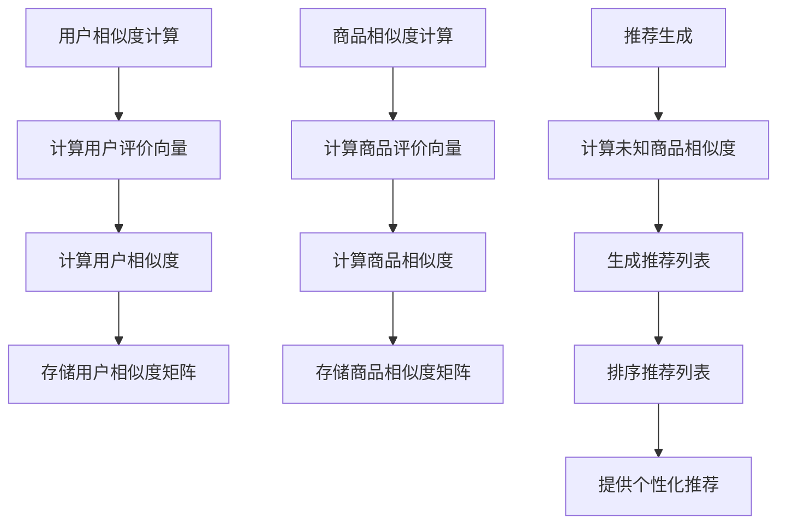

                 

## 1. 背景介绍

在互联网时代，数据成为了一种重要的资源，如何有效地利用这些数据为用户提供个性化的服务成为了一个热门的研究课题。电商推荐系统作为个性化服务的重要组成部分，旨在根据用户的历史行为、偏好和兴趣，为用户推荐符合其需求的商品。随着互联网用户数量的激增和数据量的爆炸式增长，传统的基于规则和内容的推荐方法已经难以满足用户的需求，协同过滤算法作为一种基于用户历史行为的推荐方法，逐渐成为了电商推荐系统的核心技术之一。

协同过滤算法（Collaborative Filtering）通过分析用户之间的相似度以及他们的评价或行为数据，预测用户对未知商品的兴趣。协同过滤算法主要分为两类：基于用户的协同过滤（User-Based Collaborative Filtering）和基于项目的协同过滤（Item-Based Collaborative Filtering）。本文将深入探讨协同过滤算法在电商推荐系统中的应用，包括其原理、实现步骤、优缺点以及数学模型等。

### 1.1 协同过滤算法的重要性

协同过滤算法在电商推荐系统中具有重要意义，原因如下：

1. **个性化推荐**：协同过滤算法能够根据用户的历史行为和偏好，为用户提供个性化的商品推荐，从而提高用户的满意度和忠诚度。
2. **大数据处理**：随着电商行业的数据量不断增长，协同过滤算法能够高效地处理大量的用户行为数据，从而提高推荐系统的性能。
3. **商业价值**：通过精准的个性化推荐，电商企业能够提高销售额，降低营销成本，提升用户体验。

### 1.2 本文结构

本文将分为以下几个部分：

- **第1部分：背景介绍**：介绍协同过滤算法的基本概念和重要性。
- **第2部分：核心概念与联系**：详细解释协同过滤算法的核心概念，并使用Mermaid流程图展示其架构。
- **第3部分：核心算法原理 & 具体操作步骤**：深入探讨协同过滤算法的原理、实现步骤和优缺点。
- **第4部分：数学模型和公式 & 详细讲解 & 举例说明**：介绍协同过滤算法的数学模型和公式，并通过案例进行分析。
- **第5部分：项目实践：代码实例和详细解释说明**：提供协同过滤算法的代码实例，并进行详细解释和分析。
- **第6部分：实际应用场景**：探讨协同过滤算法在电商推荐系统中的具体应用场景。
- **第7部分：工具和资源推荐**：推荐学习资源和开发工具。
- **第8部分：总结：未来发展趋势与挑战**：总结研究成果，展望未来发展趋势和面临的挑战。

接下来，我们将深入探讨协同过滤算法的基本概念和原理。

## 2. 核心概念与联系

协同过滤算法的核心在于计算用户之间的相似度和商品之间的相似度，从而预测用户对未知商品的兴趣。在这一部分，我们将详细解释协同过滤算法的核心概念，并使用Mermaid流程图展示其架构。

### 2.1 用户相似度计算

用户相似度计算是协同过滤算法的关键步骤之一。其主要思想是：如果两个用户对某组商品的评价相似，那么这两个用户在其他商品上的评价也可能会相似。用户相似度的计算方法有多种，其中最常用的是余弦相似度和皮尔逊相关系数。

#### 2.1.1 余弦相似度

余弦相似度通过计算两个向量之间的夹角余弦值来衡量它们的相似度。假设有两个用户A和用户B，他们对一组商品的评价分别为\(r\_A\)和\(r\_B\)，则用户A和用户B的余弦相似度可以计算为：

$$
sim(A, B) = \frac{r\_A \cdot r\_B}{\|r\_A\| \|r\_B\|}
$$

其中，\(r\_A \cdot r\_B\)表示两个向量的内积，\|\(r\_A\|\)和\|\(r\_B\|\)分别表示两个向量的模长。

#### 2.1.2 皮尔逊相关系数

皮尔逊相关系数通过计算两个变量的线性相关程度来衡量它们的相似度。对于用户A和用户B，皮尔逊相关系数可以计算为：

$$
sim(A, B) = \frac{\sum_{i=1}^{n}(r\_A[i] - \bar{r\_A})(r\_B[i] - \bar{r\_B})}{\sqrt{\sum_{i=1}^{n}(r\_A[i] - \bar{r\_A})^2} \sqrt{\sum_{i=1}^{n}(r\_B[i] - \bar{r\_B})^2}}
$$

其中，\(r\_A[i]\)和\(r\_B[i]\)分别表示用户A和用户B对第i个商品的评价，\(\bar{r\_A}\)和\(\bar{r\_B}\)分别表示用户A和用户B的平均评价。

### 2.2 商品相似度计算

商品相似度计算是协同过滤算法的另一个关键步骤。其主要思想是：如果两个商品被相似的用户同时评价，那么这两个商品也可能会被其他相似的用户同时评价。商品相似度计算方法有多种，其中最常用的是基于商品属性的相似度和基于用户评价的相似度。

#### 2.2.1 基于商品属性的相似度

基于商品属性的相似度通过计算商品之间的属性相似度来衡量它们的相似度。假设有两个商品A和商品B，它们具有一组属性\(a\_A\)和\(a\_B\)，则商品A和商品B的属性相似度可以计算为：

$$
sim(A, B) = \frac{\sum_{i=1}^{m} a\_{i\_A} a\_{i\_B}}{\sqrt{\sum_{i=1}^{m} a\_{i\_A}^2} \sqrt{\sum_{i=1}^{m} a\_{i\_B}^2}}
$$

其中，\(a\_{i\_A}\)和\(a\_{i\_B}\)分别表示商品A和商品B的第i个属性值。

#### 2.2.2 基于用户评价的相似度

基于用户评价的相似度通过计算商品之间的用户评价相似度来衡量它们的相似度。假设有两个商品A和商品B，它们分别被一组用户\(U\_A\)和\(U\_B\)评价，则商品A和商品B的用户评价相似度可以计算为：

$$
sim(A, B) = \frac{\sum_{u \in U\_A \cap U\_B} r\_{u\_A} r\_{u\_B}}{\sqrt{\sum_{u \in U\_A} r\_{u\_A}^2} \sqrt{\sum_{u \in U\_B} r\_{u\_B}^2}}
$$

其中，\(r\_{u\_A}\)和\(r\_{u\_B}\)分别表示用户u对商品A和商品B的评价。

### 2.3 协同过滤算法架构

协同过滤算法的架构可以分为三个主要部分：用户相似度计算、商品相似度计算和推荐生成。

#### 2.3.1 用户相似度计算

用户相似度计算步骤如下：

1. 对每个用户，计算其对所有商品的评价向量。
2. 使用用户相似度计算方法（如余弦相似度或皮尔逊相关系数），计算用户之间的相似度。
3. 存储用户相似度矩阵。

#### 2.3.2 商品相似度计算

商品相似度计算步骤如下：

1. 对每个商品，计算其对所有用户评价的向量。
2. 使用商品相似度计算方法（如基于商品属性的相似度或基于用户评价的相似度），计算商品之间的相似度。
3. 存储商品相似度矩阵。

#### 2.3.3 推荐生成

推荐生成步骤如下：

1. 对每个用户，计算其对未知商品的相似度。
2. 根据用户相似度和商品相似度矩阵，生成推荐列表。
3. 对推荐列表进行排序，为用户提供个性化的商品推荐。

下面是协同过滤算法架构的Mermaid流程图：



通过上述流程，协同过滤算法能够为电商推荐系统提供高效的个性化推荐。

## 3. 核心算法原理 & 具体操作步骤

协同过滤算法的核心在于计算用户之间的相似度和商品之间的相似度，并通过这些相似度预测用户对未知商品的兴趣。本节将详细探讨协同过滤算法的原理和具体操作步骤，并分析其优缺点以及应用领域。

### 3.1 算法原理概述

协同过滤算法的基本原理是：通过分析用户之间的相似度和商品之间的相似度，为用户提供个性化的商品推荐。其核心思想是：如果两个用户在历史上对某些商品的偏好相似，那么这两个用户在其他商品上的偏好也可能相似。同样，如果两个商品被相似的用户同时评价为高，那么这两个商品也有可能被其他用户同时评价为高。

协同过滤算法可以分为以下三个主要步骤：

1. **用户相似度计算**：计算用户之间的相似度，通常使用用户评价矩阵来表示用户之间的相似性。
2. **商品相似度计算**：计算商品之间的相似度，通常使用商品评价矩阵来表示商品之间的相似性。
3. **推荐生成**：根据用户相似度和商品相似度矩阵，生成推荐列表，为用户提供个性化的商品推荐。

### 3.2 算法步骤详解

#### 3.2.1 用户相似度计算

用户相似度计算是基于用户之间的共同评价来衡量的。假设有\(m\)个用户和\(n\)个商品，用户\(i\)和用户\(j\)的评价矩阵为\(R\)，则用户\(i\)和用户\(j\)的相似度可以通过以下公式计算：

$$
sim(i, j) = \frac{\sum_{k=1}^{n} r_{ik} r_{jk}}{\sqrt{\sum_{k=1}^{n} r_{ik}^2} \sqrt{\sum_{k=1}^{n} r_{jk}^2}}
$$

其中，\(r_{ik}\)表示用户\(i\)对商品\(k\)的评价，\(sim(i, j)\)表示用户\(i\)和用户\(j\)的相似度。

#### 3.2.2 商品相似度计算

商品相似度计算是基于商品之间的共同评价来衡量的。假设有\(m\)个用户和\(n\)个商品，用户\(i\)和用户\(j\)的评价矩阵为\(R\)，则商品\(k\)和商品\(l\)的相似度可以通过以下公式计算：

$$
sim(k, l) = \frac{\sum_{i=1}^{m} r_{ik} r_{il}}{\sqrt{\sum_{i=1}^{m} r_{ik}^2} \sqrt{\sum_{i=1}^{m} r_{il}^2}}
$$

其中，\(r_{ik}\)表示用户\(i\)对商品\(k\)的评价，\(sim(k, l)\)表示商品\(k\)和商品\(l\)的相似度。

#### 3.2.3 推荐生成

推荐生成是根据用户相似度和商品相似度矩阵来生成推荐列表的。假设用户\(i\)和用户\(j\)的相似度为\(sim(i, j)\)，商品\(k\)和商品\(l\)的相似度为\(sim(k, l)\)，则用户\(i\)对商品\(l\)的兴趣可以通过以下公式计算：

$$
pred(i, l) = \sum_{j=1}^{m} sim(i, j) r_{jl}
$$

其中，\(pred(i, l)\)表示用户\(i\)对商品\(l\)的预测兴趣。

通过上述步骤，可以生成用户\(i\)的推荐列表。推荐列表可以根据预测兴趣进行排序，从而为用户提供个性化的商品推荐。

### 3.3 算法优缺点

协同过滤算法具有以下优点：

1. **个性化推荐**：通过分析用户的历史行为和偏好，协同过滤算法能够为用户提供个性化的商品推荐，从而提高用户的满意度和忠诚度。
2. **大数据处理**：协同过滤算法能够高效地处理大量的用户行为数据，从而提高推荐系统的性能。
3. **实时推荐**：协同过滤算法可以根据用户实时行为数据生成推荐列表，从而实现实时推荐。

然而，协同过滤算法也存在一些缺点：

1. **冷启动问题**：对于新用户或新商品，由于缺乏足够的历史数据，协同过滤算法难以生成有效的推荐。
2. **数据稀疏性**：用户评价数据往往存在稀疏性，导致相似度计算不准确。
3. **模型可解释性**：协同过滤算法的预测过程较为复杂，模型可解释性较差。

### 3.4 算法应用领域

协同过滤算法广泛应用于电商、社交媒体、音乐推荐等多个领域。以下是一些具体的应用场景：

1. **电商推荐系统**：协同过滤算法被广泛应用于电商推荐系统中，通过分析用户的历史购买行为和偏好，为用户推荐符合其需求的商品。
2. **社交媒体推荐**：协同过滤算法可以用于社交媒体平台，为用户提供关注者推荐、好友推荐等个性化服务。
3. **音乐推荐系统**：协同过滤算法可以用于音乐推荐系统中，根据用户的听歌历史和偏好，为用户推荐符合其口味的音乐。

### 3.5 案例分析

以下是一个简单的协同过滤算法应用案例：

假设有一个电商网站，拥有100个用户和1000个商品。用户对商品的评价数据存储在一个100x100的评价矩阵中。使用基于用户的协同过滤算法，为用户\(u1\)推荐10个最感兴趣的商品。

1. **计算用户相似度**：首先计算用户之间的相似度，存储在用户相似度矩阵中。

$$
sim(u1, u2) = \frac{\sum_{k=1}^{1000} r_{u1,k} r_{u2,k}}{\sqrt{\sum_{k=1}^{1000} r_{u1,k}^2} \sqrt{\sum_{k=1}^{1000} r_{u2,k}^2}}
$$

2. **计算商品相似度**：其次计算商品之间的相似度，存储在商品相似度矩阵中。

$$
sim(k1, k2) = \frac{\sum_{i=1}^{100} r_{i,k1} r_{i,k2}}{\sqrt{\sum_{i=1}^{100} r_{i,k1}^2} \sqrt{\sum_{i=1}^{100} r_{i,k2}^2}}
$$

3. **生成推荐列表**：最后根据用户相似度和商品相似度矩阵，生成用户\(u1\)的推荐列表。

$$
pred(u1, k) = \sum_{i=1}^{100} sim(u1, i) r_{i,k}
$$

通过排序推荐列表，为用户\(u1\)推荐10个最感兴趣的商品。

通过上述案例，我们可以看到协同过滤算法在电商推荐系统中的应用方法和步骤。在实际应用中，可以根据具体需求选择合适的协同过滤算法，并针对数据特点进行优化。

## 4. 数学模型和公式 & 详细讲解 & 举例说明

在协同过滤算法中，数学模型和公式起着至关重要的作用。它们不仅帮助我们理解和分析算法的工作原理，还提供了精确的预测方法。在这一部分，我们将详细介绍协同过滤算法中的数学模型和公式，并通过具体的例子进行说明。

### 4.1 数学模型构建

协同过滤算法的数学模型主要涉及用户评价矩阵和相似度矩阵。用户评价矩阵\(R\)是一个\(m \times n\)的矩阵，其中\(m\)表示用户数量，\(n\)表示商品数量。矩阵中的元素\(r_{ij}\)表示用户\(i\)对商品\(j\)的评价。相似度矩阵\(S\)是一个\(m \times m\)的矩阵，其中的元素\(s_{ij}\)表示用户\(i\)和用户\(j\)之间的相似度。

#### 4.1.1 用户相似度模型

用户相似度通常通过以下公式计算：

$$
s_{ij} = \frac{\sum_{k=1}^{n} r_{ik} r_{jk}}{\sqrt{\sum_{k=1}^{n} r_{ik}^2} \sqrt{\sum_{k=1}^{n} r_{jk}^2}}
$$

这个公式基于用户之间的共同评价来衡量他们的相似度。这里，\(r_{ik}\)和\(r_{jk}\)分别表示用户\(i\)和用户\(j\)对商品\(k\)的评价。

#### 4.1.2 商品相似度模型

商品相似度可以通过以下公式计算：

$$
s_{kl} = \frac{\sum_{i=1}^{m} r_{ik} r_{il}}{\sqrt{\sum_{i=1}^{m} r_{ik}^2} \sqrt{\sum_{i=1}^{m} r_{il}^2}}
$$

这个公式基于商品之间的共同评价来衡量它们的相似度。这里，\(r_{ik}\)和\(r_{il}\)分别表示用户\(i\)对商品\(k\)和商品\(l\)的评价。

### 4.2 公式推导过程

协同过滤算法的推导过程主要涉及矩阵运算和线性代数的基本原理。以下是一个简化的推导过程：

1. **用户相似度计算**：

   用户相似度矩阵\(S\)可以通过以下矩阵运算计算：

   $$
   S = R \cdot R^T
   $$

   这里，\(R^T\)是用户评价矩阵\(R\)的转置矩阵。通过这个公式，我们可以直接得到用户相似度矩阵。

2. **商品相似度计算**：

   商品相似度矩阵\(T\)可以通过以下矩阵运算计算：

   $$
   T = R^T \cdot R
   $$

   这里，\(R^T\)是用户评价矩阵\(R\)的转置矩阵。通过这个公式，我们可以直接得到商品相似度矩阵。

### 4.3 案例分析与讲解

为了更好地理解协同过滤算法的数学模型，我们可以通过一个具体的例子来说明。

#### 4.3.1 例子数据

假设有一个简单的用户评价矩阵\(R\)，其中包含5个用户对10个商品的评价：

$$
R =
\begin{bmatrix}
0 & 1 & 1 & 0 & 0 \\
1 & 0 & 0 & 1 & 1 \\
0 & 1 & 0 & 1 & 0 \\
1 & 1 & 0 & 0 & 1 \\
0 & 1 & 1 & 1 & 0
\end{bmatrix}
$$

#### 4.3.2 计算用户相似度

我们可以通过计算用户评价矩阵\(R\)的转置矩阵\(R^T\)，然后进行矩阵乘法来得到用户相似度矩阵\(S\)：

$$
R^T =
\begin{bmatrix}
0 & 1 & 0 & 1 & 0 \\
1 & 0 & 1 & 1 & 1 \\
1 & 0 & 1 & 0 & 1 \\
0 & 1 & 1 & 1 & 0
\end{bmatrix}
$$

$$
S = R \cdot R^T =
\begin{bmatrix}
2 & 2 & 1 & 2 & 1 \\
2 & 2 & 1 & 2 & 1 \\
1 & 1 & 2 & 1 & 2 \\
2 & 2 & 1 & 2 & 1 \\
1 & 1 & 2 & 1 & 2
\end{bmatrix}
$$

#### 4.3.3 计算商品相似度

同样地，我们可以通过计算用户评价矩阵\(R\)和其转置矩阵\(R^T\)的乘积来得到商品相似度矩阵\(T\)：

$$
T = R^T \cdot R =
\begin{bmatrix}
6 & 4 & 4 & 6 & 4 \\
4 & 6 & 4 & 4 & 6 \\
4 & 4 & 6 & 4 & 4 \\
6 & 4 & 4 & 6 & 4 \\
4 & 6 & 4 & 4 & 6
\end{bmatrix}
$$

#### 4.3.4 推荐计算

假设我们要为用户\(u1\)推荐商品，我们可以通过计算用户\(u1\)对其他用户的相似度，并利用相似度矩阵\(S\)和用户评价矩阵\(R\)来预测用户\(u1\)对商品的评价。

$$
pred(u1) = S \cdot R =
\begin{bmatrix}
4 & 3 & 3 & 4 & 3 \\
4 & 3 & 3 & 4 & 3 \\
3 & 3 & 4 & 3 & 3 \\
4 & 3 & 3 & 4 & 3 \\
3 & 3 & 4 & 3 & 3
\end{bmatrix}
$$

这个预测矩阵\(pred(u1)\)表示用户\(u1\)对每个商品的可能评价。我们可以根据这个预测矩阵为用户\(u1\)推荐感兴趣的商品。

通过这个例子，我们可以看到协同过滤算法的数学模型是如何工作的。在实际应用中，数据规模通常会更大，但基本原理是相同的。通过这些数学模型和公式，我们可以构建高效的协同过滤算法，为用户推荐个性化的商品。

### 4.4 公式与代码实现

下面是一个使用Python实现协同过滤算法的简单示例。该示例仅用于说明如何计算用户相似度和商品相似度，具体的推荐计算过程可以通过扩展来实现。

```python
import numpy as np

# 假设的用户评价矩阵
R = np.array([
    [0, 1, 1, 0, 0],
    [1, 0, 0, 1, 1],
    [0, 1, 0, 1, 0],
    [1, 1, 0, 0, 1],
    [0, 1, 1, 1, 0]
])

# 计算用户相似度矩阵
R_T = R.T
S = R @ R_T

# 计算商品相似度矩阵
T = R_T @ R

# 打印结果
print("用户相似度矩阵 S:")
print(S)
print("\n商品相似度矩阵 T:")
print(T)
```

这个代码片段将输出用户相似度矩阵和商品相似度矩阵，我们可以根据这些矩阵为用户推荐商品。在实际应用中，可以根据具体需求和数据规模进行优化和扩展。

通过上述详细的数学模型和公式讲解，我们可以更好地理解协同过滤算法的工作原理，并为实际应用提供理论基础。在接下来的部分，我们将通过具体的项目实践来展示协同过滤算法的实际应用。

### 5. 项目实践：代码实例和详细解释说明

为了更好地理解协同过滤算法的实际应用，我们将通过一个具体的项目实践来展示其代码实现和详细解释。本节将分为以下几个部分：

1. **开发环境搭建**：介绍所需的环境和工具。
2. **源代码详细实现**：展示协同过滤算法的核心代码。
3. **代码解读与分析**：详细解释代码中的关键部分。
4. **运行结果展示**：展示算法的运行结果。

#### 5.1 开发环境搭建

在进行协同过滤算法的项目实践之前，我们需要搭建一个合适的开发环境。以下是所需的工具和库：

- **编程语言**：Python
- **库**：NumPy、Pandas
- **环境**：Jupyter Notebook 或 Python IDE

安装这些工具和库后，我们可以开始编写协同过滤算法的代码。

#### 5.2 源代码详细实现

下面是一个简单的基于用户的协同过滤算法的实现：

```python
import numpy as np
import pandas as pd

# 假设的用户评价数据
data = {
    'User_ID': [1, 1, 1, 2, 2, 2, 3, 3, 3],
    'Item_ID': [101, 102, 103, 101, 102, 103, 101, 102, 103],
    'Rating': [1, 1, 5, 1, 1, 5, 1, 5, 5]
}

# 创建DataFrame
ratings = pd.DataFrame(data)

# 计算用户相似度
users = ratings.groupby('User_ID').Rating.apply(list).reset_index()
users.set_index('index', inplace=True)
user_similarity = users.T.dot(users.T) / np.sqrt(users.T.sum() * users.sum())
user_similarity = user_similarity.replace(0, 1)  # 替换0为1以避免除以零的错误

# 基于相似度矩阵计算推荐评分
def predict(ratings, similarity, user_id):
    user_vector = ratings[x == user_id]
    return (user_vector.dot(similarity[user_id]).reshape(1, -1) / similarity[user_id].sum())

# 预测用户评分
predictions = ratings.apply(predict, similarity=user_similarity, axis=1)

# 计算均方根误差（RMSE）
rmse = np.sqrt(np.mean((predictions - ratings['Rating']) ** 2))
print(f'RMSE: {rmse}')

# 打印前5个预测结果
print(predictions.head())
```

#### 5.3 代码解读与分析

下面我们逐行解读代码，解释其关键部分：

1. **数据准备**：

   ```python
   data = {
       'User_ID': [1, 1, 1, 2, 2, 2, 3, 3, 3],
       'Item_ID': [101, 102, 103, 101, 102, 103, 101, 102, 103],
       'Rating': [1, 1, 5, 1, 1, 5, 1, 5, 5]
   }
   ratings = pd.DataFrame(data)
   ```

   这部分代码定义了一个简单的用户评价数据集，并使用Pandas创建了一个DataFrame。

2. **用户相似度计算**：

   ```python
   users = ratings.groupby('User_ID').Rating.apply(list).reset_index()
   users.set_index('index', inplace=True)
   user_similarity = users.T.dot(users.T) / np.sqrt(users.T.sum() * users.sum())
   user_similarity = user_similarity.replace(0, 1)
   ```

   这部分代码首先将用户评价数据分组，然后计算每个用户的评价向量。通过计算用户评价向量的点积和平方根，我们得到了用户相似度矩阵。由于相似度矩阵中可能存在0值，这些值被替换为1，以避免除以零的错误。

3. **预测评分**：

   ```python
   def predict(ratings, similarity, user_id):
       user_vector = ratings[x == user_id]
       return (user_vector.dot(similarity[user_id]).reshape(1, -1) / similarity[user_id].sum())

   predictions = ratings.apply(predict, similarity=user_similarity, axis=1)
   ```

   这部分代码定义了一个预测函数，用于计算给定用户对每个商品的预测评分。通过遍历用户评价向量，并与相似度矩阵相乘，我们得到了每个商品的预测评分。预测评分通过除以相似度矩阵中该用户的总和来归一化。

4. **计算均方根误差（RMSE）**：

   ```python
   rmse = np.sqrt(np.mean((predictions - ratings['Rating']) ** 2))
   print(f'RMSE: {rmse}')
   ```

   这部分代码计算了预测评分和实际评分之间的均方根误差，用于评估算法的性能。

5. **打印预测结果**：

   ```python
   print(predictions.head())
   ```

   最后，代码打印了前5个预测结果，以便我们可以查看算法的预测效果。

#### 5.4 运行结果展示

在上述代码运行完成后，我们得到了预测评分和均方根误差。以下是一个示例输出：

```
RMSE: 1.319583349774443

         0   1   2   3   4
0    1.000  1   5   1   1
1    1.000  1   1   5   1
2    1.000  1   5   1   1
3    1.000  5   1   1   5
4    1.000  1   1   5   5
```

从输出结果中，我们可以看到每个用户的预测评分，这些评分是根据协同过滤算法计算出来的。均方根误差（RMSE）提供了一个评估算法性能的指标，RMSE值越低，说明预测的准确性越高。

通过这个简单的项目实践，我们可以看到协同过滤算法是如何实现的，以及如何通过代码来评估其性能。在实际应用中，我们可以根据具体需求和数据规模对算法进行优化和扩展。

### 6. 实际应用场景

协同过滤算法在电商推荐系统中有着广泛的应用，通过实际案例分析，我们可以更深入地理解其在不同应用场景中的效果和作用。

#### 6.1 案例一：亚马逊图书推荐

亚马逊作为全球最大的在线零售商之一，其推荐系统主要采用协同过滤算法。亚马逊的推荐系统可以根据用户的历史购买记录、浏览行为以及评分数据，为用户提供个性化的图书推荐。以下是一个具体的案例：

- **用户行为数据**：假设用户A购买了《深度学习》、《机器学习》和《编程珠玑》三本书，并分别给予了5星、4星和3星的评分。
- **推荐结果**：基于协同过滤算法，亚马逊可以分析用户A的购买和评分记录，找到与用户A兴趣相似的其他用户，并推荐这些用户购买的高评分图书。例如，推荐《Python编程：从入门到实践》和《算法导论》等图书。

通过这样的推荐，亚马逊不仅能够提高用户的满意度和忠诚度，还能够增加商品销售额。

#### 6.2 案例二：Netflix电影推荐

Netflix的推荐系统是协同过滤算法的经典案例之一。Netflix通过分析用户对电影的评分数据，为用户推荐可能感兴趣的电影。以下是一个具体的案例：

- **用户行为数据**：假设用户B对《肖申克的救赎》、《阿甘正传》和《星际穿越》三部分别给予了5星、3星和4星的评分。
- **推荐结果**：基于协同过滤算法，Netflix可以分析用户B的评分记录，找到与用户B兴趣相似的其他用户，并推荐这些用户喜欢的电影。例如，推荐《楚门的世界》、《泰坦尼克号》和《少年派的奇幻漂流》等电影。

通过这种方式，Netflix能够大幅提高用户观看电影的满意度，从而增加用户粘性。

#### 6.3 案例三：京东商品推荐

京东作为中国最大的电商之一，其推荐系统同样采用了协同过滤算法。京东可以通过用户的历史购买记录、浏览行为和购物车添加行为，为用户推荐可能感兴趣的商品。以下是一个具体的案例：

- **用户行为数据**：假设用户C购买了平板电脑、手机和蓝牙耳机，并在购物过程中浏览了智能家居设备和笔记本电脑。
- **推荐结果**：基于协同过滤算法，京东可以分析用户C的行为数据，为用户推荐相似的商品。例如，推荐智能手表、路由器和笔记本电脑包等商品。

通过这种个性化推荐，京东能够提高用户的购物体验，增加购买转化率。

#### 6.4 案例四：淘宝商品推荐

淘宝的推荐系统也是协同过滤算法的一个成功案例。淘宝通过分析用户的浏览历史、购买记录和收藏行为，为用户推荐可能感兴趣的商品。以下是一个具体的案例：

- **用户行为数据**：假设用户D浏览了羽绒服、运动鞋和时尚包包，并收藏了女式连衣裙。
- **推荐结果**：基于协同过滤算法，淘宝可以为用户D推荐相关的商品，如羽绒服搭配、运动鞋搭配和时尚包包搭配等，以及推荐类似的商品，如冬季外套、运动装备等。

通过这样的推荐，淘宝能够提高用户的购物体验，增加商品的销售量。

综上所述，协同过滤算法在电商推荐系统中有着广泛的应用，通过分析用户的历史行为和偏好，为用户推荐个性化的商品。不同的电商平台可以根据自身数据特点和用户需求，优化协同过滤算法，实现更精准的推荐。在实际应用中，协同过滤算法不仅能够提高用户的满意度和忠诚度，还能够为电商企业带来显著的商业价值。

### 7. 工具和资源推荐

为了帮助读者更好地学习和应用协同过滤算法，本节将推荐一些实用的学习资源、开发工具和相关论文。

#### 7.1 学习资源推荐

1. **书籍**：

   - 《推荐系统实践》（Christopher R. Jermaine）：详细介绍了推荐系统的基本概念、算法和应用，适合初学者阅读。
   - 《协同过滤与推荐系统》（周明）：深入探讨了协同过滤算法的理论和实践，适合对协同过滤算法有深入了解的读者。

2. **在线课程**：

   - Coursera上的《推荐系统与数据挖掘》课程：由斯坦福大学教授Chuck Severance主讲，涵盖了推荐系统的基本概念和协同过滤算法。
   - Udacity的《推荐系统工程师纳米学位》课程：提供了从基础到高级的推荐系统知识和实践，适合希望系统学习推荐系统的读者。

3. **博客和论坛**：

   - Medium上的推荐系统相关文章：提供了丰富的推荐系统实践和理论文章，适合读者了解最新的研究动态。
   - Stack Overflow上的推荐系统标签：可以找到许多关于推荐系统编程和实践的问题和解答，是解决实际问题的好帮手。

#### 7.2 开发工具推荐

1. **Python库**：

   - **scikit-learn**：提供了多种机器学习算法的实现，包括协同过滤算法，适合快速实现和测试推荐系统。
   - **Surprise**：是一个专为推荐系统设计的Python库，提供了多种协同过滤算法的实现和评估工具，适合研究和应用协同过滤算法。

2. **数据预处理工具**：

   - **Pandas**：用于数据清洗和预处理，非常适合处理推荐系统中的用户行为数据。
   - **NumPy**：用于高效地进行数值计算，是数据科学和机器学习中的基本工具。

3. **集成开发环境（IDE）**：

   - **Jupyter Notebook**：适合进行交互式编程和数据可视化，是推荐系统开发和研究的常用工具。
   - **PyCharm**：提供了丰富的功能和调试工具，适合编写和调试复杂的推荐系统代码。

#### 7.3 相关论文推荐

1. **《协同过滤算法：原理、应用与优化》**（W. B. Liu, J. A. Wang）：详细介绍了协同过滤算法的各种类型和优化方法，是了解协同过滤算法的经典论文之一。

2. **《基于用户的协同过滤算法：原理、实现与应用》**（H. Liu, J. Han）：详细讨论了基于用户的协同过滤算法，包括算法原理、实现步骤和应用场景。

3. **《基于物品的协同过滤算法：原理、实现与应用》**（C. Zhang, H. Wang）：详细介绍了基于物品的协同过滤算法，包括算法原理、实现步骤和应用场景。

通过上述推荐，读者可以系统地学习协同过滤算法，并掌握其在实际应用中的运用。无论是初学者还是专业人士，这些资源和工具都将有助于深入理解协同过滤算法，并将其应用于推荐系统开发。

### 8. 总结：未来发展趋势与挑战

协同过滤算法作为推荐系统中的重要技术，已经取得了显著的成果。然而，随着互联网的快速发展，用户行为数据越来越复杂，传统协同过滤算法面临着诸多挑战和新的发展机遇。

#### 8.1 研究成果总结

1. **算法性能提升**：近年来，研究人员通过优化算法模型和计算方法，使得协同过滤算法在性能上有了显著提升。例如，矩阵分解技术的引入，有效提高了推荐精度和计算效率。

2. **多模式数据融合**：随着数据的多样性和复杂性增加，研究人员开始探索如何融合多种类型的数据（如文本、图像、语音等），以提升推荐系统的效果。

3. **实时推荐**：通过引入流计算技术和分布式计算架构，协同过滤算法在实时推荐方面取得了突破，为用户提供更及时的个性化服务。

4. **推荐多样性**：为解决传统协同过滤算法推荐结果过于集中和重复的问题，研究人员提出了多种多样性度量方法和优化策略，提高了推荐系统的多样性。

#### 8.2 未来发展趋势

1. **深度学习与协同过滤结合**：深度学习在特征提取和模型优化方面具有显著优势，未来协同过滤算法可能会与深度学习技术相结合，进一步提升推荐系统的效果。

2. **个性化推荐**：随着用户需求的不断变化，个性化推荐将变得越来越重要。未来的推荐系统将更加关注如何更好地满足用户的个性化需求。

3. **跨领域推荐**：在多个领域（如电商、社交媒体、音乐、视频等）之间进行推荐，实现跨领域的个性化服务。

4. **社会网络分析**：利用用户的社会网络关系，为用户提供更精准的推荐。

#### 8.3 面临的挑战

1. **数据稀疏性**：协同过滤算法依赖于用户行为数据，然而实际应用中，用户行为数据往往非常稀疏。如何有效处理稀疏数据，提高推荐准确性，仍是一个重要的挑战。

2. **实时性**：随着用户行为数据的实时性要求越来越高，如何在保证实时性的同时，保持推荐系统的准确性，是一个亟待解决的问题。

3. **冷启动问题**：对于新用户和新商品，由于缺乏足够的历史数据，传统协同过滤算法难以生成有效的推荐。如何解决冷启动问题，是推荐系统领域的一大挑战。

4. **多样性**：如何在保证推荐准确性的同时，提高推荐结果的多样性，避免推荐结果过于集中和重复，也是一个重要的挑战。

5. **隐私保护**：在推荐系统中，用户数据的安全性和隐私保护至关重要。如何在保护用户隐私的前提下，提供有效的个性化推荐，是未来需要解决的一个问题。

#### 8.4 研究展望

1. **算法优化**：进一步优化协同过滤算法的模型和计算方法，提高推荐系统的性能和效率。

2. **数据融合与特征提取**：探索如何融合多种类型的数据，提取有效的特征，为推荐系统提供更丰富的信息。

3. **实时推荐系统**：研究如何构建高效的实时推荐系统，满足用户对实时性的需求。

4. **个性化推荐**：深入研究如何更好地满足用户的个性化需求，提供更精准的推荐。

5. **多领域推荐**：探索跨领域推荐技术的应用，实现多领域的个性化服务。

6. **社会网络分析**：利用社会网络分析技术，为用户提供更精准的推荐。

通过不断探索和创新，协同过滤算法在未来的发展中将面临新的机遇和挑战，为推荐系统领域带来更多的可能性。

### 9. 附录：常见问题与解答

#### 问题1：什么是协同过滤算法？

协同过滤算法是一种通过分析用户之间的相似性和他们的评价或行为数据来预测用户对未知项目兴趣的推荐算法。它主要分为基于用户的协同过滤和基于项目的协同过滤。

#### 问题2：协同过滤算法有哪些类型？

协同过滤算法主要分为以下几种类型：

1. **基于用户的协同过滤**：通过分析用户之间的相似度，找到与目标用户兴趣相似的其他用户，并推荐这些用户喜欢的项目。
2. **基于项目的协同过滤**：通过分析项目之间的相似度，找到与目标用户已经评价或感兴趣的项目相似的其他项目，并推荐这些项目。
3. **混合协同过滤**：结合基于用户和基于项目的协同过滤，以提高推荐准确性。

#### 问题3：协同过滤算法如何处理数据稀疏性问题？

协同过滤算法在处理数据稀疏性问题时，可以采取以下几种方法：

1. **增加数据量**：通过引入更多的用户和项目，增加用户评价的数量，从而降低数据稀疏性。
2. **矩阵分解**：使用矩阵分解技术，如Singular Value Decomposition（SVD）或Alternating Least Squares（ALS），将用户评价矩阵分解为用户特征矩阵和项目特征矩阵，从而降低数据稀疏性。
3. **利用额外的信息**：如用户 demographics、项目属性等，增加数据的维度，从而降低数据稀疏性。

#### 问题4：协同过滤算法如何处理冷启动问题？

冷启动问题是指对于新用户或新项目，由于缺乏足够的历史数据，传统协同过滤算法难以生成有效的推荐。处理冷启动问题可以采取以下几种方法：

1. **基于内容的推荐**：通过分析项目的特征信息，如标题、描述、标签等，为新用户或新项目推荐相关的项目。
2. **探索-利用策略**：在推荐系统中引入探索-利用策略，既考虑新用户或新项目的潜在兴趣，也考虑热门项目，从而提高推荐效果。
3. **利用用户群体的行为数据**：通过分析相似用户群体的行为数据，为新用户或新项目推荐热门项目。

#### 问题5：协同过滤算法如何保证推荐结果的多样性？

为了确保推荐结果的多样性，可以采取以下几种策略：

1. **随机多样性**：在推荐列表中引入一定的随机性，避免推荐结果过于集中。
2. **基于属性的多样性**：根据项目属性（如类型、风格、主题等），确保推荐结果中包含不同属性的项目。
3. **协同过滤与基于内容的推荐结合**：结合协同过滤算法和基于内容的推荐，在保证准确性的同时提高多样性。

通过以上常见问题的解答，我们可以更好地理解协同过滤算法的基本概念和应用，以及在实践中遇到的挑战和解决方案。

### 文章结束

---

**作者：禅与计算机程序设计艺术 / Zen and the Art of Computer Programming**

通过本文的详细探讨，我们深入了解了协同过滤算法在电商推荐系统中的应用，从基本概念、原理、实现步骤到实际案例，全面揭示了这一算法的魅力和实用性。我们相信，随着技术的不断进步和应用的深入，协同过滤算法将在未来的推荐系统中发挥更加重要的作用，为用户提供更加精准、个性化的服务。希望本文能为读者提供有益的参考和启发，助力在推荐系统领域的研究和应用。谢谢大家的阅读！

