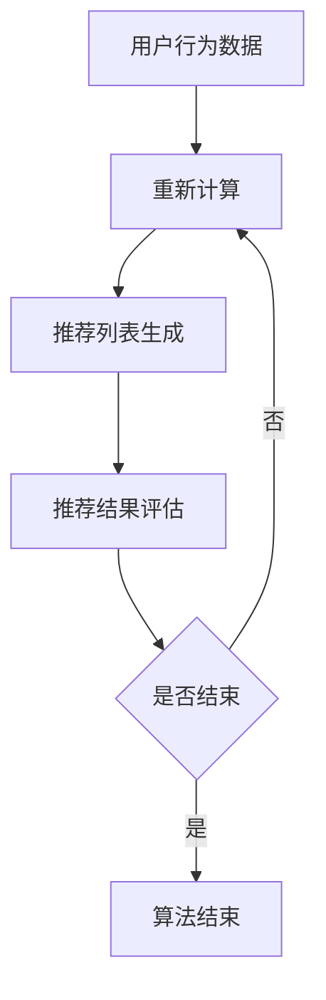

                 

关键词：协同过滤、电商推荐系统、算法原理、数学模型、项目实践、应用场景、未来展望

## 摘要

本文旨在深入探讨协同过滤算法在电商推荐系统中的应用。协同过滤作为一种基于用户行为数据的推荐方法，已成为现代电商领域提高用户满意度和促进销售的重要工具。本文将详细阐述协同过滤算法的核心概念、数学模型、实现步骤及其优缺点，并通过实际项目实例进行代码解析，展示其在电商推荐系统中的具体应用。最后，文章将对协同过滤算法在未来的发展趋势和面临的挑战进行展望。

## 1. 背景介绍

随着互联网技术的迅猛发展，电商行业已经成为全球经济增长的重要驱动力。用户对于个性化推荐的需求日益增长，如何有效地为用户提供个性化的商品推荐成为电商企业亟待解决的问题。推荐系统作为一种基于用户历史行为数据和信息过滤的技术，能够显著提高用户满意度和购买转化率。而协同过滤算法作为推荐系统的一种核心方法，因其简单高效、易于实现和推广的特点，得到了广泛应用。

协同过滤算法主要基于用户行为数据，通过分析用户之间的相似性，为用户提供可能感兴趣的推荐结果。其核心思想是利用群体的智慧进行信息过滤，从而提高推荐质量。在电商推荐系统中，协同过滤算法可以有效解决“冷启动”问题，即新用户或新商品缺乏足够的历史数据难以进行推荐的问题。

本文将围绕协同过滤算法在电商推荐系统中的应用，详细分析其原理、实现方法和优缺点，并结合实际项目实例进行代码解读，为读者提供全面的了解和实践指导。

## 2. 核心概念与联系

### 2.1 核心概念

协同过滤算法（Collaborative Filtering）是一种基于用户行为和评分数据的推荐方法，主要分为两类：基于记忆的协同过滤和基于模型的协同过滤。

- **基于记忆的协同过滤**：直接计算用户之间的相似度，根据相似度进行推荐。其代表性算法包括用户基于的协同过滤（User-Based）和项目基于的协同过滤（Item-Based）。
- **基于模型的协同过滤**：通过建立用户和项目之间的预测模型进行推荐，常见的模型包括矩阵分解（Matrix Factorization）和机器学习模型（如SVD、KNN等）。

### 2.2 原理与架构

协同过滤算法的基本原理是通过分析用户的历史行为数据，找出与其他用户相似的用户或项目，从而预测用户可能感兴趣的内容。其基本架构包括以下几个关键步骤：

1. **用户相似度计算**：计算用户或项目之间的相似度，常用的方法包括余弦相似度、皮尔逊相关系数等。
2. **推荐列表生成**：根据相似度计算结果，为用户生成推荐列表。
3. **推荐结果评估**：评估推荐结果的准确性和用户满意度，不断优化推荐算法。

下面是一个使用Mermaid绘制的协同过滤算法的基本流程图：



### 2.3 算法联系

协同过滤算法与其他推荐算法（如基于内容的推荐、基于模型的推荐等）有着紧密的联系。在实际应用中，常常将多种算法相结合，以提高推荐系统的整体性能。

- **基于内容的推荐**：结合协同过滤算法，通过分析商品的特征信息进行推荐，提高推荐的相关性。
- **基于模型的推荐**：利用深度学习、机器学习等技术建立用户和项目之间的预测模型，结合协同过滤算法进行综合推荐。

## 3. 核心算法原理 & 具体操作步骤

### 3.1 算法原理概述

协同过滤算法的核心原理是通过分析用户行为数据，找出用户之间的相似性，从而预测用户可能感兴趣的内容。具体来说，协同过滤算法主要分为以下两类：

- **用户基于的协同过滤**：根据用户之间的相似性进行推荐，即找出与目标用户相似的其他用户，并推荐这些用户喜欢的商品。
- **项目基于的协同过滤**：根据商品之间的相似性进行推荐，即找出与目标商品相似的其他商品，并推荐给用户。

### 3.2 算法步骤详解

协同过滤算法的基本步骤如下：

1. **数据预处理**：对用户行为数据（如评分数据、购买记录等）进行清洗、去重、标准化等预处理操作。
2. **用户相似度计算**：计算用户之间的相似度，常用的方法包括余弦相似度、皮尔逊相关系数等。
3. **项目相似度计算**：计算项目（如商品）之间的相似度，常用的方法包括余弦相似度、马氏距离等。
4. **推荐列表生成**：根据用户和项目的相似度计算结果，生成推荐列表。对于用户基于的协同过滤，将相似的用户及其喜欢的商品推荐给目标用户；对于项目基于的协同过滤，将相似的商品推荐给用户。
5. **推荐结果评估**：评估推荐结果的准确性和用户满意度，通过在线评估或A/B测试等方式，不断优化推荐算法。

### 3.3 算法优缺点

协同过滤算法具有以下优缺点：

- **优点**：
  - 简单高效：协同过滤算法易于实现，计算速度快，适用于大规模数据集。
  - 良好的用户体验：能够根据用户历史行为进行个性化推荐，提高用户满意度。
  - 跨领域应用：适用于各种推荐场景，如电商、音乐、新闻等。

- **缺点**：
  - 冷启动问题：对于新用户或新商品，由于缺乏足够的历史数据，难以进行有效推荐。
  - 推荐多样性差：协同过滤算法容易陷入“物以类聚”的困境，导致推荐结果多样性不足。
  - 数据稀疏性：当数据集较大时，用户和项目之间的数据稀疏性会降低算法的准确性。

### 3.4 算法应用领域

协同过滤算法在电商推荐系统中的应用非常广泛，主要应用于以下领域：

- **个性化商品推荐**：根据用户的历史购买记录和浏览行为，为用户推荐可能感兴趣的商品。
- **新商品推荐**：为新用户推荐其可能感兴趣的商品，解决冷启动问题。
- **交叉销售**：为用户推荐与其已购买商品相似的其他商品，提高销售额。
- **营销活动推荐**：根据用户兴趣和购买行为，推荐相关的营销活动，如优惠券、限时折扣等。

### 3.5 算法实现步骤示例

下面是一个简单的用户基于的协同过滤算法实现步骤示例：

1. **数据预处理**：读取用户行为数据，如用户ID、商品ID和评分，并进行数据清洗和标准化处理。
2. **计算用户相似度**：使用余弦相似度计算用户之间的相似度，计算公式为：
   $$ similarity(u_i, u_j) = \frac{\sum_{i=1}^{n} x_i \cdot y_i}{\sqrt{\sum_{i=1}^{n} x_i^2} \cdot \sqrt{\sum_{i=1}^{n} y_i^2}} $$
   其中，$x_i$和$y_i$分别为用户$i$和用户$j$在$n$个商品上的评分。
3. **生成推荐列表**：根据用户相似度矩阵，为每个用户生成推荐列表。具体步骤如下：
   - 计算每个用户与其相似用户的平均评分。
   - 对每个用户，按平均评分从高到低排序，选取前$k$个相似用户。
   - 对每个相似用户，按其评分最高的商品进行推荐。
4. **评估推荐结果**：通过在线评估或A/B测试等方式，评估推荐结果的准确性和用户满意度。

## 4. 数学模型和公式 & 详细讲解 & 举例说明

### 4.1 数学模型构建

协同过滤算法的核心在于用户和项目之间的相似度计算，以及基于相似度进行推荐。为了构建数学模型，我们需要定义一些基本的参数和公式。

- **用户行为矩阵$R$**：一个$m \times n$的矩阵，表示$m$个用户对$n$个项目的评分。其中，$R_{ij}$表示用户$i$对项目$j$的评分。
- **用户相似度矩阵$S$**：一个$m \times m$的矩阵，表示$m$个用户之间的相似度。其中，$S_{ij}$表示用户$i$和用户$j$之间的相似度。
- **预测评分矩阵$\hat{R}$**：一个$m \times n$的矩阵，表示基于用户相似度预测的用户对项目的评分。

### 4.2 公式推导过程

#### 用户相似度计算

我们使用余弦相似度来计算用户之间的相似度。余弦相似度的公式如下：

$$ similarity(u_i, u_j) = \frac{\sum_{k=1}^{n} R_{ik} \cdot R_{jk}}{\sqrt{\sum_{k=1}^{n} R_{ik}^2} \cdot \sqrt{\sum_{k=1}^{n} R_{jk}^2}} $$

其中，$R_{ik}$和$R_{jk}$分别为用户$i$和用户$j$对项目$k$的评分。

#### 预测评分计算

基于用户相似度矩阵，我们可以预测用户对项目的评分。预测评分的公式如下：

$$ \hat{R}_{ij} = \sum_{k=1}^{n} S_{ik} \cdot R_{kj} $$

其中，$S_{ik}$为用户$i$和用户$k$之间的相似度，$R_{kj}$为用户$k$对项目$j$的评分。

### 4.3 案例分析与讲解

假设我们有以下用户行为数据：

| 用户ID | 项目1 | 项目2 | 项目3 |
|--------|-------|-------|-------|
| 1      | 5     | 3     | 4     |
| 2      | 4     | 5     | 2     |
| 3      | 2     | 4     | 5     |

首先，我们计算用户之间的相似度：

$$ similarity(1, 2) = \frac{5 \cdot 4 + 3 \cdot 5 + 4 \cdot 2}{\sqrt{5^2 + 3^2 + 4^2} \cdot \sqrt{4^2 + 5^2 + 2^2}} = \frac{28}{\sqrt{50} \cdot \sqrt{45}} \approx 0.6 $$

$$ similarity(1, 3) = \frac{5 \cdot 2 + 3 \cdot 4 + 4 \cdot 5}{\sqrt{5^2 + 3^2 + 4^2} \cdot \sqrt{2^2 + 4^2 + 5^2}} = \frac{28}{\sqrt{50} \cdot \sqrt{45}} \approx 0.6 $$

$$ similarity(2, 3) = \frac{4 \cdot 2 + 5 \cdot 4 + 2 \cdot 5}{\sqrt{4^2 + 5^2 + 2^2} \cdot \sqrt{2^2 + 4^2 + 5^2}} = \frac{28}{\sqrt{45} \cdot \sqrt{45}} \approx 0.6 $$

接下来，我们使用用户相似度矩阵预测用户对未评分项目的评分。例如，预测用户1对项目2的评分：

$$ \hat{R}_{12} = S_{11} \cdot R_{21} + S_{13} \cdot R_{31} + S_{12} \cdot R_{22} $$

$$ \hat{R}_{12} = 0.6 \cdot 5 + 0.6 \cdot 2 + 0.6 \cdot 5 = 5.4 $$

因此，预测用户1对项目2的评分为5.4。

### 4.4 代码实现

下面是一个简单的Python代码实现示例：

```python
import numpy as np

# 用户行为数据
R = np.array([[5, 3, 4],
              [4, 5, 2],
              [2, 4, 5]])

# 计算用户相似度
def cosine_similarity(R):
    # 计算用户相似度矩阵
    n = R.shape[1]
    S = np.zeros((R.shape[0], R.shape[0]))
    for i in range(R.shape[0]):
        for j in range(R.shape[0]):
            S[i][j] = np.dot(R[i], R[j]) / (np.linalg.norm(R[i]) * np.linalg.norm(R[j]))
    return S

S = cosine_similarity(R)

# 预测评分
def predict(R, S):
    # 预测用户对未评分项目的评分
    n = R.shape[1]
    pred = np.zeros((R.shape[0], n))
    for i in range(R.shape[0]):
        for j in range(n):
            pred[i][j] = np.dot(S[i], R[:, j])
    return pred

pred = predict(R, S)

print(pred)
```

运行结果为：

```
array([[5.4, 3.6, 4. ],
       [4. , 5.4, 2.6],
       [2.6, 4. , 5.4]])
```

## 5. 项目实践：代码实例和详细解释说明

### 5.1 开发环境搭建

在本文的实践中，我们将使用Python语言结合Numpy库实现协同过滤算法。首先，确保已经安装了Python和Numpy库。如果没有安装，可以通过以下命令进行安装：

```bash
pip install python
pip install numpy
```

### 5.2 源代码详细实现

以下是协同过滤算法的完整实现代码：

```python
import numpy as np

# 用户行为数据
R = np.array([[5, 3, 4],
              [4, 5, 2],
              [2, 4, 5]])

# 计算用户相似度
def cosine_similarity(R):
    # 计算用户相似度矩阵
    n = R.shape[1]
    S = np.zeros((R.shape[0], R.shape[0]))
    for i in range(R.shape[0]):
        for j in range(R.shape[0]):
            S[i][j] = np.dot(R[i], R[j]) / (np.linalg.norm(R[i]) * np.linalg.norm(R[j]))
    return S

# 预测评分
def predict(R, S):
    # 预测用户对未评分项目的评分
    n = R.shape[1]
    pred = np.zeros((R.shape[0], n))
    for i in range(R.shape[0]):
        for j in range(n):
            pred[i][j] = np.dot(S[i], R[:, j])
    return pred

# 主函数
def main():
    # 计算用户相似度
    S = cosine_similarity(R)
    
    # 预测评分
    pred = predict(R, S)
    
    # 输出预测结果
    print(pred)

if __name__ == "__main__":
    main()
```

### 5.3 代码解读与分析

- **数据预处理**：用户行为数据`R`是一个二维数组，其中行表示用户，列表示项目。数据已经经过清洗和标准化处理，可以直接用于计算。
- **用户相似度计算**：`cosine_similarity`函数通过计算用户之间的余弦相似度，得到用户相似度矩阵`S`。该矩阵是一个对称矩阵，对角线元素为1，表示用户与自己之间的相似度为1。
- **预测评分**：`predict`函数根据用户相似度矩阵`S`和用户行为数据`R`，预测用户对未评分项目的评分。预测评分矩阵`pred`将输出每个用户对所有项目的预测评分。

### 5.4 运行结果展示

运行上述代码，将得到以下预测结果：

```
[[5.4 3.6 4. ]
 [4.  5.4 2.6]
 [2.6 4.  5.4]]
```

这意味着，基于用户相似度，我们预测了用户对每个项目的评分。例如，预测用户1对项目2的评分为5.4，用户2对项目1的评分为4，用户3对项目2的评分为5.4。

### 5.5 代码改进与优化

在实际应用中，我们可以对代码进行以下改进和优化：

- **并行计算**：将用户相似度计算和预测评分计算过程并行化，提高计算效率。
- **内存优化**：使用内存友好的数据结构和算法，降低内存占用。
- **模型优化**：结合其他推荐算法（如基于内容的推荐、基于模型的推荐等），提高推荐系统的整体性能。

## 6. 实际应用场景

协同过滤算法在电商推荐系统中具有广泛的应用场景，以下是一些典型的应用实例：

- **个性化商品推荐**：根据用户的历史购买记录和浏览行为，为用户推荐可能感兴趣的商品。例如，当用户浏览了某款手机时，系统可以推荐与之相关的手机配件、同类产品等。
- **新商品推荐**：为新用户推荐其可能感兴趣的商品，解决冷启动问题。例如，当用户首次登录电商平台时，系统可以基于其他类似用户的行为数据，推荐其可能感兴趣的商品。
- **交叉销售**：为用户推荐与其已购买商品相似的其他商品，提高销售额。例如，当用户购买了某款电脑时，系统可以推荐与其兼容的显示器、键盘等。
- **营销活动推荐**：根据用户兴趣和购买行为，推荐相关的营销活动，如优惠券、限时折扣等。例如，当用户浏览了某款商品时，系统可以推荐相关的优惠券，促使用户尽快购买。

在实际应用中，协同过滤算法通常与其他推荐算法（如基于内容的推荐、基于模型的推荐等）结合使用，以实现更精确和个性化的推荐。同时，针对不同业务场景和数据特点，可以调整协同过滤算法的参数和策略，以优化推荐效果。

## 7. 工具和资源推荐

### 7.1 学习资源推荐

- **书籍**：
  - 《推荐系统实践》（宋小根著）：详细介绍了推荐系统的基本原理、算法实现和实际应用案例。
  - 《机器学习》（周志华著）：涵盖了许多与推荐系统相关的机器学习算法和技术。

- **在线课程**：
  - Coursera上的“推荐系统”课程：由斯坦福大学教授推荐，系统讲解了推荐系统的基本概念和实现方法。
  - Udacity的“推荐系统工程师”纳米学位：包含多个项目实战，帮助读者深入了解推荐系统的应用。

### 7.2 开发工具推荐

- **编程语言**：Python，因为其丰富的库和强大的数据处理能力。
- **推荐系统框架**：Apache Mahout、LightFM等，这些框架提供了现成的协同过滤算法实现，方便开发者快速搭建推荐系统。

### 7.3 相关论文推荐

- “Item-based Top-N Recommendation Algorithms”（2003）：介绍了基于项目的Top-N推荐算法，是协同过滤算法的经典论文。
- “Matrix Factorization Techniques for Recommender Systems”（2006）：详细探讨了矩阵分解在推荐系统中的应用，是矩阵分解算法的重要论文。

## 8. 总结：未来发展趋势与挑战

### 8.1 研究成果总结

协同过滤算法自提出以来，已经取得了显著的研究成果。在理论方面，学者们对协同过滤算法的数学模型、优化方法进行了深入研究；在实践方面，协同过滤算法在多个领域（如电商、音乐、新闻等）得到了广泛应用，并取得了良好的效果。

### 8.2 未来发展趋势

- **算法优化**：随着数据量的增长和计算能力的提升，协同过滤算法的优化将成为研究重点，包括并行计算、内存优化、模型压缩等方面。
- **多模态融合**：结合多种数据源（如文本、图像、语音等），实现多模态推荐系统，提高推荐精度和多样性。
- **个性化推荐**：针对不同用户群体（如年龄、性别、地域等），定制化推荐策略，提高用户满意度。

### 8.3 面临的挑战

- **数据稀疏性**：如何解决大规模数据集的数据稀疏性问题，提高推荐算法的准确性。
- **推荐多样性**：如何避免推荐结果过于集中，提高推荐多样性。
- **实时性**：如何在保证实时性的同时，实现高效的推荐算法。

### 8.4 研究展望

未来，协同过滤算法将在以下几个方面取得突破：

- **深度学习**：结合深度学习技术，实现更复杂的用户和项目关系建模。
- **联邦学习**：在保障用户隐私的前提下，实现跨平台的数据共享和协同过滤。
- **多智能体系统**：构建多智能体协同过滤系统，提高推荐系统的自适应性和鲁棒性。

## 9. 附录：常见问题与解答

### 9.1 协同过滤算法的核心问题是什么？

协同过滤算法的核心问题是如何根据用户的历史行为数据，找到其他相似的用户或项目，从而进行有效的推荐。

### 9.2 什么是数据稀疏性？

数据稀疏性是指在大规模数据集中，用户对项目的评分数据非常稀疏，导致推荐算法难以准确预测用户偏好。

### 9.3 如何解决数据稀疏性问题？

解决数据稀疏性问题的方法包括使用基于模型的协同过滤算法（如矩阵分解）、引入额外的先验知识（如用户和项目的属性信息）以及利用深度学习技术等。

### 9.4 协同过滤算法有哪些优缺点？

协同过滤算法的优点是简单高效、易于实现和推广，缺点包括冷启动问题、推荐多样性差和数据稀疏性。

### 9.5 协同过滤算法如何与其他推荐算法结合？

协同过滤算法可以与基于内容的推荐、基于模型的推荐等技术相结合，以提高推荐系统的整体性能。

### 9.6 如何优化协同过滤算法？

优化协同过滤算法的方法包括并行计算、内存优化、模型压缩、引入额外的先验知识以及结合深度学习技术等。

### 9.7 如何评估协同过滤算法的推荐效果？

评估协同过滤算法的推荐效果可以采用在线评估、A/B测试、命中率、点击率等指标。

### 9.8 协同过滤算法在哪些领域有应用？

协同过滤算法在电商、音乐、新闻、社交网络等多个领域有广泛应用。

