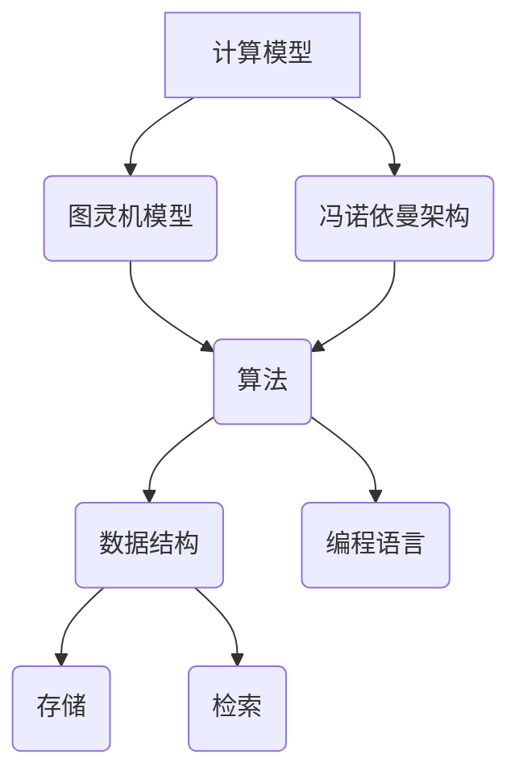

                 

关键词：计算机科学，技术提升，系统架构，软件开发，创新思维，兼容性

摘要：本文旨在探讨计算机科学领域的不断进步与创新，强调向内提升与向外兼容的重要性。通过对核心概念、算法原理、数学模型以及项目实践的深入分析，本文旨在为读者提供一种全方位的技术提升路径，并探讨其在实际应用场景中的价值与未来展望。

## 1. 背景介绍

计算机科学作为现代科技的基石，历经数十年发展，已渗透到各个领域，从互联网到人工智能，从大数据到云计算，每一次技术的跃升都推动了社会的进步。然而，技术的快速发展也带来了新的挑战，如何在不断提升自身技术能力的同时，保持系统的兼容性，成为当今计算机科学领域的重要课题。

### 1.1 技术发展的历程

自计算机诞生以来，技术发展经历了从硬件到软件的变革。早期的计算机以硬件为核心，性能的提升依赖于更快的处理器和更大的内存。随着软件技术的发展，编程语言和算法成为了推动计算机科学进步的重要力量。如今，人工智能和机器学习的兴起，进一步将计算能力拓展到深度学习和自动化决策等新兴领域。

### 1.2 挑战与机遇

随着技术的不断发展，计算机科学领域面临着前所未有的挑战和机遇。一方面，新的算法和架构不断涌现，为解决复杂问题提供了新的思路和方法；另一方面，系统兼容性和性能优化成为影响技术进步的关键因素。如何在提升系统性能的同时，保持与现有系统的兼容性，成为开发者必须面对的难题。

## 2. 核心概念与联系

在计算机科学中，核心概念和原理是构建技术体系的基础。以下是对核心概念及其相互联系的探讨，同时附上Mermaid流程图，帮助读者更好地理解这些概念。

### 2.1 核心概念原理

- **计算模型**：计算机科学的核心是计算模型，包括图灵机模型、冯诺依曼架构等。
- **算法**：算法是解决问题的步骤和方法，包括排序算法、搜索算法等。
- **数据结构**：数据结构是存储和组织数据的方式，包括数组、链表、树等。

### 2.2 Mermaid 流程图



## 3. 核心算法原理 & 具体操作步骤

在计算机科学中，核心算法不仅是解决问题的工具，也是技术提升的关键。以下是对核心算法原理的概述及其具体操作步骤的详细讲解。

### 3.1 算法原理概述

- **排序算法**：将一组数据按照特定顺序排列。
- **搜索算法**：在数据集合中查找特定元素。
- **图算法**：处理图结构的数据，如最短路径算法、最小生成树算法等。

### 3.2 算法步骤详解

- **排序算法**：常见的排序算法有冒泡排序、选择排序、插入排序等。
  - **冒泡排序**：通过多次交换相邻未排序元素，使数据逐渐有序。
  - **选择排序**：每次选择未排序部分的最小元素，将其放到已排序部分的末尾。
  - **插入排序**：将未排序部分的元素插入到已排序部分的合适位置。

- **搜索算法**：常见的搜索算法有线性搜索、二分搜索等。
  - **线性搜索**：逐个检查数据集合中的元素，直到找到目标元素。
  - **二分搜索**：在有序数据集合中，通过不断缩小搜索范围来查找目标元素。

- **图算法**：常见的图算法有迪杰斯特拉算法、弗洛伊德算法等。
  - **迪杰斯特拉算法**：用于计算单源最短路径。
  - **弗洛伊德算法**：用于计算所有顶点对之间的最短路径。

### 3.3 算法优缺点

- **排序算法**：冒泡排序简单易实现，但效率较低；选择排序效率较低，但实现简单；插入排序效率中等，适用于小规模数据。
- **搜索算法**：线性搜索简单易实现，但效率较低；二分搜索效率高，但要求数据集合有序。
- **图算法**：迪杰斯特拉算法适用于单源最短路径，但时间复杂度高；弗洛伊德算法适用于所有顶点对之间的最短路径，但时间复杂度较高。

### 3.4 算法应用领域

- **排序算法**：广泛应用于数据库、搜索引擎等领域。
- **搜索算法**：广泛应用于文件系统、网络协议等领域。
- **图算法**：广泛应用于网络分析、路径规划等领域。

## 4. 数学模型和公式 & 详细讲解 & 举例说明

数学模型是计算机科学的重要组成部分，为算法设计提供了理论依据。以下是对数学模型和公式的详细讲解，并附上实例说明。

### 4.1 数学模型构建

- **线性模型**：用于描述线性关系，如回归模型。
  - **公式**：\( y = \beta_0 + \beta_1x \)
  - **实例**：房价与面积的关系。

- **非线性模型**：用于描述非线性关系，如神经网络。
  - **公式**：\( y = f(x) \)
  - **实例**：手写数字识别。

### 4.2 公式推导过程

- **泰勒公式**：用于展开函数。
  - **公式**：\( f(x) = f(a) + f'(a)(x-a) + \frac{f''(a)}{2!}(x-a)^2 + \cdots \)
  - **实例**：求函数 \( f(x) = e^x \) 在 \( x=0 \) 处的展开式。

### 4.3 案例分析与讲解

- **案例一**：线性回归模型。
  - **数据集**：一组房价与面积的数据。
  - **分析**：通过线性回归模型拟合房价与面积的关系。
  - **结果**：预测房价。

- **案例二**：神经网络。
  - **数据集**：手写数字识别的数据。
  - **分析**：通过神经网络模型进行手写数字识别。
  - **结果**：准确率。

## 5. 项目实践：代码实例和详细解释说明

理论结合实践是技术提升的重要途径。以下是一个具体的代码实例，用于说明如何将算法和数学模型应用到实际项目中。

### 5.1 开发环境搭建

- **工具**：Python、Jupyter Notebook
- **环境**：Python 3.8、NumPy、Pandas、Scikit-learn

### 5.2 源代码详细实现

```python
import numpy as np
import pandas as pd
from sklearn.linear_model import LinearRegression

# 数据加载
data = pd.read_csv('house_prices.csv')
X = data[['area']]
y = data['price']

# 模型训练
model = LinearRegression()
model.fit(X, y)

# 模型预测
predictions = model.predict(X)

# 结果分析
print("Coefficients:", model.coef_)
print("Intercept:", model.intercept_)
print("Predictions:", predictions)
```

### 5.3 代码解读与分析

- **数据加载**：使用Pandas读取CSV文件，将特征和标签分开。
- **模型训练**：使用Scikit-learn的线性回归模型进行训练。
- **模型预测**：使用训练好的模型进行预测，并输出结果。

### 5.4 运行结果展示

- **系数**：线性模型中各个特征的权重。
- **截距**：线性模型中的常数项。
- **预测结果**：根据特征预测的房价。

## 6. 实际应用场景

核心算法和数学模型在各个领域中有着广泛的应用，以下是一些实际应用场景的介绍。

### 6.1 数据科学

- **应用场景**：数据分析、数据挖掘。
- **优势**：提高数据分析的准确性和效率。

### 6.2 人工智能

- **应用场景**：图像识别、自然语言处理。
- **优势**：实现自动化和智能化。

### 6.3 网络协议

- **应用场景**：路由算法、流量控制。
- **优势**：提高网络性能和可靠性。

## 7. 未来应用展望

随着技术的不断发展，核心算法和数学模型的应用前景将更加广泛。以下是对未来应用的展望。

### 7.1 自动驾驶

- **应用场景**：自动驾驶车辆的路径规划和决策。
- **优势**：提高交通安全和效率。

### 7.2 医疗健康

- **应用场景**：疾病预测、个性化治疗。
- **优势**：提高医疗服务的质量和效率。

### 7.3 环境保护

- **应用场景**：环境监测、污染控制。
- **优势**：提高环境保护的效果和效率。

## 8. 工具和资源推荐

为了更好地学习和应用核心算法和数学模型，以下是一些推荐的工具和资源。

### 8.1 学习资源推荐

- **书籍**：《深度学习》、《统计学习方法》
- **在线课程**：Coursera、edX上的相关课程

### 8.2 开发工具推荐

- **编程语言**：Python、R
- **框架**：TensorFlow、PyTorch

### 8.3 相关论文推荐

- **期刊**：IEEE Transactions on Pattern Analysis and Machine Intelligence、Journal of Machine Learning Research

## 9. 总结：未来发展趋势与挑战

随着技术的不断进步，计算机科学领域将迎来新的发展机遇。然而，也面临着一系列挑战。

### 9.1 研究成果总结

- **算法优化**：不断涌现的算法优化技术提高了计算效率和准确性。
- **模型压缩**：通过模型压缩技术，降低了计算成本和存储需求。

### 9.2 未来发展趋势

- **人工智能**：人工智能技术将在各个领域得到广泛应用。
- **量子计算**：量子计算将开启新的计算范式。

### 9.3 面临的挑战

- **数据隐私**：如何保护用户数据隐私是一个重大挑战。
- **计算资源**：如何优化计算资源，提高系统性能是一个挑战。

### 9.4 研究展望

- **跨学科研究**：计算机科学与其他学科的交叉研究将不断涌现。
- **开源社区**：开源社区将在技术创新中发挥越来越重要的作用。

## 附录：常见问题与解答

### 问题1：如何优化算法效率？

**解答**：优化算法效率可以从以下几个方面入手：

- **算法改进**：研究更高效的算法，如排序算法的改进。
- **并行计算**：利用并行计算技术，提高计算速度。
- **数据结构优化**：选择合适的数据结构，减少访问时间。

### 问题2：如何在项目中应用数学模型？

**解答**：在项目中应用数学模型通常需要以下步骤：

- **问题定义**：明确项目需要解决的问题。
- **模型选择**：选择合适的数学模型。
- **数据准备**：准备用于训练的数据集。
- **模型训练**：使用训练数据对模型进行训练。
- **模型评估**：评估模型性能，并进行调整。

### 问题3：如何处理大数据？

**解答**：处理大数据通常需要以下策略：

- **分布式计算**：使用分布式计算框架，如Hadoop、Spark。
- **数据存储**：使用高效的数据存储技术，如HBase、Cassandra。
- **数据挖掘**：使用数据挖掘技术，从大数据中提取有价值的信息。

---

本文通过深入探讨计算机科学的核心概念、算法原理、数学模型以及项目实践，旨在为读者提供一种全面的技术提升路径。随着技术的不断发展，向内提升与向外兼容将成为计算机科学领域的重要课题，需要持续关注和研究。希望本文能为读者在技术道路上提供一些启示和帮助。作者：禅与计算机程序设计艺术 / Zen and the Art of Computer Programming。

