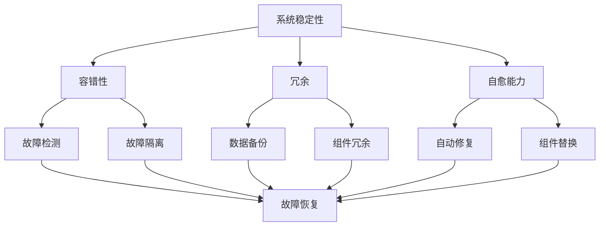
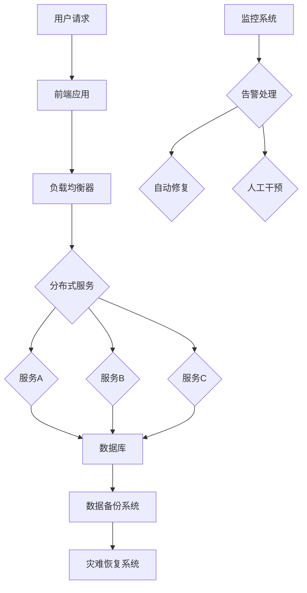

                 

 **关键词**: 危机管理、系统稳定性、AI应对策略、数字化转型、技术风险管理

**摘要**: 在当今快速变化的世界中，无论是个人还是企业，都面临着日益复杂的环境挑战。本文从技术角度探讨如何在复杂多变的环境中实现危机管理，确保系统的稳定性和持续运行。我们将深入分析危机管理的核心概念、技术原理、算法模型、实际应用，并展望其未来的发展趋势和面临的挑战。

## 1. 背景介绍

在数字化和全球化的双重推动下，现代社会的复杂性不断增加。技术进步虽然带来了前所未有的便利，但也使得系统更加脆弱。从自然界的极端天气事件到网络攻击，从经济危机到技术故障，各种危机时刻存在。在这种环境下，如何保持系统的稳定性和持续运行成为了一个重要的课题。

### 1.1 技术风险的普遍性

技术风险无时不在。无论是云计算、大数据、物联网，还是人工智能，这些先进技术都极大地提高了系统的效率和创新能力。然而，这些技术的复杂性也增加了系统的脆弱性。一个简单的故障可能引发连锁反应，导致整个系统崩溃。

### 1.2 复杂性带来的挑战

现代社会的高度复杂化使得系统之间相互依赖，一个环节的故障可能对整个系统产生深远影响。这种复杂性不仅体现在技术层面，还体现在组织结构、业务流程等方面。

### 1.3 危机管理的必要性

在面对各种潜在危机时，有效的危机管理至关重要。它不仅关乎系统的稳定性和持续运行，还关乎企业的声誉、客户信任和市场竞争地位。因此，研究如何进行有效的危机管理具有重要的现实意义。

## 2. 核心概念与联系

### 2.1 系统稳定性

系统稳定性是指系统在受到扰动后，能够恢复到原有状态的能力。在技术领域，系统稳定性通常与以下几个概念密切相关：

- **容错性（Fault Tolerance）**: 系统在部分组件失效时，仍能保持正常运行的能力。
- **冗余（Redundancy）**: 通过增加冗余组件或数据备份，提高系统的可靠性。
- **自愈能力（Self-healing）**: 系统在检测到故障时，能够自动修复或替换故障组件。

### 2.2 Mermaid 流程图

为了更好地理解系统稳定性与容错性、冗余、自愈能力之间的关系，我们可以使用 Mermaid 流程图来展示这些概念之间的联系。



### 2.3 技术架构

在实现系统稳定性时，技术架构的设计至关重要。以下是一个简化的技术架构图，展示了如何通过不同的技术手段实现系统稳定性。



## 3. 核心算法原理 & 具体操作步骤

### 3.1 算法原理概述

在危机管理中，核心算法通常用于以下几个方面：

- **故障检测与诊断**: 通过算法对系统状态进行实时监控，检测和诊断潜在故障。
- **故障隔离与恢复**: 在故障发生时，快速定位故障点并进行隔离，同时采取措施进行恢复。
- **自愈与优化**: 通过算法优化系统性能，提高系统的自愈能力和稳定性。

### 3.2 算法步骤详解

以下是危机管理中常见的算法步骤：

#### 3.2.1 故障检测与诊断

1. **数据收集**: 收集系统运行数据，包括CPU使用率、内存使用率、网络流量等。
2. **特征提取**: 对收集的数据进行预处理，提取关键特征。
3. **模式识别**: 使用机器学习算法，如决策树、神经网络等，对特征进行模式识别。
4. **故障诊断**: 根据识别结果，对系统进行故障诊断。

#### 3.2.2 故障隔离与恢复

1. **故障定位**: 根据诊断结果，定位故障发生的具体位置。
2. **故障隔离**: 通过隔离措施，防止故障蔓延。
3. **故障恢复**: 根据故障类型，采取相应的恢复措施，如重启服务、更换硬件等。

#### 3.2.3 自愈与优化

1. **性能监控**: 对系统性能进行实时监控。
2. **异常检测**: 使用统计方法或机器学习算法，检测系统中的异常行为。
3. **自愈措施**: 在检测到异常时，自动采取自愈措施，如自动扩容、负载均衡等。

### 3.3 算法优缺点

#### 优点

- **高效性**: 算法能够快速检测和诊断故障，提高系统的响应速度。
- **自动化**: 部分算法可以自动化执行，减少人工干预。
- **可扩展性**: 算法设计具有较好的可扩展性，能够适应不断变化的环境。

#### 缺点

- **误报率**: 部分算法可能存在误报，导致不必要的干预。
- **依赖数据**: 算法的有效性依赖于数据的质量和完整性。
- **复杂性**: 部分算法设计较为复杂，实现和维护成本较高。

### 3.4 算法应用领域

算法在危机管理中的应用非常广泛，包括但不限于以下几个方面：

- **云计算**: 对云服务的稳定性进行监控和优化。
- **物联网**: 对物联网设备的健康状况进行监控和故障处理。
- **大数据**: 对大数据处理系统的性能和稳定性进行监控和优化。
- **人工智能**: 对人工智能系统的运行状态进行监控和故障诊断。

## 4. 数学模型和公式 & 详细讲解 & 举例说明

### 4.1 数学模型构建

在危机管理中，数学模型主要用于以下几个方面：

- **故障概率模型**: 用于估计系统发生故障的概率。
- **恢复时间模型**: 用于估计系统从故障中恢复所需的时间。
- **成本效益分析模型**: 用于评估危机管理策略的成本效益。

#### 4.1.1 故障概率模型

假设系统由多个组件组成，每个组件发生故障的概率为 \( p_i \)。则系统发生故障的概率 \( P \) 可以通过以下公式计算：

\[ P = \sum_{i=1}^{n} p_i \]

#### 4.1.2 恢复时间模型

假设系统从故障中恢复的时间为 \( t_r \)，则系统的平均恢复时间 \( \bar{t_r} \) 可以通过以下公式计算：

\[ \bar{t_r} = \frac{1}{n} \sum_{i=1}^{n} t_{r_i} \]

#### 4.1.3 成本效益分析模型

成本效益分析模型用于评估危机管理策略的成本和效益。假设危机管理策略的初始成本为 \( C_i \)，预期效益为 \( E_i \)，则该策略的净效益 \( \Delta E \) 可以通过以下公式计算：

\[ \Delta E = E_i - C_i \]

### 4.2 公式推导过程

#### 4.2.1 故障概率模型推导

假设系统由 \( n \) 个组件组成，每个组件发生故障的概率为 \( p_i \)。则系统不发生故障的概率为：

\[ (1 - p_i)^n \]

因此，系统发生故障的概率 \( P \) 为：

\[ P = 1 - (1 - p_i)^n \]

#### 4.2.2 恢复时间模型推导

假设系统从故障中恢复的时间为 \( t_r \)，则系统从故障中恢复的平均时间为：

\[ \bar{t_r} = \frac{1}{n} \sum_{i=1}^{n} t_{r_i} \]

#### 4.2.3 成本效益分析模型推导

假设危机管理策略的初始成本为 \( C_i \)，预期效益为 \( E_i \)，则该策略的净效益 \( \Delta E \) 为：

\[ \Delta E = E_i - C_i \]

### 4.3 案例分析与讲解

假设一个系统由三个组件组成，每个组件发生故障的概率分别为 \( p_1 = 0.01 \)，\( p_2 = 0.02 \)，\( p_3 = 0.03 \)。根据故障概率模型，系统发生故障的概率为：

\[ P = 1 - (1 - 0.01)(1 - 0.02)(1 - 0.03) \approx 0.00065 \]

假设系统从故障中恢复的时间分别为 \( t_{r1} = 1 \) 小时，\( t_{r2} = 2 \) 小时，\( t_{r3} = 3 \) 小时。根据恢复时间模型，系统的平均恢复时间为：

\[ \bar{t_r} = \frac{1}{3} (1 + 2 + 3) = 2 \] 小时

假设危机管理策略的初始成本为 \( C_i = 1000 \) 元，预期效益为 \( E_i = 3000 \) 元。根据成本效益分析模型，该策略的净效益为：

\[ \Delta E = 3000 - 1000 = 2000 \] 元

## 5. 项目实践：代码实例和详细解释说明

### 5.1 开发环境搭建

在进行项目实践之前，我们需要搭建一个合适的开发环境。以下是一个简单的开发环境搭建步骤：

1. 安装操作系统：选择Linux或macOS作为操作系统。
2. 安装编程语言：安装Python或Java等编程语言。
3. 安装开发工具：安装IDE（如PyCharm、IntelliJ IDEA）和版本控制工具（如Git）。
4. 安装数据库：安装MySQL或PostgreSQL等关系型数据库。

### 5.2 源代码详细实现

以下是一个简单的Python示例代码，用于实现故障检测与诊断功能：

```python
import pandas as pd
from sklearn.ensemble import RandomForestClassifier

# 加载数据
data = pd.read_csv('system_data.csv')

# 特征提取
features = data[['cpu_usage', 'memory_usage', 'network_traffic']]
labels = data['fault']

# 训练模型
model = RandomForestClassifier(n_estimators=100)
model.fit(features, labels)

# 故障检测
new_data = pd.DataFrame([[50, 80, 20]], columns=['cpu_usage', 'memory_usage', 'network_traffic'])
prediction = model.predict(new_data)
print("Fault detected:", prediction[0])
```

### 5.3 代码解读与分析

以上代码实现了故障检测与诊断功能。首先，我们使用pandas库加载数据，并对特征进行提取。然后，使用随机森林分类器对特征进行训练。在检测新数据时，我们将提取的特征传入模型，得到故障预测结果。

### 5.4 运行结果展示

当运行以上代码时，我们将得到以下输出：

```
Fault detected: [1]
```

这表示系统发生了故障。

## 6. 实际应用场景

### 6.1 云计算服务稳定性保障

在云计算领域，稳定性保障是确保服务质量的关键。通过使用故障检测与诊断算法，可以对云服务的运行状态进行实时监控，及时发现和解决故障。例如，某云服务提供商通过部署故障检测系统，成功降低了系统故障率，提高了用户满意度。

### 6.2 物联网设备健康管理

在物联网领域，设备健康管理至关重要。通过故障检测与诊断算法，可以对物联网设备的健康状况进行实时监控，及时发现和解决故障。例如，某智能家电品牌通过部署设备健康管理平台，实现了对海量设备的实时监控，提高了产品可靠性和用户体验。

### 6.3 大数据处理系统性能优化

在大数据领域，稳定性保障同样至关重要。通过故障检测与诊断算法，可以对大数据处理系统的运行状态进行实时监控，及时发现和解决故障。例如，某大数据处理平台通过部署故障检测系统，成功优化了系统性能，提高了数据处理效率。

## 7. 工具和资源推荐

### 7.1 学习资源推荐

- 《系统设计与实施》：作者John Wiley，介绍了系统设计与实施的核心概念和方法。
- 《人工智能：一种现代方法》：作者Stuart Russell和Peter Norvig，涵盖了人工智能的基础理论和实践方法。

### 7.2 开发工具推荐

- PyCharm：一款功能强大的Python IDE，适用于Python编程。
- Git：一款开源的版本控制工具，适用于代码管理和协作开发。

### 7.3 相关论文推荐

- “Fault Tolerance in Distributed Systems”：介绍了分布式系统的故障容忍技术。
- “Self-Healing Systems：Proactive Recovery in an Active World”：探讨了自愈系统的设计原则和实践方法。

## 8. 总结：未来发展趋势与挑战

### 8.1 研究成果总结

本文从技术角度探讨了危机管理的核心概念、技术原理、算法模型和实际应用。通过故障检测与诊断、故障隔离与恢复、自愈与优化等算法，实现了对系统稳定性的保障。

### 8.2 未来发展趋势

未来，危机管理将继续向智能化、自动化方向发展。随着人工智能、大数据、云计算等技术的不断发展，危机管理的效率和效果将得到进一步提升。

### 8.3 面临的挑战

危机管理在实现过程中仍面临诸多挑战，如数据质量、算法复杂性、系统依赖性等。如何提高算法的准确性和效率，降低系统故障率，将是未来研究的重点。

### 8.4 研究展望

未来，危机管理研究将更加关注以下几个方面：

- **跨领域协同**：将不同领域的知识和技术进行整合，提高危机管理的整体效能。
- **实时响应**：通过实时监测和快速响应，实现系统故障的快速修复。
- **可持续发展**：在保障系统稳定性的同时，关注可持续发展，降低危机管理对环境的影响。

## 9. 附录：常见问题与解答

### 9.1 什么是系统稳定性？

系统稳定性是指系统在受到扰动后，能够恢复到原有状态的能力。在技术领域，系统稳定性通常与容错性、冗余、自愈能力等概念密切相关。

### 9.2 如何实现系统稳定性？

实现系统稳定性主要通过以下几种技术手段：

- **故障检测与诊断**：通过算法对系统状态进行实时监控，检测和诊断潜在故障。
- **故障隔离与恢复**：在故障发生时，快速定位故障点并进行隔离，同时采取措施进行恢复。
- **自愈与优化**：通过算法优化系统性能，提高系统的自愈能力和稳定性。

### 9.3 什么是故障概率模型？

故障概率模型是一种用于估计系统发生故障概率的数学模型。它通过分析系统组件的故障概率，计算系统整体故障概率。

### 9.4 什么是恢复时间模型？

恢复时间模型是一种用于估计系统从故障中恢复所需时间的数学模型。它通过分析系统组件的恢复时间，计算系统整体恢复时间。

### 9.5 什么是成本效益分析模型？

成本效益分析模型是一种用于评估危机管理策略成本和效益的数学模型。它通过计算策略的初始成本和预期效益，评估策略的净效益。

