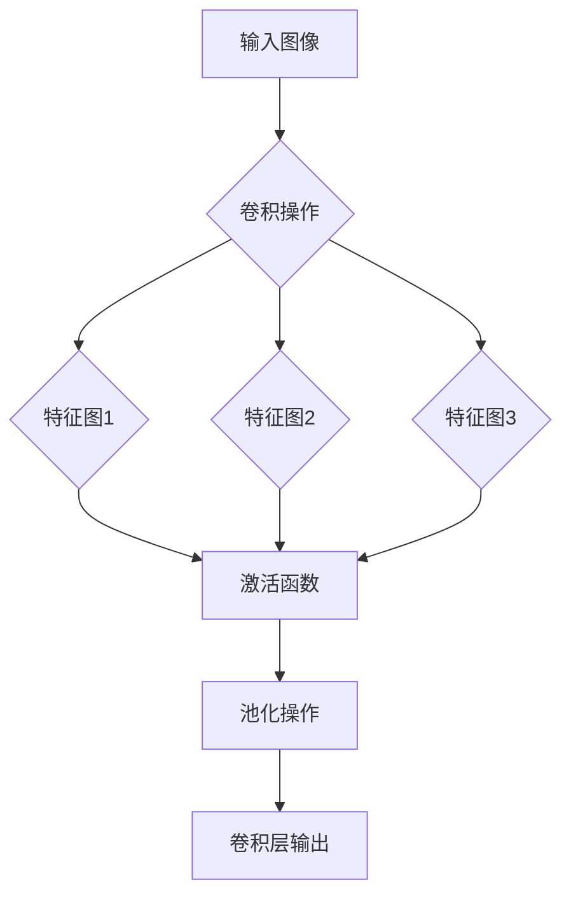

                 

关键词：卷积层、神经网络、深度学习、图像识别、代码实例、原理讲解

> 摘要：本文将深入探讨卷积层（Convolutional Layer）在神经网络中的核心作用，详细解释其工作原理和数学模型，并通过实际代码实例展示如何实现卷积层。同时，本文还将探讨卷积层的优缺点、应用领域以及未来发展趋势。

## 1. 背景介绍

随着深度学习技术的快速发展，神经网络在图像识别、语音识别、自然语言处理等领域的应用越来越广泛。神经网络中的卷积层（Convolutional Layer，简称Conv层）是深度学习中至关重要的一环，它赋予神经网络处理图像数据的能力。

卷积层最早由生物学家Fritz Hubel和Torsten Wiesel在1950年代通过研究猫的视觉皮层发现。他们发现，猫的视觉皮层中的神经元对不同形状的刺激具有特定的敏感性，这种特性被称为“感受野”（receptive field）。受此启发，卷积层的设计灵感来自于人类视觉系统，它通过模拟神经元的工作原理来提取图像中的特征。

在深度学习模型中，卷积层通常位于输入层之后，用于提取图像的特征，然后通过后续的全连接层（Fully Connected Layer）进行分类或回归操作。卷积层在计算机视觉领域具有显著的优势，特别是在处理大规模图像数据时，能够显著提高模型的性能和效率。

## 2. 核心概念与联系

### 2.1 卷积层工作原理

卷积层通过卷积操作来提取图像的特征。卷积操作的基本思想是将一个小的滤波器（也称为卷积核）在图像上进行滑动，并对滤波器覆盖的区域进行加权求和，得到一个特征图（feature map）。滤波器的权重和偏置用于调整特征图的输出。

### 2.2 卷积层架构

卷积层的架构包括多个卷积核、滤波器、激活函数和池化层。每个卷积核负责提取图像中的一个特定特征，多个卷积核共同工作，可以提取多种特征，从而形成丰富的特征图。

### 2.3 Mermaid 流程图

下面是一个卷积层的Mermaid流程图，展示了卷积层的工作流程：



## 3. 核心算法原理 & 具体操作步骤

### 3.1 算法原理概述

卷积层的核心算法是卷积操作，它通过将卷积核在图像上滑动并计算局部区域内的加权求和来提取特征。卷积操作的数学表达式如下：

$$
\text{特征图}_{ij} = \sum_{k=1}^{C} w_{ik} \cdot \text{图像}_{ij,k} + b_k
$$

其中，$\text{特征图}_{ij}$表示第$i$行第$j$列的特征值，$w_{ik}$表示卷积核的权重，$\text{图像}_{ij,k}$表示输入图像中第$i$行第$j$列第$k$个通道的值，$b_k$表示卷积核的偏置。

### 3.2 算法步骤详解

1. 初始化卷积核和偏置：卷积核的权重和偏置通常通过随机初始化，以避免模型过拟合。

2. 对输入图像进行卷积操作：将卷积核在图像上滑动，计算每个局部区域内的加权求和，得到特征图。

3. 应用激活函数：为了增加模型的非线性能力，通常在卷积操作后应用激活函数，如ReLU（Rectified Linear Unit）。

4. 应用池化操作：池化操作用于减少特征图的大小，提高计算效率，同时保持重要特征。常用的池化操作包括最大池化和平均池化。

5. 重复以上步骤：卷积层通常包含多个卷积核，每个卷积核负责提取不同类型的特征，多个卷积核共同工作，可以提取丰富的特征。

### 3.3 算法优缺点

**优点：**

- **局部连接与平移不变性**：卷积层通过局部连接和共享权重的方式，使得模型具有平移不变性，可以有效提取图像中的特征。
- **计算效率**：卷积层可以并行处理图像中的每个局部区域，提高了计算效率。
- **丰富的特征提取能力**：通过多个卷积核的堆叠，卷积层可以提取多种类型的特征，从而提高模型的性能。

**缺点：**

- **参数数量**：卷积层中的参数数量相对较多，可能导致模型过拟合。
- **内存消耗**：卷积层需要存储大量的权重和偏置，可能增加内存消耗。

### 3.4 算法应用领域

卷积层在计算机视觉领域具有广泛的应用，包括图像识别、目标检测、图像分割等。卷积层可以提取图像中的特征，从而实现复杂图像的处理。

## 4. 数学模型和公式 & 详细讲解 & 举例说明

### 4.1 数学模型构建

卷积层的数学模型主要涉及卷积操作、激活函数和池化操作。以下是卷积层的数学模型：

$$
\text{特征图}_{ij} = \sum_{k=1}^{C} w_{ik} \cdot \text{图像}_{ij,k} + b_k
$$

$$
\text{激活函数}(\text{特征图}_{ij}) = \max(\text{特征图}_{ij} - \text{阈值}, 0)
$$

$$
\text{池化操作}(\text{特征图}_{ij}) = \frac{1}{S} \sum_{s=1}^{S} \text{特征图}_{ij,s}
$$

其中，$C$表示输入图像的通道数，$S$表示池化操作的步长。

### 4.2 公式推导过程

卷积操作的推导过程如下：

1. **卷积操作：** 卷积操作通过将卷积核在图像上滑动并计算局部区域内的加权求和得到特征图。

2. **激活函数：** 激活函数用于增加模型的非线性能力，通常选择ReLU函数。

3. **池化操作：** 池化操作用于减少特征图的大小，提高计算效率。

### 4.3 案例分析与讲解

假设我们有一个32x32x3的彩色图像，其中每个像素值范围在[0, 255]之间。我们将使用一个3x3的卷积核进行卷积操作，卷积核的权重和偏置分别为$w_{ik}$和$b_k$。

1. **卷积操作：** 将卷积核在图像上滑动，计算每个局部区域内的加权求和，得到特征图。

2. **激活函数：** 对每个特征值应用ReLU函数，即将小于0的特征值设为0。

3. **池化操作：** 将特征图进行最大池化，保留每个区域内的最大特征值。

通过以上操作，我们得到了一个32x32x1的特征图，其中每个像素值表示图像中的一个特征。

## 5. 项目实践：代码实例和详细解释说明

### 5.1 开发环境搭建

为了实现卷积层，我们需要搭建一个合适的开发环境。以下是Python和TensorFlow的开发环境搭建步骤：

1. 安装Python：下载并安装Python 3.7及以上版本。

2. 安装TensorFlow：通过pip命令安装TensorFlow。

   ```bash
   pip install tensorflow
   ```

### 5.2 源代码详细实现

以下是使用TensorFlow实现卷积层的代码示例：

```python
import tensorflow as tf

# 定义卷积层
def conv_layer(inputs, filters, kernel_size, stride, activation):
    # 创建卷积层
    conv = tf.keras.layers.Conv2D(filters=filters,
                                 kernel_size=kernel_size,
                                 strides=stride,
                                 activation=activation,
                                 padding='same')(inputs)
    return conv

# 定义输入图像
input_image = tf.keras.layers.Input(shape=(32, 32, 3))

# 应用卷积层
conv_output = conv_layer(input_image, filters=32, kernel_size=(3, 3), stride=(1, 1), activation='relu')

# 应用池化层
pool_output = tf.keras.layers.MaxPooling2D(pool_size=(2, 2))(conv_output)

# 构建模型
model = tf.keras.Model(inputs=input_image, outputs=pool_output)

# 编译模型
model.compile(optimizer='adam', loss='categorical_crossentropy', metrics=['accuracy'])

# 输出模型结构
model.summary()
```

### 5.3 代码解读与分析

1. **定义卷积层：** 使用`tf.keras.layers.Conv2D`函数定义卷积层，其中`filters`表示卷积核的数量，`kernel_size`表示卷积核的大小，`strides`表示卷积操作的步长，`activation`表示激活函数。

2. **应用卷积层：** 通过调用`conv_layer`函数并传递输入图像，定义卷积层的输出。

3. **应用池化层：** 使用`tf.keras.layers.MaxPooling2D`函数定义最大池化层，用于减小特征图的大小。

4. **构建模型：** 使用`tf.keras.Model`函数构建模型，并编译模型。

5. **输出模型结构：** 使用`model.summary()`函数输出模型的详细信息。

### 5.4 运行结果展示

在完成代码实现后，我们可以通过以下命令运行模型并查看结果：

```bash
python conv_layer_example.py
```

输出结果将显示模型的详细信息，包括输入层、卷积层、池化层和输出层的结构。

## 6. 实际应用场景

卷积层在计算机视觉领域具有广泛的应用，以下是一些实际应用场景：

- **图像识别：** 卷积层可以用于图像分类任务，如MNIST数字识别和CIFAR-10图像识别。
- **目标检测：** 卷积层可以用于检测图像中的目标物体，如Faster R-CNN和YOLO算法。
- **图像分割：** 卷积层可以用于对图像进行像素级别的分割，如FCN（Fully Convolutional Network）算法。

## 7. 未来应用展望

随着深度学习技术的不断发展和应用场景的扩展，卷积层在未来具有广泛的应用前景：

- **更高效的模型架构：** 通过优化卷积层的结构和算法，可以设计出更高效的深度学习模型，提高模型的性能和效率。
- **跨领域应用：** 卷积层不仅适用于计算机视觉领域，还可以应用于其他领域，如音频处理、自然语言处理等。
- **硬件加速：** 随着硬件技术的发展，如GPU和TPU，卷积层的计算性能将进一步提高，为更复杂的深度学习模型提供支持。

## 8. 工具和资源推荐

### 8.1 学习资源推荐

- **《深度学习》（Goodfellow, Bengio, Courville著）：** 介绍深度学习的基础知识和核心算法，包括卷积层。
- **TensorFlow官方文档：** 提供详细的TensorFlow API和示例代码，帮助开发者快速掌握卷积层的实现。

### 8.2 开发工具推荐

- **TensorFlow：** 一个开源的深度学习框架，提供丰富的API和工具，支持卷积层的实现。
- **PyTorch：** 另一个流行的深度学习框架，具有动态计算图的特点，适合进行实验和研究。

### 8.3 相关论文推荐

- **“A Learning Algorithm for Continually Running Fully Recurrent Neural Networks”（1986）：** 提出了在线学习算法，为卷积层的应用奠定了基础。
- **“Deep Learning for Computer Vision”（2016）：** 介绍深度学习在计算机视觉领域的最新进展和应用。

## 9. 总结：未来发展趋势与挑战

卷积层作为深度学习中的核心组件，在计算机视觉领域发挥着重要作用。随着深度学习技术的不断进步，卷积层将迎来更多的发展机遇：

- **模型优化：** 通过改进卷积层的结构和算法，设计出更高效、更强大的深度学习模型。
- **跨领域应用：** 将卷积层应用于其他领域，如音频处理、自然语言处理等，推动深度学习的全面发展。

然而，卷积层也面临一些挑战：

- **计算资源消耗：** 卷积层的计算复杂度较高，需要大量的计算资源和内存。
- **数据依赖：** 卷积层对大量高质量的数据有很高的依赖性，数据匮乏可能影响模型的性能。

未来，随着硬件技术的发展和算法的优化，卷积层将在深度学习领域发挥更大的作用，推动人工智能技术的不断进步。

### 附录：常见问题与解答

**Q：卷积层为什么具有平移不变性？**

A：卷积层通过局部连接和共享权重的方式，使得模型对于图像的平移具有不变性。在卷积操作中，每个卷积核只关注图像的局部区域，通过滑动卷积核可以覆盖整个图像，从而提取到全局特征。

**Q：卷积层与全连接层有什么区别？**

A：卷积层主要用于处理图像数据，通过卷积操作提取图像的特征。全连接层则将卷积层提取到的特征映射到具体的类别或标签上，实现分类或回归操作。卷积层和全连接层共同构成了深度学习模型的核心结构。

**Q：为什么选择最大池化而不是平均池化？**

A：最大池化可以保留每个区域内的最大特征值，从而突出重要的特征。平均池化则将每个区域内的特征值平均，可能导致重要特征的损失。在某些情况下，如特征提取阶段，可以选择平均池化来减少特征图的大小。

### 参考文献

- Goodfellow, Y., Bengio, Y., Courville, A. (2016). *Deep Learning*. MIT Press.
- LeCun, Y., Bengio, Y., Hinton, G. (2015). *Deep Learning*. Nature.
- Krizhevsky, A., Sutskever, I., Hinton, G. E. (2012). *Imagenet classification with deep convolutional neural networks*. In Advances in Neural Information Processing Systems (NIPS), (pp. 1097-1105).

### 作者署名

作者：禅与计算机程序设计艺术 / Zen and the Art of Computer Programming

