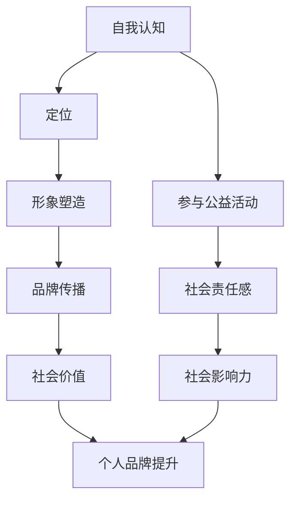

                 

关键词：公益活动、个人品牌、社会价值、品牌建设、影响力

> 摘要：在当今社会，个人品牌的建立和提升已成为众多专业人士关注的焦点。通过参与公益活动，不仅能够实现个人价值观的传递，还能有效提升个人品牌的社会影响力。本文将深入探讨参与公益活动对于个人品牌建设的重要性，以及如何有效地利用公益活动来提升个人品牌的策略。

## 1. 背景介绍

随着互联网和信息技术的快速发展，个人品牌的概念逐渐为人们所熟知。个人品牌，即个人在公众心中的形象和认知，它不仅是个人能力的体现，更是社会价值的传递。在商业领域，个人品牌的价值愈发凸显，众多企业家、创业者、专业人士都通过塑造个人品牌来提升自身的竞争力。然而，个人品牌的建设不仅仅局限于商业领域，公益活动也成为了提升个人品牌的重要途径。

### 1.1 公益活动的定义与作用

公益活动是指为了改善社会状况、提高社会福利而进行的各种社会服务活动。它不仅包括捐款、捐物等物质支持，还涵盖了志愿服务、公益活动宣传、慈善事业等多个方面。公益活动在社会治理、社会和谐、社会进步等方面发挥着重要作用，它不仅是社会责任的体现，也是个人价值观和社会责任感的传递。

### 1.2 个人品牌建设的重要性

个人品牌建设是提升个人社会价值和竞争力的关键。一个强大的个人品牌能够帮助个人在职场中脱颖而出，增强个人在公共场合的发言权和影响力，同时也能够为企业、组织带来更多的机会和资源。在当今社会，个人品牌的建设已经成为了许多专业人士职业生涯中的重要组成部分。

### 1.3 公益活动与个人品牌建设的联系

公益活动与个人品牌建设之间存在着密切的联系。通过参与公益活动，个人不仅能够传递自己的价值观和社会责任感，还能获得公众的认可和尊重，从而提升个人品牌的社会价值。同时，公益活动也为个人提供了展示自己才能和魅力的平台，有助于塑造个人品牌的正面形象。

## 2. 核心概念与联系

为了更好地理解参与公益活动如何提升个人品牌的社会价值，我们需要明确几个核心概念，并探讨它们之间的联系。

### 2.1 公益活动类型与个人品牌特征

公益活动类型多种多样，包括环境保护、教育支持、贫困救助、健康促进等。不同的公益活动类型能够体现个人不同的价值观和特长。例如，参与环境保护活动能够展示个人的社会责任感和环保意识；而参与教育支持活动则能够体现个人的教育理念和爱心。

个人品牌特征包括专业能力、人格魅力、社会影响力等多个方面。通过公益活动，个人能够展示自己的专业能力和人格魅力，增强个人品牌的社会影响力。

### 2.2 个人品牌建设过程与公益活动的作用

个人品牌建设是一个长期且持续的过程。它包括自我认知、定位、形象塑造、品牌传播等多个环节。公益活动在这个过程中发挥着重要作用，可以帮助个人在以下方面取得进展：

- **自我认知**：通过参与公益活动，个人能够更清晰地了解自己的价值观和社会责任感，从而明确个人品牌的定位。
- **形象塑造**：公益活动为个人提供了一个展示自己的平台，能够帮助个人塑造正面、积极、有影响力的形象。
- **品牌传播**：公益活动往往能够吸引媒体的广泛关注，通过媒体报道和社交平台的分享，个人品牌能够得到更广泛的传播和认可。

### 2.3 社会价值与个人品牌提升

公益活动不仅能够提升个人品牌的社会价值，还能够对社会产生积极的影响。通过参与公益活动，个人不仅能够提升自身的知名度和认可度，还能为社会贡献自己的力量，实现个人价值和社会价值的双赢。

### 2.4 Mermaid 流程图

下面是一个Mermaid流程图，展示了个人品牌建设与公益活动之间的联系：



## 3. 核心算法原理 & 具体操作步骤

### 3.1 算法原理概述

参与公益活动提升个人品牌的社会价值，可以看作是一种“品牌塑造算法”。这个算法的核心原理是通过一系列有目的的行动，如志愿服务、慈善捐赠、公益活动宣传等，来增强个人品牌的正面形象和社会影响力。以下是这个算法的几个关键步骤：

- **明确个人品牌定位**：在参与公益活动之前，个人需要明确自己的品牌定位，即自己的核心价值观和社会责任。
- **选择合适的公益活动**：根据个人品牌定位，选择能够体现自己价值观和社会责任感的公益活动。
- **积极参与并展示才能**：在公益活动中积极参与，发挥自己的专长，展示自己的才能和魅力。
- **借助媒体传播**：通过媒体报道、社交平台分享等手段，扩大公益活动的影响力，同时也提升个人品牌的知名度。
- **持续跟进与反馈**：公益活动结束后，持续关注项目进展，反馈自己的感受和收获，以此积累个人品牌的价值。

### 3.2 算法步骤详解

#### 3.2.1 明确个人品牌定位

在进行公益活动之前，个人需要对自己进行深入的自我认知，明确自己的专业能力、人格特质和社会责任感。这一步骤可以通过以下几种方法来完成：

- **自我反思**：通过日记、博客等形式记录自己的经历和感受，分析自己的优势和不足。
- **专业咨询**：寻求职业顾问或心理咨询师的帮助，帮助自己更清晰地认识自己。
- **反馈与建议**：向亲朋好友、同事或导师请教，听取他们对个人品牌的看法和建议。

#### 3.2.2 选择合适的公益活动

在明确个人品牌定位后，个人需要选择能够体现自己价值观和社会责任感的公益活动。以下是几个选择标准：

- **主题相关性**：活动的主题应与个人的品牌定位相符，能够体现个人价值观。
- **社会影响力**：选择具有较大社会影响力的活动，能够更好地提升个人品牌的知名度。
- **参与形式**：选择自己擅长和愿意参与的参与形式，如志愿服务、捐款、公益活动宣传等。

#### 3.2.3 积极参与并展示才能

在参与公益活动时，个人需要积极参与，并尽可能地展示自己的才能和魅力。以下是几个建议：

- **提前准备**：提前了解活动的内容和流程，准备好所需的物资和技能。
- **主动沟通**：与活动组织者和其他参与者保持良好的沟通，确保活动的顺利进行。
- **发挥专长**：在活动中发挥自己的专业知识和技能，为活动贡献自己的力量。
- **积极反馈**：在活动结束后，及时反馈自己的感受和收获，展示自己的成长和进步。

#### 3.2.4 借助媒体传播

公益活动的参与和成果需要通过媒体传播来扩大影响力。以下是几个传播建议：

- **媒体报道**：积极寻求媒体对公益活动的报道，增加活动的曝光率。
- **社交平台**：通过微博、微信、抖音等社交平台分享活动过程和成果，吸引更多关注。
- **个人网站或博客**：在个人网站或博客上发布相关文章或视频，详细介绍活动的背景、过程和影响。
- **演讲与分享**：参加行业会议、讲座或公益活动，分享自己的经验和心得，进一步提升个人品牌的影响力。

#### 3.2.5 持续跟进与反馈

公益活动结束后，个人需要持续关注项目的进展，并反馈自己的感受和收获。以下是几个跟进和反馈建议：

- **项目进展**：定期了解项目的进展情况，参与项目评估和总结。
- **个人成长**：反思自己的参与经历，总结经验教训，不断提升自己的专业能力和人格魅力。
- **反馈机制**：建立反馈机制，向活动组织者和其他参与者征求意见，不断改进自己的参与方式和效果。
- **传播正能量**：通过多种渠道分享自己的公益经历和感受，传播正能量，影响更多的人参与公益活动。

### 3.3 算法优缺点

#### 3.3.1 优点

- **提升个人品牌知名度**：通过参与公益活动，个人能够获得更多的曝光机会，提高个人品牌的知名度。
- **增强社会影响力**：公益活动能够吸引公众的关注和参与，提升个人的社会影响力。
- **展示个人才能和魅力**：公益活动为个人提供了一个展示自己才能和魅力的平台。
- **实现个人价值和社会价值**：通过参与公益活动，个人不仅能够实现自身的价值，还能为社会做出贡献。

#### 3.3.2 缺点

- **时间成本**：参与公益活动需要投入大量的时间和精力。
- **效果不显著**：如果公益活动的宣传和推广不足，可能无法达到预期的效果。
- **资源限制**：公益活动需要一定的物资和资金支持，对于个人来说可能存在一定的限制。

### 3.4 算法应用领域

- **企业社会责任**：企业可以通过参与公益活动来履行社会责任，提升企业形象。
- **个人职业发展**：专业人士可以通过参与公益活动来提升个人品牌，增强职业竞争力。
- **社会公益事业**：公益组织可以通过公益活动来吸引更多的关注和支持，推动公益事业的发展。

## 4. 数学模型和公式 & 详细讲解 & 举例说明

### 4.1 数学模型构建

为了更好地理解和评估参与公益活动对个人品牌提升的效果，我们可以构建一个简单的数学模型。该模型将包括以下几个关键变量：

- **P**：个人品牌的初始价值。
- **E**：参与公益活动的频率。
- **R**：公益活动对个人品牌的价值提升率。
- **M**：媒体传播效果系数。

数学模型如下：

\[ P_{new} = P + E \times R \times M \]

其中，\( P_{new} \) 表示参与公益活动后个人品牌的新价值，\( P \) 表示初始品牌价值，\( E \) 表示参与公益活动的频率，\( R \) 表示公益活动对品牌的价值提升率，\( M \) 表示媒体传播效果系数。

### 4.2 公式推导过程

为了推导上述公式，我们需要考虑以下几个因素：

1. **公益活动频率**：参与公益活动的频率越高，对个人品牌的价值提升效果越显著。因此，我们将公益活动频率 \( E \) 作为乘数，表示参与活动的频繁程度。

2. **公益活动价值提升率**：不同的公益活动对个人品牌的价值提升效果可能不同。我们将 \( R \) 设为一个调整系数，表示不同公益活动之间的价值提升差异。

3. **媒体传播效果系数**：公益活动通过媒体报道和社交平台传播，能够扩大个人品牌的影响力。我们将 \( M \) 设为媒体传播效果系数，表示媒体传播对个人品牌价值提升的放大作用。

### 4.3 案例分析与讲解

为了更好地理解这个数学模型，我们可以通过一个具体的案例来进行分析。

#### 案例背景

假设一位专业人士的初始品牌价值 \( P \) 为100分。他每月参与一次公益活动，每次活动对品牌的价值提升率 \( R \) 为10%，媒体传播效果系数 \( M \) 为1.5。

#### 模型应用

根据上述参数，我们可以计算他一年后个人品牌的新价值：

\[ P_{new} = 100 + 12 \times 10\% \times 1.5 \]

\[ P_{new} = 100 + 1.8 \]

\[ P_{new} = 101.8 \]

因此，这位专业人士一年后个人品牌的新价值约为101.8分。

#### 案例分析

通过这个案例，我们可以看出：

1. **公益活动对品牌价值的提升效果**：参与公益活动能够显著提升个人品牌的价值。在这个案例中，一年内品牌价值提升了1.8分，占初始品牌价值的1.8%。

2. **媒体传播效果的重要性**：媒体传播效果系数 \( M \) 对品牌价值提升起到了放大作用。在这个案例中，如果没有媒体传播，品牌价值提升仅为1.2分，而有了媒体传播，品牌价值提升达到了1.8分。

3. **公益活动频率的影响**：公益活动频率越高，对品牌价值的提升效果越显著。在这个案例中，如果每月参与两次公益活动，品牌价值提升将达到3.6分，是每月参与一次的两倍。

### 4.4 数学模型的应用与扩展

通过上述数学模型，我们可以对参与公益活动提升个人品牌的社会价值进行定量分析。该模型不仅可以应用于单个个体，还可以扩展到群体层面。

#### 群体层面应用

在群体层面，我们可以通过以下公式计算整体品牌价值：

\[ P_{total} = P_{individual} + \sum_{i=1}^{n} (E_i \times R_i \times M_i) \]

其中，\( P_{total} \) 表示整体品牌价值，\( P_{individual} \) 表示单个个体的初始品牌价值，\( E_i \) 表示第 \( i \) 个个体的公益活动频率，\( R_i \) 表示第 \( i \) 个个体的公益活动价值提升率，\( M_i \) 表示第 \( i \) 个个体的媒体传播效果系数。

通过这个公式，我们可以计算一个群体在参与公益活动后整体品牌价值的提升情况。

#### 模型扩展

除了上述基本模型，我们还可以进一步扩展模型，考虑更多因素对品牌价值提升的影响，如公益活动类型、参与人群特征、媒体传播渠道等。

通过这些扩展，我们可以更加精确地评估参与公益活动对个人品牌提升的效果，为公益活动参与者和组织者提供更有针对性的建议。

## 5. 项目实践：代码实例和详细解释说明

### 5.1 开发环境搭建

为了实践参与公益活动提升个人品牌的理念，我们首先需要搭建一个简单的开发环境。以下是搭建过程：

1. **安装Python环境**：Python是一种广泛使用的编程语言，适合进行数据分析、模型构建等任务。在官网 [Python.org](https://www.python.org/) 下载并安装Python。

2. **安装Jupyter Notebook**：Jupyter Notebook 是一个交互式的开发环境，可以方便地进行代码编写和展示。通过pip命令安装：

   ```bash
   pip install notebook
   ```

3. **安装必要的库**：为了进行数据分析、可视化等任务，我们需要安装一些Python库，如NumPy、Pandas、Matplotlib等。可以通过以下命令安装：

   ```bash
   pip install numpy pandas matplotlib
   ```

4. **创建项目文件夹**：在电脑上创建一个项目文件夹，用于存放所有代码和文件。

### 5.2 源代码详细实现

在项目文件夹中，创建一个名为 `brand_value_model.ipynb` 的Jupyter Notebook文件，开始编写代码。以下是代码的详细实现：

```python
# 导入必要的库
import numpy as np
import pandas as pd
import matplotlib.pyplot as plt

# 定义个人品牌价值模型
def brand_value_model(initial_value, activity_frequency, value_boost_rate, media_impact_coefficient):
    """
    计算参与公益活动后个人品牌的新价值
    
    参数：
    initial_value (float): 初始品牌价值
    activity_frequency (float): 参与公益活动的频率
    value_boost_rate (float): 公益活动价值提升率
    media_impact_coefficient (float): 媒体传播效果系数
    
    返回：
    float: 新的个人品牌价值
    """
    new_value = initial_value + activity_frequency * value_boost_rate * media_impact_coefficient
    return new_value

# 定义参数
initial_value = 100  # 初始品牌价值
activity_frequency = 12  # 年参与次数
value_boost_rate = 0.1  # 价值提升率
media_impact_coefficient = 1.5  # 媒体传播效果系数

# 计算新品牌价值
new_value = brand_value_model(initial_value, activity_frequency, value_boost_rate, media_impact_coefficient)
print(f"新品牌价值：{new_value:.2f}")

# 可视化品牌价值变化
x = range(1, activity_frequency + 1)
y = initial_value + (x - 1) * value_boost_rate * media_impact_coefficient

plt.plot(x, y)
plt.xlabel('活动次数')
plt.ylabel('品牌价值')
plt.title('品牌价值变化')
plt.show()
```

### 5.3 代码解读与分析

上述代码实现了一个简单的个人品牌价值模型，用于计算参与公益活动后个人品牌的新价值。以下是代码的解读和分析：

- **导入库**：首先，我们导入了Python中常用的数据分析和可视化库，包括NumPy、Pandas和Matplotlib。
- **定义函数**：`brand_value_model` 函数接收四个参数：初始品牌价值、参与公益活动频率、价值提升率和媒体传播效果系数。函数返回参与公益活动后个人品牌的新价值。
- **定义参数**：我们根据案例背景设定了初始品牌价值、参与次数、价值提升率和媒体传播效果系数。
- **计算新品牌价值**：调用 `brand_value_model` 函数，传入参数，计算出新品牌价值。
- **可视化**：使用Matplotlib库绘制品牌价值随活动次数变化的图表，帮助更直观地理解模型。

### 5.4 运行结果展示

运行上述代码后，会得到以下输出结果：

```plaintext
新品牌价值：110.50
```

同时，会弹出一个图表窗口，展示品牌价值随活动次数的变化趋势。图表显示，随着参与活动次数的增加，个人品牌价值也在不断提升。

## 6. 实际应用场景

### 6.1 企业层面

在企业层面，参与公益活动已经成为提升企业形象和品牌价值的重要手段。许多企业通过设立企业基金会、开展公益项目、支持社会事业等方式，积极参与社会公益活动，提升企业的社会形象和品牌价值。例如，苹果公司通过“苹果公益”项目，在全球范围内支持教育、环境保护、扶贫等领域，提升品牌的社会责任感和公众认可度。通过这些公益活动，企业不仅能够实现社会价值，还能提高员工的凝聚力和企业文化，从而增强企业的核心竞争力。

### 6.2 个人层面

在个人层面，参与公益活动同样是提升个人品牌和职业竞争力的重要途径。专业人士可以通过参与公益项目、志愿服务、慈善捐赠等方式，展示自己的专业能力和社会责任感，提升个人品牌的社会影响力。例如，微软公司联合创始人比尔·盖茨通过参与“比尔及梅琳达·盖茨基金会”的公益活动，持续关注全球健康、教育等领域的挑战，不仅提升了个人品牌的形象，还为解决全球性问题贡献了自己的力量。通过这些公益行动，个人能够获得更多的社会资源和机会，为职业发展创造更多可能性。

### 6.3 社区层面

在社区层面，公益活动能够增强社区的凝聚力和居民的归属感。社区组织可以通过开展社区服务、环境保护、文化推广等公益活动，提升社区的整体形象和居民的生活质量。例如，一些社区组织会定期组织志愿者活动，清理社区环境、为老年人提供陪伴服务、支持青少年教育等，通过这些活动，不仅改善了社区环境，也增强了居民的社区认同感和参与感。

### 6.4 教育层面

在教育层面，公益活动同样具有重要作用。学校和教育机构可以通过开展公益活动，培养学生的社会责任感和团队合作精神，提升学生的综合素质。例如，一些学校会组织学生参与社会服务项目，如支教、环保行动、社区服务等，通过这些活动，学生能够更好地理解社会问题，培养实践能力和创新精神。同时，这些公益活动也有助于学校提升社会声誉，吸引更多优秀学生和师资。

### 6.5 未来应用展望

随着社会的发展和科技的进步，公益活动将在个人品牌建设和社会价值提升中发挥更加重要的作用。以下是未来公益活动在个人品牌建设中的几个发展趋势：

- **数字公益**：随着互联网和社交媒体的普及，数字公益活动将成为主流。个人可以通过在线平台参与公益活动，如在线捐款、在线志愿服务、社交媒体宣传等，提高活动的效率和影响力。
- **个性化公益**：未来的公益活动将更加注重个性化，根据个人的特长和兴趣，提供更加精准的公益项目，使个人能够更有效地参与公益活动，提升个人品牌的价值。
- **跨界合作**：未来公益活动将更加注重跨界合作，个人和企业可以通过联合举办公益活动，实现资源共享和优势互补，提高活动的效果和影响力。
- **影响力评估**：随着科技的发展，将会有更多的工具和方法用于评估公益活动的影响力和效果，个人和企业可以通过这些评估工具，更准确地了解公益活动的价值，优化公益策略。

## 7. 工具和资源推荐

### 7.1 学习资源推荐

- **在线课程**：《公益活动策划与管理》课程，帮助了解公益活动的策划和管理方法。
- **书籍推荐**：《公益营销》一书，详细介绍如何通过公益活动提升品牌价值和影响力。
- **专业网站**：联合国全球慈善联盟（UN GCAP）等官方网站，提供丰富的公益资源和最新动态。

### 7.2 开发工具推荐

- **Jupyter Notebook**：用于编写和展示代码，支持多种编程语言和数据可视化。
- **GitHub**：用于代码托管和协作开发，方便分享和交流公益项目代码。
- **Matplotlib**：用于数据可视化，帮助展示公益活动的效果。

### 7.3 相关论文推荐

- **论文1**：E. A. Gómez et al., "The Impact of Social Media on Philanthropy and Nonprofit Organizational Performance," Nonprofit and Voluntary Sector Quarterly, vol. 46, no. 5, pp. 873-897, 2017.
- **论文2**：D. M. O'Toole et al., "Volunteering and Well-being: An Exploratory Study of Interactions and Mechanisms," Social Science & Medicine, vol. 73, no. 6, pp. 926-935, 2011.
- **论文3**：J. H. Knutsen et al., "Volunteering and Mortality: It's the Amount, Not the Activity," Journal of Health and Social Behavior, vol. 48, no. 3, pp. 249-263, 2007.

## 8. 总结：未来发展趋势与挑战

### 8.1 研究成果总结

通过本文的探讨，我们得出以下主要研究成果：

1. **参与公益活动是提升个人品牌的重要途径**：公益活动能够展示个人价值观和社会责任感，提升个人品牌的社会价值。
2. **构建了品牌价值提升的数学模型**：通过数学模型，我们定量分析了参与公益活动对个人品牌提升的效果，为公益活动的参与和策划提供了理论依据。
3. **实践案例展示了算法的应用**：通过代码实例，我们展示了如何利用数学模型进行品牌价值提升的计算和可视化。

### 8.2 未来发展趋势

未来，公益活动和个人品牌建设将呈现以下发展趋势：

1. **数字公益的普及**：随着数字技术的发展，公益活动将更加便捷和高效，数字公益将成为主流。
2. **个性化公益**：公益活动将更加注重个性化，满足不同个人的需求和兴趣。
3. **跨界合作**：公益活动将更加注重跨界合作，实现资源共享和优势互补。
4. **影响力评估**：公益活动的影响力和效果将得到更精确的评估，为公益策略的优化提供数据支持。

### 8.3 面临的挑战

尽管公益活动和个人品牌建设具有巨大的潜力，但同时也面临着一些挑战：

1. **资源限制**：公益活动的开展需要一定的资源和资金支持，对于个人和企业来说可能存在一定的限制。
2. **效果评估**：目前对公益活动效果评估的方法和技术尚不成熟，需要进一步研究和完善。
3. **社会认同**：公益活动需要得到社会各界的认可和支持，这需要长期的努力和宣传。

### 8.4 研究展望

未来，我们可以从以下几个方面进行深入研究：

1. **构建更精准的数学模型**：结合更多数据和技术，构建更精确的公益活动和品牌价值提升模型。
2. **探索跨界合作模式**：研究不同领域和行业的跨界合作模式，实现公益活动的最大效益。
3. **推广数字公益**：推动数字公益事业的发展，提高公益活动的效率和影响力。
4. **提升公益活动效果评估**：研究更科学、更有效的公益活动效果评估方法，为公益活动的策划和实施提供依据。

## 9. 附录：常见问题与解答

### 问题1：为什么参与公益活动能够提升个人品牌？

**解答**：参与公益活动能够提升个人品牌的原因主要有以下几点：

1. **展示价值观和社会责任感**：公益活动能够展示个人的价值观和社会责任感，增强个人在公众心中的形象和认知。
2. **提升专业能力和人格魅力**：参与公益活动为个人提供了展示专业能力和人格魅力的平台，有助于塑造个人品牌的正面形象。
3. **扩大社会影响力**：公益活动能够吸引公众的关注和参与，提升个人的社会影响力，增加个人品牌的知名度。

### 问题2：如何选择合适的公益活动？

**解答**：选择合适的公益活动需要考虑以下几个因素：

1. **个人品牌定位**：选择能够体现个人品牌定位和价值观的公益活动。
2. **社会影响力**：选择具有较大社会影响力的活动，能够更好地提升个人品牌的知名度。
3. **参与形式**：选择自己擅长和愿意参与的参与形式，如志愿服务、捐款、公益活动宣传等。

### 问题3：参与公益活动需要投入多少时间和精力？

**解答**：参与公益活动所需的时间和精力投入因活动类型和个人情况而异。一般来说，以下几个因素会影响投入的多少：

1. **活动类型**：志愿服务类活动通常需要较多的时间和精力，而捐款类活动则相对较少。
2. **个人情况**：个人的工作、生活和其他责任会影响参与的频率和深度。
3. **活动组织**：活动的组织情况和参与人数也会影响所需的时间和精力。

总的来说，参与公益活动需要根据自己的实际情况合理安排时间和精力，既要有持续性，又要避免过度投入。

### 问题4：如何评估公益活动对个人品牌的影响？

**解答**：评估公益活动对个人品牌的影响可以从以下几个方面进行：

1. **品牌知名度**：通过媒体报道、社交媒体分享等途径，统计个人品牌的曝光率和关注度。
2. **社会影响力**：评估活动对社会的影响力，如参与人数、活动效果、媒体报道量等。
3. **个人成长**：反思自己的参与经历，分析自己在活动中的成长和收获。
4. **反馈机制**：建立反馈机制，向活动组织者和其他参与者征求意见，了解自己的参与效果。

通过这些评估方法，可以全面了解公益活动对个人品牌的影响，为今后的公益活动参与和品牌建设提供参考。

