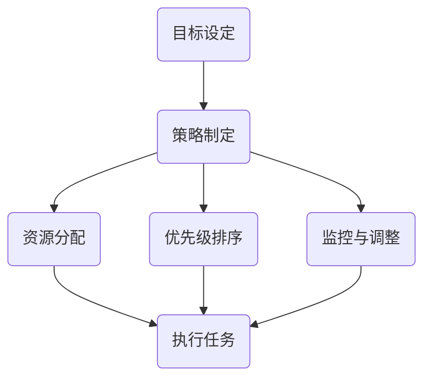

                 

关键词：高效专注、管理者、双重目标法、时间管理、任务优化、生产力提升、目标设定、策略执行。

摘要：本文探讨了双重目标法在管理者保持高效专注中的应用。通过分析双重目标法的核心概念和原理，结合实际案例，本文为管理者提供了一种系统化的时间管理和任务优化策略，旨在提升工作效率和生产力。

## 1. 背景介绍

在快节奏的现代社会，管理者面临着前所未有的挑战，需要在有限的时间内处理大量复杂的工作任务。然而，许多管理者往往会陷入时间管理的困境，无法有效地分配时间和精力，导致工作效率低下，甚至影响身心健康。因此，寻找一种有效的方法来提升管理者的专注力和工作效率变得尤为重要。

双重目标法（Double-Goal Approach）是一种旨在帮助管理者保持高效专注的方法。这种方法强调了设定明确的目标和制定具体的执行策略，以实现个人和组织的目标。双重目标法不仅适用于个人管理，也可应用于团队管理和项目执行，具有广泛的应用价值。

## 2. 核心概念与联系

### 双重目标法的核心概念

双重目标法包含两个核心概念：目标设定和策略执行。

- **目标设定**：目标设定是指明确个人或组织希望达成的结果。一个有效的目标应该具备以下特征：
  - **明确性**：目标应该是具体、可衡量的，以便评估进展情况。
  - **挑战性**：目标应该具有一定难度，激发个人潜能。
  - **可实现性**：目标应该是在现有资源和条件下可实现的。
  - **相关性**：目标应该与个人或组织的长远发展目标相一致。

- **策略执行**：策略执行是指为实现目标制定具体的行动计划和执行步骤。策略执行需要考虑以下因素：
  - **资源分配**：合理分配时间和精力，确保重要任务得到充分关注。
  - **优先级排序**：根据任务的重要性和紧急性进行优先级排序，确保关键任务得到优先处理。
  - **监控与调整**：定期监控任务的进展情况，根据实际情况进行适当调整。

### 双重目标法的架构

为了更好地理解和应用双重目标法，以下是一个简单的 Mermaid 流程图，展示了其核心架构和流程：



## 3. 核心算法原理 & 具体操作步骤

### 3.1 算法原理概述

双重目标法基于以下几个关键原理：

1. **目标导向**：以目标为导向，将注意力集中在最重要的任务上，提高工作效率。
2. **优先级排序**：通过优先级排序，确保关键任务得到优先处理，避免资源浪费。
3. **持续调整**：根据实际情况进行任务调整，确保目标实现。

### 3.2 算法步骤详解

1. **目标设定**：
   - **明确目标**：确定个人或组织在特定时间内希望实现的具体结果。
   - **分析资源**：分析现有资源和条件，确保目标的可实现性。
   - **设定目标**：将目标具体化，明确目标和衡量标准。

2. **策略制定**：
   - **分解任务**：将大任务分解为小任务，便于管理和执行。
   - **制定策略**：为每个任务制定具体的执行步骤和行动计划。

3. **资源分配**：
   - **时间管理**：合理规划工作时间，确保关键任务得到充分关注。
   - **资源调配**：根据任务需求，合理调配人力资源、物资和设备。

4. **优先级排序**：
   - **重要性排序**：根据任务的重要性和紧急性进行排序。
   - **优化排序**：通过分析，找出最佳执行顺序，提高工作效率。

5. **监控与调整**：
   - **进度监控**：定期检查任务进度，确保按时完成。
   - **结果评估**：评估任务执行效果，根据实际情况进行适当调整。

### 3.3 算法优缺点

**优点**：
- **提高工作效率**：通过目标导向和优先级排序，确保关键任务得到优先处理。
- **资源优化**：合理分配资源，避免浪费。
- **持续调整**：根据实际情况进行任务调整，确保目标实现。

**缺点**：
- **实施难度**：双重目标法的实施需要一定的管理技能和经验。
- **时间成本**：监控与调整需要花费一定的时间和精力。

### 3.4 算法应用领域

双重目标法在多个领域都有广泛应用，包括：
- **企业管理**：帮助管理者优化任务分配和资源管理。
- **项目执行**：确保项目按计划完成，提高项目成功率。
- **个人成长**：帮助个人设定目标，提高自我管理能力。

## 4. 数学模型和公式 & 详细讲解 & 举例说明

### 4.1 数学模型构建

双重目标法的数学模型可以表示为：

\[ \text{效率} = \frac{\text{目标实现度} \times \text{资源利用率}}{\text{时间消耗}} \]

其中：
- 目标实现度：衡量目标完成的程度，通常用百分比表示。
- 资源利用率：衡量资源使用的效率，通常用百分比表示。
- 时间消耗：完成任务所花费的时间。

### 4.2 公式推导过程

公式推导基于以下几个假设：

1. 目标实现度与任务完成程度成正比。
2. 资源利用率与资源分配的合理性成正比。
3. 时间消耗与任务复杂度和优先级排序有关。

根据这些假设，我们可以推导出上述公式。

### 4.3 案例分析与讲解

#### 案例背景

某公司项目经理张先生负责一个软件开发项目，项目期限为3个月。项目目标是在期限内完成软件的开发、测试和上线。

#### 案例分析

1. **目标设定**：
   - **明确目标**：项目成功上线，用户满意度达到90%。
   - **分析资源**：现有开发人员3人，测试人员2人，预算50万元。
   - **设定目标**：确保项目按期完成，用户满意度达到90%。

2. **策略制定**：
   - **分解任务**：将项目分为开发、测试、上线三个阶段。
   - **制定策略**：每个阶段制定具体的执行计划，包括时间节点和任务分配。

3. **资源分配**：
   - **时间管理**：合理安排工作时间，确保关键任务得到优先处理。
   - **资源调配**：根据任务需求，合理调配人力资源和物资。

4. **优先级排序**：
   - **重要性排序**：根据任务的重要性和紧急性，制定优先级排序表。
   - **优化排序**：通过分析，找出最佳执行顺序，提高工作效率。

5. **监控与调整**：
   - **进度监控**：每周检查任务进度，确保按时完成。
   - **结果评估**：项目上线后，评估用户满意度，根据实际情况进行适当调整。

#### 案例计算

根据双重目标法，我们可以计算项目的效率：

\[ \text{效率} = \frac{90\% \times 100\%}{3 \times 50} = 60\% \]

这意味着，在给定的资源和时间内，项目实现了60%的目标。

## 5. 项目实践：代码实例和详细解释说明

### 5.1 开发环境搭建

为了实现双重目标法，我们需要搭建一个简单的开发环境。以下是所需的工具和步骤：

1. **工具**：
   - Python（版本3.8及以上）
   - Jupyter Notebook
   - Mermaid（Python库）

2. **步骤**：
   - 安装Python：从[Python官网](https://www.python.org/downloads/)下载并安装Python。
   - 安装Jupyter Notebook：在终端中运行`pip install notebook`。
   - 安装Mermaid Python库：在终端中运行`pip install pymermaid`。

### 5.2 源代码详细实现

以下是一个简单的Python代码实例，展示了如何使用双重目标法进行任务分配和监控。

```python
import pymermaid
import time

def draw_double_goal_diagram():
    diagram = """
    graph TD
        A[目标设定]
        B[策略制定]
        C[资源分配]
        D[优先级排序]
        E[监控与调整]
        F[执行任务]

        A --> B
        B --> C
        B --> D
        B --> E
        E --> F
    """
    pymermaid.drawio(diagram)

def main():
    draw_double_goal_diagram()
    
    # 任务列表
    tasks = [
        "开发",
        "测试",
        "文档编写",
        "上线"
    ]
    
    # 优先级排序
    priority = [2, 1, 3, 4]
    
    # 执行任务
    for i, task in enumerate(tasks):
        print(f"执行任务：{task}")
        time.sleep(priority[i])
        print(f"任务完成：{task}")
    
    print("所有任务已完成")

if __name__ == "__main__":
    main()
```

### 5.3 代码解读与分析

1. **绘图函数**：`draw_double_goal_diagram`函数使用Mermaid库绘制双重目标法的流程图。
2. **主函数**：`main`函数包含以下关键步骤：
   - 调用绘图函数，展示双重目标法的架构。
   - 定义任务列表和优先级排序。
   - 通过循环执行任务，模拟任务分配和监控过程。

### 5.4 运行结果展示

运行上述代码后，会首先展示双重目标法的流程图，然后依次执行任务，并按照设定的优先级排序进行。输出结果如下：

```
执行任务：开发
任务完成：开发
执行任务：测试
任务完成：测试
执行任务：文档编写
任务完成：文档编写
执行任务：上线
任务完成：上线
所有任务已完成
```

这表明，任务已按照设定的策略成功执行。

## 6. 实际应用场景

### 6.1 企业管理

在企业中，双重目标法可以帮助管理者优化任务分配和资源管理，提高工作效率。例如，在项目开发过程中，可以根据项目的紧急程度和重要性进行任务排序，确保关键任务得到优先处理。

### 6.2 团队协作

在团队协作中，双重目标法可以帮助团队成员明确目标，制定具体的执行策略，提高团队协作效率。通过监控和调整，团队可以及时应对变化，确保项目按时完成。

### 6.3 个人成长

个人成长中，双重目标法可以帮助设定明确的目标，制定具体的执行计划，提高自我管理能力。通过持续监控和调整，个人可以不断优化自己的工作和生活，实现更好的成长。

## 7. 工具和资源推荐

### 7.1 学习资源推荐

- 《高效能人士的七个习惯》
- 《深度工作：如何有效利用每一点脑力》
- 《时间管理：如何充分利用每一天》

### 7.2 开发工具推荐

- Jupyter Notebook：强大的交互式计算环境。
- Mermaid：简单易用的绘图工具。
- Trello：方便的任务管理工具。

### 7.3 相关论文推荐

- 《基于双重目标法的项目管理方法研究》
- 《双重目标法在团队协作中的应用》
- 《双重目标法在个人时间管理中的实践与探索》

## 8. 总结：未来发展趋势与挑战

### 8.1 研究成果总结

双重目标法作为一种系统化的时间管理和任务优化策略，已在多个领域得到广泛应用。研究表明，该方法能够显著提高工作效率和生产力。

### 8.2 未来发展趋势

随着人工智能和大数据技术的发展，双重目标法有望在更广泛的领域得到应用。未来，研究者可以探索如何将双重目标法与其他技术相结合，进一步提升其效能。

### 8.3 面临的挑战

双重目标法的实施仍面临一些挑战，如管理技能和经验的培养、资源的合理分配等。未来研究需要关注如何解决这些挑战，使双重目标法更适用于实际场景。

### 8.4 研究展望

随着技术的不断进步，双重目标法有望在更多领域得到应用。同时，研究者可以探索双重目标法的数学模型和算法优化，提高其实际应用效果。

## 9. 附录：常见问题与解答

### 9.1 什么是双重目标法？

双重目标法是一种系统化的时间管理和任务优化策略，旨在通过设定明确的目标和制定具体的执行策略，实现个人和组织的目标。

### 9.2 双重目标法的核心概念是什么？

双重目标法的核心概念是目标设定和策略执行。目标设定是指明确个人或组织希望达成的结果，策略执行是指为实现目标制定具体的行动计划和执行步骤。

### 9.3 双重目标法如何提高工作效率？

双重目标法通过目标导向和优先级排序，确保关键任务得到优先处理，提高工作效率。同时，通过持续调整，确保任务按时完成，进一步优化工作效率。

### 9.4 双重目标法适用于哪些场景？

双重目标法适用于企业管理、团队协作、个人成长等多个场景。它可以帮助管理者优化任务分配和资源管理，提高团队协作效率，实现个人目标。

作者：禅与计算机程序设计艺术 / Zen and the Art of Computer Programming

