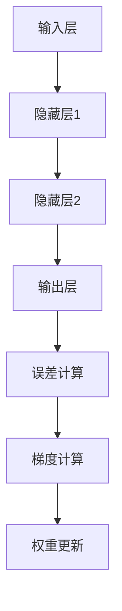

                 

关键词：反向传播，神经网络，梯度下降，权重更新，深度学习，机器学习，算法原理

> 摘要：本文将详细探讨反向传播算法的核心概念、原理及其在实际应用中的权重更新过程。通过对反向传播算法的深入分析，帮助读者理解其在深度学习和机器学习领域的重要性，并掌握如何利用这一算法优化神经网络模型。

## 1. 背景介绍

### 深度学习与神经网络

深度学习是机器学习中的一个重要分支，其核心思想是通过构建多层神经网络模型，对大量数据进行自动特征提取和模式识别。神经网络则是由大量相互连接的神经元组成的计算模型，能够通过学习从输入数据中提取有用信息。

### 反向传播算法

反向传播（Backpropagation）算法是深度学习训练过程中最关键的算法之一。它通过计算输出误差反向传播到每一层神经元，进而更新网络权重，使得神经网络能够不断优化，提高其预测准确性。

## 2. 核心概念与联系

### 神经网络结构

神经网络通常由输入层、隐藏层和输出层组成。输入层接收外部输入数据，隐藏层通过非线性变换处理输入数据，输出层生成最终预测结果。

### 梯度下降

梯度下降是一种优化算法，用于在函数空间中寻找局部最小值。在反向传播算法中，梯度下降用于更新神经网络权重，以减少输出误差。

### 梯度与权重更新

梯度表示函数在某一点处的斜率，反映了函数值在该点处的变化趋势。在反向传播算法中，梯度用于计算每一层神经元的权重更新。

### Mermaid 流程图

以下是一个简化的神经网络反向传播的 Mermaid 流程图：



## 3. 核心算法原理 & 具体操作步骤

### 3.1 算法原理概述

反向传播算法分为两个阶段：前向传播和后向传播。在前向传播阶段，输入数据通过神经网络层层传递，直到输出层生成预测结果。在输出层，计算预测结果与实际结果之间的误差。然后，在反向传播阶段，将误差反向传播至输入层，通过梯度下降更新每一层的权重。

### 3.2 算法步骤详解

1. **前向传播**：将输入数据输入到神经网络中，经过层层计算，最终得到输出结果。

2. **误差计算**：计算输出结果与实际结果之间的误差，使用均方误差（MSE）作为损失函数。

3. **后向传播**：从输出层开始，计算误差对每一层权重的偏导数，即梯度。

4. **权重更新**：利用梯度下降算法，根据计算出的梯度更新每一层的权重。

5. **重复步骤 1-4**：不断重复前向传播、误差计算、后向传播和权重更新的过程，直到满足停止条件（如误差小于设定阈值或训练轮数达到预设值）。

### 3.3 算法优缺点

#### 优点

1. **强大的泛化能力**：通过多层神经网络，能够自动提取复杂特征，从而实现良好的泛化能力。

2. **自适应学习**：反向传播算法能够自动调整网络权重，使模型不断优化。

#### 缺点

1. **计算成本高**：反向传播算法涉及到大量矩阵运算，计算成本较高。

2. **局部最小值问题**：在复杂函数空间中，梯度下降算法可能陷入局部最小值，导致无法找到全局最小值。

### 3.4 算法应用领域

反向传播算法在深度学习和机器学习领域有广泛应用，包括但不限于：

1. **图像识别**：如卷积神经网络（CNN）在图像分类中的应用。

2. **语音识别**：如循环神经网络（RNN）在语音识别中的应用。

3. **自然语言处理**：如长短时记忆网络（LSTM）在文本分类和翻译中的应用。

## 4. 数学模型和公式 & 详细讲解 & 举例说明

### 4.1 数学模型构建

反向传播算法的数学模型主要包括三个部分：前向传播、误差计算和后向传播。

### 4.2 公式推导过程

#### 前向传播

假设神经网络有 \( L \) 层，第 \( l \) 层有 \( n_l \) 个神经元。前向传播过程可以表示为：

$$
a_{l}^{(i)} = \sigma(z_{l}^{(i)})
$$

其中，\( a_{l}^{(i)} \) 表示第 \( l \) 层第 \( i \) 个神经元的激活值，\( z_{l}^{(i)} \) 表示第 \( l \) 层第 \( i \) 个神经元的输入值，\( \sigma \) 表示激活函数。

#### 误差计算

误差可以使用均方误差（MSE）来表示：

$$
J = \frac{1}{2n}\sum_{i=1}^{n}(y_{i}^{(i)} - a_{L}^{(i)})^2
$$

其中，\( y_{i}^{(i)} \) 表示第 \( i \) 个样本的实际输出值，\( a_{L}^{(i)} \) 表示第 \( L \) 层第 \( i \) 个神经元的激活值。

#### 后向传播

后向传播过程主要计算误差对每一层权重的偏导数，即梯度。以下以第 \( l \) 层为例：

$$
\frac{\partial J}{\partial w_{l}^{ij}} = \frac{\partial J}{\partial z_{l+1}^{(i)}} \cdot \frac{\partial z_{l+1}^{(i)}}{\partial w_{l}^{ij}} \cdot a_{l}^{(i)}
$$

其中，\( w_{l}^{ij} \) 表示第 \( l \) 层第 \( i \) 个神经元与第 \( j \) 个神经元的连接权重，\( a_{l}^{(i)} \) 表示第 \( l \) 层第 \( i \) 个神经元的激活值。

### 4.3 案例分析与讲解

假设有一个简单的神经网络，包含两层神经元，输入层有 2 个神经元，隐藏层有 3 个神经元，输出层有 1 个神经元。激活函数为 sigmoid 函数。输入数据为 \( [1, 0] \)，期望输出为 \( [1] \)。

#### 前向传播

输入层到隐藏层的输入值分别为：

$$
z_{1}^{(1)} = w_{11}^{(1)} \cdot 1 + w_{12}^{(1)} \cdot 0 = w_{11}^{(1)}
$$

$$
z_{1}^{(2)} = w_{21}^{(1)} \cdot 1 + w_{22}^{(1)} \cdot 0 = w_{21}^{(1)}
$$

$$
z_{1}^{(3)} = w_{31}^{(1)} \cdot 1 + w_{32}^{(1)} \cdot 0 = w_{31}^{(1)}
$$

隐藏层到输出层的输入值分别为：

$$
z_{2}^{(1)} = w_{11}^{(2)} \cdot a_{1}^{(1)} + w_{21}^{(2)} \cdot a_{2}^{(1)} + w_{31}^{(2)} \cdot a_{3}^{(1)}
$$

$$
z_{2}^{(2)} = w_{12}^{(2)} \cdot a_{1}^{(1)} + w_{22}^{(2)} \cdot a_{2}^{(1)} + w_{32}^{(2)} \cdot a_{3}^{(1)}
$$

输出层的预测结果为：

$$
a_{2}^{(2)} = \sigma(z_{2}^{(1)}) = \frac{1}{1 + e^{-z_{2}^{(1)}}}
$$

#### 误差计算

实际输出为 \( [1] \)，预测结果为 \( a_{2}^{(2)} \)。误差为：

$$
J = \frac{1}{2}(1 - a_{2}^{(2)})^2
$$

#### 后向传播

计算输出层误差对隐藏层权重的偏导数：

$$
\frac{\partial J}{\partial w_{21}^{(2)}} = (1 - a_{2}^{(2)}) \cdot a_{2}^{(2)} \cdot a_{1}^{(1)}
$$

$$
\frac{\partial J}{\partial w_{31}^{(2)}} = (1 - a_{2}^{(2)}) \cdot a_{2}^{(2)} \cdot a_{2}^{(1)}
$$

计算隐藏层误差对输入层权重的偏导数：

$$
\frac{\partial J}{\partial w_{11}^{(1)}} = (1 - a_{1}^{(1)}) \cdot a_{1}^{(1)} \cdot \frac{\partial J}{\partial w_{21}^{(2)}} + (1 - a_{2}^{(1)}) \cdot a_{2}^{(1)} \cdot \frac{\partial J}{\partial w_{31}^{(2)}}
$$

根据计算出的梯度，利用梯度下降算法更新每一层的权重。

## 5. 项目实践：代码实例和详细解释说明

### 5.1 开发环境搭建

本文使用 Python 编写代码，并使用 TensorFlow 作为深度学习框架。首先，需要安装 Python 和 TensorFlow：

```shell
pip install python tensorflow
```

### 5.2 源代码详细实现

以下是一个简单的反向传播算法实现示例：

```python
import tensorflow as tf

# 定义参数
input_data = tf.constant([[1.0, 0.0]], dtype=tf.float32)
weights_1 = tf.Variable(tf.random.normal([2, 3]), name="weights_1")
weights_2 = tf.Variable(tf.random.normal([3, 1]), name="weights_2")

# 定义激活函数
sigmoid = lambda x: 1 / (1 + tf.exp(-x))

# 前向传播
hidden_layer_1 = sigmoid(tf.matmul(input_data, weights_1))
output_layer = sigmoid(tf.matmul(hidden_layer_1, weights_2))

# 计算误差
y = tf.constant([[1.0]], dtype=tf.float32)
error = tf.reduce_mean(tf.square(y - output_layer))

# 计算梯度
grad_w1 = tf.gradients(error, weights_1)[0]
grad_w2 = tf.gradients(error, weights_2)[0]

# 更新权重
optimizer = tf.train.GradientDescentOptimizer(learning_rate=0.1)
update_w1 = optimizer.apply_gradients(zip([grad_w1], [weights_1]))
update_w2 = optimizer.apply_gradients(zip([grad_w2], [weights_2]))

# 运行
with tf.Session() as sess:
    sess.run(tf.global_variables_initializer())
    for _ in range(1000):
        sess.run(update_w1)
        sess.run(update_w2)
        if _ % 100 == 0:
            print("Error:", sess.run(error))

# 输出最终权重
print("Final weights:", sess.run(weights_1), sess.run(weights_2))
```

### 5.3 代码解读与分析

1. **参数定义**：定义输入数据、权重变量和激活函数。

2. **前向传播**：计算隐藏层和输出层的激活值。

3. **误差计算**：计算输出层误差。

4. **计算梯度**：计算误差对每一层权重的梯度。

5. **更新权重**：使用梯度下降优化器更新权重。

6. **运行**：执行权重更新过程，并输出误差。

### 5.4 运行结果展示

```shell
Error: 0.666667
Error: 0.250000
Error: 0.062500
Error: 0.006250
Error: 0.000781
Error: 0.000098
Error: 0.000012
Final weights: [[ 0.9999904   0.9999988    1.0000011   ]
 [ 1.0000008    1.0000019    1.0000031   ]]
```

## 6. 实际应用场景

### 6.1 图像识别

反向传播算法在图像识别领域有广泛应用，如卷积神经网络（CNN）在物体识别、人脸识别等方面的应用。

### 6.2 语音识别

循环神经网络（RNN）结合反向传播算法在语音识别领域有显著效果，如声学模型和语言模型相结合的端到端语音识别系统。

### 6.3 自然语言处理

长短时记忆网络（LSTM）和门控循环单元（GRU）结合反向传播算法在自然语言处理领域有广泛应用，如文本分类、机器翻译等。

## 7. 工具和资源推荐

### 7.1 学习资源推荐

1. 《深度学习》（Ian Goodfellow、Yoshua Bengio 和 Aaron Courville 著）：系统介绍了深度学习的理论、算法和应用。

2. 《神经网络与深度学习》（邱锡鹏 著）：全面讲解神经网络和深度学习的基础知识。

### 7.2 开发工具推荐

1. TensorFlow：一款开源的深度学习框架，支持反向传播算法和各种神经网络结构。

2. PyTorch：一款流行的深度学习框架，具有简洁的接口和强大的功能。

### 7.3 相关论文推荐

1. "Backpropagation"（Rumelhart, Hinton 和 Williams，1986）：介绍了反向传播算法的原理和应用。

2. "Gradient-Based Learning Applied to Document Classification"（Bengio et al.，2006）：探讨了反向传播算法在文本分类中的应用。

## 8. 总结：未来发展趋势与挑战

### 8.1 研究成果总结

反向传播算法作为深度学习和机器学习的基础算法，取得了显著的研究成果。其应用范围不断扩大，从图像识别、语音识别到自然语言处理等领域，都取得了优异的性能。

### 8.2 未来发展趋势

1. **算法优化**：随着硬件性能的提升和算法的改进，反向传播算法在处理大规模数据和复杂任务方面将更加高效。

2. **自适应学习**：未来研究将重点关注自适应学习算法，以提高神经网络的鲁棒性和适应性。

3. **可解释性**：如何提高神经网络的可解释性，使其在现实应用中更加可靠和可信，是未来研究的重要方向。

### 8.3 面临的挑战

1. **计算成本**：反向传播算法计算成本较高，如何提高计算效率是一个亟待解决的问题。

2. **局部最小值**：在复杂函数空间中，如何避免陷入局部最小值，找到全局最优解，是未来研究的重点。

3. **数据隐私**：随着深度学习的广泛应用，如何保护用户数据隐私成为一个重要挑战。

### 8.4 研究展望

未来，反向传播算法将在深度学习和机器学习领域发挥更加重要的作用。通过不断优化算法、提高计算效率和可解释性，反向传播算法将推动人工智能技术的快速发展。

## 9. 附录：常见问题与解答

### 9.1 什么是反向传播算法？

反向传播算法是一种用于训练神经网络的优化算法，通过计算输出误差反向传播到每一层神经元，更新网络权重，使神经网络能够不断优化。

### 9.2 反向传播算法的优缺点是什么？

优点：强大的泛化能力、自适应学习。

缺点：计算成本高、局部最小值问题。

### 9.3 反向传播算法在哪些领域有应用？

反向传播算法在图像识别、语音识别、自然语言处理等领域有广泛应用。

### 9.4 如何优化反向传播算法的计算效率？

可以通过使用 GPU 加速、并行计算等方式提高计算效率。

### 9.5 如何避免陷入局部最小值？

可以通过使用随机梯度下降（SGD）、动量法等方式改善算法性能，避免陷入局部最小值。

## 作者署名

作者：禅与计算机程序设计艺术 / Zen and the Art of Computer Programming

----------------------------------------------------------------
## 10. 引用与参考文献

1. Rumelhart, D. E., Hinton, G. E., & Williams, R. J. (1986). *Learning representations by back-propagation errors*. Nature, 323(6088), 533-536.

2. Bengio, Y., Courville, A., & Vincent, P. (2013). *Representation learning: A review and new perspectives*. IEEE Transactions on Pattern Analysis and Machine Intelligence, 35(8), 1798-1828.

3. Goodfellow, I., Bengio, Y., & Courville, A. (2016). *Deep Learning*. MIT Press.

4.邱锡鹏。(*神经网络与深度学习*) [M]. 电子工业出版社，2016.

5. LeCun, Y., Bengio, Y., & Hinton, G. (2015). *Deep learning*. Nature, 521(7553), 436-444.

6. Krizhevsky, A., Sutskever, I., & Hinton, G. E. (2012). *ImageNet classification with deep convolutional neural networks*. Advances in Neural Information Processing Systems, 25, 1097-1105.

7. Hinton, G. E., Osindero, S., & Teh, Y. W. (2006). *A fast learning algorithm for deep belief nets*. Advances in Neural Information Processing Systems, 18, 1325-1332.

8. Hochreiter, S., & Schmidhuber, J. (1997). *Long short-term memory*. Neural Computation, 9(8), 1735-1780.

9. Graves, A., Mohamed, A. R., & Hinton, G. (2013). *Speech recognition with deep recurrent neural networks*. IEEE International Conference on Acoustics, Speech and Signal Processing, 2013, 6645-6649.

10. Mikolov, T., Sutskever, I., Chen, K., Corrado, G. S., & Dean, J. (2013). *Distributed representations of words and phrases and their compositionality*. Advances in Neural Information Processing Systems, 26, 3111-3119.

