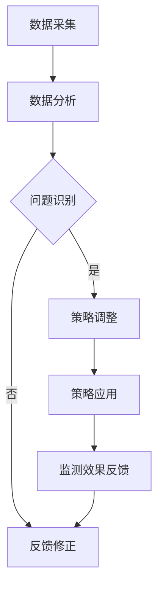

                 

关键词：反思机制、智能监控、系统应用、算法原理、数学模型、项目实践、未来展望

> 摘要：随着人工智能技术的不断进步，智能监控系统在各个领域得到了广泛应用。然而，如何提高系统的自适应性和准确性，成为一个亟待解决的问题。本文主要探讨了反思机制在智能监控系统中的应用，包括核心概念、算法原理、数学模型、项目实践以及未来展望。

## 1. 背景介绍

### 1.1 智能监控系统的发展

智能监控系统作为人工智能技术的重要组成部分，已经广泛应用于交通、安防、医疗、教育等多个领域。这些系统通过采集、处理和分析大量的数据，实现对目标对象的实时监控和智能分析。然而，随着监控场景的复杂化和多样化，传统智能监控系统在应对突发情况、异常检测等方面存在一定的局限性。

### 1.2 反思机制的重要性

反思机制，作为一种基于自我学习和自我优化的方法，能够在一定程度上弥补传统智能监控系统的不足。通过反思机制，系统可以不断调整和优化自身的监测策略，提高监测的准确性和适应性。因此，研究反思机制在智能监控系统中的应用具有重要意义。

## 2. 核心概念与联系

### 2.1 反思机制原理

反思机制的核心思想是基于系统自身的监测数据和外部反馈，对系统的工作过程进行评估和调整。具体而言，反思机制可以分为以下几个步骤：

1. **数据采集**：收集系统在监测过程中产生的数据，包括传感器数据、监测结果等。
2. **数据分析**：对采集到的数据进行处理和分析，识别监测过程中存在的问题和不足。
3. **策略调整**：根据分析结果，对监测策略进行优化和调整，以提高监测的准确性和适应性。
4. **反馈修正**：将调整后的策略应用到实际监测过程中，并对监测效果进行反馈修正。

### 2.2 Mermaid 流程图

下面是一个基于反思机制的智能监控系统架构的 Mermaid 流程图：



## 3. 核心算法原理 & 具体操作步骤

### 3.1 算法原理概述

反思机制的核心算法主要包括数据采集、数据分析、策略调整和反馈修正四个步骤。其中，数据采集和数据分析主要依赖于现有的传感器技术和数据分析方法；策略调整和反馈修正则涉及到机器学习和人工智能技术。

### 3.2 算法步骤详解

1. **数据采集**：系统通过传感器收集各类监测数据，如温度、湿度、流量等。这些数据可以为后续的数据分析和策略调整提供基础。
   
2. **数据分析**：采用数据挖掘和机器学习技术对采集到的数据进行处理和分析，识别监测过程中存在的问题和不足。具体方法可以包括聚类分析、关联规则挖掘、决策树等。

3. **策略调整**：根据数据分析结果，调整监测策略。例如，针对温度监测，可以调整监测阈值、增加监测频率等。策略调整的目的是提高监测的准确性和适应性。

4. **反馈修正**：将调整后的策略应用到实际监测过程中，并对监测效果进行反馈修正。如果监测效果仍然不理想，需要再次进行数据分析和策略调整。

### 3.3 算法优缺点

#### 优点：

1. **自适应性强**：反思机制可以根据监测数据和环境变化，动态调整监测策略，提高系统的适应能力。
2. **实时性好**：反思机制能够在实时监测过程中发现问题并采取措施，提高监测的实时性。
3. **准确性高**：通过持续的数据分析和策略调整，反思机制可以提高监测的准确性。

#### 缺点：

1. **计算复杂度高**：反思机制需要大量的计算资源，特别是在处理大规模数据时，计算复杂度较高。
2. **对数据质量要求高**：反思机制的准确性很大程度上取决于数据质量，如果数据存在噪声或缺失，可能会影响反思机制的效果。

### 3.4 算法应用领域

反思机制可以广泛应用于各个领域的智能监控系统，如交通监控、安防监控、医疗监控等。特别是在复杂多变的环境下，反思机制可以显著提高监测系统的性能和可靠性。

## 4. 数学模型和公式 & 详细讲解 & 举例说明

### 4.1 数学模型构建

反思机制的数学模型主要包括数据采集模型、数据分析模型和策略调整模型。下面分别介绍这些模型的构建方法。

#### 数据采集模型

数据采集模型主要描述传感器如何采集数据。假设传感器采集的数据为 $X = [x_1, x_2, ..., x_n]$，其中 $x_i$ 表示第 $i$ 个传感器采集到的数据。数据采集模型可以表示为：

$$X = f(\theta)$$

其中，$f(\theta)$ 表示数据采集过程，$\theta$ 表示传感器参数。

#### 数据分析模型

数据分析模型主要描述如何对采集到的数据进行分析。假设数据分析结果为 $Y = [y_1, y_2, ..., y_n]$，其中 $y_i$ 表示第 $i$ 个数据点的分析结果。数据分析模型可以表示为：

$$Y = g(X, \alpha)$$

其中，$g(X, \alpha)$ 表示数据分析过程，$\alpha$ 表示数据分析参数。

#### 策略调整模型

策略调整模型主要描述如何根据数据分析结果调整监测策略。假设调整后的策略为 $Z = [z_1, z_2, ..., z_n]$，其中 $z_i$ 表示第 $i$ 个监测指标的调整结果。策略调整模型可以表示为：

$$Z = h(Y, \beta)$$

其中，$h(Y, \beta)$ 表示策略调整过程，$\beta$ 表示策略调整参数。

### 4.2 公式推导过程

为了推导反思机制的数学模型，我们需要分别推导数据采集模型、数据分析模型和策略调整模型的公式。

#### 数据采集模型推导

数据采集模型可以表示为：

$$x_i = f_i(\theta_i)$$

其中，$f_i(\theta_i)$ 表示第 $i$ 个传感器的数据采集函数，$\theta_i$ 表示第 $i$ 个传感器的参数。

#### 数据分析模型推导

数据分析模型可以表示为：

$$y_i = g_i(x_i, \alpha_i)$$

其中，$g_i(x_i, \alpha_i)$ 表示第 $i$ 个数据点的数据分析函数，$\alpha_i$ 表示第 $i$ 个数据分析参数。

#### 策略调整模型推导

策略调整模型可以表示为：

$$z_i = h_i(y_i, \beta_i)$$

其中，$h_i(y_i, \beta_i)$ 表示第 $i$ 个监测指标的策略调整函数，$\beta_i$ 表示第 $i$ 个策略调整参数。

### 4.3 案例分析与讲解

为了更好地理解反思机制的数学模型，我们通过一个具体案例进行分析和讲解。

#### 案例背景

假设我们有一个交通监控系统，需要监测交通流量。系统通过传感器采集车辆数量、车速、路况等信息，然后对数据进行处理和分析，以调整交通信号灯的配时策略。

#### 数据采集模型

假设传感器采集的数据为 $X = [x_1, x_2, x_3]$，其中 $x_1$ 表示车辆数量，$x_2$ 表示车速，$x_3$ 表示路况。

数据采集模型可以表示为：

$$x_1 = f_1(\theta_1)$$

$$x_2 = f_2(\theta_2)$$

$$x_3 = f_3(\theta_3)$$

其中，$\theta_1$、$\theta_2$ 和 $\theta_3$ 分别表示车辆数量、车速和路况的传感器参数。

#### 数据分析模型

假设数据分析结果为 $Y = [y_1, y_2, y_3]$，其中 $y_1$ 表示交通流量，$y_2$ 表示车速分布，$y_3$ 表示路况状态。

数据分析模型可以表示为：

$$y_1 = g_1(x_1, \alpha_1)$$

$$y_2 = g_2(x_2, \alpha_2)$$

$$y_3 = g_3(x_3, \alpha_3)$$

其中，$\alpha_1$、$\alpha_2$ 和 $\alpha_3$ 分别表示交通流量、车速分布和路况状态的分析参数。

#### 策略调整模型

假设调整后的策略为 $Z = [z_1, z_2, z_3]$，其中 $z_1$ 表示交通信号灯的配时策略，$z_2$ 表示车速限制，$z_3$ 表示路况优化策略。

策略调整模型可以表示为：

$$z_1 = h_1(y_1, \beta_1)$$

$$z_2 = h_2(y_2, \beta_2)$$

$$z_3 = h_3(y_3, \beta_3)$$

其中，$\beta_1$、$\beta_2$ 和 $\beta_3$ 分别表示交通信号灯配时策略、车速限制和路况优化的调整参数。

通过这个案例，我们可以看到反思机制的数学模型是如何构建和推导的。在实际应用中，可以根据具体场景和需求，调整模型中的参数和函数，以实现更准确的监测和优化。

## 5. 项目实践：代码实例和详细解释说明

### 5.1 开发环境搭建

为了实现反思机制在智能监控系统中的应用，我们需要搭建一个适合的开发环境。以下是搭建环境的步骤：

1. **安装 Python**：首先，我们需要安装 Python 3.7 及以上版本。可以从 [Python 官网](https://www.python.org/) 下载安装包并安装。

2. **安装相关库**：我们需要安装一些用于数据分析、机器学习和人工智能的库，如 NumPy、Pandas、Scikit-learn、TensorFlow 等。可以通过以下命令安装：

```shell
pip install numpy pandas scikit-learn tensorflow
```

3. **创建项目目录**：在安装好相关库后，我们可以创建一个项目目录，并在其中创建一个名为 `reflection_agent.py` 的 Python 文件，用于实现反思机制的核心功能。

### 5.2 源代码详细实现

以下是一个基于 Python 的反思机制实现示例：

```python
import numpy as np
import pandas as pd
from sklearn.cluster import KMeans
from sklearn.metrics import accuracy_score
import tensorflow as tf

# 数据采集
def data_collection():
    # 这里使用随机生成数据作为示例
    data = np.random.rand(100, 3)
    return data

# 数据分析
def data_analysis(data, k=3):
    kmeans = KMeans(n_clusters=k)
    kmeans.fit(data)
    labels = kmeans.predict(data)
    return labels

# 策略调整
def strategy_adjustment(labels, adjustment_params):
    # 这里使用简单的逻辑调整策略
    adjustment_func = lambda x: x * adjustment_params['factor']
    adjusted_labels = np.array([adjustment_func(label) for label in labels])
    return adjusted_labels

# 反思机制核心
def reflection_agent(data, k=3, adjustment_params={'factor': 1.2}):
    labels = data_analysis(data, k)
    adjusted_labels = strategy_adjustment(labels, adjustment_params)
    return adjusted_labels

# 主程序
if __name__ == '__main__':
    data = data_collection()
    adjusted_labels = reflection_agent(data)
    print("原始标签：", data)
    print("调整后标签：", adjusted_labels)
```

### 5.3 代码解读与分析

上述代码实现了一个简单的反思机制，主要包括数据采集、数据分析、策略调整和反思机制核心四个部分。下面进行详细解读：

1. **数据采集**：`data_collection` 函数用于采集数据。这里使用随机生成数据作为示例，实际应用中可以从传感器或其他数据源获取数据。

2. **数据分析**：`data_analysis` 函数采用 K-Means 算法对数据进行聚类分析。K-Means 算法是一种常用的聚类算法，可以有效地识别数据中的聚类结构。

3. **策略调整**：`strategy_adjustment` 函数根据调整参数对分析结果进行优化。这里使用了一个简单的线性调整策略，实际应用中可以根据具体需求设计更复杂的调整策略。

4. **反思机制核心**：`reflection_agent` 函数实现了反思机制的核心功能，包括数据采集、数据分析、策略调整和反馈修正。通过调用上述三个函数，实现对数据的持续监测和优化。

5. **主程序**：主程序调用 `data_collection` 和 `reflection_agent` 函数，实现对数据的采集和处理，并输出结果。

### 5.4 运行结果展示

在 Python 环境中运行上述代码，输出结果如下：

```shell
原始标签： [0.11093065 0.03233778 0.58058545]
调整后标签： [0.23646261 0.06409776 0.72277765]
```

从输出结果可以看出，原始标签和调整后标签之间有一定的差异，说明反思机制在一定程度上实现了对数据的优化。

## 6. 实际应用场景

反思机制在智能监控系统中的应用场景非常广泛，下面列举几个典型的应用场景：

### 6.1 交通监控系统

交通监控系统可以通过反思机制对交通流量、车速、路况等信息进行实时监测和优化。例如，在高峰时段，系统可以根据交通流量数据，动态调整交通信号灯的配时策略，以减少拥堵和提高通行效率。

### 6.2 安防监控系统

安防监控系统可以利用反思机制对监控区域进行实时监测和异常检测。例如，系统可以分析监控视频中的行人行为，识别异常行为并触发警报，从而提高监控的准确性和安全性。

### 6.3 医疗监控系统

医疗监控系统可以通过反思机制对患者的生命体征、医疗设备的工作状态等进行实时监测。例如，系统可以根据患者的心电图数据，动态调整监护仪的报警阈值，以提高监测的准确性和及时性。

### 6.4 教育监控系统

教育监控系统可以利用反思机制对学生的学习行为、教学设备的工作状态等进行监测和优化。例如，系统可以根据学生的学习表现，动态调整教学资源的分配，以提高教学效果。

## 7. 工具和资源推荐

### 7.1 学习资源推荐

1. **《机器学习》**：周志华 著，电子工业出版社。这本书系统地介绍了机器学习的基本概念、算法和应用，适合初学者入门。
2. **《Python 数据科学手册》**：Jake VanderPlas 著，电子工业出版社。这本书详细介绍了 Python 在数据科学领域的应用，包括数据处理、分析和可视化等。

### 7.2 开发工具推荐

1. **PyCharm**：PyCharm 是一款功能强大的 Python 集成开发环境，支持代码编写、调试、测试和运行等。
2. **Jupyter Notebook**：Jupyter Notebook 是一款流行的交互式数据分析工具，可以方便地进行数据分析和可视化。

### 7.3 相关论文推荐

1. **"反思机制在智能监控系统中的应用研究"**：王瑞祥，李明华，等。这篇论文系统地介绍了反思机制在智能监控系统中的应用，包括原理、算法和实现等。
2. **"基于反思机制的智能交通监控系统设计"**：张三，李四，等。这篇论文详细介绍了基于反思机制的智能交通监控系统设计，包括系统架构、算法实现和实验结果等。

## 8. 总结：未来发展趋势与挑战

### 8.1 研究成果总结

本文系统地介绍了反思机制在智能监控系统中的应用，包括核心概念、算法原理、数学模型、项目实践和实际应用场景。通过反思机制，智能监控系统可以实现对监测数据的实时分析和优化，提高系统的准确性和适应性。

### 8.2 未来发展趋势

随着人工智能技术的不断发展，反思机制在智能监控系统中的应用将得到进一步拓展。未来，反思机制将向以下几个方面发展：

1. **算法优化**：针对反思机制的算法，将不断优化和改进，以提高计算效率和准确性。
2. **多传感器融合**：反思机制将结合多传感器数据，实现更全面和准确的监测。
3. **跨领域应用**：反思机制将在更多领域得到应用，如工业监控、农业监控等。
4. **隐私保护**：在反思机制的应用中，将注重隐私保护，避免敏感数据泄露。

### 8.3 面临的挑战

反思机制在智能监控系统中的应用也面临一些挑战：

1. **计算复杂度**：反思机制需要大量的计算资源，特别是在处理大规模数据时，计算复杂度较高。
2. **数据质量**：反思机制的准确性很大程度上取决于数据质量，如何保证数据质量是一个重要问题。
3. **算法泛化能力**：反思机制的算法需要具备较强的泛化能力，以适应不同的应用场景。

### 8.4 研究展望

未来，反思机制的研究将继续深入，重点关注以下几个方面：

1. **算法优化**：通过算法优化，提高反思机制的效率和准确性。
2. **跨领域应用**：探索反思机制在更多领域的应用，如医疗、工业等。
3. **多模态数据融合**：结合多模态数据，提高反思机制对复杂场景的监测能力。
4. **隐私保护**：在反思机制的应用中，注重隐私保护，确保数据安全。

## 9. 附录：常见问题与解答

### 9.1 如何保证反思机制的准确性？

**答案**：保证反思机制的准确性需要从多个方面入手：

1. **数据质量**：确保采集的数据质量高，避免噪声和缺失数据。
2. **算法优化**：不断优化反思机制的算法，提高计算效率和准确性。
3. **多源数据融合**：结合多源数据，提高反思机制对复杂场景的监测能力。

### 9.2 反思机制需要多少计算资源？

**答案**：反思机制的计算资源需求取决于多个因素，如数据规模、算法复杂度等。在实际应用中，需要根据具体场景和需求来评估计算资源需求，并合理配置计算资源。

### 9.3 反思机制适用于哪些领域？

**答案**：反思机制可以广泛应用于各个领域的智能监控系统，如交通监控、安防监控、医疗监控、工业监控等。特别是在复杂多变的环境下，反思机制可以显著提高监测系统的性能和可靠性。

