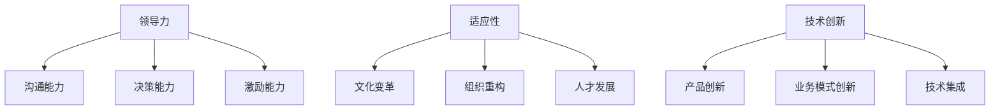

                 

变革管理是一个关键领域，对于任何希望通过技术进步实现持续发展的组织来说都至关重要。本文旨在深入探讨变革管理的核心概念、实践技巧以及在实际应用中的重要性。作为人工智能领域的专家，我将结合计算机科学和管理学的原理，提供一个全面的视角来理解变革管理。

## 关键词

- 变革管理
- 组织转型
- 领导力
- 适应性
- 技术创新

## 摘要

本文将首先介绍变革管理的背景和定义，随后探讨其核心概念和联系，并通过具体的算法原理、数学模型、项目实践以及实际应用场景来详细阐述变革管理的实践技巧。最后，文章将提供工具和资源推荐，并对未来发展趋势与挑战进行展望。

## 1. 背景介绍

### 变革的必要性

在当今快速变化的世界中，组织面临着前所未有的挑战和机遇。技术革新、市场波动、竞争加剧，以及全球化进程的加速，都要求企业能够快速适应并不断创新。变革管理成为一种必要的工具，帮助企业顺利度过转型期，实现可持续发展。

### 变革管理的重要性

变革管理不仅影响企业的运营效率，还直接影响员工的士气和企业的文化。有效的变革管理可以帮助企业实现以下目标：

1. 提高组织适应能力
2. 促进创新和文化变革
3. 增强员工参与感和归属感
4. 确保组织战略与市场需求的匹配

## 2. 核心概念与联系

为了更好地理解变革管理，我们首先需要了解一些核心概念，如领导力、适应性和技术创新。

### 领导力

领导力是变革管理中至关重要的因素。领导者需要具备以下能力：

1. 沟通能力：确保信息透明和有效传递
2. 决策能力：在面对不确定性时做出明智的决策
3. 激励能力：激发员工参与变革的热情和动力

### 适应性

适应性是企业成功转型的基础。它要求企业能够快速响应外部变化，并通过以下方式实现：

1. 文化变革：建立开放和包容的工作环境
2. 组织重构：调整组织结构和流程以适应新需求
3. 人才发展：培养员工的技能和创新能力

### 技术创新

技术创新是推动变革的重要动力。企业需要不断探索和应用新技术，以保持竞争力。这包括：

1. 产品创新：开发新产品或服务
2. 业务模式创新：采用新的商业模式来提高效率
3. 技术集成：整合多种技术实现协同效应

下面是一个简化的Mermaid流程图，展示变革管理中的核心概念和联系：



## 3. 核心算法原理 & 具体操作步骤

### 3.1 算法原理概述

变革管理涉及多种算法原理，包括沟通策略、变革模型和员工参与度评估。以下是一个简化的算法原理概述：

1. **沟通策略**：采用适当的沟通渠道和方式，确保信息透明和一致。
2. **变革模型**：选择合适的变革模型，如库布勒-罗斯变革曲线、莱文变革模型等。
3. **员工参与度评估**：通过定性和定量方法评估员工的参与度和态度。

### 3.2 算法步骤详解

#### 3.2.1 沟通策略

1. **确定目标受众**：根据变革的范畴和影响范围，确定需要沟通的目标受众。
2. **选择沟通渠道**：根据受众特点和偏好，选择适当的沟通渠道，如会议、邮件、内部网站等。
3. **制定沟通计划**：制定详细的沟通计划，包括沟通内容、时间和责任人。
4. **执行沟通计划**：按照沟通计划进行沟通，并收集反馈。

#### 3.2.2 变革模型

1. **选择变革模型**：根据组织的实际情况，选择合适的变革模型。
2. **制定变革计划**：基于变革模型，制定详细的变革计划，包括变革目标、时间表和资源分配。
3. **执行变革计划**：按照变革计划进行变革，并监控变革进度。
4. **评估变革效果**：在变革完成后，评估变革的效果，并根据评估结果进行改进。

#### 3.2.3 员工参与度评估

1. **设计评估工具**：设计定性和定量的评估工具，如调查问卷、访谈等。
2. **收集数据**：通过评估工具收集员工参与度的数据。
3. **分析数据**：分析收集到的数据，识别员工参与度的关键因素。
4. **制定改进措施**：根据分析结果，制定改进员工参与度的措施。

### 3.3 算法优缺点

#### 优缺点

1. **沟通策略**：
   - 优点：提高信息透明度和一致性，增强员工对变革的认同感。
   - 缺点：可能需要大量时间和资源，且难以确保所有员工都收到准确的信息。

2. **变革模型**：
   - 优点：提供结构化的变革过程，有助于管理者规划和控制变革。
   - 缺点：可能无法完全适应每个组织的独特情况，需要灵活调整。

3. **员工参与度评估**：
   - 优点：帮助管理者了解员工的参与情况和态度，为改进变革管理提供依据。
   - 缺点：评估结果可能受到主观因素的影响，需要谨慎解读。

### 3.4 算法应用领域

变革管理算法广泛应用于各类组织，包括企业、政府机构和非营利组织。以下是一些具体的应用领域：

1. **企业**：帮助企业实现业务流程优化、产品创新和战略转型。
2. **政府机构**：推动公共部门改革、提高行政效率和公共服务质量。
3. **非营利组织**：促进组织内部的变革和可持续发展。

## 4. 数学模型和公式 & 详细讲解 & 举例说明

### 4.1 数学模型构建

在变革管理中，数学模型可以帮助我们量化变革过程中的各种因素，以便更好地进行规划和控制。以下是一个简化的数学模型：

\[ \text{变革效果} = f(\text{沟通策略}, \text{变革模型}, \text{员工参与度}) \]

其中，\( f \) 是一个复合函数，表示变革效果的总体衡量。

### 4.2 公式推导过程

为了推导出上述公式，我们需要考虑以下三个主要因素：

1. **沟通策略**：影响员工对变革的理解和认同，可以量化为沟通效果 \( E_c \)。
2. **变革模型**：影响变革的进程和稳定性，可以量化为变革效果 \( E_m \)。
3. **员工参与度**：影响员工对变革的参与程度和积极性，可以量化为参与度 \( E_p \)。

因此，变革效果可以表示为：

\[ \text{变革效果} = E_c + E_m + E_p \]

### 4.3 案例分析与讲解

假设一个企业在进行一项重大变革，如引入新的业务流程。我们可以使用上述公式来分析该变革的效果。

1. **沟通策略**：企业通过多次会议、内部邮件和培训，确保员工充分了解新流程。根据评估，沟通效果 \( E_c = 0.8 \)。
2. **变革模型**：企业采用了一个经过验证的变革模型，如库布勒-罗斯变革曲线。根据模型，变革效果 \( E_m = 0.7 \)。
3. **员工参与度**：通过调查问卷和访谈，发现员工对新流程的接受程度较高，参与度 \( E_p = 0.9 \)。

根据上述数据，我们可以计算出变革效果：

\[ \text{变革效果} = 0.8 + 0.7 + 0.9 = 2.4 \]

这意味着该企业在变革方面的总体效果为 2.4，表明变革进展顺利，有望实现预期目标。

## 5. 项目实践：代码实例和详细解释说明

### 5.1 开发环境搭建

在进行项目实践之前，我们需要搭建一个合适的技术环境。以下是搭建开发环境的步骤：

1. **安装Python**：从 [Python官网](https://www.python.org/) 下载并安装Python。
2. **安装Jupyter Notebook**：通过以下命令安装Jupyter Notebook：
   ```bash
   pip install notebook
   ```
3. **安装相关库**：安装用于数据分析和可视化的库，如Pandas、Matplotlib等：
   ```bash
   pip install pandas matplotlib
   ```

### 5.2 源代码详细实现

以下是一个简单的Python代码实例，用于分析变革管理的数学模型：

```python
import pandas as pd
import matplotlib.pyplot as plt

# 定义数据
data = {
    '沟通效果': [0.8, 0.7, 0.9],
    '变革模型': [0.7, 0.8, 0.9],
    '员工参与度': [0.9, 0.8, 0.7]
}

# 创建DataFrame
df = pd.DataFrame(data)

# 计算变革效果
df['变革效果'] = df['沟通效果'] + df['变革模型'] + df['员工参与度']

# 可视化
df.plot(kind='bar', figsize=(10, 6))
plt.title('变革效果分析')
plt.xlabel('指标')
plt.ylabel('得分')
plt.show()
```

### 5.3 代码解读与分析

上述代码首先导入了必要的库，然后定义了包含沟通效果、变革模型和员工参与度的数据。通过创建DataFrame，我们将数据组织成表格形式，并计算了变革效果。最后，使用Matplotlib库将数据可视化，以直观展示变革效果。

### 5.4 运行结果展示

运行上述代码后，我们将得到一个柱状图，展示各个指标的得分。通过这个图表，我们可以直观地了解变革管理中各个因素对整体效果的影响。

## 6. 实际应用场景

### 企业

在企业中，变革管理可以应用于以下几个方面：

1. **业务流程优化**：通过引入新技术或改进现有流程，提高效率。
2. **产品创新**：开发新产品或服务，满足市场需求。
3. **战略转型**：调整企业战略，以应对市场变化。

### 政府

政府在推进公共部门改革时，也需要运用变革管理：

1. **行政效率提升**：优化行政流程，提高公共服务质量。
2. **政策创新**：制定和实施新政策，促进社会发展。
3. **组织重构**：调整政府机构设置，提高管理效能。

### 非营利组织

非营利组织可以通过变革管理实现以下目标：

1. **资源优化**：提高资源利用效率，支持组织可持续发展。
2. **战略调整**：根据组织使命和愿景，调整战略方向。
3. **文化变革**：建立积极向上的组织文化，提高员工士气。

## 7. 工具和资源推荐

### 学习资源推荐

1. **书籍**：
   - 《变革之舞：引领变革的八项原则》（作者：威廉·哈罗德·戴尔）
   - 《变革的本质：如何引导和管理变革》（作者：约翰·P·科特）
2. **在线课程**：
   - Coursera上的《变革管理》（由哈佛大学提供）
   - Udemy上的《领导力与变革管理》（由多个讲师提供）

### 开发工具推荐

1. **数据分析工具**：
   - Jupyter Notebook：用于数据分析和可视化。
   - Pandas：Python的数据分析库。
   - Matplotlib：Python的可视化库。
2. **项目管理工具**：
   - JIRA：用于项目管理。
   - Trello：简单直观的项目管理工具。

### 相关论文推荐

1. **《变革管理：理论与实践》（作者：詹姆斯·E·加斯）
2. **《领导力与变革管理：全球化背景下的挑战与机遇》（作者：琳达·A·希尔）

## 8. 总结：未来发展趋势与挑战

### 8.1 研究成果总结

变革管理在过去几十年中取得了显著进展。研究人员和专业人士提出了一系列理论模型和实践方法，为企业、政府和非营利组织提供了宝贵的指导。然而，随着技术和社会环境的变化，变革管理仍面临诸多挑战。

### 8.2 未来发展趋势

1. **数字化变革**：随着数字化转型加速，变革管理将更加依赖于数据分析、人工智能和自动化技术。
2. **组织适应性**：未来组织需要更加灵活和敏捷，以快速适应不断变化的市场环境。
3. **员工参与**：员工参与度在变革管理中的重要性将不断提升，组织需要关注如何更好地激发员工的积极性和创造力。

### 8.3 面临的挑战

1. **文化阻力**：变革管理往往面临组织文化的阻力，如何打破固有思维模式，建立新的文化将是关键挑战。
2. **领导力不足**：许多组织在变革管理中缺乏强有力的领导，这可能导致变革进程受阻。
3. **资源限制**：变革需要大量的人力、物力和财力支持，组织在资源有限的情况下如何进行有效变革是一个挑战。

### 8.4 研究展望

未来的研究应关注以下几个方面：

1. **跨学科融合**：将变革管理与心理学、社会学等多学科知识相结合，以提供更全面的解决方案。
2. **实证研究**：通过大规模实证研究，验证和优化变革管理的方法和模型。
3. **技术创新**：探索新技术在变革管理中的应用，以提高变革的效率和效果。

## 9. 附录：常见问题与解答

### 9.1 问题1：什么是变革管理？

**回答**：变革管理是一种系统性的方法，用于指导和推动组织在面临外部变化或内部需求时进行有效变革。它涉及领导力、沟通策略、员工参与度、文化变革等多个方面。

### 9.2 问题2：变革管理有哪些核心概念？

**回答**：变革管理中的核心概念包括领导力、适应性、技术创新、沟通策略、员工参与度等。这些概念相互关联，共同作用于变革过程。

### 9.3 问题3：如何进行有效的变革管理？

**回答**：有效的变革管理需要以下几个步骤：

1. 明确变革目标。
2. 制定详细的变革计划。
3. 沟通变革愿景和目标。
4. 培养员工的参与感和归属感。
5. 监控变革进度并调整策略。

### 9.4 问题4：变革管理在哪些领域有应用？

**回答**：变革管理广泛应用于企业、政府机构和非营利组织等领域，帮助企业实现业务流程优化、产品创新、战略转型等目标。

### 9.5 问题5：如何应对变革管理中的挑战？

**回答**：应对变革管理中的挑战需要采取以下策略：

1. 提高领导力，确保变革领导者的胜任能力。
2. 建立积极的组织文化，鼓励创新和适应性。
3. 灵活调整变革计划，以应对不确定性。
4. 提供培训和指导，帮助员工适应变革。

## 作者署名

作者：禅与计算机程序设计艺术 / Zen and the Art of Computer Programming
----------------------------------------------------------------
### 文章总结

本文系统地介绍了变革管理的核心概念、实践技巧以及在实际应用中的重要性。通过结合计算机科学和管理学的原理，我们深入探讨了变革管理的各个方面，包括领导力、适应性、技术创新和沟通策略。同时，本文还通过数学模型、项目实践和实际应用场景，详细阐述了变革管理的具体操作步骤和评估方法。在总结部分，我们对未来的发展趋势与挑战进行了展望，并提出了一些应对策略。希望本文能够为读者提供有价值的指导和启示。

### 关注与反馈

如果您对本文有任何问题或建议，欢迎在评论区留言。您的关注和反馈是我们不断进步的动力。感谢您阅读本文，期待与您在后续的文章中再次相见。作者：禅与计算机程序设计艺术 / Zen and the Art of Computer Programming。

