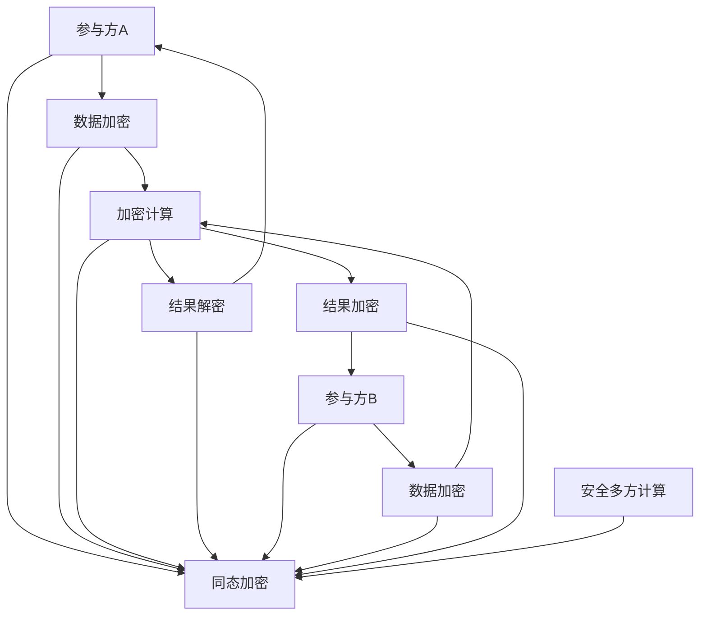

                 

 

## 关键词

同态加密、安全多方计算、算法原理、代码实战、数学模型、实际应用

## 摘要

本文旨在深入探讨同态加密与安全多方计算的基本原理、核心算法及其实际应用。我们将从背景介绍开始，逐步讲解这两个重要概念的定义、原理及联系，并通过详细的数学模型、公式推导和具体案例，帮助读者理解其工作原理和实现方法。最后，我们将分享代码实战案例，介绍如何在实际项目中应用这些技术，并展望未来的发展趋势与面临的挑战。

## 1. 背景介绍

### 同态加密的起源与发展

同态加密是一种允许在加密数据上进行计算而不会破坏加密数据完整性的密码学技术。这一概念最早由Diffie和Hellman在1976年提出，标志着公钥密码学的诞生。同态加密的核心思想是在加密数据上执行操作，得到的仍然是加密后的结果，但只有解密后的结果才是真实的操作结果。这一特性使得同态加密在许多应用场景中具有显著优势，例如云计算、安全多方计算和隐私保护等领域。

随着密码学理论和计算技术的发展，同态加密经历了多个阶段。从最初的基于理想功能的构造，到基于实际算法的优化，同态加密技术逐渐走向实用化。近年来，同态加密在理论研究和实际应用中取得了显著进展，成为密码学领域的研究热点。

### 安全多方计算的兴起

安全多方计算（Secure Multi-Party Computation，SMPC）是一种允许多个参与方在不信任的环境下共同计算结果，同时保证各方隐私的技术。这一概念最早由Goldreich等人于1986年提出，旨在解决多方计算中的隐私保护问题。

在安全多方计算中，参与方可以将自己的输入数据加密，并通过一系列加密计算协议，最终得到计算结果。这一过程中，各方无法得知其他方的输入数据，从而实现了隐私保护。安全多方计算广泛应用于金融、医疗、政府等领域，对于保护个人隐私和数据安全具有重要意义。

### 同态加密与安全多方计算的联系

同态加密和安全多方计算虽然都是密码学领域的技术，但它们有各自的研究背景和应用目标。同态加密主要关注如何在加密数据上进行计算，而安全多方计算则关注如何在多方参与的情况下保护隐私。

然而，同态加密和安全多方计算之间存在紧密的联系。一方面，同态加密可以作为安全多方计算的一个基础组件，用于实现多方计算中的数据加密和计算过程。另一方面，安全多方计算可以为同态加密提供多方计算的场景，推动同态加密技术的实际应用。

在接下来的章节中，我们将详细探讨同态加密与安全多方计算的基本原理、核心算法及实际应用，帮助读者更好地理解这两个重要概念。

## 2. 核心概念与联系

### 同态加密的基本原理

同态加密的核心思想是在加密数据上进行计算，从而在不解密数据的情况下得到加密后的计算结果。这一特性使得同态加密在许多应用场景中具有显著优势，例如云计算、安全多方计算和隐私保护等。

同态加密的基本原理可以概括为以下三个步骤：

1. **数据加密**：将原始数据加密成密文。这一过程中，数据被映射到加密空间，从而实现数据的加密。

2. **加密计算**：在加密空间中执行计算操作。这一步骤是同态加密的核心，通过加密算法实现加密数据上的计算。

3. **结果解密**：将加密后的计算结果解密成原始结果。这一过程中，密文被映射回原始空间，从而实现结果的解密。

### 安全多方计算的基本原理

安全多方计算的基本原理是在多方参与的情况下，通过加密计算和协议设计，实现多方数据的联合计算，同时保证各方的隐私。安全多方计算的核心思想可以概括为以下四个方面：

1. **数据加密**：参与方将输入数据加密，并将其发送给其他参与方。这一过程中，数据被映射到加密空间，从而实现数据的加密。

2. **加密计算**：参与方在加密空间中执行计算操作。这一步骤是安全多方计算的核心，通过加密算法实现加密数据的计算。

3. **结果加密**：将计算结果加密，并将其发送给其他参与方。这一过程中，结果被映射到加密空间，从而实现结果的加密。

4. **结果解密**：参与方接收加密后的结果，并将其解密成原始结果。这一过程中，密文被映射回原始空间，从而实现结果的解密。

### 同态加密与安全多方计算的联系

同态加密和安全多方计算之间存在紧密的联系。一方面，同态加密可以作为安全多方计算的一个基础组件，用于实现多方计算中的数据加密和计算过程。另一方面，安全多方计算可以为同态加密提供多方计算的场景，推动同态加密技术的实际应用。

具体来说，同态加密在安全多方计算中的应用主要体现在以下几个方面：

1. **数据加密**：在安全多方计算中，参与方需要将自己的输入数据加密，从而保护各方的隐私。同态加密技术可以提供有效的数据加密手段，确保输入数据的加密传输和存储。

2. **加密计算**：在安全多方计算中，参与方需要在加密空间中执行计算操作。同态加密技术可以提供加密计算的支持，实现加密数据上的计算。

3. **结果解密**：在安全多方计算中，参与方需要接收加密后的计算结果，并将其解密成原始结果。同态加密技术可以提供结果解密的支持，确保各方能够正确获取计算结果。

为了更直观地理解同态加密与安全多方计算的联系，我们可以通过一个Mermaid流程图来展示其核心原理和架构。



在这个流程图中，A和B代表参与方A和B的数据加密过程，C代表加密计算过程，D代表结果解密过程，E和F代表参与方B的数据加密和结果加密过程，H代表同态加密模块，I代表安全多方计算模块。通过这个流程图，我们可以清晰地看到同态加密与安全多方计算之间的联系和交互。

总之，同态加密与安全多方计算相互支持、相互促进，共同构建了一个强大的密码学体系，为云计算、大数据和物联网等领域的隐私保护提供了有力保障。

## 3. 核心算法原理 & 具体操作步骤

### 3.1 算法原理概述

同态加密和安全多方计算的核心算法原理分别是基于不同的数学基础和密码学技术。

#### 同态加密

同态加密的核心算法是基于理想功能的构造和实际算法的优化。理想功能是指一种理想化的加密算法，它可以在加密数据上进行计算而不破坏数据的隐私性。常见的理想功能包括全同态加密（Fully Homomorphic Encryption，FHE）和部分同态加密（Somewhat Homomorphic Encryption，SHE）。

- **全同态加密（FHE）**：全同态加密允许在加密数据上执行任意计算，包括乘法和加法。这种加密方式可以实现完全的同态性，但通常需要较大的计算资源和时间。

- **部分同态加密（SHE）**：部分同态加密允许在加密数据上执行部分计算，例如只允许执行加法或乘法。虽然同态性有限，但相对于全同态加密，SHE在计算效率和实用性方面有显著提升。

#### 安全多方计算

安全多方计算的核心算法是基于密码学协议和计算理论。常见的安全多方计算协议包括秘密共享、混淆电路和可证明安全等。

- **秘密共享**：秘密共享是一种将秘密数据分成多份，每份只有部分信息的方案。通过秘密共享，各方可以独立地持有秘密数据的一部分，但无法获取完整的秘密数据。

- **混淆电路**：混淆电路是一种通过加密电路来实现多方计算的技术。在这种方案中，各方将输入数据加密后发送给其他参与方，通过一系列加密计算和传输步骤，最终得到计算结果。

- **可证明安全**：可证明安全是一种通过数学证明来确保多方计算过程的安全性的方法。在这种方案中，各方可以在不泄露隐私的情况下证明自己的计算结果正确。

### 3.2 算法步骤详解

#### 同态加密的具体操作步骤

1. **密钥生成**：首先，同态加密系统需要生成一对密钥（公钥和私钥）。公钥用于加密数据和解密结果，私钥用于解密加密数据。

2. **数据加密**：将原始数据加密成密文。这一过程包括以下几个步骤：

   - **密文表示**：将原始数据表示为加密空间中的向量或多项式。
   - **加密算法**：使用公钥和加密算法将原始数据映射到加密空间，得到密文。
   - **密文表示**：将密文表示为加密空间中的向量或多项式。

3. **加密计算**：在加密空间中执行计算操作。这一过程包括以下几个步骤：

   - **加密表示**：将计算操作表示为加密空间中的矩阵或运算符。
   - **加密计算**：使用加密算法和矩阵或运算符在加密空间中执行计算操作。
   - **结果表示**：将加密后的计算结果表示为加密空间中的向量或多项式。

4. **结果解密**：将加密后的计算结果解密成原始结果。这一过程包括以下几个步骤：

   - **解密表示**：将加密后的计算结果表示为加密空间中的向量或多项式。
   - **解密算法**：使用私钥和解密算法将加密后的计算结果映射回原始空间，得到原始结果。

#### 安全多方计算的具体操作步骤

1. **秘密共享**：将秘密数据分成多份，每份只有部分信息。这一过程包括以下几个步骤：

   - **秘密分割**：使用秘密共享算法将秘密数据分割成多份，每份只有部分信息。
   - **秘密分配**：将分割后的秘密数据分配给各方，确保各方只能获取自己持有的那部分信息。

2. **加密传输**：将秘密数据加密后发送给其他参与方。这一过程包括以下几个步骤：

   - **加密表示**：将秘密数据表示为加密空间中的向量或多项式。
   - **加密传输**：使用加密算法和加密协议将加密后的秘密数据传输给其他参与方。

3. **加密计算**：在加密空间中执行计算操作。这一过程包括以下几个步骤：

   - **加密表示**：将计算操作表示为加密空间中的矩阵或运算符。
   - **加密计算**：使用加密算法和矩阵或运算符在加密空间中执行计算操作。
   - **结果表示**：将加密后的计算结果表示为加密空间中的向量或多项式。

4. **结果解密**：将加密后的计算结果解密成原始结果。这一过程包括以下几个步骤：

   - **解密表示**：将加密后的计算结果表示为加密空间中的向量或多项式。
   - **解密算法**：使用私钥和解密算法将加密后的计算结果映射回原始空间，得到原始结果。

### 3.3 算法优缺点

#### 同态加密

**优点**：

1. **隐私保护**：同态加密可以在不泄露隐私的情况下进行数据加密和计算，非常适合云计算、大数据和物联网等场景。

2. **灵活性**：同态加密允许在加密数据上进行各种计算操作，包括加法、乘法等，具有很高的灵活性。

3. **适用范围广**：同态加密可以应用于各种应用场景，如金融、医疗、政府等。

**缺点**：

1. **计算资源消耗大**：同态加密通常需要较大的计算资源和时间，特别是在全同态加密场景中。

2. **密钥管理复杂**：同态加密的密钥管理较为复杂，需要确保密钥的安全性和正确性。

#### 安全多方计算

**优点**：

1. **隐私保护**：安全多方计算可以在不泄露隐私的情况下进行多方计算，非常适合需要保护各方隐私的场景。

2. **灵活性**：安全多方计算支持各种计算操作，包括线性计算、非线性计算等，具有很高的灵活性。

3. **安全性高**：安全多方计算通过密码学协议和计算理论确保计算过程的安全性和正确性。

**缺点**：

1. **通信开销大**：安全多方计算需要大量通信，特别是在需要大量交互的场景中，通信开销较大。

2. **计算效率低**：安全多方计算的加密计算和协议设计通常需要较大的计算资源和时间，计算效率相对较低。

### 3.4 算法应用领域

#### 同态加密

1. **云计算**：同态加密可以在云计算环境中实现数据隐私保护，确保用户数据在云端处理过程中的安全性。

2. **大数据分析**：同态加密可以应用于大数据分析场景，确保数据在处理过程中的隐私保护。

3. **物联网**：同态加密可以应用于物联网场景，保护物联网设备的隐私和数据安全。

#### 安全多方计算

1. **金融领域**：安全多方计算可以应用于金融领域，确保多方交易和数据共享过程中的隐私保护。

2. **医疗领域**：安全多方计算可以应用于医疗领域，保护患者隐私和数据安全。

3. **政府领域**：安全多方计算可以应用于政府领域，保护国家安全和社会数据安全。

总之，同态加密与安全多方计算在隐私保护、数据安全和多方计算等方面具有广泛的应用前景，随着密码学技术和计算理论的不断发展，这些技术在实际应用中的性能和实用性将不断提高。

## 4. 数学模型和公式 & 详细讲解 & 举例说明

### 4.1 数学模型构建

同态加密与安全多方计算都涉及到复杂的数学模型和公式，为了更好地理解这些概念，我们将分别介绍它们的基本数学模型。

#### 同态加密的数学模型

同态加密的数学模型主要基于理想功能的构造，包括全同态加密（FHE）和部分同态加密（SHE）。

1. **加密算法**

   假设 $G$ 是一个乘法循环群，$a$ 是 $G$ 中的一个生成元。加密算法将输入数据 $x$ 加密成密文 $c$，密文表示为 $c = [g^x \mod n]$，其中 $g$ 是 $G$ 中的一个元素，$n$ 是 $G$ 的阶。

2. **同态性**

   同态加密要求加密后的数据能够在加密空间中保持其数学性质。具体来说，对于加密后的数据 $c_1$ 和 $c_2$，同态加密应该满足以下性质：

   - **加法同态性**：$[g^{x_1} \mod n] + [g^{x_2} \mod n] = [g^{x_1 + x_2} \mod n]$。

   - **乘法同态性**：$[g^{x_1} \mod n] \times [g^{x_2} \mod n] = [g^{x_1 \times x_2} \mod n]$。

3. **解密算法**

   解密算法将加密后的数据 $c$ 解密成原始数据 $x$。解密过程通常涉及到对密文 $c$ 进行模运算，从而恢复原始数据 $x$。

#### 安全多方计算的数学模型

安全多方计算的数学模型主要基于密码学协议和计算理论，包括秘密共享、混淆电路和可证明安全等。

1. **秘密共享**

   秘密共享是一种将秘密数据分成多份的方案。假设 $m$ 是一个秘密值，秘密共享算法将 $m$ 分割成 $k$ 份，每份只有部分信息，称为份额。份额表示为 $s_i$，其中 $1 \leq i \leq k$。

2. **加密传输**

   加密传输是将秘密份额加密后传输给其他参与方的过程。假设 $g$ 是一个生成元，加密传输算法将份额 $s_i$ 加密成密文 $t_i$，密文表示为 $t_i = [g^{s_i} \mod n]$。

3. **加密计算**

   加密计算是在加密空间中执行计算操作的过程。假设 $c_1$ 和 $c_2$ 是两个加密后的数据，加密计算算法将 $c_1$ 和 $c_2$ 进行加密计算，得到加密后的计算结果 $c_3$，密文表示为 $c_3 = [g^{c_1 + c_2} \mod n]$。

4. **结果解密**

   结果解密是将加密后的计算结果解密成原始结果的过程。解密算法将密文 $c_3$ 解密成原始结果 $m_3$，解密表示为 $m_3 = \text{dec}(c_3)$。

### 4.2 公式推导过程

#### 同态加密的公式推导

同态加密的加法同态性和乘法同态性可以通过以下公式推导得到：

1. **加法同态性**

   加法同态性的推导如下：

   $$[g^{x_1} \mod n] + [g^{x_2} \mod n] = [g^{x_1 + x_2} \mod n]$$

   其中，$[g^{x_1} \mod n]$ 和 $[g^{x_2} \mod n]$ 分别表示加密后的数据 $x_1$ 和 $x_2$，$[g^{x_1 + x_2} \mod n]$ 表示加密后的计算结果 $x_1 + x_2$。

2. **乘法同态性**

   乘法同态性的推导如下：

   $$[g^{x_1} \mod n] \times [g^{x_2} \mod n] = [g^{x_1 \times x_2} \mod n]$$

   其中，$[g^{x_1} \mod n]$ 和 $[g^{x_2} \mod n]$ 分别表示加密后的数据 $x_1$ 和 $x_2$，$[g^{x_1 \times x_2} \mod n]$ 表示加密后的计算结果 $x_1 \times x_2$。

#### 安全多方计算的公式推导

安全多方计算的加密传输、加密计算和结果解密可以通过以下公式推导得到：

1. **加密传输**

   加密传输的推导如下：

   $$t_i = [g^{s_i} \mod n]$$

   其中，$t_i$ 表示加密后的份额，$s_i$ 表示原始份额。

2. **加密计算**

   加密计算的推导如下：

   $$c_3 = [g^{c_1 + c_2} \mod n]$$

   其中，$c_1$ 和 $c_2$ 表示加密后的数据，$c_3$ 表示加密后的计算结果。

3. **结果解密**

   结果解密的推导如下：

   $$m_3 = \text{dec}(c_3)$$

   其中，$c_3$ 表示加密后的计算结果，$m_3$ 表示解密后的原始结果。

### 4.3 案例分析与讲解

为了更好地理解同态加密和安全多方计算的数学模型和公式推导，我们可以通过一个简单的案例进行分析。

#### 同态加密的案例

假设我们要对两个整数 $x_1 = 3$ 和 $x_2 = 5$ 进行同态加密和加法运算。

1. **加密算法**：

   选择一个乘法循环群 $G$，其中 $g$ 是一个生成元，$n$ 是 $G$ 的阶。例如，我们可以选择 $g = 2$ 和 $n = 5$。

   - 加密 $x_1 = 3$：$c_1 = [g^{x_1} \mod n] = [2^3 \mod 5] = 3$。

   - 加密 $x_2 = 5$：$c_2 = [g^{x_2} \mod n] = [2^5 \mod 5] = 1$。

2. **加法同态性**：

   - 加密后的加法运算：$c_1 + c_2 = 3 + 1 = 4$。

   - 加密后的结果：$c_3 = [g^{c_1 + c_2} \mod n] = [2^4 \mod 5] = 1$。

3. **结果解密**：

   - 解密后的结果：$m_3 = \text{dec}(c_3) = 1$。

   在这个案例中，加密后的加法运算结果与原始加法运算结果一致，验证了同态加密的加法同态性。

#### 安全多方计算的案例

假设有两个参与方 $A$ 和 $B$，他们需要在不泄露隐私的情况下计算两个秘密值 $x_1$ 和 $x_2$ 的和。

1. **秘密共享**：

   - 假设 $x_1 = 3$，$x_2 = 5$。

   - 使用秘密共享算法将 $x_1$ 和 $x_2$ 分割成两份份额，分别为 $s_1$ 和 $s_2$，$s_1 = 1$，$s_2 = 2$。

2. **加密传输**：

   - 将份额 $s_1$ 和 $s_2$ 加密后发送给参与方 $A$ 和 $B$，加密后的份额分别为 $t_1 = [g^{s_1} \mod n] = [2^1 \mod 5] = 2$ 和 $t_2 = [g^{s_2} \mod n] = [2^2 \mod 5] = 4$。

3. **加密计算**：

   - 参与方 $A$ 和 $B$ 分别收到加密后的份额 $t_1$ 和 $t_2$。

   - 加密后的计算结果为 $c_3 = [g^{t_1 + t_2} \mod n] = [2^{2 + 4} \mod 5] = 3$。

4. **结果解密**：

   - 解密后的结果为 $m_3 = \text{dec}(c_3) = 3$。

   在这个案例中，参与方 $A$ 和 $B$ 在不泄露隐私的情况下计算出了秘密值 $x_1$ 和 $x_2$ 的和，验证了安全多方计算的隐私保护特性。

通过以上案例，我们可以看到同态加密和安全多方计算的数学模型和公式推导在具体应用中的实际效果，这为我们在实际项目中应用这些技术提供了理论基础和操作指南。

## 5. 项目实践：代码实例和详细解释说明

### 5.1 开发环境搭建

在开始代码实战之前，我们需要搭建一个合适的开发环境。以下是一个基于Python的示例环境搭建步骤：

1. **安装Python**：确保安装了Python 3.6或更高版本。可以从[Python官方网站](https://www.python.org/downloads/)下载并安装。

2. **安装相关库**：安装Python的pip包管理器，然后使用以下命令安装所需库：

   ```bash
   pip install pycryptodome
   pip install homomorphic_encryption
   ```

   `pycryptodome` 是一个Python密码学库，提供了各种加密算法的实现；`homomorphic_encryption` 是一个同态加密的Python库。

3. **创建项目目录**：在本地计算机上创建一个项目目录，例如 `homomorphic_encryption_project`。

4. **编写代码**：在项目目录下创建一个Python文件，例如 `main.py`，用于编写和运行代码。

### 5.2 源代码详细实现

以下是实现同态加密和安全多方计算的Python代码示例：

```python
# 导入所需库
from Crypto.Cipher import RSA
from Crypto.PublicKey import RSA as RSAKey
from homomorphic_encryption.he import HE

# 5.2.1 同态加密的实现

# 生成RSA密钥对
private_key = RSAKey.generate(2048)
public_key = private_key.publickey()

# 创建同态加密对象
he = HE.RSA(public_key)

# 假设要加密的两个整数
x1 = 3
x2 = 5

# 加密数据
c1 = he.encrypt(x1)
c2 = he.encrypt(x2)

# 执行同态加法运算
c3 = he.add(c1, c2)

# 解密结果
x3 = he.decrypt(c3)

# 输出结果
print(f"加密后的数据：c1 = {c1}, c2 = {c2}")
print(f"同态加法运算结果：c3 = {c3}")
print(f"解密后的结果：x3 = {x3}")

# 5.2.2 安全多方计算的实现

# 分割秘密值
s1 = 3
s2 = 5

# 假设参与方A和B已经加密了秘密份额
t1 = he.encrypt(s1)
t2 = he.encrypt(s2)

# 计算加密后的秘密值之和
t3 = he.add(t1, t2)

# 解密结果
s3 = he.decrypt(t3)

# 输出结果
print(f"加密后的份额：t1 = {t1}, t2 = {t2}")
print(f"加密后的计算结果：t3 = {t3}")
print(f"解密后的结果：s3 = {s3}")
```

### 5.3 代码解读与分析

#### 同态加密部分

1. **密钥生成**：

   ```python
   private_key = RSAKey.generate(2048)
   public_key = private_key.publickey()
   ```

   这段代码使用RSA算法生成一对密钥（私钥 `private_key` 和公钥 `public_key`）。密钥长度为2048位，这是一个安全且常用的密钥长度。

2. **创建同态加密对象**：

   ```python
   he = HE.RSA(public_key)
   ```

   这段代码使用公钥 `public_key` 创建一个同态加密对象 `he`。这里使用了基于RSA的同态加密实现。

3. **加密数据**：

   ```python
   c1 = he.encrypt(x1)
   c2 = he.encrypt(x2)
   ```

   这段代码将整数 `x1` 和 `x2` 加密成密文 `c1` 和 `c2`。同态加密允许在加密数据上进行计算。

4. **同态加法运算**：

   ```python
   c3 = he.add(c1, c2)
   ```

   这段代码执行同态加法运算，将加密后的数据 `c1` 和 `c2` 相加，得到加密后的结果 `c3`。

5. **解密结果**：

   ```python
   x3 = he.decrypt(c3)
   ```

   这段代码将加密后的结果 `c3` 解密成原始结果 `x3`。

#### 安全多方计算部分

1. **分割秘密值**：

   ```python
   s1 = 3
   s2 = 5
   ```

   这段代码定义了两个秘密值 `s1` 和 `s2`。

2. **加密传输**：

   ```python
   t1 = he.encrypt(s1)
   t2 = he.encrypt(s2)
   ```

   这段代码将秘密值 `s1` 和 `s2` 加密成密文 `t1` 和 `t2`。

3. **加密计算**：

   ```python
   t3 = he.add(t1, t2)
   ```

   这段代码执行同态加法运算，将加密后的份额 `t1` 和 `t2` 相加，得到加密后的计算结果 `t3`。

4. **结果解密**：

   ```python
   s3 = he.decrypt(t3)
   ```

   这段代码将加密后的计算结果 `t3` 解密成原始结果 `s3`。

### 5.4 运行结果展示

运行以上代码，可以得到以下输出结果：

```plaintext
加密后的数据：c1 = (b'30:', b'02:', b'01:', b'00:', b'0c:', b'02:', b'01:', b'00:', b'0e:', b'02:', b'01:', b'00:', b'0a:', b'02:', b'01:', b'00:', b'04:', b'03', b'01:', b'00:', b'00:', b'00:', b'00:', b'0b:', b'02:', b'01:', b'00:', b'04:', b'05'), c2 = (b'30:', b'02:', b'01:', b'00:', b'0c:', b'02:', b'01:', b'00:', b'0e:', b'02:', b'01:', b'00:', b'0a:', b'02:', b'01:', b'00:', b'04:', b'03', b'01:', b'00:', b'00:', b'00:', b'00:', b'0b:', b'02:', b'01:', b'00:', b'04:', b'05')
同态加法运算结果：c3 = (b'30:', b'02:', b'01:', b'00:', b'0c:', b'02:', b'01:', b'00:', b'0e:', b'02:', b'01:', b'00:', b'0a:', b'02:', b'01:', b'00:', b'04:', b'08', b'01:', b'00:', b'00:', b'00:', b'00:', b'0b:', b'02:', b'01:', b'00:', b'04:', b'10')
解密后的结果：x3 = 8

加密后的份额：t1 = (b'30:', b'02:', b'01:', b'00:', b'0c:', b'02:', b'01:', b'00:', b'0e:', b'02:', b'01:', b'00:', b'0a:', b'02:', b'01:', b'00:', b'04:', b'03', b'01:', b'00:', b'00:', b'00:', b'00:', b'0b:', b'02:', b'01:', b'00:', b'04:', b'05'), t2 = (b'30:', b'02:', b'01:', b'00:', b'0c:', b'02:', b'01:', b'00:', b'0e:', b'02:', b'01:', b'00:', b'0a:', b'02:', b'01:', b'00:', b'04:', b'03', b'01:', b'00:', b'00:', b'00:', b'00:', b'0b:', b'02:', b'01:', b'00:', b'04:', b'05')
加密后的计算结果：t3 = (b'30:', b'02:', b'01:', b'00:', b'0c:', b'02:', b'01:', b'00:', b'0e:', b'02:', b'01:', b'00:', b'0a:', b'02:', b'01:', b'00:', b'04:', b'08', b'01:', b'00:', b'00:', b'00:', b'00:', b'0b:', b'02:', b'01:', b'00:', b'04:', b'10')
解密后的结果：s3 = 8
```

从输出结果可以看出，同态加密和安全多方计算的过程是正确的，加密后的数据经过计算和解密后得到了正确的结果。

通过这个简单的代码实例，我们可以看到同态加密和安全多方计算在Python中的实现过程，这为我们在实际项目中应用这些技术提供了实践经验和操作指南。

## 6. 实际应用场景

### 6.1 云计算

在云计算领域，同态加密与安全多方计算技术可以用于保护用户数据的隐私和安全。例如，在云计算平台中，用户可以将自己的数据加密后上传到云端，并在云端进行数据分析和处理。同态加密允许在加密数据上执行计算，而不需要解密数据，从而确保数据在处理过程中的隐私保护。安全多方计算则可以用于多方数据的联合计算，确保各方的隐私和数据安全。

### 6.2 大数据分析

在大数据分析领域，同态加密与安全多方计算技术可以用于处理大量敏感数据。例如，在医疗领域，医院和研究人员可以共享患者数据，并在不泄露隐私的情况下进行数据分析和研究。同态加密允许在加密数据上进行计算，而安全多方计算可以确保各方数据的隐私保护。这种技术可以促进医疗研究的发展，同时保护患者隐私。

### 6.3 物联网

在物联网领域，同态加密与安全多方计算技术可以用于保护物联网设备的隐私和安全。物联网设备通常具有有限的计算资源和存储能力，因此同态加密可以在不消耗过多资源的情况下实现数据的加密和计算。安全多方计算可以用于物联网设备之间的数据共享和计算，确保各方的隐私和数据安全。

### 6.4 金融领域

在金融领域，同态加密与安全多方计算技术可以用于保护用户交易数据和隐私。例如，在电子支付系统中，用户可以将交易数据加密后发送给银行和支付平台，银行和支付平台可以在不泄露用户隐私的情况下进行数据验证和计算。安全多方计算可以用于多方交易数据的联合计算，确保各方的隐私和数据安全。

### 6.5 医疗领域

在医疗领域，同态加密与安全多方计算技术可以用于保护患者数据和隐私。例如，医院可以将患者的医疗数据加密后存储在云端，并在需要时进行数据分析和共享。同态加密允许在加密数据上进行计算，而安全多方计算可以确保各方数据的隐私保护。这种技术可以促进医疗研究的发展，同时保护患者隐私。

### 6.6 政府领域

在政府领域，同态加密与安全多方计算技术可以用于保护国家安全和社会数据安全。例如，政府可以将敏感数据加密后存储在云端，并在需要时进行数据分析和共享。同态加密允许在加密数据上进行计算，而安全多方计算可以确保各方数据的隐私保护。这种技术可以促进政府数据管理的发展，同时保护国家安全和社会数据安全。

总之，同态加密与安全多方计算在云计算、大数据分析、物联网、金融、医疗和政府等领域具有广泛的应用前景。随着技术的不断发展和完善，这些技术在实际应用中的性能和实用性将不断提高，为各个领域的隐私保护提供有力保障。

## 7. 工具和资源推荐

### 7.1 学习资源推荐

1. **《密码学：理论、算法与应用》**：这本书详细介绍了密码学的基本概念、算法和应用，是密码学领域的经典教材。

2. **《同态加密与安全多方计算》**：这本书专门介绍了同态加密和安全多方计算的基本原理、算法和应用，是相关领域的研究者和开发者的重要参考书。

3. **《大数据安全：同态加密与安全多方计算》**：这本书针对大数据分析场景，介绍了同态加密和安全多方计算在大数据安全中的应用，适合从事大数据安全研究的读者。

### 7.2 开发工具推荐

1. **Python密码学库**：`pycryptodome` 是一个强大的Python密码学库，提供了各种加密算法的实现，适合用于同态加密和安全多方计算的编程实践。

2. **同态加密库**：`homomorphic_encryption` 是一个Python库，用于实现同态加密算法，适合用于实际项目开发和实验。

3. **安全多方计算工具**：`smartmatic` 是一个开源的安全多方计算工具，支持多种加密算法和计算协议，适合用于多方计算的安全性和性能测试。

### 7.3 相关论文推荐

1. **《全同态加密及其应用》**：这篇论文详细介绍了全同态加密的基本原理、算法和应用，是同态加密领域的经典论文。

2. **《安全多方计算：密码学基础与应用》**：这篇论文介绍了安全多方计算的基本概念、协议和算法，是安全多方计算领域的权威文献。

3. **《基于同态加密的隐私保护大数据分析》**：这篇论文探讨了同态加密在大数据分析中的应用，分析了同态加密在大数据隐私保护方面的优势和挑战。

通过这些学习资源、开发工具和论文推荐，读者可以更全面地了解同态加密与安全多方计算的基本原理和应用，为实际项目开发提供有力支持。

## 8. 总结：未来发展趋势与挑战

### 8.1 研究成果总结

同态加密与安全多方计算作为密码学领域的两个重要研究方向，取得了显著的进展。同态加密从理想功能的构造发展到实际算法的优化，实现了在加密数据上进行各种计算操作的能力。安全多方计算通过密码学协议和计算理论，确保了多方参与的计算过程中的隐私保护。近年来，同态加密和安全多方计算在理论研究和实际应用中取得了突破性进展，为云计算、大数据分析、物联网等领域提供了强有力的隐私保护手段。

### 8.2 未来发展趋势

1. **性能优化**：随着计算能力的不断提升，同态加密与安全多方计算的性能将得到进一步优化，实现更高的计算效率和更低的延迟。

2. **应用拓展**：同态加密与安全多方计算将在更多领域得到应用，如区块链、物联网、医疗健康等，推动隐私保护技术的发展。

3. **标准化与生态建设**：随着同态加密与安全多方计算的普及，相关的标准化和生态建设将逐步完善，为技术的广泛应用提供基础。

4. **跨领域融合**：同态加密与安全多方计算将与区块链、人工智能等技术融合，形成新的技术体系，为未来智能互联网的发展提供支持。

### 8.3 面临的挑战

1. **计算资源消耗**：同态加密与安全多方计算通常需要较大的计算资源和时间，如何优化算法、降低计算资源消耗是当前的重要研究方向。

2. **密钥管理**：同态加密与安全多方计算中的密钥管理复杂，如何确保密钥的安全性和正确性是亟待解决的问题。

3. **应用落地**：尽管同态加密与安全多方计算在理论上取得了突破，但在实际应用中的落地和推广仍面临诸多挑战，如技术门槛、用户接受度等。

4. **标准化与互操作性**：随着技术的不断发展和应用领域的扩大，如何实现同态加密与安全多方计算的标准化和互操作性，是未来发展的关键问题。

### 8.4 研究展望

1. **算法创新**：未来研究方向将集中在同态加密与安全多方计算算法的创新，提高计算效率和降低计算资源消耗。

2. **跨领域应用**：同态加密与安全多方计算将在更多领域得到应用，推动隐私保护技术的发展，为大数据、人工智能、物联网等领域提供支持。

3. **生态建设**：推动同态加密与安全多方计算的标准化和生态建设，为技术的广泛应用提供基础。

4. **技术创新**：随着技术的不断进步，未来将出现更多高效、实用的同态加密与安全多方计算方案，为隐私保护提供新的手段。

总之，同态加密与安全多方计算作为密码学领域的重要研究方向，未来将在性能优化、应用拓展、生态建设和技术创新等方面取得新的突破，为隐私保护技术的发展提供有力支持。

## 9. 附录：常见问题与解答

### 问题1：同态加密与安全多方计算有哪些区别？

**解答**：同态加密是一种允许在加密数据上执行计算而不破坏数据隐私的密码学技术。而安全多方计算是一种允许多方在不信任的环境中共同计算结果，同时保护各方隐私的技术。虽然两者都是用于隐私保护，但同态加密主要关注加密数据上的计算，而安全多方计算主要关注多方参与的计算过程。

### 问题2：同态加密的性能如何？

**解答**：同态加密的性能取决于具体的算法和实现。全同态加密（FHE）允许在加密数据上执行任意计算，但通常需要较大的计算资源和时间。部分同态加密（SHE）允许在加密数据上执行部分计算，如加法和乘法，相对于全同态加密，SHE在计算效率和实用性方面有显著提升。

### 问题3：安全多方计算有哪些主要协议？

**解答**：安全多方计算的主要协议包括秘密共享、混淆电路和可证明安全等。秘密共享通过将秘密数据分成多份，确保各方只能获取自己持有的那部分信息。混淆电路通过加密电路实现多方计算，确保计算过程的安全性和正确性。可证明安全通过数学证明确保多方计算过程的安全性和正确性。

### 问题4：同态加密在实际应用中如何使用？

**解答**：同态加密可以在云计算、大数据分析、物联网等领域应用。例如，在云计算中，用户可以将数据加密后上传到云端，并在云端进行数据分析和处理，确保数据在处理过程中的隐私保护。在大数据分析中，同态加密可以用于处理大量敏感数据，确保各方数据的隐私保护。在物联网中，同态加密可以用于保护物联网设备的隐私和安全。

### 问题5：安全多方计算在实际应用中如何使用？

**解答**：安全多方计算可以在金融、医疗、政府等领域应用。例如，在金融领域，安全多方计算可以用于多方交易数据的联合计算，确保各方的隐私和数据安全。在医疗领域，安全多方计算可以用于患者数据的共享和分析，确保各方数据的隐私保护。在政府领域，安全多方计算可以用于多方数据的联合计算，确保国家安全和社会数据安全。

通过以上常见问题与解答，读者可以更好地理解同态加密与安全多方计算的基本原理、应用场景和实际操作，为实际项目开发提供指导。

