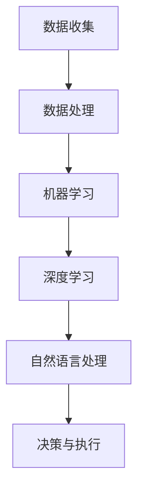

                 

 在当今这个科技飞速发展的时代，我们看到了许多行业的繁荣和成长。然而，与此同时，我们也不得不面对一个残酷的事实：未来的经济环境可能将更加竞争激烈，那些曾经看似稳赚不赔的“暴利”行业可能会逐渐消失。那么，在这样一个大背景下，我们是否只能依靠辛苦努力来获得合理的收入呢？本文将围绕这一主题展开讨论。

## 关键词
- 经济趋势
- 收入模式
- 技术创新
- 人工智能
- 劳动力市场

## 摘要
本文将探讨未来经济环境中，技术革新对传统收入模式的影响。通过分析人工智能的崛起，我们探讨了劳动力市场的变化，并提出了一些应对策略，以帮助读者在未来的经济浪潮中保持竞争力。

## 1. 背景介绍
在过去的几十年里，我们见证了信息技术的革命性变革。互联网、智能手机、社交媒体等技术的普及，极大地改变了我们的生活方式和工作方式。随着这些技术的发展，一些行业迅速崛起，成为高收入领域的代表。例如，互联网行业、科技公司和金融科技等，都因为技术的进步而获得了丰厚的回报。

然而，随着人工智能、大数据和区块链等新兴技术的出现，我们开始看到这些曾经的高收入行业正在发生巨大的变化。一方面，这些新技术正在颠覆传统的商业模式，使得一些行业变得日益自动化和智能化。另一方面，这些技术的应用也在逐步扩大，影响到更多的行业和领域。

## 2. 核心概念与联系
### 2.1 人工智能的定义与原理
人工智能（AI）是计算机科学的一个分支，旨在使计算机具备模拟人类智能的能力。其核心原理包括机器学习、深度学习、自然语言处理等。通过这些技术，计算机可以自主学习、做出决策和执行任务。

### 2.2 人工智能与经济的关系
人工智能对经济的影响是深远且多维的。首先，它极大地提高了生产效率，使得许多传统行业可以通过自动化和智能化来减少人力成本。其次，人工智能的应用推动了新兴产业的快速发展，如自动驾驶、智能家居和智能医疗等。然而，与此同时，人工智能也带来了劳动力市场的变革，使得一些工作岗位面临着被替代的风险。

### 2.3 人工智能的架构图
下面是一个简单的Mermaid流程图，展示了人工智能的基本架构：



## 3. 核心算法原理 & 具体操作步骤
### 3.1  算法原理概述
人工智能的核心在于算法，这些算法使计算机能够处理数据、学习规律并做出决策。常见的算法包括线性回归、支持向量机、决策树等。

### 3.2  算法步骤详解
人工智能的算法步骤通常包括以下几步：

1. 数据收集：收集大量相关数据，作为算法训练的基础。
2. 数据处理：对数据进行清洗、归一化和特征提取，以提高数据质量。
3. 模型训练：选择合适的算法，通过大量数据进行训练，使模型能够学习数据中的规律。
4. 模型评估：使用测试数据评估模型的效果，并进行调整和优化。
5. 决策与执行：将训练好的模型应用到实际场景中，做出决策和执行任务。

### 3.3  算法优缺点
每种算法都有其优缺点。例如，线性回归模型简单易懂，但可能无法处理非线性问题；支持向量机在处理高维数据时表现优异，但训练过程可能较慢。

### 3.4  算法应用领域
人工智能算法在众多领域都有广泛的应用，如图像识别、语音识别、自然语言处理、自动驾驶和医疗诊断等。

## 4. 数学模型和公式 & 详细讲解 & 举例说明
### 4.1  数学模型构建
在人工智能中，数学模型是非常重要的。常见的数学模型包括线性模型、概率模型和神经网络模型。

### 4.2  公式推导过程
以线性回归模型为例，其公式推导如下：

$$
Y = \beta_0 + \beta_1X + \epsilon
$$

其中，$Y$ 是因变量，$X$ 是自变量，$\beta_0$ 和 $\beta_1$ 是模型的参数，$\epsilon$ 是误差项。

### 4.3  案例分析与讲解
假设我们要预测房价，我们可以使用线性回归模型。通过收集大量房屋数据，我们可以得到以下模型：

$$
房价 = 100000 + 2000 \times 房屋面积
$$

这意味着，每增加一平方米的房屋面积，房价将增加2000元。

## 5. 项目实践：代码实例和详细解释说明
### 5.1  开发环境搭建
为了实践线性回归模型，我们需要搭建一个简单的Python环境。首先，我们需要安装Python和相关的库，如NumPy和Matplotlib。

### 5.2  源代码详细实现
以下是一个简单的线性回归模型的Python代码实现：

```python
import numpy as np
import matplotlib.pyplot as plt

# 数据集
X = np.array([1, 2, 3, 4, 5])
Y = np.array([2, 4, 5, 4, 5])

# 模型参数
beta_0 = 100000
beta_1 = 2000

# 预测函数
def predict(X, beta_0, beta_1):
    return beta_0 + beta_1 * X

# 训练数据
Y_pred = predict(X, beta_0, beta_1)

# 可视化
plt.scatter(X, Y)
plt.plot(X, Y_pred, color='red')
plt.show()
```

### 5.3  代码解读与分析
这段代码首先导入了必要的库，然后定义了一个简单的数据集。接着，我们定义了模型参数和预测函数。最后，我们使用训练数据来预测房价，并将预测结果可视化。

### 5.4  运行结果展示
运行上述代码，我们得到一个散点图，其中红色线条表示预测的房价。

## 6. 实际应用场景
### 6.1  金融行业
在金融行业中，人工智能被广泛应用于风险控制、投资分析和客户服务等方面。例如，通过机器学习模型，银行可以更好地预测贷款违约风险，从而提高贷款的审批效率。

### 6.2  制造业
在制造业中，人工智能主要用于生产优化、设备维护和产品质量检测。通过人工智能技术，企业可以降低生产成本，提高生产效率。

### 6.3  医疗保健
在医疗保健领域，人工智能可以帮助医生进行疾病诊断、治疗方案推荐和健康风险评估。例如，通过深度学习模型，人工智能可以分析患者的病历数据，提供个性化的治疗方案。

## 7. 未来应用展望
随着人工智能技术的不断进步，我们可以预见它将在更多领域得到应用。例如，在教育、农业、能源和环境等领域，人工智能都有巨大的潜力。

### 7.1  学习资源推荐
- 《深度学习》
- 《机器学习实战》
- 《人工智能：一种现代的方法》

### 7.2  开发工具推荐
- TensorFlow
- PyTorch
- Scikit-learn

### 7.3  相关论文推荐
- “Deep Learning for Natural Language Processing”
- “Recurrent Neural Networks for Language Modeling”
- “Large Scale Language Modeling in 2018”

## 8. 总结：未来发展趋势与挑战
### 8.1  研究成果总结
人工智能技术的快速发展已经深刻地改变了我们的经济和生活。在未来，我们可以预见人工智能将在更多领域得到应用，带来更多的机会和挑战。

### 8.2  未来发展趋势
未来，人工智能将继续在深度学习、自然语言处理、计算机视觉等领域取得突破。同时，我们也可以看到，人工智能与物联网、区块链等新兴技术的融合，将带来更多的创新和应用。

### 8.3  面临的挑战
尽管人工智能具有巨大的潜力，但我们也面临着一系列的挑战，如数据隐私、安全性和伦理问题。此外，人工智能的普及也可能导致劳动力市场的变革，对某些行业和职业造成冲击。

### 8.4  研究展望
在未来，我们需要继续深入研究人工智能的理论和技术，以解决面临的各种挑战。同时，我们也要关注人工智能的应用，推动其在各个领域的深入发展。

## 9. 附录：常见问题与解答
### Q: 人工智能是否会取代所有的工作？
A: 人工智能的发展确实对某些工作岗位造成了威胁，但同时也创造了新的工作岗位。例如，数据科学家、机器学习工程师等新兴职业，正因人工智能的发展而变得日益重要。

### Q: 人工智能是否会导致经济衰退？
A: 人工智能的普及可能会对某些行业造成冲击，但从长远来看，它将推动经济的增长。通过提高生产效率和创新，人工智能将为社会带来更多的价值。

### Q: 人工智能是否会影响隐私和安全？
A: 人工智能的应用确实可能带来隐私和安全问题。我们需要制定相应的法律法规和技术措施，确保人工智能的健康发展。

作者：禅与计算机程序设计艺术 / Zen and the Art of Computer Programming

----------------------------------------------------------------

以上是文章正文部分的完整内容。接下来，我们将继续按照文章结构模板的要求，完成文章的Markdown格式输出。

