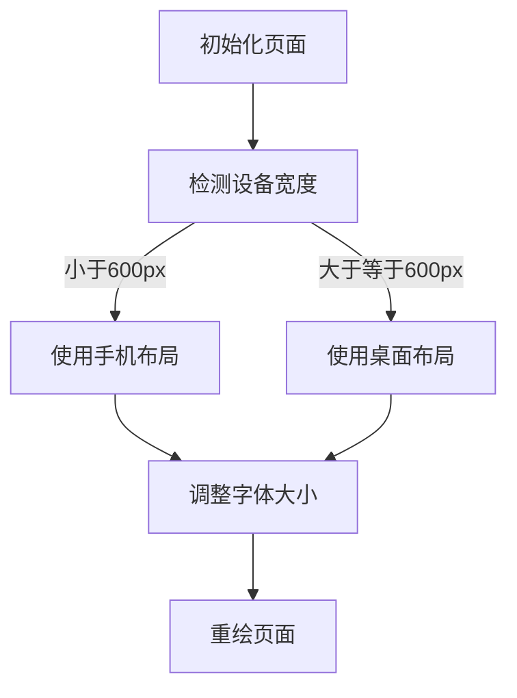

                 

关键词：响应式Web设计，流体布局，CSS3媒体查询，Bootstrap框架，移动端适配，跨设备兼容性，Web性能优化，用户体验

> 摘要：本文深入探讨了响应式Web设计（Responsive Web Design，RWD）的核心概念、关键技术和实现方法，通过详细的理论分析和实践案例，阐述了如何通过流体布局、CSS3媒体查询和Bootstrap框架等手段，实现Web页面的跨设备适配，提升用户体验和网站性能。

## 1. 背景介绍

随着移动互联网的迅速发展，用户获取信息的渠道日益多元化，各种尺寸的设备层出不穷，从传统的桌面电脑、笔记本电脑，到平板电脑、智能手机，甚至智能手表和智能眼镜。为了满足不同设备的访问需求，Web设计必须具备良好的响应式特性，即能够自动调整页面布局和内容，以适应各种屏幕尺寸和分辨率。

响应式Web设计的出现，是为了解决传统固定布局网站在多设备环境下面临的诸多问题，如页面显示不完整、内容错位、操作不便等。通过响应式设计，网站可以提供一致的用户体验，无论用户使用何种设备访问。

## 2. 核心概念与联系

### 2.1 流体布局

流体布局（Fluid Layout）是响应式Web设计的基础。它通过使用百分比而不是固定的像素值来定义布局元素的宽度，使布局能够根据屏幕尺寸自动缩放。流体布局能够确保页面在不同设备上保持一致性和可读性。

### 2.2 CSS3 媒体查询

CSS3媒体查询（Media Queries）是实现响应式设计的关键技术。通过媒体查询，开发者可以编写不同的CSS规则，根据设备的特性（如屏幕宽度、分辨率、方向等）来调整页面布局和样式。媒体查询的基本语法如下：

```css
@media screen and (max-width: 600px) {
  /* 在屏幕宽度小于600px时应用的样式 */
}
```

### 2.3 Bootstrap 框架

Bootstrap是一个流行的前端框架，提供了大量预先设计的响应式组件和样式，使得开发者能够快速构建响应式Web页面。Bootstrap采用了12列网格系统，通过简单的类名可以轻松实现布局调整。

### 2.4 Mermaid 流程图

为了更直观地展示响应式Web设计的流程，我们使用Mermaid绘制了一个简化的流程图：



## 3. 核心算法原理 & 具体操作步骤

### 3.1 算法原理概述

响应式Web设计的核心在于能够根据不同设备的屏幕尺寸动态调整页面布局。这通常涉及到以下几个步骤：

1. 初始页面布局：使用流体布局和CSS3媒体查询，为不同尺寸的设备定义不同的样式。
2. 设备检测：通过JavaScript或CSS3媒体查询检测当前设备的屏幕尺寸。
3. 布局调整：根据检测到的设备尺寸，调整页面元素的宽度、高度和排列方式。
4. 重绘页面：更新页面布局，以提供最佳的视觉效果和用户体验。

### 3.2 算法步骤详解

1. **初始化页面布局**：

   使用百分比和流体布局，定义页面的基本结构和元素。

   ```css
   .container {
     max-width: 100%;
     margin: 0 auto;
   }
   ```

2. **设备检测**：

   使用CSS3媒体查询，根据屏幕宽度应用不同的样式。

   ```css
   @media screen and (max-width: 768px) {
     .navbar-nav {
       flex-direction: column;
     }
   }
   ```

3. **布局调整**：

   根据屏幕尺寸调整元素的大小和排列。例如，在小屏幕设备上，将导航栏从水平排列改为垂直排列。

   ```javascript
   function adjustLayout() {
     if (window.innerWidth < 768) {
       $('.navbar-nav').removeClass('flex-row').addClass('flex-column');
     } else {
       $('.navbar-nav').removeClass('flex-column').addClass('flex-row');
     }
   }
   ```

4. **重绘页面**：

   每当窗口大小发生变化时，调用重绘函数，更新页面布局。

   ```javascript
   window.addEventListener('resize', adjustLayout);
   ```

### 3.3 算法优缺点

**优点**：

- **提高用户体验**：通过自动调整页面布局，提供一致的用户体验，无论用户使用何种设备。
- **降低开发成本**：避免为每种设备编写单独的代码，节省时间和资源。

**缺点**：

- **性能开销**：频繁的检测和调整可能导致性能开销。
- **兼容性问题**：不同的设备和浏览器可能对媒体查询的支持不一致。

### 3.4 算法应用领域

响应式Web设计适用于几乎所有类型的网站，尤其是电子商务、博客、新闻门户等，这些网站需要确保在不同设备上提供一致的浏览体验。

## 4. 数学模型和公式 & 详细讲解 & 举例说明

### 4.1 数学模型构建

在响应式Web设计中，可以使用线性代数构建数学模型。假设一个页面包含多个元素，每个元素都有其宽度、高度和位置。通过矩阵变换，可以实现元素在不同屏幕尺寸下的布局调整。

### 4.2 公式推导过程

令 \(W\) 和 \(H\) 分别为元素的原始宽度和高度，\(w\) 和 \(h\) 为调整后的宽度和高度，则：

\[ w = \frac{W}{scale} \]
\[ h = \frac{H}{scale} \]

其中，\(scale\) 为屏幕尺寸的比例因子。

### 4.3 案例分析与讲解

假设一个元素原始宽度为600像素，高度为400像素，屏幕宽度为360像素。则比例因子 \(scale = \frac{360}{600} = 0.6\)。调整后的宽度和高度分别为：

\[ w = \frac{600}{0.6} = 1000 \]
\[ h = \frac{400}{0.6} = 666.67 \]

这表明，在屏幕宽度为360像素时，元素的宽度调整为1000像素，高度调整为666.67像素，从而适应小屏幕设备。

## 5. 项目实践：代码实例和详细解释说明

### 5.1 开发环境搭建

本文使用HTML、CSS和JavaScript进行响应式Web设计，开发环境为Visual Studio Code，代码版本控制使用Git。

### 5.2 源代码详细实现

以下是一个简单的响应式Web设计实例：

```html
<!DOCTYPE html>
<html lang="en">
<head>
  <meta charset="UTF-8">
  <meta name="viewport" content="width=device-width, initial-scale=1.0">
  <title>响应式Web设计示例</title>
  <link rel="stylesheet" href="styles.css">
</head>
<body>
  <header>
    <h1>响应式Web设计示例</h1>
    <nav>
      <ul>
        <li><a href="#">首页</a></li>
        <li><a href="#">关于我们</a></li>
        <li><a href="#">服务</a></li>
        <li><a href="#">联系</a></li>
      </ul>
    </nav>
  </header>
  <main>
    <section>
      <h2>欢迎访问我们的网站</h2>
      <p>这是一个响应式Web设计的示例，适用于各种设备。</p>
    </section>
  </main>
  <footer>
    <p>版权所有 &copy; 2023</p>
  </footer>
  <script src="script.js"></script>
</body>
</html>
```

```css
/* styles.css */
body {
  margin: 0;
  padding: 0;
  font-family: Arial, sans-serif;
}

header {
  background-color: #333;
  color: #fff;
  padding: 20px;
}

nav ul {
  list-style: none;
  padding: 0;
}

nav ul li {
  display: inline-block;
  margin-right: 20px;
}

nav ul li a {
  color: #fff;
  text-decoration: none;
}

main {
  padding: 20px;
}

section {
  margin-bottom: 20px;
}

footer {
  background-color: #333;
  color: #fff;
  text-align: center;
  padding: 20px;
}
```

```javascript
// script.js
function adjustLayout() {
  const screenWidth = window.innerWidth;
  if (screenWidth < 768) {
    document.querySelector('nav ul').classList.add('mobile');
  } else {
    document.querySelector('nav ul').classList.remove('mobile');
  }
}

window.addEventListener('resize', adjustLayout);
```

### 5.3 代码解读与分析

- **HTML**：定义了页面的基本结构，包括头部、导航栏、主要内容区域和页脚。
- **CSS**：应用了响应式样式，使用媒体查询定义了不同屏幕尺寸下的布局和样式。
- **JavaScript**：监听窗口大小变化事件，调整导航栏的布局，以适应不同屏幕尺寸。

### 5.4 运行结果展示

在桌面浏览器上，导航栏采用水平排列；在移动设备上，导航栏自动转换为垂直排列，以适应小屏幕设备。

## 6. 实际应用场景

响应式Web设计广泛应用于各种类型的网站，如电子商务、新闻门户、博客、社交媒体等。以下是一些实际应用场景：

- **电子商务网站**：确保商品展示在不同设备上保持一致性和可操作性。
- **新闻门户**：提供清晰的阅读体验，无论用户使用何种设备。
- **博客**：保持文章排版和阅读体验的统一性。
- **社交媒体**：适应各种屏幕尺寸，提供便捷的交互体验。

## 7. 工具和资源推荐

### 7.1 学习资源推荐

- 《响应式Web设计：HTML5和CSS3实战》
- 《CSS3揭秘》
- 《HTML5与CSS3权威指南》

### 7.2 开发工具推荐

- Visual Studio Code：强大的代码编辑器，支持多种编程语言。
- Bootstrap：流行的前端框架，提供大量响应式组件和样式。

### 7.3 相关论文推荐

- "Responsive Web Design: What It Is and How to Do It Right" by Ethan Marcotte
- "Designing for Different Devices: A Practical Guide to Responsive Web Design" by Smashing Magazine

## 8. 总结：未来发展趋势与挑战

### 8.1 研究成果总结

响应式Web设计已成为Web开发的标准实践，通过流体布局、CSS3媒体查询和Bootstrap框架等技术，实现了跨设备的良好兼容性。研究成果表明，响应式设计能够显著提升用户体验和网站性能。

### 8.2 未来发展趋势

随着5G、人工智能和物联网等技术的发展，响应式Web设计将继续演进。未来可能会出现更加智能的响应式布局算法，以及更加高效的设计工具和框架。

### 8.3 面临的挑战

- **性能优化**：如何在保证响应式设计的同时，优化页面性能，降低加载时间。
- **兼容性问题**：确保不同设备和浏览器的兼容性。
- **用户体验**：如何在不同设备上提供一致且优秀的用户体验。

### 8.4 研究展望

未来的研究将关注于开发更加智能、高效的响应式布局算法，以及探索新的设计方法和工具，以适应不断变化的技术环境。

## 9. 附录：常见问题与解答

### 问题1：响应式Web设计与移动端适配有什么区别？

**解答**：响应式Web设计（RWD）是移动端适配的一种方法，但它更广泛，不仅关注移动端，还包括桌面、平板等多种设备。移动端适配通常指的是为移动设备优化网站设计，而响应式Web设计则是针对所有设备提供一致的用户体验。

### 问题2：如何优化响应式Web设计的性能？

**解答**：优化响应式Web设计的性能可以从以下几个方面入手：

- **减少HTTP请求**：合并CSS和JavaScript文件，使用内容分发网络（CDN）。
- **压缩资源**：使用Gzip压缩CSS和JavaScript文件。
- **懒加载**：延迟加载图像和其他资源，仅在需要时加载。
- **使用响应式图片**：根据屏幕尺寸加载不同分辨率的图片。

## 作者署名

本文作者：禅与计算机程序设计艺术 / Zen and the Art of Computer Programming

