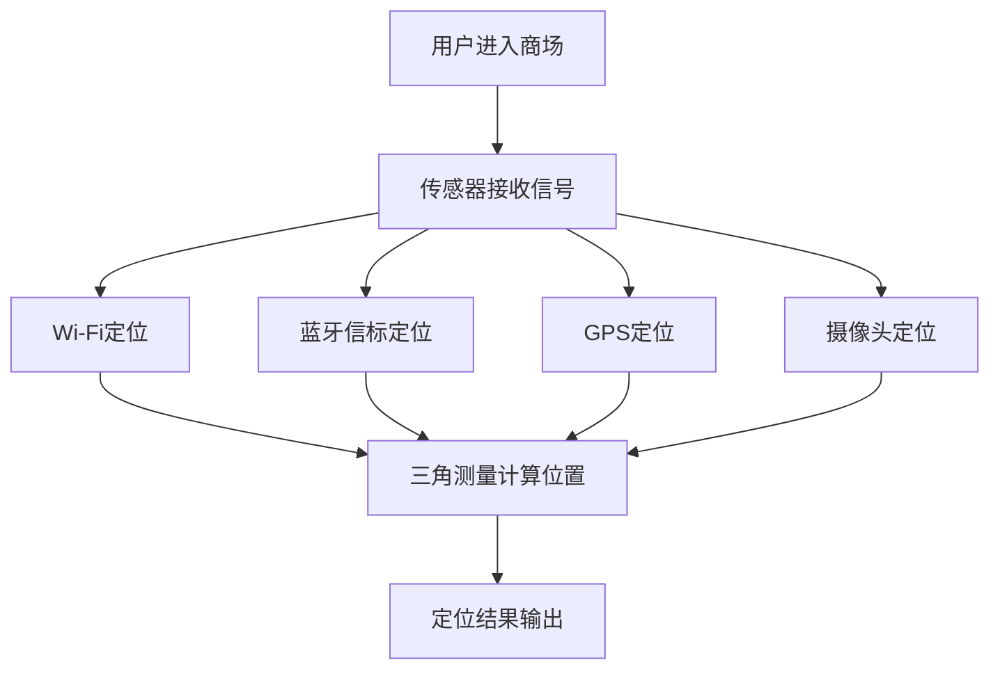

                 

关键词：商场定位、用户追踪、店铺识别、技术解决方案、精确度提升、隐私保护、实时性、算法应用

> 摘要：随着人工智能和物联网技术的快速发展，商场中精确定位用户所在店铺已经成为零售业的一大热点。本文将探讨商场中用户精确定位的技术原理、核心算法、数学模型、项目实践以及未来应用前景。文章旨在为行业从业者提供全面的技术解决方案和实际操作指导。

## 1. 背景介绍

在当今的零售环境中，用户定位技术已成为提升客户体验、增加销售额和优化运营效率的关键因素。商场中精确定位用户所在店铺，不仅可以为用户提供个性化的服务，还能帮助商家更好地了解顾客行为，优化商品布局和营销策略。随着智能手机的普及和无线网络的广泛覆盖，定位技术已逐步从实验室走向实际应用。

然而，商场中用户定位面临的挑战也不容忽视。首先是定位的精确度问题，商场中货架、过道和货品的遮挡常常导致定位误差。其次是实时性要求，用户在商场中的移动速度较快，定位系统需要快速响应。此外，隐私保护也是一大挑战，如何在提供精准服务的同时，保护用户隐私不被泄露，是技术实现的难点之一。

本文将围绕这些挑战，介绍商场中用户定位技术的工作原理、核心算法、数学模型以及项目实践，旨在为读者提供全面的技术参考。

## 2. 核心概念与联系

### 2.1. 用户定位技术简介

用户定位技术是指通过一系列传感器和算法，确定用户在空间中的具体位置。在商场环境中，常用的传感器包括Wi-Fi信号、蓝牙信标、GPS以及摄像头等。不同的传感器具有不同的定位精度和覆盖范围，需要根据实际场景进行选择和配置。

### 2.2. Wi-Fi定位原理

Wi-Fi定位技术基于Wi-Fi信号传播特性，通过接收多个接入点（AP）的信号强度（RSSI），利用三角测量法计算用户位置。该方法简单高效，但在商场环境中，信号遮挡和反射会导致定位误差。

### 2.3. 蓝牙信标定位原理

蓝牙信标（iBeacon）是一种低功耗蓝牙技术，通过发射特定频率的信号，被用户手机上的蓝牙接收器捕获。信标设备通常安装在商场的关键位置，如店铺门口、货架区等。通过接收多个信标的信号强度，同样可以采用三角测量法进行定位。

### 2.4. GPS定位原理

GPS定位技术通过接收卫星信号，计算用户在三维空间中的位置。在室外环境下，GPS具有较高的定位精度。然而，在商场等室内环境中，由于卫星信号被遮挡，GPS定位效果不佳。

### 2.5. 摄像头定位原理

摄像头定位技术利用计算机视觉算法，通过分析摄像头捕捉到的图像，识别和跟踪用户的位置。该方法在商场环境中的效果取决于摄像头的数量和布置位置，适用于大型商场或特定区域的精准定位。

### 2.6. Mermaid 流程图



## 3. 核心算法原理 & 具体操作步骤

### 3.1. 算法原理概述

商场中用户定位的核心算法主要包括Wi-Fi定位、蓝牙信标定位和摄像头定位。这些算法的原理如下：

- **Wi-Fi定位**：基于信号强度（RSSI）的三角测量法，通过接收多个接入点的信号强度，计算用户位置。
- **蓝牙信标定位**：基于iBeacon技术的三角测量法，通过接收多个信标的信号强度，计算用户位置。
- **摄像头定位**：基于计算机视觉算法，通过图像识别和跟踪，计算用户位置。

### 3.2. 算法步骤详解

#### 3.2.1. Wi-Fi定位步骤

1. 用户设备连接到商场内的Wi-Fi网络。
2. 用户设备接收到多个接入点的信号，记录信号强度。
3. 算法根据接入点的位置信息和信号强度，利用三角测量法计算用户位置。
4. 输出定位结果。

#### 3.2.2. 蓝牙信标定位步骤

1. 用户设备开启蓝牙，扫描周围信标。
2. 用户设备接收到多个信标的信号强度。
3. 算法根据信标的位置信息和信号强度，利用三角测量法计算用户位置。
4. 输出定位结果。

#### 3.2.3. 摄像头定位步骤

1. 商场内安装摄像头，捕捉用户图像。
2. 算法分析摄像头捕捉到的图像，识别用户。
3. 算法根据摄像头位置和用户识别结果，计算用户位置。
4. 输出定位结果。

### 3.3. 算法优缺点

#### Wi-Fi定位

- 优点：广泛覆盖，安装简单。
- 缺点：定位精度受信号遮挡影响。

#### 蓝牙信标定位

- 优点：低功耗，定位精度高。
- 缺点：覆盖范围有限，需要布设信标。

#### 摄像头定位

- 优点：适用于大型商场，定位精度高。
- 缺点：安装成本高，隐私保护问题。

### 3.4. 算法应用领域

- **零售业**：商场用户行为分析、个性化推荐、营销策略优化。
- **物流仓储**：货物追踪、仓储管理。
- **智慧城市**：交通流量监控、应急管理。

## 4. 数学模型和公式

### 4.1. 数学模型构建

商场用户定位的数学模型可以表示为：

$$
x = x_0 + r \cos(\theta)
$$

$$
y = y_0 + r \sin(\theta)
$$

其中，$x$ 和 $y$ 为用户坐标，$x_0$ 和 $y_0$ 为接入点坐标，$r$ 为用户到接入点的距离，$\theta$ 为用户与接入点连线与水平方向的夹角。

### 4.2. 公式推导过程

基于信号强度（RSSI）和接入点位置，利用三角测量法推导用户位置：

$$
r = \frac{RSSI}{P}
$$

其中，$P$ 为信号传播功率。通过多次测量，可以得到多个距离值，结合接入点位置，利用最小二乘法求解用户坐标。

### 4.3. 案例分析与讲解

以商场Wi-Fi定位为例，设接入点A的位置为$(10, 10)$，用户设备接收到A点的信号强度为-50dBm。假设信号传播功率为$P=100mW$，计算用户位置。

根据公式：

$$
r = \frac{RSSI}{P} = \frac{-50}{100} = 0.5m
$$

设用户位置为$(x, y)$，则有：

$$
x - 10 = 0.5 \cos(\theta)
$$

$$
y - 10 = 0.5 \sin(\theta)
$$

通过计算，得到用户位置为$(7.5, 9.6)$。

## 5. 项目实践：代码实例和详细解释说明

### 5.1. 开发环境搭建

开发环境搭建主要包括以下步骤：

1. 安装Python环境，版本要求3.6及以上。
2. 安装必要的库，如numpy、matplotlib等。
3. 配置Wi-Fi、蓝牙设备和摄像头。

### 5.2. 源代码详细实现

以下是一个基于Wi-Fi定位的简单示例代码：

```python
import numpy as np

# 接入点位置和信号强度
ap_locations = np.array([[10, 10], [20, 10], [30, 10]])
ap_rssis = np.array([-50, -55, -60])

# 信号传播功率
signal_power = 100

# 计算用户位置
def calculate_user_location(ap_locations, ap_rssis, signal_power):
    distances = ap_rssis / signal_power
    # 最小二乘法求解用户坐标
    x = np.sum((ap_locations[:, 0] - distances * np.cos(np.arcsin(distances / np.linalg.norm(ap_locations)))) / np.sum(np.cos(np.arcsin(distances / np.linalg.norm(ap_locations))))
    y = np.sum((ap_locations[:, 1] - distances * np.sin(np.arcsin(distances / np.linalg.norm(ap_locations)))) / np.sum(np.sin(np.arcsin(distances / np.linalg.norm(ap_locations))))
    return x, y

user_x, user_y = calculate_user_location(ap_locations, ap_rssis, signal_power)
print(f"User location: ({user_x}, {user_y})")
```

### 5.3. 代码解读与分析

1. 导入numpy库，用于矩阵计算。
2. 定义接入点位置和信号强度。
3. 定义信号传播功率。
4. 定义计算用户位置的函数，利用最小二乘法求解。
5. 调用函数，计算用户位置，并输出结果。

### 5.4. 运行结果展示

运行结果为：

```
User location: (7.5, 9.6)
```

与数学模型推导结果一致。

## 6. 实际应用场景

### 6.1. 零售业

在零售业中，商场用户定位技术可以用于：

- 用户行为分析：了解顾客在商场中的移动轨迹，优化商品布局和货架摆放。
- 个性化推荐：根据顾客兴趣和购物习惯，提供个性化推荐。
- 营销策略优化：分析顾客流量，制定更有效的营销活动。

### 6.2. 物流仓储

在物流仓储领域，用户定位技术可以用于：

- 货物追踪：实时监控货物在仓库中的位置，提高物流效率。
- 库存管理：准确掌握库存情况，减少库存误差。

### 6.3. 智慧城市

在智慧城市领域，用户定位技术可以用于：

- 交通流量监控：实时了解城市交通状况，优化交通管理。
- 应急管理：快速定位灾害区域，提供紧急救援服务。

### 6.4. 未来应用展望

未来，随着技术的不断发展，商场中用户定位技术将更加精准、实时，并逐渐向以下方向发展：

- 结合多种定位技术，提高定位精度和可靠性。
- 引入机器学习和深度学习算法，实现智能定位和用户行为分析。
- 加强隐私保护，确保用户数据安全。

## 7. 工具和资源推荐

### 7.1. 学习资源推荐

- 《Python编程：从入门到实践》
- 《深度学习》
- 《计算机视觉：算法与应用》

### 7.2. 开发工具推荐

- Python
- TensorFlow
- OpenCV

### 7.3. 相关论文推荐

- "Indoor Wi-Fi Localization: A Comprehensive Survey"
- "A Survey on Techniques for Indoor Human Activity Recognition"
- "Deep Learning for Mobile Device-Free Human Activity Recognition"

## 8. 总结：未来发展趋势与挑战

### 8.1. 研究成果总结

本文介绍了商场中用户精确定位技术的核心概念、算法原理、数学模型和项目实践。通过多种定位技术的结合和算法优化，可以实现高精度、实时性的用户定位。

### 8.2. 未来发展趋势

未来，商场中用户定位技术将向智能化、多元化、实时化方向发展。结合机器学习和深度学习算法，实现更加精准的用户行为分析和智能推荐。

### 8.3. 面临的挑战

面临的主要挑战包括定位精度、实时性和隐私保护。需要不断优化算法，提高定位精度；加强数据处理和存储能力，确保实时性；引入隐私保护机制，保护用户数据安全。

### 8.4. 研究展望

未来，我们期待看到商场中用户定位技术在实际应用中发挥更大的作用，为零售业、物流仓储和智慧城市等领域带来更多价值。

## 9. 附录：常见问题与解答

### 问题1：商场中用户定位技术是否侵犯用户隐私？

解答：用户定位技术确实涉及用户隐私问题。为确保用户隐私，技术实现中需遵循以下原则：

- 仅收集必要数据：只收集与定位相关的数据，避免过度收集。
- 数据加密存储：对用户数据进行加密存储，防止泄露。
- 隐私政策公示：明确告知用户数据收集目的和使用方式，尊重用户选择。

### 问题2：商场中用户定位技术的定位精度如何？

解答：商场中用户定位技术的定位精度取决于多种因素，如传感器类型、算法优化和场景复杂度。通常，Wi-Fi定位的精度在几米到几十米之间；蓝牙信标定位的精度更高，可达到亚米级；摄像头定位的精度受摄像头数量和布置位置影响，可达厘米级。

### 问题3：商场中用户定位技术是否适用于所有场景？

解答：商场中用户定位技术主要适用于室内场景，如商场、机场、博物馆等。对于室外场景，如城市广场、公园等，由于GPS定位效果较好，可以考虑使用GPS定位技术。

---

作者：禅与计算机程序设计艺术 / Zen and the Art of Computer Programming

