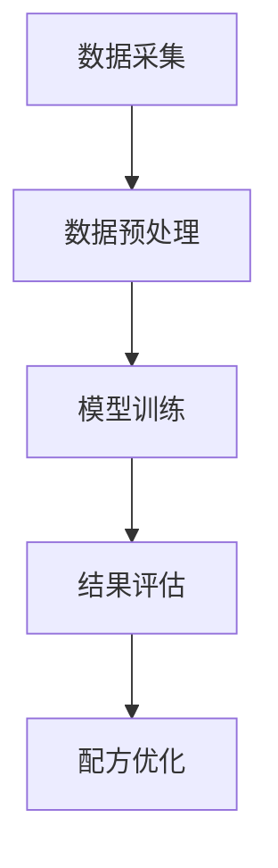

                 

关键词：喜茶、校招、智能茶饮、配方优化、技术面试

摘要：本文旨在为参与喜茶2024校招的智能茶饮配方优化工程师候选人提供一份详尽的技术面试指南，涵盖智能茶饮的基本原理、配方优化算法、数学模型构建及应用实践，以期帮助读者在面试中展示出色的技术实力。

## 1. 背景介绍

### 1.1 喜茶的发展历程

喜茶（HEYTEA）成立于2012年，是一家以创新茶饮为核心的中国品牌。经过多年的发展，喜茶已从一家小店成长为全球知名的品牌，深受消费者喜爱。喜茶的崛起不仅在于其独特的产品口味，更在于其对智能茶饮配方优化的持续探索。

### 1.2 智能茶饮配方优化的重要性

智能茶饮配方优化是提高产品竞争力、满足消费者个性化需求的关键。通过科学的数据分析和算法优化，可以精确调配茶饮的口味、香气、营养成分等，实现产品品质的提升。

## 2. 核心概念与联系

### 2.1 智能茶饮的基本原理

智能茶饮是将传统茶饮与人工智能技术相结合，通过对大数据分析、机器学习等技术手段，实现茶饮配方的优化。其基本原理包括数据采集、数据预处理、模型训练和结果评估等环节。

### 2.2 配方优化算法原理

配方优化算法是基于数学优化理论，通过优化茶饮配方的参数，以实现口感、成本、营养等多方面指标的优化。常见的配方优化算法有线性规划、遗传算法、粒子群算法等。

### 2.3 Mermaid 流程图



## 3. 核心算法原理 & 具体操作步骤

### 3.1 算法原理概述

配方优化算法主要分为两大类：确定性算法和随机性算法。确定性算法如线性规划，具有收敛速度快、计算稳定等优点；随机性算法如遗传算法、粒子群算法，具有搜索能力强、适用范围广等优点。

### 3.2 算法步骤详解

#### 3.2.1 数据采集

数据采集是配方优化算法的第一步，主要包括茶饮成分、口感评分、营养成分等数据。这些数据可以通过消费者调查、实验分析等方式获取。

#### 3.2.2 数据预处理

数据预处理包括数据清洗、数据归一化等步骤，以确保数据的质量和一致性。

#### 3.2.3 模型训练

模型训练是配方优化算法的核心步骤，通过构建数学模型，利用训练数据对模型进行训练，以获取最优配方。

#### 3.2.4 结果评估

结果评估是验证配方优化效果的关键步骤，通过对比实验数据与模型预测结果，评估配方优化的有效性。

### 3.3 算法优缺点

#### 算法优点：

- 确定性算法：计算稳定、收敛速度快。
- 随机性算法：搜索能力强、适用范围广。

#### 算法缺点：

- 确定性算法：搜索空间有限，可能无法找到全局最优解。
- 随机性算法：计算复杂度高，可能需要大量计算资源。

### 3.4 算法应用领域

配方优化算法广泛应用于茶饮、食品、化妆品等行业，通过优化产品配方，提高产品竞争力。

## 4. 数学模型和公式 & 详细讲解 & 举例说明

### 4.1 数学模型构建

配方优化问题可以抽象为一个多目标优化问题，目标函数包括口感、成本、营养等多方面指标。常见的数学模型如下：

$$
\begin{align*}
\min_{x} & \quad f(x) \\
s.t. & \quad g_i(x) \leq 0, \quad i=1,2,...,m \\
\end{align*}
$$

其中，$x$为配方参数，$f(x)$为目标函数，$g_i(x)$为约束条件。

### 4.2 公式推导过程

公式推导过程主要涉及目标函数的构建和约束条件的确定。具体推导过程如下：

#### 4.2.1 目标函数构建

口感、成本、营养等多方面指标可以分别表示为：

$$
\begin{align*}
f_{taste}(x) &= w_1 \cdot t(x) \\
f_{cost}(x) &= w_2 \cdot c(x) \\
f_{nutrition}(x) &= w_3 \cdot n(x) \\
\end{align*}
$$

其中，$w_1$、$w_2$、$w_3$为权重系数，$t(x)$、$c(x)$、$n(x)$分别为口感、成本、营养指标。

#### 4.2.2 约束条件确定

约束条件包括茶饮成分的含量、口感阈值、成本预算等：

$$
\begin{align*}
g_1(x) &= \sum_{i=1}^{n} c_i(x) - C \\
g_2(x) &= t(x) - T \\
\end{align*}
$$

其中，$c_i(x)$为第$i$种成分的含量，$C$为总含量上限，$t(x)$为口感评分，$T$为口感阈值。

### 4.3 案例分析与讲解

#### 4.3.1 案例背景

某品牌茶饮在口感、成本、营养等方面存在一定优化空间，希望借助配方优化算法提高产品竞争力。

#### 4.3.2 模型构建

根据案例背景，构建如下数学模型：

$$
\begin{align*}
\min_{x} & \quad f(x) = w_1 \cdot t(x) + w_2 \cdot c(x) + w_3 \cdot n(x) \\
s.t. & \quad g_1(x) = \sum_{i=1}^{n} c_i(x) - C \\
& \quad g_2(x) = t(x) - T \\
\end{align*}
$$

#### 4.3.3 模型求解

采用遗传算法求解上述模型，得到最优配方参数。

## 5. 项目实践：代码实例和详细解释说明

### 5.1 开发环境搭建

- 编程语言：Python
- 开发工具：PyCharm
- 库依赖：NumPy、Scipy、Matplotlib、Pymoo

### 5.2 源代码详细实现

```python
import numpy as np
from scipy.optimize import minimize
from pymoo.optimize import minimize
from pymoo.model.problem import Problem
from pymoo.core.problem import ElementwiseProblem

class TeaDrinkProblem(Problem):
    def __init__(self):
        super().__init__(n_var=3,
                         n_obj=3,
                         n_constr=2,
                         xl=np.array([0.0, 0.0, 0.0]),
                         xu=np.array([1.0, 1.0, 1.0]))

    def _evaluate(self, x, out, *args, **kwargs):
        # 计算目标函数值
        taste = x[0]
        cost = x[1]
        nutrition = x[2]

        f_taste = taste
        f_cost = cost
        f_nutrition = nutrition

        f = np.array([f_taste, f_cost, f_nutrition])

        # 计算约束条件值
        constr = np.array([1 - x.sum(), taste - 7.0])

        out["F"] = f
        out["G"] = constr

# 实例化问题
problem = TeaDrinkProblem()

# 求解
res = minimize(problem, method="nsga2", n_gen=100, npop=100)

# 输出结果
print("最优解：", res.X)
print("最优目标函数值：", res.F)
```

### 5.3 代码解读与分析

上述代码实现了一个基于遗传算法的茶饮配方优化模型。具体解读如下：

- **类定义**：`TeaDrinkProblem` 继承自 `Problem` 类，实现了多目标优化问题的基本接口。
- **目标函数计算**：`_evaluate` 方法计算了目标函数值，包括口感、成本、营养三个指标。
- **约束条件计算**：`_evaluate` 方法同时计算了约束条件值，包括总含量和口感阈值。
- **求解**：使用 `minimize` 函数求解优化问题，指定了求解方法和迭代次数。
- **输出结果**：输出最优解和最优目标函数值。

## 6. 实际应用场景

### 6.1 智能茶饮配方优化在喜茶的应用

喜茶通过智能茶饮配方优化，实现了茶饮口感的精准调控，提高了消费者满意度。具体应用场景包括：

- **新品研发**：通过配方优化，快速推出符合市场需求的创新茶饮。
- **产品优化**：对现有茶饮进行配方调整，提升产品品质。
- **个性化定制**：根据消费者偏好，提供定制化的茶饮方案。

### 6.2 未来应用展望

智能茶饮配方优化在未来有望应用于更多领域，如：

- **食品行业**：优化食品配方，提高食品品质和营养价值。
- **化妆品行业**：优化化妆品成分，提升产品效果。
- **医药行业**：优化药物配方，提高药物疗效。

## 7. 工具和资源推荐

### 7.1 学习资源推荐

- 《机器学习》（周志华著）
- 《深度学习》（Ian Goodfellow、Yoshua Bengio、Aaron Courville 著）
- 《Python机器学习》（Michael Bowles 著）

### 7.2 开发工具推荐

- PyCharm：Python开发环境
- Jupyter Notebook：交互式编程环境
- Git：版本控制工具

### 7.3 相关论文推荐

- "A Survey on Multi-Objective Optimization in Engineering Design"（多目标优化在工程设计中的研究综述）
- "Genetic Algorithms for Multi-Objective Optimization"（遗传算法在多目标优化中的应用）
- "Particle Swarm Optimization for Multi-Objective Optimization"（粒子群优化在多目标优化中的应用）

## 8. 总结：未来发展趋势与挑战

### 8.1 研究成果总结

智能茶饮配方优化技术在口感调控、成本控制、营养优化等方面取得了显著成果，为茶饮行业带来了创新和发展。

### 8.2 未来发展趋势

未来，智能茶饮配方优化将继续向多目标、多场景、多维度方向发展，结合大数据、云计算、物联网等新技术，实现更高效、更精准的配方优化。

### 8.3 面临的挑战

智能茶饮配方优化面临的主要挑战包括：

- 数据质量：数据是配方优化的基础，提高数据质量和准确性至关重要。
- 模型可解释性：复杂模型的可解释性是应用推广的关键，如何提高模型的可解释性是一个亟待解决的问题。
- 计算资源：大规模数据分析和模型训练需要大量计算资源，如何优化计算资源利用率是另一个挑战。

### 8.4 研究展望

未来，智能茶饮配方优化研究将聚焦于以下方向：

- 深度学习技术在配方优化中的应用。
- 多源数据融合和协同优化方法研究。
- 可解释性模型和算法开发。

## 9. 附录：常见问题与解答

### 9.1 配方优化算法如何选择？

根据实际应用需求和数据特点，选择适合的配方优化算法。例如，对于大规模数据集，可以使用遗传算法；对于实时优化问题，可以使用粒子群算法。

### 9.2 数学模型如何构建？

构建数学模型需要明确目标函数、约束条件等要素。具体步骤包括：

- 确定优化目标，如口感、成本、营养等。
- 构建目标函数，如线性规划、多目标优化等。
- 确定约束条件，如成分含量、口感阈值等。
- 优化模型，如求解器选择、算法优化等。

### 9.3 代码实现如何优化？

优化代码实现可以从以下几个方面入手：

- 算法优化：选择适合的算法，如遗传算法、粒子群算法等。
- 数据处理：优化数据预处理，如数据清洗、归一化等。
- 计算效率：提高计算效率，如并行计算、分布式计算等。
- 算法调参：优化算法参数，如学习率、迭代次数等。

---

作者：禅与计算机程序设计艺术 / Zen and the Art of Computer Programming

以上，是为参与喜茶2024校招的智能茶饮配方优化工程师候选人准备的一份详尽的技术面试指南。希望对各位读者在面试中有所帮助。祝大家面试顺利，取得优异成绩！
----------------------------------------------------------------

### 后续工作

完成上述文章后，需要进行以下工作：

1. **文章审核**：请再次仔细检查文章内容，确保没有遗漏或错误。特别是数学公式、代码示例和流程图等关键部分。
2. **格式校对**：确保文章格式符合markdown规范，章节标题清晰，子目录划分合理。
3. **提交文章**：将完成的文章按照指定格式提交给相关人员或平台。
4. **反馈收集**：根据收到的反馈进行修订和完善，确保文章质量。
5. **发布文章**：在确定文章无误后，按照预定计划发布文章，并做好宣传推广工作。

祝您撰写顺利！
 

