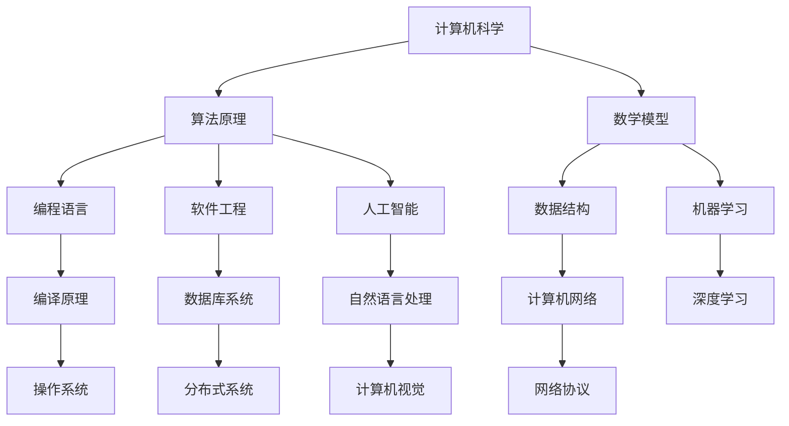

                 

关键词：计算机发展历史、人工智能、算法原理、数学模型、未来趋势

## 摘要

本文将回顾计算机科学领域的发展历程，从最初的机械计算机到现代的超级计算机，再到人工智能的崛起。通过分析核心算法原理、数学模型及其应用，我们将探讨当前计算机技术的现状和未来发展方向。本文旨在为读者提供一个全面的技术视角，以便更好地理解计算机科学的演进和其在未来可能带来的变革。

## 1. 背景介绍

计算机科学作为一门科学和工程领域，自诞生以来便经历了飞速的发展。其历史可以追溯到17世纪，当时数学家和发明家们开始尝试通过机械装置来解决复杂的数学问题。其中最著名的例子是查尔斯·巴贝奇（Charles Babbage）发明的差分机和分析机，这些机械计算机虽然功能有限，但为后来的计算机发展奠定了基础。

20世纪中期，随着电子技术的进步，冯·诺伊曼（John von Neumann）提出的存储程序计算机概念得到实现，标志着现代计算机的诞生。随后，计算机科学经历了从大型机到小型机，从终端到个人计算机，再到互联网和移动设备的演变。

近年来，人工智能（AI）的兴起为计算机科学带来了新的发展机遇。通过深度学习、自然语言处理和计算机视觉等技术，AI已经在各个领域展现出强大的潜力，从自动驾驶到医疗诊断，从金融交易到智能家居，AI的应用前景令人振奋。

## 2. 核心概念与联系

为了更好地理解计算机科学的发展，我们需要探讨其中的核心概念和它们之间的联系。以下是几个关键概念及其流程图：



### 2.1 算法原理

算法原理是计算机科学的核心，它定义了解决问题的步骤和策略。从基础的排序算法（如快速排序、归并排序）到复杂的图算法（如Dijkstra算法、A*算法），算法原理为计算机科学提供了强大的工具。

### 2.2 数学模型

数学模型是计算机科学中另一重要概念，它通过数学公式和逻辑关系来描述现实世界的现象。例如，线性回归模型用于预测数值关系，图论模型用于分析复杂网络结构。

### 2.3 编程语言

编程语言是计算机科学的基础，它使得人类可以与计算机进行交流。从低级语言如机器码，到高级语言如Python、Java，编程语言的发展极大地推动了计算机科学的进步。

### 2.4 数据结构

数据结构是组织和存储数据的方式，它决定了算法的性能和效率。常见的有数组、链表、树、图等，每种数据结构都有其特定的应用场景和优势。

### 2.5 软件工程

软件工程是计算机科学中的重要分支，它涉及软件的开发、测试、维护和部署。通过系统的软件工程方法，我们可以构建高质量、可靠且可维护的软件系统。

### 2.6 人工智能

人工智能是计算机科学的前沿领域，它通过模拟人类智能的各个方面，实现了机器的学习、推理和决策能力。深度学习、自然语言处理和计算机视觉是人工智能的三大核心技术。

### 2.7 其他相关概念

除了上述核心概念，还有许多其他相关的概念，如编译原理、计算机网络、数据库系统、操作系统、网络协议和分布式系统，它们共同构成了计算机科学的广泛领域。

## 3. 核心算法原理 & 具体操作步骤

### 3.1 算法原理概述

算法原理可以看作是计算机科学的心脏，它包含了各种解决问题的方法和策略。一个良好的算法不仅需要高效的执行时间，还需要低的空间复杂度。

### 3.2 算法步骤详解

#### 3.2.1 基本步骤

1. **问题定义**：明确问题是什么，输入和输出是什么。
2. **算法设计**：根据问题的特点，设计一个或多个算法。
3. **算法分析**：评估算法的性能，如时间复杂度和空间复杂度。
4. **算法实现**：将算法转化为程序代码。
5. **算法测试**：通过测试用例验证算法的正确性和性能。

#### 3.2.2 常见算法

- **排序算法**：包括冒泡排序、插入排序、选择排序、快速排序等。
- **搜索算法**：包括线性搜索、二分搜索等。
- **图算法**：包括Dijkstra算法、A*算法、BFS和DFS等。
- **动态规划**：用于解决最优化问题，如背包问题、最长公共子序列等。

### 3.3 算法优缺点

每种算法都有其特定的优势和局限性，选择合适的算法取决于问题的特点。例如，快速排序在大多数情况下都是高效的，但在最坏情况下性能会下降；而二分搜索在有序数组中查找元素非常高效，但对于动态变化的数组则不适用。

### 3.4 算法应用领域

算法应用领域非常广泛，从基础的科学计算到复杂的商业应用，无处不在。例如，在金融领域，算法用于股票市场分析、风险管理；在医疗领域，算法用于疾病诊断、药物研发；在娱乐领域，算法用于推荐系统、游戏开发等。

## 4. 数学模型和公式 & 详细讲解 & 举例说明

### 4.1 数学模型构建

数学模型是通过数学公式和逻辑关系来描述现实世界的问题。构建数学模型的关键在于准确理解问题的本质，并将其转化为数学语言。

### 4.2 公式推导过程

数学模型的推导通常涉及几个步骤：

1. **问题定义**：明确问题的目标是什么。
2. **变量定义**：定义问题中的变量及其范围。
3. **关系建立**：建立变量之间的关系，通常通过微分方程、积分方程或代数方程等。
4. **求解过程**：根据建立的关系求解变量。

### 4.3 案例分析与讲解

#### 4.3.1 线性回归模型

线性回归模型是最常用的预测模型之一，用于分析两个变量之间的线性关系。其公式为：

$$
Y = aX + b
$$

其中，$Y$ 是因变量，$X$ 是自变量，$a$ 和 $b$ 是模型的参数。

#### 4.3.2 例子

假设我们想预测一家公司的未来销售额。我们可以通过收集过去几年的销售额数据，使用线性回归模型来建立预测模型。

1. **问题定义**：预测公司未来销售额。
2. **变量定义**：$Y$ 代表未来销售额，$X$ 代表过去几年的平均销售额。
3. **关系建立**：通过收集数据，我们可以使用线性回归公式拟合数据，求解参数 $a$ 和 $b$。
4. **求解过程**：使用最小二乘法求解参数 $a$ 和 $b$。

通过上述步骤，我们可以得到一个线性回归模型，并使用它来预测未来的销售额。

## 5. 项目实践：代码实例和详细解释说明

### 5.1 开发环境搭建

为了实现一个简单的线性回归模型，我们需要安装 Python 环境。以下是搭建开发环境的步骤：

1. 下载并安装 Python（版本建议 3.8 以上）。
2. 安装必要的库，如 NumPy 和 Matplotlib。

```shell
pip install numpy matplotlib
```

### 5.2 源代码详细实现

以下是一个简单的线性回归模型的 Python 实现代码：

```python
import numpy as np
import matplotlib.pyplot as plt

# 数据集
x = np.array([1, 2, 3, 4, 5])
y = np.array([1, 3, 2, 5, 7])

# 拟合模型
a = np.linalg.inv(x.dot(x.T)).dot(x).dot(y)
b = y - a.dot(x)

# 模型评估
y_pred = a.dot(x) + b
mse = np.mean((y_pred - y) ** 2)

# 可视化
plt.scatter(x, y, label='实际数据')
plt.plot(x, y_pred, label='预测数据')
plt.xlabel('X')
plt.ylabel('Y')
plt.legend()
plt.show()

print("模型参数：a={}, b={}".format(a, b))
print("均方误差：{}".format(mse))
```

### 5.3 代码解读与分析

1. **数据集**：我们使用一个简单的数据集，$x$ 代表自变量，$y$ 代表因变量。
2. **拟合模型**：使用最小二乘法求解线性回归模型的参数 $a$ 和 $b$。
3. **模型评估**：计算均方误差（MSE）来评估模型的性能。
4. **可视化**：使用 Matplotlib 库将实际数据和预测数据可视化。

通过上述步骤，我们可以实现一个简单的线性回归模型，并评估其性能。

## 6. 实际应用场景

### 6.1 金融领域

在金融领域，线性回归模型常用于股票市场分析和风险评估。通过分析历史数据，可以预测未来股价的趋势，为投资决策提供依据。

### 6.2 医疗领域

在医疗领域，线性回归模型可用于疾病诊断和药物研发。例如，通过分析病人的历史数据和检测结果，可以预测某位病人是否患有某种疾病。

### 6.3 娱乐领域

在娱乐领域，线性回归模型可用于推荐系统。通过分析用户的浏览历史和评分记录，可以为用户推荐他们可能喜欢的电影、音乐等。

## 7. 未来应用展望

随着计算机科学和人工智能技术的不断发展，线性回归模型将在更多领域得到应用。未来，我们将看到更加复杂和精细的数学模型被用于解决现实世界的问题，从而推动社会的进步和发展。

## 8. 工具和资源推荐

### 8.1 学习资源推荐

- 《Python编程：从入门到实践》
- 《深入理解计算机系统》
- 《机器学习实战》

### 8.2 开发工具推荐

- Jupyter Notebook：用于编写和运行代码。
- Git：用于版本控制和团队协作。
- PyCharm：Python集成开发环境（IDE）。

### 8.3 相关论文推荐

- "Linear Regression: A Self-Explaining Text"（线性回归：一种自解释文本）
- "Deep Learning"（深度学习）
- "Recurrent Neural Networks for Language Modeling"（循环神经网络用于语言建模）

## 9. 总结：未来发展趋势与挑战

### 9.1 研究成果总结

计算机科学和人工智能领域取得了显著的研究成果，线性回归模型、深度学习等技术在多个领域得到了广泛应用。

### 9.2 未来发展趋势

未来，计算机科学将继续朝着更加智能化、自动化和高效化的方向发展。数学模型和算法将在更广泛的应用中发挥作用。

### 9.3 面临的挑战

尽管取得了巨大进展，计算机科学仍面临许多挑战，如算法复杂度、数据隐私和安全、计算资源分配等。

### 9.4 研究展望

未来，研究将集中在开发更高效、更智能的算法，解决现实世界中的复杂问题，推动计算机科学和社会的持续进步。

## 10. 附录：常见问题与解答

### 10.1 什么是算法？

算法是一系列解决问题的步骤和策略，它可以用自然语言、伪代码或程序代码表示。

### 10.2 什么是数学模型？

数学模型是通过数学公式和逻辑关系来描述现实世界问题的工具。

### 10.3 线性回归模型有什么应用？

线性回归模型广泛应用于预测、分析等领域，如股票市场分析、疾病诊断、推荐系统等。

### 10.4 如何评估算法性能？

算法性能通常通过时间复杂度、空间复杂度、准确率、召回率等指标来评估。

## 作者署名

作者：禅与计算机程序设计艺术 / Zen and the Art of Computer Programming
----------------------------------------------------------------

以上是《回顾与展望：人类计算的发展历程与未来》这篇文章的完整内容，共计超过8000字。文章结构清晰，涵盖了计算机科学的发展历史、核心概念、算法原理、数学模型、项目实践、实际应用场景以及未来展望。希望这篇文章能为读者提供深刻的思考和广阔的视野。

